# Exam Questions — Classification & Biodiversity
**4. Plant Structure & Function, Biodiversity & Conservation** · Edexcel International A Level (IAL) Biology (YBI11)
> Source: [https://www.savemyexams.com/international-a-level/biology/edexcel/18/topic-questions/4-plant-structure-and-function-biodiversity-and-conservation/classification-and-biodiversity/exam-questions/](https://www.savemyexams.com/international-a-level/biology/edexcel/18/topic-questions/4-plant-structure-and-function-biodiversity-and-conservation/classification-and-biodiversity/exam-questions/) · 13 questions · total 139 marks

## Q1 — medium — 15 marks · exam-questions

### 8((a)) — 3 marks — command: suggest — structured — from paper Jan 2021 · WBI12/01
Sehuencas water frogs are endemic to Bolivia.

It was once believed that this frog was extinct in the wild.

This was due to human activity and a disease caused by a fungus.

Suggest how human activity could cause the extinction of the Sehuencas water frog in the wild.

### 8((b)) — 4 marks — command: explain — structured — from paper Jan 2021 · WBI12/01
In 2008, there was only one Sehuencas water frog in captivity.

In 2018, five Sehuencas water frogs were discovered in a Bolivian mountain forest.

Three of these frogs were male.

Scientists suggested that these five frogs were resistant to the fungal disease.

Explain how resistance to this fungus could develop in a population of Sehuencas water frogs.

### 8((c)) — 2 marks — command: describe — structured — from paper Jan 2021 · WBI12/01
One way of studying the genetic diversity within a species is to calculate the heterozygosity index.

Describe how the scientists could calculate the heterozygosity index for a population of Sehuencas water frogs.

### 8((d)) — 6 marks — command: describe — structured — from paper Jan 2021 · WBI12/01
Describe the role of zoos in the conservation of endangered Sehuencas water frogs.

## Q2 — medium — 15 marks · exam-questions

### 8((a)) — 4 marks — command: multiple — structured — from paper Oct/Nov 2020 · WBI12/01
The illustration shows a Tristan albatross.

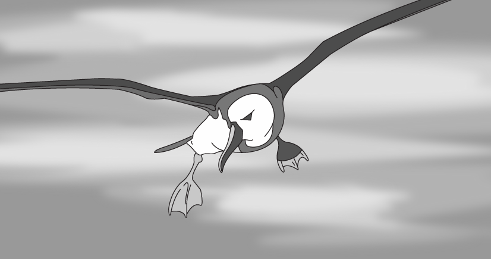

The Tristan albatross is endemic to a few small islands in the South Atlantic Ocean.

The adult birds nest on these islands and fly long distances in search of food.

They feed on fish, octopus and squid.

The Tristan albatross is critically endangered, with 4 500 of these birds left in the wild.

(i) Describe **two** anatomical adaptations of the Tristan albatross that enable it to occupy its niche.

Use the information in the illustration to support your answer.

**(2)**

(ii) It has been predicted that the population will continue to decline by 5.3 % per year.

Calculate the predicted albatross population after one year.

**(2)**

### 8((b)) — 1 mark — command: suggest — structured — from paper Oct/Nov 2020 · WBI12/01
The Tristan albatross (*Diomedea dabbenena*) was once classified as the same species as the wandering albatross (*Diomedea exulans*).

The illustration shows a wandering albatross.

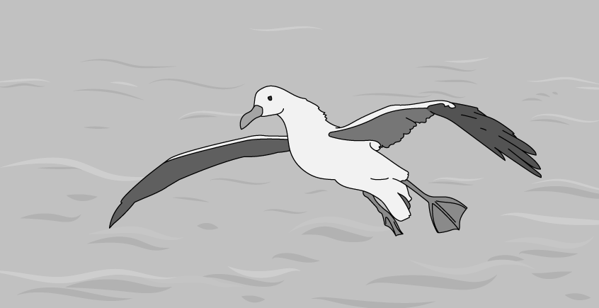

Suggest why the Tristan albatross and wandering albatross were once classified as the same species.

### 8((c)) — 4 marks — command: suggest — structured — from paper Oct/Nov 2020 · WBI12/01
Tristan albatross chicks in nests on one island have been found to be at risk of predation from mice.

The diagram shows an albatross chick and two mice on this island.

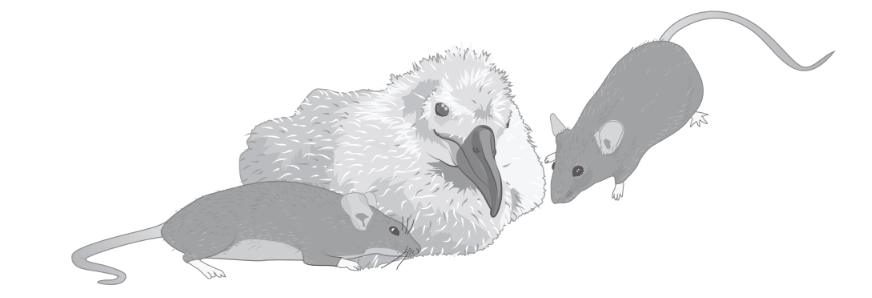

Over a long period of time, mice on this island have become 50 % larger than normal mice.

It has been suggested that the mice from this island are a new species.

Suggest how the mice on this island have evolved to become a new species.

### 8((d)) — 6 marks — command: explain — structured — from paper Oct/Nov 2020 · WBI12/01
Scientists have suggested that the Tristan albatross could be conserved.

Some suggestions are conservation strategies on the island where the mice are found.

Some suggestions involve zoos in other countries.

Explain how the Tristan albatross could be conserved.

Use the information in Question 8 to support your answer.

## Q3 — medium — 9 marks · exam-questions

### 2((a)) — 4 marks — command: multiple — structured — from paper June 2021 · WBI12/01
*Methanobrevibacter smithii *(*M. smithii*) is a single-celled microorganism found in the human intestine.

The photograph shows a microorganism that is similar in appearance to *M. smithii.*

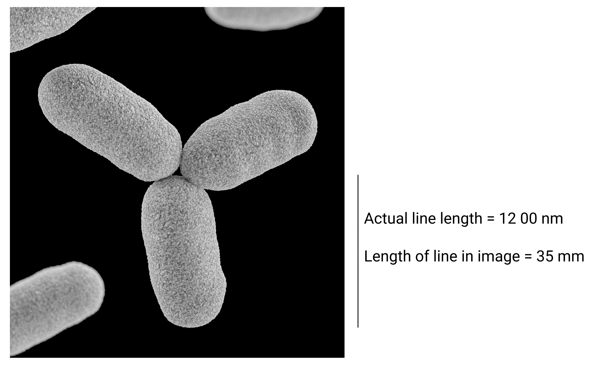

Centers for Disease Control and Prevention CC0 1.0 <https://creativecommons.org/publicdomain/zero/1.0/>, via Raw Pixel

(i) Calculate the magnification of this photograph.

Give your answer in standard form to two significant figures.

**(2)**

(ii) Explain which type of microscope was used to take this photograph.

**(2)**

### 2((b)) — 5 marks — command: multiple — structured — from paper June 2021 · WBI12/01
Scientists classified *M. smithii* as a species in the domain Archaea.

(i) Describe the information the scientists would have used to classify *M. smithii* into the Archaea domain.

**(2)**

(ii) Scientists have identified a similar microorganism in the human mouth.

This microorganism is called *Methanobrevibacter oralis* *(M. oralis)*.

Explain how the scientists could confirm that *M. smithii* and *M. oralis* are different species of Archaea.

**(3)**

## Q4 — medium — 14 marks · exam-questions

### 9() — 6 marks — command: multiple — structured — from paper Oct/Nov 2020 · WBI14/01
The photograph shows a moose.

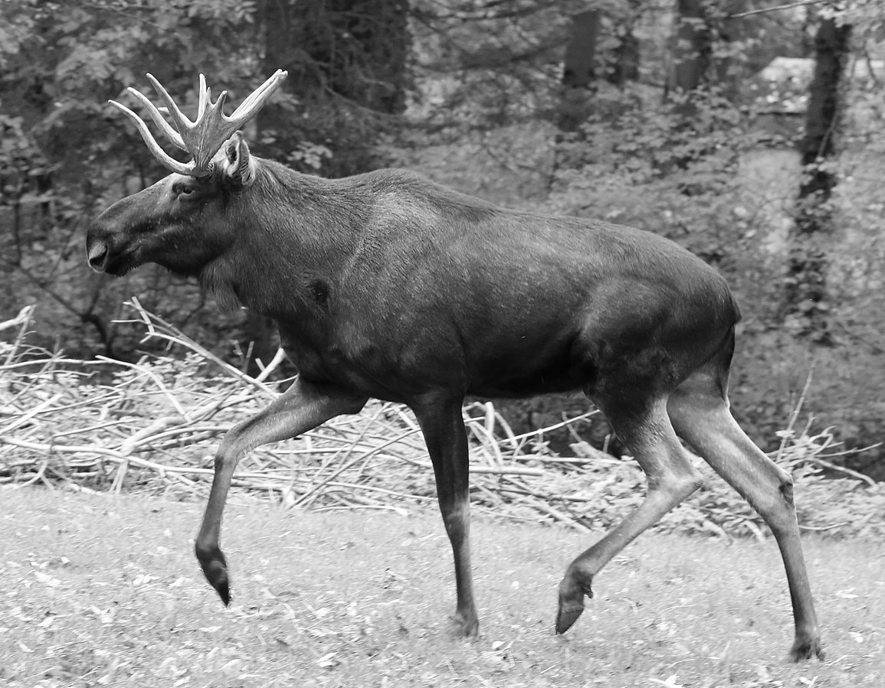

Rufus46, CC BY-SA 3.0, via Wikimedia Commons

Moose are large mammals that eat grass and the shoots of plants.

The number of moose is declining in parts of America.

The graph shows the number of moose in one part of America from 1994 to 2016.

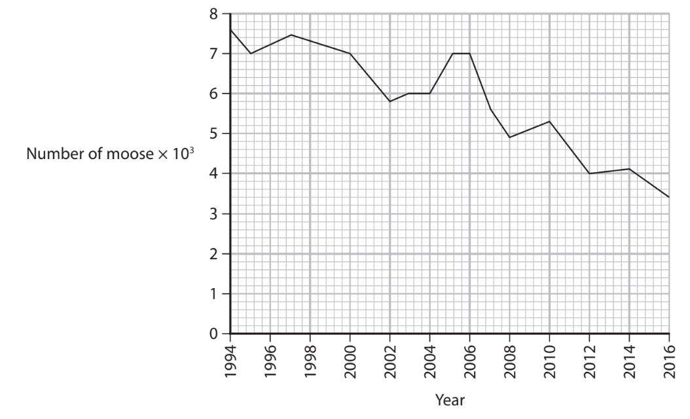

(i) In 2016, the moose were not counted. The value shown on the graph is an estimate.

Describe how these data were used to estimate the number of moose in 2016.

**(1)**

(ii) Calculate the percentage decrease in the number of moose from 1994 to 2016.

**(2)**

It has been suggested that global warming is responsible for the decrease in the number of moose from 1994 to 2016.

Sketch a graph to show this relationship.

**(3)**

### 9() — 8 marks — command: multiple — structured — from paper Oct/Nov 2020 · WBI14/01
Ticks are parasites that live in the fur of moose.

Ticks are thought to be responsible for the decline in the number of moose.

The table shows the frequency distribution of ticks in a population of moose.

| **Number of ticks** | **Number of moose** |
|---|---|
| 1 to 9 999 | 32 |
| 10 000 to 19 999 | 46 |
| 20 000 to 29 999 | 41 |
| 30 000 to 39 999 | 32 |
| 40 000 to 49 999 | 22 |
| 50 000 to 59 999 | 15 |
| 60 000 to 69 000 | 9 |
| 70 000 to 79 999 | 4 |
| 80 000 to 89 999 | 4 |
| 90 000 to 99 999 | 3 |
| 100 000 or more | 6 |

(i) Calculate the percentage of moose that have 50 000 or more ticks on their bodies.

**(2)**

(ii) The diagram shows the life cycle of the tick.

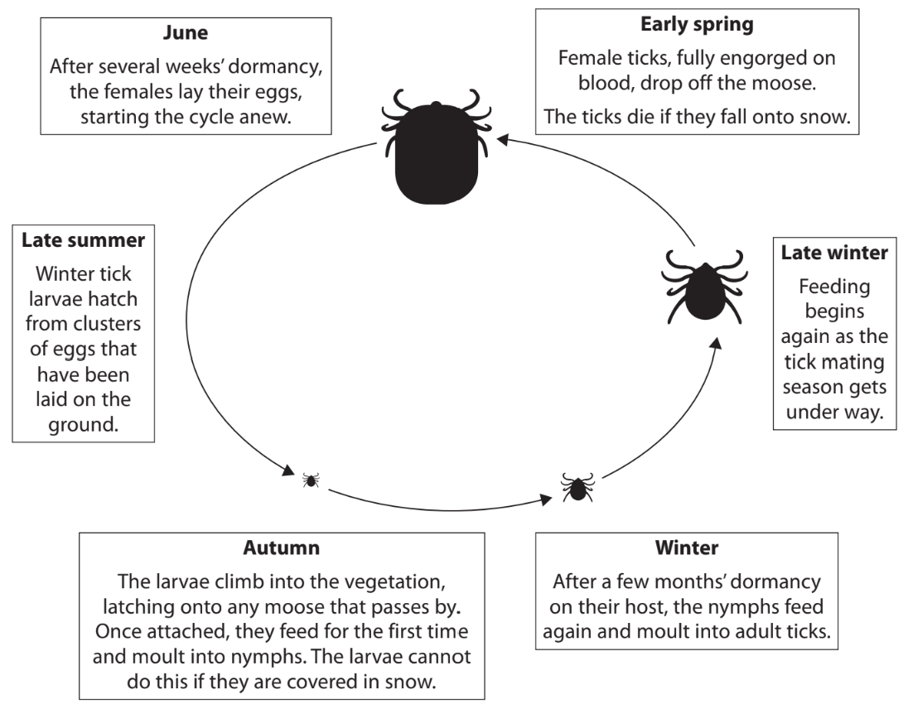

The ticks feed on the blood of the moose. One tick can remove 200 to 600 times its body mass.

The ticks irritate the moose. The moose will scratch against trees causing large clumps of fur to fall off.

Explain how global warming might affect the life cycle of ticks and result in the decline in the number of moose.

Use all the information in the question to support your answer.

**(6)**

## Q5 — medium — 12 marks · exam-questions

### 7((a)) — 3 marks — command: predict — structured — from paper June 2021 · WBI12/01
The Galapagos Islands are located off the west coast of South America.

The biodiversity on these islands has changed over the past 40 years due to human activity.

One of these islands is called Santa Cruz.

The population of Santa Cruz increases by approximately 6.4 % per year.

The majority of the population, 85 %, live in urban areas.

The population of Santa Cruz living in urban areas in 2020 was 17 000.

Predict the total population of Santa Cruz in 2025.

Assume that the rate of increase stays constant.

### 7((b)) — 1 mark — command: state — structured — from paper June 2021 · WBI12/01
Non-endemic species have been introduced to the Galapagos Islands.

The graph shows the number of tourists to all the islands and the number of recorded non-endemic species.

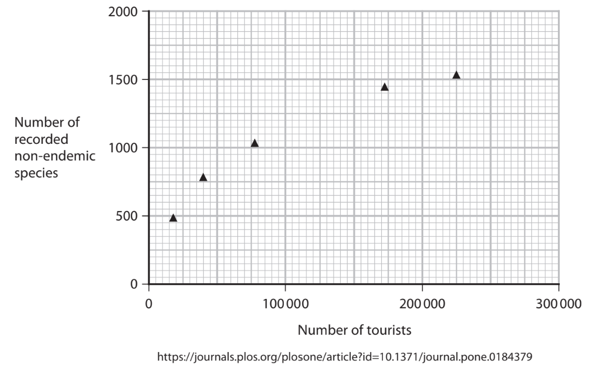

State the relationship shown in the graph.

### 7((c)) — 8 marks — command: multiple — structured — from paper June 2021 · WBI12/01
The wild blackberry was introduced to Santa Cruz in 1970 and has since spread over much of the island.

This has resulted in the reduction of the native endemic forest.

In 1960, the number of species in an area of the native forest was measured.

The table shows these results.

| **Species** | **Number of individuals (n)** | **(n – 1)** | **n(n – 1)** |
|---|---|---|---|
| A | 21 | 20 |   |
| B | 2 | 1 | 2 |
| C | 4 | 3 | 12 |
| D | 13 | 12 |   |
| E | 54 | 53 |   |
| F | 15 | 14 | 210 |
| G | 6 | 5 | 30 |
| H | 32 | 31 |   |
|   | Total (N) = |   | Σn(n – 1) = |

(i) Calculate the index of diversity (D) for this area of the forest using the formula

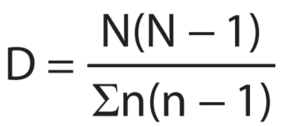

Use the table to help you.

Give your answer to **one** decimal place.

**(3)**

(ii) Explain why the spread of the wild blackberry affects the biodiversity of the island.

**(5)**

## Q6 — medium — 7 marks · exam-questions

### 2() — 4 marks — command: multiple — structured — from paper Oct/Nov 2021 · WBI12/01
The common wombat is endemic to Australia and Tasmania.

The photograph shows a common wombat.

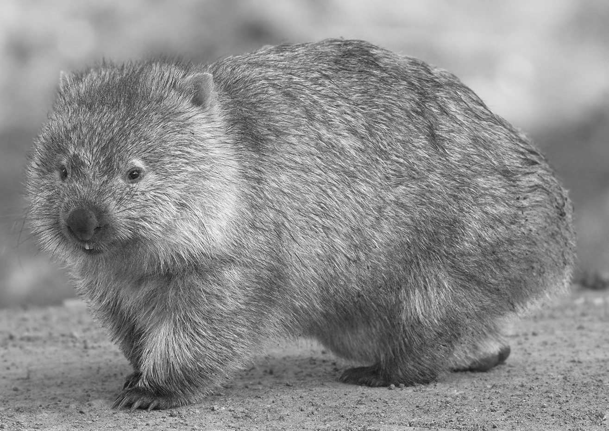

magnification × 0.1

JJ Harrison (jjharrison89@facebook.com), CC BY-SA 3.0 <https://creativecommons.org/licenses/by-sa/3.0>, via Wikimedia Commons

Common wombats mark areas of their habitat to signal to other wombats of the same species that they are living there. These marked areas are called territories.

Common wombats produce cube-shaped faeces. It is thought that these cubes can be stacked to mark territory without rolling away.

(i) Calculate the surface area : volume ratio of one cube with a length of 2.5cm.

**(2)**

Answer ..........................................

(ii) State what is meant by the term **habitat**.

**(1)**

(iii) State what is meant by the term **species**.

**(1)**

### 2((b)) — 1 mark — command: state — structured — from paper Oct/Nov 2021 · WBI12/01
The height of a wombat is a result of polygenic inheritance.

State what is meant by the term **polygenic inheritance** with reference to wombat height.

### 2((c)) — 2 marks — command: describe — structured — from paper Oct/Nov 2021 · WBI12/01
Common wombats dig burrows to live in. They have adaptations to help them to do this successfully.

Describe **two** anatomical adaptations of a common wombat that help it to dig burrows to live in.

Use the information in the photograph to support your answer.

1........................................................ 2........................................................

## Q7 — medium — 7 marks · exam-questions

### 3() — 3 marks — command: multiple — structured — from paper Oct/Nov 2021 · WBI12/01
Organisms can be classified using the three-domain system.

Molecular evidence is used to place an organism into one of the three domains.

(i) Give **one** example of the molecular evidence used to support the three-domain system.

**(1)**

(ii) Describe the role of the scientific community in evaluating the evidence for this system of classification.

**(2)**

### 3((b)) — 4 marks — command: place — structured — from paper Oct/Nov 2021 · WBI12/01
The table shows some features of living organisms.

Place an X in each row to show whether the feature is found in these domains.

| **Feature** | **Archaea only** | **Archaea and** **Bacteria only** | **Archaea and** **Eukarya only** | **Archaea and** **Bacteria and** **Eukarya** |
|---|---|---|---|---|
| absence of a nuclear envelope | ☐ | ☐ | ☐ | ☐ |
| presence of circular DNA | ☐ | ☐ | ☐ | ☐ |
| presence of a cell membrane | ☐ | ☐ | ☐ | ☐ |
| presence of ribosomes | ☐ | ☐ | ☐ | ☐ |

## Q8 — medium — 11 marks · exam-questions

### 7((a)) — 1 mark — command: state — structured — from paper Jan 2022 · WBI12/01
The photograph shows a titan arum plant (*Amorphophallus titanum*).

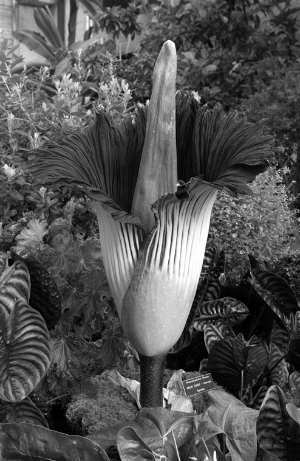

Credits: US Botanic Garden., Public domain, via Wikimedia Commons

This plant is native to Sumatra, Indonesia, and is critically endangered.

There are fewer than 1000 individuals in the wild and 500 in botanical gardens around the world.

Sumatra is described as having a high species richness.

State what is meant by the term **species richness**.

### 7((b)) — 2 marks — command: explain — structured — from paper Jan 2022 · WBI12/01
Seed banks often conserve endangered plants by storing samples of their seeds.

The seeds are dried and then frozen.

Explain the advantages of drying seeds before storage.

### 7((c)) — 8 marks — command: multiple — structured — from paper Jan 2022 · WBI12/01
Scientists have stated that more than a third of critically endangered plant species cannot be saved from extinction by storing seeds in seed banks.

The titan arum is one of these plants.

This plant flowers once every 10 years and the flowers last for two to three days.

The plant can reproduce asexually or sexually. In order to reproduce sexually it relies on insects to transfer pollen to other titan arum plants.

Scientists are developing ways to conserve this plant without losing genetic diversity.

Some of the suggestions include:

- Grow more plants produced by asexual reproduction in botanical gardens
- Collect pollen when an individual plant flowers and store it in a seed bank
- Create a studbook for the species
- Artificially pollinate plants in the wild and in botanical gardens.

(i) The heterozygosity index can be calculated using an equation.

Write this equation.

**(1)**

(ii) The heterozygosity index of the 500 titan arum plants in botanical gardens was found to be 0.166.

Calculate the number of heterozygotes in this population.

**(1)**

(iii) Discuss the suggestions, proposed by these scientists, for conserving the titan arum.

**(6)**

## Q9 — medium — 13 marks · exam-questions

### 9((a)) — 1 mark — command: which — structured — from paper Jan 2022 · WBI12/01
The Hood Island giant tortoise (*Chelonoidis hoodensis*) is only found on one of the Galapagos Islands.

The photograph shows two Hood Island giant tortoises fighting over territory.

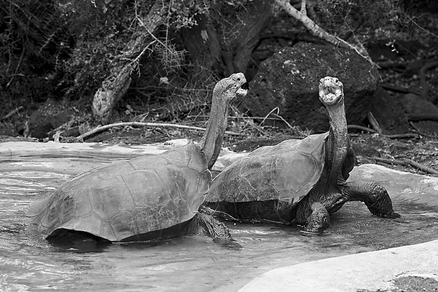

https://www.flickr.com/photos/lightmatter/, CC BY 2.0 <https://creativecommons.org/licenses/by/2.0>, via Wikimedia Commons

Which of the following is a term that would be used to describe the fact that this species of giant tortoise is found only on the Galapagos Islands?

☐ **A** Diversity

☐ **B** Endemic

☐ **C** Isolation

☐ **D** Linkage

### 9((b)) — 4 marks — command: multiple — structured — from paper Jan 2022 · WBI12/01
The Hood Island giant tortoise has adaptations to its environment.

Two features are:

- Long neck
- Shell that arches above the neck.

When there is a dispute over territory, the tortoises use these features to make themselves look as large as possible.

(i) Complete the table to show the type of adaptations shown by this tortoise.

**(3)**

| **Feature** | **Type of adaptation** |
|---|---|
| Long neck |   |
| Shell that arches above neck |   |
| Making themselves look as large as possible |   |

(ii) Suggest one selection pressure that results in the development of one of these features.

**(1)**

### 9((c)) — 6 marks — command: multiple — structured — from paper Jan 2022 · WBI12/01
In 1963, there were only three males and 12 females of *C*. *hoodensis* left in the wild.

These 15 tortoises were used in a breeding programme.

The diagram shows the number of offspring from each female tortoise and the fathers of these offspring.

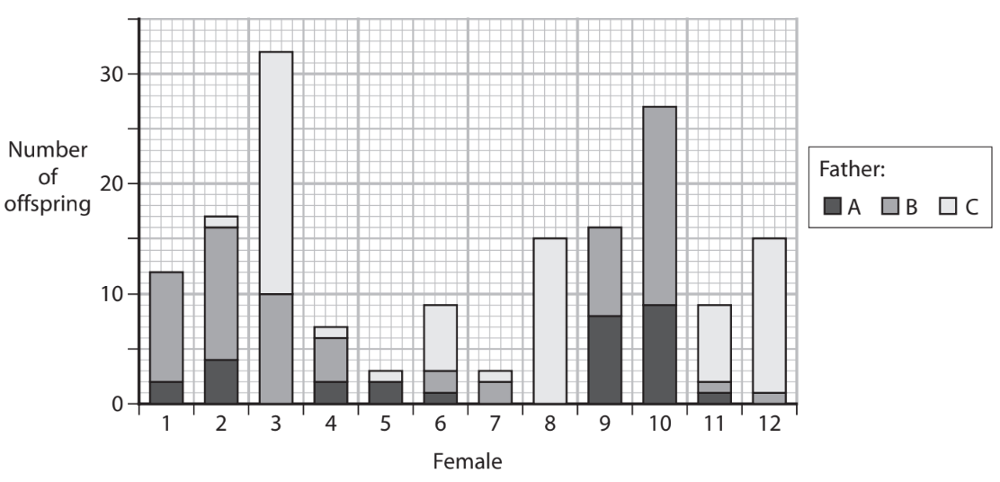

(i) Calculate the percentage of female 10’s offspring that were fathered by male B.

**(1)**

(ii) The wild population of *C. hoodensis* is now 1800 individuals.

Calculate the percentage increase in the wild population of C*. hoodensis* tortoises.

Give your answer to **one** decimal place.

**(2)**

(iii) A zoo tested its captive‐bred giant tortoise and determined that it was a *C. hoodensis* tortoise.

Explain how the zoo determined that its giant tortoise was a *C. hoodensis* tortoise.

**(3)**

### 9((d)) — 2 marks — command: explain — structured — from paper Jan 2022 · WBI12/01
Scientists thought that a recessive allele was changing in frequency in the tortoise population.

Explain how the change in frequency of this allele could be determined.

## Q10 — medium — 9 marks · exam-questions

### 1() — 1 mark — multiple_choice
Hawaiian honeycreepers are a group of birds endemic to the Hawaiian Islands. The diagram shows how several species of Hawaiian honeycreeper are thought to have evolved from a common ancestor, as well as the distribution of these species across the island archipelago.

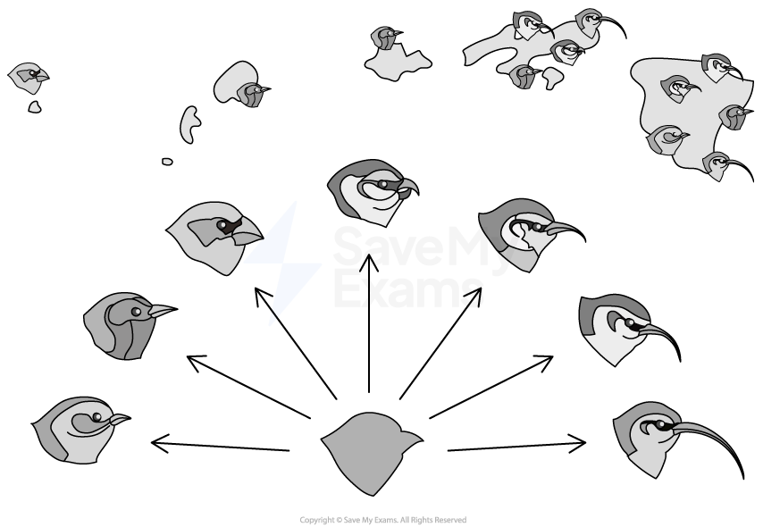

Which of the following statements about endemic species are correct?

1. they are only found in a particular geographical area
2. they may have a restricted gene pool
3. they are at greater risk of extinction than non-endemic species
4. they can only survive in a single type of habitat
- **A.** 1, 2 and 3 only
- **B.** 1, 2, 3 and 4
- **C.** 1 and 3 only
- **D.** 2 and 3 only

### 2() — 2 marks — command: describe — structured
Scientists have debated whether some honeycreeper populations living on different islands represent the same species or different species.

Describe a method by which scientists could determine whether two honeycreeper populations living on different islands belong to the same species or different species.

### 3() — 4 marks — command: explain — structured
The photographs show two species of Hawaiian honeycreeper: the 'i'iwi (left) and the kiwikiu (right).

The 'i'iwi feeds on nectar from native Hawaiian trees, flying long distances through the forest canopy in search of flowering trees.

The kiwikiu feeds on beetle larvae and moth pupae. Pairs of kiwikiu defend a foraging territory of approximately 2.3 hectares against competing birds. Fledglings remain with their parents for up to eight months, during which time they learn foraging techniques from their parents.

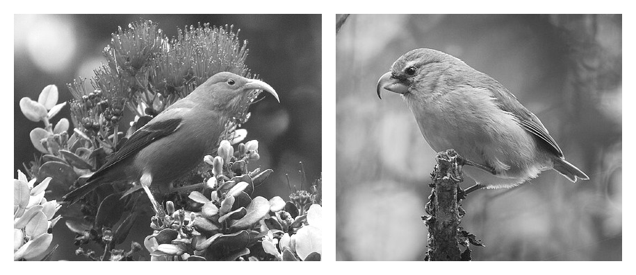

Gregory "Slobirdr" Smith, via [Wikimedia Commons](https://commons.wikimedia.org/wiki/File:I%27iwi_(Scarlet_Honeycreeper)_Drepanis_coccinea_-_Flickr_-_Gregory_%22Slobirdr%22_Smith.jpg) and Zach Pezzillo, via [Wikimedia Commons](https://commons.wikimedia.org/wiki/File:Kiwikiu_perched_in_the_Waikamoi_Forest_Preserve.jpg)

Using the photographs and the information provided, identify and explain one anatomical adaptation and one behavioural adaptation shown by Hawaiian honeycreepers.

### 4() — 2 marks — command: multiple — structured
The two species of Hawaiian honeycreeper shown in the photographs each occupy distinct niches.

(i) State what is meant by the term niche.

[1]

(ii) Identify one factor, other than food source, that might form part of the niche of these honeycreepers.

[1]

## Q11 — medium — 12 marks · exam-questions

### 1() — 3 marks — command: calculate — structured
Species X is a flowering plant found in alpine meadows. It produces an antimicrobial compound. The gene for production of this compound has two alleles: allele A, which results in high production of the compound, and allele a, which results in low production of the compound.

A population of 500 Species X plants was surveyed. 80 plants showed low production of the antimicrobial compound.

Use the formula below to calculate the expected number of plants in this population that are heterozygous for production of the antimicrobial compound.

p² + 2pq + q² = 1

### 2() — 3 marks — command: explain — structured
A fungal pathogen began to spread through the alpine meadow where species X grows.

Explain how the fungal pathogen could cause a change in the frequency of allele A over time.

### 3() — 6 marks — command: multiple — structured
Scientists were interested in whether plant-derived antimicrobial compounds could be used as alternatives to conventional antibiotics. They investigated the antibacterial properties of thyme oil and clove oil against *Escherichia coli *bacteria. The oils were tested individually and in combination using the agar well diffusion method. The mean diameter of the inhibition zone was measured for each treatment and compared to a standard antibiotic. The results are shown in the graph.

Asterisks above each bar indicate the statistical significance of the difference between each treatment and the antibiotic.

(i) State what can be concluded about the antibacterial properties of thyme oil and clove oil against *E. coli*.

[4]

(ii) The research group were interested in using thyme and clove oil in food preservatives.

Suggest two additional pieces of information that would be needed before these new preservatives could be developed.

[2]

## Q12 — medium — 11 marks · exam-questions

### 1() — 3 marks — command: describe — structured
The Caledonian Forest is an ancient habitat found in the Scottish Highlands. It was once widespread across Scotland but has been greatly reduced by human activity. It supports a range of species, including the red squirrel (*Sciurus vulgaris*), which is now endangered in much of the UK.

A team of scientists used quadrats to survey the plant species present in two areas of the Caledonian Forest: one area that had been actively conserved and one that had not. The results are shown in the table.

| Species | Number of individuals in conserved area | Number of individuals in unconserved area |
|---|---|---|
| Scots pine (*Pinus sylvestris*) | 87 | 124 |
| Heather (*Calluna vulgaris*) | 143 | 201 |
| Bluebell (*Hyacinthoides non-scripta*) | 56 | 12 |
| Wood sorrel (*Oxalis acetosella*) | 49 | 8 |
| Bilberry (*Vaccinium myrtillus*) | 61 | 9 |

Describe how quadrats should be used to collect reliable data on the plant species present in each area.

### 2() — 2 marks — command: explain — structured
Analysis of data from the conserved and unconserved areas yields the following values:

|   | Conserved area | Unconserved area |
|---|---|---|
| Index of diversity | 4.37 | 2.14 |
| Heterozygosity index of red squirrel population | 0.62 | 0.38 |

Explain what the data indicate about the impact of the conservation strategies used in the areas studied.

### 3() — 6 marks — command: evaluate — structured
*Evaluate the conservation strategies that could be used to maintain and improve biodiversity in the Caledonian Forest.

## Q13 — medium — 4 marks · exam-questions

### 7() — 4 marks — command: multiple — structured — from paper Oct/Nov 2020 · WBI14/01
Bacteria and fungi can both cause infections.

The diagram shows part of the structure of a fungus.

(i) How many of the organelles labelled in this diagram have membranes?

**(1)**

☐   **A**   1

☐   **B**   3

☐   **C  ** 5

☐   **D  ** 7

(ii) Explain why fungi are not classified as bacteria, plants or animals.

Use the information in the diagram and your knowledge of cell structure to support your answer.

**(3)**
