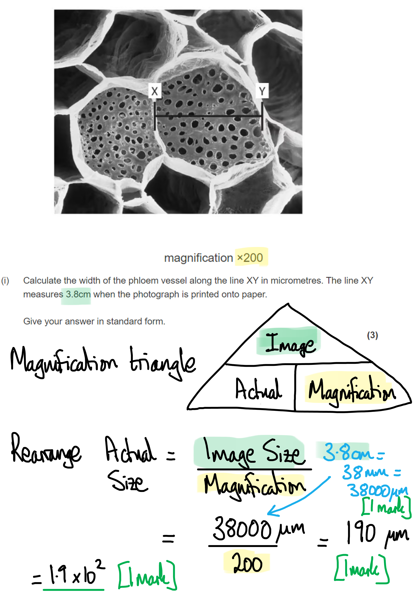
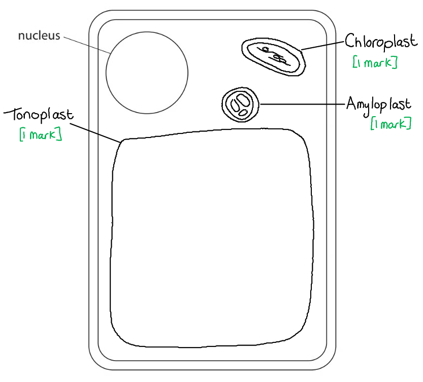

# Mark Schemes — Plant Structure & Function
**4. Plant Structure & Function, Biodiversity & Conservation** · Edexcel International A Level (IAL) Biology (YBI11)

## Q1 — medium — 6 marks · exam-questions

### 1((a)) — 3 marks
(i) The correct answer is **A** (amyloplast) because...

**An amyloplast is a small, membrane-bound organelle that stores starch. **

**The prefix 'amylo-' gives a hint to the answer; you may be familiar with that prefix from starch biochemistry; think, amylose, amylopectin, amylase etc.**

> *The middle lamella is the outermost layer of a plant cell wall and is mainly made of pectin.*

> *The plasmodesmata are narrow threads of cytoplasm that link neighbouring cells.*

> *The tonoplast is a membrane that surrounds a plant cell's vacuole*

(ii) The correct answer is **A** (one) because...

**Statement 1 is correct because one of starch's main properties is its compactness, ideal for a storage molecule. **

> *Statement 2** **is incorrect because starch consists of amylose and amylopectin. Amylopectin contains a mixture of 1,4 and 1,6 glycosidic bonds. *

> *Statement 3 is incorrect because starch is a polymer of α-glucose.*

> *Statement 4 is incorrect because starch is a polysaccharide; polypeptides are polymers of amino acids.*

(iii) The correct answer is **C** (three) because...

**The tissues containing cellulose are the phloem, sclerenchyma and xylem.**

> *The only structure that does not contain cellulose is the vacuole, which contains an aqueous solution called sap; cellulose is not soluble so is not found in the cell sap.*

**[Total: 3 marks]**

### 1((b)) — 3 marks
The structures of cellulose and microfibrils increase the strength of a plant cell wall as follows...

- There are hydrogen bonds between (adjacent) cellulose <u>molecules</u>; **[1 mark]**
- Cellulose forms into layers/sheets of microfibrils; **[1 mark]**
- (The sheets) have microfibrils at different angles / in a criss-cross pattern/mesh; **[1 mark]**

**[Total: 3 marks]**

> *The main stumbling block in this question is to confuse cellulose molecules with microfibrils; cellulose **molecules join together to form microfibrils** (which is what you can see on the image).*

> *Avoid the temptation to describe the molecular structure of cellulose in detail; this is not required and will not be credited.*

## Q2 — medium — 10 marks · exam-questions

### 5((a)) — 4 marks
(i) The correct answer is **A **because...

**W is the sclerenchyma**

> *B** is incorrect because X is the phloem*

> *C** is incorrect because Y is the xylem*

> *D** is incorrect because Z is the parenchyma*

(ii) The correct answer is **B **because...

**X is the phloem which transports substances in both directions**

(a) (iii) The correct answer is **D **because...

**Y is the xylem which transports calcium ions from the stem to the leaves**

(iv) The correct answer is **D **because...

**Xylem vessels and sclerenchyma fibres have secondary thickening in the cell walls**

> *A **and** B **are incorrect because phloem sieve tubes do not have secondary thickening*

> *C** is incorrect because sclerenchyma fibres also have secondary thickening*

**[Total: 4 marks]**

### 5((b)) — 6 marks
(i) Magnesium ions are important to plants because...

- Magnesium is needed to form chlorophyll / chlorophyll contains magnesium (ions); **[1 mark]**
- For the production of glucose/carbohydrate/ATP in photosynthesis **OR **for the conversion of light energy to chemical energy in photosynthesis; **[1 mark]**

***Accept*** *ATP / enzymes must be bound to magnesium ion to be biologically active ***[1 mark]**

(ii) The results of this investigation are...

- Increasing magnesium ion concentration increases the mass/growth / there is a positive correlation; **[1 mark]**
- There is the same/similar effect on the proportion of mass increase in shoots and roots / a greater increase of shoot mass than roots; **[1 mark]**
- There is a significant difference between the results because the SD/range/error values do not overlap; **[1 mark]**
- Comment on size of SD linked to reliability of data; **[1 mark]**

**[Total: 6 marks]**

> *It is important to take careful note of the command word used. ‘Comment on’ requires you to consider a number of factors from the data/information to form a judgement. If you just write out the data from the table into a description then you cannot gain any marks. It is important to make a judgement as part of your answer. *

## Q3 — medium — 5 marks · exam-questions

### 1((a)) — 3 marks
(i) The molecule in the diagram is **B** because...

The H group on carbon 1 (shown on the far right in this diagram) is located **below** the ring structure; this is the case for β-glucose.

> *In α-glucose (A) the H group is located **above** the ring structure.*

> *C is incorrect because starch is a **polymer** of α-glucose and the image shows a monosaccharide.*

> *D is incorrect because sucrose is a **disaccharide** of glucose and fructose and the image shows a monosaccharide.*

(ii) A feature of cellulose molecules is **C** because...

Hydrogen bonds can form between individual cellulose molecules; the resulting bundles of cellulose are very strong and are known as **microfibrils**.

> *Peptide bonds (A) are found between amino acids in proteins, and cellulose is a carbohydrate. The monosaccharides in a carbohydrate are joined with glycosidic bonds.*

> *B is incorrect because the monosaccharide of cellulose is β-glucose.*

> *D is incorrect because cellulose is an insoluble molecule.*

(iii) The molecule that contains magnesium ions is **B** because...

**Magnesium is needed to build chlorophyll.**

**[Total: 3 marks]**

### 1((b)) — 2 marks
(i) A tissue that gives the plant support **and is also** involved in the transport of water through the plant is…

- Xylem; **[1 mark]**

(ii) A fibre that gives the plant support **but is not **involved in the transport of water through the plant is...

- Sclerenchyma; **[1 mark]**

*Accept: tracheids*

**[Total: 2 marks]**

## Q4 — medium — 12 marks · exam-questions

### 5((a)) — 3 marks
Three reasons why this species of tree is endangered:

Any** three** of the following:

- Deforestation / loss of habitat; **[1 mark]**
- Increased grazing by animals; **[1 mark]**
- Reduced number of new trees in the area; **[1 mark]**
- Disease (that are fatal to that species of tree); **[1 mark]**
- Reduced genetic diversity (leads a population with less resilience); **[1 mark]**

**[Total: 3 marks]**

> *You only need three reasons here and the question is only worth three marks so don't spend too long writing a long detailed answer!*

### 5() — 6 marks
(i) Calculate the width of the phloem vessel along the line XY in micrometres:

- Correct conversion

  - 3.8 cm = 38 000 μm; **[1 mark]**
- Correct calculation

  - Actual size = image size ÷ magnification
  - 38 000 ÷ 200 = 190 μm; **[1 mark]**
- Correct answer in standard form

  - 1.9 × 102 (μm); **[1 mark]**

(ii) The role of the phloem is to...

- Transport / translocate sucrose / amino acids / products of photosynthesis; **[1 mark]**
- From the source /site of production / leaves to the sink / site of use / site of storage; **[1 mark]**

(iii) The following statements about mature sclerenchyma fibres are correct:

The only correct answer is **C** two; [1 mark]

> *A** is not correct because all the statements are correct apart from, they do not contain cytoplasm.*

> *B** is not correct because all the statements are correct apart from, they do not contain cytoplasm.*

> *D** is not correct because they do not contain cytoplasm.*

**[Total: 6 marks]**

> *Be careful, you will not get a mark for saying glucose for part *
*(ii) as this is not the form in which sugars are transported in the phloem.*

### 5((c)) — 3 marks
Three differences between the distribution of phloem and xylem in the root compared with their distribution in the stem:

- In the root, the edge of the xylem is closer to the outside of the structure / epidermis than the phloem **OR** in the stem the phloem is closer to the outside of the structure / epidermis than the xylem; **[1 mark]**
- The xylem and phloem are separated by the cambium in the stem; **[1 mark]**
- Vascular tissue is present in only one area in the root whereas it is present in several areas in the stem; **[1 mark]**
- The xylem and phloem are contained in separate vascular bundles in the stem; **[1 mark]**
- There is a more equal phloem to xylem ratio in the stem whereas there is 4:1 ratio in the root; **[1 mark]**

*Accept a labelled diagram showing the distribution in the stem.*

**[Total: 3 marks]**

> *Make sure to clarify whether you are referring to xylem or phloem in your answer. Also, there are no marks up for grabs for describing the differences in the size of the xylem/phloem.*

## Q5 — medium — 8 marks · exam-questions

### 1((a)) — 3 marks
The completed diagram appears as follows...

- Amyloplast drawn and labelled; **[1 mark]**
- Chloroplast drawn and labelled; **[1 mark]**
- Tonoplast drawn and labelled; **[1 mark]**

**[Total: 3 marks]**

> *Remember that the tonoplast label should point to the membrane and not to the centre of the vacuole.*

> *The size and location of the structures is important. *

### 1((b)) — 1 marks
The function of this organelle is...

- Modifies and packages proteins/enzymes / processes and packages lipids; **[1 mark]**

***Accept**** modifies proteins/enzymes/lipids / packages proteins/enzymes/lipids*

***Do not accept**** synthesises proteins*

***Do not accept**** reference to proteins being packaged for transport to GA*

**[Total: 1 mark]**

> *This image is showing the Golgi apparatus.*

### 1((c)) — 4 marks
The completed table is as follows...

| **Structure** | **Archaea only** | **Bacteria only** | **Eukarya only** | **More than one domain** |
|---|---|---|---|---|
| cell membrane |   |   |   | **✘**; **[1 mark]** |
| nucleolus |   |   | **✘**; **[1 mark]** |   |
| cell wall |   |   |   | **✘**; **[1 mark]** |
| 70S (small) ribosome |   |   |   | **✘**; **[1 mark]** |

**[Total: 4 marks]**

## Q6 — medium — 5 marks · exam-questions

### 2((a)) — 1 marks
It is usual to stain specimens in microscopy because...

- (Adding a stain) allows structures* to be seen / differentiate/increase contrast between structures; **[1 mark]**

**e.g. chromosomes, DNA, lignin, organelles etc.*

***Accept**** show detail more clearly*

***Accept**** converse argument for specimens which are not stained*

***Ignore**** to make specimens more visible*

**[Total: 1 mark]**

> *Try to be as specific as possible with your answers. *

### 2((b)) — 4 marks
The arrangement of cellulose molecules and secondary thickening in xylem vessels contributes to the physical properties of the cell wall by...

Any **four **of the following:

- Cellulose molecules can be organised into microfibrils; **[1 mark]**
- (Due to layers of) cellulose/microfibrils arranged in different directions/a mesh; **[1 mark]**
- Hydrogen bonds in cellulose molecules / hydrogen bonds in microfibrils / layers (of microfibrils) / lignin / secondary thickening / pectate add strength/support/stability; **[1 mark]**
- (Cellulose) microfibrils/mesh held together by pectin/pectate **OR **cellulose microfibrils can’t slide over each other; **[1 mark] **
- Lignin makes outside of xylem vessels/cell wall impermeable (to water)/waterproof; **[1 mark]**
- The structure of lignin described e.g. rings, spirals, ladders; **[1 mark]**

**[Total: 4 marks]**

> *It is important to take careful note of the command word ‘explain’ in order to gain marks.*

## Q7 — medium — 9 marks · exam-questions

### 1() — 3 marks
> **[mark-scheme]**
> - B = cell wall **[1 mark]**
> - D = mitochondria/mitochondrion **[1 mark]**
> - G = chloroplast **[1 mark]**

> **[exam-tip]**
> You are not expected to have prior knowledge of *Chlamydomonas*. However, you should be able to use the information provided to compare its structures with those of plant cells that you have studied.

### 2() — 1 marks
> **[mark-scheme]**
> Any **one** from:
> 
> - They are orientated differently / have been sectioned/sliced at different angles
> - They are different ages / are at different stages of development / one has grown/developed more than the other
> 
> **[1 mark]**

> **[exam-tip]**
> The command word "suggest" means you need to apply your biological knowledge to an unfamiliar situation.
> 
> When structures appear different in a micrograph, this could be due to the angle of sectioning during the preparation of the specimen, or due to a genuine biological difference.

### 3() — 1 marks
**Correct answer: D** — stores starch as an energy reserve

> **[mark-scheme]**
> **Final answer:** **The correct answer is D.**
> 
> - Amyloplasts are specialised plastids that store starch, which can be broken down to release glucose for use in metabolism
> 
> **A** is not correct because absorbing light energy for use in photosynthesis is the function of a chloroplast.
> 
> **B** is not correct because connecting neighbouring plant cells is the function of plasmodesmata.
> 
> **C** is not correct because providing a site for protein synthesis is the function of a ribosome.

### 4() — 2 marks
> **[mark-scheme]**
> Any **pair** from:
> 
> - Enzymes and reactants/substrates are concentrated in one location
> - Increases the rate of enzyme-substrate complex formation / collisions between enzyme and substrate
> 
> **OR**
> 
> - Keeps enzyme-controlled reactions separate from the rest of the cell
> - Prevents the enzymes from interfering with other reactions / breaking down other molecules
> 
> **OR**
> 
> - Different conditions can be maintained within the compartment (compared to the rest of the cell)
> - Allows optimum conditions / optimum pH (for the enzymes) to be maintained
> 
> **[2 marks]**

### 5() — 2 marks
To calculate the actual diameter of the *Chlamydomonas* cell:

- Convert image size and actual size of scale bar to μm

  - 1 cm = 10 mm
  - 1 mm = 1000 μm
  - 1 μm = 1000 nm

image size = 1 cm = 10 mm = 10 000 μm

actual size = 700 nm = 0.7 μm

- Determine magnification using the scale bar

magnification = image size ÷ actual size

= 10 000 ÷ 0.7

= 14 286 **[1 mark]**

- Convert image size of cell to μm

12.2 cm = 122 mm = 122 000 μm

- Determine actual diameter of cell

actual size = image size ÷ magnification

= 122 000 ÷ 14 286

= **8.5** μm **[1 mark]**

> **[mark-scheme]**
> Award full marks for the correct answer in the absence of other calculations.
> 
> Accept 14 286x or x14 286 for the magnification

## Q8 — medium — 10 marks · exam-questions

### 1() — 4 marks
> **[mark-scheme]**
> (i) Structures X, Y and Z are:
> 
> - X = sclerenchyma (fibres) **[1 mark]**
> - Y = phloem **[1 mark]**
> - Z = xylem (vessels) **[1 mark]**
> 
> (ii) The region of the plant from which this cross-section has been taken is:
> 
> - Stem **[1 mark]**

### 2() — 2 marks
> **[mark-scheme]**
> Any **two** from:
> 
> - Plants can be regrown after harvesting / are renewable **SO** the resource will not run out / is not finite
> - Plant fibres are an alternative to oil-based plastics **SO** reduce dependence on fossil fuels
> - Plant fibres are biodegradable **SO** do not persist in the environment
> - Growing plants absorbs / fixes CO₂ **SO** reduces net greenhouse gas emissions

### 3() — 4 marks
> **[mark-scheme]**
> Similarities:
> 
> - Both are polysaccharides
> - Both are polymers of glucose
> - Both contain glycosidic bonds
> 
> Differences( maximum of three):
> 
> - Cellulose is made of β-glucose WHILE starch is made of α-glucose
> - Cellulose forms straight chains WHILE starch (amylose) forms coiled chains
> - Cellulose is unbranched WHILE starch (amylopectin) is branched
> - Cellulose contains only 1,4 glycosidic bonds WHILE starch (amylopectin)  contains 1,4 and 1,6 glycosidic bonds
> - Adjacent cellulose chains are grouped into microfibrils WHILE starch does not form microfibrils **OR** hydrogen bonds form between adjacent cellulose chains WHILE starch chains are not linked by hydrogen bonds
> 
> **[4 marks]**
> 
> Students must include at least one similarity and one difference to access full marks.

> **[exam-tip]**
> The command words "compare and contrast" require you to identify both similarities and differences between the two molecules.
> 
> Each point you make must be clearly comparative, meaning it must refer to both cellulose and starch. Stating "cellulose is made of β-glucose" alone is not sufficient — you must complete the comparison by also stating what starch is made of. A useful technique is to use the word WHILE to structure each point, for example: "Cellulose is made of β-glucose WHILE starch is made of α-glucose."

## Q9 — medium — 2 marks · exam-questions

### 1() — 2 marks
> **[mark-scheme]**
> Any **two** from:
> 
> - Cellulose molecules form microfibrils that are held together by many hydrogen bonds
> - Cellulose fibres / microfibrils are arranged in layers/sheets / a mesh / a criss-cross pattern / at different angles
> - Cellulose fibres / microfibrils are embedded in / held together by a matrix of pectin / calcium pectate / hemicellulose
> - The cell walls have secondary thickening / lignin is deposited in the cell walls
> 
> **[2 marks]**

> **[exam-tip]**
> This question uses the command word "describe," so you only need to state the features — you do not need to explain how each feature contributes to tensile strength. Keep your answers concise and focused on the features themselves.
> 
> Although paper 3 focuses largely on practical skills and data analysis, it does include a small amount of direct recall (AO1) content. The biological content is likely to be linked to the core practicals themselves, so make sure you are comfortable with the underlying biological content for each core practical.
