# Exam Questions — Plant Structure & Function
**4. Plant Structure & Function, Biodiversity & Conservation** · Edexcel International A Level (IAL) Biology (YBI11)
> Source: [https://www.savemyexams.com/international-a-level/biology/edexcel/18/topic-questions/4-plant-structure-and-function-biodiversity-and-conservation/plant-structure-and-function/exam-questions/](https://www.savemyexams.com/international-a-level/biology/edexcel/18/topic-questions/4-plant-structure-and-function-biodiversity-and-conservation/plant-structure-and-function/exam-questions/) · 9 questions · total 67 marks

## Q1 — medium — 6 marks · exam-questions

### 1((a)) — 3 marks — command: multiple — structured — from paper Oct/Nov 2020 · WBI12/01
Plants contain starch and cellulose.

(i) Which part of a plant cell stores starch?

**(1)**

| ☐ | **A** | amyloplast |
|---|---|---|
| ☐ | **B** | middle lamella |
| ☐ | **C** | plasmodesmata |
| ☐ | **D** | tonoplast |

(ii) How many of the following statements about starch are correct?

1. it has a compact shape 
2. it contains 1,6 glycosidic bonds only 
3. it is a polymer of β-glucose 
4. it is a polypeptide

**(1)**

| ☐ | **A** | one |
|---|---|---|
| ☐ | **B** | two |
| ☐ | **C** | three |
| ☐ | **D** | four |

(iii) How many of the following contain cellulose?

1. phloem 
2. sclerenchyma 
3. vacuole 
4. xylem

**(1)**

| ☐ | **A** | one |
|---|---|---|
| ☐ | **B** | two |
| ☐ | **C** | three |
| ☐ | **D** | four |

### 1((b)) — 3 marks — command: explain — structured — from paper Oct/Nov 2020 · WBI12/01
Microfibrils are composed of cellulose.

The image shows the arrangement of microfibrils in a plant cell wall, as seen using an electron microscope.

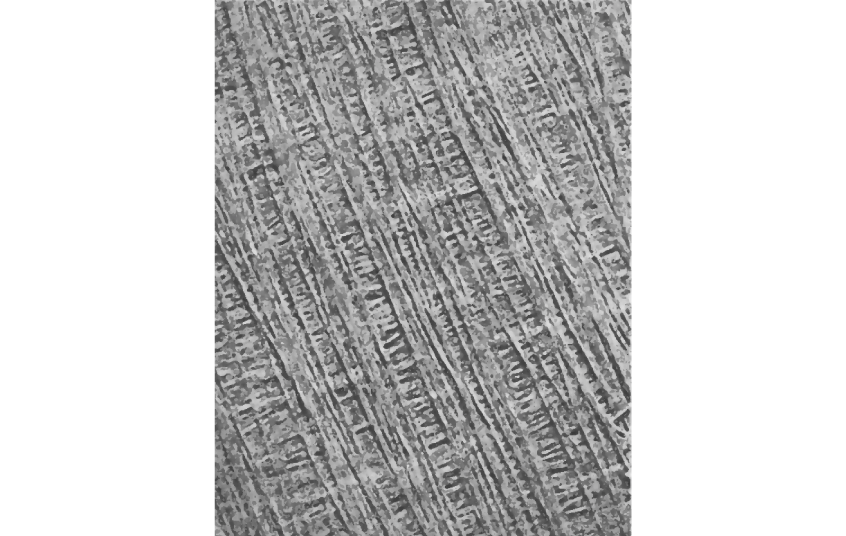

© Save My Exams Ltd

Explain how the structures of cellulose and microfibrils increase the strength of a plant cell wall.

Use the information in the image to support your answer.

## Q2 — medium — 10 marks · exam-questions

### 5((a)) — 4 marks — command: which — structured — from paper Jan 2021 · WBI12/01
The stem of a plant contains structures involved in transporting substances and supporting the plant.

The photograph shows a section through part of the stem of a plant, as seen using a light microscope.

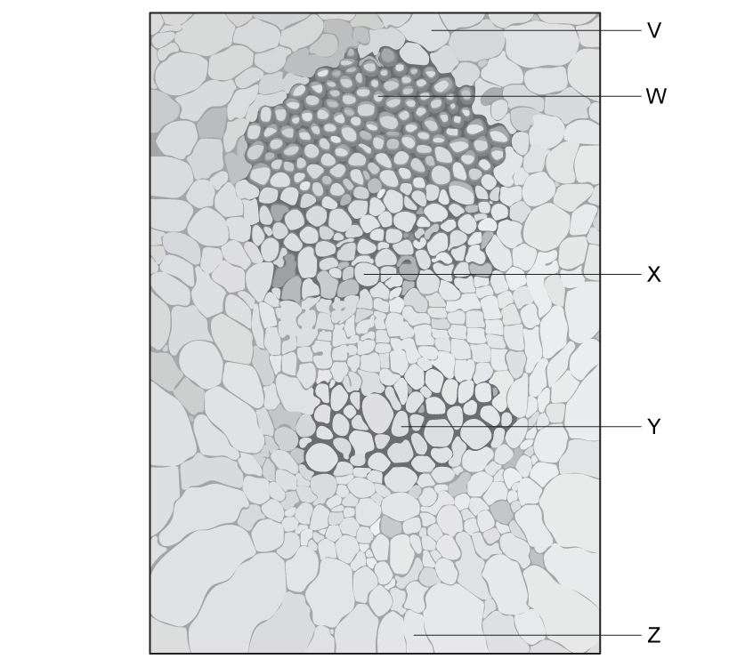

(i) Which of the labelled structures is sclerenchyma?

**(1)**

| ☐ | **A** | W |
|---|---|---|
| ☐ | **B** | X |
| ☐ | **C** | Y |
| ☐ | **D** | Z |

(ii) Which of the labelled structures is involved in transporting substances both up and down the plant stem?

**(1)**

| ☐ | **A** | W |
|---|---|---|
| ☐ | **B** | X |
| ☐ | **C** | Y |
| ☐ | **D** | Z |

(iii) Which of the labelled structures is involved in transporting calcium ions from the stem to the leaves?

**(1)**

| ☐ | **A** | V |
|---|---|---|
| ☐ | **B** | W |
| ☐ | **C** | X |
| ☐ | **D** | Y |

(iv) Which of the following may have secondary thickening in the cell walls?

**(1)**

☐ **A** Phloem sieve tubes only 
☐ **B** Phloem sieve tubes and sclerenchyma fibres 
☐ **C** Xylem vessels only 
☐ **D** Xylem vessels and sclerenchyma fibres

### 5((b)) — 6 marks — command: multiple — structured — from paper Jan 2021 · WBI12/01
Plants require inorganic ions for growth.

In an investigation, groups of plants were watered with the same volume of a nutrient solution.

The solution contained all the required inorganic ions, but with different concentrations of magnesium ions.

The table shows the results of this investigation.

| **Concentration of** **magnesium ions in nutrient** **solution / mmol dm****-3** | **Mean dry mass** **of root / g** | **Mean dry mass** **of shoot / g** | **Mean total dry** **mass / g** |
|---|---|---|---|
| 0.01 | 2.38 ± 0.15 | 15.56 ± 1.22 | 17.94 ± 1.38 |
| 0.10 | 5.42 ± 0.43 | 33.36 ± 1.21 | 38.78 ± 1.63 |
| 0.40 | 7.08 ± 0.50 | 46.06 ± 0.59 | 53.14 ± 0.50 |

(i) Explain the importance of magnesium ions to plants.

**(2)**

(ii) Comment on the results of this investigation.

Use the information in the table to support your answer.

**(4)**

## Q3 — medium — 5 marks · exam-questions

### 1((a)) — 3 marks — command: which — structured — from paper June 2021 · WBI12/01
Plants contain many types of molecule.

(i) Which molecule is shown in the diagram?

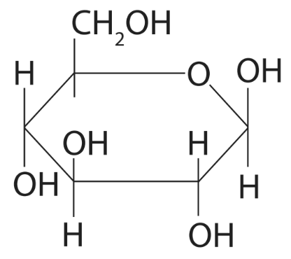

**(1)**

| ☐ | **A** | α-glucose |
|---|---|---|
| ☐ | **B** | β-glucose |
| ☐ | **C** | starch |
| ☐ | **D** | sucrose |

(ii) Which is a feature of cellulose molecules?

**(1)**

| ☐ | **A** | contain peptide bonds |
|---|---|---|
| ☐ | **B** | contain α-glucose molecules |
| ☐ | **C** | form microfibrils |
| ☐ | **D** | are soluble |

(iii) Which molecule contains magnesium ions?

**(1)**

| ☐ | **A** | calcium pectate |
|---|---|---|
| ☐ | **B** | chlorophyll |
| ☐ | **C** | DNA |
| ☐ | **D** | starch |

### 1((b)) — 2 marks — command: name — structured — from paper June 2021 · WBI12/01
Plants contain tissues that have different functions.

(i) Name **one** tissue that gives the plant support and is also involved in the transport of water through the plant.

**(1)**

(ii) Name **one** fibre that gives the plant support but is **not** involved in the transport of water through the plant.

**(1)**

## Q4 — medium — 12 marks · exam-questions

### 5((a)) — 3 marks — command: suggest — structured — from paper Oct/Nov 2021 · WBI12/01
The Ulin tree (*Eusideroxylon zwageri*), is native to Brunei, Indonesia and the Philippines.

The photograph shows an Ulin tree.

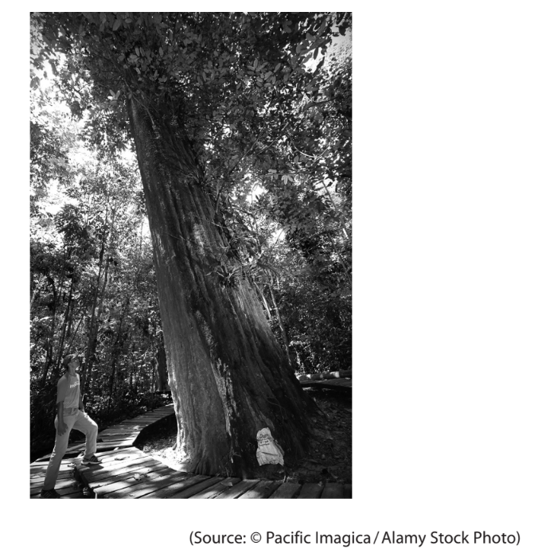

This species of tree is endangered and the export of wood from these trees is forbidden from some countries. Suggest **three** reasons why this species of tree is endangered.

1............................................

2............................................

3............................................

### 5() — 6 marks — command: multiple — structured — from paper Oct/Nov 2021 · WBI12/01
Trees, and other plants, contain phloem vessels and sclerenchyma fibres. The photograph shows sieve plates in the phloem of a plant.

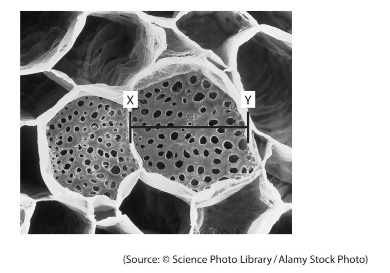

magnification ×200

(i) Calculate the width of the phloem vessel along the line XY in micrometres. The line XY measures 3.8cm when the photograph is printed onto paper.

Give your answer in standard form.

**(3)**

(ii) Describe the role of phloem.

**(2)**

(iii) How many of the following statements about mature sclerenchyma fibres are correct?

- they contain cellulose microfibrils
- they contain pits
- they contain cytoplasm

**(1)**

| ☐ | **A** | none |
|---|---|---|
| ☐ | **B** | one |
| ☐ | **C** | two |
| ☐ | **D** | three |

### 5((c)) — 3 marks — command: give — structured — from paper Oct/Nov 2021 · WBI12/01
The roots of plants contain phloem and xylem vessels, as shown in the diagram.

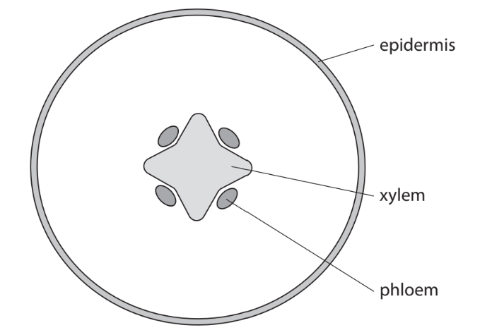

Give **three** differences between the distribution of phloem and xylem in the root compared with their distribution in the stem.

1............................................... 
2............................................... 
3...............................................

## Q5 — medium — 8 marks · exam-questions

### 1((a)) — 3 marks — command: draw — structured — from paper Jan 2022 · WBI12/01
Woese classified organisms into a three‐domain system.

Plant cells were classified into the Eukarya domain.

The diagram shows an incomplete cell from a plant.

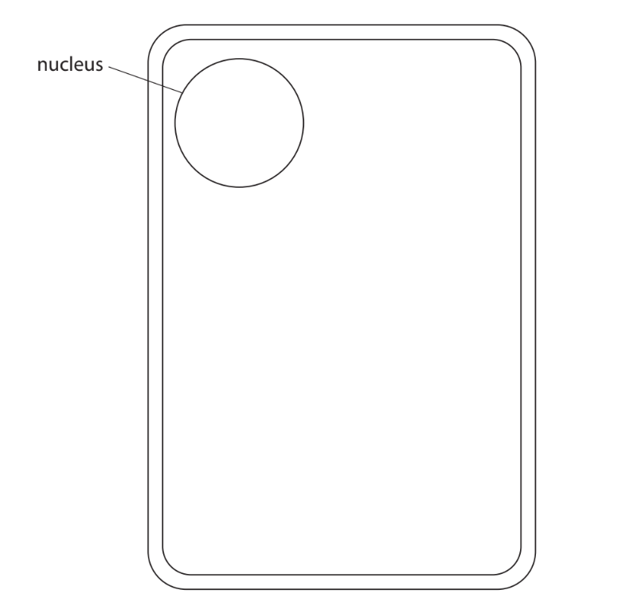

Complete the diagram by drawing an amyloplast, a chloroplast and the tonoplast to show their location and relative size in this cell.

Label these three structures.

### 1((b)) — 1 mark — command: state — structured — from paper Jan 2022 · WBI12/01
The photograph shows an organelle found in a plant cell, as seen using an electron microscope.

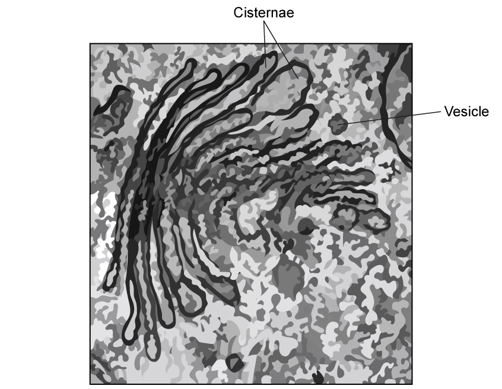

State the function of this organelle.

### 1((c)) — 4 marks — command: complete — structured — from paper Jan 2022 · WBI12/01
The other domains in the three‐domain system are Archaea and Bacteria.

Complete the table to show in which of the domains the following structures would be found.

Place an **X** in each appropriate box.

| **Structure** | **Archaea only** | **Bacteria only** | **Eukarya only** | **More than one domain** |
|---|---|---|---|---|
| cell membrane |   |   |   |   |
| nucleolus |   |   |   |   |
| cell wall |   |   |   |   |
| 70S (small) ribosome |   |   |   |   |

## Q6 — medium — 5 marks · exam-questions

### 2((a)) — 1 mark — command: give — structured — from paper Jan 2022 · WBI12/01
Abaca plants are found in the Philippines.

The illustrations shows some mats made from abaca plant fibres.

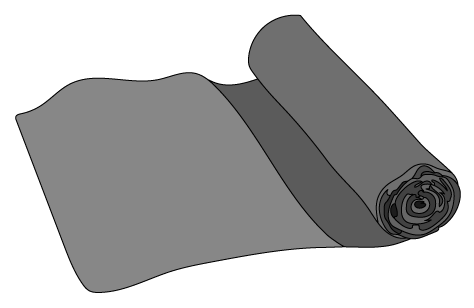

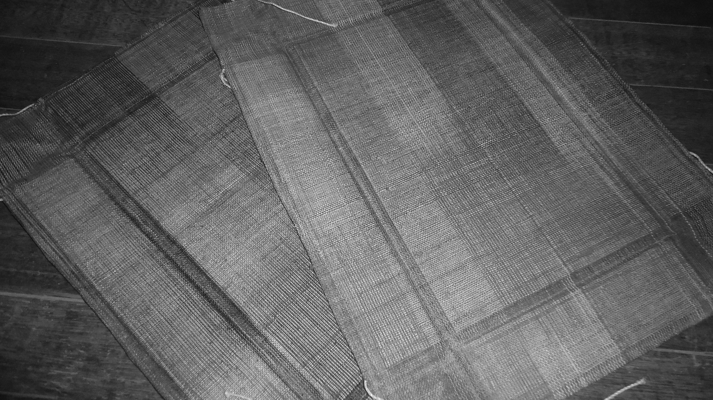

Obsidi♠nSoul, Public domain, via Wikimedia Commons

Plant fibres include xylem vessels.

The photograph shows some xylem vessels, as seen using a light microscope.

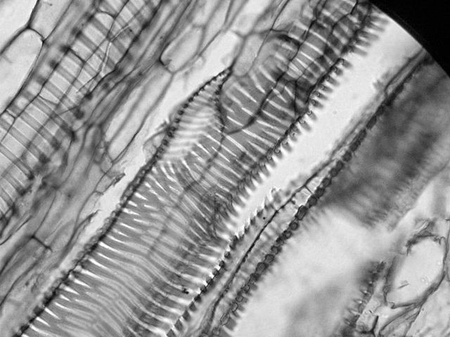

(biophotos), CC BY 2.0 <https://creativecommons.org/licenses/by/2.0>, via Wikimedia Commons

A stain was added to the xylem before viewing using a microscope.

Give a reason why it is usual to stain specimens in microscopy.

### 2((b)) — 4 marks — command: explain — structured — from paper Jan 2022 · WBI12/01
Explain how the arrangement of cellulose molecules and secondary thickening in xylem vessels contributes to the physical properties of the cell wall.

## Q7 — medium — 9 marks · exam-questions

### 1() — 3 marks — command: identify — structured
The micrograph shows an organism known as *Chlamydomonas*, a unicellular photosynthetic organism found in freshwater environments.

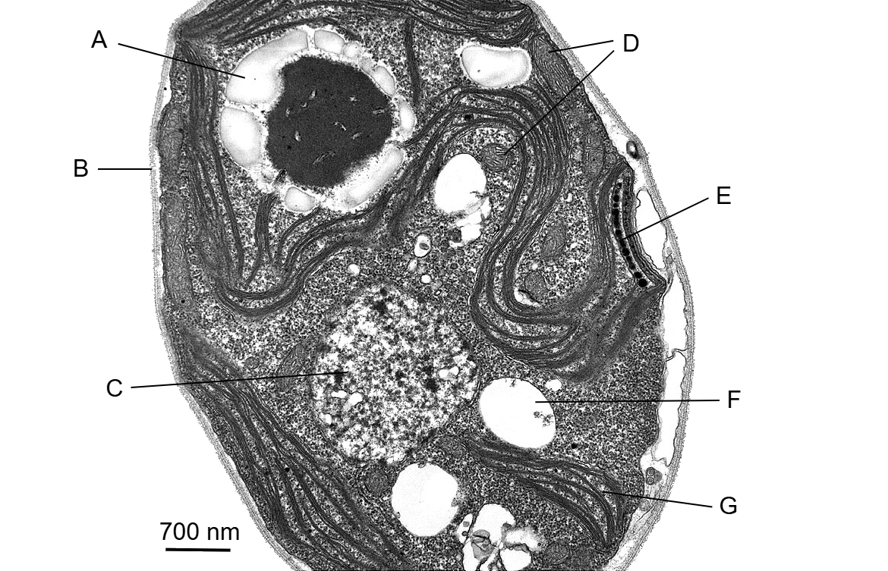

Dartmouth Electron Microscope Facility, via [Wikimedia Commons](https://commons.wikimedia.org/wiki/File:Chlamydomonas_TEM_04.jpg)

Identify the structures labelled **B**, **D** and **G**.

### 2() — 1 mark — command: suggest — structured
The two structures labelled D are slightly different in size and shape.

Suggest why this is the case.

### 3() — 1 mark — multiple_choice
Structure A is an amyloplast.

Which of the following correctly describes the function of an amyloplast?
- **A.** absorbs light energy for use in photosynthesis
- **B.** connects neighbouring plant cells
- **C.** provides a site for protein synthesis
- **D.** stores starch as an energy reserve

### 4() — 2 marks — command: explain — structured
The amyloplasts surround a darker structure known as the pyrenoid. The pyrenoid is a compartment that contains enzymes involved in photosynthesis.

Explain one possible advantage of these enzymes being contained within a compartment.

### 5() — 2 marks — command: calculate — structured
The scale bar shown in part (a) measures 1 cm and the diameter of the cell in the image measures 12.2 cm.

Calculate the actual diameter of the *Chlamydomonas* cell. Give your answer in μm.

## Q8 — medium — 10 marks · exam-questions

### 1() — 4 marks — command: identify — structured
The micrograph shows a cross section through plant tissue.

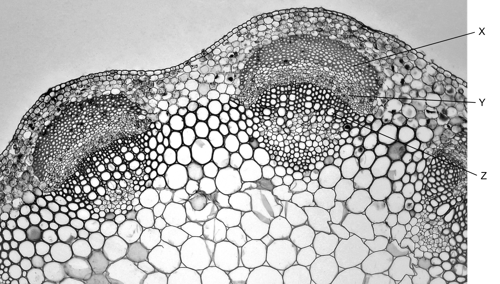

Berkshire Community College Bioscience Image Library, via [Flickr](https://www.flickr.com/photos/146824358@N03/36316874793/in/album-72157686180591576)

(i) Identify structures **X**, **Y** and **Z**.

[3]

(ii) Identify the region of the plant from which this cross-section has been taken.

[1]

### 2() — 2 marks — command: explain — structured
The structure labelled **X** in part (a) can be used to produce materials for human use.

Explain how this contributes to sustainability.

### 3() — 4 marks — command: contrast — structured
Cellulose and starch are both polysaccharides found in plant cells.

Compare and contrast the structure of cellulose and starch.

## Q9 — medium — 2 marks · exam-questions

### 1() — 2 marks — command: describe — structured
Describe the features of plant fibres that give them a high tensile strength.
