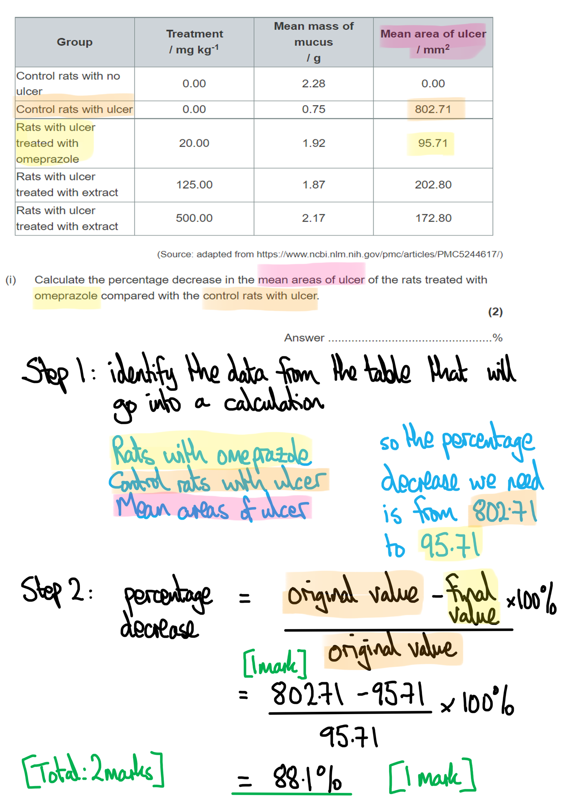
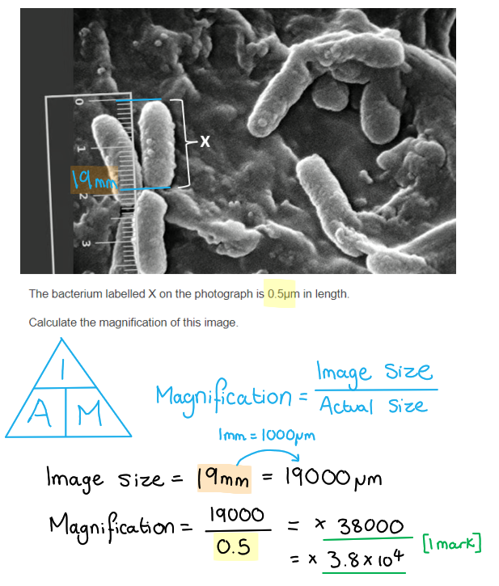
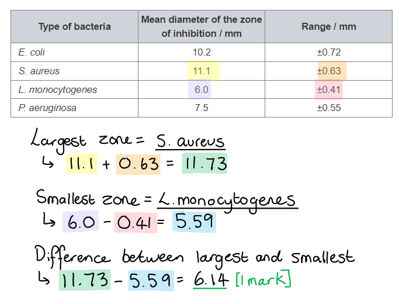

# Mark Schemes — Plants & Bacterial Growth
**4. Plant Structure & Function, Biodiversity & Conservation** · Edexcel International A Level (IAL) Biology (YBI11)

## Q1 — medium — 12 marks · exam-questions

### 6((a)) — 4 marks
The conditions needed for the growth of bacteria are...

Any** four** of the following:

- Water for hydrolysis reactions / to form cytoplasm / as a solvent / for hydration; **[1 mark]**
- (Some bacteria require) oxygen for (aerobic) respiration **OR** (some anaerobic bacteria require) zero/no oxygen for anaerobic respiration; **[1 mark]**
- A suitable/optimum temperature for enzyme-controlled / metabolic reactions to occur (at a suitable rate) **OR** so enzymes do not denature; **[1 mark]**
- A suitable/optimum pH for enzyme-controlled / metabolic reactions to occur (at suitable rate) **OR** so enzymes do not denature; **[1 mark]**
- A named organic molecule and an explanation of why that organic molecule is needed, e.g. glucose for respiration / lipids to provide fatty acid chains for new cell membrane / proteins to provide amino acids for protein synthesis; **[1 mark]**

**[Total: 4 marks]**

> *Even though you learn about the conditions needed by bacteria for growth in the context of how bacterial growth affects plants, this question requires you to use your knowledge and to apply it to the conditions that bacteria need in an **animal **scenario, like this one inside an animal's stomach. As soon as you realise that this question is more about bacterial growth than about the digestive system, you will be on the way to collecting a good score in this question. *

### 6((b)) — 8 marks
(i) The percentage decrease in the mean areas of ulcer of the rats treated with omeprazole compared with the control rats with ulcer is calculated as follows...

- 802.71 - 95.71 **OR** 707; **[1 mark]**
- ((707 ÷ 802.71) × 100 =) 88 / 88.1 / 88.08 (%); **[1 mark]**

*Correct answer with no working shown scores full marks. *

(ii)

> *This is a **level-marked question**, meaning that it is marked **according to the levels table**. The indicative content points below the table are **not **to be used in the usual **'one point per mark'** way, but should be used together with the level descriptors to determine the number of marks which should be awarded. *

| **Level 1** | A description of data is given. Any explanation is basic and contains limited interpretation or analysis of the information.  **[1 mark] **= one description relating to mass of mucus **or** ulcer area are given **AND** one explanation is provided  **[2 marks] **=** **two** **descriptions relating to mass of mucus **or** ulcer area are given **AND** one explanation is provided |
|---|---|
| **Level 2** | Level 1 is fulfilled **AND **explanation is more thorough. Some attempt is made to apply the question content to other areas of biology. The answer has a logical structure.  **[3 marks] **= three** **descriptions relating to mass of mucus **and** ulcer area are given **AND** two explanations are provided **AND** a link to one application point is made  **[4 marks] **=** **three** **descriptions relating to mass of mucus **and** ulcer area are given **AND** three explanations are provided **AND** a link to one application point is made |
| **Level 3** | Levels 1 and 2 are fulfilled **AND** detailed explanations are supported with multiple applications of biological knowledge. The explanation shows a well-developed and sustained line of scientific reasoning which is clear and logically structured.  **[5 marks] **= four** **descriptions relating to mass of mucus **and** ulcer area are given **AND** four explanations are provided **AND** a link to two application points are made  **[6 marks] **=** **four** **descriptions relating to mass of mucus **and** ulcer area are given **AND** five explanations are provided **AND** a link to three application points are made |

The results of this investigation can be explained as follows...

*Indicative content relating to ****description ****of data in table*

- The mean mass of mucus is lowest in control rats with an ulcer
- Rats treated with omeprazole / extract have more mucus than the control rats but less mucus that the rats with no ulcer
- Ulcer area is largest in control rats with no ulcer
- Rats treated with omeprazole have a smaller ulcer area than rats treated with extract
- Increasing the amount of extract results in increased mucus production / decreased ulcer area

*Indicative content relating to ****conclusions and explanations***

- Bacteria damage stomach lining and cause ulcers
- There is a correlation between mucus mass and ulcer area in rats (with the exception of rats treated with omeprazole)
- Omeprazole was the most effective treatment / none of the extracts were as effective as omeprazole at reducing ulcer area / all treatments resulted in reduction of ulcer area / increased mass of mucus
- Omeprazole / extract treatment increases mucus production
- The extract is more effective when more is used
- High mucus content prevents bacteria damaging stomach lining
- High mucus content prevents acid contents damaging stomach lining

*Indicative content relating to ****application ****of detailed biological knowledge*

- Omeprazole / extract causes the stomach lining/goblet cells to increase mucus production
- Omeprazole / extract reduces acidity of the stomach making it less suitable for *H. pylori*
- Omeprazole / extract reduces acidity of the stomach causing *H. pylori *enzymes to denature
- Antimicrobial properties of omeprazole / extract reduce the number / reproduction rate of bacteria
- Therefore slow population growth / reduced population of bacteria results in reduced damage to stomach lining / smaller ulcer area

**[Total: 8 marks]**

## Q2 — medium — 15 marks · exam-questions

### 8((a)) — 3 marks
Comparative and contrasting structures between this fungal cell and a plant cell include...

*Comparative structures*

- Both contain (named) membrane-bound organelles (e.g. nucleus / mitochondria / 80S ribosomes); **[1 mark]**
- Both contain a cell membrane / wall; **[1 mark]**

*Contrasting structures*

A **maximum of two** of the following:

- Fungal cell walls are made of chitin **WHILE** plant cell walls are made of cellulose;
- Fungal cells contain glycogen granules **WHILE **plant cells contain starch grains/amyloplasts;
- Fungal cells do not contain chloroplasts / plasmodesmata **WHILE** plant cells do; **[1 mark]**

***Accept ****fungal cells contain lysosomes WHILE plants do not, for marking point 3.*

***Accept**** fungal vacuoles are small*<u>*er*</u>* than plant vacuoles, for marking point 3.*

**[Total: 3 marks]**

> *Make sure that you aim for a good **balance** of comparative points (similarities) and contrasting points (differences) in questions like this. You should also ensure that every contrasting point **clearly states a difference** between the two items being contrasted.*

### 8((b)) — 12 marks
(i) The effect of this fungal infection on the growth of the plant would be…

- A reduction in growth; **[1 mark]**

This is due to...

Any **three** of the following:

- Reduced cell division/mitosis **OR** reduced DNA synthesis means that there are fewer cells in S phase / there is not enough DNA for mitosis to occur; **[1 mark]**
- Reduced gene expression will cause a reduction in protein/(named) enzyme production; **[1 mark]**
- Reduction in number of phospholipids which are needed for cell / organelle membranes (in daughter cells); **[1 mark]**
- Reduction in transport of sucrose in the phloem / to other plant cells **OR** reduction in sucrose availability for respiration / ATP production; **[1 mark]**

> *In order to answer this question you need to read the information provided carefully and consider how these impacts would affect the plant processes that you have learned about.*

> *For example, a reduction in expression of genes that control synthesis of DNA will mean that plant cells cannot undergo S phase and will therefore not be ready for mitosis by the end of interphase; these cells will not be able to divide and the plant growth will be reduced.*

(ii) *This is a **level-marked question**, meaning that it is marked **according to the levels table**. The indicative content points below the table are not to be used in the usual **'one point = one mark'** way, but should be used together with the levels table to determine the number of marks which should be awarded.*

> *For this question:*

- *L** = **l**evel*
- *FA** = **f**ungal **a**dvantage*
- *FD** = **f**ungal **d**isadvantage*
- *PA** = **p**lant **a**dvantage*
- *PD** = **p**lant **d**isadvantage*
- *A** = **a**dvantage*
- *D** = **d**isadvantage*

| **Level 1** | - Limited application of biological knowledge to given context - Statements are vague with limited linking of ideas - Basic information from **one** section of the indicative content is given - **[1 mark] **= e.g. 2 (unrelated) indicative points given - **[2 marks] **= e.g. 4 (unrelated) indicative points given |
|---|---|
| **Level 2** | - Some application of biological knowledge to given context - Consequences of fungal infection are discussed and linked to a range of scientific ideas - **[3 marks] **= level 1 is fulfilled **AND one **of FA **or **FD **or **PA **or **PD is discussed - **[4 marks] **= level 1 is fulfilled **AND two** of FA **or **FD **or **PA **or **PD are discussed |
| **Level 3** | - Frequent application of biological knowledge to given context - Consequences of fungal infection are discussed and linked to a range of scientific ideas - A well-developed line of reasoning is followed throughout **AND** answer is clear and logically structured - **[5 marks] **= level 2 is fulfilled **AND three** of FA **or **FD **or **PA **or **PD are discussed - **[6 marks] **= level 2 is fulfilled **AND all** of FA **and **FD **and **PA **and **PD are discussed |

*Indicative points involving description of data*

- Infection with fungus results in increased tannin / flavonoid production
- Increasing the concentration of tannin reduces the leaf damage from herbivores
- There is a negative correlation / linear decrease between leaf damage and tannin concentration
- Increasing the concentration of flavonoids increases the diameter of the inhibition zone
- Doubling the concentration of flavonoids increases the diameter of the inhibition zone by 28.6 %

*Indicative points relating to the effects on plants*

- (**A**) Tannins reduce leaf damage because, e.g. herbivores don’t like the taste / tannins are toxic therefore herbivores are less likely to eat the plant
- (**A**) (Due to reduced herbivore damage there are) more leaves for photosynthesis and therefore there is increased plant growth
- (**A**) The diameter of the inhibition zone shows the extent of the bactericidal / bacteriostatic effect of flavonoids
- (**A**) Antibacterial effects of flavonoids will decrease the plant's risk of bacterial infection
- (**A**) Reduced herbivory and reduced plant infection benefits the infected plant because, e.g. fewer resources go into growing new leaves and more can go into sexual reproduction
- (**D**) Fungal infection will lead to increased fungal growth
- (**D**) More resources are required to produce tannins / for gene expression instead of being used for growth / sexual reproduction

*Indicative points relating to the effects on fungus*

- (**A**) Reduced herbivory benefits the fungus because, e.g. there is reduced competition with herbivores and more plant resources are available to the fungus
- (**A**) Reduced plant infection benefits the fungus because, e.g. there is reduced competition with bacteria / other fungi and more plant resources are available to the fungus
- (**D**) Reduced resources are available for the fungus from the infected plant as more resources are used to synthesise tannins / flavonoids

> *As ever in these level-marked questions it is essential that you aim to give as **broad** an answer as possible; to gain full marks here you need to address both advantages **and** disadvantages to both the plant **and** the fungus, while making clear **links to other areas of biological knowledge**, e.g. the importance of photosynthesis to plants, and how to determine the effectiveness of antibacterial substances.*

(iii) A drug containing flavonoids could be tested in a stage II drug trial as follows...

- Flavonoids are tested on a small number of / 100-500 patients with *P. aeruginosa*/lung infection; **[1 mark]**
- A double-blind trial / placebo / comparison with an established drug treatment should be used; **[1 mark]**

**[Total: 12 marks]**

## Q3 — medium — 9 marks · exam-questions

### 4((a)) — 2 marks
**Two** other conditions that would be needed for maximum growth of this bacterium:

Any **two** of the following:

- Minerals / named mineral e.g. phosphate / nitrates; **[1 mark]**
- Oxygen / nitrogen / carbon dioxide / water; **[1 mark]**
- Suitable pH; **[1 mark]**
- Suitable light intensity; **[1 mark]**

*Ignore nutrients / moisture / predation / glucose / temperature.*

**[Total: 2 marks]**

> *You won't get a mark for including temperature in your answer as it was already mentioned in the question.*

### 4() — 7 marks
(i) The following scientist tested the effectiveness of digitalis soup:

The correct answer is **D** William Withering; [1 mark]

> *The other scientists made different notable discoveries in biology.*

(b) (ii) A suitable dose for cancer treatment would be determined in human trials by...

- Giving patients a range of doses/concentrations **OR** increasing the concentration of doses throughout the investigation; **[1 mark]**
- Which would allow for the selection of the lowest effective concentration **OR** would allow them to identify the highest dose that can be tolerated without serious side effects **OR** allows for the selection of a dose that is effective with minimal side effects; **[1 mark]**

(iii) A double-blind clinical trial would be performed with this cancer drug by:

- Selecting patients with colon / kidney cancer; **[1 mark]**
- Half is given curacin A and half is given the current (best) drug / placebo; **[1 mark]**
- Neither doctor nor patient knows which treatment has been given; **[1 mark]**
- Analysis of data to see if curacin A is more effective than the current best drug / placebo; **[1 mark]**

**[Total: 7 marks]**

> *It is vital in double-blind clinical trials that neither the patient nor the doctors/nurses know which drug is being given. Many steps are taken to ensure this is the case. This question tests your ability to apply answers to the given context.*

## Q4 — medium — 9 marks · exam-questions

### 5((a)) — 2 marks
(i) The magnification of this image is...

- 19 000 ÷ 0.5 = (×) 38 000 or (×) 3.8 x104 ; **[1 mark]**

(ii) A light microscope cannot be used to view these bacteria because...

Any **one **of the following...

- The specimen is too small (0.5μm) to be viewed (under a light microscope); **[1 mark]**
- Magnification (of approx. ×38 000) can’t be achieved by a light microscope; **[1 mark]**
- The resolution would be too low; **[1 mark]**

**[Total: 2 marks] **

> *Remember that the most sophisticated light microscopes only have a maximum magnification of up to × 2000, so anything higher is not possible to view using a light microscope.*

### 5((b)) — 2 marks
This packaging may be chosen over traditional oil‐based plastic packaging because...

Any **two **of the following:

- Plant based packaging is (more) sustainable / biodegradable / carbon neutral (than traditional oil-based packaging) / renewable / available for future generations; **[1 mark]**
- (The antimicrobial property of the oregano oil) will reduce the numbers of (*L. monocytogenes*) bacteria / prevent bacterial growth (on the food) / prevent microbial growth; **[1 mark]**
- (Resulting in) fewer people getting listeriosis/(microbial) disease **OR **so food will not go off as quick / extends shelf life; **[1 mark]**

**[Total: 2 marks]**

### 5((c)) — 2 marks
(i) The correct answer is **C **because...

**L. monocytogenes ****has the smallest zone of inhibition.**

> *A** is incorrect because **E. coli **has a larger zone of inhibition than **L. monocytogenes*

> *B** is incorrect because **S. aureus **has a larger zone of inhibition than** L. monocytogenes*

> *D** is incorrect because **P. aeruginosa **has a larger zone of inhibition than** L. monocytogenes*

(ii) The maximum difference in the diameter of the largest and smallest zones of inhibition is...

- 11.1 + 0.63 = 11.73 
6.0 - 0.41 = 5.59 
11.73 - 5.59 = 6.14 / 6.1 / 6; **[1 mark]**

**[Total: 2 marks]**

### 5((d)) — 3 marks
The roles of phase I and phase II are...

- To test for side-effects; **[1 mark]**
- To determine safe/minimum/effective/suitable dosage/concentration; **[1 mark]**
- To determine if it is more effective than existing treatments/placebo; **[1 mark]**

*MP1: ****ignore**** to check for safety, ****do not accept**** testing for side effects in context of *in-vitro*/animal*

*MP3: ****ignore**** to see if it’s effective*

**[Total: 3 marks]**

> *Try to avoid repeating statements made in the question, such as checking for the safety and effectiveness of the chemicals.*

## Q5 — medium — 14 marks · exam-questions

### 1() — 3 marks
> **[mark-scheme]**
> Any **three** from:
> 
> - Crush/grind the plant material using a sterile pestle and mortar
> - Add a known volume of a suitable solvent / water / ethanol
> - Filter through sterile filter paper/gauze
> - Sterilise the extract
> 
> **[3 marks]**
> 
> Accept centrifugation to separate solid material from liquid extract as an alternative to filtering

> **[exam-tip]**
> Make sure you emphasise sterility at every stage of the procedure — examiners are looking for evidence that you understand the importance of aseptic technique.

### 2() — 3 marks
> **[mark-scheme]**
> (i) Flaming the neck of the culture bottle is needed because:
> 
> - Flaming sterilises / kills microorganisms on the neck of the bottle, preventing contamination of the culture **[1 mark]**
> 
> Accept "flaming creates an upward convection current of hot air around the neck of the bottle, preventing airborne microorganisms from falling into the culture"
> 
> (ii) Opening the Petri dish lid at an angle is needed because:
> 
> - It reduces the risk of airborne microorganisms settling onto the agar surface / contaminating the plate **[1 mark]**
> 
> (iii) Incubating the plate at 25 °C rather than 37 °C  is needed because:
> 
> - It reduces the risk of culturing pathogenic microorganisms **[1 mark]**

### 3() — 6 marks
> **[mark-scheme]**
> Any **six** from:
> 
> - Use aseptic technique / flame inoculating loop / work near a lit Bunsen burner
> - Spread bacterial suspension onto nutrient agar / create a bacterial lawn using a sterile spreader
> - Place filter paper discs soaked in extract onto the agar / place extract into wells cut into the agar
> - Include a control disc soaked in distilled water
> - Measure the diameter of the zone of inhibition / area with no bacterial growth around each disc using a ruler
> - One control variable correctly identified, e.g. use the same volume / concentration of each extract in every repeat **OR **use the same bacterial suspension throughout **OR** maintain the same incubation temperature for all plates
> - Repeat the investigation at least three times
> - Discard any anomalous results **AND** calculate a mean zone of inhibition for each extract
> 
> **[6 marks]**

> **[exam-tip]**
> When planning an investigation like this, make sure your answer explicitly addresses the method, how the dependent variable is measured, and how reliability is ensured. A common mistake is to describe the method in detail but forget to mention repeats or control variables.

### 4() — 2 marks
To calculate the area of the zone of inhibition:

area of a circle = πr²

- Determine the radius (r)

r = 18 ÷ 2

= 9 mm

- Apply the formula

area = π × r²

= π × 9² **[1 mark]**

= π × 81

= **254.5**** ****mm²** **[1 mark]**

> **[mark-scheme]**
> Accept 255 mm²
> 
> Accept answers calculated using 3.14 for the value of π
> 
> Award full marks for the correct answer in the absence of working

> **[exam-tip]**
> Always check whether you have been given the diameter or the radius; a common mistake in this type of question is forgetting to halve the diameter to obtain the radius before substituting into the formula.
