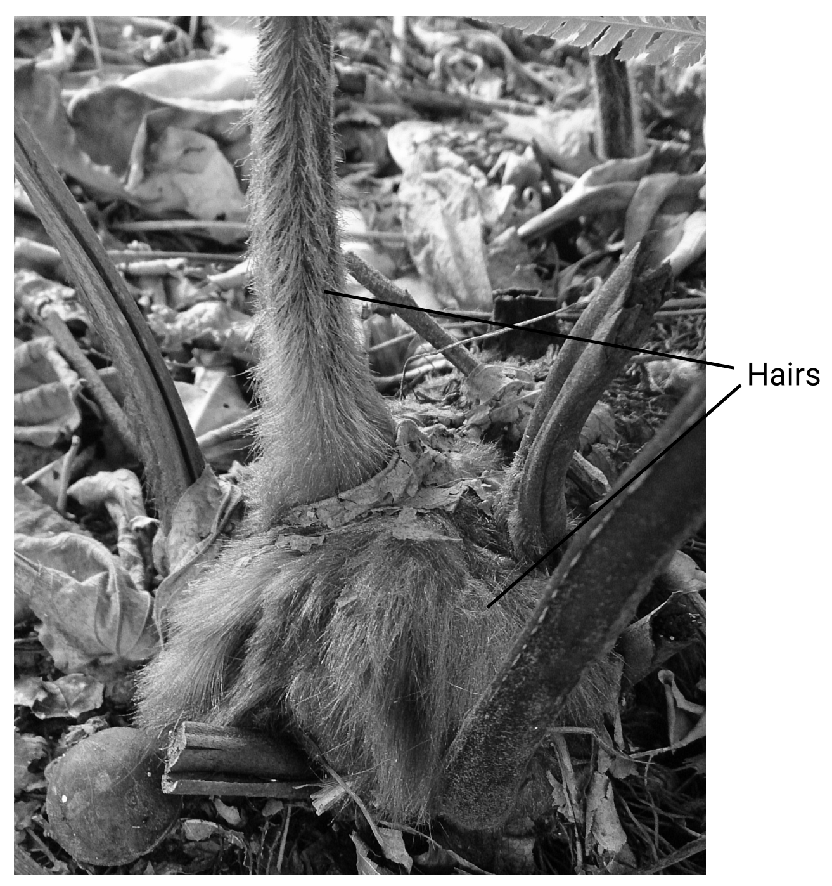
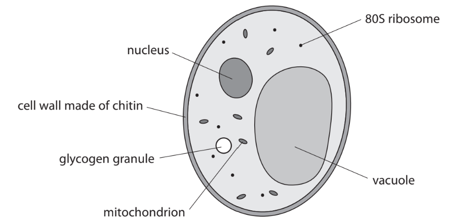
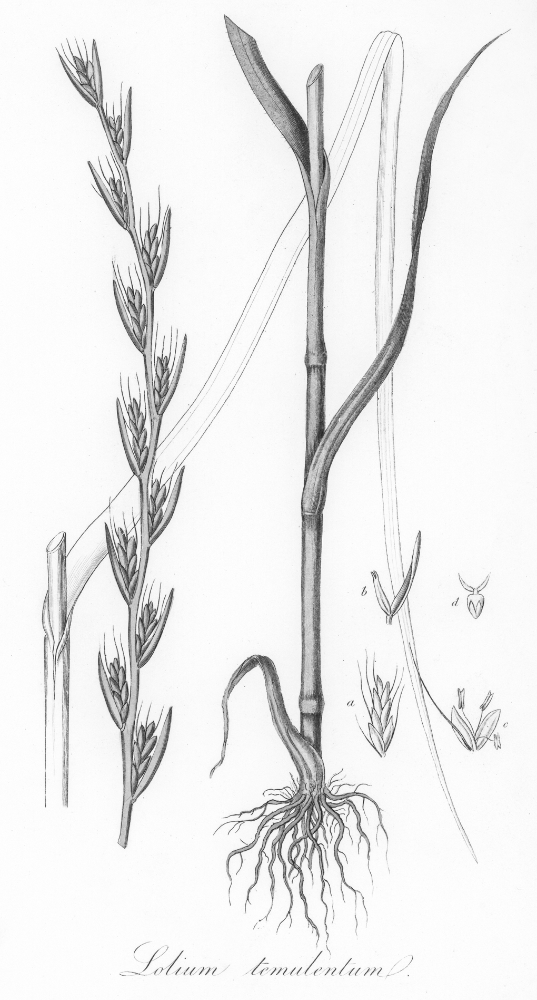
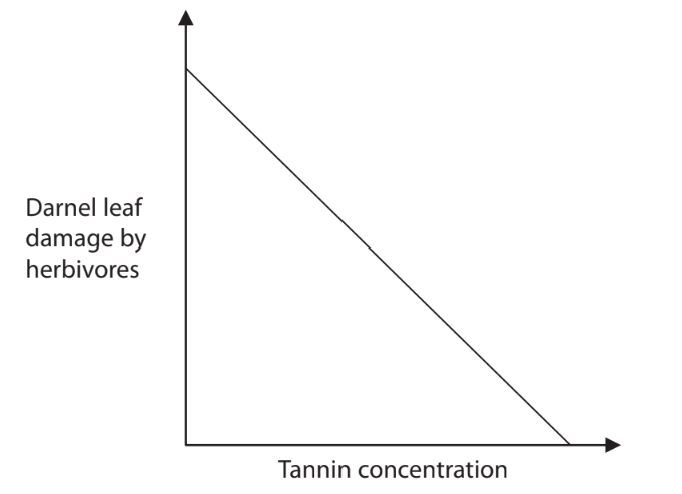
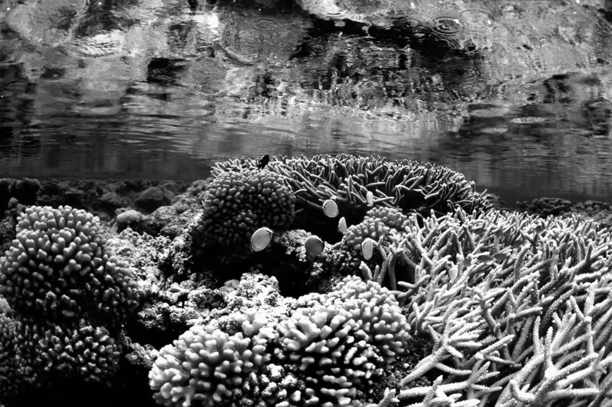
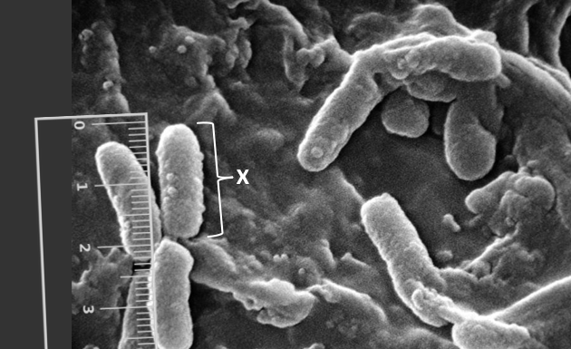
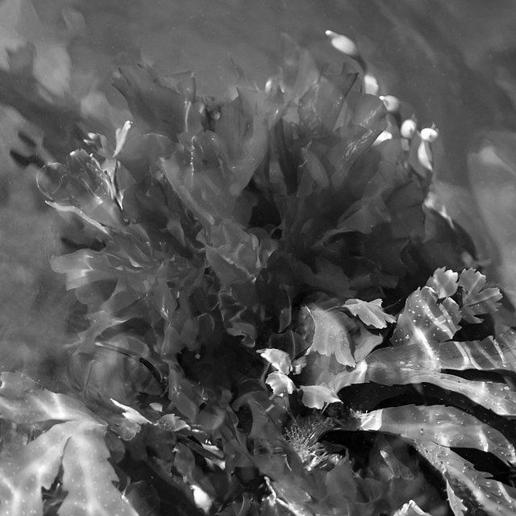
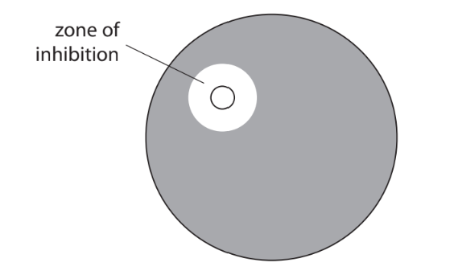

# Exam Questions — Plants & Bacterial Growth
**4. Plant Structure & Function, Biodiversity & Conservation** · Edexcel International A Level (IAL) Biology (YBI11)
> Source: [https://www.savemyexams.com/international-a-level/biology/edexcel/18/topic-questions/4-plant-structure-and-function-biodiversity-and-conservation/plants-and-bacterial-growth/exam-questions/](https://www.savemyexams.com/international-a-level/biology/edexcel/18/topic-questions/4-plant-structure-and-function-biodiversity-and-conservation/plants-and-bacterial-growth/exam-questions/) · 5 questions · total 59 marks

## Q1 — medium — 12 marks · exam-questions

### 6((a)) — 4 marks — command: explain — structured — from paper Oct/Nov 2020 · WBI12/01
Stomach ulcers are sores that develop in the lining of the stomach.

The mucus produced by the stomach prevents bacteria from reaching the lining of the stomach.

Stomach ulcers can be caused by infection with the bacterium *Helicobacter pylori*.

These bacteria reproduce in the stomach as it provides all the conditions required for the growth of bacteria.

Explain the conditions needed for the growth of bacteria.

### 6((b)) — 8 marks — command: multiple — structured — from paper Oct/Nov 2020 · WBI12/01
The plant *Cibotium barometz* is native to several countries in East Asia.

The photograph shows hairs on the surface of this plant.

Mokkie, CC BY-SA 4.0 <https://creativecommons.org/licenses/by-sa/4.0>, via Wikimedia Commons

Extracts from the hairs on this plant have antimicrobial properties.

An investigation compared the use of this extract and the drug omeprazole to treat stomach ulcers in rats.

The mass of mucus and the area of ulcer were measured in five groups of rats.

The table shows the treatments and the results of this investigation.

| **Group** | **Treatment** **/ mg kg****-1** | **Mean mass of mucus** **/ g** | **Mean area of ulcer** **/ mm****2** |
|---|---|---|---|
| Control rats with no ulcer | 0.00 | 2.28 | 0.00 |
| Control rats with ulcer | 0.00 | 0.75 | 802.71 |
| Rats with ulcer treated with omeprazole | 20.00 | 1.92 | 95.71 |
| Rats with ulcer treated with extract | 125.00 | 1.87 | 202.80 |
| Rats with ulcer treated with extract | 500.00 | 2.17 | 172.80 |

(Source: adapted from https://www.ncbi.nlm.nih.gov/pmc/articles/PMC5244617/)

(i) Calculate the percentage decrease in the mean areas of ulcer of the rats treated with omeprazole compared with the control rats with ulcer.

**(2)**

(ii) Explain the results of this investigation.

Use all the information in Question 6 to support your answer.

**(6)**

## Q2 — medium — 15 marks · exam-questions

### 8((a)) — 3 marks — command: contrast — structured — from paper June 2021 · WBI12/01
Some fungi infect plants and affect the expression of the plant genes.

A student drew and labelled a fungal cell.

Compare and contrast the structure of this fungal cell and a plant cell.

### 8((b)) — 12 marks — command: multiple — structured — from paper June 2021 · WBI12/01
The illustration shows darnel, a species of grass.

Raw Pixel, CC0 1.0 <https://creativecommons.org/publicdomain/zero/1.0/>, via Raw Pixel

The fungus *Epichloë festucae* lives within darnel for part of its life cycle.

The fungus influenced the expression of certain genes in the plant cells.

- There was reduced expression of some genes involved in DNA synthesis.
- There was reduced expression of some genes involved with the synthesis of phospholipids, starch and sucrose.

(i) Explain the effect of this fungal infection on the growth of the plant.

**(4)**

(ii) The fungus and the plant both benefit from this relationship.

The fungus absorbs nutrients from the plant.

The expression of certain genes in the plant cells is increased when infected with the fungus.

These genes are involved in the synthesis of tannin and flavonoids.

The graph shows the relationship between tannin concentration and the degree of darnel leaf damage by herbivores (grazing animals).

The table shows the antimicrobial effect of different concentrations of flavonoids on cultures of the bacterium *Pseudomonas aeruginosa.*

This bacterium causes disease in plants.

| **Flavonoid concentration** **/ μgcm****-3** | **Diameter of inhibition zone / mm** |
|---|---|
| 500 | 7.0 |
| 666 | 8.0 |
| 1 000 | 9.0 |

The fungus increases the expression of the genes involved in the synthesis of tannin and flavonoids.

Discuss the advantages and disadvantages of this for the fungus and for the infected plants.

**(6)**

(iii) The bacterium *Pseudomonas aeruginosa* causes lung infections in humans.

Describe how a drug containing flavonoids could be tested in a stage II drug trial.

**(2)**

## Q3 — medium — 9 marks · exam-questions

### 4((a)) — 2 marks — command: suggest — structured — from paper Oct/Nov 2021 · WBI12/01
A coral reef is an underwater ecosystem.

The photograph shows a coral reef in the Caribbean.

A photosynthetic bacterium found on these coral reefs produces a chemical called curacin A.

This chemical has been found to be effective against some colon and kidney cancers.

Large quantities of this organism need to be grown in a culture medium in order to extract enough curacin A.

The culture is kept at the optimum temperature for the growth of this bacterium.

Suggest **two** other conditions that would be needed for maximum growth of this bacterium.

1..................................................... 2.....................................................

### 4() — 7 marks — command: multiple — structured — from paper Oct/Nov 2021 · WBI12/01
Scientists conduct experiments to determine the effectiveness and safety of new drugs.

(i) Which of the following scientists tested the effectiveness of digitalis soup?

**(1)**

☐ **A** Adolf Fick

☐ **B** Matthew Meselson and Franklin Stahl

☐ **C** Godfrey Hardy and Wilhelm Weinberg

☐ **D** William Withering

(ii) Curacin A is being developed as a drug to treat some colon and kidney cancers in humans.

Suggest how a suitable dose for cancer treatment would be determined in human trials.

**(2)**

(iii) Describe how a double-blind clinical trial would be performed with this cancer drug.

**(4)**

## Q4 — medium — 9 marks · exam-questions

### 5((a)) — 2 marks — command: multiple — structured — from paper Jan 2022 · WBI12/01
*Listeria monocytogenes* is a bacterium that contaminates food and causes the disease listeriosis.

The image shows a species of bacteria that appears the same as *Listeria monocytogenes*, as seen using an electron microscope.

A ruler measuring in cm has been included for scale.

Photo Credit: Janice Haney CarrContent Providers(s): CDC/ Janice Haney Carr, Public domain, via Wikimedia Commons

The bacterium labelled X on the photograph is 0.5μm in length.

(i) Calculate the magnification of this image.

**(1)**

(ii) State why a light microscope cannot be used to view these bacteria.

**(1)**

### 5((b)) — 2 marks — command: explain — structured — from paper Jan 2022 · WBI12/01
The plant oregano is native to Mediterranean and western Asian countries.

Oregano oil contains antimicrobial substances.

This oil can be used in the production of plastic used to package food.

Explain why this packaging may be chosen over traditional oil‐based plastic packaging.

### 5((c)) — 2 marks — command: multiple — structured — from paper Jan 2022 · WBI12/01
The photograph shows green algae called sea lettuce (*Ulva lactuca*).

W.carter, CC0, via Wikimedia Commons

Sea lettuce contains chemicals called fucoxanthins that have antimicrobial properties.

The antimicrobial properties of these chemicals were investigated.

Discs containing fucoxanthin chemical were placed onto four agar plates each seeded with a different type of bacteria.

These plates were then incubated for 24 hours at 25°C and the zone of inhibition measured.

The diagram shows the zone of inhibition.

The table shows the results of this investigation.

| **Type of bacteria** | **Mean diameter of the zone of inhibition / mm** | **Range / mm** |
|---|---|---|
| *  E. coli* | 10.2 | ±0.72 |
| *  S. aureus* | 11.1 | ±0.63 |
| *  L. monocytogenes* | 6.0 | ±0.41 |
| *  P. aeruginosa* | 7.5 | ±0.55 |

(i) Which type of bacteria was least affected by fucoxanthin?

**(1)**

☐ **A** *E. coli*

☐ **B** *S. aureus*

☐ **C** *L. monocytogenes*

☐ **D** *P. aeruginosa*

(ii) The table shows the mean and the range of the diameter of the zone of inhibition for each type of bacteria.

Calculate the maximum difference in the diameter of the largest and smallest zones of inhibition.

**(1)**

### 5((d)) — 3 marks — command: describe — structured — from paper Jan 2022 · WBI12/01
Drugs containing these chemicals must be tested for safety before they can be approved and used to treat humans.

Three‐phase testing can be used to check for the safety and effectiveness of these chemicals.

Describe the roles of phase I and phase II.

## Q5 — medium — 14 marks · exam-questions

### 1() — 3 marks — command: describe — structured
A student wanted to carry out an investigation with *Escherichia coli* bacteria to compare the antimicrobial properties of garlic extract and onion extract.

Describe how the student could prepare a sterile extract of the plant material.

### 2() — 3 marks — command: explain — structured
The student used aseptic techniques to transfer bacteria. Explain why the following steps are necessary:

(i) Flaming the neck of the culture bottle

[1]

(ii) Opening the Petri dish lid at an angle

[1]

(iii) Incubating the plate at 25 °C rather than 37 °C

[1]

### 3() — 6 marks — command: plan — structured
Plan an investigation to determine which plant extract is a more effective antimicrobial agent.

### 4() — 2 marks — command: calculate — structured
A zone of inhibition had a diameter of 18 mm.

Calculate the area of this zone.
