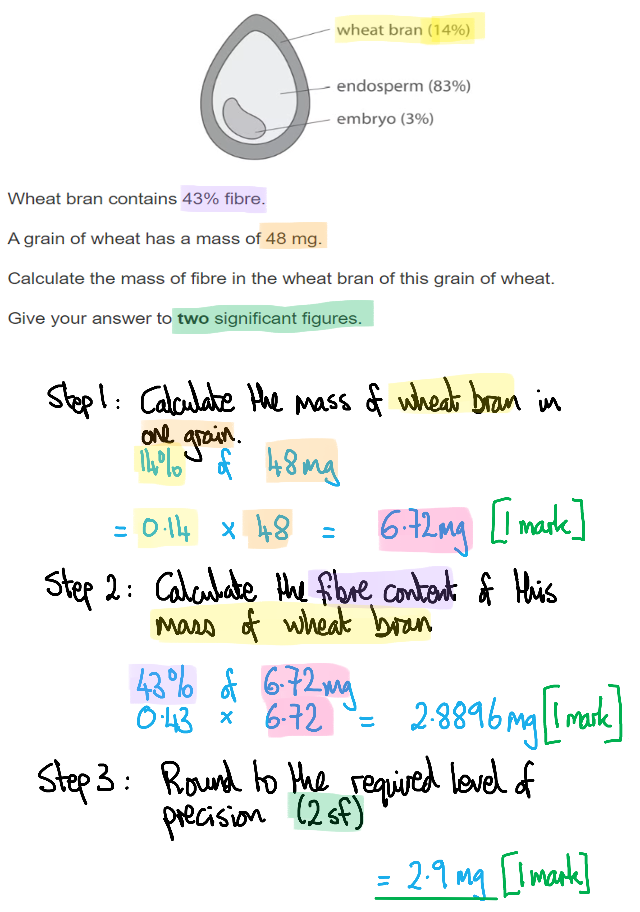
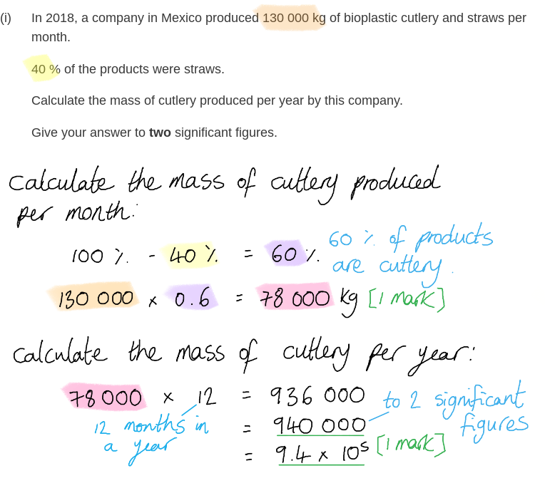

# Mark Schemes — Plants & Conservation
**4. Plant Structure & Function, Biodiversity & Conservation** · Edexcel International A Level (IAL) Biology (YBI11)

## Q1 — medium — 9 marks · exam-questions

### 4((a)) — 3 marks
The calculation of the mass of fibre in the wheat bran of this grain of wheat...

- (Mass of bran =) 6.72 (mg); **[1 mark]**
- (Mass of fibre =) 2.889 (mg); **[1 mark]**
- 2.9 (mg); **[1 mark]**

*Correct answer with no working scores full marks.*

**[Total: 3 marks]**

> *Make sure that you don't miss the instruction on how to present your answer; you've done all the work to get the right numerical answer, so make sure you don't squander an easy mark by forgetting about **significant figures**. *

### 4((b)) — 3 marks
The advantages of using cutlery and plates made from wheat bran instead of oil‐based plastics are...

- (Wheat bran plates are) more sustainable (than oil-based plastic) / are renewable / can be regrown / will be available for future generations; **[1 mark]**
- (They are) biodegradable / can decompose / be broken down by decomposers; **[1 mark]**
- (They are) carbon neutral / do not contribute to the greenhouse effect/global warming; **[1 mark]**

**[Total: 3 marks]**

### 4((c)) — 3 marks
The role of the pollen tube and nuclei in the formation of the endosperm nucleus can be explained as follows...

Any **three** of the following:

- The pollen tube transports generative nucleus/male nuclei to embryo sac/ovary/micropyle / down the style; **[1 mark]**
- (By releasing) digestive enzymes; **[1 mark]**
- One of the male nuclei fertilises/fuses with the (two) polar nuclei; **[1 mark]**
- (Causing) the formation of a <u>3n/triploid</u> endosperm (nucleus); **[1 mark]**

***Allow ****'sperm' for male nucleus.*

**[Total: 3 marks]**

> *Note that you have been asked specifically about the **formation of the endosperm nucleus** here, and not about formation of the zygote. You should also make sure not to confuse the roles of the various nuclei. The **generative nucleus divides** to form two new male nuclei; one of these fuses with two polar nuclei to form the triploid endosperm, while the other goes on to form the zygote. *

## Q2 — medium — 10 marks · exam-questions

### 4((a)) — 6 marks
(i) The effect of length of time in storage on the germination of these seeds is…

- Seed germination remains high / constant to begin with / initially; **[1 mark]**
- Germination decreases/reduces with increased time in storage; **[1 mark]**

(ii) Advantages of the given methods in seed banks are...

Any **four** of the following:

*Storing seeds from many different plants*

- Increases genetic diversity; **[1 mark]**
- More individuals increases the probability of having more alleles / different genotypes / heterozygotes **OR** more individuals reduces the chances of seeds being from homozygous plants / plants with (genetic) disease; **[1 mark]**

*Germinating seed samples and allowing the grow into adult plants*

- Allows pollination / sexual reproduction to occur; **[1 mark]**
- Produces new seeds for storage **OR** produces seeds that are genetically different (from parents); **[1 mark]**
- Replaces seeds that have been stored for a long time / too long **OR** increases the viability / chance of germination of stored seeds; **[1 mark]**

**[Total: 6 marks]**

> *(i) When describing data you should always aim to include descriptions of **all stages** of a graph. Here there is an overall downward trend in germination rates, but the graph does not slope downwards throughout the storage time, showing inititally constant germination rates before entering a decline.*

> *(ii) You may not have specifically learned about the details of methods used in seed banks, but you should be able to use information provided in part (i) and your own understanding of genetic variation and sexual reproduction to answer this question.*

### 4((b)) — 4 marks
(i) The mass of cutlery produced per year by this company is…

- 78 000 (kg); **[1 mark]**
- (78 000 x 12 =) 940 000/9.4 x 105 kg; **[1 mark]**

*Full marks can be awarded for the correct answer of 940 000 kg in the absence of other calculations.*

(ii) The term sustainable, with reference to the cutlery produced from the seeds of avocados, refers to...

- More (cutlery) can constantly be made **OR** production (of cutlery) is carbon neutral **OR** (cutlery) product is biodegradeable **OR** (cutlery) product is made from waste products (of food industry); **[1 mark]**
- Avocados are being grown continuously / can be grown by future generations (so materials will not run out like a fossil fuel would); **[1 mark]**

**[Total: 4 marks]**

## Q3 — medium — 6 marks · exam-questions

### 1() — 3 marks
To calculate rs:

- Determine the rank of mean chlorophyll content, D and D2

| Magnesium ion concentration (mM) | Rank of magnesium ion concentration | Mean chlorophyll content (mg g⁻¹) | Rank of mean chlorophyll content | D | D² |
|---|---|---|---|---|---|
| 0 | 1 | 0.9 | 1 | 0 | 0 |
| 0.2 | 2 | 1.5 | 2 | 0 | 0 |
| 0.4 | 3 | 2.3 | **Final answer:** **4** | **Final answer:** **-1** | **Final answer:** **1** |
| 0.6 | 4 | 2.1 | **Final answer:** **3** | **Final answer:** **1** | **Final answer:** **1** |
| 0.8 | 5 | 3.2 | 5 | 0 | 0 |
| 1.0 | 6 | 3.8 | 6 | 0 | 0 |

**[1 mark]**

- Substitute values into the formula:

rs = 1 -`fraction numerator 6 cross times 2 over denominator 6 open parentheses 6 squared minus 1 close parentheses end fraction` **[1 mark]**

= 1 - $\frac{12}{210}$

= 1 - 0.057

= **0.943 ****[1 mark]**

> **[mark-scheme]**
> Award full marks for the correct rs value in the absence of additional calculations.

### 2() — 2 marks
> **[mark-scheme]**
> - 0.943 is greater than the critical value of 0.886 **[1 mark]**
> - Reject the null hypothesis that there is no significant correlation between magnesium ion concentration and chlorophyll content **[1 mark]**
> 
> Accept error carried forward provided that the comparison and conclusion are consistent with the calculated value of rs

> **[exam-tip]**
> When interpreting the result of a Spearman's rank correlation test, you must address two distinct points to access full marks.
> 
> - First, explicitly compare your calculated rs value to the critical value given in the table, stating whether your value is greater or less
> - Second, state your conclusion about the null hypothesis — but note that simply writing "accept/reject the null hypothesis" is not sufficient; your conclusion must be a complete statement that refers back to the specific variables in the investigation and uses the word "correlation."

### 3() — 1 marks
> **[mark-scheme]**
> Any **one** from:
> 
> - Nitrate ions/NO₃⁻  **AND **synthesis of amino acids / proteins
> - Calcium ions/Ca²⁺ **AND** formation of cell walls / middle lamella
> 
> **[1 mark]**

## Q4 — medium — 7 marks · exam-questions

### 1() — 1 marks
> **[mark-scheme]**
> - To ensure that any changes in breaking force / tensile strength are due to the length/independent variable and not the diameter / cross-sectional area of the fibre **[1 mark]**

> **[exam-tip]**
> This question is about controlling variables. When investigating the effect of an independent variable (length), all other variables that could affect the dependent variable (tensile strength) must be kept constant.

### 2() — 3 marks
> **[mark-scheme]**
> (i) The student should determine the breaking force of each fibre as follows:
> 
> - Add masses to the hanger **AND** record the total mass at which the fibre snaps/breaks **[1 mark]**
> 
> (ii) Small masses are more suitable because:
> 
> Any **one** from
> 
> - Allows the exact / precise mass at which the fibre snaps/breaks to be determined **OR** narrows the range within which the breaking force lies **[1 mark]**
> 
> (iii) The student could check that their results are repeatable as follows:
> 
> - Repeat the procedure at least three times for each fibre length **AND** check that similar/consistent values are obtained each time OR identify/exclude any anomalous values before calculating a mean **[1 mark]**

> **[exam-tip]**
> Precision and repeatability describe different things and are checked in different ways. (ii) targets precision: using small masses narrows the range within which the breaking force could lie, so the exact snapping point can be identified more closely. (iii) targets repeatability: repeating the procedure under the same conditions allows the student to check whether similar values were obtained each time.
> 
> A common pitfall is to write that repeating the experiment and calculating a mean "makes the results more repeatable" or "more reliable." This is incorrect; carrying out repeats allows repeatability to be checked, not improved. The check only works if the values obtained are compared, and any anomalies are identified and eliminated.

### 3() — 3 marks
The tensile strength of the fibre can be calculated as follows:

- Calculate the cross-sectional area of the fibre

area = πr²

= π × 0.28²

= 0.2463 mm² ** [1 mark]**

- Calculate the force exerted by the 500g mass

  - 100 g = 0.981 N

force  = 5 × 0.981

= 4.905 N** [1 mark]**

- Substitute the numbers into the equation:

tensile strength = force ÷ cross-sectional area

= 4.905 ÷ 0.2463

= **19.9 **N mm⁻²** [1 mark]**

> **[mark-scheme]**
> Award full marks for the correct answer in the absence of additional calculations.
> 
> Allow answers calculated using slightly different rounding
> 
> Award an error carried forward (ECF) mark for the candidate's force ÷ their area, even if the result ≠ 19.9, where the difference comes only from an error already penalised above

> **[exam-tip]**
> This question provides the tensile strength equation, but do not assume this will always be the case. In short calculation questions of this type, the formula is often given, but in experimental design questions — where you are asked to plan or describe an investigation into plant fibres — you are expected to state the calculation method yourself. Make sure you know that tensile strength = force ÷ cross-sectional area.
> 
> The area of a circle formula (area = πr²) is GCSE-level maths and will not be provided. You are expected to recall it from memory.
> 
> Converting mass to force is another step you should expect to carry out yourself. You may be given the conversion directly (as in this question), or you may be given the value of g and asked to use force = mass × g. Take care to use the exact value provided — using the approximation g = 10 N kg⁻¹ instead of 9.81 or 9.8 will cost you a mark.
