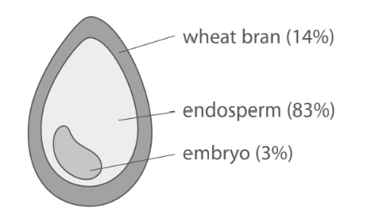
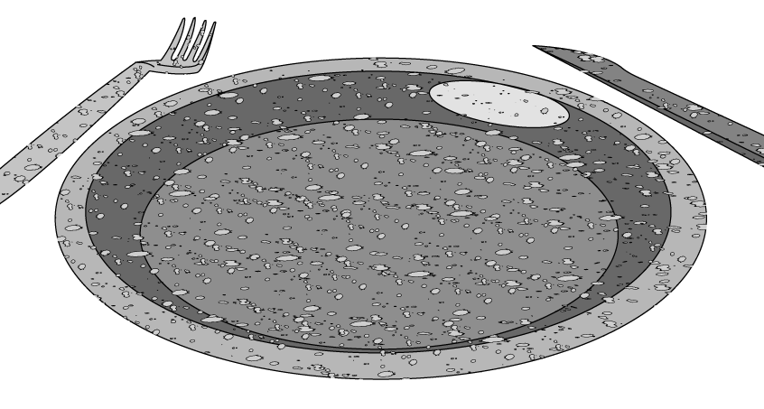
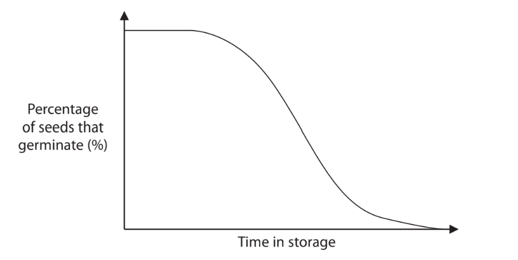
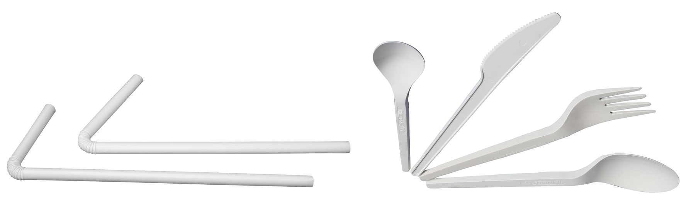

# Exam Questions — Plants & Conservation
**4. Plant Structure & Function, Biodiversity & Conservation** · Edexcel International A Level (IAL) Biology (YBI11)
> Source: [https://www.savemyexams.com/international-a-level/biology/edexcel/18/topic-questions/4-plant-structure-and-function-biodiversity-and-conservation/plants-and-conservation/exam-questions/](https://www.savemyexams.com/international-a-level/biology/edexcel/18/topic-questions/4-plant-structure-and-function-biodiversity-and-conservation/plants-and-conservation/exam-questions/) · 4 questions · total 32 marks

## Q1 — medium — 9 marks · exam-questions

### 4((a)) — 3 marks — command: calculate — structured — from paper Oct/Nov 2020 · WBI12/01
Plant‐based products can replace plastics produced from oil.

Wheat bran comes from the outer layers of grains of wheat.

The diagram shows the structure and composition of a grain of wheat.

Wheat bran contains 43 % fibre.

A grain of wheat has a mass of 48 mg.

Calculate the mass of fibre in the wheat bran of this grain of wheat.

Give your answer to **two** significant figures.

### 4((b)) — 3 marks — command: explain — structured — from paper Oct/Nov 2020 · WBI12/01
Disposable plates and cutlery can be made from either plant‐based products or from oil‐based plastics.

The photograph shows cutlery and a plate made from wheat bran.

© Save My Exams Ltd

Explain the advantages of using cutlery and plates made from wheat bran instead of oil‐based plastics.

### 4((c)) — 3 marks — command: explain — structured — from paper Oct/Nov 2020 · WBI12/01
The endosperm of a grain of wheat develops from the endosperm nucleus, formed during fertilisation.

Explain the role of the pollen tube and nuclei in the formation of the endosperm nucleus.

## Q2 — medium — 10 marks · exam-questions

### 4((a)) — 6 marks — command: multiple — structured — from paper June 2021 · WBI12/01
Seed banks are used to store seeds from a wide variety of plants. Some plants are a sustainable source of bioplastics.

The Germplasm Bank of Wild Species is the largest seed bank for wild species of plants in Asia.

Seeds from 8 500 species have been collected and stored.

Seeds were dried before being stored at temperatures below 0 °C.

The effect of length of time in storage on seed germination is shown in the graph.

(i) Describe the effect of length of time in storage on the germination of these seeds.

**(2)**

(ii) Two of the methods used in seed banks are:

- store seeds from many different plants of the same species, instead of many seeds from just one plant
- regularly germinate samples of the stored seeds, allowing them to grow into adult plants.

Explain the advantages of these methods.

**(4)**

### 4((b)) — 4 marks — command: multiple — structured — from paper June 2021 · WBI12/01
The photograph shows bioplastic straws and cutlery. Bioplastic can be produced from the seeds of avocados.

F. Kesselring, FKuR Willich, CC BY-SA 3.0 DE <https://creativecommons.org/licenses/by-sa/3.0/de/deed.en>, via Wikimedia

(i) In 2018, a company in Mexico produced 130 000 kg of bioplastic cutlery and straws per month.

40 % of the products were straws.

Calculate the mass of cutlery produced per year by this company.

Give your answer to **two** significant figures.

**(2)**

(ii) The use of these plant-based products is more sustainable than the use of cutlery and straws made from oil-based plastic.

Explain what is meant by the term sustainable, with reference to the cutlery produced from the seeds of avocados.

**(2)**

## Q3 — medium — 6 marks · exam-questions

### 1() — 3 marks — command: calculate — structured
A student investigated the effect of magnesium ion concentration on the chlorophyll content of leaves in *Lemna minor*, a small aquatic plant. Plants were grown in solutions containing different concentrations of magnesium ions for four weeks. Leaves were then collected and chlorophyll content was measured.

The results of the investigation described in (a) are shown in the table below.

| Magnesium ion concentration (mM) | Mean chlorophyll content (mg g⁻¹) |
|---|---|
| 0 | 0.9 |
| 0.2 | 1.5 |
| 0.4 | 2.3 |
| 0.6 | 2.1 |
| 0.8 | 3.2 |
| 1.0 | 3.8 |

A Spearman's rank correlation coefficient was calculated for the data in the table. The formula is:

rs = 1 − `fraction numerator 6 open parentheses sum d squared close parentheses over denominator n open parentheses n squared minus 1 close parentheses end fraction`

Use the table below to calculate the value of rs

| Magnesium ion concentration (mM) | Rank of magnesium ion concentration | Mean chlorophyll content (mg g⁻¹) | Rank of mean chlorophyll content | D | D² |
|---|---|---|---|---|---|
| 0 | 1 | 0.9 | 1 | 0 | 0 |
| 0.2 | 2 | 1.5 | 2 | 0 | 0 |
| 0.4 | 3 | 2.3 |   |   |   |
| 0.6 | 4 | 2.1 |   |   |   |
| 0.8 | 5 | 3.2 | 5 | 0 | 0 |
| 1.0 | 6 | 3.8 | 6 | 0 | 0 |

### 2() — 2 marks — command: explain — structured
The table shows the critical values at the p ≤ 0.05 probability level.

| Number of pairs of data | Critical value at the p ≤ 0.05 probability level |
|---|---|
| 4 | 1.000 |
| 5 | 0.900 |
| 6 | 0.886 |

Explain whether the null hypothesis should be accepted or rejected.

### 3() — 1 mark — command: identify — structured
Plants require other mineral ions from the soil in addition to magnesium ions.

Identify one other mineral ion required by plants, and state its role.

## Q4 — medium — 7 marks · exam-questions

### 1() — 1 mark — command: state — structured
A student investigated the effect of the length of a plant fibre on its tensile strength. The student used fibres extracted from the stem of *Urtica dioica* (stinging nettle).

State why the student should use fibres of a consistent diameter when investigating the effect of length on tensile strength.

### 2() — 3 marks — command: state — structured
The student clamped the fibre at one end and attached a mass hanger to the other.

(i) State how the student could determine the breaking force of each fibre.

[1]

(ii) The student had the choice of using small masses (e.g. 10 g) or large masses (e.g. 100 g) in this investigation.

State why small masses are more suitable.

[1]

(iii) State how the student could check that their results are repeatable.

[1]

### 3() — 3 marks — command: calculate — structured
The student used a fibre with a mean radius of 0.28 mm. The fibre broke when a total mass of 500 g was added to the hanger.

Use the information below to calculate the tensile strength of the fibre. Give your answer in N mm⁻².

tensile strength = force ÷ cross-sectional area

100 g exerts a force of 0.981 N
