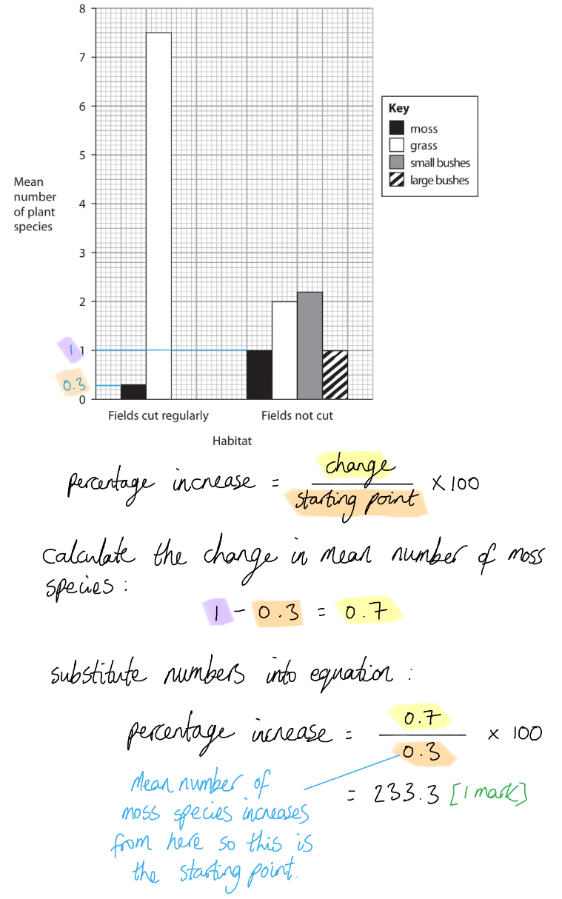
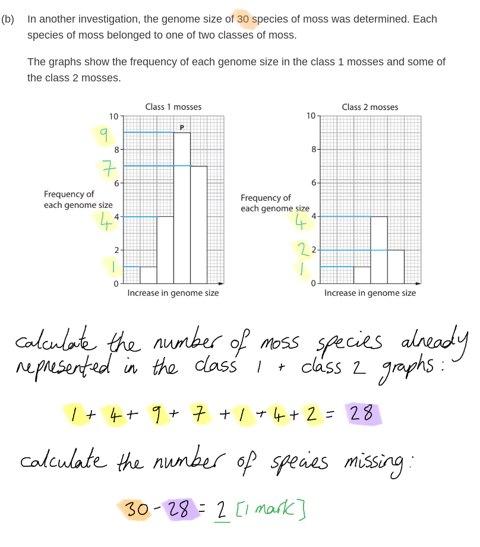
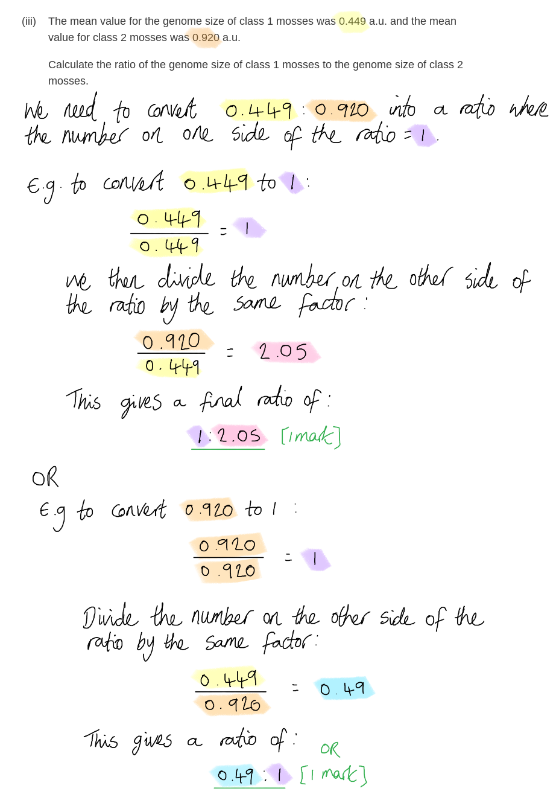
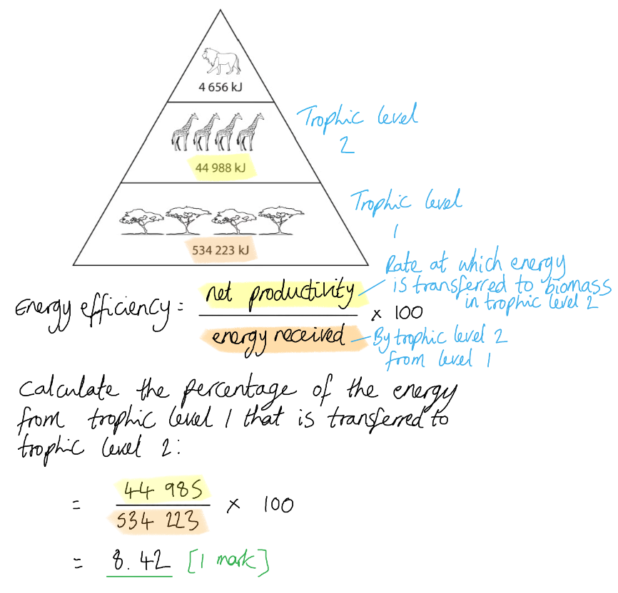
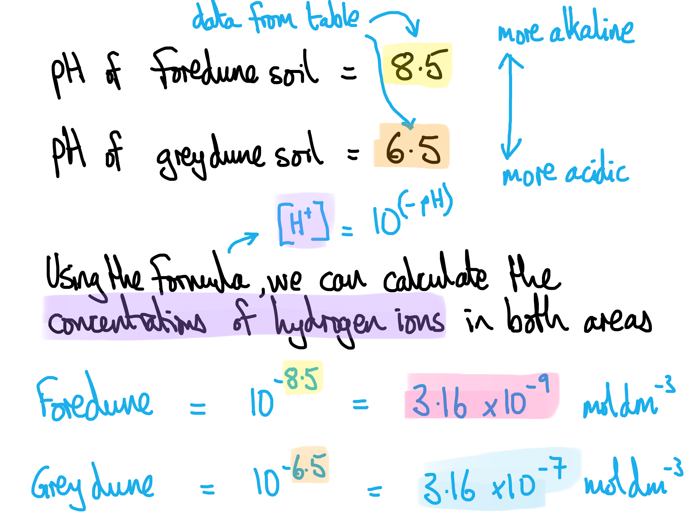
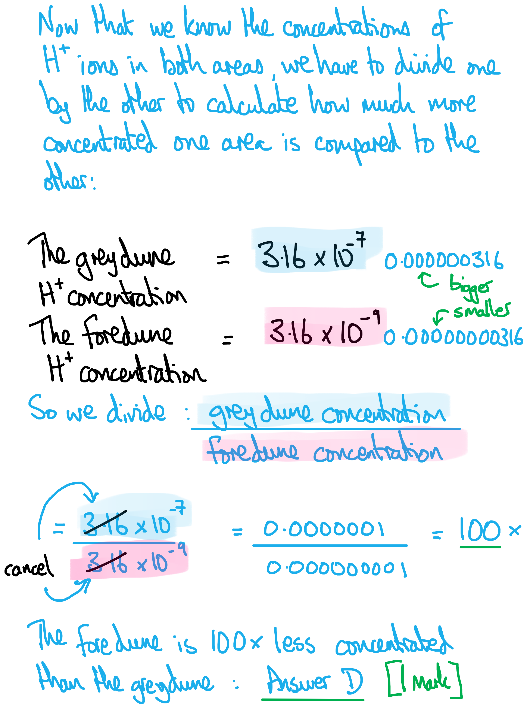
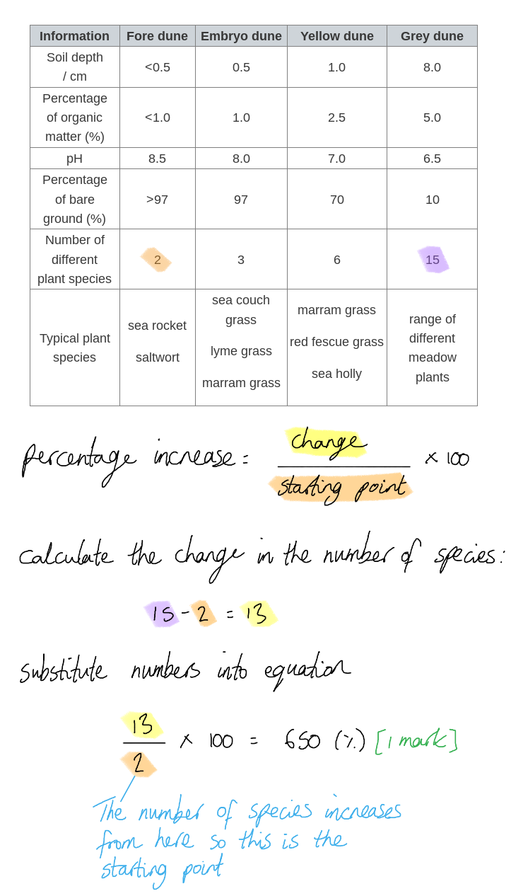
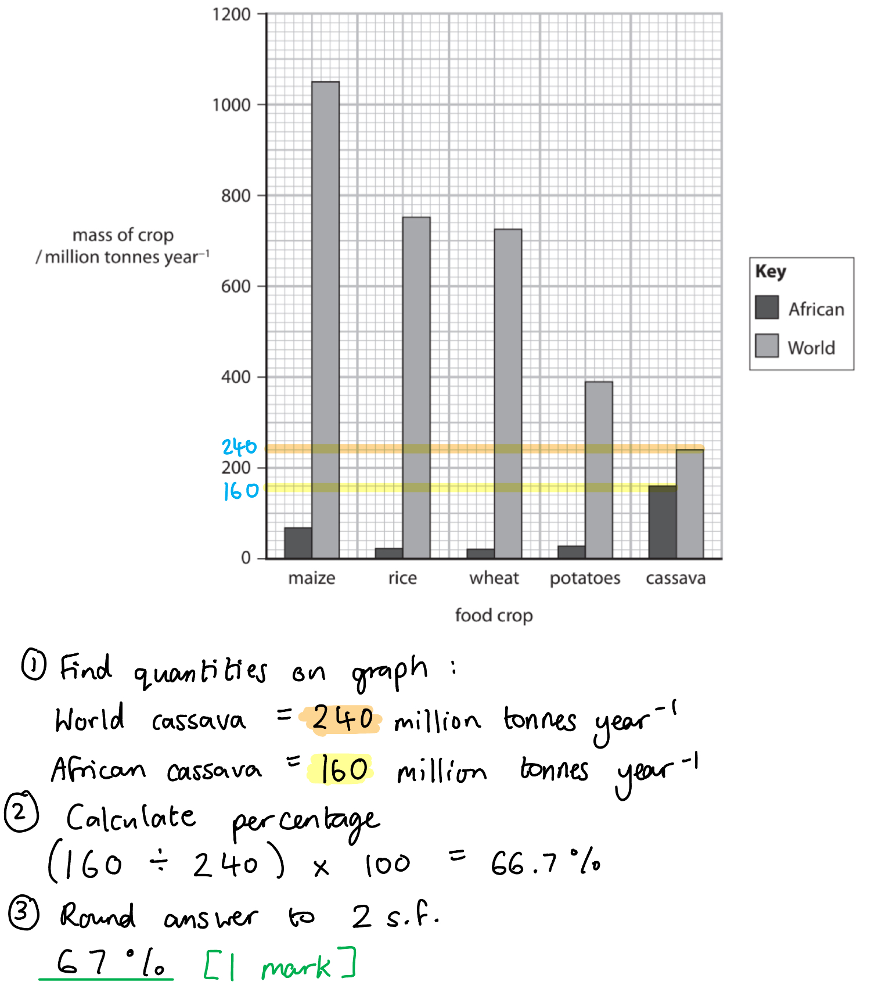
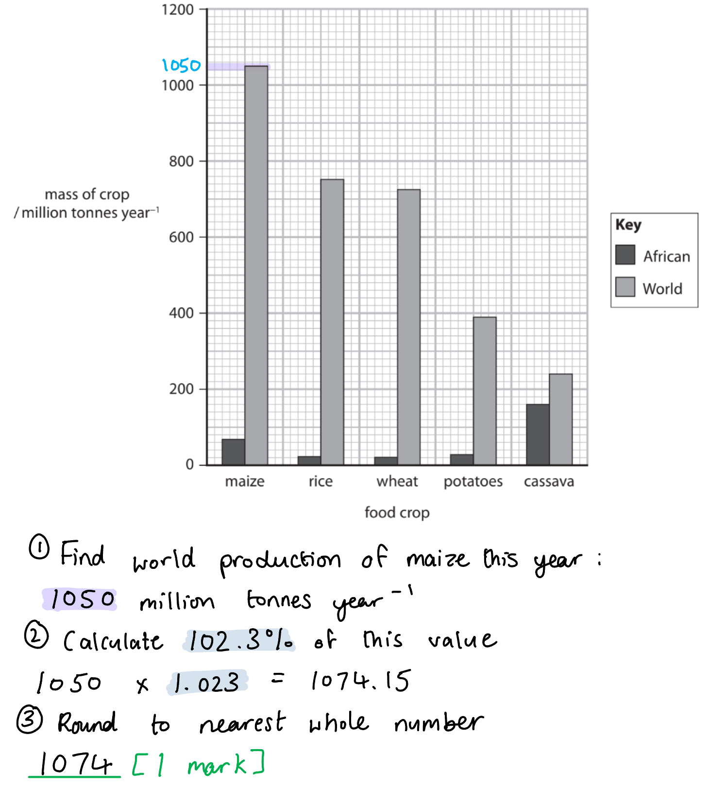
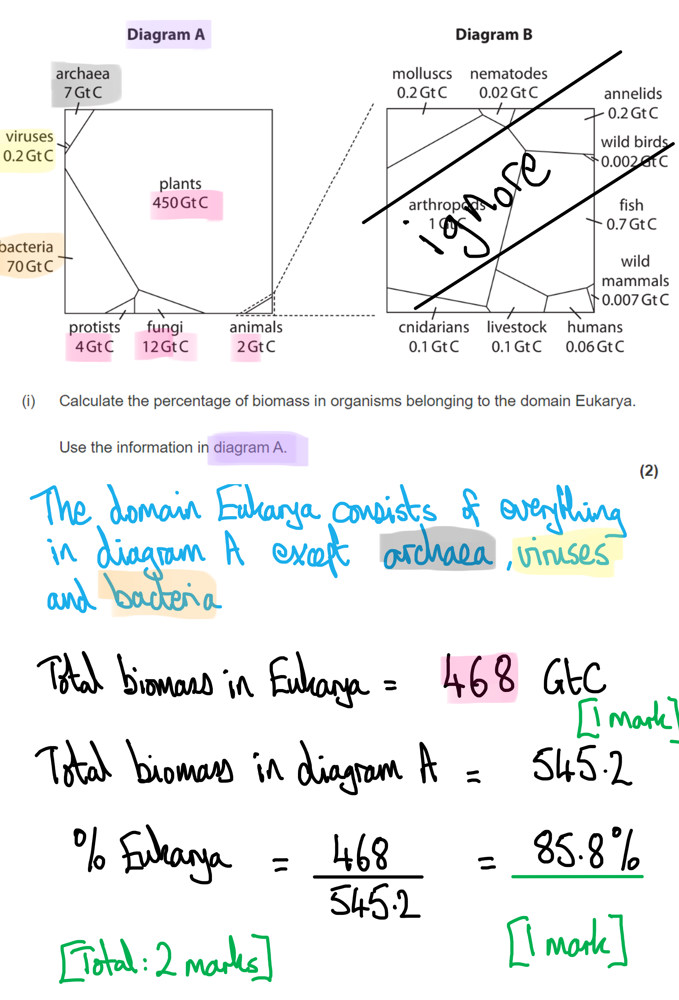

# Mark Schemes — Ecosystems
**5. Energy Flow, Ecosystems & the Environment** · Edexcel International A Level (IAL) Biology (YBI11)

## Q1 — medium — 8 marks · exam-questions

### 1() — 4 marks
(i) The type of factor that affected the plant species in two of these habitats is **D** because...

A reduction in the height of grass and competition with other organisms are both **living** factors, so are considered to be biotic.

> *Abiotic factors are non-living factors, so neither of the examples given are of this type.*

(ii) The percentage increase in the number of species of moss between the fields cut regularly and the fields not cut is **C** because...

**The mean number of moss species increases from 0.3 to 1; this is an increase of 233.3 %**

(iii) Reasons for the differences in the mean number of plant species in fields cut regularly and in fields not cut include...

Any **two** of the following**:**

- In the cut field the grass is faster-growing and reduces the light available to other plants; **[1 mark]**
- In the cut field the grass is faster-growing and absorbs more water / (named) mineral ions; **[1 mark]**
- In the cut field (small/large) bushes are slower-growing so do not have time to grow before they are cut back; **[1 mark]**
- In the cut field (small/large) bushes are damaged during the cutting process (so they die / are unable to continue growing); **[1 mark]**

***Accept**** "in the *<u>*uncut field*</u>* bushes become established and shade out the grass (so less grass is able to grow)" for marking point 1.*

***Accept ****"in the *<u>*uncut field*</u>* bushes become established and take up more water / (named) mineral ions (so the grass has fewer nutrients for growth)" for marking point 2.*

> *Make sure that it is clear which field you are referring to in your explanations.*

**[Total: 4 marks]**

### 1() — 4 marks
(i) The bar labelled P represents **D** because...

**This bar is the one with the greatest area, showing that this is the most frequent genome size in the moss sample; the most frequently occurring value is the mode. The bars represent continuous data and are touching, so the graph is a histogram and not a bar chart.**

> *The bar that represents the maximum genome size (B) is the bar to the right of bar P; the genome size increases as you read across the x-axis from left to right.*

> *It is worth noting that a true histogram not only uses areas of the bars to represent frequencies, but also plots frequency **density** on the y-axis. The graph in this question is a different kind of histogram, which still has the bars touching to show continuous, grouped data.*

(ii) The frequency of the missing genome size is…

- 2; **[1 mark]**

(iii) The ratio of the genome size of class 1 mosses to the genome size of class 2 mosses...

- 1 : 2.049 / 1 : 2.05 / 1: 2 **OR **0.488 : 1 / 0.49 : 1 / 0.5 : 1; **[1 mark]**

***Reject**** 1 : 2.1 as this is incorrect rounding*

(iv) Evidence that supports the suggestion that the chromosomes in class 2 mosses are found in pairs is...

- The genome size of class 2 mosses is (approximately) twice the genome size of class 1 mosses; **[1 mark]**

> *There is an approximate ratio of **1 : 2** (or 0.5 : 1) for the class 1 mosses in comparison to the class 2 mosses (see part (iii)), showing that the genomes of the class 2 mosses are **roughly twice the size** of the genomes of class 1 mosses. One explanation for this is that the class 1 moss cells are **haploid** (chromosomes are not in pairs) while the class 2 mosses are **diploid **(chromosomes have homologous pairs)*

**[Total: 4 marks]**

## Q2 — medium — 9 marks · exam-questions

### 3() — 8 marks
(i) The meaning of the term habitat, described using information in the diagram, is…

- A place where organisms live; **[1 mark]**
- (In the diagram the) plains is the place **and** the lions/giraffes/acacia trees are the organisms **OR **the plains is where the lions/giraffes/acacia trees live; **[1 mark]**

(ii) The meaning of the term population, described using information in the diagram, is...

- Organisms of <u>one species</u> found in a particular area; **[1 mark]**
- (In the diagram this is) lions/giraffes/acacia trees found on the plains; **[1 mark]**

(iii) The meaning of the term community, described using information in the diagram, is...

- A group of organisms of different species interacting in a particular area; **[1 mark]**
- (In the diagram there are) lions **AND** giraffes **AND** acacia trees (interacting together); **[1 mark]**

***Accept**** two examples of species for marking point 2.*

(iv) The meaning of the term niche, described using information in the diagram, is...

- The role of an organism in its habitat; **[1 mark]**

**AND**

Any **one** of the following:

- Acacia trees provide food for giraffes; [1 mark]
- Acacia trees provide shade for the lions; [1 mark]
- Giraffes provide food for lions; [1 mark]
- Giraffes control the size / number of acacia trees; [1 mark]
- Lions control the number of giraffes; [1 mark]
- Lions/giraffes are a course of mineral ions for the acacia trees (when they die and decompose); [1 mark]

**[Tota****l: 8 marks]**

> *Here it is essential that you know the definitions, but also that you know how to apply the definitions to the example in the question. For full marks you need to **state each definition** and **state where it can be seen** in the example ecosystem.*

### 3((b)) — 1 marks
The efficiency of energy transfer between trophic level one and trophic level two is...

- 8.42/8.4/8 (%); **[1 mark]**

**[Total: 1 mark]**

## Q3 — medium — 15 marks · exam-questions

### 7() — 8 marks
(i) The difference in concentration of hydrogen ions in a fore dune compared with a grey dune is **D** because...

A solution of pH 8.5, being more alkaline than a solution of pH 6.5, has fewer hydrogen ions (10-8.5 is a **smaller** number than 10-6.5). It must be **more than 2×** fewer as the scale is a **log** scale, so a change in two units on the scale does not equal a doubling of the units, it equals a 10× followed by another 10×. This means that **D** is the only possible answer**.**

(ii) The percentage increase in the number of plant species on the grey dune compared with the fore dune is...

- 650 (%); **[1 mark]**

(iii) *This is a **level-marked question**, meaning that it is marked according to the **levels table**. The indicative content points below the table are not to be used in the usual 'one point = one mark' way, but should be used together with the levels table to determine the number of marks which should be awarded.*

> *For this question:*

- *D** = **d**escriptions of data*
- *E** = **e**xplanation *

| **Level 1** | **[1 mark]** | 1 description of data |
|---|---|---|
| **[2 marks]** | 3 descriptions of data **OR **1 description of data **and** a corresponding explanation |   |
| **Level 2** | **[3 marks]** | 2 descriptions of data **and** both points are explained |
| **[4 marks]** | 3 descriptions of data **and** all points are explained |   |
| **Level 3** | **[5 marks]** | 4 descriptions of data **and** all points are explained |
| **[6 marks]** | 5 descriptions of data **and** all points are explained |   |

The changes in these sand dunes that occur with distance from the sea can be explained as follows...

*Indicative content relating to soil depth*

- (D) Soil depth increases with distance from the sea
- (E) This is due to the increased age of the sand dunes
- (E) There is more time for humus / organic matter to accumulate
- (E) The roots of plants prevent soil from being washed / blown away

*Indicative content relating to organic material*

- (D) The amount of organic material increases with distance from the sea
- (E) This is due to increased age of the sand dunes
- (E) More time for decomposition which adds organic material to the soil
- (E) Decomposition occurs due to the activity of microorganisms
- (E) The roots of plants prevent organic matter in the soil from being washed / blown away

*Indicative content relating to pH*

- (D) Soil pH falls with distance from the sea
- (E) Due to humus / organic matter being added to the sand
- (E) More rain (over time) washes minerals out of soil

*Indicative content relating to bare rock*

- (D) Percentage of bare rock decreases with distance from sea
- (E) Pioneer species break it down (e.g. as their roots grow into cracks in the rock)
- (E) As more soil is produced the bare rock is covered

*Indicative content relating to plant species richness*

- (D) The number of different plant species / plant species richness increases with distance from the sea
- (E) The soil nutrient content is increasing / salinity is decreasing
- (E) Soil contains more organic material / holds more moisture than sand (and so can support more different species of plant)
- (E) More niches are available

*Indicative content relating to plant type*

- (D) Types of plant change with distance from the sea (e.g. plants are larger / are shrubs and trees rather than small herbaceous plants)
- (E) Soil becomes favourable to more plant species
- (E) The presence of more plants further improves the soil conditions

> *To score well in this question you need to focus on a **breadth** of points; give as **many different reasons** as you can for the changes that occur as distance from the sea increases, and include a **short explanation** for each one. Focusing in on the detail of one or two reasons and writing long explanations will limit the number of marks that will be accessible.*

**[Total: 8 marks]**

### 7() — 7 marks
(i) Conclusions that can be drawn from this graph include…

Any **three** of the following**:**

- NPP above ground is always greater than the NPP below the ground; **[1 mark]**
- The NPP above and below the ground depends on the type of sand dune / differs between the different types of dune; **[1 mark]**
- Fixed sand dunes have the highest (total) NPP **OR** shifting sand dunes have the lowest (total) NPP; **[1 mark]**
- Shifting sand dunes have the largest percentage difference / ratio between NPP above the ground and NPP below the ground; **[1 mark]**

(b) (ii) The products of the light-independent reactions become NPP below the ground as follows...

Any **four** of the following**:**

- The light independent reactions / reactions of the Calvin cycle produce GALP / glucose / hexose; **[1 mark]**
- GALP / glucose / hexose is used to produce sucrose; **[1 mark]**
- GALP / glucose / hexose is used to produce amino acids; **[1 mark]**
- Sucrose / amino acids are transported in the phloem to the roots/rhizomes; **[1 mark]**
- Glucose / sucrose / amino acids are used to synthesise organic material (within the plant) / biomass / named organic molecule, e.g. proteins; **[1 mark]**

***Reject**** references to glucose being transported for marking point 4.*

**[Total: 7 marks]**

> *For part (ii) here you need to consider how plants use the products of the Calvin cycle to increase the biomass of their roots (i.e. how they enable their roots to grow), as it is the plant roots that store plant tissue under the ground. *

## Q4 — medium — 12 marks · exam-questions

### 6() — 4 marks
(i) Organelles found in cassava root cells:

- Amyloplast; **[1 mark]**

> *When the command word is 'Name' just write the name that's being asked for, **and nothing else**. Some students would launch into a detailed description and explanation of the role of the amyloplast, which is a complete waste of time in this question!*

(ii) How the structure of starch relates to its function:

Any **three** of the following:

- Polymer of / contains glucose because glucose is an energy source; **[1 mark]**
- It is branched / has 1,6 glycosidic bonds therefore can be rapidly hydrolysed (to release glucose/energy); **[1 mark]**
- It is compact so more glucose/energy can be stored / compact creating high energy density; **[1 mark]**
- It is insoluble therefore it does not affect osmosis; **[1 mark]**
- It is too big to diffuse across the cell surface membrane therefore remains in cells;** [1 mark]**

**[Total: 4 marks]**

> *(ii) is a common question seen in exams, a good response will use conjunctions such as "so", "because" or "therefore" in order to relate the structure of starch to its function.*

### 6() — 2 marks
(i) The percentage of world cassava crop that is grown in Africa is...

**The correct answer is ****D**** 67%; ****[1 mark]**

> *A** is not correct because that is 100-67*

> *B** is not correct because the correct answer is 67 %*

> *C** is not correct because that is incorrectly rounded from 66.6667*

(ii) The world production of maize in the following year:

- 1074 (million tonnes); **[1 mark]**

**[Total: 2 marks]**

### 6((c)) — 6 marks
(c) The advantages and disadvantages of growing these three crop plants for human food:

> *This is a level-marked question, meaning that it is marked according to the levels table. The indicative content points below the table are not to be used in the usual 'one point = one mark' way but should be used together with the levels table to determine the number of marks which should be awarded.*

| Level 1 | **[1-2 marks]** | Consideration of advantage(s) and disadvantage(s) from given information only |
|---|---|---|
| Level 2 | **[3 - 4 marks]** | All of level 1 including **two** of the following aspects: - Explanation of the advantages/disadvantages of higher/lower carbohydrate content - Explanation of the advantages/disadvantages of higher/lower protein content - Consideration of disadvantage of cost in relation to providing resources / removing bitter chemicals - Consideration of the advantage of not having to buy or use pesticides (converse for maize and sweet cassava) |
| Level 3 | **[5 - 6 marks]** | All of level 2 including **all** the following aspects: - Explanation of the advantages/disadvantages of higher/lower carbohydrate content - Explanation of the advantages/disadvantages of higher/lower protein content - Consideration of disadvantage of cost in relation to providing resources / removing bitter chemicals - Consideration of the advantage of not having to buy or use pesticides (converse for maize and sweet cassava) |

The indicative content below is not prescriptive and candidates are not required to include all the material indicated as relevant. Additional content included in the response must be scientific and relevant.

*In relation to nutritional content/benefit:*

- Both types of cassava require less water than maize
- Both types of cassava require fewer nutrients than maize
- Both types of cassava contain more carbohydrates than maize
- Maize contains more protein
- Higher mean dry mass for bitter cassava than sweet cassava
- Higher mean dry mass means more food is grown **OR** growing bitter cassava feeds more people
- Carbohydrates are needed as a source of energy / broken down into glucose / needed for respiration
- More maize would need to be eaten in order to meet body's needs
- Protein is needed for growth and repair etc
- Reduced growth with low protein diet / more cassava would need to be eaten / converse

*In relation to bitter chemicals present:*

- There are higher concentrations of (bitter) chemicals / hydrogen cyanide in bitter cassava **OR** sweet cassava contains more bitter chemicals than maize
- If not processed properly then the bitter chemicals could be converted into hydrogen cyanide which will remain in the crop and cause death
- Higher concentrations of bitter chemicals / hydrogen cyanide will result in fewer pesticides being needed by farmers / increased yields for farmers
- Because bitter chemicals / hydrogen cyanide deter herbivores / insects / pests from feeding on the plant

*In relation to the cost of growing:*

- There is a reduced cost to grow cassava than maize as less irrigation is needed / fewer fertilisers are needed
- There is an ability to grow cassava in more areas than maize as it only requires less water and soil nutrients
- There is a reduced cost/labour required to grow maize and sweet cassava (than bitter cassava) as there is no need to remove the bitter chemicals

**[Total: 6 marks]**

> *For a question like this make sure to use all the information available to you. The graph, table and information regarding the bitter chemicals are all relevant.*

## Q5 — medium — 14 marks · exam-questions

### 8((a)) — 1 marks
The term biomass** **means...

- How much / the amount/mass of organic matter that is present in organisms / at a trophic level; **[1 mark]**

***Accept ****the measure of dry mass / tissue containing carbon*

> *This is another keyword whose meaning you should revise and have memorised for your exam!*

### 8() — 7 marks
(i) The percentage of biomass in organisms belonging to the domain Eukarya is as follows...

- (Biomass in Eukarya **=**)** **468 (GtC) **OR** (biomass in all organisms =)** **545.2 (GtC); **[1 mark]**
- 85.84/85.8/86 (%); **[1 mark]**

(ii) The scientists studied the distribution of biomass in groups of organisms and not the number of individual organisms because...

- It is difficult to tell individual organisms apart / it would take too long to count individuals / organisms are too small to count;** [1 mark]**
- Organisms (within a group) are different sizes / masses/biomasses; **[1 mark]**

***Ignore**** 'measure' for 'count' in marking point 1.*

(iii) A discussion of the advantages and disadvantages of presenting data in Voronoi diagrams is as follows...

Any **three** of the following**:**

*Advantages*

- (Voronoi diagrams) are visual / clear / an easy way of presenting data / easy to understand; **[1 mark]**
- E.g. it is easy to see the organisms with the highest biomass, such as arthropods; **[1 mark]**

*Disadvantages*

- It is difficult to compare polygons with different shapes (but similar size) / areas of polygons cannot easily be compared; **[1 mark]**
- E.g. such as cnidarians and livestock; **[1 mark]**

**[Total: 7 marks]**

### 8((c)) — 6 marks
> *This is a **level-marked question**, meaning that it is **marked according to the levels table**. The indicative content points below the table are not to be used in the usual '**one point per mark**' way, but should be used together with the level descriptors to determine the number of marks which should be awarded. *

> *For this question:*

- *D = **d**escription of data*

| **Level 1** | **[1 mark]** | 2 descriptions (D) are given |
|---|---|---|
| **[2 marks]** | 4 descriptions are given **OR** 1 organism / Voronoi diagram are explained |   |
| **Level 2** | **[3 marks]** | 4 descriptions are given **AND **2 organisms / Voronoi diagrams are explained |
| **[4 marks]** | 4 descriptions are given **AND **3 organisms / Voronoi diagrams are explained |   |
| **Level 3** | **[5 marks]** | 4 descriptions are given **AND **4 organisms / Voronoi diagrams are explained |
| **[6 marks]** | 4 descriptions are given **AND **4 organisms are explained **AND** 1 Voronoi diagram is explained **or** it is stated that there must be a non-plant producer in the oceans |   |

(c) An explanation of the distribution of biomass in the three environments of land, marine and deep underground is as follows...

*Indicative content relating to voronoi diagrams*

- (D) Most biomass is found on land and the least is found in marine ecosystems
- Land provides the most suitable conditions to sustain living organisms
- More light (for plants and algae) / (fresh) water is readily available

*Indicative content relating to plants*

- (D) All plants are found on land
- Plants need enough light for photosynthesis
- (D) Plants are not found in the marine environment
- Salt water is not suitable for plants
- (D) Plants are not found deep underground
- There is no light underground for photosynthesis

*Indicative content relating to fungi*

- (D) Fungi are mainly found on land
- Fungi need solid material on which to feed
- Fungi need (gaseous) oxygen for respiration
- (D) Fungi are not found deep underground
- Few other organisms live underground so there is little organic matter to decompose

*Indicative content relating to protists*

- (D) Protists are found on land and in the marine environment
- There is enough light for those species that photosynthesise
- Protists are the producers for the marine food chains (e.g. seaweeds)
- Protists (e.g. zooplankton) can feed on phytoplankton/algae in the ocean
- (D) Protists are not found deep underground
- There is no light underground for those species that photosynthesise
- There is little or no food underground for those that need a separate food source

*Indicative content relating to animals*

- (D) Animals are found on land and in the marine environment
- Animals are adapted for feeding / movement in both of these environment
- Animals can feed on plants / seaweeds / other animals
- (D) Animals are not found deep underground
- Underground there is no food / water / pressure is too high / the ground is too hard

*Indicative content relating to bacteria*

- (D) Bacteria are found in all three environments
- Bacteria can obtain energy from decomposition on the land / in the ocean
- Bacteria can access alternative sources of energy deep underground

*Indicative content relating to archaea*

- (D) Archaea are found in all three environments
- Archaea can obtain energy from decomposition on the land / in the ocean
- Archaea can access alternative sources of energy deep underground

**[Total: 6 marks]**

> *As with all such level-marked questions you must pay attention to the **specifics of the question**, and you must aim to cover a **broad range of content**. Here you have been asked to **explain** the distribution of biomass in each environment, so this will involve stating **why **each group of organisms lives where the graph indicates. To ensure that your answer is broad you should aim to **cover every group **of organisms represented in the graph.*

> *Don't be fooled into thinking that the lengths of the bars in the graph represent the proportion of that organism in each environment. You might think, from the graph, that the most common organisms on land are the plants. In fact, this just shows that in this study **all plants were found on land**, with **none in the ocean** and **none deep underground**. *

> *If you've attempted a practice written answer to this question and done badly, have another go in the light of the mark scheme and this commentary, you will definitely do better!*

## Q6 — medium — 7 marks · exam-questions

### 1((a)) — 1 marks
The row of the table that describes the types of adaptation of polar bears is **D** because...

Anatomical adaptations are **structural features** of an organism that increase its survival chances; in this case the polar bear's thick fur coat.

Behavioural adaptations are **behaviours** that increase an organism's chance of survival; here the polar bears hunt by sitting on the ice and waiting for seals.

Physiological adaptations are **processes occurring inside an organism's body** that increase its survival chances; in this case fat is broken down to release metabolic water for the polar bear.

**[Total: 1 mark]**

### 1((b)) — 1 marks
The niche of a polar bear is **C** because...

An organism's niche is its** role within its habitat**. The only option that gives a role of polar bears within their habitat is option C**.**

> *A is a physiological adaptation.*

> *B is the polar bear's habitat.*

> *D is an anatomical adaptation for warmth and a physiological adaptation for water.*

**[Total: 1 mark]**

### 1((c)) — 2 marks
The polar bear needs to rely on the store of fat to provide it with water because...

Any **pair **of points from the following:

- There is a lack of fresh water; **[1 mark]**
- The sea is saltwater (which will disrupt the polar bear's osmotic balance and cause water loss); **[1 mark]**

**OR**

- The nearby (fresh)water is all frozen; **[1 mark]**
- The bear cannot consume snow/ice (as this will cause its body temperature to drop); **[1 mark]**

**[Total: 2 marks]**

> *This is a 'suggest' question; you are not expected to know the answer, but you should be able to have a go at reasoning your way to an answer from the information provided. Here we have been told that polar bears live in the arctic circle, as well as having been provided with a photograph that shows the polar bear surrounded by ice; from this we can deduce that **water will be in a frozen state**. Polar bears feed on seals, which live in the sea, so any available **liquid water will be salty**.*

> *Note that the question is worth two marks so you must be sure to provide **additional explanation** to gain full marks; e.g. just stating 'the water is frozen' will never be enough for two marks.*

### 1((d)) — 3 marks
The effect that habitat fragmentation could have on the genetic diversity of polar bears is as follows...

- The genetic diversity will decrease; **[1 mark]**
- Due to reduced gene flow / a reduction in exchange of genes between (isolated polar bear) populations; **[1 mark]**
- Inbreeding will occur / fewer (different) alleles will be passed on / there will be an increase in homozygosity; **[1 mark]**

***Ignore ****references to mutations increasing genetic diversity*

***Accept**** references to alleles being lost by chance / genetic drift for marking point 2.*

**[Total: 3 marks]**

> *This is not a question about speciation, so you must be sure to focus your answer on explaining any changes in **genetic diversity**.*

> *The genetic diversity of a population is the **number of different alleles** of genes present in that population. In this situation the separation of the polar bear population into small fragments of habitat will result in **multiple small populations** of polar bears. In small populations the probability that some **alleles will be lost** from the population purely by chance are increased (simply due to some alleles not being passed on in the gametes), and the **lack of gene flow** between populations means that any lost alleles cannot be replaced. **Inbreeding** will therefore occur between members of these small populations and there will be an **increase in the number of homozygous individuals**. There will be an increased risk of harmful recessive alleles being inherited together and a decreased ability for the population to adapt to any changes in the environment*

> *Note that any increase in diversity provided by mutation in these isolated populations will be far less significant than the decrease caused by reduced population size, so answers stating an increase in diversity due to mutation will not be credited.*

## Q7 — hard — 14 marks · exam-questions

### 1() — 8 marks
> **[mark-scheme]**
> Any **eight** from:
> 
> - Carry out preliminary work to determine an appropriate quadrat size / the best method for assessing ribwort plantain abundance
> - (Independent variable) use a light meter held at a consistent height / angle to select two areas with different light intensity
> - Use a grid and random number generator to randomly select sampling sites within each area
> - Use a minimum of 10 quadrat locations in each area **OR** use a running mean to determine the minimum number of quadrats that should be assessed in each area
> - Use an identification key / labelled reference photograph to confirm correct identification of ribwort plantain
> - (Dependent variable) place a quadrat of stated dimensions (e.g. 0.5 m × 0.5 m) at each sampling site **AND **determine percentage cover / count the number of individual plants within each quadrat / record the presence / absence of ribwort plantain
> - (Control variables) describe how to monitor or standardise two named variables, e.g. measure soil pH at each quadrat using a soil pH probe / take all measurements on the same day to standardise weather conditions / use the same person to estimate percentage cover at both sites to reduce subjective bias
> - Calculate a mean abundance for each area
> - Plot mean abundance for each area as a bar chart with labelled axes
> - Use a t-test to determine whether the difference in abundance between the two areas is significant
> 
> **[8 marks]**

> **[exam-tip]**
> Planning questions assess your ability to design a logical, workable investigation that would produce valid results. To access full marks, your answer should clearly address the independent variable (what is being changed and how it will be measured), the dependent variable (what is being measured and how), and control variables (which factors will be standardised or monitored, and how this will be done). You should also address other factors that affect the validity of the investigation, such as carrying out preliminary work, using an appropriate sampling strategy, taking sufficient repeats, and analysing the data using a suitable statistical test.

### 2() — 4 marks
To calculate Spearman's rank correlation coefficient:

- Complete the table by calculating d and d²:

| Quadrat | Distance rank | % cover rank | d | d² |
|---|---|---|---|---|
| 1 | 1 | 10 | **Final answer:** **-9** | **Final answer:** **81** |
| 2 | 2 | 8 | **Final answer:** **-6** | **Final answer:** **36** |
| 3 | 3 | 9 | **Final answer:** **-6** | **Final answer:** **36** |
| 4 | 4 | 7 | **Final answer:** **-3** | **Final answer:** **9** |
| 5 | 5 | 6 | **Final answer:** **-1** | **Final answer:** **1** |
| 6 | 6 | 4 | **Final answer:** **2** | **Final answer:** **4** |
| 7 | 7 | 5 | **Final answer:** **2** | **Final answer:** **4** |
| 8 | 8 | 2 | **Final answer:** **6** | **Final answer:** **36** |
| 9 | 9 | 3 | **Final answer:** **6** | **Final answer:** **36** |
| 10 | 10 | 1 | **Final answer:** **9** | **Final answer:** **81** |

**[1 mark]**

- Determine Σd²

Σd² = 81 + 36 + 36 + 9 + 1 + 4 + 4 + 36 + 36 + 81

= 324

- Determine n

n = 10 (number of quadrats)

- Substitute into the numerator and denominator:

rs = 1 - $\frac{6\times324}{10(10^{2}-1)}$ **[1 mark]**

= 1 - $\frac{1944}{10(100-1)}$

= 1 - $\frac{1944}{990}$ **[1 mark]**

- Calculate the division and final answer:

rs = 1 - 1.964

= **- 0.964** **[1 mark]**

> **[mark-scheme]**
> Award full marks for the correct answer without any working shown.
> 
> Award 2 marks for 0.964 (i.e. as a positive correlation)

### 3() — 2 marks
> **[mark-scheme]**
> - The value of rs (0.964) is greater than the critical value (0.648) **SO** the null hypothesis is rejected / there is a significant correlation **[1 mark]**
> - The correlation is negative, meaning that as the distance from the woodland increases, the percentage cover of dog's mercury decreases **[1 mark]**
> 
> Accept error carried forward from part (b), i.e. a correct conclusion stated from an incorrect rs value.

> **[exam-tip]**
> When drawing conclusions from a Spearman's rank correlation test, always compare the absolute (positive) value of your calculated rs with the critical value. If it is greater, you reject the null hypothesis.
> 
> Many students forget to then describe the direction of the correlation — make sure you state whether it is positive or negative and explain what this means in the context of the investigation. Simply stating "there is a significant correlation" without describing its direction will not earn full marks

## Q8 — easy — 9 marks · exam-questions

### 1() — 2 marks
> **[mark-scheme]**
> Similarity:
> 
> - Both terms refer to populations of multiple/different species interacting in a particular area **[1 mark]**
> 
> Difference:
> 
> - The term ecosystem refers to interactions with the abiotic / non-living / physical environment **WHILE** the term community refers only to interactions between living organisms / biotic factors **[1 mark]**
> 
> Accept "the term ecosystem includes interactions with the abiotic environment WHILE the term community does not" if the similarity has been correctly stated

> **[exam-tip]**
> When a question asks you to "compare and contrast", you must include both similarities and differences to access full marks.
> 
> A common mistake is to describe each term separately without making a direct comparison. Use linking words such as "both" for similarities and "whereas" or "while" for differences to make your comparisons explicit.
> 
> Remember that a community refers only to the biotic (living) components, while an ecosystem encompasses both biotic and abiotic factors — this is the key distinction examiners are looking for.

### 2() — 1 marks
> **[mark-scheme]**
> - Primary succession **[1 mark]**

### 3() — 6 marks
> **[mark-scheme]**
> This question assesses the quality of your written communication (indicated by *) and should be assessed using levelled criteria.
> 
> | Level | Marks | Descriptor |
> |---|---|---|
> | 3 | 5–6 | Comprehensive explanation linking changes in abiotic conditions (with reference to soil nitrogen data) to the increases in both species richness and vegetation cover. Mechanisms of pioneer colonisation, modification of conditions, and progression towards a climax community are clearly developed, with specific figures used throughout. |
> | 2 | 3–4 | Adequate explanation of changes in both species richness and vegetation cover with some use of data OR detailed explanation of one of these variables with clear use of data. Mechanisms are developed but may have gaps (e.g. limited reference to abiotic modification or niche availability). |
> | 1 | 1–2 | Limited explanation of changes in species richness or vegetation cover, with little or no use of data. Only one of the two variables is addressed, or explanatory points are isolated and not linked into a sequential account of succession. |
> | 0 | 0 | No awardable content. |
> 
> **Indicative content:**
> 
> *Initial colonisation and modification of abiotic conditions:*
> 
> - Harsh abiotic conditions for bare lava (no soil, low nitrogen — 0.6 mg kg⁻¹ at year 5) **SO **only stress-tolerant pioneer species (mosses) can survive, giving low species richness (2 species) and low vegetation cover (4%)
> - Pioneer species die and decompose **SO** adding organic matter to the substrate
> - This increases soil nitrogen (from 0.6 mg kg⁻¹ at year 5 to 12.1 mg kg⁻¹ at year 60) and improves soil structure / water retention
> 
> *Increase in species richness:*
> 
> - The increased soil nitrogen / improved soil structure / better water retention reduce abiotic stress **SO** enabling  less stress-tolerant species to colonise — species richness increases from 2 at year 5 to 28 at year 60
> - A greater diversity of vegetation types (mosses → grasses → herbaceous plants → shrubs) provides more varied niches **SO** allowing different species to coexist
> 
> *Increase in vegetation cover:*
> 
> - Improved soil supports larger plants (e.g. shrubs by year 60), which cover more area per individual than the original mosses
> - Better water retention and nutrient availability allow denser, more sustained growth
> - Each successive community modifies conditions further, allowing earlier colonisers to be outcompeted and replaced by larger / denser vegetation types

> **[exam-tip]**
> This is an "explain" question, so you must give reasons for the changes you describe — not just state what the data shows. Writing "species richness increases from 2 to 28" is description; you also need to explain *why* this happens (e.g. improved soil conditions reduce abiotic stress, allowing a wider range of species to colonise).
> 
> You must address both changes specified in the question — species richness and vegetation cover. These are related but distinct phenomena, and a strong answer will explain each separately. An answer that focuses on only one of these will not access the higher mark levels, even if it is well developed.
> 
> Make explicit use of the figures from the table throughout your answer, linking specific data points to the biological mechanisms you describe. For example, referring to the increase in soil nitrogen from 0.6 to 12.1 mg kg⁻¹ when explaining how abiotic conditions improve over time.
