# Exam Questions — Ecosystems
**5. Energy Flow, Ecosystems & the Environment** · Edexcel International A Level (IAL) Biology (YBI11)
> Source: [https://www.savemyexams.com/international-a-level/biology/edexcel/18/topic-questions/5-energy-flow-ecosystems-and-the-environment/ecosystems/exam-questions/](https://www.savemyexams.com/international-a-level/biology/edexcel/18/topic-questions/5-energy-flow-ecosystems-and-the-environment/ecosystems/exam-questions/) · 8 questions · total 88 marks

## Q1 — medium — 8 marks · exam-questions

### 1() — 4 marks — command: multiple — structured — from paper June 2021 · WBI14/01
Mosses are species of plants that have genomes that enable them to survive in their habitats.

A group of students investigated the mean number of plant species in four habitats.

The habitats that they investigated were:

- fields that were cut regularly
- fields that were not cut
- the middle of woods
- the edge of woods.

The graph shows some of the results from this investigation.

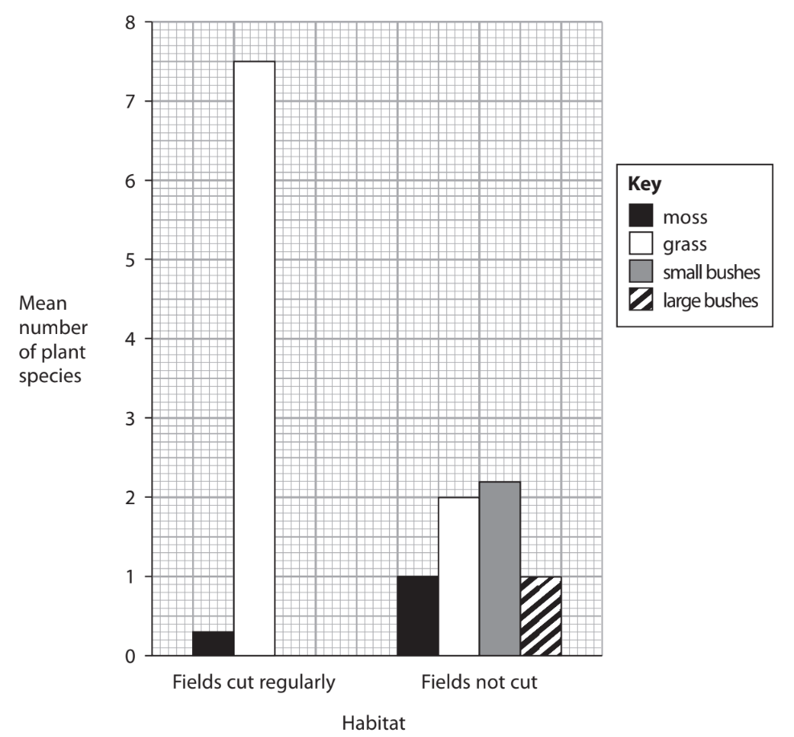

(i)

Which row of the table shows the type of factor that affected the plant species in two of these habitats?

**(1)**

|   | **Cutting the field regularly** | **Competition with trees for water** |
|---|---|---|
| ☐ **A** | abiotic factor | abiotic factor |
| ☐ **B** | abiotic factor | biotic factor |
| ☐ **C** | biotic factor | abiotic factor |
| ☐ **D** | biotic factor | biotic factor |

** **

(ii) What is the percentage increase in the number of species of moss between the fields cut regularly and the fields not cut?

**(1)**

☐   **A  ** 23.3

☐   **B  ** 70.0

☐   **C  ** 233.3

☐   **D**   333.3

(iii)  Suggest reasons for the differences in the mean number of plant species in fields cut regularly and in fields not cut.

**(2)**

### 1() — 4 marks — command: multiple — structured — from paper June 2021 · WBI14/01
In another investigation, the genome size of 30 species of moss was determined. Each species of moss belonged to one of two classes of moss.

The graphs show the frequency of each genome size in the class 1 mosses and some of the class 2 mosses.

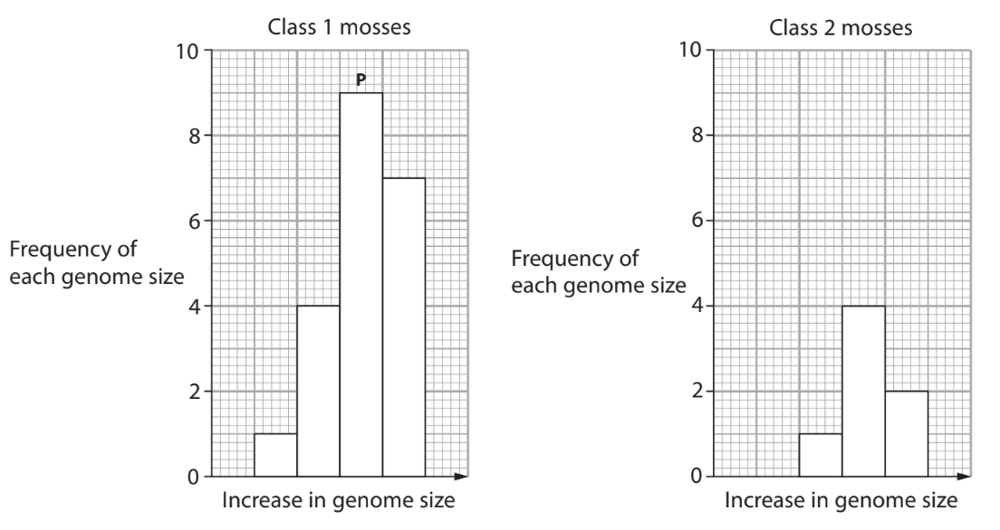

(i)  Which does **P **represent?

**(1)**

| ☐ | **A** | the maximum genome size on a bar chart |
|---|---|---|
| ☐ | **B** | the maximum genome size on a histogram |
| ☐ | **C** | mode genome size on a bar chart |
| ☐ | **D** | mode genome size on a histogram |

(ii)  One genome size is missing from the graph for class 2 mosses.

Calculate the frequency of this genome size.

**(1)**

(iii) The mean value for the genome size of class 1 mosses was 0.449 a.u. and the mean value for class 2 mosses was 0.920 a.u.

Calculate the ratio of the genome size of class 1 mosses to the genome size of class 2 mosses.

**(1)**

(iv)  It was suggested that the chromosomes in class 2 mosses were found in pairs.

Give the evidence that supports this suggestion.

**(1)**

## Q2 — medium — 9 marks · exam-questions

### 3() — 8 marks — command: give — structured — from paper June 2021 · WBI14/01
Lions, giraffes and acacia trees are found on the African Plains.

The diagram shows the energy in the trophic levels that these organisms occupy.

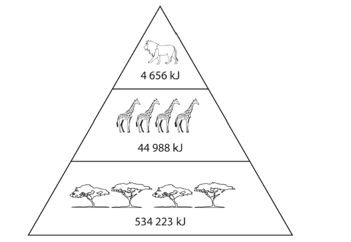

Give the meaning of each of the following terms, using the information in the diagram to illustrate your answer.

(i)  Habitat

**(2)**

(ii)  Population

**(2)**

(iii) Community

**(2)**

(iv) Niche

**(2)**

### 3((b)) — 1 mark — command: calculate — structured — from paper June 2021 · WBI14/01
Calculate the efficiency of energy transfer between trophic level one and trophic level two.

## Q3 — medium — 15 marks · exam-questions

### 7() — 8 marks — command: multiple — structured — from paper June 2021 · WBI14/01
Stages of succession can be seen on different parts of a sand dune system.

The greater the distance of the sand dune from the sea, the later the stage of succession.

The diagram shows a sand dune system and the table gives some information about the different types of sand dune in this system.

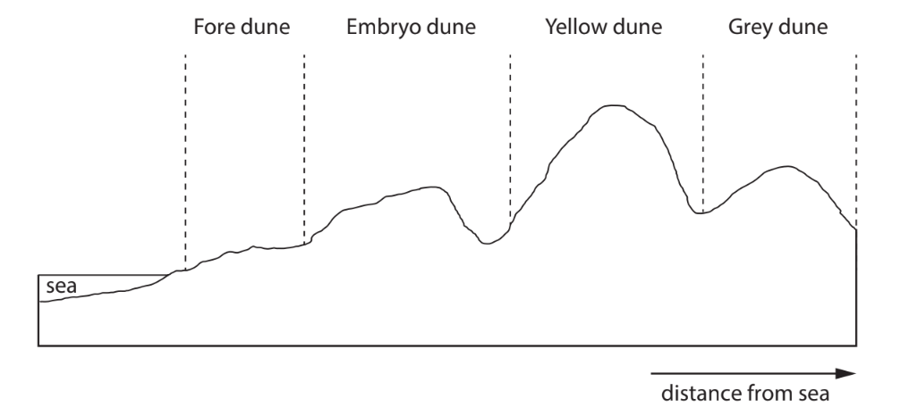

| **Information** | **Fore dune** | **Embryo dune** | **Yellow dune** | **Grey dune** |
|---|---|---|---|---|
| Soil depth / cm | <0.5 | 0.5 | 1.0 | 8.0 |
| Percentage of organic matter (%) | <1.0 | 1.0 | 2.5 | 5.0 |
| pH | 8.5 | 8.0 | 7.0 | 6.5 |
| Percentage of bare ground (%) | >97 | 97 | 70 | 10 |
| Number of different plant species | 2 | 3 | 6 | 15 |
| Typical plant species | sea rocket saltwort | sea couch grass lyme grass marram grass | marram grass red fescue grass sea holly | a range of different meadow plants |

(i) The pH of a solution is a measure of the concentration of hydrogen ions in that solution.

It is a log scale e.g. a solution of pH 5 contains 10-5 mol dm-3 of hydrogen ions.

What is the difference in concentration of hydrogen ions in a fore dune compared with a grey dune?

**(1)**

☐ **A**   a fore dune has 2 times more hydrogen ions than the grey dune

☐ **B**    a fore dune has 2 times fewer hydrogen ions than the grey dune

☐ **C**  a fore dune has 100 times more hydrogen ions than the grey dune

☐ **D** a fore dune has 100 times fewer hydrogen ions than the grey dune

(ii) Calculate the percentage increase in the number of plant species on the grey dune compared with the fore dune.

**(1)**

(iii) Explain the changes in these sand dunes with distance from the sea.

Use the information in the table to support your answer.

**(6)**

### 7() — 7 marks — command: multiple — structured — from paper June 2021 · WBI14/01
Sand dunes can be classified as fixed dunes, semi-fixed dunes and shifting dunes.

The graph shows the mean net primary productivity (NPP) above the ground and below the ground for these three types of sand dune.

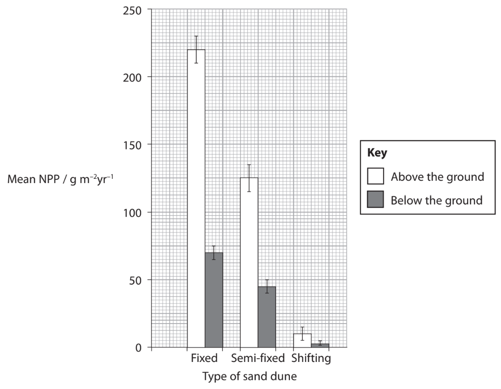

(i)  Describe the conclusions that can be drawn from this graph.

**(3)**

(ii)  Explain how the products of the light-independent reactions become NPP below the ground.

**(4)**

## Q4 — medium — 12 marks · exam-questions

### 6() — 4 marks — command: multiple — structured — from paper Oct/Nov 2021 · WBI12/01
The cassava root is an important food crop grown in the tropics.

The photograph shows organelles containing starch granules inside cassava root cells, as seen using an electron microscope.

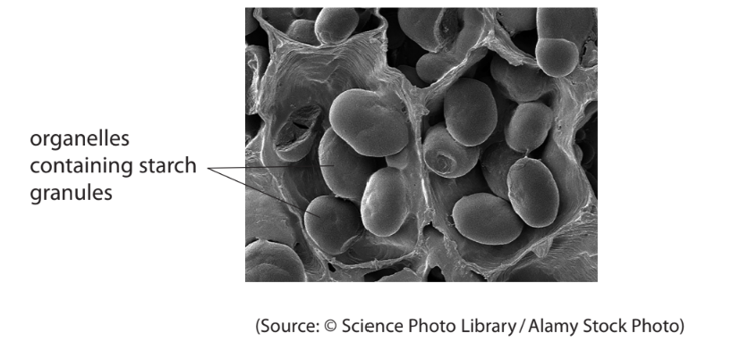

(i)  Name these organelles found in cassava root cells.

**(1)**

(ii)  Explain how the structure of starch relates to its function.

**(3)**

### 6() — 2 marks — command: multiple — structured — from paper Oct/Nov 2021 · WBI12/01
The graph shows the mass of five food crops grown in Africa. It also shows the world production of these crops.

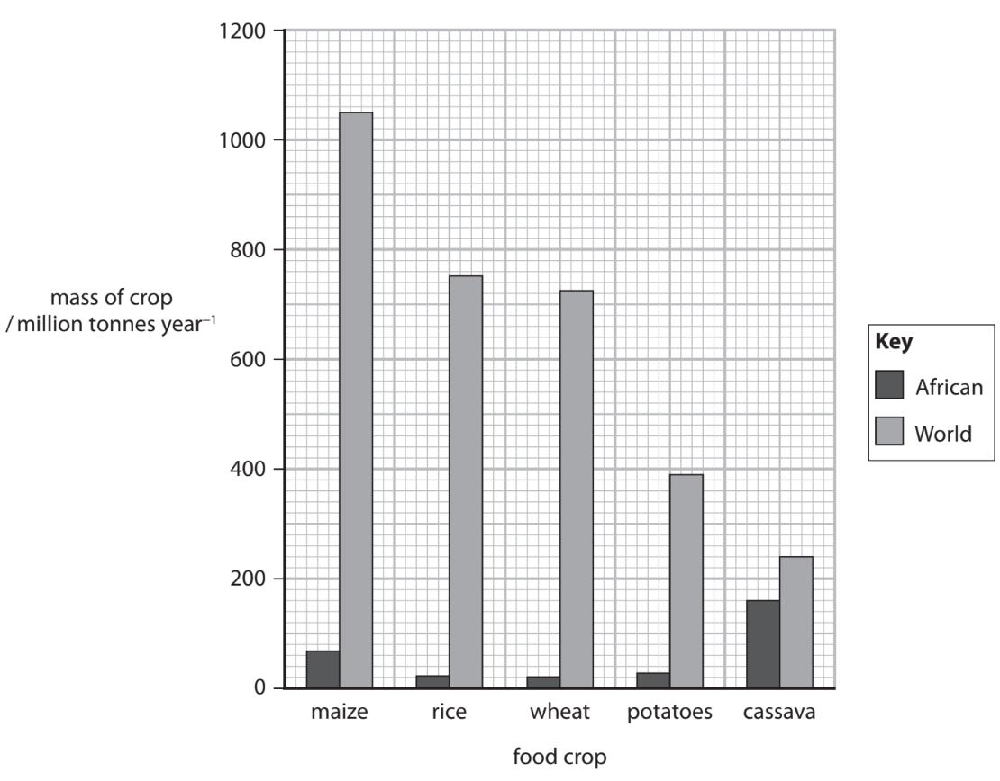

(i) Which is the percentage of the world cassava crop that is grown in Africa?

**(1)**

☐   **A**   33%

☐   **B**   34%

☐   **C**   66%

☐   **D**   67%

(ii) It is predicted that the world maize production will increase by 2.3% in the following year.

Calculate the world production of maize in the following year.

Give your answer to the nearest whole number.

**(1)**

Answer ............................ million tonnes

### 6((c)) — 6 marks — command: discuss — structured — from paper Oct/Nov 2021 · WBI12/01
Some plants contain chemicals that protect them from being eaten by animals.

These chemicals taste bitter and can be converted by enzymes into hydrogen cyanide.

Hydrogen cyanide inhibits respiration and can cause death.

Cassava can be grouped into two main varieties: bitter cassava and sweet cassava. 
These varieties differ in the concentration of the bitter-tasting chemicals.

Processing of the cassava removes most of these chemicals.

The graph shows the mean dry mass of these cassava varieties when grown in the same conditions.

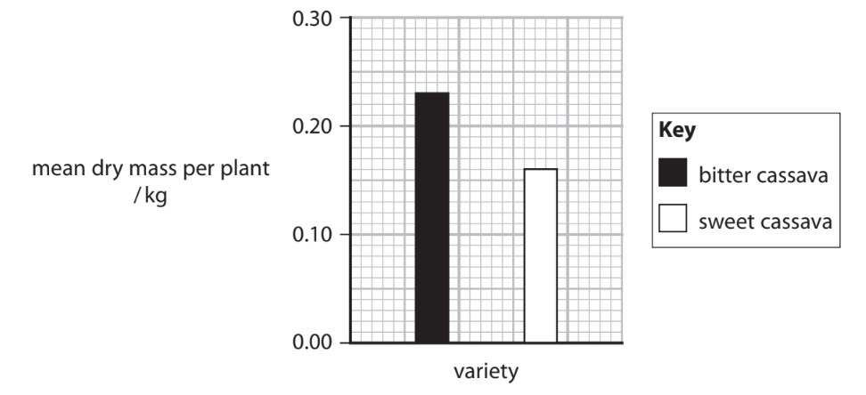

The table gives information about three crop plants.

| **Crop plant** | **Water** **requirements** | **Minimum** **level of** **nutrients** **required in** **soil** | **Typical mass** **of bitter** **tasting** **chemicals** **/mg kg****−1** | **Typical** **mass of** **carbohydrate** **/100g of dry** **plant matter** | **Typical mass** **of protein** **/100g of dry** **plant matter** |
|---|---|---|---|---|---|
| Bitter cassava | low to medium | low | 100 to 500 | 94.70 | 1.80 |
| Sweet cassava | low to medium | low | 10 to 50 | 94.62 | 1.84 |
| Maize | medium to high | medium to high | 1 to 2 | 77.46 | 8.75 |

Discuss the advantages and disadvantages of growing these three crop plants for human food.

Use the information in the question to support your answer.

## Q5 — medium — 14 marks · exam-questions

### 8((a)) — 1 mark — command: state — structured — from paper Oct/Nov 2021 · WBI14/01
Scientists studied the distribution of biomass in organisms on Earth.

State the meaning of the term **biomass.**

### 8() — 7 marks — command: multiple — structured — from paper Oct/Nov 2021 · WBI14/01
Voronoi diagrams were used to present some of the data.

Two Voronoi diagrams are shown.

Diagram A shows the biomasses of groups of organisms.

Diagram B shows the biomasses of the organisms in the animals group.

The biomass is given in gigatons of carbon (GtC), where 1 GtC = 1015 g of carbon.

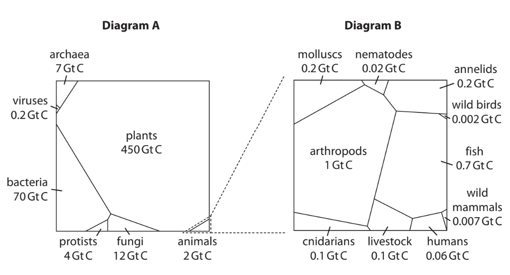

The area of each polygon is proportional to the biomass of that organism. The shape of each polygon has no meaning.

(i) Calculate the percentage of biomass in organisms belonging to the domain Eukarya.

Use the information in diagram A.

**(2)**

(ii)  Suggest why the scientists studied the distribution of biomass in groups of organisms and not the number of individual organisms.

Use the information in diagram A.

**(2)**

(iii)  Discuss the advantages and disadvantages of presenting data in Voronoi diagrams.

Use diagram B to support your answer.

**(3)**

### 8((c)) — 6 marks — command: explain — structured — from paper Oct/Nov 2021 · WBI14/01
The same study also determined the distribution of biomass in three different environments: marine, deep underground and land.

The Voronoi diagram shows the distribution of biomass in each environment.

The graph shows the proportion of biomass in different groups of organisms.

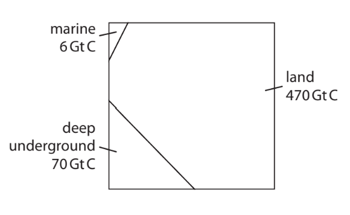

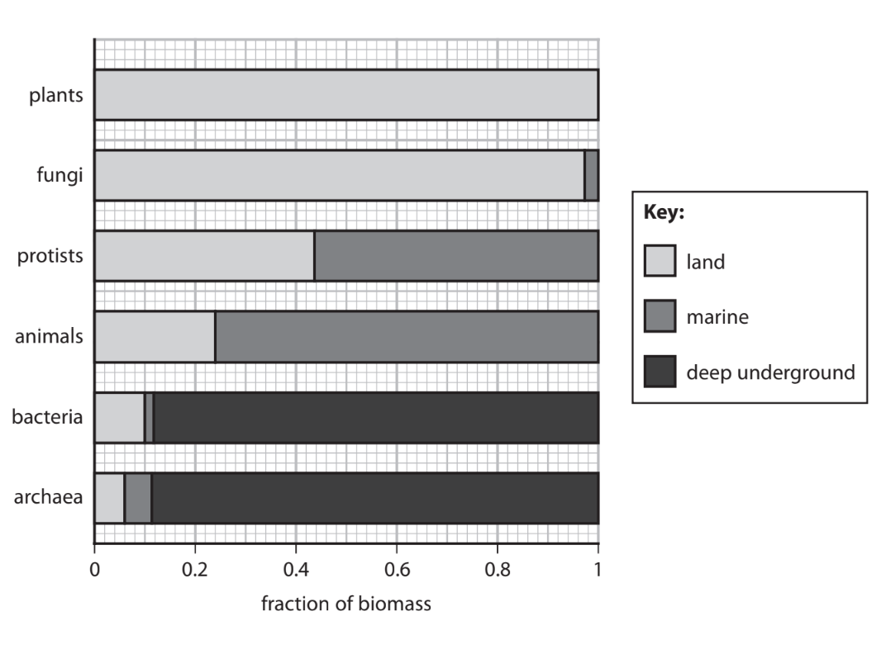

Explain the distribution of biomass in these three environments.

Use the information in the Voronoi diagram and the graph to support your answer.

## Q6 — medium — 7 marks · exam-questions

### 1((a)) — 1 mark — command: which — structured — from paper Jan 2022 · WBI14/01
The photograph shows a polar bear.

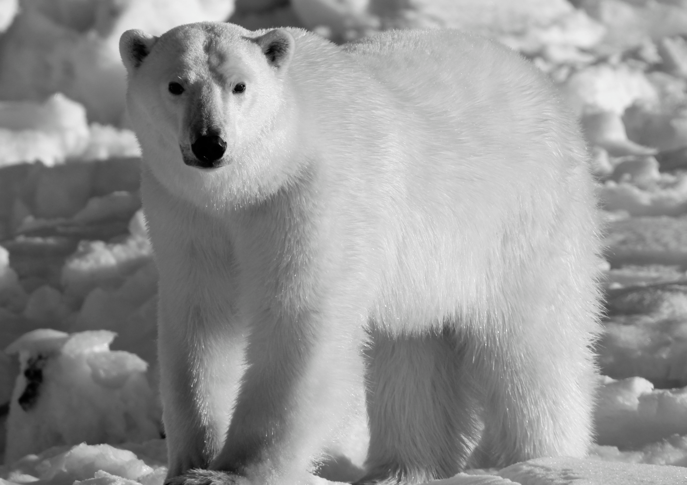

Emma, CC BY 2.0 <https://creativecommons.org/licenses/by/2.0>, via Wikimedia Commons

Polar bears are adapted to live in the Arctic Circle.

Polar bears have a layer of fat beneath their skin. This fat insulates them from the cold and can be used to supply the polar bear with water (metabolic water).

They have a thick fur coat which also insulates them from the cold.

Polar bears feed on seals. The polar bear sits on the ice and waits for a seal to come to the surface of the water to breathe.

Which row of the table describes the types of adaptation of polar bears?

|   | **Anatomical** | **Behavioural** | **Physiological** |
|---|---|---|---|
| ☐   **A** | produces metabolic water | hunting by sitting on ice | thick fur coat |
| ☐   **B** | hunting by sitting on ice | thick fur coat | produces metabolic water |
| ☐   **C** | thick fur coat | produces metabolic water | hunting by sitting on ice |
| ☐   **D** | thick fur coat | hunting by sitting on ice | produces metabolic water |

### 1((b)) — 1 mark — command: what — structured — from paper Jan 2022 · WBI14/01
What is the niche of a polar bear?

| ☐ | **A** | produces metabolic water |
|---|---|---|
| ☐ | **B** | the Arctic Circle |
| ☐ | **C** | controls the population size of seals |
| ☐ | **D** | uses the layer of fat beneath the skin |

### 1((c)) — 2 marks — command: suggest — structured — from paper Jan 2022 · WBI14/01
Suggest why the polar bear needs to rely on the store of fat to provide it with water.

### 1((d)) — 3 marks — command: explain — structured — from paper Jan 2022 · WBI14/01
Climate change is resulting in habitat fragmentation. Habitat fragmentation causes groups of polar bears to become separated from one another.

Explain the effect that habitat fragmentation could have on the genetic diversity of polar bears.

## Q7 — hard — 14 marks · exam-questions

### 1() — 8 marks — command: plan — structured
A student wanted to investigate the effect of light intensity on the abundance of ribwort plantain (*Plantago lanceolata*) on two separate areas of a school field.

Plan an investigation that the student could carry out to compare the abundance of ribwort plantain in the two areas with different light intensity.

### 2() — 4 marks — command: calculate — structured
In another investigation a student collected data from 10 quadrats along a transect which extended at 90 degrees from the edge of a woodland.

To test whether there was a significant association between distance from the woodland and percentage cover of the plant dog's mercury (*Mercurialis perennis*), the student decided to calculate the Spearman's rank correlation coefficient (rs).

The table below shows the ranked data for each quadrat.

| Quadrat | Distance from woodland rank | Percentage cover rank | d | d² |
|---|---|---|---|---|
| 1 | 1 | 10 |   |   |
| 2 | 2 | 8 |   |   |
| 3 | 3 | 9 |   |   |
| 4 | 4 | 7 |   |   |
| 5 | 5 | 6 |   |   |
| 6 | 6 | 4 |   |   |
| 7 | 7 | 5 |   |   |
| 8 | 8 | 2 |   |   |
| 9 | 9 | 3 |   |   |
| 10 | 10 | 1 |   |   |

Complete the table and use the formula below to calculate rs. Give your answer to 3 decimal places.

$r_{s} = 1 - \frac{6Σd^{2}}{n(n^{2}-1)}$

### 3() — 2 marks — command: state — structured
The critical value of rs at p = 0.05 for n = 10 is 0.648.

State the conclusion that can be drawn from the investigation described in (b). Use your calculated rs value and the table of critical values to support your answer

## Q8 — easy — 9 marks · exam-questions

### 1() — 2 marks — command: contrast — structured
Compare and contrast the terms **community** and **ecosystem**.

### 2() — 1 mark — command: state — structured
Surtsey, a volcanic island off the southern coast of Iceland, was formed by underwater volcanic eruptions that began in 1963. When the eruptions ceased, the island consisted entirely of bare rock with no living organisms. Scientists have monitored the colonisation of the island by living organisms ever since.

State the term that describes this process of colonisation and the resulting development of a community.

### 3() — 6 marks — command: explain — structured
The table shows data collected at Surtsey at five intervals after the eruption.

| Years since eruption | Soil nitrogen (mg kg⁻¹) | Species richness | Total % cover of vegetation | Dominant vegetation |
|---|---|---|---|---|
| 5 | 0.6 | 2 | 4 | mosses |
| 15 | 1.8 | 7 | 19 | grasses, mosses |
| 30 | 4.3 | 15 | 48 | sea sandwort, lyme grass |
| 55 | 9.7 | 22 | 71 | sea purslane, shrubs |
| 60 | 12.1 | 28 | 83 | crowberry, angelica |

*Using the data and your own knowledge, explain the changes in species richness and vegetation cover observed over this period.
