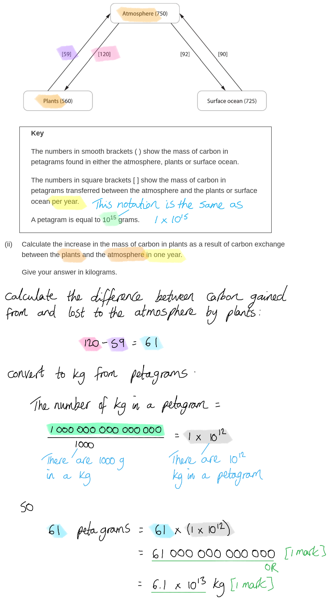
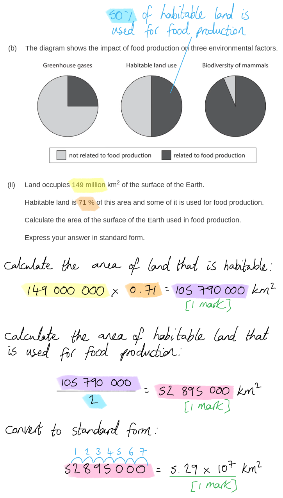
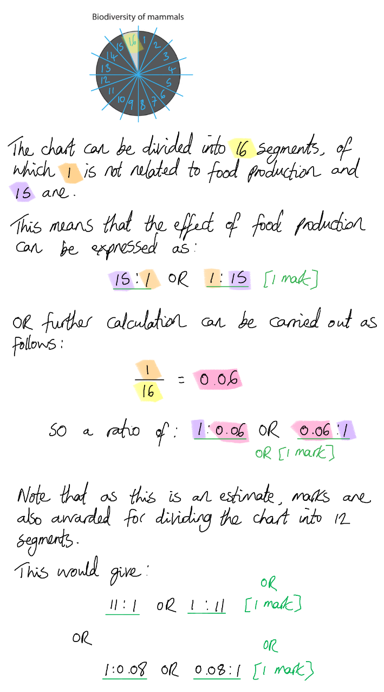
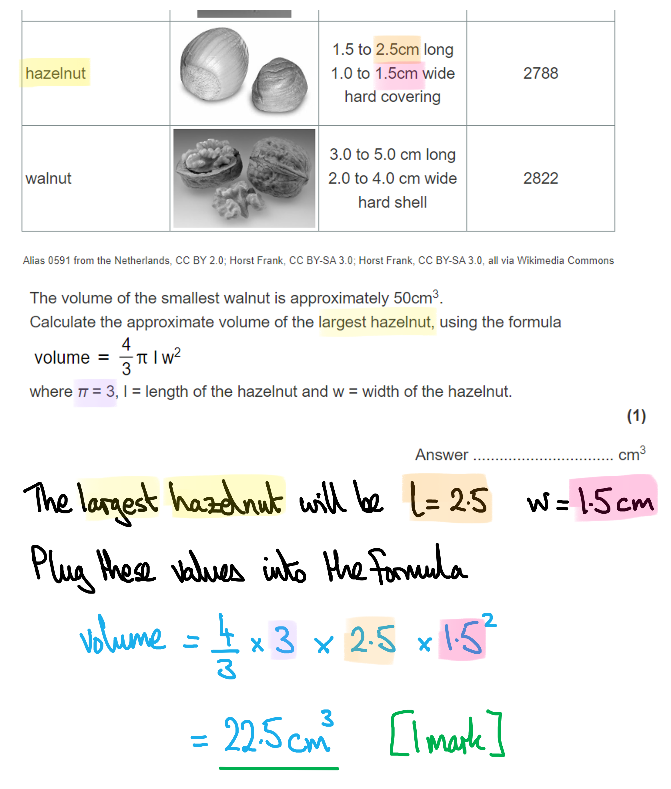
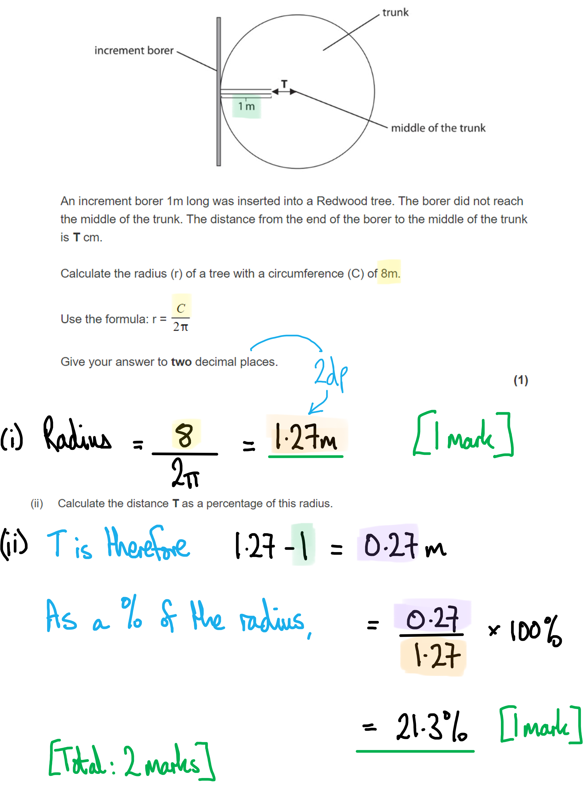

# Mark Schemes — Environmental Biology
**5. Energy Flow, Ecosystems & the Environment** · Edexcel International A Level (IAL) Biology (YBI11)

## Q1 — medium — 11 marks · exam-questions

### 4((a)) — 3 marks
(a) (i) The correct answer is **B **because...

**Methane and water vapour are both greenhouse gases. **

> *A**, **B **and** C **are incorrect because oxygen is not a greenhouse gas (but CO**2** is). *

(a) (ii) Anthropogenic climate change is...

- (Anthropogenic) caused by the actions/effects of humans; **[1 mark]**
- (Climate change) changes to (mean) temperature / rain fall; **[1 mark]**

***Accept**** long-term (mean) change in weather patterns* ***Ignore ****weather unqualified / global warming / results of global warming / climate*

**[Total: 3 marks]**

### 4((b)) — 3 marks
(b) The changes in the distribution of this species in this country can be explained by...

- Species distributed more towards the North / move away from the equator; **[1 mark]**
- This distribution related to a described change in climate e.g. because the temperatures have become too hot, move to a cooler area, areas have become drier, areas have become wetter, drought; **[1 mark]**
- The effect of this change explained e.g. so the enzymes do not work effectively enough (to sustain that species), their prey have migrated (North), they would become dehydrated, plants they feed on die, lack of food; **[1 mark]**

**[Total: 3 marks]**

> *Remember that for three marks you need to include specific detail in your answer and explain rather than just describing the distribution. *

### 4((c)) — 5 marks
(c) (i) Two conclusions that can be drawn from this study are...

- Temperature (that a beetle was kept at) affects males more than females; **[1 mark]**
- The optimum temperature (for keeping both beetles) is 35°C; **[1 mark]**

(c) (ii) The differences in the results obtained for the male and female beetles kept at different temperatures can be explained by...

**Final answer:** **Any ****three ****of the following:**

- There are fewer (successful) fertilisations by males / (successful) fertilisations are not as affected in females; **[1 mark]**
- The sperm are damaged by higher temperatures / egg cells are not so affected by higher temperature; **[1 mark]**
- Higher temperatures decrease sperm viability/motility / higher temperatures make the egg cell easier to penetrate; **[1 mark]**
- (Higher) temperatures could affect the acrosome reaction / sperm enzymes / male enzymes / (higher) temperatures do not (really) affect egg cell/female enzymes **OR **enzymes of females have a higher optimum temperature than the enzymes of sperm/males; **[1 mark]**

**[Total: 5 marks]**

> *Make sure to consider the key for the graph carefully to ensure you're not misinterpreting the information. *

## Q2 — medium — 10 marks · exam-questions

### 6((a)) — 4 marks
(a) (i) Flies evolve resistance to new chemicals by...

- Mutation (in the DNA) causing allele for resistance to the new chemical; **[1 mark]**
- (New) chemical acts as a selection pressure; **[1 mark]**
- Resistant flies survive and pass this (new) gene/allele onto their offspring; **[1 mark]**

(a) (ii) Evolution of resistance occurs so quickly in flies because...

- Flies have a short life cycle / high mutation rate in flies / flies produce many offspring / chemical is a strong selection pressure; **[1 mark]**

**[Total: 4 marks]**

> *It is a common misconception that selection pressures causes mutations to occur that produce a selective advantage in that environment. This is not true and it is important to remember that mutations occur randomly. *

### 6((b)) — 6 marks
(b) Painting stripes on cattle has the following effect on reducing the number of biting flies on them...

> *This is a level-marked question, meaning that this is is marked **according to the levels table**. The indicative content points below the table are **not** to be used in the usual '**one point one mark**' way, but should be used together with the levels table to determine the number of marks which should be awarded. *

| **Level 1 ** | **[1 mark]** - Description data from one source |
|---|---|
| **[2 marks] - Description data from two sources** |   |
| **Level 2 ** | **[3 marks]** - Comparison made between black stripes only and black and white stripes, from one source of data |
| **[4 marks] - Two comparisons made between black stripes only and black and white stripes, from two sources of data** |   |
| **Level 3** | **[5 marks]** - Two comparisons made between black stripes only and black and white stripes, from two sources of data **AND** level 2 maths calculation **OR** a comparison of the error bars between black stripes only and black and white stripes |
| **[6 marks] **- Two comparisons made between black stripes only and black and white stripes, from two sources of data **AND** level 2 maths calculation **AND** a comparison of the error bars between black stripes only and black and white stripes |   |

*Indicative content:*

(D) = description

(C) = comparison

*Graph:*

- Black stripes reduce the number of biting flies on body and legs (D)
- 128 down to 111 / by 17 / by 13% (D)
- This may not be significant as the error bars overlap (D)
- Black and white stripes reduce number of biting flies on the body and legs (D)
- 128 down to 57/58 / by 70/71 / by 55% (D)
- Probably significant as the error bars do not overlap (D)
- Black and white stripes reduce the number of biting flies on body and legs more than just black stripes (C)
- 111 down to 57/58 / by 53/54 / by 48/49% (C)
- Probably significant as the error bars do not overlap between the two groups of painted cattle (C)
- Error bar for black stripes is 17% and 17% for black and white stripes (C)

*Table 1:*

- Black stripes reduce the number of biting flies on the legs but not on the body (D)
- 1309 down to 1030 / by 279 / by 21% (D)
- Black and white stripes reduce the number of biting flies on the body and legs (D)
- (Body) 662 down to 231 / by 431 / by 65% (D)
- (Legs) 1309 down to 710 / by 599 / by 46% (D)
- Black and white stripes reduce the number of biting flies on the body and legs more than just black stripes (C)
- (Body) 677 down to 231 / by 446 / by 66% (C)
- (Legs) 1030 down to 710 / by 320 / by 31% (C)

*Table 2:*

- Black stripes have no effect on tail flicking / feet stamping / twitching (D)
- Black and white stripes have very little effect on tail flicking / feet stamping (D)
- Black and white stripes have a small increase on skin twitching (D)
- 5 up to 8 / by 3 / by 60% (D)

**[Total: 6 marks]**

> *The command word ‘determine’ requires a level two calculation to be used in the answer for full marks to be awarded. This is really important to remember for any future questions with the same command word. *

## Q3 — medium — 8 marks · exam-questions

### 4((a)) — 4 marks
(a) The types of speciation that have taken place in the evolution of Sifakas and Indri in this region of Madagascar are...

- Allopatric speciation; **[1 mark]**
- (Allopatric speciation has occurred) because lemurs share a common ancestor that was (geographically) isolated from mainland Africa; **[1 mark]**
- Sympatric speciation; **[1 mark]**
- (Sympatric speciation has occurred) because Sifakas and Indri live in the same place but have a different diet; **[1 mark]**

**[Total: 4 marks]**

> *The original geographical isolation of the ancestors of lemurs from mainland Africa led to the process of allopatric speciation and gave rise to the first lemur species. Lemur populations living together on the island of Madagascar then underwent sympatric speciation due to their different diets (which could have prevented gene flow by, e.g. changing the time of year at which they breed).*

### 4() — 4 marks
(b) (i) The role of the polymerase chain reaction (PCR) in DNA profiling is…

**Final answer:** **Any ****two**** of the following:**

- Collecting DNA samples can be difficult / DNA samples collected are often small; **[1 mark]**
- (PCR therefore) amplifies / increases the number of copies of DNA; **[1 mark]**
- (PCR ensures that) there is enough DNA to carry out gel electrophoresis; **[1 mark]**

(b) (ii) DNA profiling could show that these lemurs originated from the lemurs on Madagascar because...

**Final answer:** **Any ****two**** of the following:**

- DNA from both lemur groups is used in gel electrophoresis; **[1 mark]**
- Similar patterns of bands would show that lemurs are genetically similar; **[1 mark]**
- Base sequencing could be used to show that sequences are similar; **[1 mark]**

**[Total: 4 marks]**

> *You may have come across these techniques in the context of forensic science, but the process of comparing DNA sequences has many applications. Here, for example, amplification of sample DNA and comparison of DNA sequences can be used to determine the relationship between two groups of lemurs; a more similar set of DNA sequences will indicate that the lemurs are closely related.*

## Q4 — medium — 13 marks · exam-questions

### 6((a)) — 4 marks
(a) These carbohydrates are produced in the following locations...

| **Carbohydrate** | **Carbohydrate produced by** |   |   |   |
|---|---|---|---|---|
| both plants and animals | plants but **not** animals | animals but **not** plants | neither plants nor animals |   |
| Amylose | ☐ | ☒; **[1 mark]** | ☐ | ☐ |
| Glucose | ☒; **[1 mark]** | ☐ | ☐ | ☐ |
| Glycogen | ☐ | ☐ | ☒; **[1 mark]** | ☐ |
| Starch | ☐ | ☒; **[1 mark]** | ☐ | ☐ |

**[Total: 4 marks]**

> *Remember that amylose is a form of starch, so is therefore produced in plant cells from glucose.*

> *Glucose is produced in both plant and animal cells when storage carbohydrates such as starch and glycogen are broken down.*

### 6() — 5 marks
(b) (i) Carbon is exchanged between the atmosphere and the oceans as follows…

- Diffusion of carbon dioxide (from air to water / water to air) **OR** dissolving of carbon dioxide (in water); **[1 mark]**

***Accept ****CO**2** for carbon dioxide.*

***Reject**** CO/Co/C.*

(b) (ii) The increase in the mass of carbon in plants as a result of carbon exchange between the plants and the atmosphere in one year is...

- 6.1 x 1013 / 61 000 000 000 000 / 61 trillion / 61 million million; **[1 mark]**

(b) (iii) The carbon present in sugars in the plants is returned to the atmosphere in the carbon cycle as follows...

- Carbon dioxide (is released into the atmosphere) from respiration; **[1 mark]**

**AND**

**Final answer:** **Any ****two**** of the following:**

- By plants; **[1 mark]**
- By microorganisms that decompose (dead) plants; **[1 mark]**
- By animals that eat the plants / herbivores; **[1 mark]**

***Reject ****CO/Co/C for carbon dioxide.*

**[Total: 5 marks]**

### 6() — 4 marks
(c) (i) The term** **anthropogenic climate change refers to…

- (Anthropogenic =) caused by humans; **[1 mark]**
- (Climate change =) changes to (mean) temperature/rainfall / long term change in weather patterns; **[1 mark]**

***Ignore**** examples of human activities*

***Ignore**** references to weather that is not relating to long term patterns and to the terms global warming / climate change without further explanation*

(c) (ii) The effects of anthropogenic climate change can be reduced as follows...

**Final answer:** **Any ****pair of points**** from the following:**

- Named example of a method to reduce the burning of fossil fuels, e.g. lift sharing / public transport / solar power **OR** decreasing deforestation; **[1 mark]**
- This will reduce the release of carbon dioxide into the atmosphere; **[1 mark]**

**OR**

- Reforestation / afforestation; **[1 mark]**
- More plants will be present to absorb more carbon dioxide for photosynthesis; **[1 mark]**

**OR**

- Reduce the number of cattle being farmed **OR** reduce the amount of rice farming; **[1 mark]**
- This will reduce the release of methane into the atmosphere; **[1 mark]**

**[Total: 4 marks]**

> *(i) Be careful to **avoid vague definitions** of climate change here; it is not enough to simply refer to 'changes in the weather' (which happen every day!), to 'changes in the climate' (this is just repeating the term used in the question), or to 'global warming' (which only incorporates one aspect of climate change without explaining what it means).*

> *(ii) Here you must be sure to **explain** one way of reducing anthropogenic climate change. You need to state **what should be done** and then explain **how this would help**.*

## Q5 — medium — 15 marks · exam-questions

### 7((a)) — 2 marks
(a) (i) The term population, as it has been used in this context, refers to…

- The number of humans/*Homo sapiens* in the world/on Earth; **[1 mark]**

(a) (ii) The term sustainable, as it has been used in this context, refers to...

- Producing (enough) <u>food</u> without damaging the environment / without running out of resources **OR** minimising carbon footprint so <u>food</u> can be made in the future; **[1 mark]**

**[Total: 2 marks]**

> *The question states that you must relate your definitions to the **context of the question**.*

> *This means that while the general definition of a population may be "the number of individuals of one species living in a habitat", the specific definition in this context of the question is "the number of **humans **living in **the world**"*

> *Similarly while the term sustainable refers to "using the planet's resources in a way that can be maintained for the future", in the specific context of the question this means "producing **food** in a way that doesn't use up resources"*

### 7((b)) — 7 marks
(b) (i) Food production could contribute to the greenhouse effect as follows…

**Final answer:** **Any ****three**** of the following:**

- Clearing land / burning forests / use of (construction) vehicles / decay of dead remains by bacteria releases carbon dioxide into the atmosphere; **[1 mark]**
- Farming / use of (farm) vehicles / transport of food products releases carbon dioxide into the atmosphere; **[1 mark]**
- Fewer trees means that less carbon dioxide is removed from the atmosphere; **[1 mark]**
- Paddy fields / cattle / decay of dead remains by bacteria releases methane into the atmosphere; **[1 mark]**
- Greenhouse gases/carbon dioxide/methane trap heat energy inside the earth's atmosphere; **[1 mark]**

***Ignore**** references to respiration.*

> *Note that this question is specifically about how food production contributes to the greenhouse effect, so events that are not specifically related to food production, such as respiration, will not be credited. For similar reasons you should avoid lengthy descriptions of the greenhouse effect that do not link this back to food production.*

(b) (ii) The area of the surface of the Earth used in food production is...

- (71 % of 149 million =) 105 790 000; **[1 mark]**
- (105 790 000 ÷ 2 =) 52 895 000; **[1 mark]**
- (In standard form this is) 5.29 x 107 / 5.3 x 107 (km2); **[1 mark]**

*Full marks can be awarded for the correct answer in the absence of other calculations.*

(b) (iii) The effect of food production on the ratio of biodiversity of mammals is likely to be...

- (Values in the range of) 1 : 0.06 - 1 : 0.1 **OR** 1 : 11 - 1:15; **[1 mark]**

***Accep****t ratios expressed either way around, i.e. 1 : 0.06 or 0.06 : 1*

**[Total: 7 marks]**

### 7((c)) — 6 marks
> *This is a **level-marked question**, meaning that it is marked **according to the levels table**. The indicative content points below the table are **not** to be used in the usual '**one point = one mark**' way, but should be used together with the levels table to determine the number of marks which should be awarded.*

> *For this question:*

- *D = **d**escription of method for making food production more sustainable*

| **Level 1** | **[1 mark]** | One method has been described |
|---|---|---|
| **Level 1** | **[2 marks]** | One method has been described **AND** a simple explanation given |
| **Level 2** | **[3 marks]** | One method has been described **AND** an extended explanation given  **OR**  Two methods have been described **AND** a simple explanation has been given for each |
| **Level 2** | **[4 marks]** | Two methods have been described **AND** an extended explanation has been given for each  **OR**  Three methods have been described **AND** a simple explanation has been given for each |
| **Level 3** | **[5 marks]** | Three methods have been described **AND** an extended explanation has been given for each |
| **Level 3** | **[6 marks]** | Three methods have been described **AND** an extended explanation has been given for each **AND **energy losses from food chains have been explained |

(c) Food production could be made more sustainable as follows...

- (D) Plant material can be recycled
- This would add nutrients to the soil
- This would allow a reduction in use of artificial fertiliser
- Artificial fertiliser causes harm to the environment / requires fossil fuel to produce / causes run-off into waterways / releases greenhouse gases into the atmosphere
- (D) Genetic engineering could be used to produce more insect/pest / drought resistant crops
- This would improve crop yield
- More food could be produced from the same area of land
- Habitat destruction would be reduced
- (D) Reduce air miles to transport food **OR** use biofuels to fuel machinery used in farming **OR** use waste crop material to make biofuels
- This would reduce carbon dioxide released into the atmosphere
- (D) Raise fewer animals and grow more crops
- Animals release carbon dioxide into the air (when they respire)
- Plants absorb more carbon dioxide than they release (due to photosynthesis)
- Carbon dioxide contributes to the greenhouse effect
- (D) Use solar / wind energy for farming
- These are sustainable energy resources
- These do not release carbon dioxide
- (D) Encourage people to eat more plant-based food / named example of plant based food from diagram
- More food can be produced from the same area of land
- Fewer trophic levels mean that less energy is lost from the food chain
- (D) Reduce the quanitity of plastic packaging in food
- Plastic is not biodegradable
- Plastic can harm animals
- Plastic is made using fossil fuels

> *In this question you need to use the data provided to help you come up with a series of **suggestions for improving food production**. Aim for a **good breadth** of answers and be sure to **explain each suggestion** fully.*

> *Avoid just describing the data, as this is not what the question has asked for.*

## Q6 — medium — 10 marks · exam-questions

### 6((a)) — 1 marks
(a) The approximate volume of the largest hazelnut is...

- 22.5 (cm3); **[1 mark]**

***Accept**** 23.3 / 23.6*

**[Total: 1 mark]**

### 6() — 6 marks
(b) (i) A laboratory investigation to find out which of these three types of nut ground squirrels prefer to eat would be designed as follows...

- Give a squirrel access to all three types of nut; **[1 mark]**
- Use a range of sizes of nut; **[1 mark]**
- Determine the number / order in which the nuts are eaten (by the squirrel) / record which size nut the squirrels prefer; **[1 mark]**

> *Make sure to avoid the trap of saying that nut size needs to be controlled for this investigation. The size of the nut is the **independent variable** being investigated and so different nut sizes will be selected on purpose by the investigator.*

(b) (ii) The results of this investigation could be predicted as follows...

- A reason based on nut size, e.g. more hazelnuts are eaten because they are smaller / walnuts are too big to fit in the (food) pouch; **[1 mark]**
- A reason related to the presence of a shell, e.g. hazelnuts are easier to eat than walnuts because they have a hard covering and not a hard shell / walnuts have a hard shell but squirrels have sharp teeth; **[1 mark]**
- A reason based on energy content, e.g. walnuts provide a lot of energy so squirrels get enough energy for hibernation / more acorns have to be eaten as they store less energy; **[1 mark]**

> *To score the marks you should **explain** your answer as in the examples quoted above. Because there are 3 marks available for this question you should look to score a mark in a discussion of** each of the three parameters**; size, shell, and energy content. *

**[Total: 6 marks]**

### 6((c)) — 3 marks
(c) Ground squirrels evolved pouches as follows...

**Final answer:** **Any ****three**** of the following:**

- There was variation in presence of pouches / in pouch size **OR **there was a mutation that meant that some squirrels had pouches; **[1 mark]**
- Squirrels with larger pouches could gather/store more food **OR** squirrels with pouches could store food (compared to those without pouches); **[1 mark]**
- Squirrels with (largest) pouches survived and reproduced / passed the (large) food pouch <u>alleles</u> onto their offspring; **[1 mark]**
- There was an increase in <u>frequency</u> of the (large) food pouch allele **[1 mark]**

**[Total: 3 marks]**

> *There are some classic errors to avoid when answering questions about evolution:*

- *Avoid referring to genes instead of **alleles*
- *You must state that **mutations** occur in DNA*
- *You must never state that selection pressures cause mutation; **mutations occur randomly**!*

## Q7 — medium — 8 marks · exam-questions

### 4() — 2 marks
(a) (i) The radius of the tree is...

- 1.27 (m); **[1 mark]**

*Reject answers given to more than 2 decimal places (including recurring numbers).*

(a) (ii) The distance **T** as a percentage of the radius is...

- 21 / 21.3 / 21.26 (%); **[1 mark]**

***Allow**** error carried forward from part (a) (i), meaning that you can allow a percentage calculated correctly but using an incorrect answer from part (i).*

**[Total: 2 marks]**

### 4() — 6 marks
(b) (i) The row of the table that shows the newest and oldest rings in this tree is **B** (P & S) because...

**P is the newest ring and S is the oldest ring. The rings are added to the outer part of the trunk as the tree grows, so the most central rings are the oldest parts of the tree and the outermost rings are the newest.**

(b) (ii) These core samples can be used to calculate the age of this tree as follows...

**Final answer:** **Any**** three**** of the following:**

- Each year a new ring will be formed / the number of rings gives the age of the tree / this tree is (in the range of) 68 - 76 years old; **[1 mark]**
- The width/thickness of the rings will be different for each year / will depend on the (environmental) conditions, e.g. temperature, rainfall; **[1 mark]**
- The rings in each sample can be matched / lined up; **[1 mark]**
- A ring will only be counted once if it overlaps (with another ring); **[1 mark]**

***Accept ****quoted figures for marking point 1, e.g. "69 rings means that the tree is 69 years old".*

(b) (iii) The growth rate of this tree can be calculated as follows...

- Measure the height/length (of the whole tree); **[1 mark]**
- Divide the height by the (total) number of rings/age; **[1 mark]**

***Accept**** "measure the radius / diameter at the base of the tree" for marking point 1.*

***Accept ****" divide radius / diameter at the base of the tree by the number of rings/age" for marking point 2 if the alternative answer above for marking point 1 has been given.*

> *If you write about measuring the diameter of the tree, make sure you are specific enough; you will not gain a mark if you do not state that the tree has to be measured **at its base**.*

**[Total: 6 marks]**

## Q8 — hard — 10 marks · exam-questions

### 1() — 2 marks
> **[mark-scheme]**
> Any **two** from:
> 
> - Low temperatures mean molecules move more slowly / reduce the kinetic energy of molecules
> - There are fewer collisions between enzymes and substrates **SO** less frequent formation of enzyme-substrate complexes
> - Decomposer organisms / bacteria / fungi respire more slowly **SO** they break down / decompose material more slowly
> 
> **[2 marks]**

> **[exam-tip]**
> "Suggest" questions require you to apply your biological knowledge to work out what is happening in an unfamiliar scenario. The permafrost context may be new to you, but the underlying biology — temperature effects on enzyme activity — should be familiar from your studies of enzyme kinetics. You need to recognise that this is a question about decomposition and work out how temperature affects this process.
> 
> When explaining how temperature affects enzyme activity, use precise A-level terminology. Avoid basic statements such as "enzymes work more slowly in cold conditions" — this is GCSE-level understanding. Instead, demonstrate your knowledge of enzyme kinetics by referring to molecular movement, collisions between enzymes and substrates, and the formation of enzyme-substrate complexes.
> 
> Remember that enzymes do not denature at low temperatures — they simply have reduced activity due to fewer molecular collisions.

### 2() — 2 marks
> **[mark-scheme]**
> - Flooding/waterlogging creates anaerobic conditions / reduces oxygen availability **[1 mark]**
> - Less CO2 is released during decomposition / decomposer organisms release less CO2 **[1 mark]**

> **[exam-tip]**
> This question requires you to work through several steps of analysis. First, examine the data carefully to identify the pattern — Site A (control) shows steadily increasing CO₂ emissions throughout the study period, while Sites B and C both show decreasing emissions after 2015 when re-wetting began. Notice that Site C, which had the most intensive flooding, shows the greatest reduction.
> 
> Next, think about what flooding does to the soil environment. When soil is waterlogged, oxygen becomes unavailable, creating anaerobic conditions.
> 
> Then consider where the CO₂ is coming from and how the anaerobic conditions affect this process. The CO₂ flux represents carbon dioxide being released when decomposer organisms respire using the organic matter they have broken down. Since these organisms need oxygen for efficient respiration, anaerobic conditions reduce their activity, reducing CO₂ emissions.
> 
> Don't be misled into giving temperature-related answers — that concept was tested in the previous part. This question is specifically about the effect of oxygen availability on decomposition processes.

### 3() — 2 marks
To calculate the total reduction in annual CO₂ emissions:

- Calculate the reduction in CO₂ flux for each site

site B: 145 - 108 = 37 g m⁻² yr⁻¹

site C: 150 - 72 = 78 g m⁻² yr⁻¹

- Calculate the area of each site in square metres

  - 1 hectare = 10 000 m²

50 hectares = 50 × 10 000

= 500 000 m² per site

- Calculate the total reduction for each site

site B: 37 × 500 000 = 18 500 000 g yr⁻¹

site C: 78 × 500 000 = 39 000 000 g yr⁻¹

- Calculate the combined reduction and

= 18 500 000 + 39 000 000

= 57 500 000 g yr⁻¹ **[1 mark]**

- Convert to tonnes

  - 1 tonne = 1 000 000 g

57 500 000 ÷ 1 000 000 = **57.5** tonnes per year **[1 mark]**

> **[mark-scheme]**
> Award full marks for correct answer with no working shown

### 4() — 3 marks
> **[mark-scheme]**
> Arguments supporting effectiveness (maximum of two marks):
> 
> - CO₂ emissions decreased at both re-wetted sites / sites B and C while continuing to increase at the control site / site A
> - Greater reduction in CO₂ emissions with more intensive re-wetting / site C showed a larger decrease in emissions than site B
> - All sites had similar trends before 2015, so differences after intervention were due to re-wetting
> - Large sample sites (50 hectares) make results more representative
> 
> Arguments against effectiveness (maximum of two marks):
> 
> - Only three sites in one geographical area, so results may not be representative of other locations / climates
> - Only 5 years since intervention, so long-term effectiveness is unknown / effects might not be permanent
> - No statistical analysis shown, so cannot determine whether differences between sites are significant / differences between sites could be due to chance
> - Study not replicated by other researchers, so results cannot be verified / could be a one-off finding
> 
> **[3 marks]**
> 
> A maximum of two marks can be awarded for arguments from one side only.

> **[exam-tip]**
> Evaluation questions require you to present arguments from both sides — in this case, both supporting and opposing the effectiveness of re-wetting. You cannot achieve full marks by only arguing one side, no matter how many valid points you make.
> 
> Base your evaluation on the information provided in the question. You can critique what you can see in the data and methodology described, such as the absence of statistical analysis or the limited geographical scope, but avoid speculating about methodological details you have not been told about. For example, you should not assume that variables were or were not controlled unless this is explicitly stated in the method.

### 5() — 1 marks
> **[mark-scheme]**
> Any **one** from:
> 
> - Average global temperature measurements
> - Analysis of pollen in peat bogs
> - Dendrochronology / tree ring analysis
> 
> **[1 mark]**
> 
> Accept other valid climate indicators such as: sea level measurements / ice core analysis for temperature data / glacier monitoring / ocean pH measurements / phenology studies, satellite data
> 
> Do not accept vague answers such as "weather patterns"
