# Exam Questions — Environmental Biology
**5. Energy Flow, Ecosystems & the Environment** · Edexcel International A Level (IAL) Biology (YBI11)
> Source: [https://www.savemyexams.com/international-a-level/biology/edexcel/18/topic-questions/5-energy-flow-ecosystems-and-the-environment/environmental-biology/exam-questions/](https://www.savemyexams.com/international-a-level/biology/edexcel/18/topic-questions/5-energy-flow-ecosystems-and-the-environment/environmental-biology/exam-questions/) · 8 questions · total 85 marks

## Q1 — medium — 11 marks · exam-questions

### 4((a)) — 3 marks — command: multiple — structured — from paper Jan 2021 · WBI14/01
Greenhouse gases are involved in anthropogenic climate change.

(i)

Which of the following are greenhouse gases?

☐ **A** Carbon dioxide and oxygen ☐ **B** Methane and water vapour  ☐ **C** Carbon dioxide, oxygen and water vapour  ☐ **D** Methane, carbon dioxide and oxygen

**(1)**

(ii)

State what is meant by **anthropogenic climate change**.

**(2)**

### 4((b)) — 3 marks — command: explain — structured — from paper Jan 2021 · WBI14/01
The distribution of species has been affected by climate change.

The diagrams show how the distribution of one species, in a country in the Northern Hemisphere, could change as a result of climate change.

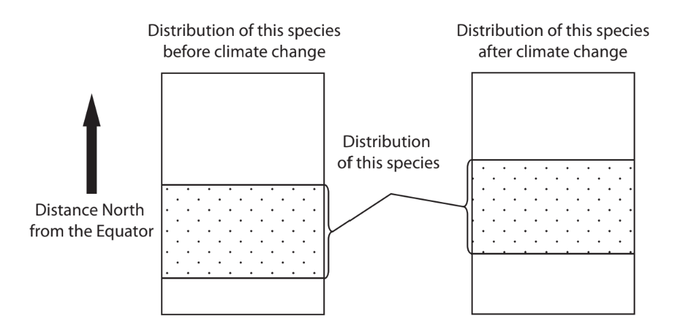

Explain the changes in the distribution of this species in this country.

### 4((c)) — 5 marks — command: multiple — structured — from paper Jan 2021 · WBI14/01
The effect of temperature on reproduction in a species of beetle was studied.

Groups of male and groups of female beetles were each kept at different temperatures for five days.

The beetles were then mated with beetles, of the opposite sex, that had been kept at 30°C for five days.

The mean number of offspring per breeding pair was then determined.

The graph shows the results of this study.

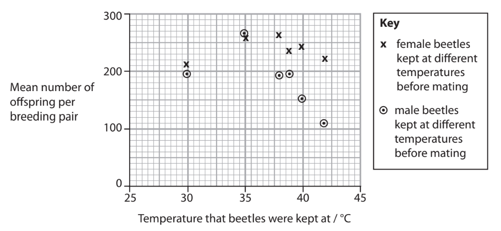

(i)

Identify **two** conclusions that can be drawn from this study.

**(2)**

(ii)

Explain the differences in the results obtained for the male and female beetles kept at different temperatures.

**(3)**

## Q2 — medium — 10 marks · exam-questions

### 6((a)) — 4 marks — command: multiple — structured — from paper Jan 2021 · WBI14/01
The photograph shows two zebras.

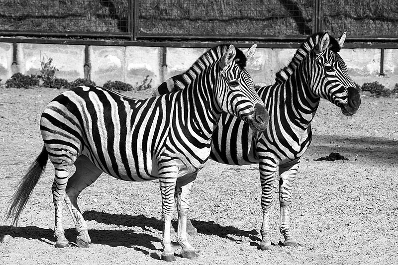

Stano Novak, CC BY 2.5 <https://creativecommons.org/licenses/by/2.5>, via Wikimedia Commons

The stripes of zebras are thought to reduce attack by biting flies.

Biting flies cause stress and disease to cattle, reducing food production and causing financial losses for farmers.

Farmers use chemicals to kill the flies.

Flies often evolve resistance to a new chemical within about 10 years.

(i)

Explain how flies evolve resistance to new chemicals.

**(3)**

(ii)

Suggest why the evolution of resistance to these chemicals occurs so quickly in flies.

**(1)**

### 6((b)) — 6 marks — command: determine — structured — from paper Jan 2021 · WBI14/01
An investigation was carried out to see if the presence of stripes on cattle reduced the number of biting flies on their bodies.

Three groups of black cattle were compared:

- Unpainted cattle
- Cattle painted with black and white stripes
- Cattle painted with black stripes only.

Cattle repel flies by flicking their tails, stamping their feet and skin twitching.

The frequencies of these fly-repelling behaviours were recorded.

The graph and tables show some of the results of this investigation.

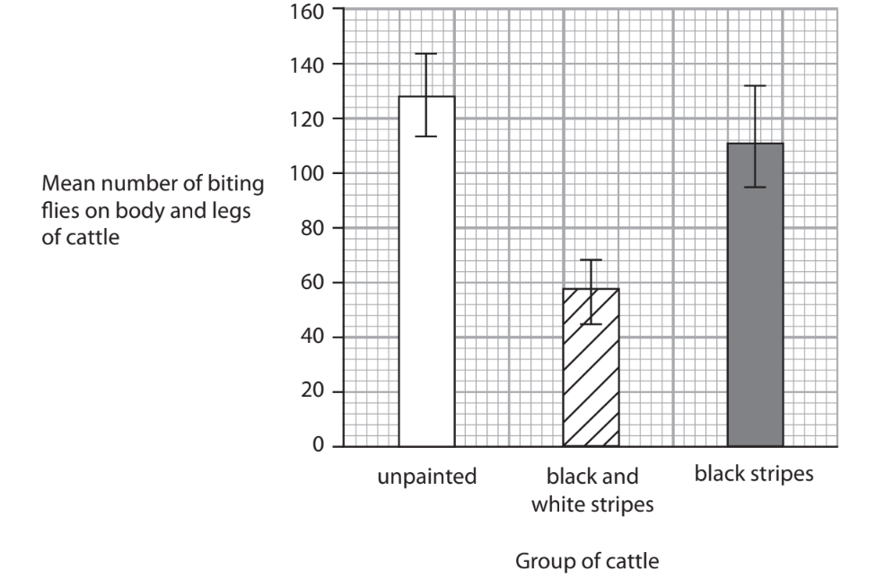

| **Group of cattle** | **Number of flies on** **the body** | **Number of flies on** **the legs** |
|---|---|---|
| unpainted | 662 | 1309 |
| black and white stripes | 231 | 710 |
| black stripes | 677 | 1030 |

**Table 1**

| **Group of cattle** | **Mean frequencies of fly-repelling behaviours / number per hour** |   |   |
|---|---|---|---|
| **Flicking their tails** | **Stamping their feet** | **Skin twitching** |   |
| unpainted | 54 | 16 | 5 |
| black and white stripes | 42 | 10 | 8 |
| black stripes | 55 | 16 | 5 |

**Table 2**

Determine the effectiveness of painting stripes on cattle in reducing the number of biting flies on them.

Use the information in the graph and both tables to support your answer.

## Q3 — medium — 8 marks · exam-questions

### 4((a)) — 4 marks — command: explain — structured — from paper June 2021 · WBI14/01
Madagascar is a large island off the southeast coast of mainland Africa.

Lemurs are endemic to Madagascar.

There are many different species of lemur, all of which evolved from one common ancestor. This common ancestor is thought to be a primate that was carried across the sea from mainland Africa on a raft of vegetation.

The photographs show two different species of lemur, Sifaka and Indri, found in the same region of Madagascar.

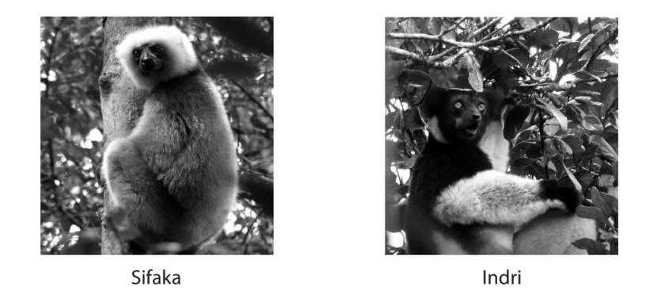

The diet of Sifakas is mostly seeds but also includes fruits, flowers and some types of leaves. The diet of Indri is mainly leaves.

Explain the types of speciation that have taken place in the evolution of Sifakas and Indri in this region of Madagascar.

### 4() — 4 marks — command: explain — structured — from paper June 2021 · WBI14/01
Lemurs have been found on another island close to Madagascar.

Scientists have used DNA profiling to show that these lemurs originated from those on Madagascar.

(i)

Explain the role of the polymerase chain reaction (PCR) in DNA profiling.

**(2)**

(ii)

Explain how DNA profiling could show that these lemurs originated from the lemurs on Madagascar.

**(2)**

## Q4 — medium — 13 marks · exam-questions

### 6((a)) — 4 marks — command: put — structured — from paper June 2021 · WBI14/01
The diagram shows part of the carbon cycle.

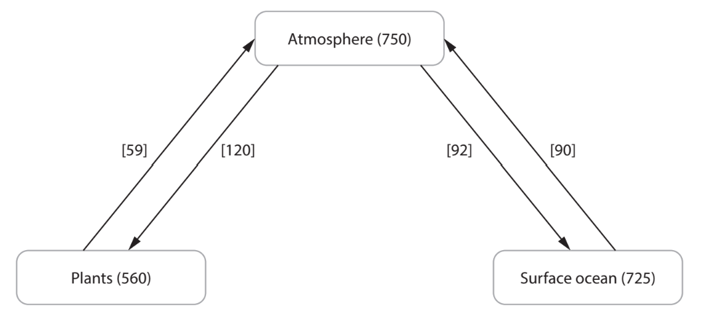

| \| **Key** \| \|---\| \| The numbers in smooth brackets ( ) show the mass of carbon in petagrams found in either the atmosphere, plants or surface ocean. \| \| The numbers in square brackets [ ] show the mass of carbon in petagrams transferred between the atmosphere and the plants or surface ocean per year. \| \| A petagram is equal to 1015 grams. \| |
|---|

Carbon is found in carbohydrates.

The table shows some carbohydrates that may be found in plants and animals.

For each carbohydrate, put** one** cross ☒ in the appropriate box, in each row, to show where these carbohydrates are produced.

| **Carbohydrate** | **Carbohydrate produced by** |   |   |   |
|---|---|---|---|---|
| both plants and animals | plants but **not** animals | animals but **not** plants | neither plants nor animals |   |
| Amylose | ☐ | ☐ | ☐ | ☐ |
| Glucose | ☐ | ☐ | ☐ | ☐ |
| Glycogen | ☐ | ☐ | ☐ | ☐ |
| Starch | ☐ | ☐ | ☐ | ☐ |

### 6() — 5 marks — command: multiple — structured — from paper June 2021 · WBI14/01
The mass of carbon recycling between the atmosphere and the plants, and the atmosphere and the oceans, are roughly balanced.

(i)

State how carbon is exchanged between the atmosphere and the oceans.

**(1)**

(ii)

Calculate the increase in the mass of carbon in plants as a result of carbon exchange between the plants and the atmosphere in one year.

Give your answer in kilograms.

**(1)**

(iii)

Describe how the carbon present in sugars in the plants is returned to the atmosphere in the carbon cycle.

**(3)**

### 6() — 4 marks — command: multiple — structured — from paper June 2021 · WBI14/01
Anthropogenic climate change is a result of an increase in the mass of carbon in the atmosphere.

(i)

State what is meant by the term **anthropogenic climate change**.

**(2)**

(ii)

Explain **one** way in which the effects of anthropogenic climate change can be reduced.

**(2)**

## Q5 — medium — 15 marks · exam-questions

### 7((a)) — 2 marks — command: state — structured — from paper Jan 2022 · WBI14/01
As the human population in the world has increased, the demand for food has increased.

The production of food has an impact on the environment, unless it can be done in a sustainable way.

(i)

State the meaning of the term **population,** as it has been used in this context.

**(1)**

(ii)

State the meaning of the term **sustainable,** as it has been used in this context.

**(1)**

### 7((b)) — 7 marks — command: multiple — structured — from paper Jan 2022 · WBI14/01
The diagram shows the impact of food production on three environmental factors.

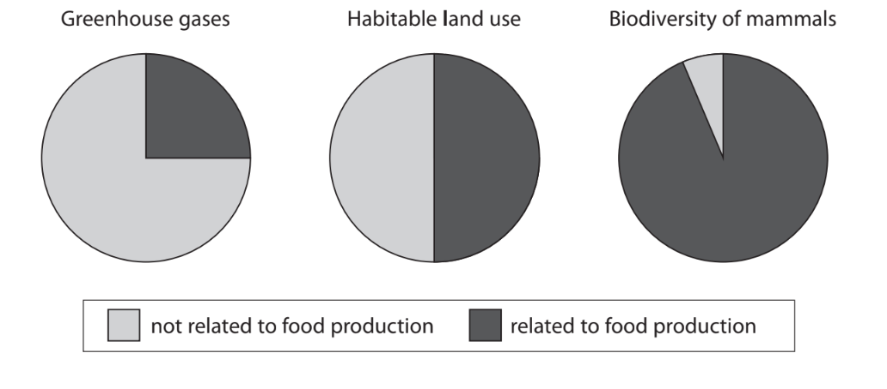

(i)

Explain how food production could contribute to the greenhouse effect.

**(3)**

(ii)

Land occupies 149 million km2 of the surface of the Earth.

Habitable land is 71 % of this area and some of it is used for food production.

Calculate the area of the surface of the Earth used in food production.

Express your answer in standard form.

**(3)**

(iii)

Estimate the effect of food production on the ratio of biodiversity of mammals.

**(1)**

### 7((c)) — 6 marks — command: explain — structured — from paper Jan 2022 · WBI14/01
The diagram shows the area of land used to produce one kilogram of some food products.

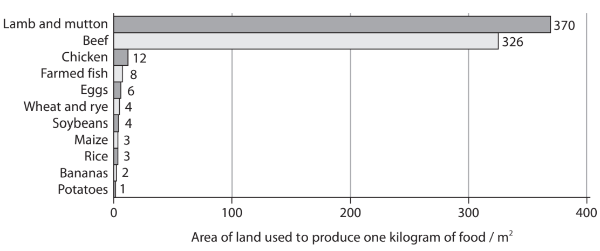

Explain how food production could be made more sustainable.

Use the information in the diagram and your own knowledge to support your answer.

## Q6 — medium — 10 marks · exam-questions

### 6((a)) — 1 mark — command: calculate — structured — from paper Oct/Nov 2020 · WBI14/01
The photograph shows a ground squirrel.

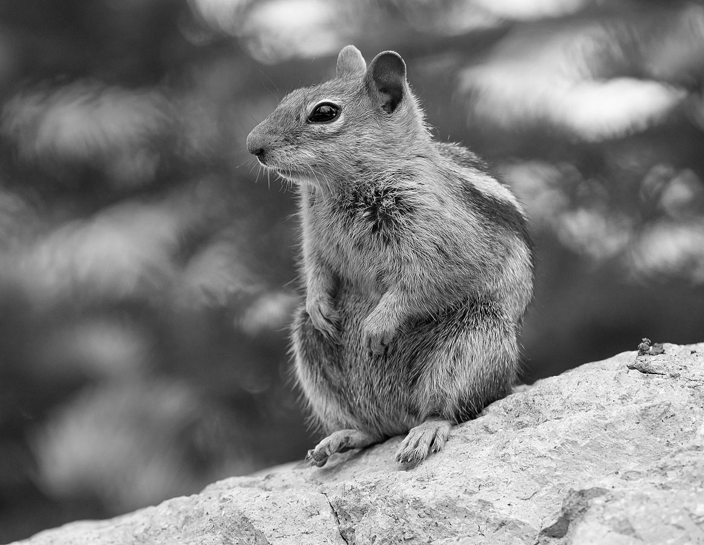

Frank Schulenburg, CC BY-SA 4.0, via Wikimedia Commons

Ground squirrels feed on a variety of foods including nuts.

Ground squirrels have evolved food pouches.

The photograph shows the food pouches of a ground squirrel.

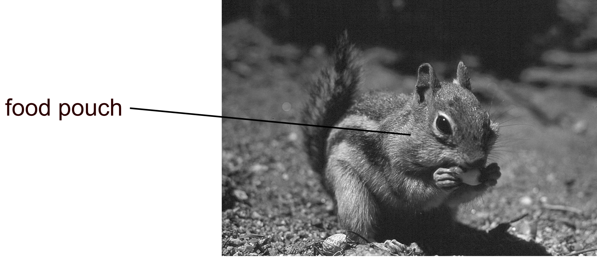

Colorado State University Libraries, CC BY-SA 4.0, via Wikimedia Commons

The table shows some information about three types of nut: acorns, hazelnuts and walnuts.

| **Type of nut** | **Photograph** | **Description** | **Energy content / kJ per 100 g** |
|---|---|---|---|
| acorn | 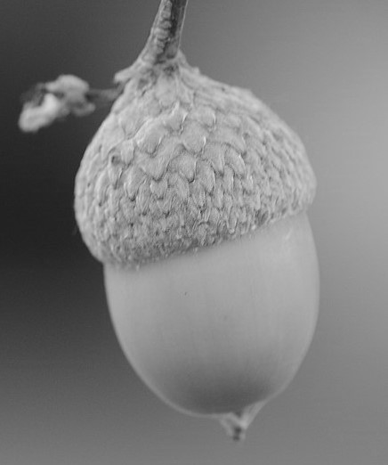 | 1.0 to 3.0 cm long 0.8 to 2.0 cm wide | 1619 |
| hazelnut | 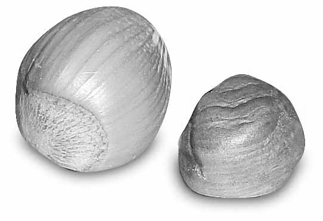 | 1.5 to 2.5 cm long 1.0 to 1.5 cm wide hard covering | 2788 |
| walnut | 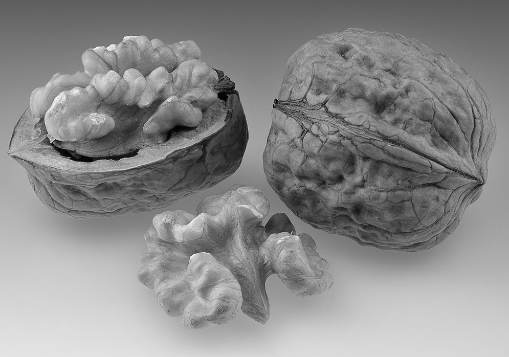 | 3.0 to 5.0 cm long 2.0 to 4.0 cm wide hard shell | 2822 |

Alias 0591 from the Netherlands, CC BY 2.0; Horst Frank, CC BY-SA 3.0; Horst Frank, CC BY-SA 3.0, all via Wikimedia Commons

The volume of the smallest walnut is approximately 50 cm3.

Calculate the approximate volume of the largest hazelnut, using the formula:

$\mathrm{volume}=\frac{4}{3}πlw^{2}$

where *π* = 3, l = length of the hazelnut and w = width of the hazelnut.

### 6() — 6 marks — command: multiple — structured — from paper Oct/Nov 2020 · WBI14/01
A student investigated the feeding preferences of ground squirrels.

(i)

Design a laboratory investigation to find out which of these three types of nut ground squirrels prefer to eat.

**(3)**

(ii)

Predict the results of this investigation, giving reasons.

Use the information in the table to support your answer.

**(3)**

### 6((c)) — 3 marks — command: suggest — structured — from paper Oct/Nov 2020 · WBI14/01
Suggest how ground squirrels evolved pouches.

## Q7 — medium — 8 marks · exam-questions

### 4() — 2 marks — command: calculate — structured — from paper Oct/Nov 2021 · WBI14/01
Redwood trees are the tallest living organisms on Earth. Some of the older trees are more than 2000 years old.

Dendrochronology can be used to work out how old a tree is and how much it has grown each year.

A sample of the tree trunk core can be taken using an increment borer.

The photograph shows an increment borer being used to take a sample of a tree trunk core.

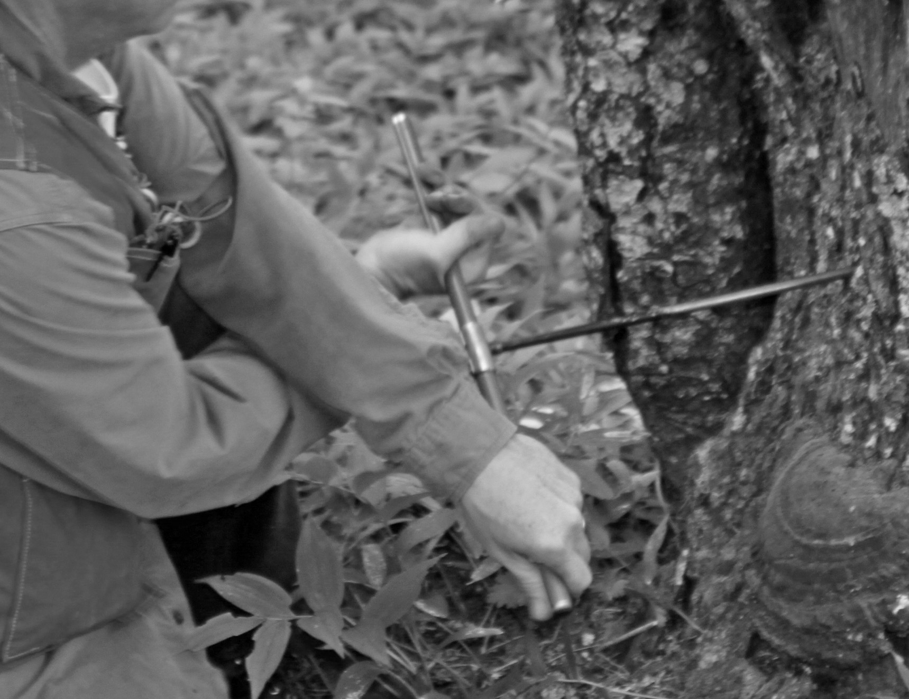

Bureau of Land Management Oregon and Washington from Portland, America, Public domain, via Wikimedia Commons

The diagram shows an increment borer pushed into the trunk of a large Redwood tree.

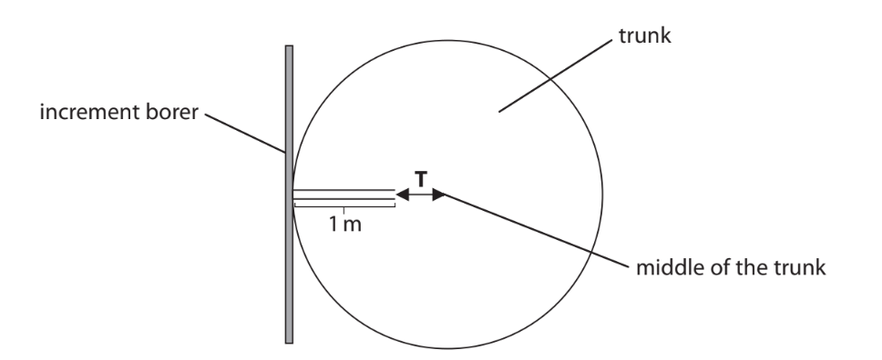

An increment borer 1 m long was inserted into a Redwood tree. The borer did not reach the middle of the trunk. The distance from the end of the borer to the middle of the trunk is** T **cm.

(i)

Calculate the radius (r) of a tree with a circumference (C) of 8 m. Use the formula: r = $\frac{C}{2π}$

Give your answer to** two** decimal places.

**(1)**

(ii)

Calculate the distance** T** as a percentage of this radius.

**(1)**

### 4() — 6 marks — command: multiple — structured — from paper Oct/Nov 2021 · WBI14/01
To calculate how old a tree is and how much it has grown, core samples are taken at different heights up the tree.

These core samples are then aligned by matching the rings, as shown in the diagram.

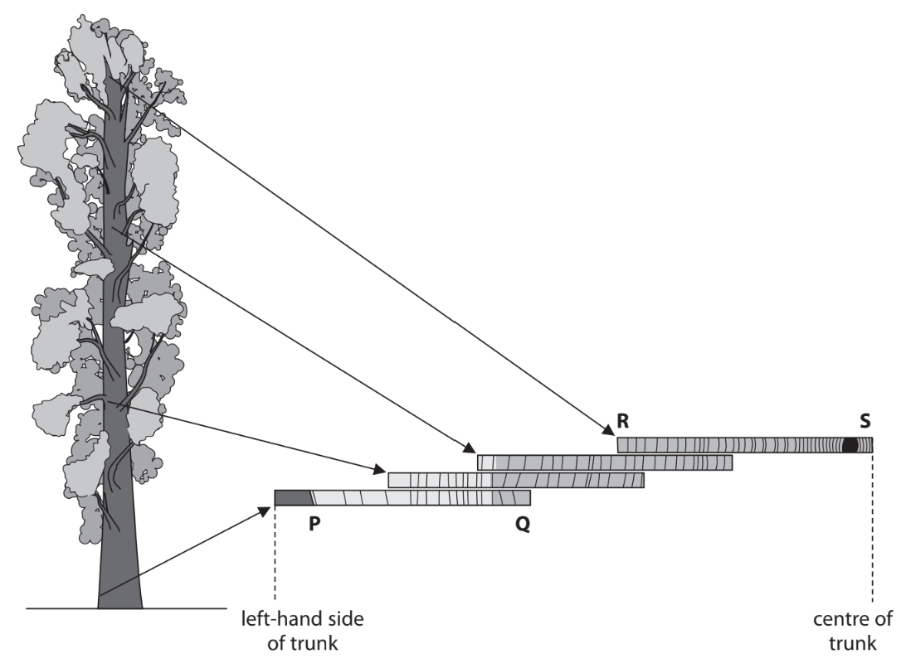

(i)

Which row of the table shows the newest and oldest rings in this tree?

**(1)**

|   | **newest ring** | **oldest ring** |   |
|---|---|---|---|
| ☐ | **A** | **P** | **Q** |
| ☐ | **B** | **P** | **S** |
| ☐ | **C** | **S** | **R** |
| ☐ | **D** | **S** | **P** |

(ii)

Explain how these core samples can be used to calculate the age of this tree.

Use the information in the question and the diagram to support your answer.

**(3)**

(iii)

Describe how the growth rate of this tree can be calculated.

**(2)**

## Q8 — hard — 10 marks · exam-questions

### 1() — 2 marks — command: suggest — structured
Permafrost is ground that remains permanently frozen throughout the year, found across large areas of the Arctic and high-altitude regions. These frozen soils contain vast stores of organic matter — dead plant and animal material — that have accumulated over thousands of years.

Suggest why permafrost contains large stores of organic matter.

### 2() — 2 marks — command: suggest — structured
As global temperatures rise due to climate change, permafrost areas are decreasing worldwide; this has been linked to increased carbon dioxide emissions. Scientists are investigating whether re-wetting permafrost areas (deliberately flooding them with water) could reduce these CO2 emissions.

During a study researchers selected three similar permafrost sites, each covering approximately 50 hectares, in the same geographical region. CO2 flux (the rate of CO2 release from soil) was measured monthly at multiple points across each site using electronic CO2 meters, and annual averages were calculated. The study ran from 2010 to 2020.

- Site A received no intervention
- At Site B, moderate re-wetting began in 2015, involving flooding to a depth of 15-25 cm
- At Site C, intensive re-wetting began in 2015, involving flooding to a depth of 40-60 cm

The resulting data are shown in the table.

| **Year** | **CO****2**** flux (g m⁻² yr⁻¹)** |   |   |
|---|---|---|---|
| **Site A** | **Site B** | **Site C** |   |
| 2010 | 120 | 118 | 122 |
| 2012 | 135 | 132 | 137 |
| 2014 | 148 | 145 | 150 |
| 2016 | 163 | 125 | 110 |
| 2018 | 179 | 115 | 85 |
| 2020 | 194 | 108 | 72 |

Suggest an explanation for the trends shown after the rewetting intervention began.

### 3() — 2 marks — command: calculate — structured
Calculate the total reduction in annual CO₂ emissions achieved by re-wetting at sites B and C combined in 2020, compared with their emissions in 2014. Give your answer in tonnes per year.

Note that:

- 1 hectare = 10 000 m²
- 1 tonne = 1 000 000 g

### 4() — 3 marks — command: evaluate — structured
Reducing CO₂ emissions is essential to limit climate change.

Use the information provided to evaluate the effectiveness of rewetting as a method of reducing CO₂ release from permafrost.

### 5() — 1 mark — command: state — structured
The study described above investigates a method aimed at reducing CO₂ emissions. To understand the extent of the climate change problem that such methods aim to address, scientists collect evidence from various sources.

State one type of evidence that shows climate change has occurred.
