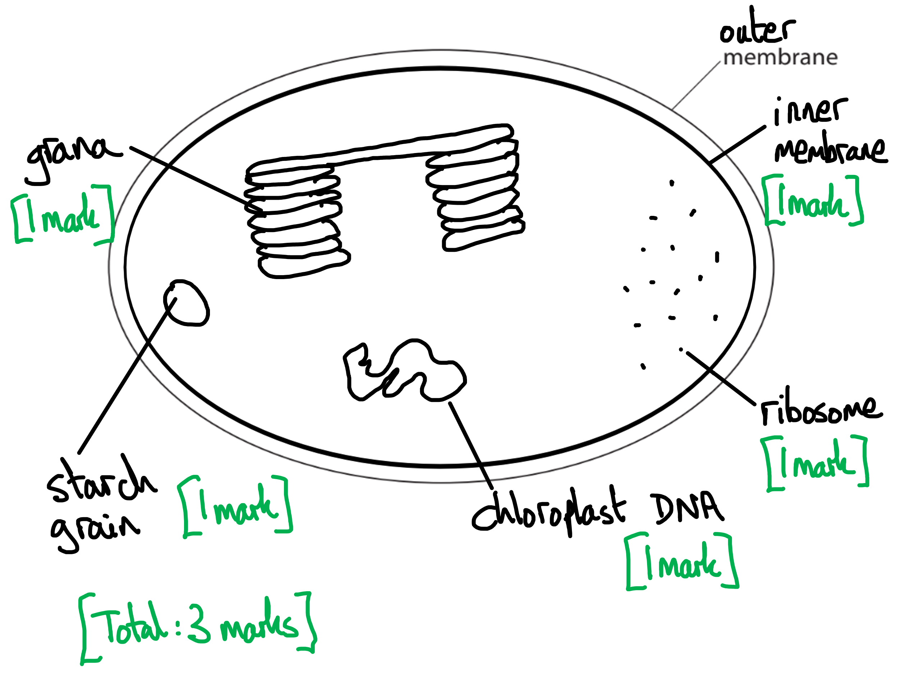
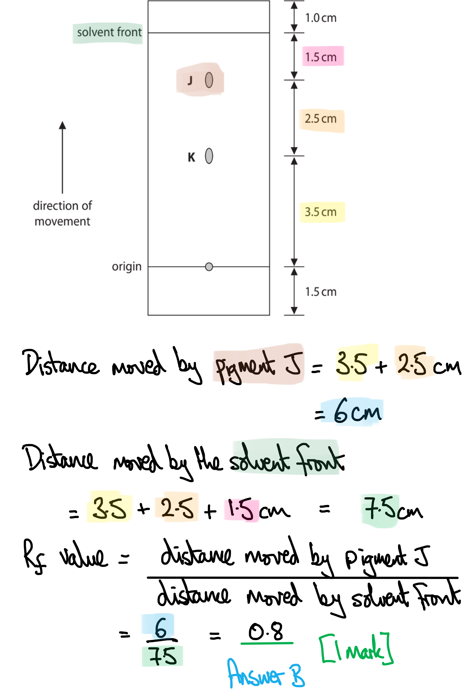
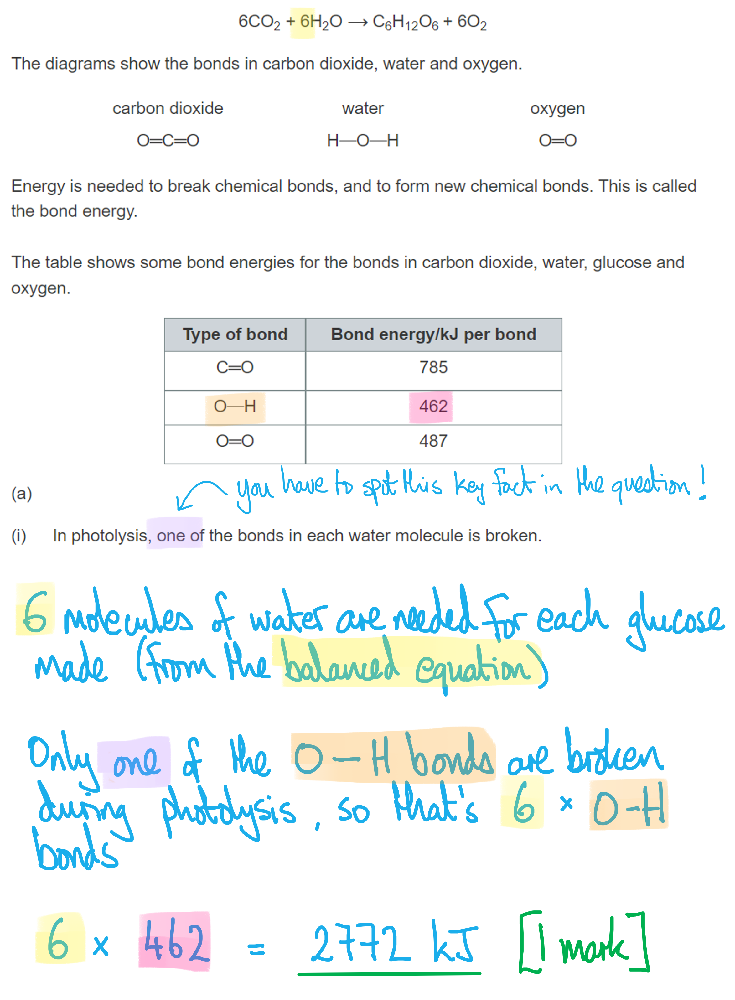
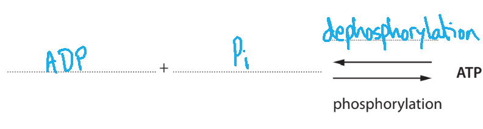
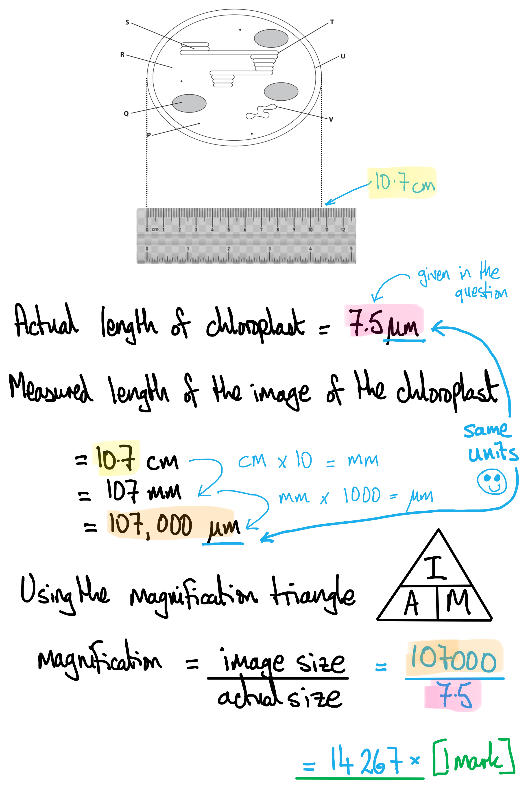
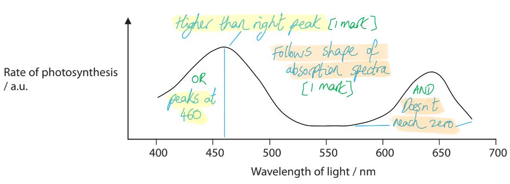
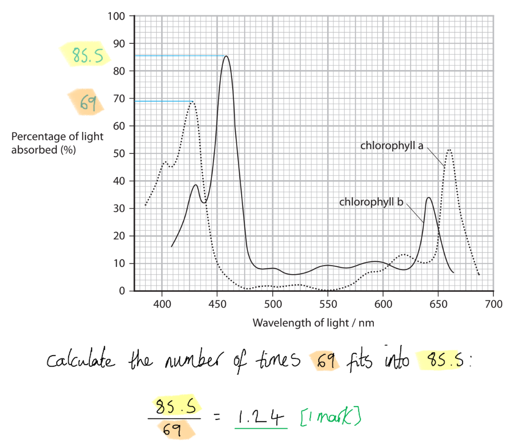

# Mark Schemes — Photosynthesis
**5. Energy Flow, Ecosystems & the Environment** · Edexcel International A Level (IAL) Biology (YBI11)

## Q1 — medium — 8 marks · exam-questions

### 1((a)) — 1 marks
The correct answer is **C**** **because...

**The light-dependent reactions take place across the thylakoid membranes and the light-independent reactions take place in the stroma.**

**[Total: 1 mark]**

### 1((b)) — 3 marks
The labelled features on the diagram that are found in a chloroplast, other than the stroma and the thylakoid membranes, are...

Any **three** of the following:

- DNA (loop) / plasmid / plasmid-like DNA; **[1 mark]**
- Starch grain / granule; **[1 mark]**
- Envelope / inner membrane **and** outer membrane / double membrane; **[1 mark]**
- Grana / grana stack / granum / (inter granal) lamellae; **[1 mark]**
- Ribosomes; **[1 mark]**

***Ignore**** lipid droplets, stroma, and thylakoid membranes.*

***Ignore**** size references.*

**[Total: 3 marks]**

### 1((c)) — 1 marks
The wavelength of light that is absorbed the least by chloroplasts is **B** because...

**Green/520 nm light is reflected by chloroplasts, giving most plants their green colour.**

> *Blue, yellow and red wavelengths are absorbed by chlorophyll and used to excite electrons in the light-dependent stage of photosynthesis. *

**[Total: 1 mark]**

### 1((d)) — 1 marks
(d) The term **action spectrum** means...

- The rate of photosynthesis at different wavelengths of light; **[1 mark]**

**[Total: 1 mark]**

> *Take care to distinguish between action spectrum and absorption spectrum for this question. *

### 1() — 2 marks
(e) (i) The correct answer is **A **(chromatography) because...

**Chromatography is a method used to separate a mixture into its individual components; in this case to separate the contents of a chloroplast into separate pigments.**

> *Dendrochronology (B) is the study of tree growth rings.*

> *Osmosis (C) is the movement of free water molecules from a high solute potential to a lower solute potential.*

> *PCR (D) amplifies the number of DNA molecules.*

(e) (ii) The Rf value for chloroplast pigment J is **B**.

**[Total: 2 marks]**

## Q2 — medium — 10 marks · exam-questions

### 3() — 5 marks
(i) The amount of energy that is released by photolysis in order for one molecule of glucose to be made is calculated as follows...

- (6 O-H bonds × 462 kJ =) 2772 (kJ); **[1 mark]**

> *Make sure to read every sentence of the question; the one that points out that only **one** of the bonds in water is broken during photolysis is crucial to getting this mark. *

(ii) Light energy is converted into chemical energy in the form of ATP as follows...

Any **four** of the following:

- Light is absorbed by photosystems / chlorophyll; **[1 mark]**
- Which excites electrons / releases high-energy electrons / releases electrons to higher energy levels; **[1 mark]**
- These electrons are passed along a series of (electron) carriers; **[1 mark]**
- Therefore releasing energy to phosphorylate ADP to ATP; **[1 mark]**
- Hydrogen ions pass through ATP synthase, releasing energy for phosphorylation of ADP; **[1 mark]**

*A reference to ATP being synthesised from ADP is only needed once to award both 4th and 5th marking points.*

> *Note that light energy is **absorbed** by chlorophyll; this is a better statement than 'light hits chlorophyll.'*

**[Total: 5 marks]**

### 3() — 2 marks
(i) The other information that is needed in the table of bond energies for the value of 9164 kJ to be calculated is...

The bond energy values of

| - C-H **OR **the bond between carbon and hydrogen |  | Any **two** for [1 mark] |
|---|---|---|
| - C-O **OR **the bond between carbon and oxygen |   |   |
| - C-C **OR **the bond between carbon and carbon |   |   |

*Ignore bond energy of O-H as this is in the table already.*

(ii) In the chloroplasts, these bonds are formed in **C** (the stroma).

**The stroma is the site of the light-independent stage of photosynthesis, which includes the final synthesis of glucose in the Calvin Cycle. **

> *There is no cytoplasm (A) inside chloroplasts; chloroplasts are not a cell so do not have cytoplasm*

> *The matrix (B) is not found in chloroplasts but inside **mitochondria.*

> *The thylakoid membrane (D) is the site of the light-dependent stage, not the light-independent stage*

**[Total: 2 marks]**

### 3() — 3 marks
(i) The row of the table that describes how two amino acids join together is **A** (carbon and nitrogen / condensation).** **

Peptide bonds form between a **carbon** atom of one amino and a **nitrogen** atom of the neighbouring amino acid (polypeptides therefore have a backbone that consists of repeating N-C-C units). Bonds form during **condensation reactions** during which a molecule of water is released.

> *Hydrolysis reactions require water and involve the breaking of bonds.*

(ii) Amino acids cannot be produced from glucose alone because...

Any **two** of the following:

- Amino acids contain nitrogen **OR **glucose does not contain nitrogen; **[1 mark]**
- Some amino acids / R groups contain sulfur  **OR **glucose does not contain sulfur; **[1 mark]**
- Nitrogen has to be obtained from nitrates / nitrates are needed **OR** sulfur has to be obtained from sulfates / sulfates are needed; **[1 mark]**

> *Make sure to stick to discussion of the **chemical elements** that make up these biological molecules. It would not be enough to mention that amino acids have an amino group but glucose does not; you should mention **nitrogen** in your answer. *

**[Total: 3 marks]**

## Q3 — medium — 13 marks · exam-questions

### 5((a)) — 7 marks
(i) Light energy is converted into energy stored in ATP because...

Any **two **of the following:

- Because ATP is the source of energy for plants / all living organisms; **[1 mark]**
- Because light energy cannot be used (directly); **[1 mark]**
- ATP is needed in the light-independent reactions/ Calvin cycle to convert GP into GALP; **[1 mark]**

(ii) The completed equation includes...

- *Before arrows: *ADP/adenosine diphosphate **and** (inorganic) Pi /phosphate/PO43- (ion) (**NOT** P); **[1 mark]**
- *Over arrows:* hydrolysis / dephosphorylation; **[1 mark]**

(a) (iii) The role of light energy in the light-dependent reactions is...

Any **three **of the following:

- To release/excite electrons (from chlorophyll); **[1 mark]**
- So that <u>electrons</u> can be used in chemiosmosis / (photo)phosphorylation; **[1 mark]**
- Photolysis occurs to replace the electrons lost by chlorophyll / to provide protons for formation of NADPH/reduced NADP; **[1 mark]**
- To produce ATP and NADH/reduced NADP for the light-independent reactions / Calvin Cycle; **[1 mark]**

**[Total: 7 marks]**

> *Make sure to be careful with your language, for example you should not refer to light ‘hitting’ the chlorophyll, and instead refer the idea that light is ‘absorbed’ by the chlorophyll, which is far more accurate. *

### 5((b)) — 6 marks
(i) The correct answer is **D **because...

**ATP is produced by non-cyclic photophosphorylation and NADP is reduced in the light-independent reaction**

> *A** and **B** are incorrect because ATP is not available to light-dependent reactions in cyclic photophosphorylation*

> *C** is incorrect because oxidised NADP is not produced*

(b) (ii) The inorganic molecules are...

- C and O from carbon dioxide/CO2; **[1 mark]**
- H from water/H2O; **[1 mark]**

***Reject**** water is the source of oxygen*

> *Because water is photolysed in the light-dependent stage of photosynthesis, the oxygen atoms from water are ejected as waste oxygen gas; only the protons/H atoms get passed into the light-independent stage and incorporated into carbohydrates. *

(iii) The inorganic ions that are needed to synthesise the new biological molecules are....

| **New** **biological** **molecule** | **Nitrates** | **Phosphates** | **Both nitrates** **and** **phosphates** | **Neither** **nitrates nor** **phosphates** |
|---|---|---|---|---|
| protein | ✘; **[1 mark]** |   |   |   |
| RNA |   |   | ✘; **[1 mark]** |   |
| triglyceride |   |   |   | ✘; **[1 mark]** |

**[Total: 6 marks]**

## Q4 — medium — 9 marks · exam-questions

### 2((a)) — 3 marks
Comparative and contrasting features between the structures of a chloroplast and a mitchondrion are...

*Comparative features*

A **maximum of** **two** of the following:

- Both have (circular) DNA; **[1 mark]**
- Both have ribosomes; **[1 mark]**
- Both have double membranes; **[1 mark]**

*Contrasting features*

A **maxiumum of two** of the following:

- Chloroplasts have a stroma **WHILE** mitochondria have a matrix; **[1 mark]**
- Chloroplasts have thylakoids/thylakoid membranes/grana **WHILE** mitochondria have a folded inner membrane / cristae; **[1 mark]**
- Chloroplasts have starch grans **WHILE** mitochondria do not; **[1 mark]**

*Do not award marks for differences that appear in different parts of the answer; there must be direct contrast between the two structures.*

**[Total: 3 marks]**

> *Compare and contrast questions should contain a **good balance of comparative and contrasting points**.*

> *You should also ensure that statements relating to contrasting points contain a **direct contrast**, e.g. "chloroplasts have a stroma but mitochondria have a matrix". Avoid writing separate paragraphs about chloroplasts and mitochondria as this will not allow for such direct contrast; the examiner will not search through your answer to find the contrasting features if they are not next to each other!*

### 2() — 6 marks
(i) The correct word or words on the dotted lines labelled D, E, F, G and H should be…

- (D =) chlorophyll / light absorbing pigments / photosystems/PSI/PSII; **[1 mark]**
- (E =) electron carriers/electron transport proteins/cytochromes; **[1 mark]**
- (F =) ADP/adenosinediphosphate **AND** (G =) phosphate (ions)/Pi/PO42- **AND **(H =) ATP/adenosine triphosphate; **[1 mark]**

***Accept**** F and G the other way around.*

***Reject**** P for phosphate ions.*

(ii) One molecule that is produced in non-cyclic photophosphorylation that is** not** produced in cyclic photophosphorylation is...

- Reduced NADP/NADPH; **[1 mark]**

***Reject**** references to NAD instead of NADP.*

(iii) The role of photolysis in non-cyclic photophosphorylation is...

Any **two** of the following:

- The splitting of water; **[1 mark]**
- (To release) electrons that replace those lost from photosystems (I or II); **[1 mark]**
- (To release) hydrogen ions/H+/protons involved in the formation of NADPH; **[1 mark]**

**[Total: 6 marks]**

> *Note that in part (iii) it is not enough to just describe the process of photolysis; you must state the** role** that it plays in non-cyclic photophosphorylation; that is to **replace lost electrons** and provide** protons** to reduce NADP.*

## Q5 — medium — 8 marks · exam-questions

### 1() — 6 marks
(i) The correct answer is **D** because...

**P is a ribosome (the smallest structure), Q is a starch grain (the largest structure) and V is a small, circular loop of DNA.**

(ii) The correct answer is **B** because...

**GALP (glyceraldehyde 3-phosphate) is a 3-carbon intermediate in the Calvin cycle, part of the light-independent stage of photosynthesis. This stage takes place in the stroma (structure R). **

(iii) The magnification is calculated as follows...

- 14 267; **[1 mark]**

***Allow**** answer rounded to different numbers of significant figures, e.g. 14 270 / 14 300 / 14 000*

***Allow**** 'times' or '×' to represent magnification*

***Allow ****answers in standard form, e.g. 1.43 × 10**4*

(iv) The structure of the two membranes in structures **T** and **U** can be compared and contrasted as follows...

*Similarities*

- Both have a phospholipid bilayer / are made of phospholipids; **[1 mark]**

*Differences*

A maximum of **two** of the following:

- T has chlorophyll/photosynthetic pigments / photosystems/PSI/PSII **WHILE** U does not; **[1 mark]**
- T contains ATP synthase **WHILE **U does not; **[1 mark]**
- T contains electron carriers/electron carrier proteins/an electron transport chain **WHILE **U does not; **[1 mark]**

***Reject**** references to the membranes or to a chloroplast as a "cell".*

**[Total: 6 marks]**

### 1((b)) — 2 marks
(b) Conclusions that can be made about the replication of chloroplast DNA are...

- Light is needed for the replication (of chloroplast DNA) / replication of chloroplast DNA does not occur in the dark; **[1 mark]**
- The replication (of chloroplast DNA) is independent of mitosis / the cell cycle; **[1 mark]**

**[Total: 2 marks]**

## Q6 — medium — 8 marks · exam-questions

### 2((a)) — 5 marks
(i) The action spectrum for this plant should be as follows…

- A line that roughly follows the shape of the absorption spectrum **AND** that does not drop to zero; **[1 mark]**
- The left peak is at about 460 nm / is higher than the right peak; **[1 mark]**

***Ignore**** any line that is extrapolated to the y axis.*

***Reject**** marking point 1 if line hits zero.*

***Accept**** two left-hand peaks provided that both are higher than the right-hand peak.*

(ii) The percentage of light absorbed by chlorophyll b is greater than that absorbed by chlorophyll a, at their maximum absorptions, by the following number of times...

- (Answers in the range of) 1.2-1.25; **[1 mark]**

(iii) The advantage of thylakoid membranes containing different types of chlorophyll pigment is that...

- Different <u>wavelengths</u> of light can be <u>absorbed</u>; **[1 mark]**
- So that the rate of photosynthesis can be maximised/increased; **[1 mark]**

> *Take note of the number of marks available for each question and tailor your answer to suit this number. Here, for example, there is little benefit to writing a long answer when there are a maximum of two marks available; this would use up time that you could be spending gaining marks elsewhere*

**[Total: 5 marks]**

### 2((b)) — 3 marks
(i) The row of the table that describes the bonds that form between amino acids in a protein is **A** because...

The bonds between amino acids in a protein are known as **peptide bonds**. Peptide bonds form between the** amino group** of one amino acid and the **carboxyl group** of the neighbouring amino acid.

**Note that the carboxyl group is also known as the carboxylic aid group.**

(ii) Plants synthesise amino acids as follows...

- GALP / glucose is used; **[1 mark]**
- Nitrates from the soil are combined with GALP / glucose; **[1 mark]**

***Reject ****other named sugars for marking point 1.*

***Ignore ****'nitrogen' with no additional information about nitrates for marking point 2.*

> *Take note again that this is only a two-mark question, so lengthy answers are unlikely to be helpful. Avoid the temptation to describe the entire Calvin cycle and focus on the specific part of the Calvin cycle that is relevant to the question asked (i.e. the production of GALP).*

**[Total: 3 marks]**

## Q7 — medium — 12 marks · exam-questions

### 6((a)) — 2 marks
The term biodiversity means...

- (A measure of) the number of different species (in an area) / species richness; **[1 mark]**
- (A measure of) the genetic diversity within a species / the variation in genotypes / alleles; **[1 mark]**

**[Total: 2 marks]**

> *Biodiversity is a key term in the specification so its definition should be learned by rote during your revision. Commit these definitions to memory!*

### 6((b)) — 2 marks
The role of chlorophyll in the light-dependent reactions of photosynthesis is as follows...

- To <u>absorb</u> light energy **SO** that electrons are excited / released;** [1 mark]**
- To synthesise ATP **AND** NADPH/reduced NADP; **[1 mark]**

***Allow**** 'to absorb light energy so that it can be converted into ATP energy' for 1 mark.*

**[Total: 2 marks]**

> *Past paper practice can really help in showing you how to gain marks in questions like this that have appeared many times before in past papers. Avoid casual phrases like 'light hits chlorophyll' or 'chlorophyll catches light'; the term 'absorb' is much more accurate, hence why the examiners underline it in their mark scheme.*

### 6() — 8 marks
(i)

> *This is a **level-marked question**, meaning that it is marked **according to the levels table**. The indicative content points below the table are not to be used in the usual '**one point per mark**' way, but should be used together with the level descriptors to determine the number of marks which should be awarded. *

| **Level 1** | **[1 mark]** | 2 comparisons are given |
|---|---|---|
| **[2 marks]** | 4 comparisons are given |   |
| **Level 2** | **[3 marks]** | 6 comparisons **OR** 1 generalisation + 3 comparisons **OR **2 generalisations |
| **[4 marks]** | 6 comparisons **OR** 1 generalisation + 3 comparisons **OR **2 generalisations  **AND**  1 implication is discussed |   |
| **Level 3** | **[5 marks]** | 6 comparisons **OR** 1 generalisation + 3 comparisons **OR **2 generalisations  **AND**  2 implications are discussed |
| **[6 marks]** | 6 comparisons **OR** 1 generalisation + 3 comparisons **OR **2 generalisations  **AND**  3 implications are discussed |   |

The effectiveness of the two solvent extraction methods in the identification of these species of seaweed can be discussed as follows...

*Indicative content related to comparison of the methods*

- Propanone extracts more chlorophyll a from species P than DMSO
- DMSO extracts more chlorophyll a from species Q than propanone
- Propanone extracts more chlorophyll a from species R than DMSO
- Propanone extracts more chlorophyll a from species S than DMSO
- Propanone extracts more chlorophyll b from species P than DMSO
- Propanone extracts more chlorophyll b from species Q than DMSO
- DMSO extracts (slightly) more chlorophyll b from species R than propanone
- Propanone and DMSO extract similar concentrations of chlorophyll b from species S
- Propanone extracts more chlorophyll (of either type) from species P

*Indicative content related to generalisations about the methods*

- Propanone is the most effective solvent at extracting chlorophyll
- Species P appears to contain the most chlorophyll when using propanone
- DMSO is generally less effective than propanone **except** when extracting chlorophyll a from species Q / chlorophyll b from species R

*Indicative content related to implications in identifying species*

- Some chlorophyll is lost when the pigments are extracted together as the totals are (sometimes) *less* than the sum of the components (a and b)
- Other pigment types must be extracted in some cases as the totals are (sometimes) *more* than the individual components added together
- The choice of solvent will vary depending on the chlorophyll type / species that pigments are being extracted from
- (Solvent choice will vary) because of difference in solubility of pigments / permeability of membranes
- More than one solvent needs to be used if this method is to be used for identifying species (because different solvents extract different concentrations of different chlorophylls from different species)
- It is possible to consider the extraction of other pigments (than chlorophyll)
- Some sort of comparison table / calibration curve is needed to match profile of each species to known extraction profiles
- Propanone is better if only using one solvent as the results are the most varied (between species)
- Pigment extraction avoids the need for DNA analysis
- Comparisons can be made in the field / with simple equipment
- There is indication of validity of data

> *You may be tempted to use the large amount of data in the question to write a lot about the extractions of pigments by the two solvents. However, you should read the question carefully enough to pick up on the main direction that the examiners want you to go in, namely to address the use of the solvents in the **identification of the species** of seaweed.*

(c) (ii) Different concentrations of chlorophyll were obtained using these two different solvents because...

Any **two** of the following:

- Chlorophylls have different solubility / will dissolve more/less in different solvents; **[1 mark]**
- Chlorophylls have different structures; **[1 mark]**
- Solvents can permeate through / dissolve / disrupt cell membranes differently; **[1 mark]**

**[Total: 8 marks]**

## Q8 — medium — 13 marks · exam-questions

### 6((a)) — 4 marks
(i) RUBISCO is active in region **B** because...

**Q is the location of the light independent reactions and the enzyme RUBISCO is involved in fixing carbon dioxide in the Calvin cycle.**

(ii) The molecule stored in S is **C** because...

**Starch is the storage molecule of plants.**

> *GALP is produced during the Calvin cycle before being converted into other molecules*

> *Lipids have structural roles in plants, e.g. the phosphilipid membrane of cells.*

> *Sucrose is the form in which carbohydrates are transported around plants; it is not useful for storage because it is soluble and affects the water potential of cells.*

(iii) GP is formed in **B** because...

**GP is formed during the light independent reactions and Q is the site of these reactions. The unstable intermediate formed when carbon dioxide reacts with RuBP dissociates into 2 molecules of GP.**

(iv) The correct order of size, smallest to largest, is **A** because...

**P = 0.2 µm, R = 0.435 µm and S is 1-35 µm.**

**There are 1000 nm in a µm and 1000 µm in a mm. This means that:**

- **nm can be converted into µm by dividing by 1000**
- **mm can be converted into µm by multiplying by 1000.**

**P is 20 nm**

- **20 ÷ 1000 = 0.02 µm**

**R is 4.35×10****-4 ****mm**

- **0.000435 mm x 1000 = 0.435 µm**

**[Total: 4 marks]**

### 6((b)) — 9 marks
(i) The units for the rate of photosynthesis could be **C** because...

Carbon dioxide is **used** as a reactant during photosynthesis.

**mm****-2** represents 'per mm squared'; this could refer to the mg carbon dioxide used per square mm of leaf surface area.

**hr****-1** represents 'per hour'**.**

> *Carbon dioxide is not produced during photosynthesis, so options A and B are incorrect.*

> *D is incorrect because hr**-2** would represent 'per hour squared'. It makes no sense to measure time as an area!*

(ii) The rate of photosynthesis of these two species of plant, at different temperatures, can be compared and contrasted as follows...

Any **three** of the following:

*Comparative points (similarities)*

- Both have a rise and a fall in the rate of photosynthesis as temperature increases; **[1 mark]**
- Both have the same rate of photosynthesis at 16.5/16.4 °C; **[1 mark]**

*Contrasting points (differences)*

- *Spartina *has an optimum temperature/highest rate at 35 °C **WHILE** *Leucopoa* has an optimum temperature/highest rate at 23 °C; **[1 mark]**
- *Leucopoa* has a higher rate below 16.5 °C and *Spartina *has a higher rate above 16.5 °C; **[1 mark]**

***Accept**** temperature values between 34-36 °C and between 21-24 °C for marking point 3.*

***Accept ****reverse answer for marking point 4, e.g. "*Leucopoa *has a lower rate above 16.5 °C and *Spartina* has a lower rate below 16.5 °C".*

> *When you are answering questions that require you to use data values, you must be sure to **read the data provided carefully**. Here, for example, reading 16.5 as 16 °C would not gain a mark, and neither would incorrect readings of the optimum temperatures.*

(b) (iii) A Q10 value for the rate of photosynthesis can be calculated, using this graph, as follows...

- Read the rate of photosynthesis from the graph at two temperatures 10 °C apart / correctly stated examples of two temperatures, e.g. 10 °C and 20 °C; **[1 mark]**
- Divide the rate for the higher temperature by that for the lower temperature; **[1 mark]**

***Accept**** answers in the form of an equation provided that both of the above are clearly demonstrated.*

(b) (iv) The region of North America in which *Spartina* is most likely to grow is...

- Wheatland; **[1 mark]**
- Wheatland has the higher temperature (all year round); **[1 mark]**
- The enzymes/RUBISCO (of *Spartina*) will be more active (at this higher temperature); **[1 mark]**

> *The graph at the top of part (b) shows that the enzymes of **Spartina** have a high optimum temperature. The enzymes will therefore be more active in a warmer climate than in a cooler climate.*

**[Total: 3 marks]**

## Q9 — easy — 8 marks · exam-questions

### 1() — 1 marks
**Correct answer: A** — The total rate at which energy is fixed by photosynthesis per unit area per unit time.

> **[mark-scheme]**
> **Final answer:** **The correct answer is A.**
> 
> - GPP is the total rate at which energy is assimilated by producers before any respiratory losses are subtracted
> - This represents all the energy fixed by photosynthesis per unit area per unit time
> 
> **B **is incorrect because this describes NPP (Net Primary Productivity); the rate at which energy is stored in producer biomass after respiratory losses, making it available to consumers. The relationship is NPP = GPP − R, where R represents respiratory losses.
> 
> **C **is incorrect because this describes the rate of energy transfer between trophic levels, not the total energy fixed by producers.
> 
> **D **is incorrect because this describes the role of decomposers breaking down organic matter in the ecosystem, which is not a measure of primary productivity.

### 2() — 3 marks
To calculate efficiency of energy transfer from *Spartina* to primary consumers:

- Calculate NPP

NPP = GPP − R

= 22 400 − 6720

= 15 680 kJ m⁻² year⁻¹ **[1 mark]**

- Calculate efficiency efficiency

= $\frac{\mathrm{energy} \mathrm{assimilated} \mathrm{by} \mathrm{primary} \mathrm{consumers}}{\mathrm{energy} \mathrm{available} \mathrm{to} \mathrm{primary} \mathrm{consumers}}$x 100

=$\frac{1168}{15680}$x 100

= 7.449 **[1 mark]**

=** ****7.4 %** **[1 mark]**

> **[mark-scheme]**
> Award full marks for correct final answer in absence of working.
> 
> Award 2 marks for the correct answer given to the wrong number of s.f.

### 3() — 2 marks
> **[mark-scheme]**
> - RuBP is still being regenerated (from GALP) but less is being used to fix CO₂ **SO** RuBP concentration increases **[1 mark]**
> - GP is still being converted to GALP but less GP is being formed (from CO₂ + RuBP) **SO** GP concentration decreases **[1 mark]**

> **[exam-tip]**
> When a question asks you to explain changes in the concentration of a Calvin cycle intermediate, think carefully about what is being made and what is being used at each step. A substance accumulates if it is still being made but no longer being used as quickly, and decreases if it is still being used but no longer being made as quickly.
> 
> In this question, RuBP is still being regenerated from GALP but is no longer being used to fix CO₂ at the previous rate, so its concentration increases. GP is still being converted to GALP but is no longer being formed from CO₂ + RuBP at the previous rate, so its concentration decreases.
> 
> Make sure your answer addresses both substances and clearly links each change to a specific reaction in the Calvin cycle.

### 4() — 1 marks
**Correct answer: C** — ATP is used in the Calvin cycle to convert GP to GALP and to regenerate RuBP.

> **[mark-scheme]**
> **Final answer:** **The correct answer is ****C****.**
> 
> - ATP provides the energy for the reactions that convert GP to GALP and for the regeneration of RuBP from GALP in the Calvin cycle
> 
> **A** is incorrect because hydrogen for the reduction of GP is provided by reduced NADP, not ATP.
> 
> **B** is incorrect because the energy to pump hydrogen ions across the thylakoid membrane comes from excited electrons passing along the electron transport chain, not from ATP; this proton pumping is what drives the synthesis of ATP via chemiosmosis.
> 
> **D** is incorrect because the reduction of NADP at Photosystem I produces reduced NADP; ATP is produced by a separate process (chemiosmosis via ATP synthase).

### 5() — 1 marks
> **[mark-scheme]**
> - Stroma **[1 mark]**
