# Exam Questions — Photosynthesis
**5. Energy Flow, Ecosystems & the Environment** · Edexcel International A Level (IAL) Biology (YBI11)
> Source: [https://www.savemyexams.com/international-a-level/biology/edexcel/18/topic-questions/5-energy-flow-ecosystems-and-the-environment/photosynthesis/exam-questions/](https://www.savemyexams.com/international-a-level/biology/edexcel/18/topic-questions/5-energy-flow-ecosystems-and-the-environment/photosynthesis/exam-questions/) · 9 questions · total 89 marks

## Q1 — medium — 8 marks · exam-questions

### 1((a)) — 1 mark — command: which — structured — from paper Oct/Nov 2020 · WBI14/01
Chloroplasts are involved in both the light-dependent reactions and light-independent reactions of photosynthesis.

Which row of the table shows where the light-dependent reactions and light-independent reactions take place?

|   | **Light-dependent reactions** | **Light-independent reactions** |
|---|---|---|
| ☐  **A** | stroma | stroma |
| ☐  **B** | stroma | thylakoid membranes |
| ☐  **C** | thylakoid membranes | stroma |
| ☐  **D** | thylakoid membranes | thylakoid membranes |

### 1((b)) — 3 marks — command: draw — structured — from paper Oct/Nov 2020 · WBI14/01
The diagram shows the outline of a chloroplast.

Draw** three** labelled features on this diagram that are found in a chloroplast, other than the stroma and the thylakoid membranes.

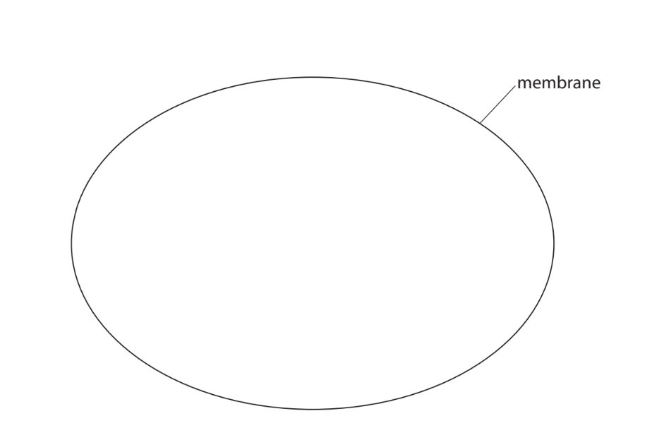

### 1((c)) — 1 mark — command: which — structured — from paper Oct/Nov 2020 · WBI14/01
An absorption spectrum shows how much light is absorbed by chloroplasts at different wavelengths of light.

The table shows the colour of light at four wavelengths.

| **Wavelength of light / nm** | 460 | 520 | 600 | 680 |
|---|---|---|---|---|
| **Colour of light** | blue | green | yellow | red |

Which wavelength of light is absorbed the **least **by chloroplasts?

☐    **A**    460 nm

☐    **B**    520 nm

☐    **C**    600 nm

☐      **D**    680 nm

### 1((d)) — 1 mark — command: state — structured — from paper Oct/Nov 2020 · WBI14/01
State what is meant by the term **action spectrum.**

### 1() — 2 marks — command: multiple — structured — from paper Oct/Nov 2020 · WBI14/01
Chloroplast pigments can be separated and then identified by their Rf values.

(i)  Which process can be used to separate chloroplast pigments?

**(1)**

☐   **A**   chromatography 
☐   **B**   dendrochronology 
☐   **C**   osmosis 
☐    **D  ** PCR

(ii)  The diagram shows separated chloroplast pigments, **J **and** K**.

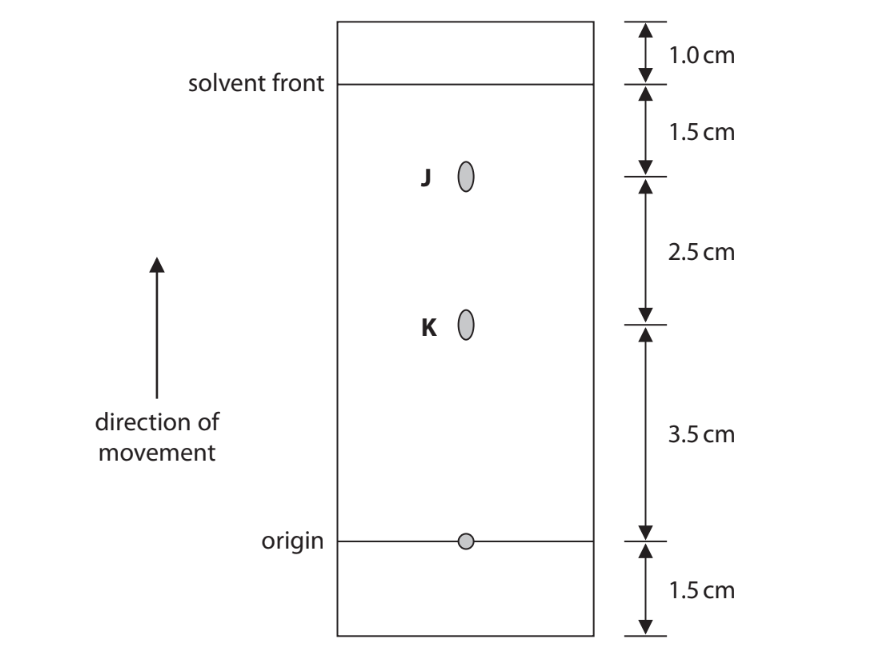

What is the Rf value for chloroplast pigment** J**?

**(1)**

☐   **A**   0.625 
☐   **B**   0.800  
☐   **C**   0.830 
☐   **D**    1.714

## Q2 — medium — 10 marks · exam-questions

### 3() — 5 marks — command: multiple — structured — from paper Oct/Nov 2020 · WBI14/01
The following equation summarises photosynthesis.

6CO2 + 6H2O **⟶** C6H12O6 + 6O2

The diagrams show the bonds in carbon dioxide, water and oxygen.

| carbon dioxide | water | oxygen |
|---|---|---|
| O═C═O | H━O━H | O═O |

Energy is needed to break chemical bonds, and to form new chemical bonds. This is called the bond energy.

The table shows some bond energies for the bonds in carbon dioxide, water, glucose and oxygen.

| **Type of bond** | **Bond energy / kJ per bond** |
|---|---|
| C═O | 785 |
| O━H | 462 |
| O═O | 487 |

(i)  In photolysis, one of the bonds in each water molecule is broken.

Using the equation for photosynthesis, calculate how much energy is released by photolysis in order for one molecule of glucose to be made.

**(1)**

(ii)  Explain how light energy is converted into chemical energy in the form of ATP.

**(4)**

### 3() — 2 marks — command: multiple — structured — from paper Oct/Nov 2020 · WBI14/01
The diagram shows the structure of glucose.

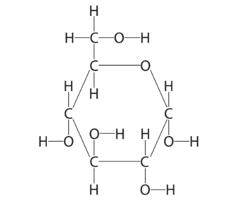

The energy needed to form the bonds in one molecule of glucose is 9164 kJ.

(i)  State what other information is needed in the table of bond energies for this value to be calculated.

**(1)**

(ii)  Where in the chloroplasts are these bonds formed?

**(1)**

☐   **A**   cytoplasm 
☐   **B**    matrix 
☐   **C**    stroma 
☐    **D**    thylakoid membrane

### 3() — 3 marks — command: multiple — structured — from paper Oct/Nov 2020 · WBI14/01
Glucose is used by plants in the production of amino acids.

(i)  Which row of the table describes how two amino acids join together?

**(1)**

|   | **Bond formed between** | **Type of reaction** |
|---|---|---|
| ☐  **A** | carbon and nitrogen | condensation |
| ☐  **B** | carbon and nitrogen | hydrolysis |
| ☐  **C** | oxygen and nitrogen | condensation |
| ☐  **D** | oxygen and nitrogen | hydrolysis |

(ii)  Explain why amino acids cannot be produced from glucose alone.

**(2)**

## Q3 — medium — 13 marks · exam-questions

### 5((a)) — 7 marks — command: multiple — structured — from paper Jan 2021 · WBI14/01
Photosynthesis consists of the light-dependent reactions and the light-independent reactions.

In the light-dependent reactions, light energy is converted into energy stored in ATP.

(i) Explain why light energy is converted into energy stored in ATP.

**(2)**

(ii)  An equation can summarise the production and breakdown of ATP.

Complete this equation, by writing the names of the substrates and the type of reaction on the three dotted lines provided.

**(2)**

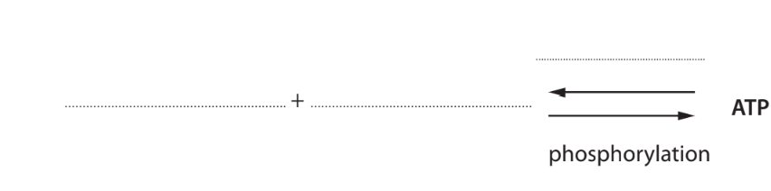

(iii)  Explain the role of light energy in the light-dependent reactions.

**(3)**

### 5((b)) — 6 marks — command: multiple — structured — from paper Jan 2021 · WBI14/01
The light-independent reactions use products of the light-dependent reactions to produce simple sugars.

(i) Which row of the table shows the products of the light-dependent reactions that are used in the light-independent reactions?

|   | **ATP produced by** | **NADP** |
|---|---|---|
| ☐  **A** | cyclic photophosphorylation | oxidised |
| ☐  **B** | cyclic photophosphorylation | reduced |
| ☐  **C** | non-cyclic photophosphorylation | oxidised |
| ☐  **D** | non-cyclic photophosphorylation | reduced |

**(1)**

(ii)  Simple sugars have the formula CnH2nOn.

Name the inorganic molecule from which each element in a simple sugar originated.

**(2)**

(iii)  Simple sugars are used in the synthesis of new biological molecules.

Which row of the table shows the inorganic ions that are needed to synthesise these new biological molecules?

**(3)**

| **New** **biological** **molecule** | **Nitrates** | **Phosphates** | **Both nitrates** **and** **phosphates** | **Neither** **nitrates nor** **phosphates** |
|---|---|---|---|---|
| protein |   |   |   |   |
| RNA |   |   |   |   |
| triglyceride |   |   |   |   |

## Q4 — medium — 9 marks · exam-questions

### 2((a)) — 3 marks — command: contrast — structured — from paper June 2021 · WBI14/01
Chloroplasts and mitochondria are two organelles found in some plant cells.

Compare and contrast the structure of a chloroplast with the structure of a mitochondrion.

### 2() — 6 marks — command: multiple — structured — from paper June 2021 · WBI14/01
The light-dependent reactions of photosynthesis can result in either cyclic or non-cyclic photophosphorylation.

(i)  The diagram shows cyclic photophosphorylation.

Complete the diagram by writing the correct word or words on the dotted lines, labelled D, E, F, G and H.

**(3)**

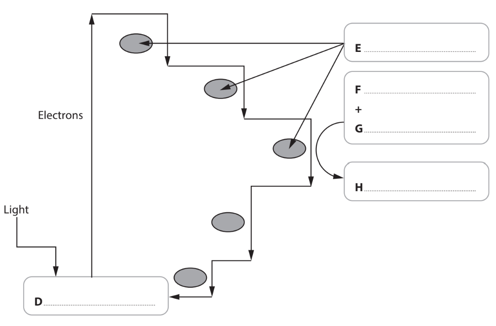

(ii)  Name **one** molecule that is produced in non-cyclic photophosphorylation that is** not** produced in cyclic photophosphorylation.

**(1)**

(iii)  Describe the role of photolysis in non-cyclic photophosphorylation.

**(2)**

## Q5 — medium — 8 marks · exam-questions

### 1() — 6 marks — command: multiple — structured — from paper Oct/Nov 2021 · WBI14/01
The structure of a chloroplast is related to its role in photosynthesis.

The diagram shows a chloroplast.

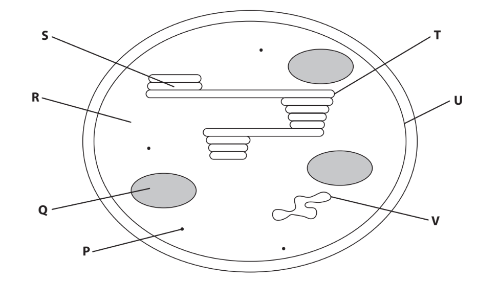

(i) Which row in the table identifies the structures labelled **P**, **Q** and **V**?

**(1)**

|   | **P** | **Q** | **V** |
|---|---|---|---|
| ☐ **A** | DNA | starch grain | ribosome |
| ☐ **B** | starch grain | DNA | ribosome |
| ☐ **C** | starch grain | ribosome | DNA |
| ☐ **D** | ribosome | starch grain | DNA |

(ii) Which structure contains GALP?

**(1)**

☐ **A**   **Q** 
☐ **B**    **R** 
☐ **C**   **U** 
☐ **D**    **V **

(iii) A copy of the printed diagram, set against a ruler scale, has been provided below for your use in this question.

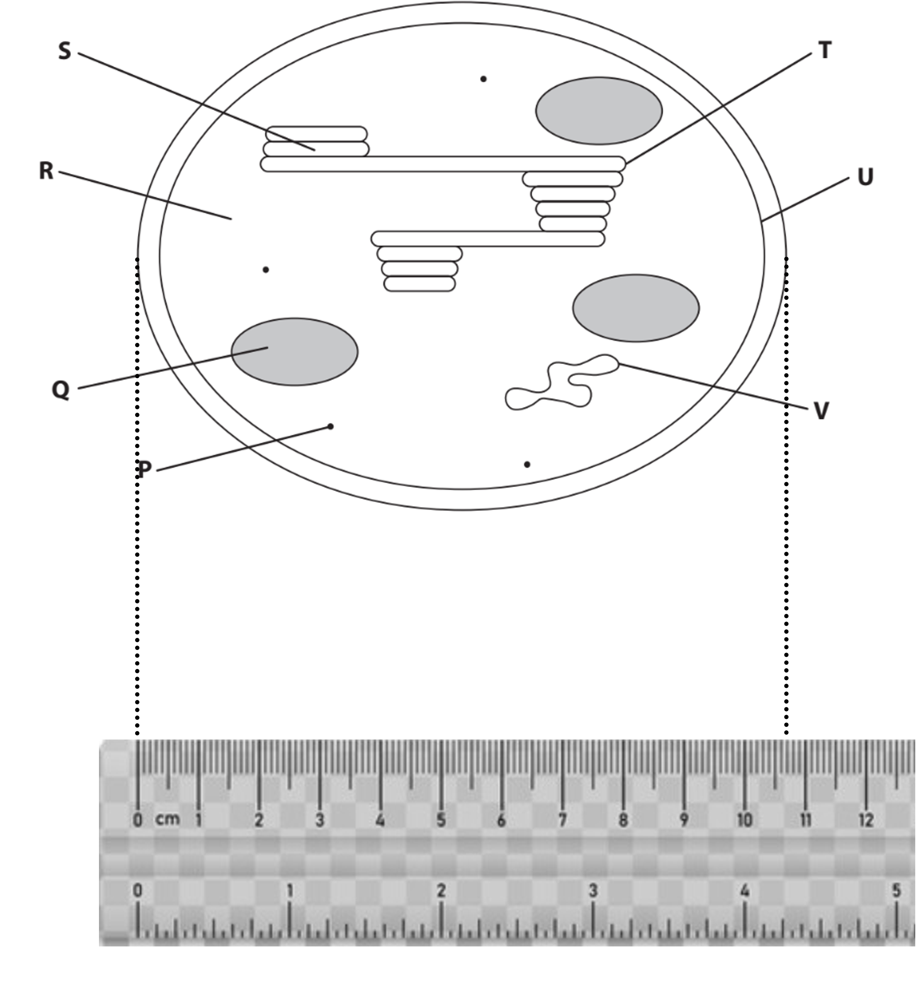

The length of this chloroplast is 7.5 μm.

Calculate the magnification of this diagram.

**(1)**

(iv)

Structures** T** and **U** are membranes.

Compare and contrast the structure of these two membranes.

**(3)**

### 1((b)) — 2 marks — command: describe — structured — from paper Oct/Nov 2021 · WBI14/01
An investigation studied the effect of periods of light and dark on the levels of chloroplast DNA in one species of a single-celled organism.

One group of these organisms, group A, was exposed to 36 hours of continuous light.

The other group of these organisms, group B, was exposed to 12 hours of light, followed by 12 hours of darkness, followed by 12 hours of light.

The graph shows the results of this investigation.

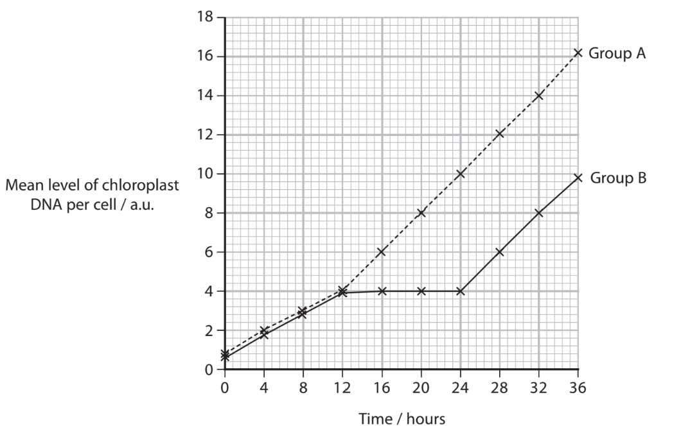

These organisms divide by mitosis followed by cell division, during the dark.

Describe two conclusions that can be made about the replication of chloroplast DNA.

## Q6 — medium — 8 marks · exam-questions

### 2((a)) — 5 marks — command: multiple — structured — from paper Jan 2022 · WBI14/01
Thylakoid membranes contain chloroplast pigments and molecules of ATP synthase.

These membranes are the site of the light‐dependent reactions.

The graph shows the absorption spectrums of two chloroplast pigments from one plant.

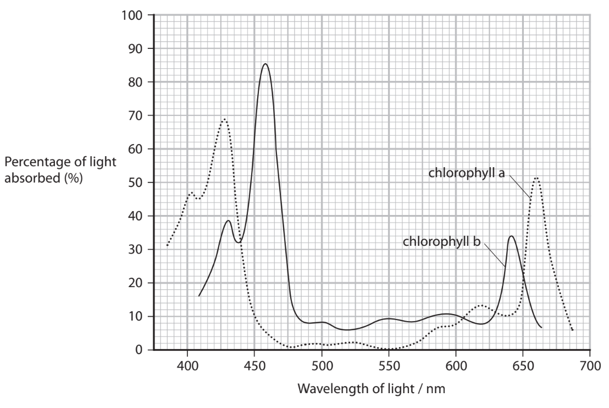

(i) Draw the action spectrum for this plant on the axes below.

**(2)**

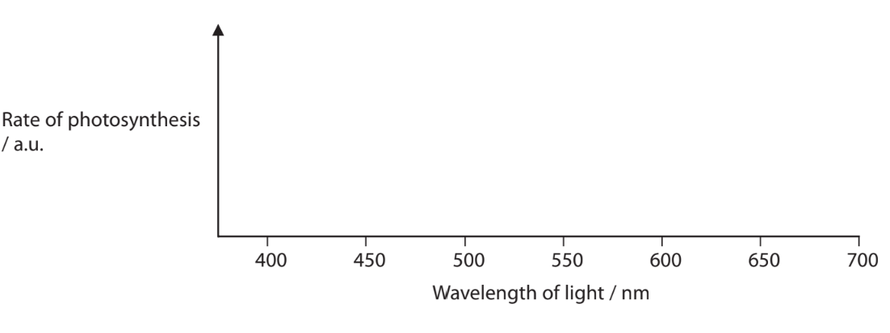

(ii) Calculate how many times greater the percentage of light absorbed by chlorophyll b is than that absorbed by chlorophyll a, at their maximum absorptions.

**(1)**

(iii) Thylakoid membranes contain different types of chlorophyll pigment.

Explain the advantage of this for a plant.

**(2)**

### 2((b)) — 3 marks — command: multiple — structured — from paper Jan 2022 · WBI14/01
The ATP synthase molecules are proteins.

(i)  Which row of the table describes the bonds that form between amino acids in a protein?

**(1)**

|   | **Name of bond** | **Parts of the amino acid that the bond forms between** |
|---|---|---|
| ☐  **A** | peptide | amino group and carboxyl group |
| ☐  **B** | peptide | carboxyl group and R group |
| ☐  **C** | phosphodiester | amino group and carboxyl group |
| ☐  **D** | phosphodiester | carboxyl group and R group |

(ii)  Products of the light‐independent reactions are used to synthesise amino acids.

Describe how plants synthesise amino acids.

**(2)**

## Q7 — medium — 12 marks · exam-questions

### 6((a)) — 2 marks — command: state — structured — from paper Oct/Nov 2021 · WBI14/01
Seaweeds are a group of organisms that carry out photosynthesis.

Identifying the types and proportions of chlorophyll pigments is important in the classification of seaweeds and biodiversity studies.

State the meaning of the term **biodiversity.**

### 6((b)) — 2 marks — command: explain — structured — from paper Oct/Nov 2021 · WBI14/01
Explain the role of chlorophyll in the light-dependent reactions of photosynthesis.

### 6() — 8 marks — command: multiple — structured — from paper Oct/Nov 2021 · WBI14/01
An investigation compared the effectiveness of two solvents, propanone and DMSO, in extracting photosynthetic pigments.

Four species of seaweed were collected from the Indian coast of Tamil Nadu and taken to the laboratory where the species were identified.

Each species of seaweed was split into two samples of equal mass.

The photosynthetic pigments were extracted from each sample using one of the two solvents and their concentrations determined.

The graphs show some of the results of this investigation.

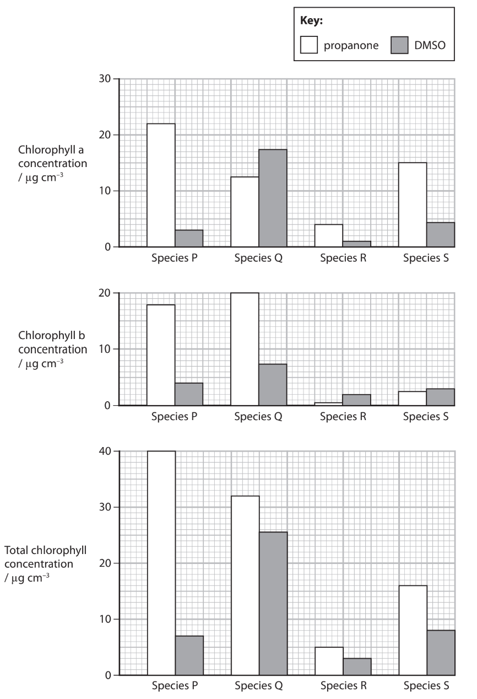

(i) Discuss the effectiveness of these extraction methods in the identification of these species.

Use the information in the graphs to support your answer.

**(6)**

(ii) Suggest why different concentrations of chlorophyll were obtained using these two different solvents.

**(2)**

## Q8 — medium — 13 marks · exam-questions

### 6((a)) — 4 marks — command: multiple — structured — from paper Jan 2022 · WBI14/01
The table gives some information about structures found in chloroplasts.

| **Structure** | **Function** | **Other information** |
|---|---|---|
| P | protein synthesis | some are 20nm in size |
| Q | site of light‐independent reactions | colourless |
| R | compartment for accumulation of hydrogen ions | largest are 4.35×10-4 mm long |
| S | storage granule | 1 to 35μm in size |

(i) Where in the chloroplast is RUBISCO active?

**(1)**

| ☐ | **A** | P |
|---|---|---|
| ☐ | **B** | Q |
| ☐ | **C** | R |
| ☐ | **D** | S |

(ii) What is stored in S?

**(1)**

| ☐ | **A** | GALP |
|---|---|---|
| ☐ | **B** | lipid |
| ☐ | **C** | starch |
| ☐ | **D** | sucrose |

(iii) Where is GP formed?

**(1)**

| ☐ | **A** | P |
|---|---|---|
| ☐ | **B** | Q |
| ☐ | **C** | R |
| ☐ | **D** | S |

(iv) Which is the correct order of size, smallest to largest?

**(1)**

| ☐ | **A** | P R S |
|---|---|---|
| ☐ | **B** | P S R |
| ☐ | **C** | R S P |
| ☐ | **D** | S R P |

### 6((b)) — 9 marks — command: multiple — structured — from paper Jan 2022 · WBI14/01
The graph shows the rate of photosynthesis in two types of plant, *Spartina* and *Leucopoa,* at different temperatures.

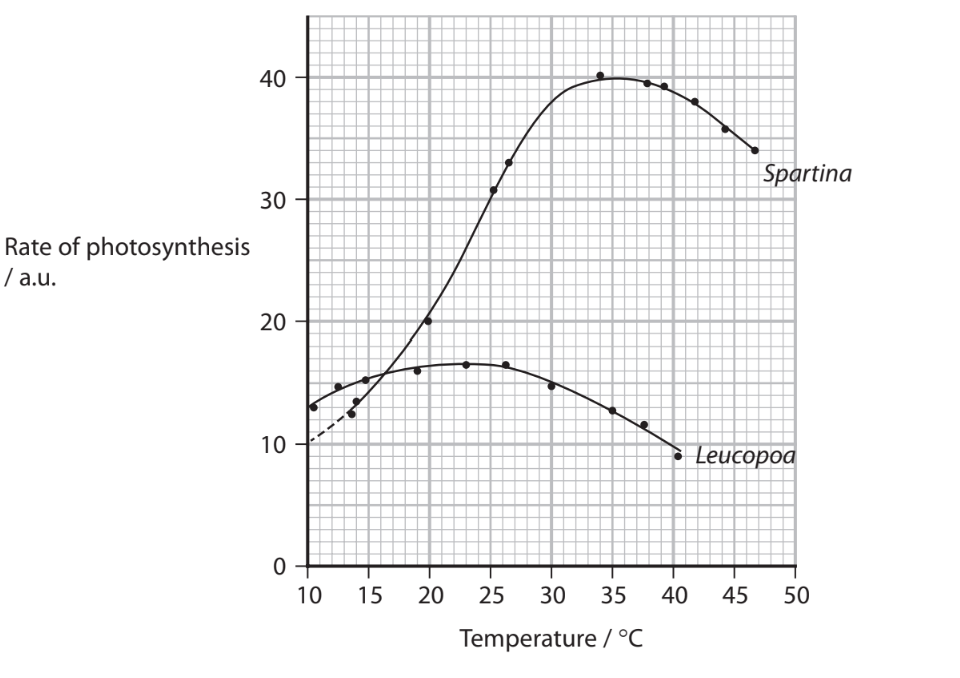

(i)Which could be the units for rate of photosynthesis?

**(1)**

| ☐ | **A** | mg CO2 produced mm-2 hr-1 |
|---|---|---|
| ☐ | **B** | mg CO2 produced mm-1 hr-2 |
| ☐ | **C** | mg CO2 used mm-2 hr-1 |
| ☐ | **D** | mg CO2 used mm-1 hr-2 |

(ii)  Compare and contrast the rate of photosynthesis of these two species of plant, at different temperatures.

**(3)**

(iii) Describe how a Q10 value for the rate of photosynthesis can be calculated, using this graph.

**(2)**

(iv) The graph shows the maximum temperature, for each month, in two regions of North America: Wheatland and Pole Mountain.

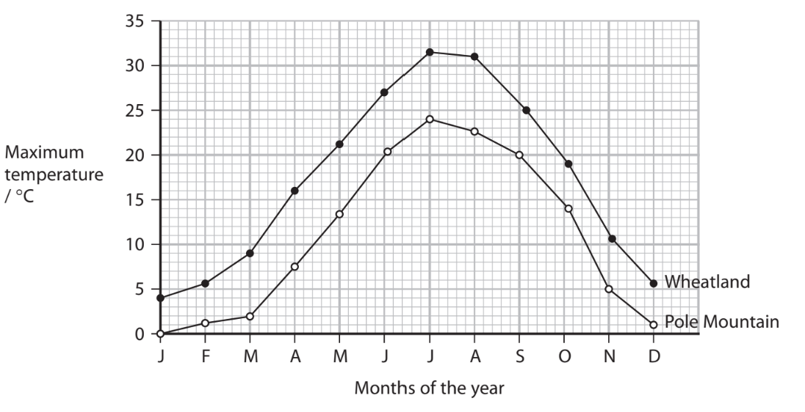

Explain in which of these two regions of North America *Spartina* is most likely to grow.

Use the information in both graphs to support your answer.

**(3)**

## Q9 — easy — 8 marks · exam-questions

### 1() — 1 mark — multiple_choice
A scientist studied energy flow in a salt marsh ecosystem on the east coast of England. Salt marshes are highly productive coastal ecosystems containing plants such as common samphire (*Salicornia europaea*).

Which correctly describes gross primary productivity (GPP) in the salt marsh ecosystem?
- **A.** The total rate at which energy is fixed by photosynthesis per unit area per unit time.
- **B.** The rate at which energy is made available to consumers after producers have respired.
- **C.** The rate at which energy is transferred from producers to primary consumers.
- **D.** The rate at which decomposers break down organic matter in the ecosystem.

### 2() — 3 marks — command: calculate — structured
In one area of the salt marsh, the GPP of *Spartina* was 22 400 kJ m⁻² year⁻¹. Plant respiration accounted for 6720 kJ m⁻² year⁻¹. Primary consumers assimilated 1168 kJ m⁻² year⁻¹.

Calculate the efficiency of energy transfer from *Spartina* to the primary consumers. Give your answer to two significant figures.

### 3() — 2 marks — command: explain — structured
*S. europaea* was grown in laboratory conditions under continuous bright light. The concentration of carbon dioxide supplied to the plant was then suddenly reduced.

Explain the changes in the concentrations of RuBP and GP in the leaves during the first few minutes after this reduction.

### 4() — 1 mark — multiple_choice
Which of the following correctly describes the role of ATP in the chloroplasts of the *S. europaea* plants?
- **A.** ATP provides hydrogen for the reduction of GP in the Calvin cycle.
- **B.** ATP provides the energy to pump hydrogen ions across the thylakoid membrane.
- **C.** ATP is used in the Calvin cycle to convert GP to GALP and to regenerate RuBP.
- **D.** ATP is produced when NADP is reduced in Photosystem I.

### 5() — 1 mark — command: state — structured
State the precise location of the light-independent reactions within the cells of *S. europaea.*
