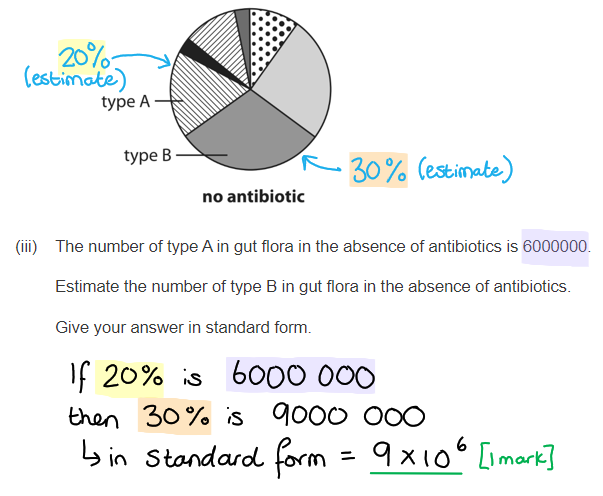

# Mark Schemes — Antibiotics
**6. Microbiology, Immunity & Forensics** · Edexcel International A Level (IAL) Biology (YBI11)

## Q1 — medium — 11 marks · exam-questions

### 2((a)) — 2 marks
An explanation of the use of antibiotics to treat these conditions is...

Any **two **of the following:

- Antibiotics are used to treat impetigo and whooping cough because they are caused by bacteria; **[1 mark]**
- Antibiotics are not always used to treat middle ear infections or sinus infections as they can be caused by viruses / as they are not always caused by bacteria / because some of the bacteria are resistant to antibiotics; **[1 mark]**
- Antibiotics are not used to treat multiple sclerosis or rheumatoid arthritis as they are not caused by bacteria; **[1 mark]**

**[Total: 2 marks]**

> *You should make sure to refer to information in the table in your answer. Any explanation that just describes how antibiotics can treat bacterial infections without referring to the examples in the table cannot gain marks. *

### 2((b)) — 1 marks
(i) The correct answer is **B **because...

**Drug J is not an antibiotic because the number of bacteria increases, drug K is bacteriostatic because the number of bacteria just increases slightly, and drug L is bactericidal because the number of bacteria reduces.**

> *A** is incorrect because bactericidal antibiotics decrease the number of bacteria (the suffix '_cidal' means killing, like homi**cidal**)*

> *C** and **D** are incorrect because antibiotics do not increase the number of bacteria*

**[Total: 1 mark]**

### 2((c)) — 8 marks
(i) The role of gut flora in protecting the body from infection is...

- To compete with (pathogenic) bacteria for nutrients/named nutrient/space (**ignore** food); **[1 mark]**
- So they reduce / destroy / prevent the growth of (pathogenic) bacteria / so that they do not increase in number and cause disease; **[1 mark]**

(ii) Antibiotics can affect gut flora because...

- Because gut flora contain bacteria; **[1 mark]**
- And antibiotics are not (generally) specific to one type of bacteria; **[1 mark]**

> *The gut flora will not be affected by **all **antibiotics.*

(iii) The number of type B in gut flora in the absence of antibiotics is...

- A value between 9×106 and 1.2×107; **[1 mark]**

> *You must make sure that your answer is in standard form, as stated in the question. *

(iv) The effects of antibiotics P, Q and R on gut flora are...

- Antibiotic P kills all but three types / kills four types; **[1 mark] **
- Antibiotic Q only kills two types / results in the presence of a new type / reduces the number of type A and type B; **[1 mark]**
- Antibiotic R has no effect (on gut flora / types A and B); **[1 mark]**

**[Total: 8 marks]**

## Q2 — medium — 7 marks · exam-questions

### 7((b)) — 4 marks
The relationship between the number of aminopenicillin prescriptions issued and the percentage of *E. coli* resistant to aminopenicillin during this one-year period can be explained as follows...

Any **four** of the following**:**

- There is a correlation between the number of prescriptions and the percentage of resistant *E. coli*; **[1 mark]**
- The use of aminopenicillin acts as a selection pressure; **[1 mark]**
- The resistant bacteria reproduce and the non-resistant bacteria die **OR** the resistant bacteria are <u>more</u>** **likely to reproduce / will reproduce <u>more</u>; **[1 mark]**
- The percentage of resistant *E. coli* falls when prescriptions fall **BECAUSE** non-resistant *E. coli* are not destroyed; **[1 mark]**
- The percentage of resistant *E. coli* falls when prescriptions fall **BECAUSE **there is competition between resistant and non-resistant bacteria; **[1 mark]**

***Accept ****'as the number of prescriptions goes up the number of resistant bacteria goes up' OR 'when the number of prescriptions goes down the number of resistant bacteria goes down' for 1 mark if no other marks have been awarded.*

**[Total: 4 marks]**

> *This is a difficult question to score full marks on. The main pitfall to avoid is to merely describe the data shown in the graph rather than** explaining** as the question requires.*

> *Marking point 2 on selection pressures is an important feature of the understanding of antibiotic resistance; **humans create the selection pressure** by flooding bacteria with antibiotics, causing resistant bacteria to survive and non-resistant bacteria to die out. *

### 7((c)) — 3 marks
The results of the survey are a cause for concern because...

Any **three** of the following**:**

- Codes of practice / medical advice (regarding the prescription of antibiotics) are being ignored; **[1 mark]**
- The use of antibiotics is a selection pressure; **[1 mark]**
- The number of antibiotic resistant bacteria is increasing; **[1 mark]**
- Our (current) antibiotics may become useless and people will remain ill / die **OR** there is an evolutionary race between bacteria and the ability of humans to develop new antibiotics **OR** natural bacterial flora (such as the gut flora) are destroyed by antibiotics; **[1 mark]**

**[Total: 3 marks]**

> *Because the command word in this question is '**explain**', your answer should do just that. You may be tempted to just paraphrase the information in the question as a description of the data and trends, but that will score zero without further explanation. *
