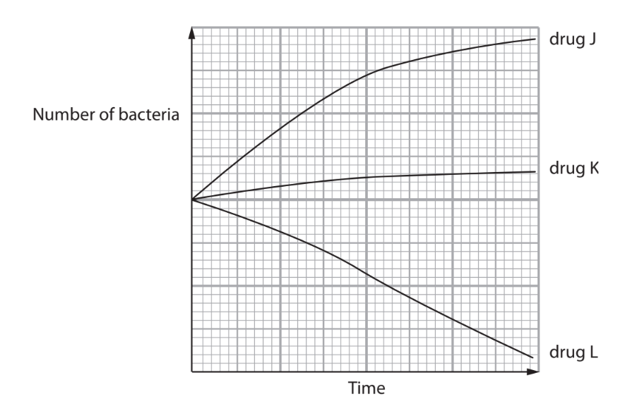
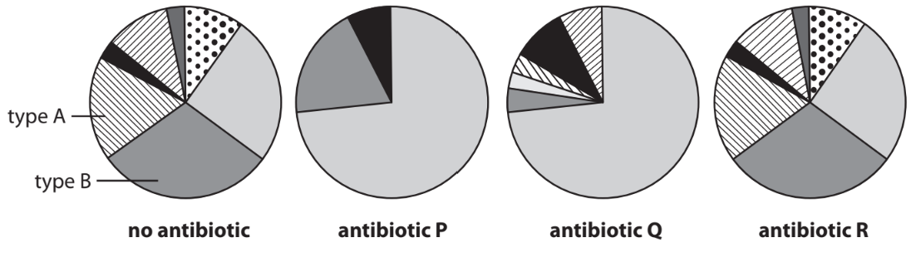
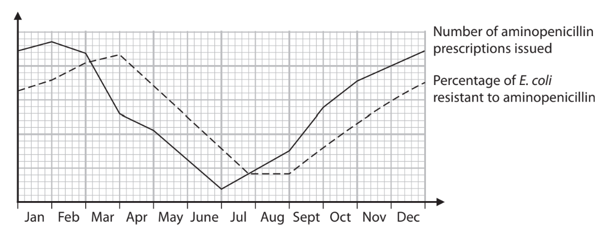

# Exam Questions — Antibiotics
**6. Microbiology, Immunity & Forensics** · Edexcel International A Level (IAL) Biology (YBI11)
> Source: [https://www.savemyexams.com/international-a-level/biology/edexcel/18/topic-questions/6-microbiology-immunity-and-forensics/antibiotics/exam-questions/](https://www.savemyexams.com/international-a-level/biology/edexcel/18/topic-questions/6-microbiology-immunity-and-forensics/antibiotics/exam-questions/) · 2 questions · total 18 marks

## Q1 — medium — 11 marks · exam-questions

### 2((a)) — 2 marks — command: explain — structured — from paper Jan 2021 · WBI14/01
Antibiotics are medicines used to treat some medical conditions.

The table shows some medical conditions and whether or not antibiotics are needed to treat the condition.

| **Medical condition** | **Are antibiotics needed** **to treat the condition?** |
|---|---|
| Impetigo | yes |
| Whooping cough | yes |
| Middle ear infections | sometimes |
| Sinus infections | sometimes |
| Multiple sclerosis | no |
| Rheumatoid arthritis | no |

Explain the use of antibiotics to treat these conditions.

### 2((b)) — 1 mark — command: which — structured — from paper Jan 2021 · WBI14/01
The graph shows the effect of three drugs, J, K and L, on the number of bacteria in a culture.

Which row of the table describes each of these three drugs?

|   | **drug J** | **drug K** | **drug L** |
|---|---|---|---|
| ☐  **A** | not an antibiotic | bactericidal antibiotic | bacteriostatic antibiotic |
| ☐  **B** | not an antibiotic | bacteriostatic antibiotic | bactericidal antibiotic |
| ☐  **C** | bactericidal antibiotic | not an antibiotic | bacteriostatic antibiotic |
| ☐  **D** | bacteriostatic antibiotic | not an antibiotic | bactericidal antibiotic |

### 2((c)) — 8 marks — command: multiple — structured — from paper Jan 2021 · WBI14/01
One problem of taking antibiotics is their effect on gut flora.

The diagrams show the effects of three antibiotics, P, Q and R, on the proportion of different types of gut flora.

Each section in each of the diagrams represents a different type of gut flora.

(i)  Explain the role of gut flora in protecting the body from infection.

**(2)**

(ii)  Explain why antibiotics can affect gut flora.

**(2)**

(iii)  The number of type A in gut flora in the absence of antibiotics is 6 000 000.

Estimate the number of type B in gut flora in the absence of antibiotics.

Give your answer in standard form.

**(1)**

(iv)  Deduce the effects of antibiotics P, Q and R on gut flora.

**(3)**

## Q2 — medium — 7 marks · exam-questions

### 7((b)) — 4 marks — command: explain — structured — from paper Oct/Nov 2020 · WBI14/01
The graph shows the number of prescriptions of the antibiotic, aminopenicillin, issued in one year.

The graph also shows the percentage of *E. coli* bacteria that were resistant to aminopenicillin during the same year.

Explain the relationship between the number of aminopenicillin prescriptions issued and the percentage of *E. coli* resistant to aminopenicillin during this one-year period.

Use the information in the graph to support your answer.

### 7((c)) — 3 marks — command: explain — structured — from paper Oct/Nov 2020 · WBI14/01
The results of a survey are shown in the diagram.

Explain why the results of this survey are a cause for concern.
