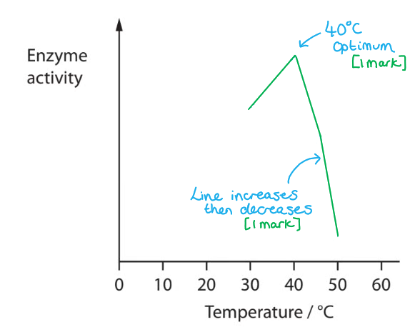
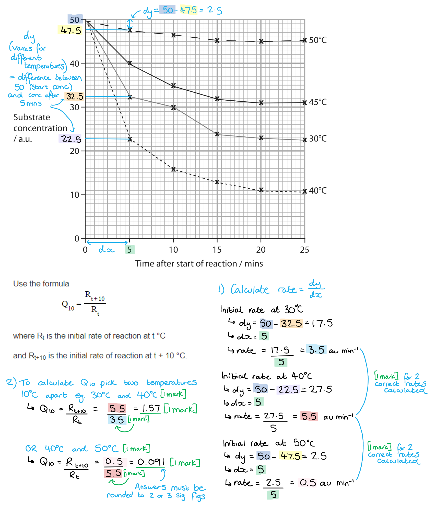
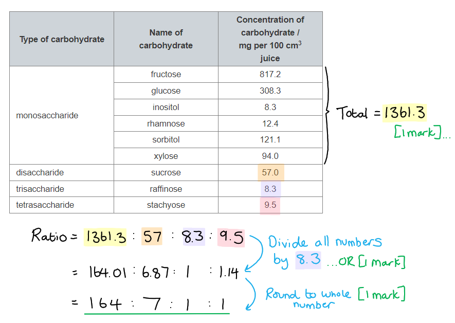
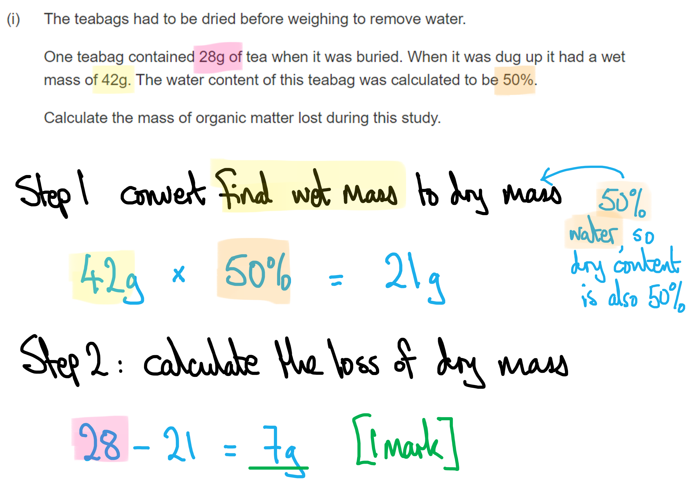
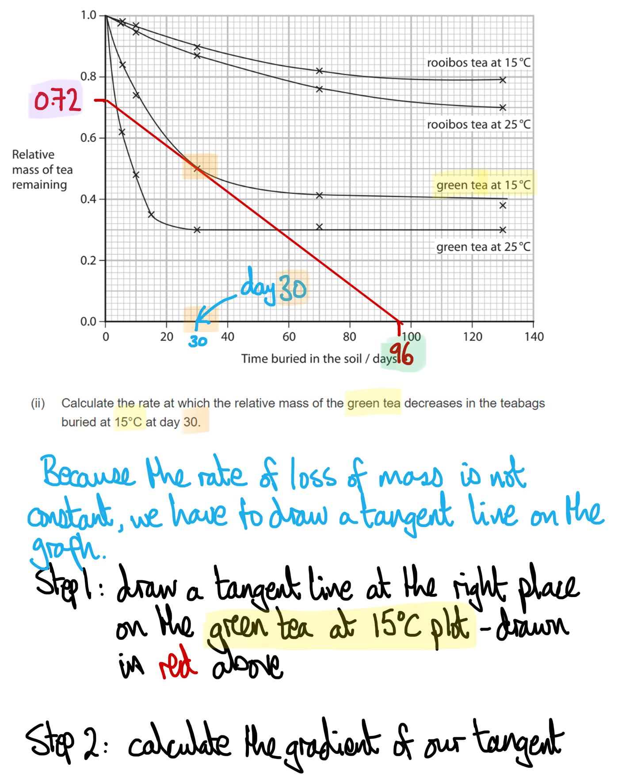
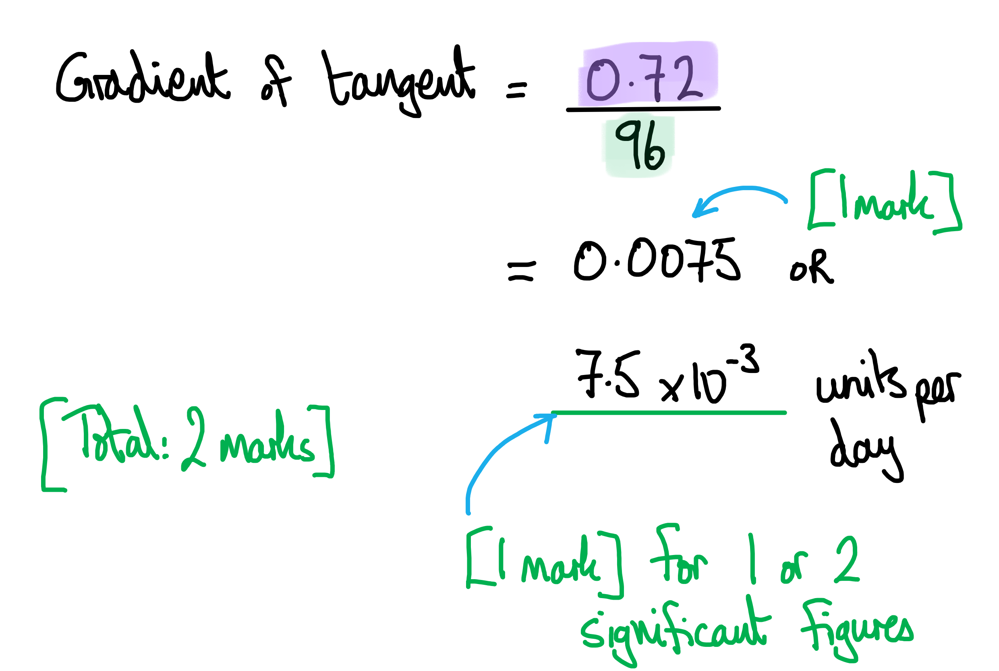

# Mark Schemes — Decomposition & Decay
**6. Microbiology, Immunity & Forensics** · Edexcel International A Level (IAL) Biology (YBI11)

## Q1 — medium — 15 marks · exam-questions

### 8((a)) — 6 marks
(i) The sketch should appear as follows...

- Linear line that increases with temperature and then decreases; **[1 mark]**
- Optimum temperature shown at (about) 40 °C; **[1 mark]**

> *Make sure to refer to the data in the graph in the question. You're given data for 30°C, 40°C, 45°C, and 50°C so you can use that data in your sketch. *

(ii) The calculation of Q10 should be...

- Values at 30 °C and 40 °C chosen: 50 and 32.5 and 50 and 22.5; **[1 mark]**
- Rate calculated per minute for each: (50-32.5) ÷ 5 / 17.5 ÷ 5 / 3.5 and (50-22.5) ÷ 5 / 27.5 ÷ 5 / 5.5; **[1 mark]**
- Numbers substituted into equation: 5.5 ÷ 3.5 / 1.5714; **[1 mark]**
- Correct answer to 2 / 3 sig figs with no units: 1.6 / 1.57; **[1 mark]**

**OR**

- Values at 40 °C and 50 °C chosen: 50 and 22.5 and 50 and 47.5; **[1 mark]**
- Rate calculated per minute for each: (50-22.5) ÷ 5 / 27.5 ÷ 5 / 5.5 and (50-47.5) ÷ 2.5 / 2.5 ÷ 5 / 0.5; **[1 mark]**
- Numbers substituted into equation: 0.5 ÷5.5 / 0.090909; **[1 mark]**
- Correct answer to 2 / 3 sig figs with no units: 0.091 / 0.0909; **[1 mark]**

**[Total: 6 marks]**

### 8((b)) — 9 marks
(i) The completed table should appear as follows...

- Mass of monosaccharides calculated to be 1361.3 / correct ratios expressed with more than one dp; **[1 mark]**
- Ratios shown correctly as either (all) whole numbers or both disaccharide and tetrasaccharide values correctly rounded to one dp; **[1 mark]**

| **Type of carbohydrate** | **Ratio** |
|---|---|
| monosaccharide | 164 |
| disaccharide | 7 |
| trisaccharide | 1 |
| tetrasaccharide | 1 |

> *When you have a calculation that requires you to type in lots of numbers at once, make sure to check your calculation twice because there is a risk small mistakes can slip through if you're rushing in an exam setting. *

(ii) The correct answer is **D **because...

**Sucrose is the median concentration (there are four larger values and four smaller values in the table) and raffinose is the modal concentration (it has the same concentration as inositol).**

> *A**,** B **and** C **are incorrect because inositol and raffinose have the modal concentration.*

(iii) The role of decomposition in returning the carbon present in the carbohydrates in the quince fruit back into the atmosphere is...

> *This is a level-marked question, meaning that this is is marked **according to the levels table**. The indicative content points below the table are **not** to be used in the usual '**one point one mark**' way, but should be used together with the levels table to determine the number of marks which should be awarded. *

| **Level 1** Points from the category **general description of decomposition**  **[1 mark]** - One point made (from general description category only)  **[2 marks]** - Three points made (from general description category only) |
|---|
| **Level 2** In addition to a level 1 answer, points are made from the category **details about decomposition of carbohydrates**  **[3 marks]** - Two points made  **[4 marks]** - Three points made |
| **Level 3 **In addition to a level 2 answer, points from the category **specific** **details relating to carbohydrates in the table **<u>and</u> mention of respiration releasing carbon dioxide  **[5 marks]** - Specific detail given for either di / tri / tetra saccharides  **[6 marks]** - Specific detail given for two of the three types of saccharides |

*Indicative content:*

**General description**

- Bacteria and fungi are decomposers
- Decomposers release enzymes for decomposition
- Digested molecules are absorbed into the decomposer
- And release carbon dioxide

**Details of decomposition of carbohydrates**

- Carbohydrases are needed to breakdown carbohydrates
- Hydrolysis of glycosidic bonds occurs
- To form monosaccharides
- Monosaccharides are taken up by diffusion
- Glucose is used in respiration
- Carbon dioxide is produced by respiration of glucose

**Specific detail relating to carbohydrates in the table**

- One glycosidic bond is broken in disaccharides, two in trisaccharides, three in tetrasaccharides
- Using one / two / three water molecules
- Eg. sucrose is broken down into glucose and fructose
- Monosaccharides do not need breaking down

**[Total: 9 marks]**

## Q2 — medium — 13 marks · exam-questions

### 7() — 9 marks
(i) The mass of organic matter lost during this study is calculated as follows...

- 7 (g); **[1 mark]**

(ii) The rate at which the relative mass of the green tea decreases in the teabags buried at 15 °C at day 30 is as follows...

- (Any value in the range of) 0.005 - 0.0083; **[1 mark]**
- Given to 1 or 2 significant figures, e.g. 0.0075; **[1 mark]**

***Accept ****answers in correct standard form to 1 or 2 significant figures e.g. 7.5 × 10**-3*

*Full marks can be awarded for the correct answer in the absence of other calculations.*

> *Calculation of a rate from a curved graph requires you to draw a tangent (with a ruler!), and then measure the gradient of that tangent. The rate of change of mass varies over time, so the tangent allows you to calculate the rate at a particular point on the curve, in this case **at 30 days**.*

> *At the risk of being repetitive; ALWAYS work out how many significant figures or decimal places are appropriate to use in their your answer; basically **use the same number of, or fewer, significant figures** than the raw data in the question. *

(iii) The difference in the decrease in relative mass of green tea in teabags buried at 15 °C and 25 °C can be explained as follows...

Any **four **of the following:

- Decomposition / breakdown of organic matter is faster at 25 °C; **[1 mark]**
- Enzymes work faster / move faster / have more kinetic energy at warmer temperatures **OR** there are more bacteria present at warmer temperatures; **[1 mark]**
- There are more (frequent / energetic) enzyme-substrate collisions; **[1 mark]**
- Loss of mass is due to release of carbon dioxide; **[1 mark]**
- (Carbon dioxide is lost during) respiration of the decomposers / bacteria / fungi; **[1 mark]**

(a) (iv) The rate of decomposition of green tea was different from that of rooibos tea because...

Any **pair of points **from the following:

- The teas may be composed of different molecules **OR** may have a different surface area for decomposers to access; **[1 mark]**
- Some molecules cannot be broken down as easily / are less accessible to the enzymes (in rooibos); **[1 mark]**

**OR**

- The pH (in the teabag) may be different; **[1 mark]**
- Enzymes (of the bacteria) are less active (in rooibos); **[1 mark]**

**OR**

- There are (higher concentrations of) inhibitors / antimicrobials / toxins in rooibos; **[1 mark]**
- Enzyme activity is inhibited **OR** decomposers are killed; **[1 mark]**

***Ignore**** different masses of organic matter in the different teas.*

**[Total: 9 marks]**

### 7() — 4 marks
(i) Each point on the graph has both a horizontal and a vertical error bar plotted with it because...

- Both the decomposition rate and S/stabilisation factor/carbon stored are mean/average values; **[1 mark]**

(ii) The ecosystems which should be conserved to have the greatest impact on climate change are...

Any **three** of the following:

- Number 6/loamy desert (and 3/birch / 5/sandy desert); **[1 mark]**
- (6) has the highest S value **AND** the lowest decomposition rate; **[1 mark]**
- More carbon is retained (in the soil) **AND** less carbon/carbon dioxide is released into the air; **[1 mark]**
- Less carbon dioxide (in the atmosphere) will lead to less global warming / a reduced greenhouse effect; **[1 mark]**

**OR**

Any **three** of the following:

- Number 6/loamy desert (and 3 / birch / 5 / sandy desert); **[1 mark]**
- (6) has the highest S value **THEREFORE** more carbon is retained (in the soil); **[1 mark]**
- (6) has the lowest decomposition rate **THEREFORE** less carbon/carbon dioxide is released; **[1 mark]**
- Less carbon dioxide (in the atmosphere) will lead to less global warming / a reduced greenhouse effect; **[1 mark]**

***Reject**** 'carbon dioxide is retained in the soil' for marking point 2 (option 1) or marking point 3 (option 2).*
