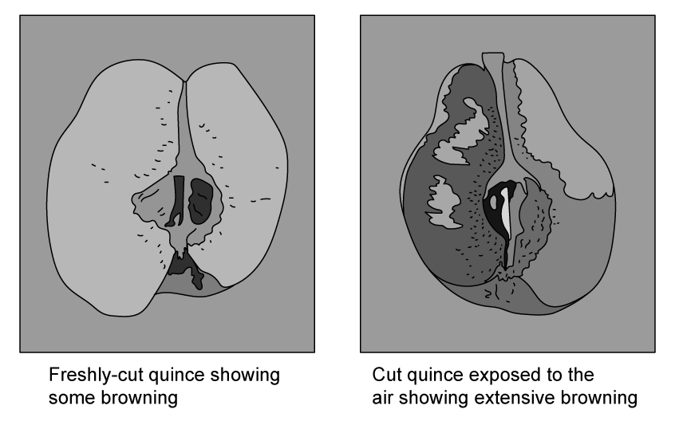
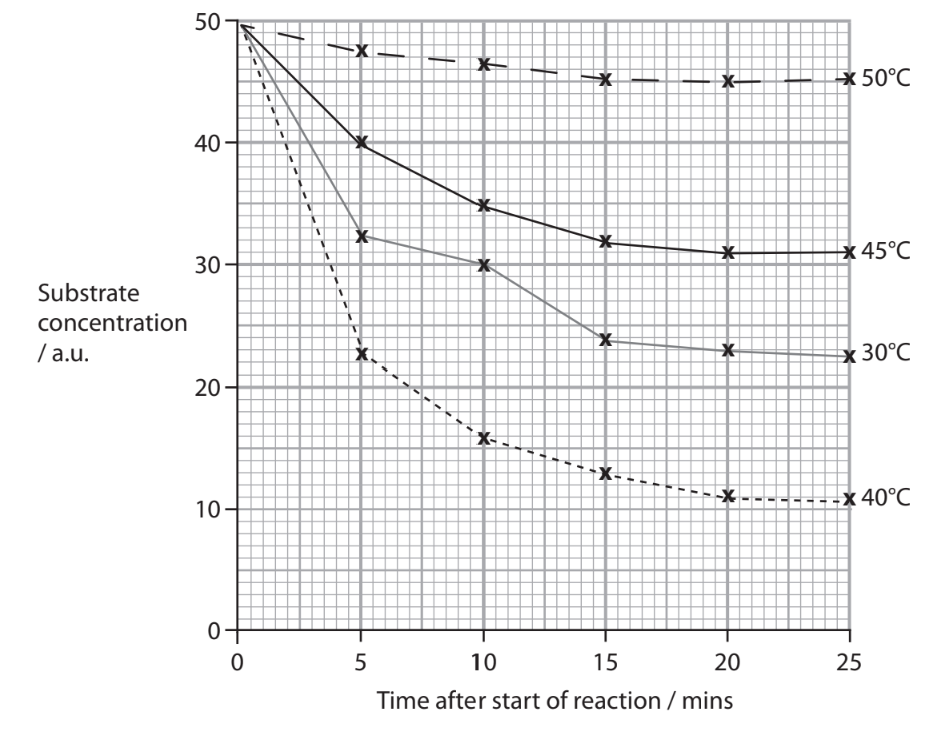
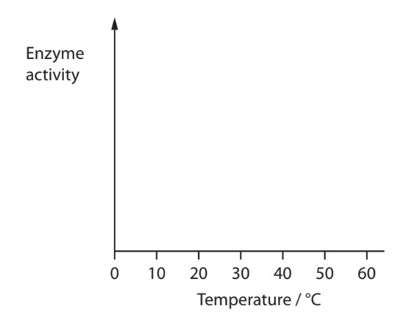
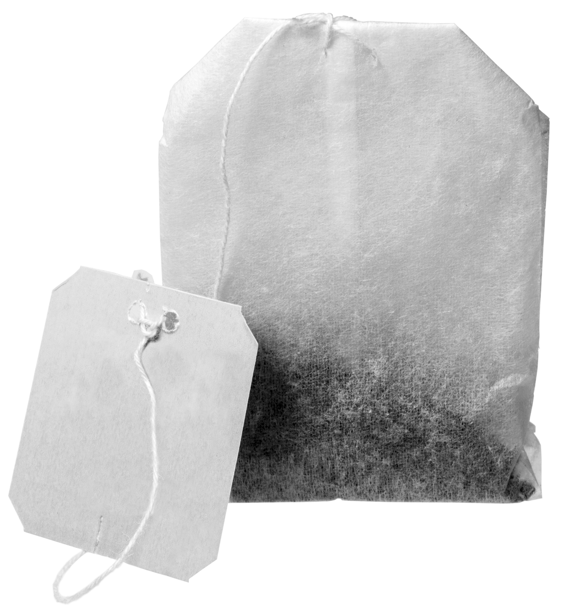
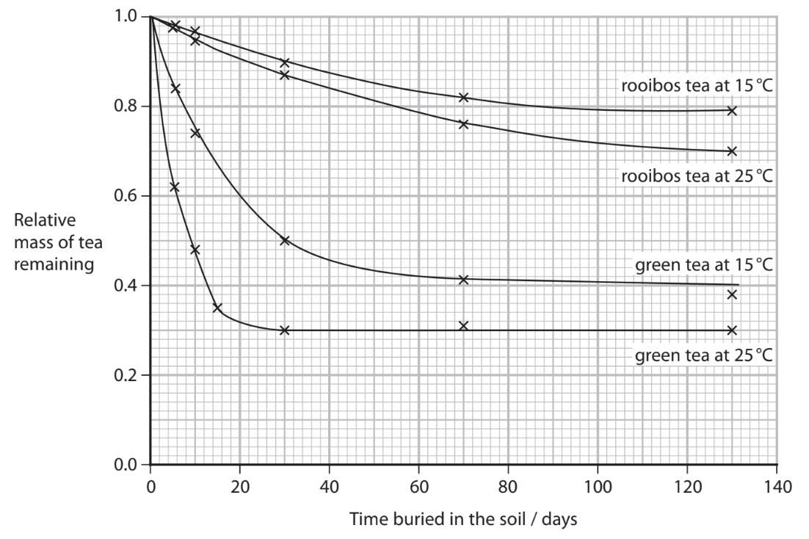
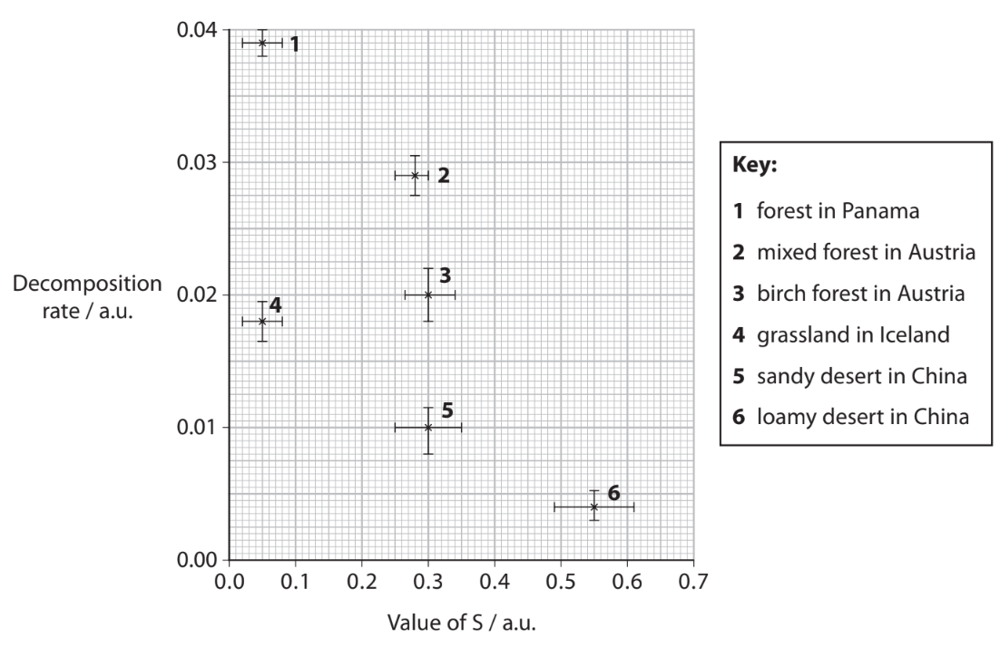

# Exam Questions — Decomposition & Decay
**6. Microbiology, Immunity & Forensics** · Edexcel International A Level (IAL) Biology (YBI11)
> Source: [https://www.savemyexams.com/international-a-level/biology/edexcel/18/topic-questions/6-microbiology-immunity-and-forensics/decomposition-and-decay/exam-questions/](https://www.savemyexams.com/international-a-level/biology/edexcel/18/topic-questions/6-microbiology-immunity-and-forensics/decomposition-and-decay/exam-questions/) · 2 questions · total 28 marks

## Q1 — medium — 15 marks · exam-questions

### 8((a)) — 6 marks — command: multiple — structured — from paper Jan 2021 · WBI14/01
Quince are fruit that grow on trees.

When a quince falls from the tree, two processes take place: browning and decomposition.

Browning takes place when the fruit is cut and exposed to the air. The browning is catalysed by the enzyme polyphenol oxidase (PPO).

The photographs show browning in a quince cut in half.

Activity of the enzyme PPO at different temperatures was investigated.

The graph shows the results of this investigation.

(i)  Sketch the graph for enzyme activity plotted against temperature for this enzyme.

Use the data from this investigation.

**(2)**

(ii)  Calculate the Q10 for this enzyme, using the data from this investigation, shown in the first graph.

Use the formula

$Q_{10}=\frac{R_{t+10}}{R_{t}}$

where Rt is the initial rate of reaction at t °C

and Rt+10 is the initial rate of reaction at t + 10 °C.

**(4)**

### 8((b)) — 9 marks — command: multiple — structured — from paper Jan 2021 · WBI14/01
A quince fruit is made up of cells and contains a lot of juice.

The table shows the composition of carbohydrates in the juice of one species of quince.

| **Type of carbohydrate** | **Name of** **carbohydrate** | **Concentration of carbohydrate /** **mg per 100 cm****3 ****juice** |
|---|---|---|
| monosaccharide | fructose | 817.2 |
| glucose | 308.3 |   |
| inositol | 8.3 |   |
| rhamnose | 12.4 |   |
| sorbitol | 121.1 |   |
| xylose | 94.0 |   |
| disaccharide | sucrose | 57.0 |
| trisaccharide | raffinose | 8.3 |
| tetrasaccharide | stachyose | 9.5 |

(i)  Complete the table to show the ratio of the concentrations of the four types of carbohydrate.

**(2)**

| **Type of carbohydrate** | **Ratio** |
|---|---|
| monosaccharide |   |
| disaccharide |   |
| trisaccharide |   |
| tetrasaccharide |   |

(ii)  Which row of the table shows the carbohydrates with the median concentration and modal concentration in quince juice?

**(1)**

|   | **Median** | **Mode** |
|---|---|---|
| ☐ **A** | raffinose | fructose |
| ☐ **B** | raffinose | sucrose |
| ☐ **C** | sucrose | fructose |
| ☐ **D** | sucrose | raffinose |

(iii)  Explain the role of decomposition in returning the carbon present in the carbohydrates in the quince fruit back into the atmosphere.

Use the information given in part (b) to support your answer.

**(6)**

## Q2 — medium — 13 marks · exam-questions

### 7() — 9 marks — command: multiple — structured — from paper Oct/Nov 2021 · WBI14/01
Climate change is dependent on the balance of carbon released into the atmosphere and carbon removed from the atmosphere.

Some ecosystems are better than others at storing carbon in their soil, releasing less back into the atmosphere.

Conserving these ecosystems could be an important way of reducing climate change.

One study investigated the extent of decomposition in different ecosystems.

This study used tea in teabags as the source of organic matter for decomposition.

The photograph shows a teabag.

Jan Mesaros https://pixabay.com/users/humusak-137455/, CC0, via Wikimedia Commons

The first part of the study was carried out in a laboratory.

Two types of tea were used, green tea and rooibos tea.

A number of unused teabags containing each type of tea were buried in soil at two different temperatures, 15 °C and 25 °C.

The mass of tea in each teabag had been determined before they were buried.

At regular intervals teabags were dug up, dried, and the remaining tea reweighed.

The graph shows the results of this study.

(i) The teabags had to be dried before weighing to remove water.

One teabag contained 28 g of tea when it was buried. When it was dug up it had a wet mass of 42 g. The water content of this teabag was calculated to be 50 %.

Calculate the mass of organic matter lost during this study.

**(1)**

(ii) Calculate the rate at which the relative mass of the green tea decreases in the teabags buried at 15 °C at day 30.

**(2)**

(iii)  Explain the difference in the decrease in relative mass of green tea in teabags buried at 15 °C and 25 °C.

Use the information in the graph to support your answer.

**(4)**

(iv) Suggest why the rate of decomposition of green tea was different from that of rooibos tea.

**(2)**

### 7() — 4 marks — command: multiple — structured — from paper Oct/Nov 2021 · WBI14/01
In the second part of this study, several teabags were buried in different ecosystems.

The teabags were left buried for three months and then dug up.

A number of measurements were taken from the tea in these teabags and the mean decomposition rate and the mean stabilisation factor (S) calculated.

The higher the value of S, the more carbon is stored in the ecosystem.

The graph shows some of the results from this study.

(i)  Suggest why each point on the graph has both a horizontal and a vertical error bar plotted with it.

**(1)**

(ii)  Explain which ecosystems should be conserved to have the greatest impact on climate change.

Use the information in the graph to support your answer.

**(3)**
