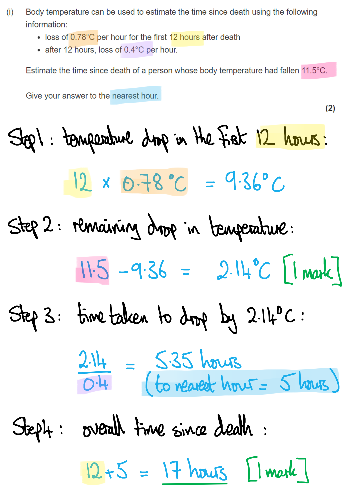
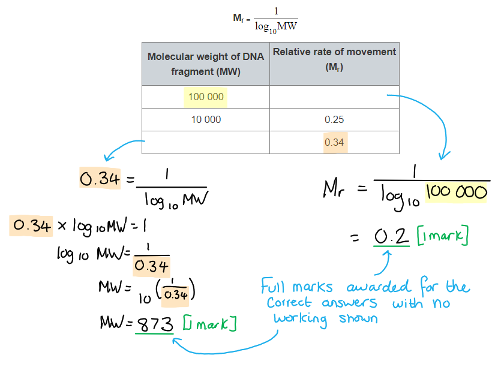
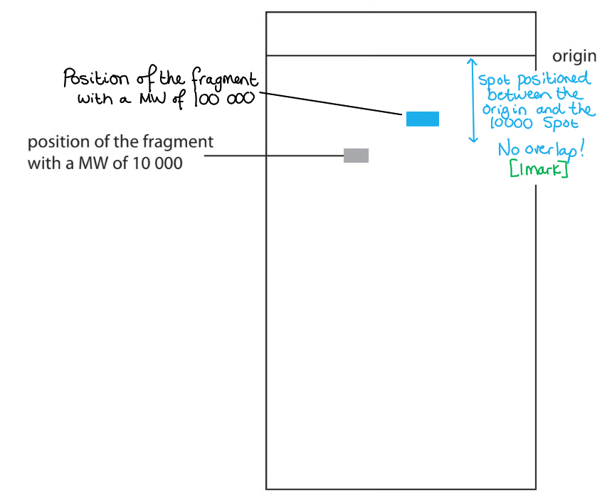
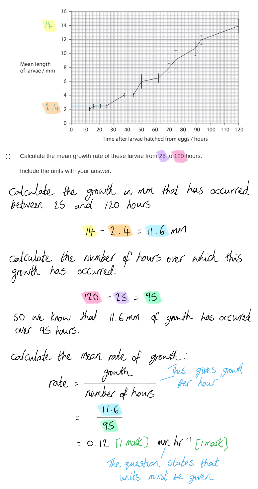
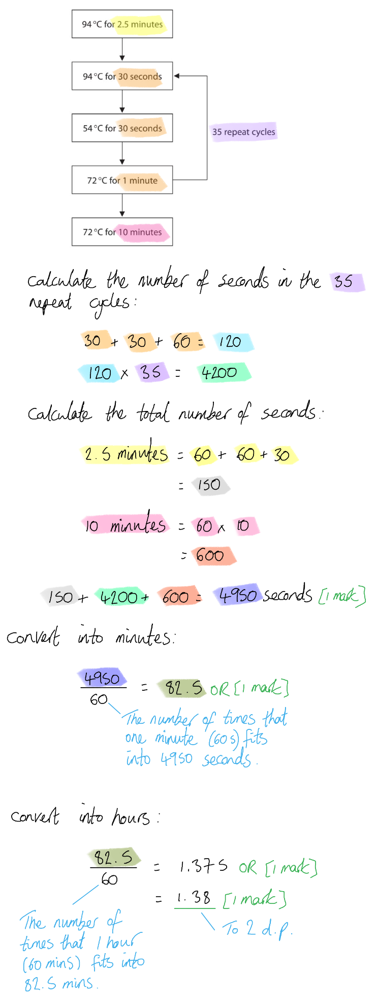
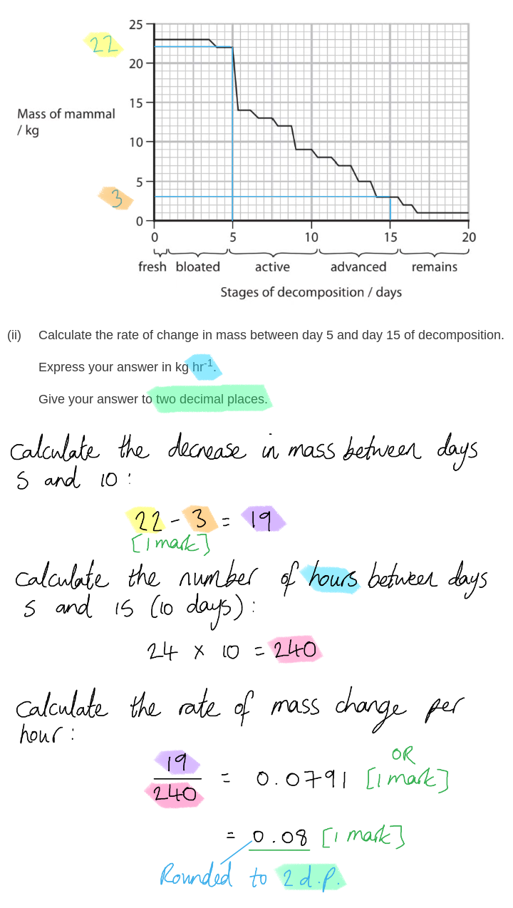

# Mark Schemes — Forensics
**6. Microbiology, Immunity & Forensics** · Edexcel International A Level (IAL) Biology (YBI11)

## Q1 — medium — 8 marks · exam-questions

### 2((a)) — 1 marks
The temperature of a dead body should be measured as follows...

- Using a thermometer/(temperature) probe to take the temperature of the liver / rectum / in the core/deep in the body / in the anus; **[1 mark]**

***Ignore**** other parts of the body e.g. mouth, armpit*

**[Total: 1 mark]**

### 2() — 4 marks
(i) The time since death of a person whose body temperature had fallen is...

- 11.5 - (0.78 x 12) / 11.5 - 9.36 / 2.14 (°C); **[1 mark]**
- 17 hours; **[1 mark]**

*Award 1 mark for 17.35 hours if no other marks have been gained.*

*Correct answer with no working gains full marks.*

> *Always check back to the question to ensure you are stating your final answer to the right level of precision; a question often tells you how precise to make your answer. In this case, it's a **whole number **of hours that is required. *

> *Note that 17.35 hours is NOT the same as 17 hours 35 minutes 0.35 is a decimal number which works out to 0.35 hours = 0.35 × 60 = 21 minutes*

> *Therefore, 17.35 hours = 17 hours 21 minutes, which is of course **less than **17**1**/**2** (or 17.5) hours, so the number of hours should be rounded **down** to 17, not up to 18.*

(ii) This estimate would be different if the body had been left in a colder place because...

- (The new) estimate would (need to) be shorter **OR** (the previous estimate from part i) would be an overestimate/too long; **[1 mark]**
- (Because) a body loses heat faster in cooler conditions **OR** because a body loses heat more slowly in warmer conditions; **[1 mark]**

**[Total: 4 marks]**

### 2((c)) — 3 marks
Using body stiffness only, as shown in the table, is insufficient to estimate the time since death accurately because...

Any **three** of the following:

- Temperature affects rigor / body stiffness **OR** exercise / body shape/body fat / ATP levels may vary from person to person (before death) and will affect body stiffness; **[1 mark]**
- Because deciding whether a body is stiff or not is subjective / depends on the opinion of the person measuring; **[1 mark]**
- Because if the body is stiff the time since death can only be estimated as being between 3 and 36 hours / there is a wide range of possible time values since death; **[1 mark]**
- Because if the body is not stiff there is no way of telling if death was less than 3 hours ago or more than 36 hours ago / we cannot tell how far beyond 36 hours ago time of death was; **[1 mark]**

**[Total: 3 marks]**

## Q2 — medium — 12 marks · exam-questions

### 7((a)) — 4 marks
(i) The correct answer is **C **because...

**Restriction enzymes cut DNA**

> *A** is incorrect because DNA polymerase is used to synthesise DNA*

> *B** is incorrect because integrase inserts DNA into other DNA*

> *D** is incorrect because reverse transcriptase synthesises DNA using an RNA template*

(ii) The enzyme results in different length DNA fragments because...

Any **three **of the following:

- Because restriction enzymes recognise specific (base) sequences / different enzymes cut at different sites; **[1 mark]**
- Because these recognition sites are not equally spaced along the DNA / different cutting sites will result in different length fragments; **[1 mark]**
- The enzyme hydrolyses/breaks the phosphodiester bonds; **[1 mark]**
- Therefore different sized fragments move different distances/speeds through the gel; **[1 mark]**

**Final answer:** **[Total: 4 marks] **

### 7((b)) — 3 marks
(i) The table should include the following...

- Relative rate of movement when MW of DNA is 100 000 = 0.2; **[1 mark]**
- MW of DNA when relative rate of movement is 0.34 = 794 / 871 / 873 / 1000; **[1 mark]**

(ii) The completed diagram should appear as follows...

- Indication of spot positioned between the origin and the 10 000 spot; **[1 mark]**

**[Total: 3 marks]**

### 7((c)) — 1 marks
The fragments move more slowly through a higher concentration of gel because...

- More molecules/bonds / smaller/fewer spaces, so higher resistance/friction; **[1 mark]**

**[Total: 1 mark]**

> *If the molecules in the gel are more tightly packed together it will leave less space for the DNA fragments to move through, resulting a more friction and a slower rate of movement. *

### 7((d)) — 4 marks
(i) Two examples of circular DNA found in cells are...

Any **two **of the following:

- Bacterial genome/chromosome / (bacterial) nucleoid; **[1 mark]**
- Plasmid; **[1 mark]**
- In mitochondria / mitochondrial DNA / mtDNA; **[1 mark]**
- In chloroplasts / chloroplast DNA / cpDNA; **[1 mark]**

***Accept**** cccDNA (formed by some viruses inside cell nuclei) viral DNA inserted into cell ****OR**** ecc / extrachromosomal circular DNA*

> *Make sure to be specific with the wording of your answer, for example just saying "in bacteria" would not be enough detail to get a mark here. Also it is important to remember that viruses aren't cells and so any answer referring to DNA in viruses would not be a correct answer. *

(ii) Two differences between the structure of circular DNA and that of linear DNA, other than their shapes are...

Any **two **of the following:

- Linear DNA has (3’ and 5’) ends but circular DNA does not; **[1 mark]**
- Linear DNA is associated with more proteins/histones than circular DNA; **[1 mark]**
- Linear DNA will have (unbound) phosphate/deoxyribose but circular DNA will not; **[1 mark]**
- Linear DNA will have (one) fewer phosphodiester bond than circular DNA (with the same number of mononucleotides); **[1 mark]**

***Accept**** converse for MP2 and MP4 e.g. circular DNA is associated with less proteins than linear DNA*

> *Make sure that your answer is a comparison and not just two separate descriptions of the types of DNA.*

**[Total: 4 marks]**

## Q3 — medium — 13 marks · exam-questions

### 5((a)) — 1 marks
The name of the method that uses insect larvae to estimate the time of death is **C** (forensic entomology) because...

**Entomology is the study of insects, and forensic entomology studies insects that use dead bodies as their habitat eg. in crime investigations. The species present and their life cycle stage can provide information about time of death.**

> *Dendrochronology (A) is the study of the growth of tree rings; the growth that occurs in a year provides information about the climate in which the tree is growing.*

> *Epigenetics (B) is the control of gene expression by factors other than an individual's DNA sequence.*

> *Species diversity (D) is the number of different species present in an ecosystem (species richness) and the abundance of each species (sometimes referred to as species evenness).*

**[Total: 1 mark]**

### 5() — 8 marks
(i) The mean growth rate of these larvae from 25 to 120 hours is…

- 0.12;
- mm hr-1; **[1 mark]**

***Accept**** 0.012 cm hr-**1** for full marks*

(ii) Comments relating to the suitability of using this data to estimate the time of death include...

Any **three** of the following:

*The data are suitable:*

- The data are suitable as a mean has been calculated; **[1 mark]**
- The data look suitable as during the first 45 hours / overall the error bars are small **OR** the parts of the graph where the error bars do not overlap are suitable; **[1 mark]**

*The data are not suitable:*

- There is no indication of sample size so the data may not be suitable (if the sample size is too small to be representative); **[1 mark]**
- The data may be unsuitable because the incubation temperature may not match body temperature / body temperature may not remain constant (as it changes with environmental temperature after death); **[1 mark]**
- The data will not be suitable if the person died more than 120 hours ago (as the data only cover the first 120 hours of larval growth); **[1 mark]**

***Accept**** reliable / accurate for suitable throughout*

***Accept**** converse answers for marking point 2, e.g. "the parts of the graph where the error bars do overlap are not suitable".*

> *Factors that have been considered here when assessing the suitability of data include:*

- *The validity of the data, i.e. does it measure what it set out to measure? Here, for example, this can be seen in the points relating to representative sample size and the problem with body temperature not matching the incubation temperature.*
- *Statistical analysis, e.g. whether a mean has been calculated and what the error bars show about the spread of data around the mean.*

(iii) The data shown in this graph could have been collected as follows...

Any **three** of the following:

- Start the investigation with several blowfly eggs; **[1 mark]**
- Measure the length of larvae (at intervals) over 120 hours; **[1 mark]**
- A named control variable, e.g. the larvae all have the same food supply / are all of the same species / are all kept at the same temperature / are all kept at the same humidity / all have the same oxygen availability; **[1 mark]**
- Calculate mean **AND** standard deviation / range bars / error bars; **[1 mark]**

***Ignore**** named control variables that are not relevant to the investigation described, e.g. pH.*

**[Total: 8 marks]**

### 5((c)) — 4 marks
Evaluative points relating to the use of the body temperature of a corpse to estimate the time of death include...

Any **three** of the following:

*Arguments in support:*

- Body temperature is readily available information; **[1 mark]**
- Calibration curves / formulae / calculations can be used (to work backwards) to estimate the time of death; **[1 mark]**

*Arguments against:*

- The change in body temperature can be due to several factors / factors other than the time of death can influence body temperature after death; **[1 mark]**
- Example of a factor that can affect body temperature, e.g. temperature of the surrounding environment / surface area to volume ratio of the body / whether or not clothing is present / the body fat percentage of the body; **[1 mark]**

**AND**

*Conclusion*

- Body temperature to estimate time of death is of limited use unless used together with other methods; **[1 mark]**

**[Total: 4 marks]**

## Q4 — medium — 12 marks · exam-questions

### 5((a)) — 2 marks
Differences between the structure of nuclear DNA and mtDNA include...

Any **two** of the following**:**

- Nuclear DNA is linear **WHILE** mtDNA is circular; **[1 mark]**
- Nuclear DNA has an unbound phosphate group / sugar (on each end of the linear molecule) / has 3' and 5' ends **WHILE** mtDNA does not; **[1 mark]**
- mtDNA has fewer phosphodiester bonds / base pairs (due to being shorter); **[1 mark]**

***Accept ****"nuclear DNA is associated with histones WHILE mtDNA is not"*

**[Total: 2 marks]**

> *This is a tricky question; you should be aware that mtDNA is circular while nuclear DNA is linear, but it is likely that you may need to reason your way to marking points 2 and 3 rather than knowing them outright. The fact that mtDNA is circular means that it will not have any unbound ends, so it will not have a 3' and a 5' end with an unbound phosphate and sugar, while linear nuclear DNA does have these unbound ends. There is also less mtDNA than nuclear DNA so there will be fewer bases and fewer phosphodiester bonds.*

### 5((b)) — 7 marks
(i) Three molecules, other than the mtDNA and water, that would be needed in this process are…

Any **two** of the following:

- (DNA) primers
- (DNA) nucleotides
- Taq polymerase / DNA polymerase
- Buffer

***Reject**** RNA nucleotides or RNA polymerase*

Three correct = **[2 marks]**

One or two correct = **[1 mark]**

(ii) The total length of time, in hours, that this process would take is...

- 4950 seconds **OR** 82.5 minutes **OR** 1.375 hours; **[1 mark]**
- (To 2 decimal places =) 1.38 hours; **[1 mark]**

*Award full marks for the correct answer of 1.38 in the absence of other calculations*

(iii) This process amplifies the DNA as follows...

Any **three** of the following:

- High temperature/94 °C breaks the hydrogen bonds / separates the DNA strands; **[1 mark]**
- Lower temperature/54 °C allows primers to attach/anneal; **[1 mark]**
- Increased temperature/72 °C allows new nucleotides to base pair / allows DNA polymerase to function; **[1 mark]**
- 35/many cycles allow many molecules of DNA to be produced; **[1 mark]**

*A maximum of 2 marks can be awarded if there is no reference to the temperatures or temperature changes in the diagram provided.*

> *The question states that you should use information in the diagram, so to gain full marks you must be sure to do this; you can state the specific temperatures given in the diagram or describe the changes in temperature that take place throughout the process.*

**[Total: 7 marks]**

### 5((c)) — 3 marks
The amplified mtDNA could be used to determine the genetic relationships between these two species of crow as follows...

- DNA profiling / gel electrophoresis; **[1 mark]**
- <u>Banding patterns</u> / <u>base sequences</u> (for each crow) can be compared; **[1 mark]**
- The more similar the profiles / base sequences the more closely related the crows are; **[1 mark]**

**[Total: 3 marks]**

## Q5 — medium — 15 marks · exam-questions

### 8((a)) — 4 marks
(i) Forensic entomology is the most accurate method for estimating the time of death, if this is greater than 72 hours, because…

- Body temperature decrease is affected by environmental temperatures / clothing worn / body surface area:volume ratio / body fat percentage **OR** rate of decomposition is affected by oxygen availability / temperature **OR **stage of succession will be affected by location of the body / oxygen availability **OR **degree of muscle contraction/*rigor mortis* will be affected by muscle development / temperature; **[1 mark]**
- Insect life cycles always progress at the same rate / insects always colonise bodies in the same order; **[1 mark]**

(ii) Forensic entomology can indicate if a body has been moved from the place of death because...

- Some insects are only found in certain habitats; **[1 mark]**
- If insects that are not found in the body's location are found on the body then it is likely to have been moved; **[1 mark]**

**[Total: 4 marks]**

### 8((b)) — 11 marks
(i) The mammal was placed inside a metal cage to decompose because…

- To prevent animals/scavengers/carnivores from eating / moving it; **[1 mark]**

***Ignore ****predators*

(ii) The rate of change in mass between day 5 and day 15 of decomposition is...

- (Values correctly read from the graph =) 22 **and** 3; **[1 mark]**
- 0.08; **[1 mark]**

*Full marks can be awarded for the correct answer in the absence of other calculations*

> *You must read graphs carefully to ensure that your values are accurate before beginning your calculations.*

(iii) The changes in mass of this mammal during decomposition are due to...

Any **four** of the following:

- There is little change at the start **BECAUSE** the body has not yet been colonised by insects / only insect eggs are present / decomposition has not yet started; **[1 mark]**
- There is a small decrease at 3.5 days **BECAUSE **gas has been released / insects are starting to eat the tissues / water is lost from the body (by evaporation) / microorganisms are decomposing the tissues; **[1 mark]**
- There is a large decrease in mass at 5 days **BECAUSE** gases escape from the tissues; **[1 mark]**
- There is a decrease in mass during active and advanced stages **BECAUSE** insects eat the body tissues; **[1 mark]**
- Some mass remains / mass remains constant at the end **BECAUSE **bones cannot be eaten/digested; **[1 mark]**

*If no other marks are gained then 1 mark can be awarded for a description of decomposition, e.g. "microorganisms release enzymes that break down molecules in the body tissues"*

> *The question asks you to **explain** the changes in mass shown in the graph during decomposition. These changes do not occur at a constant rate so you must be be sure to pick out sections of the graph that differ from each other and explain each section in terms of the stage of decomposition.*

(iv) Some of the insect eggs, collected from the decomposing mammal, were taken back to the laboratory and kept for a few day because...

- So that the <u>species</u> of insect can be identified **OR** to measure the time until hatching so that time of laying can be determined; **[1 mark]**

(v) These results illustrate succession as follows...

Any **three** of the following:

- Succession means that the species of insects found on the body will change over time / with the stage of decomposition / will appear in a specific sequence; **[1 mark]**
- *Lucilia* / pioneer species appears on the body first; **[1 mark]**
- Then *Cochliomyia* / *Chrysoma* appear and *Lucilia* numbers decrease / is outcompeted; **[1 mark]**
- Then *Ophyra* appears and *Cochliomyia* / *Chrysoma* decrease in number / are outcompeted ; **[1 mark]**

**[Total: 11 marks]**

## Q6 — hard — 11 marks · exam-questions

### 1() — 2 marks
> **[mark-scheme]**
> Any **pair** of points from:
> 
> - After death ATP levels decrease because oxygen levels drop / aerobic respiration stops
> - ATP is required for normal muscle function / without ATP muscles cannot function normally / ATP is needed for muscle relaxation
> 
> **OR**
> 
> - Muscle cells switch to anaerobic respiration **SO** lactic acid accumulates
> - Lower pH affects the structure of muscle proteins / causes proteins in muscle to denature
> 
> **[2 marks]**
> 
> Accept references to myosin being unable to detach from actin / an inability to break the actin-myosin cross-bridges for marking point 2.

> **[exam-tip]**
> This question tests your understanding of rigor mortis, which is a complex biological process with multiple underlying causes.
> 
> The process involves both changes in ATP availability, and the metabolic shift to anaerobic respiration with its biochemical consequences. You could refer to either pathway to access the marks here.
> 
> If you have studied muscle contraction in detail (covered in topic 7), you can include specific references to how ATP affects myosin and actin interactions. However, this content isn't required at this point in your course.

### 2() — 4 marks
To calculate the estimated time of death

- Substitute the values:

time = $\frac{39-31.1}{0.78}$

= $\frac{7.9}{0.78}$

= **10.1 **hours

> **[mark-scheme]**
> (i) The time since death is:
> 
> - 10.1 / 10 (hours) **[1 mark]**
> 
> (ii) The time of death may not be accurate because:
> 
> - High ambient temperature / 28°C means the body would cool more slowly than the standard rate **[1 mark]**
> - Direct sunlight would heat the body, meaning it would cool more slowly than the standard rate **[1 mark]**
> - The open / elevated position with wind exposure would increase heat loss / cooling rate compared to standard conditions **[1 mark]**

> **[exam-tip]**
> This question tests your understanding of the limitations of using standard cooling rates in forensic science. The key is recognising that standard cooling rates are calculated based on average environmental conditions, but this scenario has specific environmental factors that would make the standard rate inaccurate.
> 
> Look carefully at the environmental data in the table. Focus on factors like ambient temperature, sunlight exposure, and wind conditions. Think about how each of these would affect the rate at which this animal's body loses heat compared to the standard conditions that the 0.78°C per hour rate is based on.

### 3() — 5 marks
> **[mark-scheme]**
> (i) This reference table indicates  that:
> 
> - Death (is most likely to have occurred) within the last 12 hours / less than 12 hours ago **[1 mark]**
> 
> (ii) This is because:
> 
> Any **two** from:
> 
> - *Lucilia* eggs are present but no larvae (have hatched)
> - *Lucilia* larvae would indicate that death occurred more than 12 hours ago / larvae start to hatch after 12 hours
> - Adults are present but no larvae, indicating that these were the adults that laid the eggs
> 
> **[2 marks]**
> 
> (iii) *Lucilia* larvae on the carcass would suggest the following about the temperature-based estimate from part (b):
> 
> - The temperature based estimate would have been an underestimate **[1 mark]**
> - The body would have cooled more slowly than expected **[1 mark]**

> **[exam-tip]**
> The trickiest step in (i) and (ii) here is narrowing the time window correctly. The first column shows that *Lucilia* adults arriving and laying eggs occurs 0–24 hours after death, so students may stop here and conclude that death occurred within the last 24 hours. The development time column allows us to narrow time of death further: eggs take 12–24 hours to hatch into larvae, and since no larvae were observed, death is most likely to have occurred within the last 12 hours — otherwise larvae would have started to appear.
> 
> Part (iii) introduces a hypothetical situation in which larvae were observed. The presence of larvae would mean that eggs have already hatched, so death occurred at least 12 hours ago. This is longer than the 10.1 hours calculated in part (b), which tells you the temperature-based estimate was too low and the body must have cooled more slowly than the standard rate assumes.

## Q7 — easy — 14 marks · exam-questions

### 1() — 4 marks
> **[mark-scheme]**
> (i) X and Y are:
> 
> - X = capsule **[1 mark]**
> - Y = plasmid **[1 mark]**
> 
> (ii) To calculate the actual length of the bacterial cell:
> 
> actual size = image size ÷ magnification
> 
> - Convert the image length to micrometres
> 
>   - 1 cm = 10 mm
>   - 1 mm = 1000 μm
> 
> 8.8 cm = 88 mm
> 
> 88 × 1000 = 88 000 μm
> 
> - Apply the magnification formula
> 
> actual length = 88 000 ÷ 25 000 **[1 mark]**
> 
> = **3.52** μm **[1 mark]**
> 
> Award full marks for the correct answer with no working shown

> **[exam-tip]**
> Take care when identifying structure X. A common mistake would be to interpret the white layer as the plasma membrane and the outer grey layer (X) as the cell wall. This thinking is incorrect because the plasma membrane is much thinner than the cell wall in reality and would never be drawn at roughly equal thickness. In this diagram, the plasma membrane is more likely to be represented by the innermost of the thin black lines defining the layers. The thick white layer must therefore represent the cell wall, which means the outermost grey layer (X) is the capsule. "Cell wall" will not be accepted as an alternative answer.
> 
> For the calculation in part (ii), make sure you convert the image length into the correct units before applying the magnification formula. The image length is given in centimetres, but your final answer must be in micrometres, so the conversion is essential. Doing the conversion at the start of the calculation, rather than at the end, helps you avoid forgetting it altogether — a common cause of lost marks in magnification questions.

### 2() — 2 marks
> **[mark-scheme]**
> Any **two** from:
> 
> - Antibodies are too large to cross the host cell surface membrane / enter macrophages
> - Antibodies cannot bind to / opsonise / agglutinate intracellular bacteria
> - A cell-mediated response / T killer cells are required to destroy the infected host cells
> 
> **[2 marks]**

> **[exam-tip]**
> This question gives you the key contextual information you need — that *M. tuberculosis* survives inside macrophages — and asks you to apply your knowledge of the immune system to explain why antibodies alone cannot clear the infection. You are not expected to know the specific evasion mechanisms of *M. tuberculosis* from memory; the question gives you what you need to work with.
> 
> To answer well, think about what antibodies are and how they function. Antibodies are large proteins that bind to antigens on the surface of pathogens, leading to opsonisation, agglutination, or neutralisation. If a pathogen is hidden inside a host cell, antibodies cannot reach it because they cannot cross the host cell surface membrane. To gain a further mark, you can refer to the role of T killer cells in the cell-mediated immune response, which can destroy infected host cells.

### 3() — 2 marks
> **[mark-scheme]**
> - To amplify / increase the number of copies of the DNA **[1 mark]**
> - so that there is enough/more (DNA) to run gel electrophoresis / analyse **OR** because the DNA samples are too small to run gel electrophoresis / analyse **[1 mark]**

> **[exam-tip]**
> Many students simply state that PCR amplifies DNA without explaining *why* amplification is needed. Make sure you link the small quantity of DNA available to the need for more copies so that gel electrophoresis can be carried out effectively.

### 4() — 3 marks
> **[mark-scheme]**
> - Load the DNA samples/fragments into wells in an agarose gel **AND **apply an electric current (across the gel) **[1 mark]**
> - DNA moves towards the anode/positive electrode **AND** smaller fragments move faster / further in a given time **[1 mark]**
> - Bands (of DNA) are visualised using dye/UV light **AND** the band patterns (position/size/number) are compared between the two bacterial strains **[1 mark]**

> **[exam-tip]**
> Remember that this question asks you to describe gel electrophoresis "to compare the genomes" of bacterial strains. A complete answer must include how the results are used for comparison, not just the technical process. Make sure you explain that band patterns are compared between the two strains — describing only how fragments separate through the gel without mentioning the comparison step will not access full marks.

### 5() — 3 marks
> **[mark-scheme]**
> - A mutation provides antibiotic resistance to some individuals **[1 mark]**
> - When exposed to the antibiotic the resistant bacteria are more likely to survive **AND** reproduce/replicate **[1 mark]**
> - The resistance allele becomes more frequent / increases in frequency **[1 mark]**

> **[exam-tip]**
> Remember that mutations occur randomly — never suggest that the antibiotic causes the mutation. The antibiotic acts as a selection pressure that favours bacteria that already have resistance mutations, but it doesn't create those mutations.
> 
> Make sure your answer follows the correct sequence: random mutation creates resistance, antibiotic exposure provides selection pressure, resistant bacteria have a survival advantage, and the resistance allele becomes more frequent in the population.
