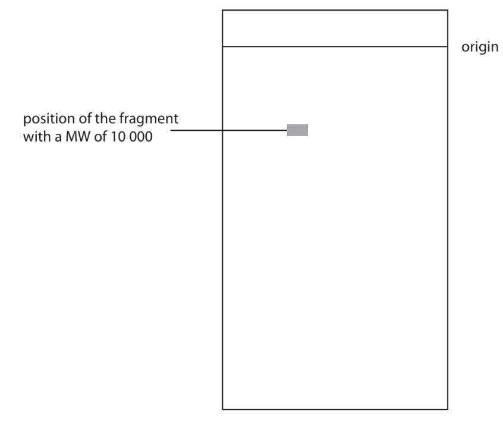
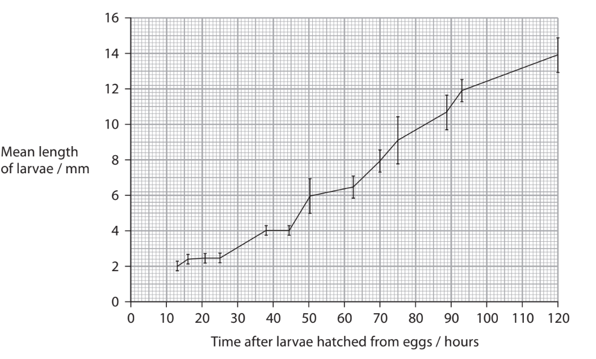
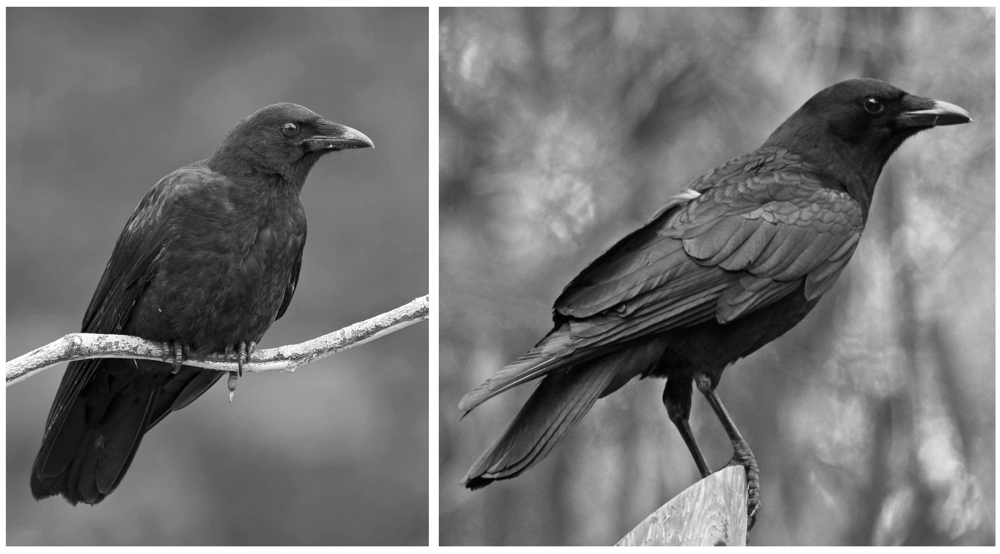
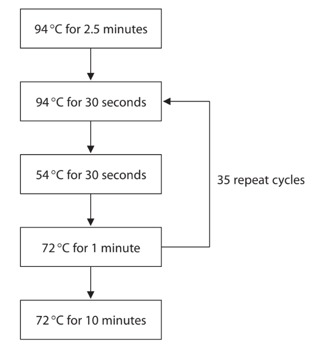
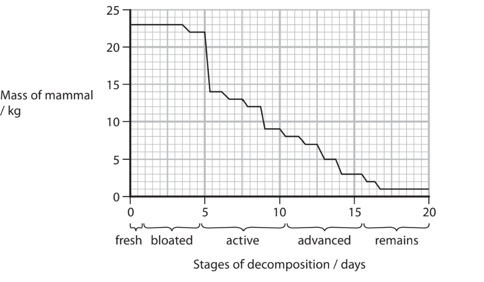
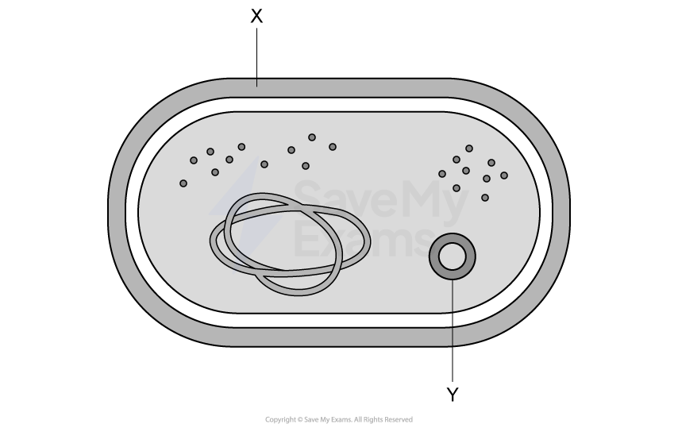

# Exam Questions — Forensics
**6. Microbiology, Immunity & Forensics** · Edexcel International A Level (IAL) Biology (YBI11)
> Source: [https://www.savemyexams.com/international-a-level/biology/edexcel/18/topic-questions/6-microbiology-immunity-and-forensics/forensics/exam-questions/](https://www.savemyexams.com/international-a-level/biology/edexcel/18/topic-questions/6-microbiology-immunity-and-forensics/forensics/exam-questions/) · 7 questions · total 85 marks

## Q1 — medium — 8 marks · exam-questions

### 2((a)) — 1 mark — command: state — structured — from paper Oct/Nov 2020 · WBI14/01
Body temperature and the degree of muscle contraction can be used to determine the time since death of a person.

The table shows how body temperature and body stiffness, due to muscle contraction, change with time since death.

| **Time since death / hours** | **Body temperature** | **Body stiffness** |
|---|---|---|
| < 3 | warm | not stiff |
| 3 to 8 | warm | stiff |
| 8 to 36 | cold | stiff |
| > 36 | cold | not stiff |

State how the temperature of a dead body should be measured.

### 2() — 4 marks — command: multiple — structured — from paper Oct/Nov 2020 · WBI14/01
(i) Body temperature can be used to estimate the time since death using the following information:

- loss of 0.78 °C per hour for the first 12 hours after death
- after 12 hours, loss of 0.4 °C per hour.

Estimate the time since death of a person whose body temperature had fallen 11.5 °C.

Give your answer to the nearest hour.

**(2)**

(ii) Explain why this estimate would be different if the body had been left in a colder place.

**(2)**

### 2((c)) — 3 marks — command: explain — structured — from paper Oct/Nov 2020 · WBI14/01
Explain why using body stiffness only, as shown in the table, is insufficient to estimate the time since death accurately.

## Q2 — medium — 12 marks · exam-questions

### 7((a)) — 4 marks — command: multiple — structured — from paper Jan 2021 · WBI14/01
Gel electrophoresis is used to separate DNA fragments of different lengths.

The rate at which the DNA fragments move through the gel depends on several factors including:

- Molecular size of the DNA fragment

  - Shape of the DNA fragment
  - Concentration of the gel.

(i)  Which enzyme is used to cut the DNA into fragments?

**(1)**

☐   **A  ** DNA polymerase

☐   **B**   Integrase

☐   **C  ** Restriction enzyme

☐   **D**   Reverse transcriptase

(ii) Explain why the use of an enzyme to cut the DNA results in fragments, of different lengths, that can be separated by gel electrophoresis.

**(3)**

### 7((b)) — 3 marks — command: complete — structured — from paper Jan 2021 · WBI14/01
Fragments of double-stranded DNA move through the gel at a relative rate (Mr) that is inversely proportional to the log of their molecular weight (MW).

(i)  Complete the table using the equation:

**M****r = **$\frac{1}{\mathrm{log}_{10}\mathrm{MW}}$

**(2)**

| **Molecular weight of DNA** **fragment (MW)** | **Relative rate of movement (M****r****)** |
|---|---|
| 100 000 |   |
| 10 000 | 0.25 |
|   | 0.34 |

(ii)  The diagram shows the position of a DNA fragment with a MW of 10 000, after gel electrophoresis.

Complete the diagram to show the position of a DNA fragment with a MW of 100 000.

Use the information in the question.

**(1)**

### 7((c)) — 1 mark — command: suggest — structured — from paper Jan 2021 · WBI14/01
The fragments move more slowly through a higher concentration of gel.

Suggest why the fragments move more slowly through a higher concentration of gel.

### 7((d)) — 4 marks — command: give — structured — from paper Jan 2021 · WBI14/01
Circular DNA moves at a faster rate through the gel than linear DNA.

(i)

Give **two** examples of circular DNA found in cells.

**(2)**

(ii)

Give **two** differences between the structure of circular DNA and that of linear DNA, other than their shapes.

**(2)**

## Q3 — medium — 13 marks · exam-questions

### 5((a)) — 1 mark — command: what — structured — from paper June 2021 · WBI14/01
The time of death of a person can be estimated in a number of ways.

The time of death can be estimated using the length of insect larvae.

What is the name of the method that uses insect larvae to estimate the time of death?

☐ **A** dendrochronology

☐ **B** epigenetics

☐ **C** forensic entomology

☐ **D** species diversity

### 5() — 8 marks — command: multiple — structured — from paper June 2021 · WBI14/01
The larvae of one species of blowfly can be used to estimate the time of death.

The graph shows the mean length of larvae from this species incubated at 10.62 °C.

(i)  Calculate the mean growth rate of these larvae from 25 to 120 hours.

Include the units with your answer.

**(2)**

(ii)  Comment on the suitability of using this data to estimate the time of death.

Use the information in the graph to support your answer.

**(3)**

(iii)  Describe how the data shown in this graph could have been collected.

**(3)**

### 5((c)) — 4 marks — command: evaluate — structured — from paper June 2021 · WBI14/01
The time of death can be estimated using the body temperature of the corpse.

Evaluate the use of the body temperature of a corpse to estimate the time of death.

## Q4 — medium — 12 marks · exam-questions

### 5((a)) — 2 marks — command: give — structured — from paper Jan 2022 · WBI14/01
The photographs show a Northwestern crow and an American crow.

| Ianaré Sévi, CC BY-SA 3.0 <https://creativecommons.org/licenses/by-sa/3.0>, via Wikimedia Commons | DickDaniels  (http://carolinabirds.org/), CC BY-SA 3.0 <https://creativecommons.org/licenses/by-sa/3.0>, via Wikimedia Commons |
|---|---|

These two crows look very similar and are therefore difficult to distinguish as two separate species.

Scientists have studied the nuclear DNA and the mitochondrial DNA (mtDNA) of these two species of birds.

Give **two** differences between the structure of nuclear DNA and mtDNA.

### 5((b)) — 7 marks — command: multiple — structured — from paper Jan 2022 · WBI14/01
The mtDNA was isolated from these two species of crow and amplified using the polymerase chain reaction (PCR).

The diagram shows details of the process used.

(i)  Name **three** molecules, other than the mtDNA and water, that would be needed in this process.

**(2)**

(ii)  Calculate the total length of time, in hours, that this process would take.

Give your answer to two decimal places.

**(2)**

(iii)  Explain how this process amplifies the DNA.

Use information in the diagram to support your answer.

**(3)**

### 5((c)) — 3 marks — command: explain — structured — from paper Jan 2022 · WBI14/01
Explain how the amplified mtDNA could be used to determine the genetic relationships between these two species of crow.

## Q5 — medium — 15 marks · exam-questions

### 8((a)) — 4 marks — command: explain — structured — from paper Jan 2022 · WBI14/01
Forensic entomology is a method for estimating the time of death of a mammal.

Seventy‐two hours or more after death, forensic entomology is the most accurate method for estimating the time of death.

Forensic entomology can also provide information about the place of death and indicate if the body has been moved.

(i)  Explain why forensic entomology is the most accurate method for estimating the time of death, if this is greater than 72 hours.

**(2)**

(ii)  Explain how forensic entomology can indicate if a body has been moved from the place of death.

**(2)**

### 8((b)) — 11 marks — command: multiple — structured — from paper Jan 2022 · WBI14/01
A study looked at the succession of insects associated with the decomposition of a dead mammal in the Andean Coffee region.

In this study, a mammal was killed, placed inside a metal cage in this region and left until it had completely decomposed.

The body of this mammal was monitored regularly.

The stages of decomposition were identified and various measurements were taken and recorded. Insects in the different stages of their lifecycle were collected and identified.

The graph shows the changes in mass of this mammal during the decomposition period.

(i)  Suggest why the mammal was placed inside a metal cage to decompose.

**(1)**

(ii)  Calculate the rate of change in mass between day 5 and day 15 of decomposition.

Express your answer in kg hr-1.

Give your answer to two decimal places.

**(2)**

(iii)  Explain the changes in mass of this mammal during decomposition.

**(4)**

(iv)  Suggest why some of the insect eggs, collected from the decomposing mammal, were taken back to the laboratory and kept for a few days.

**(1)**

(v)  The table shows data on some of the insects collected from this decomposing mammal.

| **Type of insect** | **Percentage of some of the insect found at each stage of decomposition (%)** |   |   |   |   |
|---|---|---|---|---|---|
| **Fresh** | **Bloated** | **Active** | **Advanced** | **Remains** |   |
| *Lucilia* | 100.0 | 61.4 | 1.8 | 3.7 | 0.0 |
| *Cochliomyia* | 0.0 | 15.5 | 68.4 | 35.1 | 0.0 |
| *Chrysomya* | 0.0 | 6.4 | 9.8 | 1.2 | 0.0 |
| *Ophyra* | 0.0 | 0.0 | 0.6 | 30.9 | 83.9 |
| *Fannia* | 0.0 | 0.0 | 0.0 | 0.1 | 0.0 |
| Other types of insects | 0.0 | 16.7 | 19.4 | 29.0 | 16.1 |

Explain how these results illustrate succession.

Use the information in the table to support your answer.

**(3)**

## Q6 — hard — 11 marks · exam-questions

### 1() — 2 marks — command: explain — structured
A deceased farm animal was discovered during a routine field inspection. Forensic examination revealed the following data:

| Parameter | Observation/measurement |
|---|---|
| Time of discovery | 09:30 hours |
| Ambient temperature | 28 °C |
| Body temperature | 31.1 °C |
| Body stiffness | Complete rigor mortis throughout all muscle groups |
| Environmental conditions | Direct sunlight, medium wind speed |
| Insect evidence | *Lucilia* (blowfly) eggs present on carcass |
| Adult blowflies observed in vicinity |   |
| Body condition | No visible trauma or injury |
| Location | Open pasture, elevated position |

Explain the observation for body stiffness in the deceased animal.

### 2() — 4 marks — command: multiple — structured
A standard cooling rate assumes that body temperature falls by 0.78 °C per hour during the hours soon after death. Normal core body temperature for the farm animal is 39 °C.

(i) Calculate the estimated time since death based on this standard cooling rate.

Use the formula:

time (hours) = $\frac{\mathrm{normal} \mathrm{body} \mathrm{temperature}-\mathrm{recorded} \mathrm{body} \mathrm{temperature}}{\mathrm{cooling} \mathrm{rate} \mathrm{per} \mathrm{hour}}$

[1]

(ii) Explain why the estimate calculated in (i) may not be accurate for this animal.

[3]

### 3() — 5 marks — command: multiple — structured
To verify time of death estimates, forensic scientists often use insect evidence as an additional method. The table below contains reference data on some insect species and their presence on a body at different times after death

| Time since death | Primary insect species | Life stage typically observed | Development time (at 25°C) |
|---|---|---|---|
| 0-24 hours | *Lucilia* (blowfly) | Adults arriving + eggs laid | Eggs hatch into larvae after 12-24 hours |
| 1-3 days | *Lucilia* (blowfly) | Larvae (early development) + adults | Larvae develop into adults after 3-5 days |
| 4-10 days | *Lucilia* (blowfly) | Larvae (later development) + adults |   |
| *Calliphora* (bluebottle) | Eggs and larvae | Eggs hatch into larvae after 18-36 hours |   |
| 10-14 days | *Lucilia* (blowfly) | New adult generation emerges | Complete cycle takes ~10-14 days |

(i) State what this reference table indicates about the time since death.

[1]

(ii) Explain your conclusion from part (i)

[2]

(iii) Explain what the presence of *Lucilia* larvae on the carcass would have suggested about the temperature-based estimate from part (b).

[2]

## Q7 — easy — 14 marks · exam-questions

### 1() — 4 marks — command: multiple — structured
*Mycobacterium tuberculosis* is a pathogenic bacterium that infects the lungs, causing tuberculosis (TB).

The diagram shows a representation of an *M. tuberculosis* cell.

(i) Identify structures **X** and **Y**.

[2]

(ii) The length of the cell in the diagram is 8.8 cm. The diagram is magnified 25 000 times.

Calculate the actual length of the *M. tuberculosis* cell shown. Give your answer in μm.

[2]

### 2() — 2 marks — command: suggest — structured
*M. tuberculosis* evades the host immune system by infecting and surviving inside macrophages.

A patient infected with *M. tuberculosis* was monitored over a four-week period. Blood tests showed sustained high concentrations of specific antibodies, but the number of bacteria in the patient's lungs continued to increase.

Suggest why the production of antibodies alone is not sufficient to clear a *Mycobacterium tuberculosis* infection.

### 3() — 2 marks — command: explain — structured
Scientists extracted DNA from *M. tuberculosis* samples and used PCR followed by gel electrophoresis to compare the genomes of antibiotic resistant and non-resistant strains.

Explain why PCR was carried out on the DNA samples before gel electrophoresis.

### 4() — 3 marks — command: describe — structured
Describe the process of gel electrophoresis used to compare the genomes.

### 5() — 3 marks — command: explain — structured
Antibiotic resistance in *M. tuberculosis* is a growing problem worldwide, making some TB infections difficult to treat.

Explain how antibiotic-resistant strains of *M. tuberculosis* can develop.
