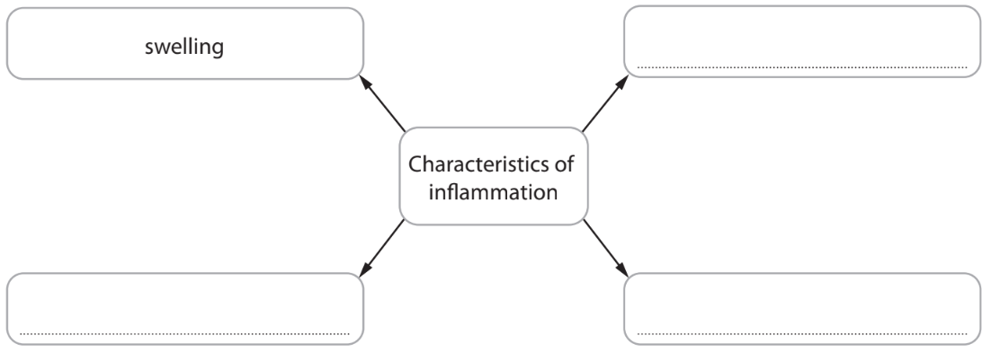
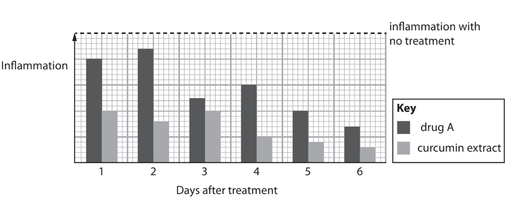
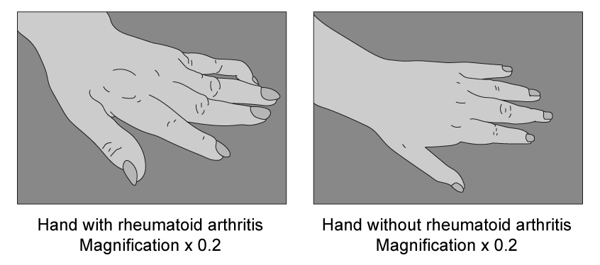
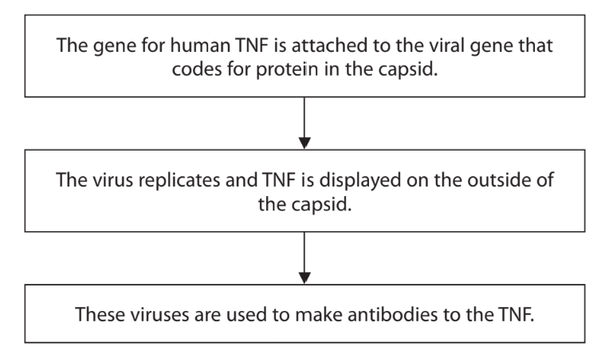
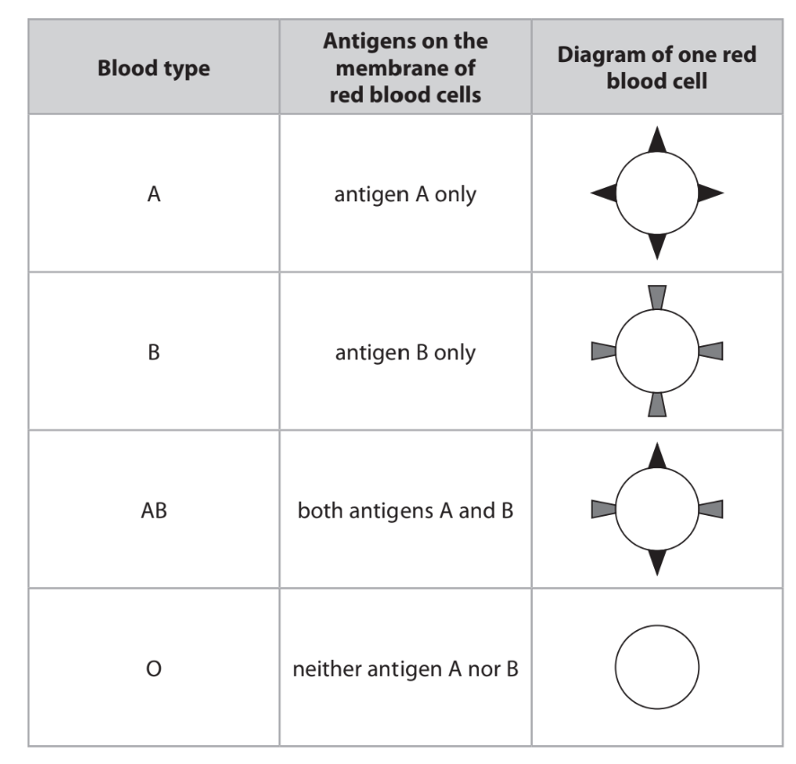
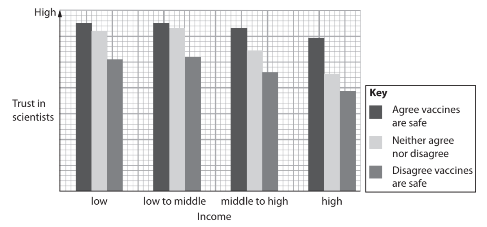
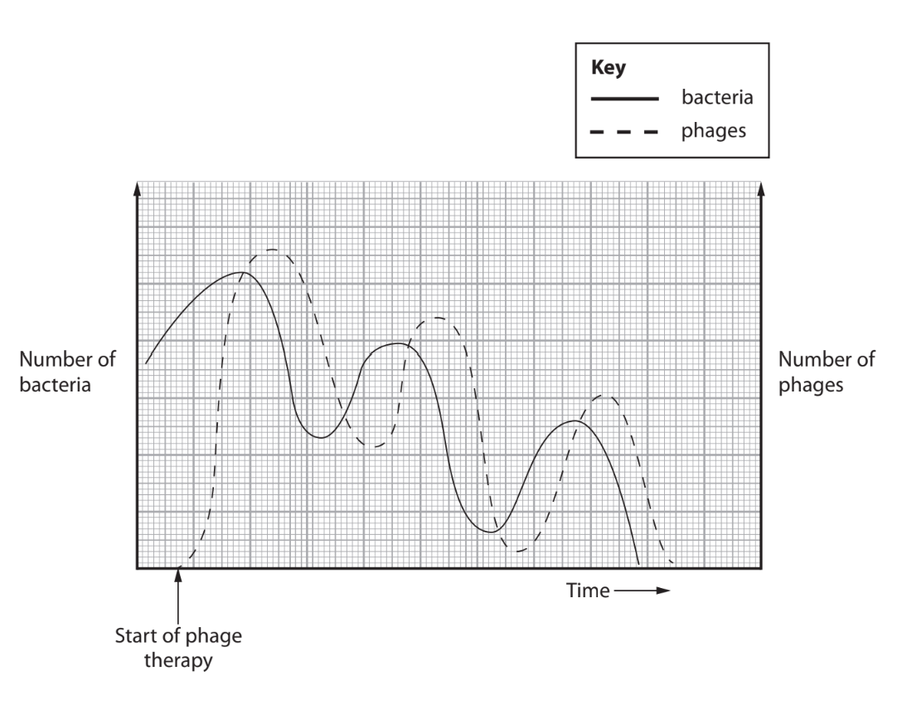
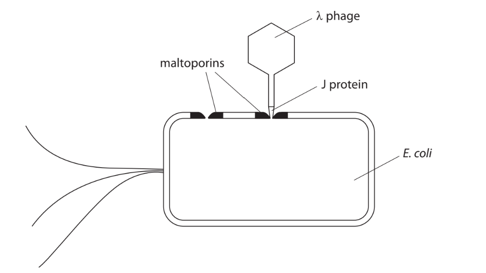
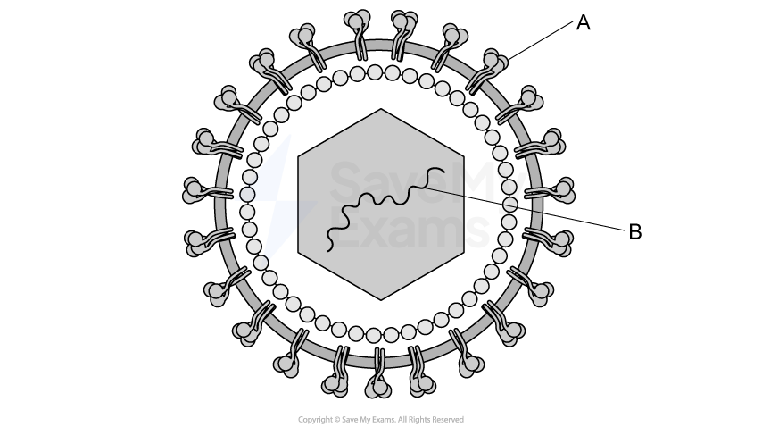
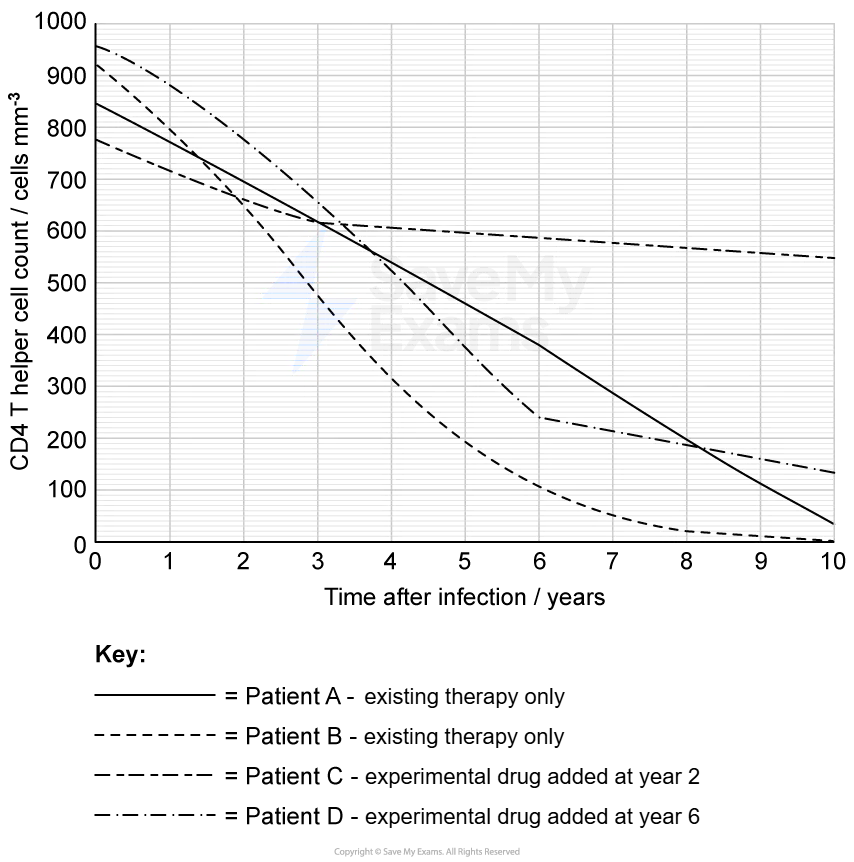

# Exam Questions — Immunity
**6. Microbiology, Immunity & Forensics** · Edexcel International A Level (IAL) Biology (YBI11)
> Source: [https://www.savemyexams.com/international-a-level/biology/edexcel/18/topic-questions/6-microbiology-immunity-and-forensics/immunity/exam-questions/](https://www.savemyexams.com/international-a-level/biology/edexcel/18/topic-questions/6-microbiology-immunity-and-forensics/immunity/exam-questions/) · 13 questions · total 155 marks

## Q1 — medium — 8 marks · exam-questions

### 1((a)) — 4 marks — command: multiple — structured — from paper Jan 2021 · WBI14/01
Inflammation is involved in the non-specific response of the body to infection and injury.

(i)  Complete the diagram to show the four characteristics of inflammation.

**(2)**

(ii)  Inflammation occurs following a cut to the skin.

Describe the role of **two** of these characteristics of inflammation in response to a cut to the skin.

**(2)**

### 1((b)) — 4 marks — command: multiple — structured — from paper Jan 2021 · WBI14/01
Anti-inflammatory drugs reduce inflammation.

Turmeric is a spice that is added to food.

Curcumin is a chemical in turmeric that has been shown to reduce inflammation.

(i)  The graph shows the effect of treating inflammation with curcumin extract and an anti-inflammatory drug, drug A.

Compare and contrast the effect of treating inflammation with curcumin extract and with drug A.

**(3)**

(ii) Many treatments use 1 g curcumin extract.

A sample of turmeric contains 3% curcumin.

Which is the mass of turmeric for one treatment?

**(1)**

| ☐ | **A** | 0.03 g |
|---|---|---|
| ☐ | **B** | 3.33 g |
| ☐ | **C** | 33.3 g |
| ☐ | **D** | 33.4 g |

## Q2 — medium — 10 marks · exam-questions

### 4() — 2 marks — command: give — structured — from paper Oct/Nov 2020 · WBI14/01
Rheumatoid arthritis is an inflammatory condition caused by the overactivity of the immune system.

The illustrations show the hand of a person with rheumatoid arthritis and the hand of a person without rheumatoid arthritis. The two images are shown to the same scale.

(i)  Give **one** piece of evidence, shown in the illustrations, that rheumatoid arthritis is an inflammatory condition.

**(1)**

(ii)  Give** two other** signs of inflammation that are experienced in the hand of a person with rheumatoid arthritis.

**(1)**

### 4() — 8 marks — command: explain — structured — from paper Oct/Nov 2020 · WBI14/01
Tumour necrosis factor (TNF) is a protein that can be released by several types of cell. It plays an important part in the immune response.

This protein binds to specific receptors on the surface of cell membranes stimulating chemical reactions inside the cell. As a result, a number of responses may occur that include inflammation and the stimulation of phagocytosis by macrophages.

Antibodies to TNF are used to treat rheumatoid arthritis.

Scientists have used a virus that infects bacteria to produce antibodies to human TNF.

The diagram summarises this process.

(i) Explain how attaching the gene for TNF to the viral gene results in TNF being displayed on the outside of the capsid.

**(2)**

(ii) Explain why antibodies to TNF are used in the treatment of rheumatoid arthritis.

**(2)**

(iii) Patients being treated with antibodies to TNF are more susceptible to tuberculosis (TB), which can be fatal.

Explain why patients being treated with antibodies to TNF can die from TB.

**(4)**

## Q3 — medium — 11 marks · exam-questions

### 8() — 5 marks — command: multiple — structured — from paper Oct/Nov 2020 · WBI14/01
Humans can have one of four different blood types: A, B, AB or O.

Blood type is determined by antigens present on the membranes of red blood cells.

The table shows which antigens are present in each blood type.

Blood transfusions are used in the treatment of some diseases.

A blood transfusion involves taking blood from a healthy person and putting it into the person needing the treatment.

(i) Which blood type can be used for all blood transfusions?

**(1)**

☐ **A** blood type A

☐ **B** blood type B

☐ **C** blood type AB

☐ **D** blood type O

(ii) Explain what will happen if a person with blood type A is given a transfusion of blood type AB.

**(4)**

### 8() — 6 marks — command: multiple — structured — from paper Oct/Nov 2020 · WBI14/01
Bacteria live in our intestines (gut flora).

The membranes of cells lining our intestines have molecules similar to the antigens on red blood cells.

(i) Explain why bacteria living in our intestines are important.

**(2)**

(ii)  Both the molecules on the membranes of the cells lining our intestines and the antigens on red blood cells have sugars attached to protein molecules.

Bacteria living in our intestines secrete an enzyme that separates the sugars from the protein molecules.

Suggest why bacteria living in our intestines secrete this enzyme.

**(2)**

(iii)  Explain why this enzyme may be useful in blood transfusions.

**(2)**

## Q4 — medium — 10 marks · exam-questions

### 3((a)) — 4 marks — command: describe — structured — from paper Jan 2021 · WBI14/01
In 2018, an organisation carried out a global survey into the attitudes of people towards vaccines.

Vaccines provide artificial active immunity.

Describe how a vaccine results in active immunity.

### 3((b)) — 4 marks — command: multiple — structured — from paper Jan 2021 · WBI14/01
This survey included three aspects:

- The trust that people have in scientists
- Their thoughts on the safety of vaccines
- Their income.

The graph shows some of the results of this survey.

(i)  Identify **three** conclusions that can be drawn from the results of this survey.

**(3)**

(ii)  Suggest **one** reason for the different attitudes of these people.

**(1)**

### 3((c)) — 2 marks — command: suggest — structured — from paper Jan 2021 · WBI14/01
The more people in a population who are vaccinated against a disease, the less likely it is for non-vaccinated people to become infected.

Suggest why vaccination is more successful when a greater proportion of people are vaccinated.

## Q5 — medium — 15 marks · exam-questions

### 8() — 9 marks — command: multiple — structured — from paper June 2021 · WBI14/01
Patients with cystic fibrosis may develop serious bacterial infections.

A patient with cystic fibrosis developed bacterial infections including *Mycobacterium*.

(i)  This patient was given a combination of antibiotics for several months.

Explain why a combination of antibiotics had to be given for several months.

**(2)**

(ii)  This patient did not respond to the combination of antibiotics, and later needed a lung transplant.

Suggest why this patient needed a lung transplant.

**(3)**

(iii)  Following the transplant, the patient was given immunosuppressive drugs.

Immunosuppressive drugs weaken the immune system. Some of these drugs work by preventing DNA synthesis in the patient.

As a result of the immunosuppressive drug treatment, the infection with *Mycobacterium* developed faster.

Explain why the infection with *Mycobacterium* developed faster when the patient was taking immunosuppressive drugs.

**(4)**

### 8((b)) — 6 marks — command: explain — structured — from paper June 2021 · WBI14/01
Phage therapy was used to treat the *Mycobacterium* infection in this patient.

Phages are viruses that target bacterial cells.

The graph shows how the number of *Mycobacterium* and the number of phages changed following the start of phage therapy.

Explain the changes in the number of bacteria and phages following the start of the phage therapy.

Use the information in the graph to support your answer.

## Q6 — medium — 20 marks · exam-questions

### 8((a)) — 2 marks — command: describe — structured — from paper Jan 2021 · WBI15/01
The[ scientific document](https://cdn.savemyexams.com/uploads/2022/11/wbi15-01-que-20210304-scientific-article.pdf) you have studied is adapted from an article in Education in Chemistry: Developing vaccines, Self-defence classes for our immune system.

Use the information from the scientific document and your own knowledge to answer the following questions.

The Ebola virus can infect endothelial cells.

Describe how this virus can cause internal bleeding (paragraph 1).

### 8((b)) — 4 marks — command: explain — structured — from paper Jan 2021 · WBI15/01
Explain how ‘our immune systems learn to make another type of protein, called an antibody’ (paragraph 4).

### 8((c)) — 2 marks — command: explain — structured — from paper Jan 2021 · WBI15/01
One method of slowing the degradation of vaccine proteins is to dry a mixture of sugars and vaccine on a filter.

Explain why flushing with water releases the vaccine from the filter (paragraphs 8 and 9).

### 8((d)) — 3 marks — command: explain — structured — from paper Jan 2021 · WBI15/01
During the production of some vaccines, the virus is allowed to replicate in eggs (paragraph 13).

Explain how a vaccine produced in this way may become less effective.

### 8((e)) — 7 marks — command: multiple — structured — from paper Jan 2021 · WBI15/01
Scientists are using genetically modified bacteria and insect cells to produce the antigens for Ebola vaccines (paragraph 13).

(i)  Describe how insect cells could be genetically modified to produce the antigens for an Ebola vaccine.

**(4)**

(ii)  Suggest **three** benefits of using an insect cell to produce the Ebola virus antigen.

**(3)**

### 8((f)) — 2 marks — command: suggest — structured — from paper Jan 2021 · WBI15/01
Suggest why the stems of the different versions of haemagglutinin molecules are the same but the heads can be different (paragraph 15).

## Q7 — medium — 10 marks · exam-questions

### 3((a)) — 3 marks — command: put — structured — from paper Oct/Nov 2021 · WBI14/01
There are four types of immunity.

Artificial immunity develops when a person is immunised by an injection.

The table gives some statements about artificial immunity.

For each statement, put **one** cross ☒ in the appropriate box, in each row, to show which statements are correct for the types of artificial immunity.

| **Statement** | **Type of artificial immunity** |   |   |   |
|---|---|---|---|---|
| both active and passive | active only | passive only | neither active nor passive |   |
| Antibodies are injected into the person | ☐ | ☐ | ☐ | ☐ |
| B cells differentiate into plasma cells | ☐ | ☐ | ☐ | ☐ |
| Memory cells are formed | ☐ | ☐ | ☐ | ☐ |

### 3() — 7 marks — command: multiple — structured — from paper Oct/Nov 2021 · WBI14/01
Natural active immunity can develop when a person is infected with a virus.

(i)  Describe the role of macrophages in the development of natural active immunity to a virus, following infection.

**(3)**

(ii)  Explain why both T helper cells and T killer cells are needed in the immune response to a virus.

**(4)**

## Q8 — medium — 10 marks · exam-questions

### 3((a)) — 4 marks — command: explain — structured — from paper Jan 2022 · WBI14/01
Human Immunodeficiency Virus (HIV) infects human cells, causing symptoms that may result in death.

Explain why the virus is an immunodeficiency virus.

### 3((b)) — 6 marks — command: multiple — structured — from paper Jan 2022 · WBI14/01
A number of antiretroviral drugs are given to patients with HIV.

These include reverse transcriptase inhibitors and integrase inhibitors.

(i) Explain how these two drugs reduce the development of HIV.

**(2)**

(ii)  These two drugs are often given in combination with other antiretroviral drugs.

Suggest why patients are given combinations of drugs.

**(2)**

(iii)  If a patient stops taking the antiretroviral drugs, the number of virus particles increases again.

Suggest why this increase occurs.

**(2)**

## Q9 — medium — 10 marks · exam-questions

### 4((a)) — 1 mark — command: how — structured — from paper Jan 2022 · WBI14/01
Pathogens continuously adapt to invade their host cells.

Host cells continuously adapt to avoid infection by pathogens.

This is an example of an ‘evolutionary race’.

The diagram shows the pathogen lambda phage (λ phage) attached to its host cell, *E. coli.*

How many of the following statements are correct for λ phage?

- the genetic material is DNA
- the capsid structure is described as complex
- the genetic material codes for the J protein

| ☐ | **A** | 0 |
|---|---|---|
| ☐ | **B** | 1 |
| ☐ | **C** | 2 |
| ☐ | **D** | 3 |

### 4((b)) — 2 marks — command: describe — structured — from paper Jan 2022 · WBI14/01
Describe the role of the λ phage J protein.

Use the information in the diagram to support your answer.

### 4((c)) — 7 marks — command: multiple — structured — from paper Jan 2022 · WBI14/01
Maltoporin is coded for by the *lamβ* gene of *E. coli.*

Maltoporin is involved in the transport of some sugars into *E. coli.*

(i)  Give **one** reason why sugars are important to *E. coli.*

**(1)**

(ii) Discuss how* E. coli *and λ phage could interact and develop in their evolutionary race for existence.

Use all the information in this question to support your answer.

**(6)**

## Q10 — medium — 20 marks · exam-questions

### 8((a)) — 2 marks — command: explain — structured — from paper Oct/Nov 2020 · WBI15/01
The [scientific document](https://cdn.savemyexams.com/uploads/2022/11/wbi15-01-scientific-article.pdf) you have studied is adapted from an article in *National Geographic*: How personalized medicine is transforming your health care.

Use the information from the scientific document and your own knowledge to answer the following questions.

Explain what is meant by the phrase ‘gene variants’ (paragraph 4).

### 8((b)) — 4 marks — command: explain — structured — from paper Oct/Nov 2020 · WBI15/01
Explain why ‘tumours...riddled with different mutations’ are good candidates for immunotherapies (paragraph 6).

### 8((c)) — 2 marks — command: explain — structured — from paper Oct/Nov 2020 · WBI15/01
Explain why a CT scan was used to show that Judy Perkins was free of tumours (paragraph 10 and Figure 1).

### 8((d)) — 2 marks — command: explain — structured — from paper Oct/Nov 2020 · WBI15/01
Checkpoints are a type of protein that prevent the activation of immune cells.

Explain why a checkpoint inhibitor was given with the lymphocytes in the immunotherapy used to treat Judy Perkins (paragraph 10).

### 8((e)) — 4 marks — command: explain — structured — from paper Oct/Nov 2020 · WBI15/01
Explain how ‘a gene variant that produces a defective form of an enzyme’ reduces the effectiveness of clopidogrel (paragraph 16).

### 8((f)) — 3 marks — command: suggest — structured — from paper Oct/Nov 2020 · WBI15/01
Researchers have used stem cells to produce spinal cord tissue from individuals with amyotrophic lateral sclerosis.

These functioning tissues contain motor neurones and blood vessels.

Suggest why blood vessels are required to form functioning spinal cord tissue (paragraph 31).

### 8((g)) — 3 marks — command: suggest — structured — from paper Oct/Nov 2020 · WBI15/01
Suggest how ‘a brew of growth factors and other proteins’ can stimulate induced pluripotent stem cells to produce a functioning tissue (paragraph 33).

## Q11 — easy — 14 marks · exam-questions

### 1() — 2 marks — command: identify — structured
West Nile virus (WNV) is an RNA virus transmitted by *Culex* mosquitoes.

The diagram** **shows a representation of WNV.

Identify structures **A** and **B**.

### 2() — 3 marks — command: suggest — structured
WNV can cause severe neurological disease in humans and horses.

(i) Suggest why WNV is able to cause neurological disease in both humans and horses.

[1]

(ii) Suggest how infection with WNV results in neurological symptoms.

[2]

### 3() — 3 marks — command: explain — structured
A vaccine against WNV is given to horses. The vaccine contains inactivated WNV particles.

Explain why a horse that has been vaccinated is protected against future infection with live WNV

### 4() — 1 mark — command: state — structured
A foal was born to a mare that had been vaccinated against WNV before the birth. The foal had low levels of WNV antibodies at birth.

State the type of immunity the foal has at birth.

### 5() — 5 marks — command: multiple — structured
There is currently no approved human vaccine against WNV, although several are in clinical trials.

In a clinical trial half of the participants received the vaccine and the other half received a placebo. The table shows the mean antibody concentration in the blood of participants at different time points during the trial.

| Time (weeks) | Mean antibody concentration in vaccine group (arbitrary units) | Mean antibody concentration in placebo group (arbitrary units) |
|---|---|---|
| 0 | 0 | 0 |
| 4 | 120 | 0 |
| 8 | 380 | 0 |
| 12 | 510 | 0 |
| 16 | 495 | 0 |

(i) State the role of the placebo group in this trial.

[1]

(ii) State **two** conclusions that can be drawn from these data about the new WNV vaccine. Use data from the table to support your answers.

[2]

(iii) Suggest one feature of the trial design, other than the inclusion of a placebo group, that would help to ensure the results are valid. Explain how this feature improves the validity of the trial.

[2]

## Q12 — very_hard — 14 marks · exam-questions

### 1() — 3 marks — command: describe — structured
Human immunodeficiency virus (HIV) infects and destroys CD4+ T helper cells. If untreated, HIV infection eventually leads to acquired immunodeficiency syndrome (AIDS), which is diagnosed when CD4+ T helper cell count falls below 200 cells mm⁻³.

Describe what happens after HIV infects a T helper cell that leads to the destruction of the cell.

### 2() — 2 marks — command: calculate — structured
The graph shows historical clinical data of CD4+ T helper cell counts in four HIV-positive patients over ten years. Patients A and B continued older antiretroviral treatments, while patients C and D received an additional experimental drug.

Calculate the percentage decrease in CD4+ T helper cell count of patient B between year 2 and year 6. Give your answer to 3 significant figures.

### 3() — 6 marks — command: evaluate — structured
The table below** **shows additional information about patients C and D.

| Patient | Age when drug started | Sex | Viral load when drug started |
|---|---|---|---|
| C | 29 | Female | Low |
| D | 41 | Male | High |

A medical student reviewed the study results and concluded that:

*"The experimental drug is effective at treating HIV infection and should be considered for use in HIV patients."*

*Use information from the graph and the table to evaluate the student's conclusion.

### 4() — 3 marks — command: explain — structured
By year 6, Patient B's immune system is severely compromised.

Explain why Patient B would be unable to mount an effective immune response against a bacterial infection.

## Q13 — medium — 3 marks · exam-questions

### 6((d)) — 3 marks — command: explain — structured — from paper Oct/Nov 2021 · WBI15/01
T lymphocytes produce different types of cytokine.

Some of these cytokines activate T killer cells and some activate B cells.

Explain why different cytokines can activate different cells.
