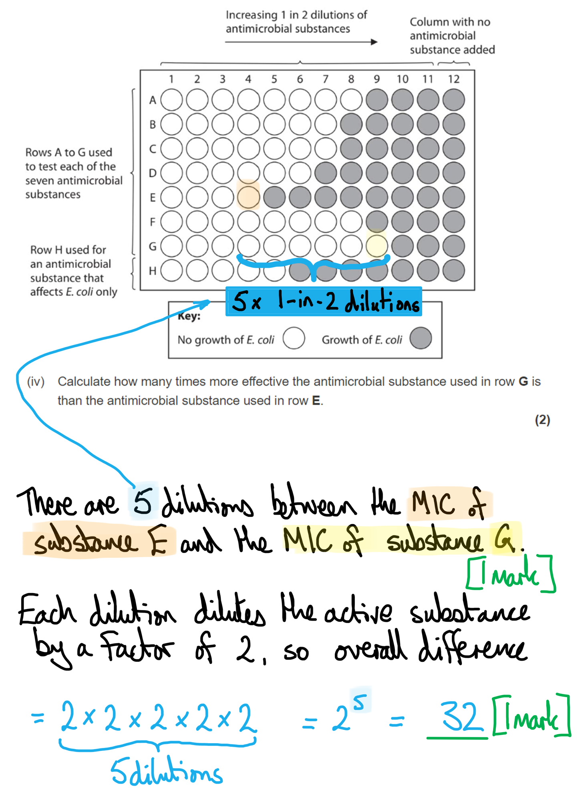

# Mark Schemes — Microbiology
**6. Microbiology, Immunity & Forensics** · Edexcel International A Level (IAL) Biology (YBI11)

## Q1 — medium — 6 marks · exam-questions

### 1((a)) — 2 marks
(i) The correct answer is **B (one) **because...

Starch contains both amylose and amylopectin.

> *Starch only contains α-glucose monomers, not β-glucose. *

> *Starch is not stored in the tonoplast. *

(ii) The correct answer is **C (two) **because...

Cellulose forms hydrogen bonds with other cellulose molecules.

Cellulose contains 1-4 glyosidic bonds.

> *Cellulose contains β-glucose monomers, not α-glucose.*

**[Total: 2 marks]**

### 1((b)) — 4 marks
(i) Two structures found in bacterial cells that are involved in the synthesis of these enzymes are...

- (Bacterial) chromosome/DNA/plasmid **and** (70S) ribosomes;** [1 mark]**

> *Remember to only name structures found in prokaryotic cells, not structures such as a nucleus, rough ER or golgi, because these are only found in eukaryotic cells. *

(ii) The conditions needed for increased bacterial growth are...

Any **three **of the following**:**

- Oxygen for (aerobic) respiration; **[1 mark]**
- Glucose for respiration / amino acids for protein synthesis; **[1 mark]**
- Optimum temperature for (faster) enzyme/metabolic reaction; **[1 mark]**
- Optimum pH for (faster) enzyme/metabolic reaction; **[1 mark]**

***Accept ****water for hydrolysis reactions / solvent*

**[Total: 4 marks]**

> *Make sure to pay attention to the command word explain here. For example, just describing that bacteria need oxygen but not saying **why** they need oxygen would not allow you to gain the mark. *

## Q2 — medium — 8 marks · exam-questions

### 5((a)) — 1 marks
The virus that can infect bacteria is **C** (lambda phage).

> *Ebola virus (A) and HIV (B) infect humans.*

> *TMV (D) infects plants.*

**[Total: 1 mark]**

### 5() — 7 marks
(i) The role of channel proteins in the facilitated diffusion of lysins is...

Any **two** of the following**:**

- To provide a polar / hydrophilic channel; **[1 mark]**
- Allowing lysins to pass through the non-polar / hydrophobic membrane/phospholipids/fatty acid tails; **[1 mark]**
- Lysins move down their concentration gradient; **[1 mark]**

***Ignore**** direction of movement, i.e. into or out of the cell*

> *This question is about channel proteins forming a **hydrophilic** channel through the **hydrophobic** parts of the bilayer to allow lysins to pass by diffusion. Think of a tube passing across the membrane; the whole inner surface of the tube is hydrophilic, so does not repel hydrophilic molecules like lysins.*

(ii) The primary structure and the tertiary structure of holins determine the properties of these channel proteins as follows...

Any **three** of the following**:**

- The primary structure is the amino acid sequence that will determine the (tertiary) structure of holins / proteins; **[1 mark]**
- (The primary structure) will determine the types/positions of bonds that form / the formation of disulfide/hydrogen bonds; **[1 mark]**
- (Amino acids with) polar R groups will face into the channel; **[1 mark]**
- (Amino acids with) non-polar R groups will face outwards to the fatty acids/phospholipids/membrane; **[1 mark]**

***Ignore**** base sequence for marking point 1*

> *Be careful not to confuse protein structure and DNA structure; proteins are made of **amino acids**, not bases!*

(iii) The role of lysins in the lytic cycle is as follows...

- Lysins break bonds between the <u>peptidoglycan</u>/<u>murein</u> molecules; **[1 mark]**
- The virus particles leave the bacterial cells through the cell wall **OR** lysins cause bacterial cells to burst / form pores in the cell wall; **[1 mark]**

> *Because the stem of the question tells you that 'Lysins break down the cell wall of bacteria' you won't get a mark for just repeating that; the examiners are trying to get you to use your knowledge of bacterial cell structure to state **exactly which  molecules** in the cell wall are broken down (by lysins).*

**[Total: 7 marks]**

## Q3 — medium — 11 marks · exam-questions

### 7() — 4 marks
(i) The correct answer is **B** (3 organelles) because...

Only the **nuclei**, Golgi apparatus and **mitochondria **are surrounded by a membrane.

> *Glycogen granules** and **cytoplasm** are not organelles but are still identifiable parts of the cell. *

> *The other organelles labelled are not surrounded by a membrane: these are the **cell wall**, **cell membrane** (because it is itself a membrane) and the **ribosomes**.*

(ii) Fungi are not classified as bacteria, plants or animals because...

- (Fungi are not plants because) they have glycogen granules (rather than starch) **OR** they do not have <u>cellulose</u> cell walls; **[1 mark]**
- (Fungi are not animals because) they have a cell wall; **[1 mark]**
- (Fungi are not bacteria because) they have nuclei / Golgi apparatus / mitochondria / membrane-bound organelles **OR** they have <u>chitin</u> cell walls / do not have <u>peptidoglycan</u> cell walls; **[1 mark]**

***Ignore**** references to chloroplasts / vacuole for marking point 1.*

***Ignore**** references to flagellum / pili / capsule / endoplasmic reticulum for marking point 2.*

***Reject ****references to ribosomes / cytoplasm / glycogen granules / cell membrane for marking point 3 as these are all features that can be found in bacterial cells.*

> *It's vital that you follow the clue in the question to '**use the information in the diagram**'; marks are not available for describing features that are not present in the diagram.*

**[Total: 4 marks]**

### 7((b)) — 4 marks
The relationship between the number of aminopenicillin prescriptions issued and the percentage of *E. coli* resistant to aminopenicillin during this one-year period can be explained as follows...

Any **four** of the following**:**

- There is a correlation between the number of prescriptions and the percentage of resistant *E. coli*; **[1 mark]**
- The use of aminopenicillin acts as a selection pressure; **[1 mark]**
- The resistant bacteria reproduce and the non-resistant bacteria die **OR** the resistant bacteria are <u>more</u>** **likely to reproduce / will reproduce <u>more</u>; **[1 mark]**
- The percentage of resistant *E. coli* falls when prescriptions fall **BECAUSE** non-resistant *E. coli* are not destroyed; **[1 mark]**
- The percentage of resistant *E. coli* falls when prescriptions fall **BECAUSE **there is competition between resistant and non-resistant bacteria; **[1 mark]**

***Accept ****'as the number of prescriptions goes up the number of resistant bacteria goes up' OR 'when the number of prescriptions goes down the number of resistant bacteria goes down' for 1 mark if no other marks have been awarded.*

**[Total: 4 marks]**

> *This is a difficult question to score full marks on. The main pitfall to avoid is to merely describe the data shown in the graph rather than** explaining** as the question requires.*

> *Marking point 2 on selection pressures is an important feature of the understanding of antibiotic resistance; **humans create the selection pressure** by flooding bacteria with antibiotics, causing resistant bacteria to survive and non-resistant bacteria to die out. *

### 7((c)) — 3 marks
The results of the survey are a cause for concern because...

Any **three** of the following**:**

- Codes of practice / medical advice (regarding the prescription of antibiotics) are being ignored; **[1 mark]**
- The use of antibiotics is a selection pressure; **[1 mark]**
- The number of antibiotic resistant bacteria is increasing; **[1 mark]**
- Our (current) antibiotics may become useless and people will remain ill / die **OR** there is an evolutionary race between bacteria and the ability of humans to develop new antibiotics **OR** natural bacterial flora (such as the gut flora) are destroyed by antibiotics; **[1 mark]**

**[Total: 3 marks]**

> *Because the command word in this question is '**explain**', your answer should do just that. You may be tempted to just paraphrase the information in the question as a description of the data and trends, but that will score zero without further explanation. *

## Q4 — medium — 10 marks · exam-questions

### 2() — 3 marks
(i) The correct answer is **A** because...

**HIV and Ebola virus possess a lipid envelope; an outer layer of phospholipids formed from the cell surface membranes of their host cells.**

> *λ phage (C and D) does not have an envelope.*

> *TMV (B and D) does not have an envelope as it is a plant virus and it is very unusual for viruses to take phospholipid membranes from plant cells.*

(ii) The correct answer is **C** (λ phage) because...

**λ phage has a complex campsid structure; the upper part of the capsid holds the genetic material while the lower part is able to insert the genetic material into the host cell.**

(iii) The correct answer is **C** (3 viruses) because...

**Ebola, HIV, and TMV all have RNA.**

> *λ phage has DNA.*

**[Total: 3 marks]**

### 2() — 3 marks
(i) The completed table sequence is as follows...

| **Negative RNA strand** | **A** | **C** | **C** | **A** | **A** | **G** | **G** | **C** | **G** |
|---|---|---|---|---|---|---|---|---|---|
| **Positive RNA strand** | **U** | **G** | **G** | **U** | **U** | **C** | **C** | **G** | **C** |

**[1 mark]** for the correct sequence.

(ii) A positive strand has to be made because...

- The positive strand has the codons / codes for the proteins/amino acids / is used in translation of viral genes **OR** the negative strand does not have the correct codons; **[1 mark]**
- The positive strand has the <u>complementary</u> base sequence needed to make the negative strand; **[1 mark]**

***Reject**** references to translation in marking point 1.*

***Ignore ****references to sense and antisense strands which are not relevant in this question.*

**[Total: 3 marks]**

### 2((c)) — 4 marks
(c) Doctors were worried that this person had left it too long for the treatment to be successful because...

Any** four **of the following**:**

- (During 18 days) new viruses are produced; **[1 mark]**
- New viruses can burst out of / damage host cells; **[1 mark]**
- (The new viruses can) infect more cells / cause the spread of the virus; **[1 mark]**
- It takes time for the immune system to be stimulated / for lymphocytes to be activated/divide by mitosis/differentiate; **[1 mark]**
- A person may become ill / the virus may get out of control before the immune system is stimulated** OR** not enough antibodies will be present for opsonisation to occur **OR** illness may start before receiving antiviral drugs / before drugs can take effect; **[1 mark]**

***Ignore**** any references to latency / description of retroviruses / replication of DNA for marking point 1.*

***Reject ****'kill the virus' for marking point 5.*

**[Total: 4 marks]**

## Q5 — medium — 15 marks · exam-questions

### 5() — 5 marks
(i) The term aseptic technique means...

- Methods/techniques used to prevent contamination (of person / culture) with other microorganisms; **[1 mark]**

***Accept**** prevent entry of / infection by microorganisms.*

(a) (ii) Two aseptic techniques that could be used in this investigation are...

Any **two** of the following**:**

- Carry out the work beside a Bunsen burner / in a fume cupboard; **[1 mark]**
- Use sterilised equipment / media/agar / sterilise equipment after use; **[1 mark]**
- Wearing gloves / washing hands / tying long hair back / wearing protective clothing, e.g. a lab coat; **[1 mark]**
- Minimising the time that cultures are exposed to the air / do not open cultures at the end **OR** transfer bacteria quickly; **[1 mark]**

***Accept**** a description of how equipment could be sterilised for marking point 2, e.g. media autoclaved / wash the lab benches with disinfectant.*

(a) (iii) Using aseptic technique in this investigation is important because...

Any** two **of the following:

- It prevents entry of bacteria that may compete with the *E. coli*; **[1 mark]**
- It prevents entry of bacteria that may grow in different types/concentrations of microbial substances (than *E. coli*) **OR **scientists will not know if *E. coli* or the other bacteria is growing; **[1 mark]**
- To prevent infection (of a person) with bacteria in the culture that may be pathogenic; **[1 mark]**

**[Total: 5 marks]**

### 5((b)) — 2 marks
The microdilution plate had to be incubated at an appropriate temperature for *E. coli* because...

- This is the temperature needed for the enzymes to function **OR** temperature is not too high so the enzymes do not denature **OR** temperature won’t be the rate-limiting factor for growth; **[1 mark]**

The microdilution plate had to be incubated for 72 hours because...

- Enough time has to be allowed for the bacterial growth to become visible (as colonies) / there has to be enough time for the antimicrobials to have an effect / the antimicrobials only affect growing bacteria; **[1 mark]**

***Allow**** 'proteins' for 'enzymes' in marking point 1.*

**[Total: 2 marks]**

### 5() — 8 marks
(i) An antimicrobial substance that affects *E. coli* only was included in this assay (row **H**) because...

Any **pair of points** from the following:

- To show if the cultures were contaminated / to see if other bacteria are growing in the culture; **[1 mark]**
- The antimicrobial agent would not kill/inhibit the growth of other types of bacteria; **[1 mark]**

**OR**

- To check that the *E. coli* has not changed its susceptibility/resistance; **[1 mark]**
- So that the results will apply to known (strains of) *E. coli*; **[1 mark]**

(ii) There was one column that had no antimicrobial substance added to it (column 12) because...

- To show that the *E. coli* were viable/alive/able to grow; **[1 mark]**
- If there was no growth of bacteria it would not be clear whether the bacteria were dead or whether the antimicrobial agents were effective/were inhibiting growth; **[1 mark]**

***Ignore**** antimicrobials affecting growth for marking point 2.*

(iii) A 1-in-2 dilution plating method would have been carried out to achieve the dilution in the well for row E, column 4, as follows...

- Adding equal (stated) volumes / volumes in ratio of 1:1 / 50 % each of antimicrobial substance/antimicrobials/solution and water/media/broth/buffer together; **[1 mark]**
- Repeat (a few times) using the previous solution; **[1 mark]**

***Allow**** the idea of doing this process in the wells directly or separately.*

***Ignore**** 'amount' used in place of 'volume' for marking point 1.*

***Allow**** a reference to serial dilutions for marking point 2.*

> *To access this question you would have to have carried out **serial dilutions** or at least be aware of this technique to produce solutions of varying concentrations in an investigation. *

(iv) A calculation of how many times more effective the antimicrobial substance used in row **G **is than the antimicrobial substance used in row **E**, is as follows...

Any **pair of points** from the following:

- MIC of E = 1 in 8 **and** MIC of G = 1 in 256 **OR **MIC of E = 1 in 16 **and** MIC of G = 1 in 512; **[1 mark]**
- (256 ÷ 8 =) 32 **OR** (512 ÷ 16 =) 32; **[1 mark]**

**OR**

- Five dilutions between **E **and **G**, 2×2×2×2×2; **[1 mark]**
- 32 (times) **OR** 25 (times); **[1 mark]**

***Allow**** 1 mark for a final answer of 2.25*

> *A common error here is to count the number of wells that have no **E. coli** growth (which is 9 for G and 4 for E) and divide one by the other to get 2.25 (9 ÷ 4 = 2.25).*

> *The reason that this is incorrect is because the basis of a serial 1-in-2 dilution is that:*

- *Well 2 is half as concentrated as Well 1*

  - *Well 3 is half as concentrated as Well 2, and so on...*

> *The examiners award 1 mark for this, in recognition of how difficult this question is!*

**[Total: 8 marks]**

## Q6 — easy — 10 marks · exam-questions

### 1() — 4 marks
> **[mark-scheme]**
> - Initially there is little/no increase in cell numbers **AS** bacteria are synthesising new enzymes to metabolise the available nutrients OR increasing in size / synthesising new cellular components / replicating their DNA in preparation for division **[1 mark]**
> - There is a rapid/exponential increase in numbers **AS** there is an abundance of nutrients / there are no limiting factors **[1 mark]**
> - The number of cells remains constant/levels off **AS** nutrients become limiting / waste products accumulate **[1 mark]**
> - The number of viable cells decreases **AS** waste products reach toxic/lethal levels / nutrients become depleted/exhausted **[1 mark]**

> **[exam-tip]**
> The growth of bacteria in a closed batch culture follows four distinct phases. To answer this question well, you should think about each phase in turn — what is happening to the number of viable cells, and why.
> 
> This is an "explain" question, so you must give the reasons for each change you describe, not just describe what happens.
> 
> Be specific about what bacteria are doing during the lag phase. Vague phrases like "acclimatising to the conditions" do not demonstrate understanding. Stronger answers refer to specific preparatory activities, such as synthesising enzymes needed to metabolise the available nutrients.
> 
> The stationary and death phases have related but distinct causes. In the stationary phase nutrients are becoming limiting and waste products are accumulating, but the bacteria can still survive. In the death phase, waste products have reached toxic or lethal levels and / or nutrients have become depleted to the point where the bacteria can no longer survive.

### 2() — 2 marks
To calculate the number of cells per cm³ after 10 hours of growth:

number of cells = starting number × 2n

Where n = number of doublings

- Determine the number of doublings

  - The bacteria doubled every 2.5 hours
  - 10 hours of growth

= 10 ÷ 2.5

= 4 doublings **[1 mark]**

- Substitute the values into the formula

= (2.0 × 104) × 24

= **320 000** cells per cm³ **OR** **3.2 × 10****5**** **cells per cm³** [1 mark]**

> **[mark-scheme]**
> ACCEPT correct answer with no working shown for 2 marks.

> **[exam-tip]**
> The formula for exponential bacterial growth will not be provided in the exam. You are expected to recall it from memory and apply it independently.
> 
> Show your working clearly. Even for short calculations, examiners can award method marks for a correct approach if your final answer is wrong. A correct final answer with no working shown will receive full marks, but if your answer is incorrect, you cannot be credited for any of the steps if the working is missing.

### 3() — 2 marks
To calculate the number of bacteria per cm³ in the original culture:

- Determine the number of cells in 1 cm³ of the 10-5 dilution:

  - 0.1 cm³ contains 57 cells
  - 1 cm³ is 10 times larger than 0.1 cm³

= 57 × 10

= 570 cells per cm³

- Determine the number of cells in 1 cm³ of the original culture:

  - The original culture is 105 times more concentrated than the 10-5 dilution

= 570 x 105

= 57 000 000 **[1 mark] **

=** ****5.7 × 10****7**** **bacteria per cm³** [1 mark]**

> **[mark-scheme]**
> Award full marks for the correct answer in the absence of working.

### 4() — 2 marks
> **[mark-scheme]**
> Advantage (any one from):
> 
> - Provides continuous/real-time measurement of growth without the need to remove samples
> - Faster / less labour-intensive than preparing / incubating / counting agar plates
> 
> **[1 mark]**
> 
> Disadvantage (any one from):
> 
> - Cannot distinguish between living and dead / viable and non-viable cells
> - At high cell densities bacteria may block / scatter light
> - Less sensitive at low cell densities / at low cell densities there are too few bacteria to make the solution noticeably cloudy
> 
> **[1 mark]**

> **[exam-tip]**
> "Suggest" questions ask you to apply your knowledge to work out an answer, rather than simply recall one. If you cannot immediately think of an answer, think carefully about how the method actually works in practice — this will help you identify what it does well and where it has limitations.
> 
> This question asks you to compare the turbidity method with the dilution plating method, so make sure the advantage or disadvantage you identify is a feature that is different between the two methods. For example, you might think that an advantage of turbidity is that it provides a quantitative measurement — but dilution plating also provides a quantitative measurement, so this is not a feature that is different between the two methods and would not gain a mark.

## Q7 — hard — 12 marks · exam-questions

### 1() — 3 marks
> **[mark-scheme]**
> Any **three** from:
> 
> - Disinfect the work surface / wipe bench with disinfectant beforehand
> - Wash hands (with soap) beforehand
> - Use a sterile pipette / spreader / wire loop to transfer the bacteria onto the agar
> - Flame the wire loop / neck of the culture bottle before and after use
> - Work near a lit Bunsen burner
> - Lift the lid of the Petri dish partially / at an angle
> 
> **[3 marks]**

> **[exam-tip]**
> This is a describe question, so you need to state the steps of the aseptic technique clearly — you do not need to explain why each step works. Additional explanation (e.g. "flame the wire loop *to kill any bacteria on it*") will not be penalised, but it will not gain extra marks either, and time spent writing it is time taken away from other questions.
> 
> Make sure your steps are specific actions rather than vague statements such as "avoid contamination", as these will not score.

### 2() — 2 marks
> **[mark-scheme]**
> Any **two** from:
> 
> - Do not completely seal the Petri dish **SO** ensuring an oxygen supply for aerobic microorganisms OR preventing the growth of dangerous/pathogenic anaerobic bacteria **[1 mark]**
> - Incubate at 25°C rather than 37°C **SO** reducing / preventing the growth of pathogenic bacteria **[1 mark]**
> - Secure the lid / keep the lid on **SO** reducing contamination from outside bacteria / preventing bacteria in the air from landing on the agar **[1 mark]**
> 
> Accept references to storing the dishes upside down in order to prevent contamination from drops of condensation falling on the plate

> **[exam-tip]**
> For "explain" questions, you must provide both the precaution and the reasoning behind it. Simply stating what to do (like "incubate at 25°C" or "don't seal completely") won't earn marks - you need to explain why these precautions are necessary. Using linking words like "so" or "so that" helps you connect your precaution to its purpose clearly.

### 3() — 3 marks
To calculate the area of the clear zone:

area* *= πr2

- Calculate the radius of the total zone of inhibition:

radius = 22 ÷ 2

= 11 mm

- Calculate the area of the total zone of inhibition:

area = π x 112

= π x 121

= 380.13 mm2

- Calculate the radius of the paper disc:

radius = 6 ÷ 2

= 3 mm

- Calculate the area of the paper disc:

area = π x 32

= π x 9

= 28.27 mm2

- Calculate the area of the clear zone only:

area = 380.13 - 28.27

= 351.86

= **352 mm****2**

> **[mark-scheme]**
> Award marks as follows:
> 
> - 380.13 **AND** 28.27 **[1 mark]**
> - 351.86 **[1 mark]**
> - 352 mm2** ****[1 mark]**
> 
> Award full marks for the correct answer without working shown
> 
> Award 2 marks for the correct answer not given to 3 s.f.

### 4() — 4 marks
> **[mark-scheme]**
> Arguments for validity:
> 
> - Antibiotics A, C and D have a small standard deviation, indicating that the results are closely grouped around the mean / repeatable
> - 6.0 mm disc has been used for all antibiotics, so any difference in zone size can be attributed to the antibiotic itself rather than the initial disc diameter
> - Aseptic technique was used in preparing the lawn, so any inhibition observed is due to the antibiotic and not outside contamination
> 
> Arguments against validity (a maximum of three from):
> 
> - Antibiotic B has a large standard deviation (4.5), indicating high variability between repeats / lower repeatability (for this antibiotic)
> - Only two repeats were carried out, so anomalous results cannot be identified and eliminated from the mean
> - It is difficult to measure the diameter of the zone of inhibition precisely if the zones are not perfectly circular **OR** the edge of the zone of inhibition can be subjective / unclear
> - No control disc (soaked in solvent / distilled water) was included to confirm that the inhibition was due to the antibiotic
> 
> **[4 marks]**
> 
> A maximum of three marks can be awarded for answers that do not address both arguments for and against.

> **[exam-tip]**
> Validity refers to whether an investigation actually measures what it sets out to measure, and incorporates ideas such as repeatability (consistency between repeats under the same conditions), accuracy (closeness to a true value), and control of variables. These terms have specific scientific meanings and are not interchangeable — avoid using "reliable" as a generic substitute, as this will not gain marks if used incorrectly.
> 
> To evaluate validity, base your answer on the method as given and the details from the data — do not raise points about information that is not provided.
> 
> Note that the command word "evaluate" requires a balanced response, so include both arguments for and against validity to access full marks.
