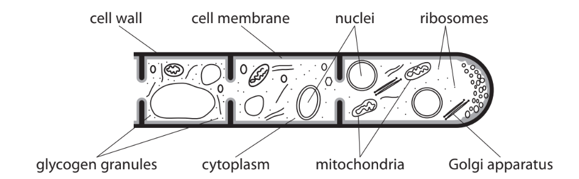
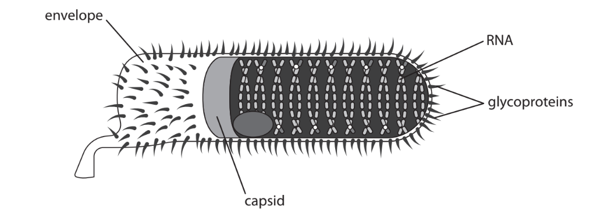
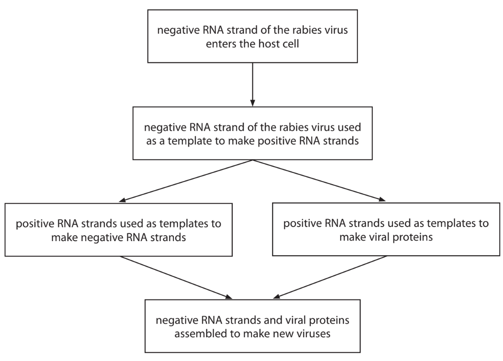
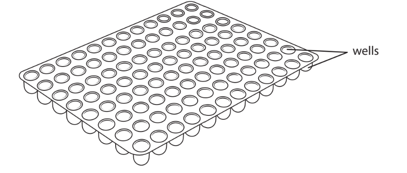
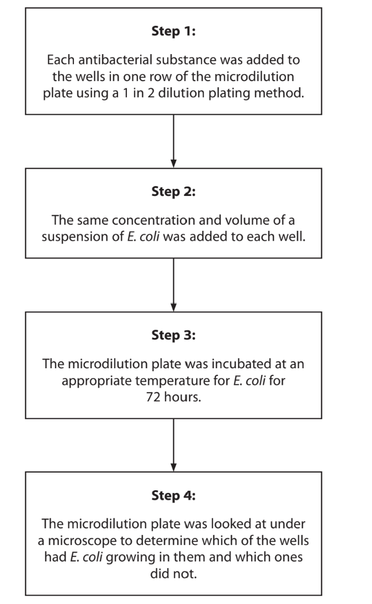
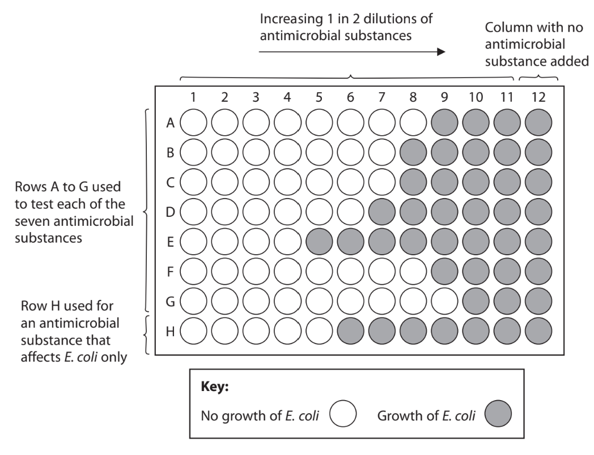

# Exam Questions — Microbiology
**6. Microbiology, Immunity & Forensics** · Edexcel International A Level (IAL) Biology (YBI11)
> Source: [https://www.savemyexams.com/international-a-level/biology/edexcel/18/topic-questions/6-microbiology-immunity-and-forensics/microbiology/exam-questions/](https://www.savemyexams.com/international-a-level/biology/edexcel/18/topic-questions/6-microbiology-immunity-and-forensics/microbiology/exam-questions/) · 7 questions · total 72 marks

## Q1 — medium — 6 marks · exam-questions

### 1((a)) — 2 marks — command: how — structured — from paper Jan 2021 · WBI12/01
Brazil is the largest producer of sugarcane.

The photograph shows sugar cane growing on plantation.

ANBARASU THIRAVIYAM, CC BY-SA 4.0 <https://creativecommons.org/licenses/by-sa/4.0>, via Wikimedia Commons

Products from sugarcane, such as starch and cellulose, are used to make bioplastic.

(i)  How many of the following statements about **starch** are correct?

- Contains α-glucose and β-glucose molecules
- Contains amylose and amylopectin
- Stored in the tonoplast

**(1)**

☐   **A  ** None

☐   **B**   One

☐   **C**   Two

☐   **D  ** Three

** **

(ii)  How many of the following statements about a **cellulose** molecule are correct?

- Contains α-glucose and β-glucose molecules
- Contains 1,4 glycosidic bonds
- Forms hydrogen bonds with other cellulose molecules

**(1)**

☐   **A  ** None

☐   **B**    One

☐   **C   ** Two

☐   **D   ** Three

### 1((b)) — 4 marks — command: multiple — structured — from paper Jan 2021 · WBI12/01
Bioplastic bags made from sugarcane take up to six months to decompose.

Bacteria secrete enzymes onto the bags during the process of decomposition.

(i) Name **two** structures found in bacterial cells that are involved in the synthesis of these enzymes.

**(1)**

(ii) Decomposition of bioplastic bags occurs faster if there is increased bacterial growth.

Explain the conditions needed for increased bacterial growth.

**(3)**

## Q2 — medium — 8 marks · exam-questions

### 5((a)) — 1 mark — command: which — structured — from paper Oct/Nov 2020 · WBI14/01
Viruses can infect bacteria.

Which virus can infect bacteria?

☐   **A**   Ebola virus

☐   **B**   human immunodeficiency virus (HIV)

☐   **C  ** lambda phage (λ phage)

☐   **D**   tobacco mosaic virus (TMV)

### 5() — 7 marks — command: multiple — structured — from paper Oct/Nov 2020 · WBI14/01
Some viruses that infect bacteria cause the production of molecules called holins.

Holins form protein channels in the cell membranes of bacteria. This allows polar molecules called lysins to reach the cell wall by facilitated diffusion.

The DNA of these viruses codes for lysins.

(i) Describe the role of channel proteins in the facilitated diffusion of lysins.

**(2)**

(ii) Explain how the primary structure and the tertiary structure of holins determine the properties of these channel proteins.

**(3)**

(iii) Lysins break down the cell wall of bacteria.

Explain the role of lysins in the lytic cycle.

**(2)**

## Q3 — medium — 11 marks · exam-questions

### 7() — 4 marks — command: multiple — structured — from paper Oct/Nov 2020 · WBI14/01
Bacteria and fungi can both cause infections.

The diagram shows part of the structure of a fungus.

(i) How many of the organelles labelled in this diagram have membranes?

**(1)**

☐   **A**   1

☐   **B**   3

☐   **C  ** 5

☐   **D  ** 7

(ii) Explain why fungi are not classified as bacteria, plants or animals.

Use the information in the diagram and your knowledge of cell structure to support your answer.

**(3)**

### 7((b)) — 4 marks — command: explain — structured — from paper Oct/Nov 2020 · WBI14/01
The graph shows the number of prescriptions of the antibiotic, aminopenicillin, issued in one year.

The graph also shows the percentage of *E. coli* bacteria that were resistant to aminopenicillin during the same year.

Explain the relationship between the number of aminopenicillin prescriptions issued and the percentage of *E. coli* resistant to aminopenicillin during this one-year period.

Use the information in the graph to support your answer.

### 7((c)) — 3 marks — command: explain — structured — from paper Oct/Nov 2020 · WBI14/01
The results of a survey are shown in the diagram.

Explain why the results of this survey are a cause for concern.

## Q4 — medium — 10 marks · exam-questions

### 2() — 3 marks — command: multiple — structured — from paper Oct/Nov 2021 · WBI14/01
Rabies is a disease caused by a virus.

The diagram shows the structure of the rabies virus.

(i) The rabies virus has an envelope.

Which of the following pairs of viruses have an envelope?

**(1)**

| ☐ | **A** | Ebola virus and human immunodeficiency virus (HIV) |
|---|---|---|
| ☐ | **B** | human immunodeficiency virus (HIV) and tobacco mosaic virus (TMV) |
| ☐ | **C** | lambda phage (λ phage) and Ebola virus |
| ☐ | **D** | tobacco mosaic virus (TMV) and lambda phage (λ phage) |

(ii) The structure of the rabies capsid is described as complex.

Which of the following has a complex capsid structure?

**(1)**

| ☐ | **A** | Ebola virus |
|---|---|---|
| ☐ | **B** | human immunodeficiency virus (HIV) |
| ☐ | **C** | lambda phage (λ phage) |
| ☐ | **D** | tobacco mosaic virus (TMV) |

(iii) Rabies virus is an RNA virus.

How many of the following viruses are RNA viruses?

- Ebola virus
- human immunodeficiency virus (HIV)
- lambda phage (λ phage)
- tobacco mosaic virus (TMV)

**(1)**

| ☐ | **A** | 1 |
|---|---|---|
| ☐ | **B** | 2 |
| ☐ | **C** | 3 |
| ☐ | **D** | 4 |

### 2() — 3 marks — command: multiple — structured — from paper Oct/Nov 2021 · WBI14/01
The rabies virus replicates in a lytic cycle.

The RNA of the rabies virus is a negative RNA strand.

The diagram shows how the negative RNA strand of the rabies virus is used to make positive RNA and proteins.

(i) The diagram shows part of the base sequence in the negative RNA strand.

Complete the diagram to show the corresponding base sequence in the positive RNA strand.

| **Negative RNA strand** | **A** | **C** | **C** | **A** | **A** | **G** | **G** | **C** | **G** |
|---|---|---|---|---|---|---|---|---|---|
| **Positive RNA strand** |   |   |   |   |   |   |   |   |   |

**(1)**

(ii) Explain why a positive RNA strand has to be made.

**(2)**

> *The idea of positive and negative strands of RNA might seem unfamiliar, and this is not surprising because it is only linked to the edges of the spec for this board. The examiners are trying to get you to use your knowledge of base-pairing to get through this question. The virus carries a **negative** strand, i.e. a strand of RNA that is the **complementary base sequence** to the RNA sequences that would be required to replicate viral particles. In doing so, the virus makes it easier for the host cell to manufacture positive strands, which can then be directly translated into viral proteins/components, to allow easy viral proliferation. *

### 2((c)) — 4 marks — command: explain — structured — from paper Oct/Nov 2021 · WBI14/01
Lemurs are found in Madagascar. It is thought that they might carry rabies viruses.

The photograph shows a lemur.

Mathias Appel, CC0, via Wikimedia Commons

A person was bitten by a lemur.

This person did not receive any treatment for rabies until 18 days after being bitten.

Explain why doctors were worried that this person had left it too long for the treatment to be successful.

## Q5 — medium — 15 marks · exam-questions

### 5() — 5 marks — command: multiple — structured — from paper Oct/Nov 2021 · WBI14/01
Antimicrobial substances can be tested using a Minimum Inhibitory Concentration (MIC) assay.

This assay determines the lowest concentration of an antimicrobial substance that prevents visible growth of bacteria.

A microdilution plate is used in these assays. It is made of plastic and contains small wells that the antimicrobial substance and the bacteria can be added to.

The diagram shows a microdilution plate.

An investigation tested eight antimicrobial substances on one type of bacteria,* E. coli*.

Appropriate controls were included in this investigation.

The diagram shows the steps involved.

All steps in this investigation had to be carried out using aseptic technique.

(i) State the meaning of the term **aseptic technique.**

**(1)**

(ii) Describe two aseptic techniques that could be used in this investigation.

**(2)**

(iii)  Explain why using aseptic technique in this investigation is important.

**(2)**

### 5((b)) — 2 marks — command: explain — structured — from paper Oct/Nov 2021 · WBI14/01
Explain why the microdilution plate had to be incubated at an appropriate temperature for *E. coli* for 72 hours.

### 5() — 8 marks — command: multiple — structured — from paper Oct/Nov 2021 · WBI14/01
The diagram shows the results of the MIC assay from this investigation.

(i)  Explain why an antimicrobial substance that affects E. coli only was included in this assay (row **H**).

**(2)**

(ii)  Explain why there was one column that had no antimicrobial substance added to it (column 12).

**(2)**

(iii)  The MIC for the antimicrobial substance used in row **E** was in column 4. Describe how a 1 in 2 dilution plating method would have been carried out to achieve the dilution in this well.

**(2)**

(iv) Calculate how many times more effective the antimicrobial substance used in row **G** is than the antimicrobial substance used in row** E**.

**(2)**

## Q6 — easy — 10 marks · exam-questions

### 1() — 4 marks — command: explain — structured
Researchers investigated the growth of *Leuconostoc mesenteroides* in a closed batch culture.

Explain the changes in the number of viable bacterial cells over the course of this investigation.

### 2() — 2 marks — command: calculate — structured
During one phase of growth, the number of bacteria doubled every 2.5 hours. At the start of this phase the culture contained 2.0 × 10⁴ cells per cm³.

Calculate the number of cells per cm³ after 10 hours of exponential growth.

### 3() — 2 marks — command: calculate — structured
To estimate the number of bacteria in the culture at peak growth, the researchers took a 1 cm³ sample and made serial dilutions. A 0.1 cm³ volume of the 10-5 dilution was plated and incubated. After incubation, 57 colonies were counted.

Calculate the number of bacteria per cm³ in the original culture. Give your answer in standard form.

### 4() — 2 marks — command: suggest — structured
The researchers also used optical density (turbidity) to monitor bacterial growth continuously.

Suggest one advantage and one disadvantage of the turbidity method compared with the dilution plating method.

## Q7 — hard — 12 marks · exam-questions

### 1() — 3 marks — command: describe — structured
An investigation was carried out into the effectiveness of four different antibiotics (A, B, C and D) against *Staphylococcus aureus* bacteria using the disc diffusion method. A lawn of *S. aureus* was created on an agar plate, and paper discs soaked in different antibiotics were placed onto the surface of the agar.

Describe the aseptic technique that should have been used when preparing the bacterial lawn on the agar plate.

### 2() — 2 marks — command: explain — structured
After placing the antibiotic discs on the agar, the lid of the Petri dish was secured with tape and incubated at 25°C for 48 hours.

Explain two precautions that should be taken when securing and incubating the Petri dish.

### 3() — 3 marks — command: calculate — structured
After 48 hours the diameter of the zone of inhibition around each antibiotic disc was measured. For one disc with antibiotic B, the total diameter of the zone of inhibition was 22 mm. The paper disc itself had a diameter of 6 mm.

Calculate the area of the clear zone only, excluding the area covered by the paper disc, for antibiotic B. Give your answer to 3 significant figures.

### 4() — 4 marks — command: evaluate — structured
The experiment was repeated once more. The mean diameters of the zones of inhibition and the standard deviations for each antibiotic are shown below. The diameter of all paper discs was 6.0 mm.

| Antibiotic | Mean diameter of zone of inhibition / mm | Standard deviation / mm |
|---|---|---|
| A | 8.0 | 1.2 |
| B | 22.0 | 4.5 |
| C | 28.0 | 1.1 |
| D | 6.0 | 0.0 |

Evaluate the validity of the results gained in this investigation.
