# Mark Schemes — Muscular Movement
**7. Respiration, Muscles & the Internal Environment** · Edexcel International A Level (IAL) Biology (YBI11)

## Q1 — medium — 9 marks · exam-questions

### 3((a)) — 6 marks
(i) The row of the table that describes the atria and ventricles during atrial systole is **B** because...

Atrial systole (as specified in the question) is the phase of the cardiac cycle in which the **atrial walls contract**. The ventricles have to be relaxed in order for a pressure gradient to build up from atria to ventricles; this pressure gradient is what forces the blood from atria to ventricles when the atrioventricular valves open.

> *A and D are incorrect because if both chambers contract or relax at the same time, there would not be a suitable pressure gradient so blood would not flow.*

> *C is incorrect because the pressure gradient created by this would push the blood upwards; this occurs during **ventricular systole** and forces the blood into the arteries.*

(ii) There is a delay of 0.01 seconds between atrial systole and ventricular systole because...

Any **pair** of statements from the following:

- The atrioventricular valves have to close (before the ventricles contract); **[1 mark]**
- (Which) prevents backflow of blood into the atria; **[1 mark]**

**OR**

- The ventricles need to finish filling before they contract; **[1 mark]**
- (Which) ensures that the ventricles pump as much blood as possible with each contraction / ensures that the ventricles function efficiently; **[1 mark]**

***Accept ****bicuspid/mitral valve ****and**** tricuspid valve in place of 'atrioventricular valves'.*

***Reject**** references to AV valves closing during ventricular systole.*

***Accept ****'the delay is caused by a layer of insulating tissue between the atria and ventricles' as an additional marking point.*

(a) (iii) Using the information in the diagram, the duration of ventricular systole in milliseconds, expressed in standard form, is...

- 3/8 × 0.86 (length of cardiac cycle x proportion of cycle spent in ventricular systole) **OR **0.3225/0.32(3) seconds; **[1 mark]**
- 3.2(3) × 102 ms; **[1 mark]**

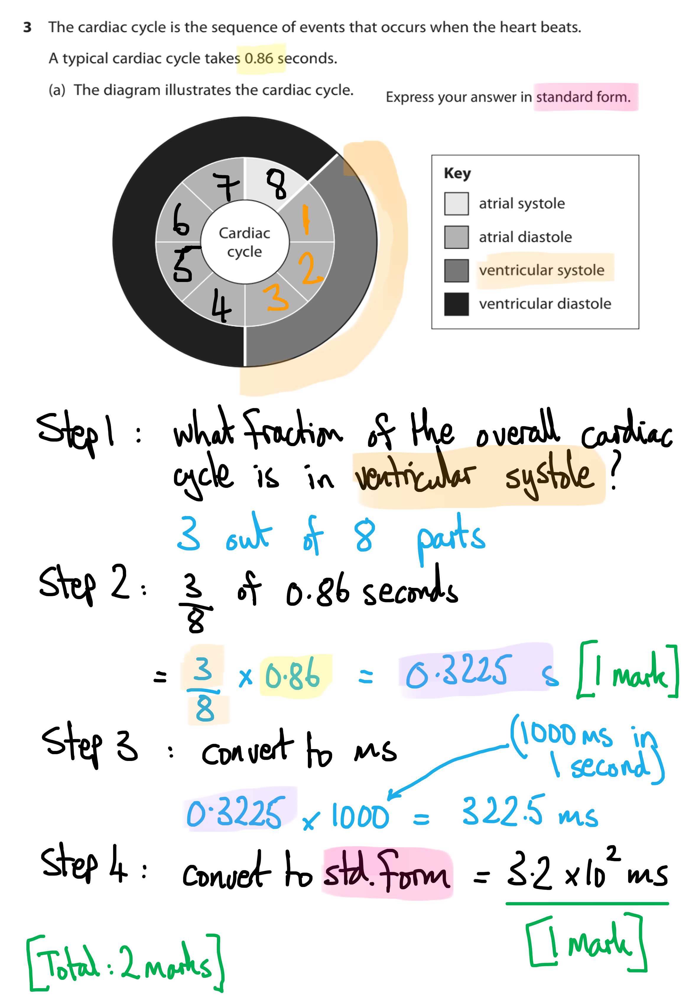

(iv) The proportion of the cardiac cycle spent in ventricular diastole is...

- 5/8 **OR** 63 % **OR** 0.63; **[1 mark]**

***Accept**** 5 out of 8 / 62.5 % / 0.625*

> *Ventricular diastole is the section of the pie chart shown in black on the diagram, so you need to count the number of segments that are covered by this black section (5) and express it as a proportion of the total number of segments (8).*

**[Total: 6 marks]**

### 3((b)) — 3 marks
The increase in heart rate if the cardiac cycle decreases by 0.4 seconds is calculated as follows:

- (Initial heart rate =) 70 bpm; **[1 mark]**
- (New heart rate =) 130 bpm; **[1 mark]**
- (Increase in heart rate =) 60 bpm;** [1 mark]**

***Allow**** full marks for the correct answer of 60 bpm alone.*

***Allow**** final answer of 60 or 61 bpm.*

***Allow**** final answer in the range 60.2 - 60.7.*

**[Total: 3 marks]**

*Even though the exam board's mark scheme allows full marks for just stating the correct answer, you are strongly advised **not **to adopt this approach to calculation questions. Getting the final answer only slightly wrong will result in ***[0 marks]*** if you do not show your working, so just writing the answer is an unnecessary high-risk strategy. In addition to this, the act of writing out your steps helps you to organise your thoughts and to set out your work in a manner that reduces the risk of an error, as shown below .*

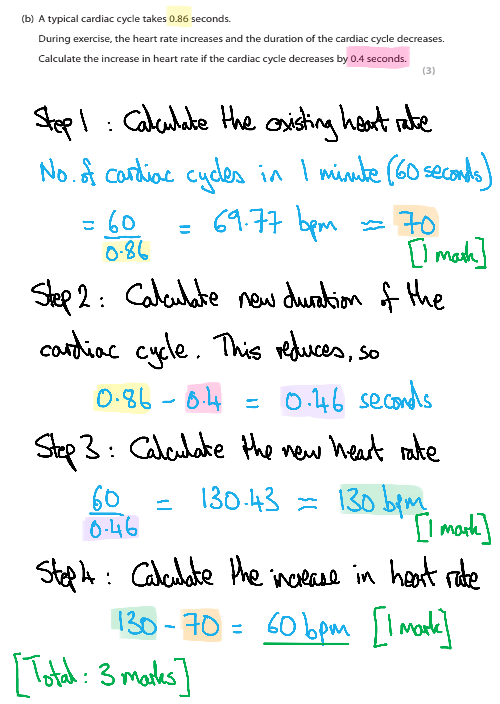

## Q2 — medium — 9 marks · exam-questions

### 2((a)) — 3 marks
The correct calculation of muscle strength is...

- Correct percentage increase from the graph = 27.5%; **[1 mark]**
- Increase in strength correctly calculated = 3.44 a.u; **[1 mark]**
- Muscle strength correctly calculated and answer given to 3 significant figures = 15.9 a.u; **[1 mark]**

*Full marks awarded for the correct answer only.*

**[Total: 3 marks]**

> *A maximum of two marks can be awarded if the correct answer is given to the wrong number of significant figures. *

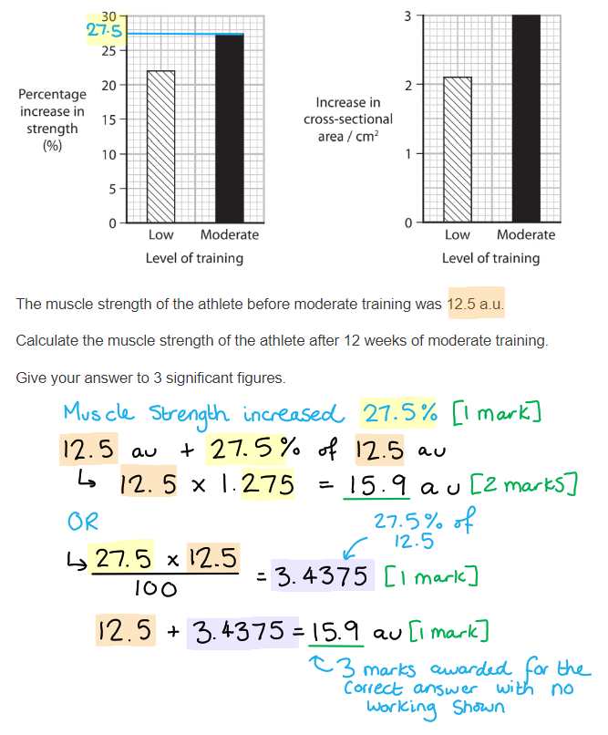

### 2((b)) — 6 marks
(i)  The structure of an intermediate fibre will differ from the structure of a slow twitch fibre by...

Any **three **of the following:

The intermediate fibre will have:

- Less myoglobin; **[1 mark]**
- Fewer mitochondria; **[1 mark]**
- More sarcoplasmic reticulum; **[1 mark]**
- A higher glycogen content; **[1 mark]**

> *This question is a comparative question so should include comparative language, such as less or more. *

(ii) The effect of exercise on this muscle is...

Any **three **of the following:

- Training increases muscle strength and cross-sectional area; **[1 mark]**
- There is no effect on slow twitch fibres; **[1 mark]**
- Exercise causes fast fibres to switch to intermediate twitch fibres; **[1 mark]**
- The greater the exercise, the greater the switch; **[1 mark]**

**[Total: 6 marks]**

## Q3 — medium — 4 marks · exam-questions

### 4((a)) — 4 marks
(i) The correct answer is **B **because...

**The structure labelled X is myosin. **

(ii) The correct answer is **D **because...

**The section labelled Z (the H band) becomes smaller as the muscle contracts because the actin filaments (labelled Y) move closer together.**

(iii) The correct answer is **D **because...

**Calcium ions bind to troponin when a sarcomere contracts.**

**Calcium ions are released from the sarcoplasmic reticulum when a sarcomere contracts.**

**Myosin changes shape when a sarcomere contracts.**

(iv) The correct answer is **B **because...

**Myosin contains an enzyme that hydrolyses ATP. This enzyme (ATPase) hydrolyses ATP into ADP and inorganic phosphate which causes the myosin heads to move back to their original positions, this is known as the recovery stroke.**

**[Total: 4 marks]**

## Q4 — medium — 13 marks · exam-questions

### 6((a)) — 3 marks
The difference in percentage decrease is...

- Correct figures taken from graph = 170 – 90; **[1 mark]**
- Correct calculation of percentage change (for fit person) = ((170 – 90) ÷ 170) x 100 = 47.06 %; **[1 mark]**
- Correct difference given to an appropriate number of decimal places 47.06 – 16 = 31 % **or** 31.1 %; **[1 mark]**

*Full marks for the correct answer only. *

**[Total: 3 marks]**

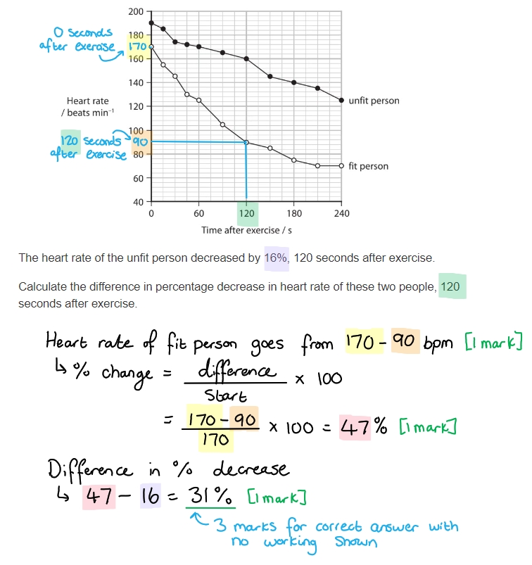

### 6((b)) — 3 marks
The heart rate of the unfit person at 5 minutes is...

- Value of mx = (-65 ÷ 240) × 300 = -81.25; **[1 mark]**
- Value of y = (-65 ÷ 240 × 300) + 190 = 108.75; **[1 mark]**
- Correctly rounded to a whole number with units = 109 bpm (*Accept range 107-111*); **[1 mark]**

**[Total: 3 marks]**

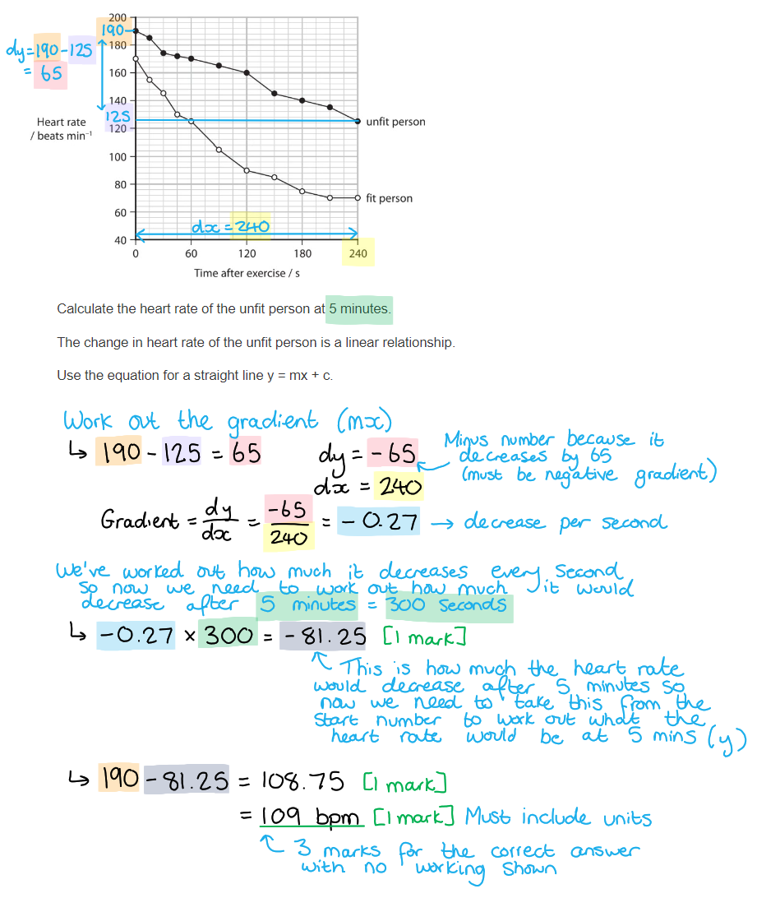

> *Another approach, using the equation y = mx + c is shown below:*

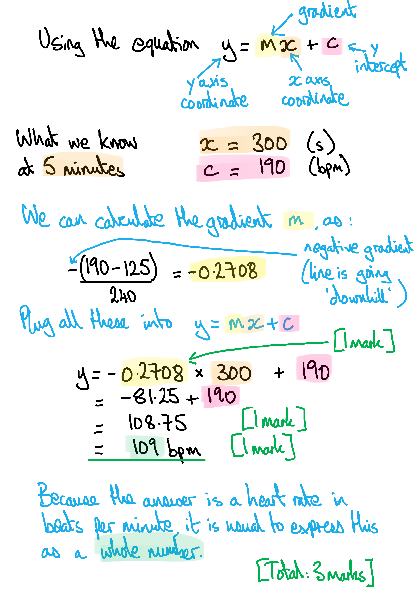

### 6((c)) — 3 marks
The difference in the time it would take for these two individuals to recover from the exercise is...

Any **three **of the following:

- Fit person has greater lung capacity; **[1 mark]**
- Fit person (can produce) a greater cardiac output; **[1 mark]**
- More effective gas exchange and transport of oxygen to muscles; **[1 mark]**
- Therefore more rapid reduction of oxygen debt; **[1 mark]**

**[Total: 3 marks]**

> *When referring to exercise you need to make sure you refer to oxygen moving to the muscles specifically because this is the part of the body that is respiring during exercise. *

> *You need to make sure your answer is comparative. That means that instead of saying "there is a reduction of oxygen debt" you need to compare and say the reduction is "**more** rapid" or words to that effect. *

### 6((d)) — 4 marks
Heart rate is controlled in response to changes in the blood, following exercise by...

- Cardiovascular control centre in the medulla oblongata; **[1 mark]**
- Detects change in blood pH / increase in lactate / CO2 (following exercise); **[1 mark]**
- As blood pH increases (more) impulse are sent via the parasympathetic nerve; **[1 mark]**
- Slowing (the rate of impulses from) the SAN; **[1 mark]**

**[Total: 4 marks]**

> *Sometimes, it's easy to see the 'question we want to see' in an exam. This question could easily be misinterpreted as asking for a description of what happens to heart rate during exercise, something that you may well have written about at length in the past, and scored well on. However, this question is not asking that.*

> *You've seen it in these commentaries before, and it bears repeating - **read the question carefully** before starting to write!*

## Q5 — medium — 11 marks · exam-questions

### 4((a)) — 2 marks
The relationship between the intensity of exercise and heart rate can be described as follows...

- As intensity increases, heart rate increases **OR** there is a positive correlation; **[1 mark]**
- There is a smaller effect on heart rate at low exercise intensity / high exercise intensity; **[1 mark]**

***Allow**** a stated effect from the data for marking point 2, e.g. the largest increase is between 6-8 a.u.*

**[Total: 2 marks]**

### 4((b)) — 3 marks
The difference in resting heart rate between the two groups is calculated as follows...

- (Heart rates for each group =) 59.543 **AND** 72.089; **[1 mark]**
- (Difference in heart rates =) 12.546; **[1 mark]**
- (Correct d.p. and units =) 12.55 **AND** bpm; **[1 mark]**

*Full marks can be awarded for the correct answer in the absence of other calculations.*

**[Total: 3 marks]**

> *Remember to convert units to the appropriate ones; here the table in the question presents volume data in both cm**3** and dm**3**, so you should always convert data to the same units prior to performing calculations. You can choose to convert both to dm**3** or both to cm**3**; it doesn't matter as long as **both are expressed in the same units**. *

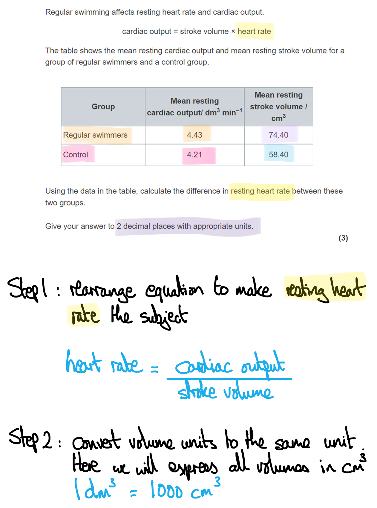

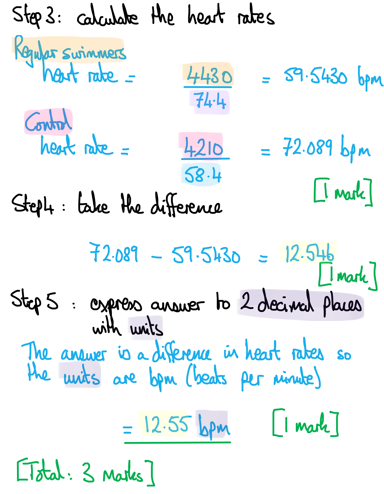

### 4((c)) — 6 marks
> *This is a **level-marked question**, meaning that it is marked **according to the levels table**. The indicative content points below the table are not to be used in the usual '**one point per mark**' way, but should be used together with the level descriptors to determine the number of marks which should be awarded. *

| **Level 1** | The answer focuses on one piece of scientific information.  Any explanation is basic, and attempts to link knowledge and understanding to the given context are limited.  **[1 mark] **= one description of data **OR** one piece of existing knowledge are given  **[2 marks]** = two descriptions of data are given **OR** two pieces of existing knowledge are given |
|---|---|
| **Level 2** | An explanation has been given, and there is some analysis of both tables.  Some links are made between scientific ideas and the answer has a logical structure.  **[3 marks]** = two pieces of data are described from across both of the data tables **AND** the data is explained using two pieces of relevant existing knowledge  **[4 marks]** = two pieces of data are described from across both of the data tables **AND** the data is explained using four pieces of relevant existing knowledge |
| **Level 3** | An explanation is supported throughout by relevant evidence of analysis, and there is evaluation of both tables.  The explanation shows a well-developed scientific reasoning, and is clear and logically structured.  **[5 marks]** = three pieces of data are described from across both of the data tables **AND** the data is explained using five pieces of relevant existing knowledge  **[6 marks]** =  at least three pieces of data are described from across both of the data tables **AND** the data is explained using seven pieces of relevant existing knowledge |

The role of the heart in responding to regular exercise is as follows...

*Indicative content relating to the first data table*

- As exercise intensity increases the heart rate increases

*Indicative content relating to the second data table*

- Regular exercise increases stroke volume
- Regular exercise has little effect on the resting cardiac output
- Heart rate will be slower in the exercise group (as an increased stroke volume will mean that fewer beats per minute are needed to achieve the same cardiac output)

*Indicative content relating to existing knowledge*

- During exercise muscles use energy / ATP
- Energy is released (mainly) during aerobic respiration
- Increased demand for glucose / oxygen (for respiration) requires increased blood circulation
- The heart (and circulation) provides bulk transport of oxygen and glucose
- During exercise there is an increased level of carbon dioxide in the blood from increased cell respiration
- Increased carbon dioxide levels lower the pH of the blood
- Increased carbon dioxide levels are detected by pH sensors in the carotid arch / chemoreceptors
- The heart (and circulation) allows waste carbon dioxide to be transported to the lungs where it can be removed from the body
- The stroke volume and the rate of beating determine the volume of blood moved
- Regular exercise increases the stroke volume so there is a greater capacity to respond to exercise by increasing  the heart rate

> *A key command from the question is to use the information **from both tables** in your answer. If you restrict your answer to just your own knowledge then you will be limited to level 1 marks.*

## Q6 — medium — 9 marks · exam-questions

### 7((a)) — 3 marks
The calculation of the percentage difference in the change in heart rate when using drug B between 5 and 12.5 minutes is as follows:

- The identification of heart rate at 5 and 12.5 minutes for drug B; **[1 mark]**

  - HR at 5 minutes = 30 or 31 inclusive **AND** HR at 12.5 minutes = 57-58 inclusive
- The calculation of percentage change for drug B; **[1 mark]**

  - (57-30) ÷ 30 x 100
- The correct answer: 90.0 (%); **[1 mark]**

*Full marks for correct answer with no working shown.*

**[Total: 3 marks]**

> *As long as the HR values you have used fall within the allowed range above (30 or 31 inclusive AND 57 - 58 inclusive) and your working out for the percentage change is correct then you will get full marks.*

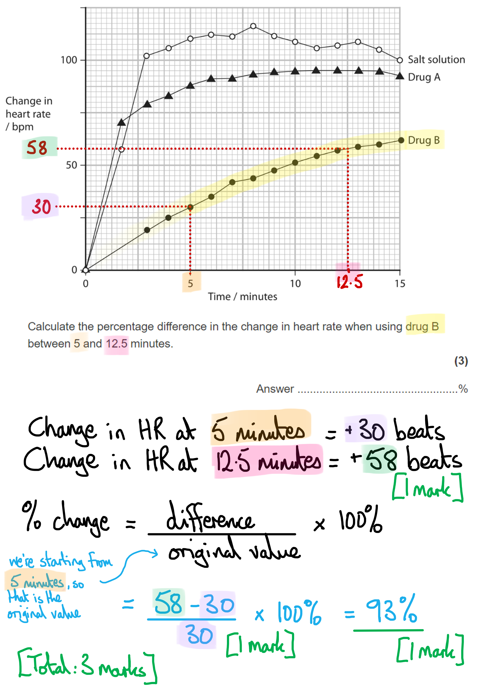

### 7((b)) — 3 marks
To compare and contrast the effects of drug A and drug B on the heart rate during the investigation, as follows:

Any** three** of the following:

**Similarities**

- Both drugs have an effect on the heart rate over the time period; **[1 mark]**
- With both having the greatest effect in the first 3 minutes; **[1 mark]**

**Differences**

- The change in heart rate with drug A levels off (between 7-10 minutes) **WHEREAS** the heart rate with drug B is still increasing at 15 minutes; **[1 mark]**
- Drug B reduces the heart rate more than drug A; **[1 mark]**

**[Total: 3 marks]**

> *Be aware of the command word(s) here. 'Compare and contrast' requires directly comparative and contrasting statements. If you just list off the effects of drug a and then drug B, you won't be making comparisons or contrasts. You don't need to give any detail about the salt solution, as that is not asked for in the question. *

### 7((c)) — 3 marks
The effect of these drugs on the control of the heart rate can be explained as follows:

Any** three** of the following:

- Stress increases the heart rate; **[1 mark]**
- Because the cardiovascular centre stimulates the sino-atrial node / SAN; **[1 mark]**
- (Both) drugs decrease the frequency of impulses from the SAN; **[1 mark]**
- Inhibiting the (change/ increase) in heart rate (compared to no drug); **[1 mark]**
- Drug B has a greater effect (on the SAN) than drug A; **[1 mark]**

**[Total: 3 marks]**

> *Take care to examine the chart carefully. The y-axis (change in heart rate) is important to take on board because it shows how the rats' heart rates change after receiving one of three treatments, compared to their heart rates before treatment. *

## Q7 — medium — 8 marks · exam-questions

### 1((a)) — 2 marks
The role of calcium ions in producing contraction of a muscle fibre is:

Any** two** of the following:

- Calcium ions / Ca2+ bind to troponin; **[1 mark]**
- This causes tropomyosin to move/change in shape; **[1 mark]**
- Allowing the myosin (head) to bind **OR** exposing the myosin binding site / allowing actomyosin bridges to form; **[1 mark]**

**[Total: 2 marks]**

### 1((b)) — 4 marks
The features of slow twitch fibres, as shown in the table, are of benefit to an Olympic marathon runner because:

Any** four** of the following:

- (Slow-twitch fibres have) many mitochondria which allows more (aerobic) respiration / more ATP is produced; **[1 mark]**
- Many myoglobin molecules allow greater (store) of oxygen; **[1 mark]**
- A larger capillary network ensures a good supply of oxygen/ glucose; **[1 mark]**
- The slow sustained contraction allows longer periods of exercise / race for longer **OR**  a decrease in fatigue/tiredness in high endurance events; **[1 mark]**

**[Total: 4 marks]**

> *Be sure to go on to **explain **each feature that you have seen in the table. Just a description isn't enough when the command word is 'explain'.*

### 1((c)) — 2 marks
Comments on the rate of heat loss during exercise include:

**Two**** of the following:**

- Exercise increases the rate of heat loss; **[1 mark]**
- Until (eventually) the rate of heat loss reaches its maximum / plateaus / levels off; **[1 mark]**

**[Total: 2 marks]**

> *This is an opposite challenge to part (b) because no explanation is required. If you spend a lot of time and energy trying to to explain what happens to heat loss during exercise and the nature of thermoregulatory control, your answer will be ignored. *

## Q8 — medium — 10 marks · exam-questions

### 6((a)) — 2 marks
(i) The correct statement is **B** because...

**Q indicates the SAN in the wall of the right atrium and P indicates the AVN between the atria and the ventricles.**

> *R indicates the bundle of His which transmits the impulse down the septum of the heart before transmitting it to the Purkinje fibres in the walls of the ventricles.*

(a) (ii) The term that describes the heart muscle's ability to initiate the cardiac cycle without the need for external nerve impulses is **C** because...

The term myogenic refers to a response that is **initiated in the muscle** rather than in the nervous system. Here the basal rate of heart contraction is initiated by the **SAN** without the need for external input from the nervous system. The nervous system has a role to play when the heart rate needs to change from this basal rate; e.g. when exercise begins.

> *Diastole refers to relaxation of the heart muscle.*

> *Polarisation refers to the difference in charge across a membrane, e.g. resting potential where the inside of a cell is more negative than the outside. This charge is reversed when depolarisation occurs.*

> *Systole refers to contraction of the heart muscle.*

**[Total: 2 marks]**

### 6((b)) — 8 marks
(i) There is a change in the cardiac cycle during this exercise because…

- The cardiovascular control centre (in the medulla oblongata) detects / receives information about a drop in blood pH / increase in blood CO2; **[1 mark]**
- The SAN is stimulated to generate more impulses per second; **[1 mark]**
- The cardiac cycle is shorter; **[1 mark]**

> *The change in blood pH is initially detected by chemoreceptors in the walls of the blood vessels, and nerve impulses are sent to the cardiovascular centre. The cardiovascular centre then sends nerve impulses via the sympathetic nervous system to tell the SAN to increase heart rate.*

(ii) The stroke volume of this football player after training is...

- 88.24; **[1 mark]**

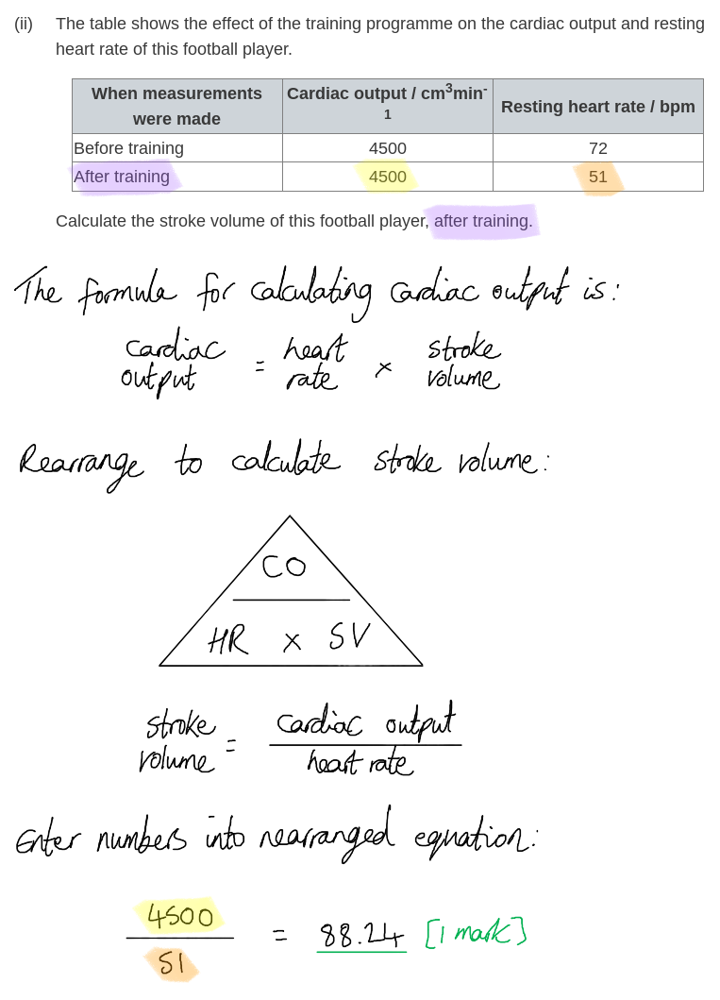

(iii) The heart rate of the footballer, using the ECG in this diagram, is...

- 154; **[1 mark]**

***Reject**** answers that are not given to the nearest whole number.*

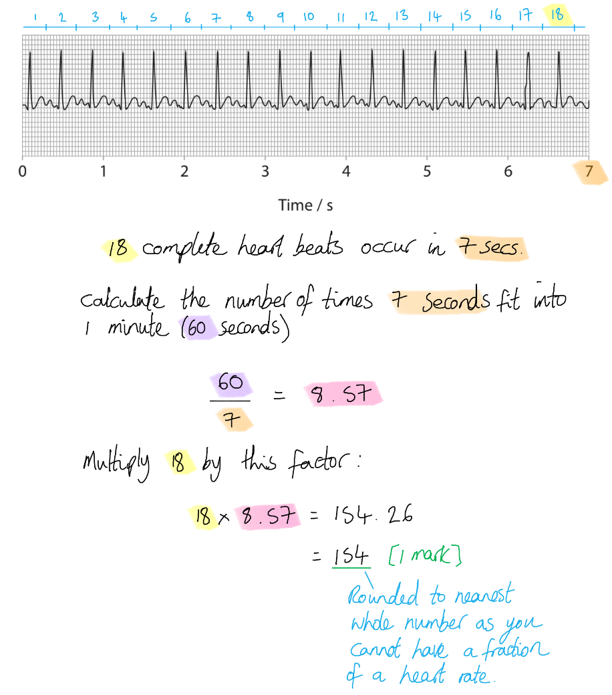

(iv) Comments on the changes that have occurred in the activity of the heart as shown in these two ECG traces include...

- There is a <u>difference</u> in the rhythm of the two traces / there is a <u>more</u> normal-looking trace in the second trace **OR** there is a <u>different</u> line shape in between the peaks (for the two traces); **[1 mark]**
- There are few<u>er</u> heart beats / the heart rate is slow<u>er</u> / there are long<u>er</u> gaps between heart beats in the second trace (compared to the first trace); **[1 mark]**
- The R wave is (very slightly) high<u>er</u> in the first trace; **[1 mark]**
- The QRS complex leads immediately into the T wave / there is no clear ST segment in the first trace **WHILE **there is (usually) a gap between the QRS complex and the T wave / a clear ST segment in the second trace; **[1 mark]**

**[Total: 3 marks]**

> *This question is all about **changes** from one trace to the other, so you need to ensure that each statement made contains a **clear difference** between the first trace and the second. Use comparative terms such as 'fewer', 'longer', 'higher' and 'while' to make these differences really clear to an examiner.*

## Q9 — medium — 20 marks · exam-questions

### 8((a)) — 3 marks
The structure of a skeletal muscle fibre can be described as follows...

Any **three** of the following:

- A muscle fibre is a single (muscle) cell; **[1 mark]**
- A skeletal muscle cell is multinucleate; **[1 mark]**
- Muscle fibres have a striated appearance due to bands of actin and myosin; **[1 mark]**
- Muscle fibres contain myofibrils in the sarcoplasm; **[1 mark]**
- Myofibrils are made up of many sarcomeres arranged end-to-end; **[1 mark]**

**[Total: 3 marks]**

### 8((b)) — 3 marks
Myokines may exert endocrine effects on organs such as the liver as follows...

Any **three** of the following:

- Myokines are released in response to a stimulus (e.g. muscle contraction or the arrival of a nerve impulse); **[1 mark]**
- Myokines are transported in the blood to <u>target</u> organs (e.g. the liver); **[1 mark]**
- Myokines bind to <u>receptors</u> on (cell surface) membranes of target cells/tissue; **[1 mark]**
- Myokines bring about effects such as changes in metabolism/rate of respiration / glycogenesis/glycogen production / glycogenolysis/glycogen breakdown / adipose tissue growth; **[1 mark]**

**[Total: 3 marks]**

> *You should be aware that the term 'endocrine' relates to the hormone system, so for myokines to exert **endocrine effects** on organs it would need to function as a hormone. Hormones are released **in response to stimuli** and are **transported in the blood** to specific **target organs** where they **bind to receptors** on the surface of target cells. They then bring about changes to the processes occurring inside the target cells. Note that the processes given as examples here in marking point 4 can all be extracted from the information in the article, which states that myokines have a role in regulating metabolism.*

### 8((c)) — 4 marks
Changes that occur to muscle structure and composition in the elderly can affect their ability to rise from a chair because...

Any **four** of the following:

- There is a decrease in muscle fibre size/number / loss of muscle mass / increased sarcopenia **SO** leading to reduced movement ability; **[1 mark]**
- There is a decrease in type II/fast twitch muscle fibres **SO** leading to a reduced ability to carry out fast motion / motion that requires high levels of power/force; **[1 mark]**
- There is a reduction in the number of satellite cells **SO** muscle repair/regeneration is reduced; **[1 mark]**
- Muscle proteins break down faster than they are synthesised **SO** muscle repair/regeneration is reduced; **[1 mark]**
- There is reduced force generation (per unit area of muscle) **SO** it is difficult to generate enough force to rise from a chair / lift the whole body; **[1 mark]**

**[Total: 4 marks]**

> *For each of the changes identified from the article here, it is essential that you also explain why this change will affect someone's ability to rise from a chair.*

### 8((d)) — 3 marks
Ca2+ binding to troponin C allows muscle fibres to contract as follows...

- The binding of Ca2+ causes a change in shape of tropomyosin **SO** exposing the myosin binding sites (on actin); **[1 mark]**
- Myosin heads bind with actin **AND** form cross bridges; **[1 mark]**
- Myosin heads pull actin towards the M line/inwards / myosin heads carry out a power stroke **SO** shortening the sarcomere; **[1 mark]**

**[Total: 3 marks]**

### 8((e)) — 2 marks
(e) ‘High-energy phosphates’ provide the energy necessary for muscle activity as follows...

Any **two** of the following:

- An example of a high energy phosphate is ATP / ADP / creatine phosphate/phosphocreatine; **[1 mark]**
- Hydrolysis of a phosphate bond in ATP releases energy; **[1 mark]**
- Creatine phosphate/phosphocreatine releases a phosphate that binds to ADP **SO** producing more ATP; **[1 mark]**

***Accept**** references to the specific role of ATP for marking point 2, e.g. "Energy released from ATP allows the release of myosin from actin / enables the power stroke."*

**[Total: 2 marks]**

> *Note that there is some confusion among A-level textbooks about the precise role of ATP in muscle contraction, and this is reflected by there being two options available for this description in the italics section above. It is worth being aware that the general consensus among the scientific literature is that ATP is needed for the **release of the myosin head from actin** and that energy from ATP is required for the **myosin heads to return to their original shape**. The myosin heads can then bind to new binding sites further along the actin and the **release of ADP and Pi **allows a new power stroke to occur.*

### 8((f)) — 3 marks
Explanations for the effects that a ‘reduction in tendon stiffness’ resulting from ageing could have on the movement at a joint could include...

Any **three** of the following:

- There is a change in tendon materials **OR** there is a loss of collagen / elastin; **[1 mark]**
- (This means that there is) a reduction in the force of contraction exerted on the joint; **[1 mark]**
- There is a reduction in the type of movement that can occur at the joint **OR** the tendon stretches less when the muscles contract/the sarcomere shortens; **[1 mark]**
- There is a decrease in the shock-absorbing ability of the tendons / the ability of the muscles to act as a spring; **[1 mark]**
- (All of the above contribute to) an increased chance of injury / a slip/fall; **[1 mark]**

**[Total: 3 marks]**

### 8((g)) — 2 marks
Myostatin might act as a negative regulator of muscle growth as follows...

- It could act as a <u>transcription factor</u>; **[1 mark]**
- It could activate genes that code for proteases / that are involved in muscle protein breakdown; **[1 mark]**
- It could inhibit muscle production/growth / differentiation of cells into muscle cells; **[1 mark]**

***Accept ****myogenesis for muscle growth.*

**[Total: 2 marks]**

> *We are told that myostatin is a **protein** and that it has a role in negative** regulation** of muscle growth. A logical conclusion is that it functions as a **transcription factor**, affecting the **expression of genes** involved in muscle production. It could increase the expression of genes that code for proteases that break down muscle protein, or it could decrease the expression of genes that are responsible for muscle growth and the specialisation of muscle cells.*

## Q10 — medium — 9 marks · exam-questions

### 2((a)) — 2 marks
(i) The correct answer is **B **(ligament) because...

**Ligaments join bones at a flexible joint. **

> *B** is incorrect because actin is a protein found in muscle fibres. *

> *C** is incorrect because a synapse is a junction between two neurones.*

> *D** is incorrect because a tendon joins muscles to bones. *

(ii) The correct answer is **B** (one) because...

**Antagonistic muscles move the bones at a joint. **

> *Muscles acting at a joint are not myogenic and tendons are not more elastic than ligaments. *

**[Total: 2 marks]**

### 2((b)) — 4 marks
(i) The correct answer is **D **because...

**Myoglobin provides oxygen for muscles.**

> *A** is incorrect because myoglobin is not an enzyme.*

> *B** is incorrect because myoglobin is not part of the sarcolemma.*

> *C** is incorrect because myoglobin does not act as an immediate source of energy.*

(ii) The muscles of a sprinter have a high percentage of fast twitch fibres because...

- As sprinting demands fast speeds (over a short distance / in a short time); **[1 mark]**
- Because fast twitch fibres contract more quickly (than slow twitch); **[1 mark]**
- Because fast twitch fibres rely on anaerobic respiration (to supply the energy for contraction) / contraction of fast twitch fibres does not rely on a supply of oxygen; **[1 mark]**

**[Total: 4 marks]**

> *For this question you do not need to go into detail about the properties of fast twitch muscles because the question has not asked for this. Always make sure to read the question carefully to avoid wasting time with unnecessary points.*

### 2((c)) — 3 marks
A comment on the results of the investigation is...

- Heart rate and lactate increase with increasing speed; **[1 mark]**
- Lactate increases more at higher speeds / heart rate increases more at lower speeds; **[1 mark]**
- The (relative) change in lactate is greater than the (relative) change in heart rate / e.g. heart rate increased by 22.5% and lactate increased by 308.5%; **[1 mark]**

**[Total: 3 marks]**

> *Always pay attention to the change of gradient of these lines. You can see that the gradient is not linear, particularly for the lactate line, and it gets steeper as the speed increases. When discussing overall trends always try to take factors like this into account because it can really elevate the quality of your answers.*

## Q11 — medium — 12 marks · exam-questions

### 7((a)) — 3 marks
The volume of air that enters the alveoli each hour is...

- Determination of tidal volume = (500-150) = 350; **[1 mark]**
- Calculation of volume of air in 1 min = 350 x 12 = 4.2 (dm3 min-1) **OR** 4200 (cm3 min-1); **[1 mark]**
- Calculation of volume of air in one hour = (4.2 x 60) = 250 dm3 hour-1 **OR** (4200 x 60) = 250000 cm3 hour-1; **[1 mark]**

**[2 marks] ***if there are no units or incorrect units*

*Full marks awarded if the correct answer only is stated*

**[Total: 3 marks]**

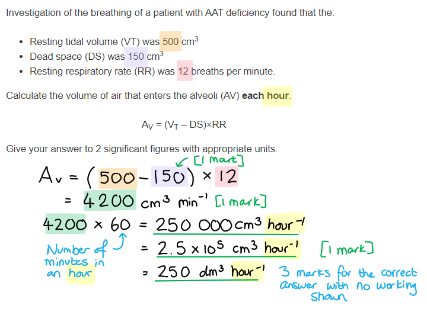

### 7((b)) — 5 marks
(i) The stage of the cardiac cycle at T on this ECG is...

- (Cardiac) diastole; **[1 mark]**

(ii) The mean heart rate shown in this ECG trace is...

- 100 bpm; **[1 mark]**

***Accept**** range 100-125 bpm*

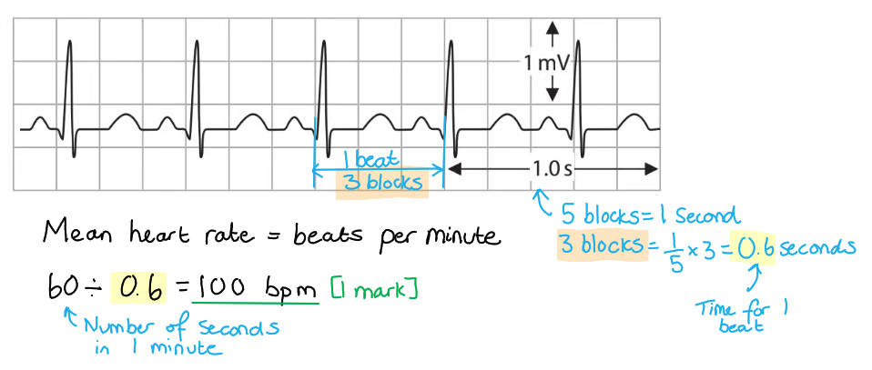

(iii) A comparison of the ECG trace of this patient with the normal ECG trace is...

Any **three **of the following:

*Similarities*

- Both traces have the same PQRST wave; **[1 mark]**
- R wave of similar height; **[1 mark]**

*Differences*

- Normal ECG shows a lower heart rate; **[1 mark]**
- In the patient trace the gap between T & P is shorter; **[1 mark]**

***Accept ****converse e.g. patient ECG shows a higher heart rate*

**[Total: 5 marks]**

> *Always pay attention to the command words for these questions. For example, compare and contrast means that you need to discuss both the similarities** and** the differences between the two traces.*

### 7((c)) — 4 marks
Adenoviruses can be used to treat AAT deficiency in a person by...

Any **four **of the following:

- Identification/isolation of the (corrected) AAT gene; **[1 mark]**
- Description of one enzyme being used to insert the gene e.g. cut the adenovirus DNA using the same restriction endonuclease / insert the gene into the adenovirus DNA using DNA ligase; **[1 mark]**
- Adenoviruses can enter host cell / adenovirus acts as a vector; **[1 mark]**
- And combine their own genetic material with that of the cell; **[1 mark]**
- Therefore a functional AAT protein can be produced; **[1 mark]**

**[Total: 4 marks]**

## Q12 — medium — 9 marks · exam-questions

### 1() — 1 marks
**Correct answer: A** — trace 1 shows a mean heart rate of approximately 72 beats per minute

**The correct answer is A**.

- Using the scale bar, the total duration of trace 1 is approximately 5 seconds
- There are 6 complete cardiac cycles in trace 1
- Mean heart rate = $\frac{6}{5}$ × 60 = 72 beats per minute

**B** is incorrect because trace 2 shows an irregular rhythm, not a regular one

**C** is incorrect because the duration of one cardiac cycle is longer in trace 1 than in trace 2 (trace 1 has a slower heart rate)

**D** is incorrect because trace 1 shows a normal, regular heart rhythm

> **[exam-tip]**
> When calculating heart rate from an ECG trace, it is more accurate to count the number of complete cardiac cycles across the full length of the trace and divide by the total time, rather than measuring a single cycle.
> 
> Readings taken from printed traces are rarely exact, so expect your answer to be approximate.

### 2() — 3 marks
> **[mark-scheme]**
> Any **three** from:
> 
> - The SAN initiates a wave of depolarisation / generates electrical impulses
> - The impulse spreads across the atria **SO **causing atrial contraction
> - The AVN delays the impulse before passing it to the bundle of His / Purkyne fibres
> - The impulse passes along the Purkyne fibres **SO **causing the ventricles to contract (from the apex upwards)
> 
> **[3 marks]**
> 
> Accept "Purkinje" for Purkyne
> 
> Accept "wave of excitation" for impulse
> 
> Reject "the brain sends signals to the heart"

> **[exam-tip]**
> Make sure you use precise terminology when describing the electrical activity of the heart. The words "signals" or "messages" will not be credited — you must use the term "impulses" or "wave of depolarisation / excitation".
> 
> It is also important to remember that the heart is myogenic, meaning the impulse originates in the SAN itself without any input from the nervous system — stating that "the brain sends signals to the heart" is a common misconception that will not gain credit.

### 3() — 2 marks
To calculate the percentage difference in cardiac output:

- Calculate the cardiac output for each group:

  - Sherpa: 58 × 92
  - Lowland: 72 × 68

5336 cm³ min⁻¹ **AND** 4896 cm³ min⁻¹ **[1 mark]**

- Calculate the percentage difference:

= `fraction numerator 5336 minus 4896 over denominator open parentheses 5336 plus 4896 close parentheses divided by 2 end fraction` × 100

= $\frac{440}{5116}$ × 100

= **8.6%** **[1 mark]**

> **[mark-scheme]**
> Award full marks for the correct answer in the absence of working
> 
> Award 1 mark for the percentage difference calculated correctly from incorrect cardiac output values

> **[exam-tip]**
> This is a two-step calculation. First calculate the cardiac output for both groups using cardiac output = heart rate × stroke volume. Then use the percentage difference formula provided. Make sure you show your working — if your final answer is wrong, you can still earn marks for correct intermediate steps.

### 4() — 3 marks
> **[mark-scheme]**
> Any **three** from:
> 
> Arguments supporting the conclusion:
> 
> - The data shows Sherpas have a higher stroke volume / cardiac output **SO** more oxygen can be delivered to respiring muscles per unit time
> - The scientists controlled for activity levels between the two groups **SO** the difference in stroke volume is more likely to be due to physiological adaptation rather than differences in fitness
> 
> Arguments against the conclusion (maximum of **two**):
> 
> - Sample sizes are small (18 and 22) and unequal, which limits the reliability of the conclusion
> - Other physiological factors may contribute to exercise ability at altitude (e.g. higher haemoglobin concentration / greater capillary density / more efficient oxygen extraction
> - The study only measures resting cardiovascular data, not performance during exercise **SO** the link between stroke volume and exercise ability is not directly demonstrated
> - No statistical test has been carried out, so it cannot be confirmed that the difference in stroke volume is statistically significant
> 
> **[3 marks]**
> 
> A maximum of 2 marks will be awarded if all points are taken from one side of the argument

> **[exam-tip]**
> "Evaluate" questions require you to consider evidence both supporting and challenging the conclusion before reaching a judgement. To access full marks, you must address both sides of the argument — a response that only argues for or only argues against the conclusion will be capped at 2 marks. Make sure your points are specific and refer directly to the data or the study design rather than making vague statements such as "the sample size is too small" without explaining why this limits the conclusion.
