# Exam Questions — Muscular Movement
**7. Respiration, Muscles & the Internal Environment** · Edexcel International A Level (IAL) Biology (YBI11)
> Source: [https://www.savemyexams.com/international-a-level/biology/edexcel/18/topic-questions/7-respiration-muscles-and-the-internal-environment/muscular-movement/exam-questions/](https://www.savemyexams.com/international-a-level/biology/edexcel/18/topic-questions/7-respiration-muscles-and-the-internal-environment/muscular-movement/exam-questions/) · 12 questions · total 123 marks

## Q1 — medium — 9 marks · exam-questions

### 3((a)) — 6 marks — command: multiple — structured — from paper Oct/Nov 2020 · WBI11/01
The cardiac cycle is the sequence of events that occurs when the heart beats.

A typical cardiac cycle takes 0.86 seconds.

The diagram illustrates the cardiac cycle.

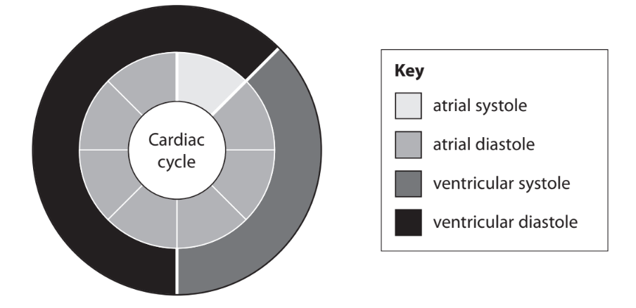

(i)  Which row of the table describes the atria and ventricles during atrial systole?

**(1)**

|   | ** ** | **Atria** | **Ventricles** |
|---|---|---|---|
| ☐ | **A** | contracted | contracted |
| ☐ | **B** | contracted | relaxed |
| ☐ | **C** | relaxed | contracted |
| ☐ | **D** | relaxed | relaxed |

(ii)  Explain why there is a delay of 0.01 seconds between atrial systole and ventricular systole.

**(2)**

(iii)  Using the information in the diagram, calculate the duration of ventricular systole in milliseconds.

Express your answer in standard form.

**(2)**

(iv)  State what proportion of the cardiac cycle is spent in ventricular diastole.

**(1)**

### 3((b)) — 3 marks — command: calculate — structured — from paper Oct/Nov 2020 · WBI11/01
A typical cardiac cycle takes 0.86 seconds.

During exercise, the heart rate increases and the duration of the cardiac cycle decreases.

Calculate the increase in heart rate if the cardiac cycle decreases by 0.4 seconds.

## Q2 — medium — 9 marks · exam-questions

### 2((a)) — 3 marks — command: calculate — structured — from paper Jan 2021 · WBI15/01
Many athletes train to improve muscle strength.

In an experiment, the effect on a muscle of 12 weeks of low or moderate training was investigated.

The graphs show the effect of 12 weeks of training on muscle strength and muscle cross-sectional area.

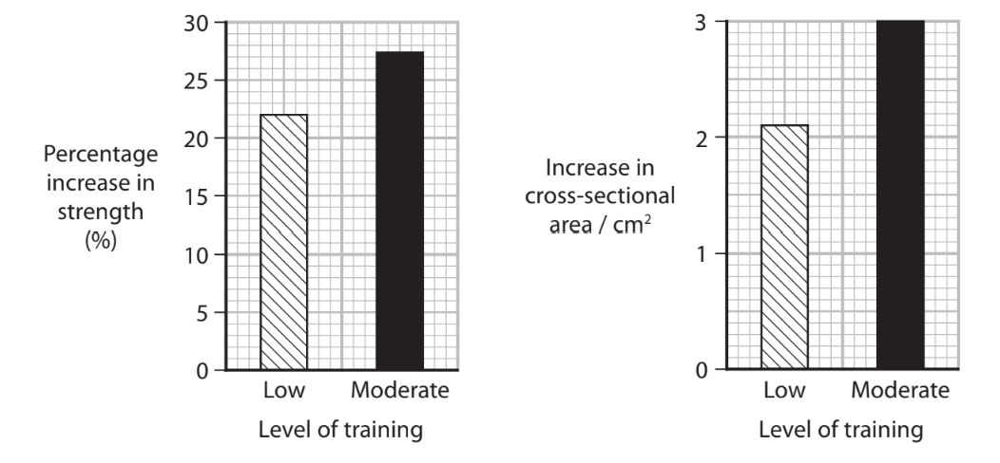

The muscle strength of the athlete before moderate training was 12.5 a.u.

Calculate the muscle strength of the athlete after 12 weeks of moderate training.

Give your answer to 3 significant figures.

### 2((b)) — 6 marks — command: multiple — structured — from paper Jan 2021 · WBI15/01
The types of muscle fibre present in samples taken before the training and after 12 weeks of low and moderate training were determined.

| **Fibre type** | **Percentage of fibres (%)** |   |   |
|---|---|---|---|
| **Before training** | **After 12 weeks of** **training** |   |   |
| **Low** | **Moderate** |   |   |
| Slow twitch | 44 | 44 | 44 |
| Fast twitch | 6 | 2 | 1 |
| Intermediate | 50 | 54 | 55 |

Intermediate fibres have structural properties between those of slow and fast twitch fibres.

(i)  Describe how the structure of an intermediate fibre will differ from the structure of a slow twitch fibre.

**(3)**

(ii)  Comment on the effect of exercise on this muscle.

Use the information in the graphs and the table to support your answer.

**(3)**

## Q3 — medium — 4 marks · exam-questions

### 4((a)) — 4 marks — command: multiple — structured — from paper Jan 2021 · WBI15/01
Skeletal muscles function to move the limbs of an organism.

The diagram represents a sarcomere from skeletal muscle.

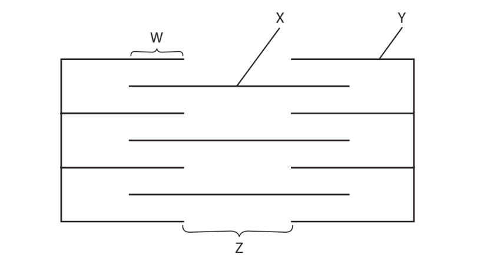

(i)  Which protein forms the structure labelled X?

**(1)**

| ☐ | **A** | Actin |
|---|---|---|
| ☐ | **B** | Myosin |
| ☐ | **C** | Tropomyosin |
| ☐ | **D** | Troponin |

(II)  Which part becomes shorter when the muscle contracts?

**(1)**

☐   **A  ** W

☐   **B**   X

☐   **C**   Y

☐    **D**   Z

(iii)  How many of the following statements are correct when a sarcomere contracts?

- Calcium ions bind to troponin
- Calcium ions are released from the sarcoplasmic reticulum
- Myosin changes shape

**(1)**

☐ **A** None

☐ **B** One

☐ **C** Two

☐ **D** Three

(iv)  Which molecule contains an enzyme that hydrolyses ATP?

**(1)**

☐ **A** Actin

☐ **B** Myosin

☐ **C** Tropomyosin

☐ **D** Troponin

## Q4 — medium — 13 marks · exam-questions

### 6((a)) — 3 marks — command: calculate — structured — from paper Jan 2021 · WBI15/01
Exercise affects the cardiac output of a person.

The graph shows the change in heart rate following exercise for an unfit person and for a fit person.

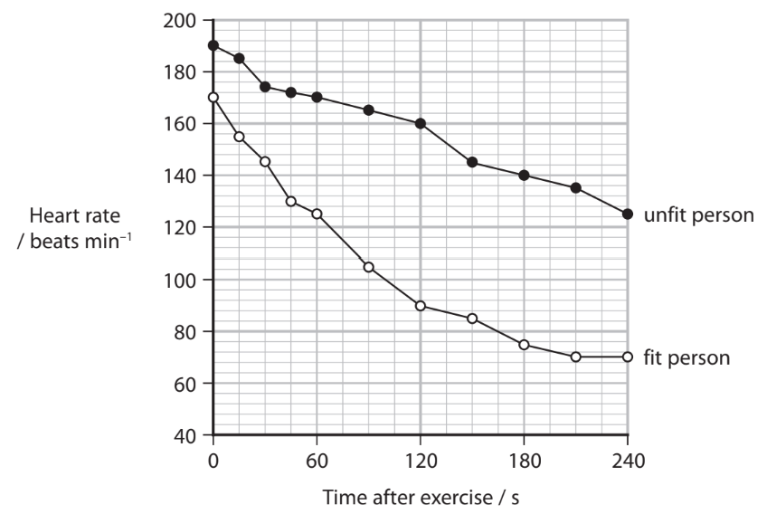

The heart rate of the unfit person decreased by 16%, 120 seconds after exercise.

Calculate the difference in percentage decrease in heart rate of these two people, 120 seconds after exercise.

Give your answer to an appropriate number of decimal places.

### 6((b)) — 3 marks — command: calculate — structured — from paper Jan 2021 · WBI15/01
Calculate the heart rate of the unfit person at 5 minutes.

The change in heart rate of the unfit person is a linear relationship.

Use the equation for a straight line y = mx + c.

### 6((c)) — 3 marks — command: explain — structured — from paper Jan 2021 · WBI15/01
Explain the difference in the time it would take for these two individuals to recover from the exercise.

### 6((d)) — 4 marks — command: describe — structured — from paper Jan 2021 · WBI15/01
Describe how heart rate is controlled in response to changes in the blood, following exercise.

## Q5 — medium — 11 marks · exam-questions

### 4((a)) — 2 marks — command: describe — structured — from paper Oct/Nov 2020 · WBI15/01
Many people swim as part of their regular exercise.

The table gives some information about the effect of the intensity of exercise on heart rat

| **Intensity of** **exercise / a.u.** | **Heart rate** **/ bpm** |
|---|---|
| 4 | 118 |
| 6 | 120 |
| 8 | 138 |
| 10 | 150 |
| 12 | 155 |
| 14 | 160 |

Describe the relationship between the intensity of exercise and heart rate.

### 4((b)) — 3 marks — command: calculate — structured — from paper Oct/Nov 2020 · WBI15/01
Regular swimming affects resting heart rate and cardiac output.

cardiac output = stroke volume × heart rate

The table shows the mean resting cardiac output and mean resting stroke volume for a group of regular swimmers and a control group.

| **Group** | **Mean resting** **cardiac output / dm****3**** min****–1** | **Mean resting stroke volume / cm****3** |
|---|---|---|
| Regular swimmers | 4.43 | 74.40 |
| Control | 4.21 | 58.40 |

Using the data in the table, calculate the difference in resting heart rate between these two groups.

Give your answer to 2 decimal places with appropriate units.

### 4((c)) — 6 marks — command: explain — structured — from paper Oct/Nov 2020 · WBI15/01
Explain the role of the heart in responding to regular exercise.

Use the information in **both** tables and your own knowledge to support your answer.

## Q6 — medium — 9 marks · exam-questions

### 7((a)) — 3 marks — command: calculate — structured — from paper Oct/Nov 2021 · WBI15/01
Researchers investigated how groups of rats, treated with drugs, responded to stress.

Groups of rats were stressed by moving them into a new environment. The rats were then treated with a salt solution, drug A or drug B.

| **Group** | **Treatment** |
|---|---|
| 1 | Salt solution |
| 2 | Drug A |
| 3 | Drug B |

The graph shows the change in mean heart rate measured over a 15‐minute period.

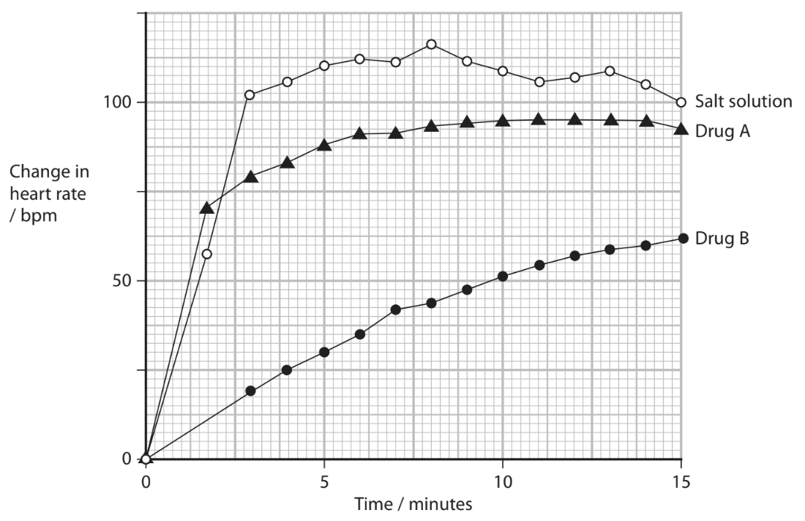

Calculate the percentage difference in the change in heart rate when using drug B between 5 and 12.5 minutes.

Answer ...................................................%

### 7((b)) — 3 marks — command: contrast — structured — from paper Oct/Nov 2021 · WBI15/01
Compare and contrast the effects of drug A and drug B on the heart rate during the investigation.

### 7((c)) — 3 marks — command: explain — structured — from paper Oct/Nov 2021 · WBI15/01
Explain the effect of these drugs on the control of the heart rate.

## Q7 — medium — 8 marks · exam-questions

### 1((a)) — 2 marks — command: describe — structured — from paper Oct/Nov 2021 · WBI15/01
Skeletal muscle is made of bundles of fibres.

Describe the role of calcium ions in producing contraction of a muscle fibre.

### 1((b)) — 4 marks — command: explain — structured — from paper Oct/Nov 2021 · WBI15/01
The table shows some features of slow and fast twitch muscle fibres.

| **Feature of fibre** | **Slow twitch fibre** | **Fast twitch fibre** |
|---|---|---|
| Number of mitochondria per fibre | Many | Few |
| Number of myoglobin molecules per fibre | Many | Few |
| Capillary network | Larger | Smaller |
| Contraction | Slow and sustained | Rapid and intense |

Olympic marathon runners have a high proportion of slow twitch fibres in their muscles.

Explain how the features of slow twitch fibres, shown in the table, are of benefit to an Olympic marathon runner.

### 1((c)) — 2 marks — command: comment — structured — from paper Oct/Nov 2021 · WBI15/01
The graph shows the rate of heat loss at rest and during exercise.

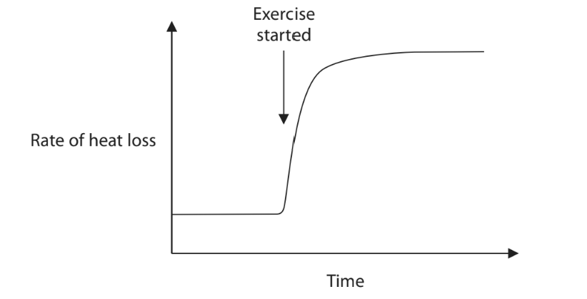

Comment on the rate of heat loss during exercise.

## Q8 — medium — 10 marks · exam-questions

### 6((a)) — 2 marks — command: multiple — structured — from paper June 2021 · WBI15/01
In humans the sinoatrial node, atrioventricular node and bundle of His are involved in regulation and coordination of the cardiac cycle.

The diagram shows a human heart.

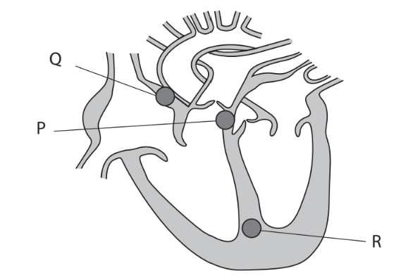

(i)  Which **one** of the following statements is correct?

**(1)**

| ☐ | **A** | Q is the sinoatrial node (SAN) and R is the atrioventricular node (AVN) |
|---|---|---|
| ☐ | **B** | Q is the sinoatrial node (SAN) and P is the atrioventricular node (AVN) |
| ☐ | **C** | Q is the bundle of His and R is the sinoatrial node (SAN) |
| ☐ | **D** | R is the sinoatrial node (SAN) and P is the Purkinje fibres |

(ii)  The electrical impulse that initiates the cardiac cycle begins without the need for a nerve impulses.

What is the term for this process?

**(1)**

☐ **A** diastole

☐ **B** myogenic

☐ **C** polarisation

☐ **D** systole

### 6((b)) — 8 marks — command: multiple — structured — from paper June 2021 · WBI15/01
A football player undertook regular exercise as part of a training programme.

During exercise there is a change in the duration of the cardiac cycle.

(i) Explain why there is a change in the cardiac cycle during this exercise.

**(3)**

(ii)  The table shows the effect of the training programme on the cardiac output and resting heart rate of this football player.

| **When measurements were made** | **Cardiac output / cm****3 ****min****-1** | **Resting heart rate / bpm** |
|---|---|---|
| Before training | 4500 | 72 |
| After training | 4500 | 51 |

Calculate the stroke volume of this football player, after training.

**(1)**

(iii)  After training, the footballer had an ECG.

This ECG trace is shown in the diagram.

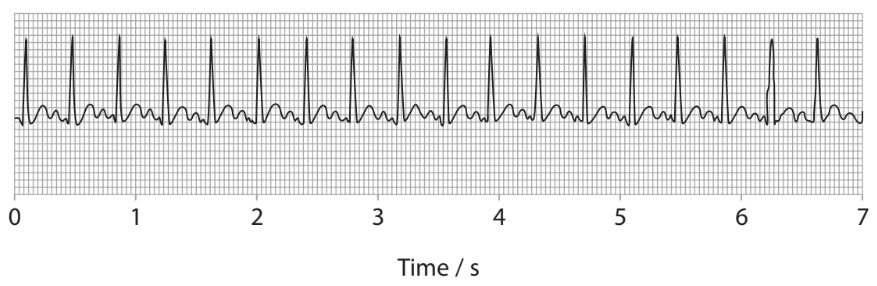

Calculate the heart rate of the footballer using the ECG in this diagram.

**(1)**

(iv)  Two hours later a second ECG was recorded.

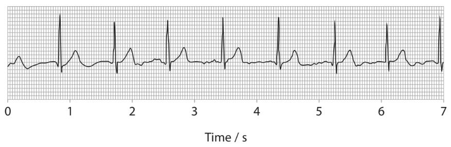

Comment on the changes that have occurred in the activity of the heart as shown in these two ECG traces.

**(3)**

## Q9 — medium — 20 marks · exam-questions

### 8((a)) — 3 marks — command: describe — structured — from paper June 2021 · WBI15/01
The [scientific document](https://cdn.savemyexams.com/uploads/2022/11/wbi15-01-que-20210430-scientific-article.pdf) you have studied is adapted from an article in Journal of Cachexia, Sarcopenia and Muscle entitled *Skeletal muscle performance and ageing. *(Tieland, 2018).

Use the information from the scientific document and your own knowledge to answer the following questions.

Describe the structure of a skeletal muscle fibre (paragraph 2).

### 8((b)) — 3 marks — command: explain — structured — from paper June 2021 · WBI15/01
Explain how myokines may exert endocrine effects on organs such as the liver (paragraph 3).

### 8((c)) — 4 marks — command: explain — structured — from paper June 2021 · WBI15/01
Explain why the changes that occur to muscle structure and composition in the elderly can affect their ability to rise from a chair (paragraph 4).

### 8((d)) — 3 marks — command: explain — structured — from paper June 2021 · WBI15/01
Explain why Ca2+ binding to troponin C allows muscle fibres to contract (paragraph 5).

### 8((e)) — 2 marks — command: explain — structured — from paper June 2021 · WBI15/01
Explain how the ‘high-energy phosphates’ provide the energy necessary for muscle activity (paragraph 11).

### 8((f)) — 3 marks — command: suggest — structured — from paper June 2021 · WBI15/01
Suggest explanations for the effects that a ‘reduction in tendon stiffness’ resulting from ageing could have on the movement at a joint (paragraph 12).

### 8((g)) — 2 marks — command: suggest — structured — from paper June 2021 · WBI15/01
Suggest how myostatin might act as a negative regulator of muscle growth (paragraph 13).

## Q10 — medium — 9 marks · exam-questions

### 2((a)) — 2 marks — command: multiple — structured — from paper Jan 2022 · WBI15/01
Muscles, bones and joints enable movement of the skeleton.

(i)  Which structure attaches one bone to another bone at a flexible joint?

**(1)**

| ☐ | **A** | Actin |
|---|---|---|
| ☐ | **B** | Ligament |
| ☐ | **C** | Synapse |
| ☐ | **D** | Tendon |

(ii)  How many of the statements about joints are correct?

**(1)**

- Antagonistic pairs of muscles move the bones at a joint
- Muscles acting on a joint are myogenic
- Tendons are more elastic than ligaments

| ☐ | **A** | 0 |
|---|---|---|
| ☐ | **B** | 1 |
| ☐ | **C** | 2 |
| ☐ | **D** | 3 |

### 2((b)) — 4 marks — command: multiple — structured — from paper Jan 2022 · WBI15/01
The athlete Usain Bolt’s world record of 9.58 seconds for the 100m men’s sprint is unbeaten.

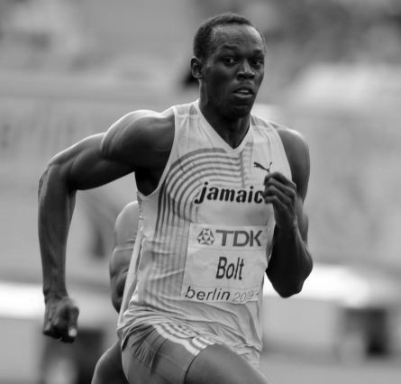

Erik van Leeuwen (GFDL <http://www.gnu.org/copyleft/fdl.html> or GFDL <http://www.gnu.org/copyleft/fdl.html>), via Wikimedia Commons

(i)  What is the role of myoglobin in muscle fibres?

**(1)**

| ☐ | **A** | It is an enzyme that reacts with myosin |
|---|---|---|
| ☐ | **B** | It is part of the sarcolemma involved in the release of calcium ions |
| ☐ | **C** | To act as an immediate source of energy |
| ☐ | **D** | To provide oxygen for muscles |

(ii)  Explain why the muscles of a sprinter have a high percentage of fast twitch fibres.

**(3)**

### 2((c)) — 3 marks — command: comment — structured — from paper Jan 2022 · WBI15/01
In an investigation, an athlete ran for 10 minutes on a running machine moving at constant speed.

The investigation was repeated at seven running speeds.

At each speed, the heart rate and lactate concentration in the blood of the athlete were measured.

The results are shown in the graph.

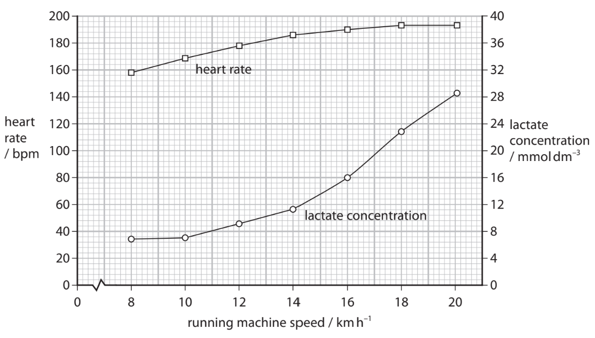

Comment on the results of this investigation.

## Q11 — medium — 12 marks · exam-questions

### 7((a)) — 3 marks — command: calculate — structured — from paper Jan 2022 · WBI15/01
Alpha‐1 antitrypsin (AAT) deficiency is an inherited disease that can affect different organ systems.

Alpha‐1 antitrypsin (AAT) is a protein produced in the liver.

Investigation of the breathing of a patient with AAT deficiency found that the:

- Resting tidal volume (VT) was 500 cm3
- Dead space (DS) was 150 cm3
- Resting respiratory rate (RR) was 12 breaths per minute.

Calculate the volume of air that enters the alveoli (AV) **each hour**.

AV = (VT – DS)×RR

Give your answer to 2 significant figures with appropriate units.

### 7((b)) — 5 marks — command: multiple — structured — from paper Jan 2022 · WBI15/01
Activity of the heart was investigated in the same patient.

The trace shows a normal electrocardiogram (ECG).

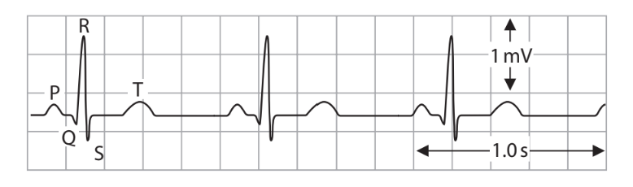

(i)Name the stage of the cardiac cycle at T on this ECG.

**(1)**

(ii) The ECG of the patient with AAT is shown in the trace.

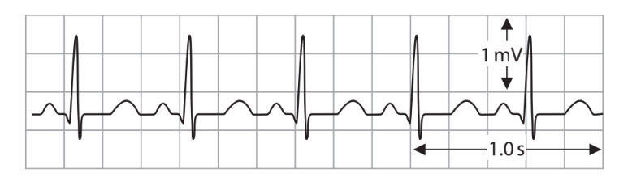

Calculate the mean heart rate shown in this ECG trace.

**(1)**

(iii)  Compare and contrast the ECG trace of this patient with the normal ECG trace.

**(3)**

### 7((c)) — 4 marks — command: explain — structured — from paper Jan 2022 · WBI15/01
One potential treatment for AAT deficiency uses adenoviruses to genetically modify cells in an affected person.

Adenoviruses contain double‐stranded DNA.

Explain how adenoviruses can be used to treat AAT deficiency in a person.

## Q12 — medium — 9 marks · exam-questions

### 1() — 1 mark — multiple_choice
The diagram shows a pair of electrocardiogram (ECG) traces.

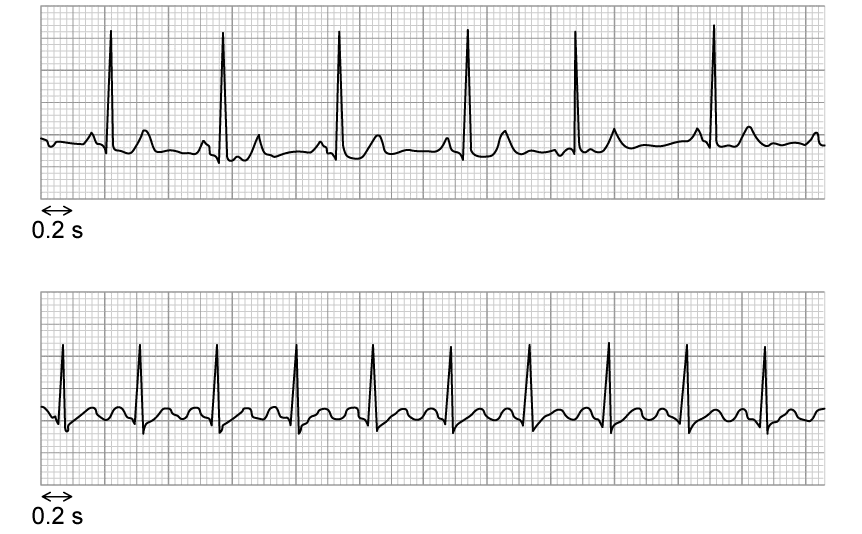

Which of the following statements about the ECG traces is correct?
- **A.** trace 1 shows a mean heart rate of approximately 72 beats per minute
- **B.** trace 2 shows a regular cardiac cycle
- **C.** the duration of one cardiac cycle is shorter in trace 1 than in trace 2
- **D.** trace 1 shows an abnormal heart rhythm

### 2() — 3 marks — command: describe — structured
Describe how the electrical activity of the heart coordinates the heartbeat.

### 3() — 2 marks — command: calculate — structured
Scientists investigated the cardiovascular fitness of Sherpa highlanders living at high altitude (4200 m) and lowland controls living at sea level. The scientists recruited Sherpa highlanders who regularly undertake intense physical activity at altitude, including farming and trekking, and lowland controls with similar activity levels at sea level.

The table shows the resting cardiovascular data for the two groups.

| Measurement | Sherpa highlanders (n = 18) | Lowland controls (n = 22) |
|---|---|---|
| Mean resting heart rate (beats min⁻¹) | 58 | 72 |
| Mean stroke volume (cm³) | 92 | 68 |

Calculate the percentage difference in cardiac output between the Sherpa highlanders and the lowland controls.

Use the equation:

percentage difference = $\frac{\text{difference between two values}}{\text{mean of the two values}}$ × 100

### 4() — 3 marks — command: evaluate — structured
At high altitude, the partial pressure of oxygen is lower, so less oxygen is available per breath.

A student concludes that the increased stroke volume of the Sherpa highlanders accounts for their increased ability to undertake intense exercise at high altitude.

Evaluate this conclusion.
