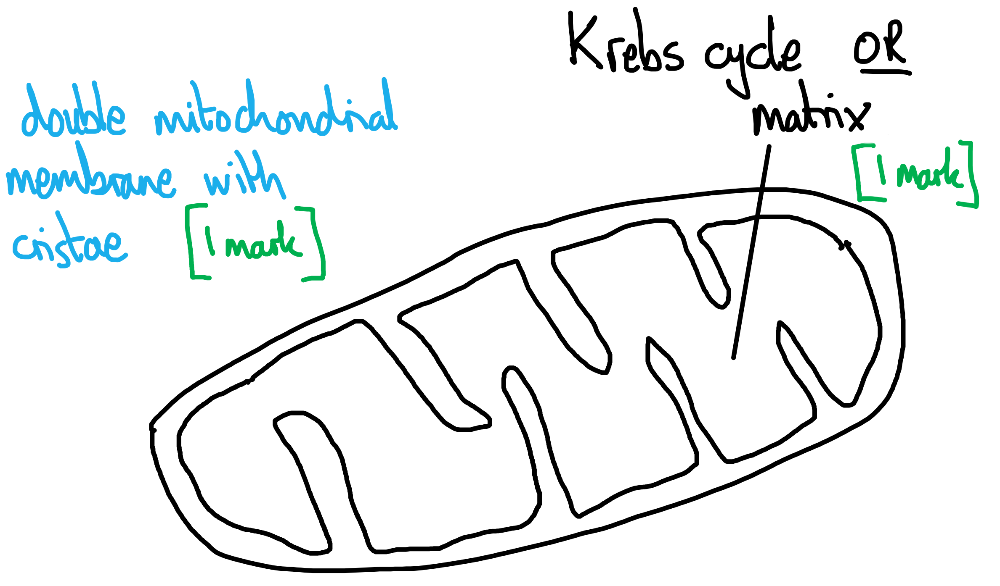
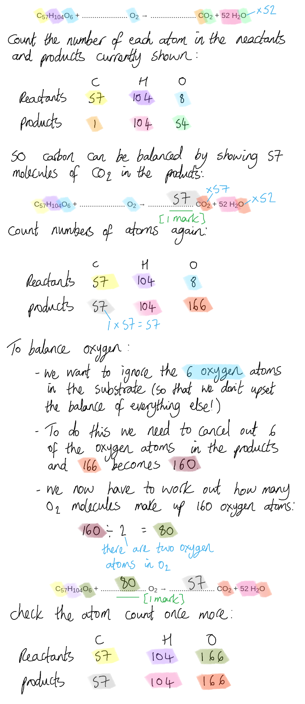
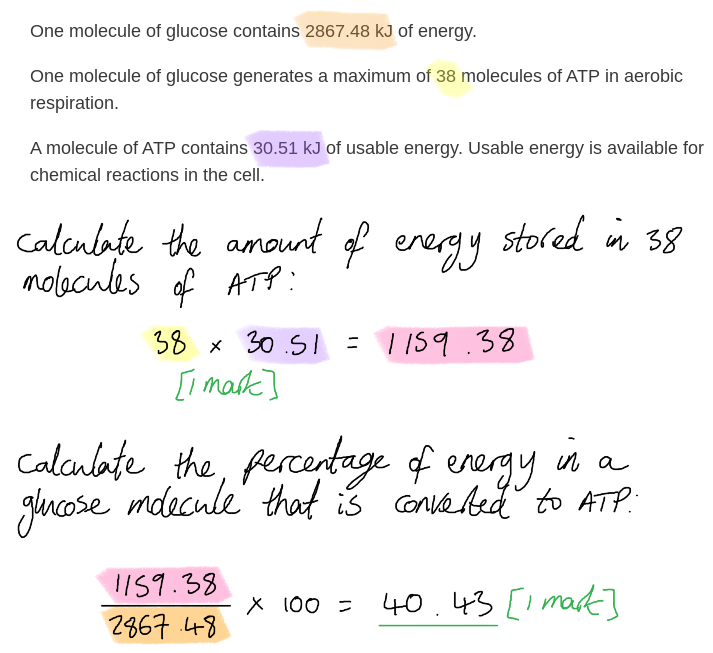
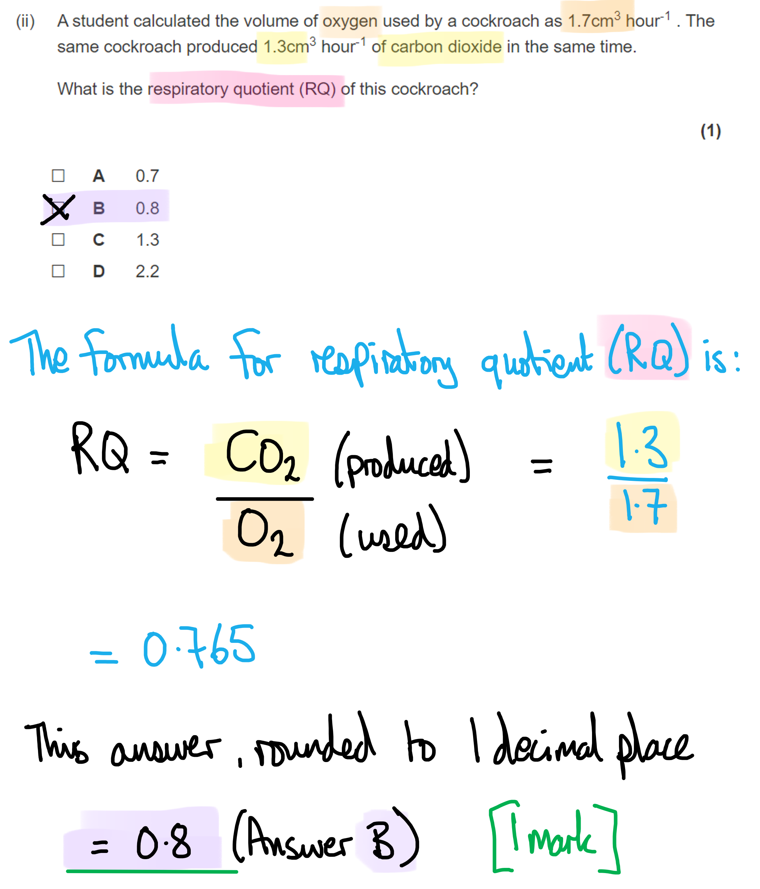
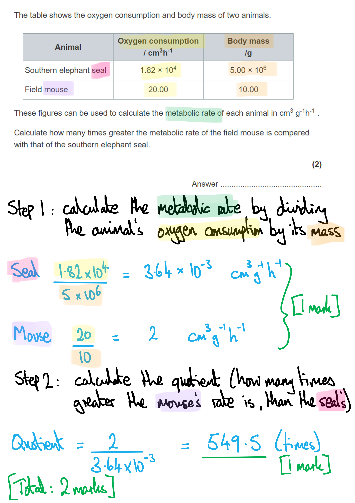
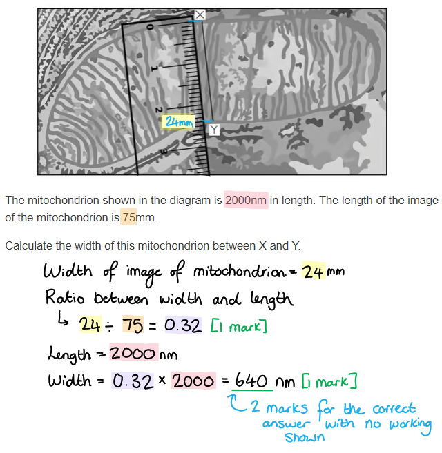

# Mark Schemes — Respiration
**7. Respiration, Muscles & the Internal Environment** · Edexcel International A Level (IAL) Biology (YBI11)

## Q1 — medium — 10 marks · exam-questions

### 1() — 2 marks
(i) The correct answer is **B** (phosphorylation of hexoses) because...

**Phosphorylation of glucose (a hexose) is the first step in glycolysis which forms part of the anaerobic and aerobic respiration pathways.**

> *Lactate is decarboxylated (A) in a process that occurs in some bacteria.*

> *Oxidation of pyruvate (C) occurs during the link reaction of aerobic respiration; hydrogen is removed from pyruvate to reduce NAD.*

> *Dephosphorylation of glucose (D) is a nonsense answer; glucose does not contain any phosphorus/phosphate.*

(ii) The correct answer is **C** because...

**Lactate is produced during anaerobic respiration in animal cells. Lactate is derived from lactic acid and acids lower the pH.**

> *A** and **B** are incorrect because lactate concentration increases during anaerobic respiration*

> *D** is incorrect because acids like lactic acid decrease the pH, not increase it.*

**[Total: 2 marks]**

### 1() — 8 marks
(a) (i) The correct answer is **A** because...

During the **link reaction** pyruvate from glycolysis is decarboxylated and dehydrogenated to produce acetate, a **2 carbon molecule** that is transported to the Krebs cycle by coenzyme A in the form of acetyl coA.

> *RUBISCO is an enzyme involved in the light independent reactions of **photosynthesis**. It catalyses the joining of carbon dioxide and RuBP.*

(ii) A labelled diagram of a mitochondrion, labelled only where the Krebs cycle occurs, has the following features...

- A double membrane with cristae; **[1 mark]**
- (Mitochondrial) matrix identified; **[1 mark]**

***Accept**** a label that says 'Krebs cycle' provided that it points to the correct location.*

(iii) The role of chemiosmosis in the synthesis of ATP is as follows...

Any **five** of the following:

- Hydrogen atoms / hydrogen ions **and** electrons are transported to the electron transport chain; **[1 mark]**
- (Hydrogen atoms are transported by) NAD **and** FAD **OR** reduced NAD/NADH **and** reduced FAD/FADH2; **[1 mark]**
- Electrons pass along the electron transport chain **and** energy is released; **[1 mark]**
- (Energy is used to) move protons/H+/hydrogen ions to the intermembrane <u>space</u>; **[1 mark]**
- Protons diffuse (back into the mitochondrial matrix) through ATP <u>synthase</u>; **[1 mark]**
- (ATP synthase catalyses) the formation of ATP from ADP and Pi / phosphorylation of ADP / ADP + Pi → ATP; **[1 mark]**

> *Because this is a direct recall question from the specification well-prepared candidates can score well in this question. Remember to keep your sentences brief and to the point, telling a story of the events of chemiosmosis. *

**[Total: 8 marks]**

## Q2 — medium — 6 marks · exam-questions

### 4((b)) — 6 marks
The defects in the electron transport chain in the individuals with mitochondrial disease are...

> *This is a level-marked question, meaning that this is is marked **according to the levels table**. The indicative content points below the table are **not** to be used in the usual '**one point one mark**' way, but should be used together with the levels table to determine the number of marks which should be awarded. *

| **Level 1**  An explanation may be attempted but with limited interpretation or analysis of the scientific information and with a focus on mainly just one piece of scientific information.  The explanation will contain basic information, with some attempt made to link knowledge and understanding to the given context. |
|---|
| **Level 2 **An explanation will be given, with occasional evidence of analysis, interpretation and/or evaluation of both pieces of scientific information.  The explanation shows some linkages and lines of scientific reasoning with some structure. |
| **Level 3 **An explanation is made that is supported throughout by sustained application of relevant evidence of analysis, interpretation and/or evaluation of both pieces of scientific information.  The explanation shows a well-developed and sustained line of scientific reasoning, which is clear and logically structured. |

*Indicative content:*

**Descriptive points**

- In individual 1, none of the treatments stimulated normal oxygen consumption
- In individual 2, pyruvate all three treatments stimulated normal oxygen consumption
- In individual 3, succinate and reduced TMPD stimulated normal oxygen consumption
- In individual 4, only reduced TMPD stimulated normal oxygen consumption

**Linking treatments to activation of different points in electron transport chain**

- Pyruvate and malate (produce reduced NAD) acts on (complex) I
- Succinate acts on (complex) II
- Reduced TMPD acts on cytochrome c

**Links to electron transport chain defect**

- Idea that there can be defects in different parts of electron transport chain
- Individual 1 defect is in or after cytochrome c
- Individual 2 defect is in before (complex) I / electron transport chain is intact
- Individual 3 defect is in (complex) I
- Individual 4 defect is in (complex) I, CoQ or III (Ignore complex II)

**[Total: 6 marks]**

> *The question specifically asks you to use the information in the diagram **and** the table as well as your own knowledge to comment on the defects in the ETC in the individuals with mitochondrial disease. If you just wrote about the electron transport chain from your knowledge, but did not use any information from either table or diagram, then you can only achieve a level 1 mark. To gain level 3 you need to refer to the information from the table and diagram and provide a detailed explanation with logic and linkage.*

## Q3 — medium — 12 marks · exam-questions

### 1((a)) — 3 marks
(a) One other product of each stage of respiration is...

| **Stage** | **One other product** |
|---|---|
| glycolysis | Pyruvate / reduced NAD/NADH; **[1 mark]** |
| Krebs cycle | Reduced NAD/NADH / reduced FAD/FADH / carbon dioxide/CO2; **[1 mark]** |
| oxidative phosphorylation | Water/H2O / NAD / FAD; **[1 mark]** |

**[Total: 3 marks]**

### 1((b)) — 2 marks
(b) The equation can be balanced as follows...

C57H104O6 + **80** O2 → **57** CO2 + 52 H2O

- 80 (O2); **[1 mark]**
- 57 (CO2); **[1 mark]**

**[Total: 2 marks]**

### 1((c)) — 5 marks
(i) The reaction that releases energy from ATP is **C** (hydrolysis of ATP) because...

**The hydrolysis of ATP into ADP and Pi releases energy.**

> *The conversion of ADP to ATP (A) requires energy.*

> *The phosphorylation of ADP (B) converts ADP to ATP, so this is the same as A and also requires energy.*

> *The removal of adenosine from ATP will produce adenosine (adenine plus a ribose sugar) and three phosphates; this is not the reaction most commonly used to release energy from ATP.*

(ii) The maximum percentage of energy in a glucose molecule that can be converted to usable energy in ATP is...

- 38 x 30.51 (= 1159.38); **[1 mark]**
- (1159.38 ÷ 2867.48 =) 40.43 (%); **[1 mark]**

*Full marks can be awarded for the correct answer in the absence of other calculations.*

(iii) The energy that is not converted to usable energy in a muscle cell...

- Is lost in the form of heat; **[1 mark]**
- (Which) raises/maintains body temperature; **[1 mark]**

> *The reactions of metabolism convert energy into usable forms inside the cells, but also release energy in the form of heat. This is not wasted energy, as it raises an organism's temperature and therefore allows chemical reactions to occur at a higher rate (due to increased kinetic energy).*

**[Total: 5 marks]**

### 1((d)) — 2 marks
Oxygen is involved in the production of ATP on the cristae in the mitochondria as follows...

- Oxygen is the terminal/final electron acceptor / accepts electrons from the electron transport chain **OR** electrons cannot be passed along the electron transport chain if there is no O2 to accept them; **[1 mark]**
- H2O is formed / oxygen combines with H+ from NAD/FAD (to form H2O); **[1 mark]**

**[Total: 2 marks]**

## Q4 — medium — 11 marks · exam-questions

### 5((a)) — 3 marks
(i) The correct answer is **B** because...

**...glycolysis takes place in the cytoplasm, whereas the link reaction and the Krebs cycle both take place in the mitochondrial matrix.**

(ii) The correct answer is **B** (0.8)...

**The calculation is shown below:**

(iii) The correct answer is **B** because...

**...when the electron transport chain is inhibited, oxygen cannot be used as a terminal electron acceptor. Respiration reverts to the anaerobic pathway only, in which lactate is produced. Therefore, lactate builds up but oxygen consumption falls.**

**[Total: 3 marks]**

### 5((b)) — 2 marks
A calculation of  how many times greater the metabolic rate of the field mouse is compared with that of the southern elephant seal is as follows:

- Calculation of mouse and seal metabolic rates / 20÷10 = 2 cm3g-1h-1 / 18 200÷5 000 000 = 0.0036 cm3g-1h-1 (0.00364); **[1 mark]**
- Quotient calculated / 2÷0.0036 = 555.56 /556 /549.45 /549 /549.5; **[1 mark]**

*A correct answer with no working gains* **[2 marks]**

**[Total: 2 marks]**

### 5((c)) — 6 marks
A discussion of the roles of the different types of respiration in these active crocodiles is as follows:

> *This is a level-marked question, meaning that it is marked according to the levels table. The indicative content points below the table are not to be used in the usual 'one point per mark' way, but should be used together with the level descriptors to determine the number of marks which should be awarded. *

| Level 1: | Description of (a minimum of 2 specific) results from the graph data. |
|---|---|
| Level 2 | All of level 1 plus a reference to the chemical nature of anaerobic or aerobic respiration. |
| Level 3 | All of level 2 plus the detailed mechanisms of anaerobic and aerobic respiration. |

**Indicative content**

- There is no direct relationship between body mass and the rate of lactate production
- The larger the size of the crocodile, the lower the rate of lactate production
- The highest rate of lactate production is found in (approx.) 20kg crocodiles
- The smallest crocodiles have the same rate of lactate production as the 50kg crocodiles
- Comment on the link between aerobic and anaerobic respiration; as oxygen supply fails to keep up with demand, anaerobic respiration provides additional ATP

**Description of named responses**

- As the crocodiles were exercising vigorously, the aerobic pathway cannot keep up (with oxygen demand)
- ATP is generated anaerobically in glycolysis using glycogen stores in the muscle
- Energy is used to allow the crocodile to move very rapidly, if only for a short time

**Chemical nature of responses**

- 1 mol of glucose from glycogen generates 3 mols of ATP and 2 mols of lactate
- A detailed description of the anaerobic pathway in glycolysis
- A detailed description of the aerobic pathways (Link reaction, Krebs cycle and electron transport chain)

**[Total: 6 marks]**

> *Because you are not told how active the crocodiles are, but you are asked to comment on the roles of aerobic and anaerobic respiration, you can assume that both types of respiration were taking place as part of this study. Behind the rather unfamiliar context, this question is merely, at its heart, asking you to distinguish between aerobic and anaerobic respiration in animals, and to do so in a level of detail that fits with the detail level in the specification. Your answer should focus on the amounts of ATP produced in each case, to fuel the crocodiles' muscular activity. *

## Q5 — medium — 7 marks · exam-questions

### 1((a)) — 2 marks
The width of the mitochondrion is...

- Mitochondria width mm ÷ length mm = 24 ÷ 75 = 0.32; **[1 mark]**
- Multiplied by the actual length in nm = 0.32 x 2000 = 640 nm; **[1 mark]**

***Accept**** any answer in the range of 619 - 667*

**[Total: 2 marks]**

### 1((b)) — 3 marks
ATP is synthesised by oxidative phosphorylation in the mitochondrion by...

Any **three **of the following:

- Reference to chemiosmosis; **[1 mark]**
- Electrons are passed between electron carriers / electron acceptors, releasing energy / passed along to electron transport chain; **[1 mark]**
- Energy is used to move protons (out of mitochondrial matrix) into the inter membranal space; **[1 mark]**
- Role of stalked particle in generation of ATP from ADP and Pi / reference to ATP synthase in generation of ATP; **[1 mark]**

**[Total: 3 marks]**

### 1((c)) — 2 marks
ATP is used to supply energy for biological processes by...

- The hydrolysis of ATP/bonds; **[1 mark]**
- Releases energy; **[1 mark]**

**[Total: 2 marks]**

> *Remember that energy is released **not produced**. *

## Q6 — medium — 10 marks · exam-questions

### 1() — 2 marks
> **[mark-scheme]**
> Any **pair** of points from (one mark per bullet point):
> 
> - pH
> - Use a buffer solution of the same pH in each test tube throughout all repeats
> 
> **OR**
> 
> - Glucose concentration
> - Prepare a single glucose solution and use it for each temperature
> 
> **OR**
> 
> - Glucose volume
> - Use a syringe / measuring cylinder to measure the same volume for each repeat
> 
> **OR**
> 
> - Volume of methylene blue
> - Use a syringe / pipette to measure a set volume for each test
> 
> **OR**
> 
> - Batch of yeast
> - Use samples from the same batch of yeast suspension for all repeats
> 
> **OR**
> 
> - Concentration of yeast
> - Prepare a single yeast suspension and ensure that it is thoroughly mixed before each test
> 
> **[2 marks]**
> 
> The method mark may only be awarded if it is appropriately paired with the named variable
> 
> Accept concentration of methylene blue and the idea of using a single source or bottle for 2 marks.

> **[exam-tip]**
> Be specific about how you would control the variable you have chosen — answers like "use the same volume of glucose" will not gain the second mark, because they do not describe how this would be achieved. State the equipment used (e.g. syringe / pipette / measuring cylinder) or the practical step taken (e.g. preparing a single stock solution).
> 
> Be careful not to confuse concentration and volume — these are not interchangeable. Concentration refers to how much solute is dissolved in a given volume of solvent, whereas volume refers to how much solution is used.

### 2() — 2 marks
> **[mark-scheme]**
> - To allow the yeast to reach the target temperature / the temperature of the water bath **[1 mark]**
> - So that the yeast reaches a steady/consistent rate of respiration before measurement begins **[1 mark]**
> 
> Do not accept "equilibrate" alone without reference to reaching the correct temperature for MP1.

### 3() — 2 marks
> **[mark-scheme]**
> Suggest:
> 
> - The time taken for the methylene blue to turn colourless would be shorter / the colour change would be faster **[1 mark]**
> 
> Explain:
> 
> - At higher temperature molecules have more kinetic energy / move around at a higher speed **SO** more frequent collisions would occur / enzyme-substrate complexes would form at a higher rate **[1 mark]**

> **[exam-tip]**
> This question asks for a different type of explanation to that in part (b). Don't repeat your answer about reaching the target temperature; instead, focus on the biological mechanism. Explain what happens to molecules and enzymes when temperature is higher, and how this affects the speed of the reaction. The key is understanding how kinetic energy affects enzyme activity, not just that temperature needs to be controlled.

### 4() — 2 marks
To calculate the rate of respiration:

rate = $\frac{1}{\text{time}}$ **[1 mark]**

- Calculate the mean time for colour change:

mean time = $\frac{84+79+86}{3}$

= $\frac{249}{3}$

= 83 s

- Calculate the rate:

rate = $\frac{1}{83}$

= 0.0120 s-1

= **1.2 x 10****-2**** s****-1** **[1 mark]**

> **[mark-scheme]**
> Accept correct final answer in standard form without working shown for 2 marks
> 
> Award a maximum of 1 mark for answers not written in standard form.

> **[exam-tip]**
> When the only information you have is how long it took for something to happen, calculate the rate using rate = 1 ÷ time.
> 
> This gives you units of s⁻¹ (per second), which represents how frequently the process would complete. For example, a rate of 0.012 s⁻¹ means the reaction would complete 0.012 times per second, or roughly once every 83 seconds.
> 
> Don't confuse this with rates that measure amounts of substance over time (like ml min-1).

### 5() — 2 marks
> **[mark-scheme]**
> - Trial 2 / 189 s is an anomaly / outlier / is much higher than the other two values **OR** the result from trial 2 should have been ignored / should not have been included in the mean **[1 mark]**
> - Including the anomaly in the calculation makes the mean higher than the true value / makes the mean inaccurate **[1 mark]**

> **[exam-tip]**
> Anomalous results are measurements that do not fit the pattern of the other results, and are likely caused by something going wrong in that particular trial (e.g. contamination, a measurement mistake or equipment malfunction). They are different from the small variation you would expect between repeats.
> 
> When you have three results and one is much larger or smaller than the others, it is likely to be anomalous and should be excluded before calculating a mean.

## Q7 — medium — 9 marks · exam-questions

### 1() — 1 marks
**Correct answer: B** — carbon dioxide

> **[mark-scheme]**
> **The correct answer is B**.
> 
> - At each point labelled X, a decarboxylation reaction occurs, removing one carbon from the chain — first as citrate (6C) is converted to the intermediate compound (5C), then as the intermediate compound (5C) is converted to oxaloacetate (4C), releasing one molecule of carbon dioxide at each step
> 
> **A** is incorrect because NAD is not a product of the Krebs cycle — it is a coenzyme that enters the cycle and is converted to reduced NAD
> 
> **C** is incorrect because acetate is a component of acetyl coenzyme A, which enters the cycle at the start — it is not released during the cycle
> 
> **D** is incorrect because water is not produced in the Krebs cycle — it is produced during oxidative phosphorylation in the electron transport chain.

### 2() — 3 marks
> **[mark-scheme]**
> (i) The link reaction and Krebs cycle take place in:
> 
> - The (mitochondrial) matrix **[1 mark]**
> 
> (ii) The role of the link reaction and Krebs cycle in the complete oxidation of glucose is as follows:
> 
> - Carbon compounds are dehydrogenated / hydrogen is removed from carbon compounds **[1 mark]**
> - Hydrogen is transferred to coenzymes / NAD and FAD are reduced to form reduced NAD and reduced FAD **[1 mark]**
> 
> Accept "hydrogen atoms are transferred to NAD and FAD" for MP2

> **[exam-tip]**
> "Explain the role" questions require you to go beyond simply describing what happens. In this question, you need to connect the reactions of the link reaction and Krebs cycle to the concept of oxidation. Remember that oxidation means loss of electrons — in this context, hydrogen atoms (carrying electrons) are removed from carbon compounds at dehydrogenation steps. To access both marks, make sure you identify both the removal of hydrogen from the carbon compounds and where that hydrogen goes — i.e. that it is used to reduce coenzymes NAD and FAD (which then have a role in oxidative phosphorylation).

### 3() — 1 marks
**Correct answer: B** — 0.7

> **[mark-scheme]**
> **The correct answer is B**.
> 
> RQ = CO2 produced ÷ O2 consumed
> 
> = 14 ÷ 20
> 
> = 0.7
> 
> **A** is incorrect because 0.50 is not the result of a correct RQ calculation from this equation.
> 
> **C** is incorrect because an RQ of 1 is characteristic of carbohydrate respiration, not lipid respiration.
> 
> **D** is incorrect because 1.43 is the inverse of the correct answer (20 ÷ 14), a common error where candidates divide O2 by CO2 instead of CO2 by O2.

> **[exam-tip]**
> Lipids always have an RQ below 1 because they require more oxygen relative to the CO2 they produce.

### 4() — 2 marks
To calculate the percentage of energy converted to ATP:

- Calculate the total energy stored in the ATP yield:

106 × 30.6 = 3243.6 kJ

- Calculate the percentage of energy converted:

= $\frac{3243.6}{9430}$ × 100

= 34.39

- Round to 3 significant figures:

=  **34.4** %

> **[mark-scheme]**
> Award marks as follows:
> 
> - $\frac{3243.6}{9430}$ **OR** 34.39 **[1 mark]**
> - 34.4 **[1 mark]**
> 
> Award full marks for the correct answer in the absence of working.

> **[exam-tip]**
> Pay close attention to the instruction about significant figures — "three significant figures" means 34.4, not 34 or 34.39.

### 5() — 2 marks
> **[mark-scheme]**
> Any **two** from:
> 
> - Energy is lost as heat during respiration
> - Energy is required during glycolysis / for the phosphorylation of glucose
> - Energy is required to transport pyruvate from the cytoplasm into the mitochondria
> - Energy is required to maintain the proton gradient across the inner mitochondrial membrane
> - Protons leak across the inner mitochondrial membrane without passing through ATP synthase
> 
> **[2 marks]**

> **[exam-tip]**
> "Suggest" questions require you to apply your biological knowledge to a situation that may not be directly covered in the specification. Here, you are not expected to recall a single specific answer — any biologically valid reason why energy transfer is less than 100% efficient will be credited, provided it is specific to the process of respiration. Vague answers such as "some energy is wasted" will not score — you need to identify a precise point in the respiratory pathway where energy is lost or or used to drive other processes.
