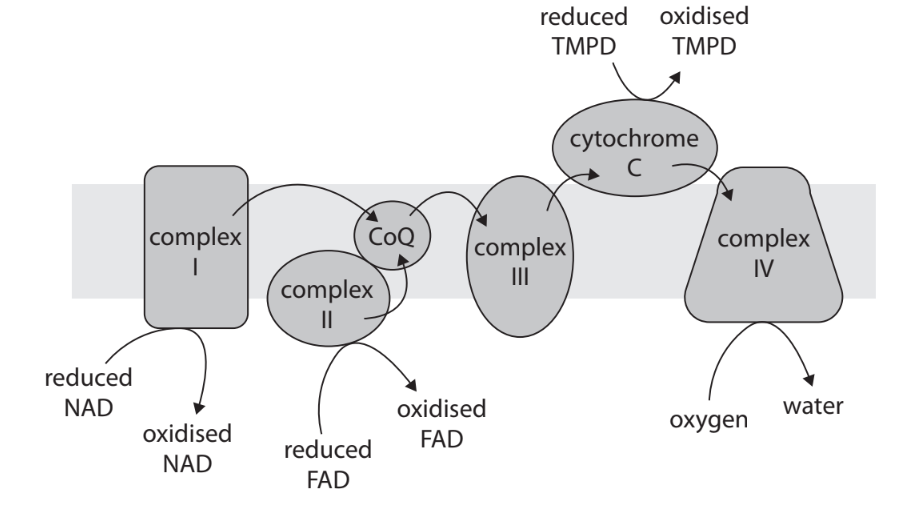
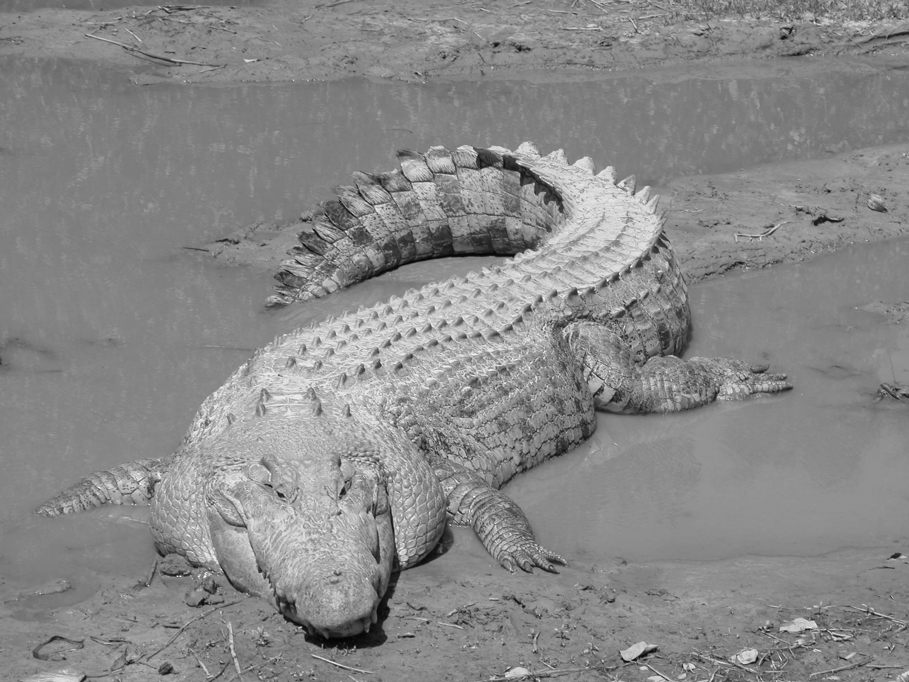
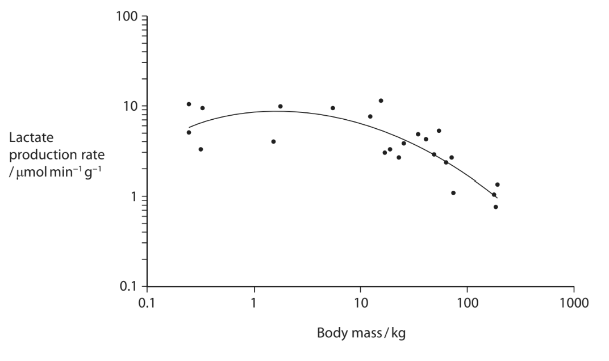
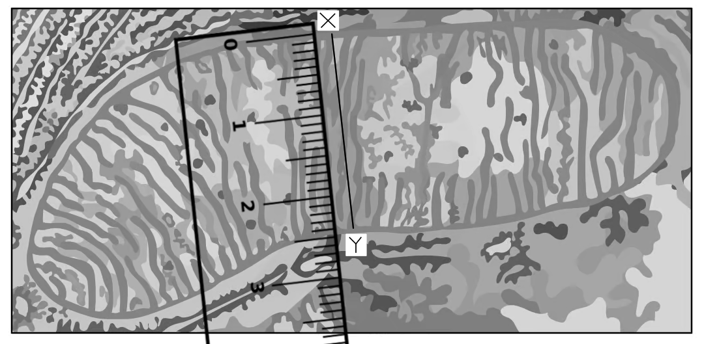
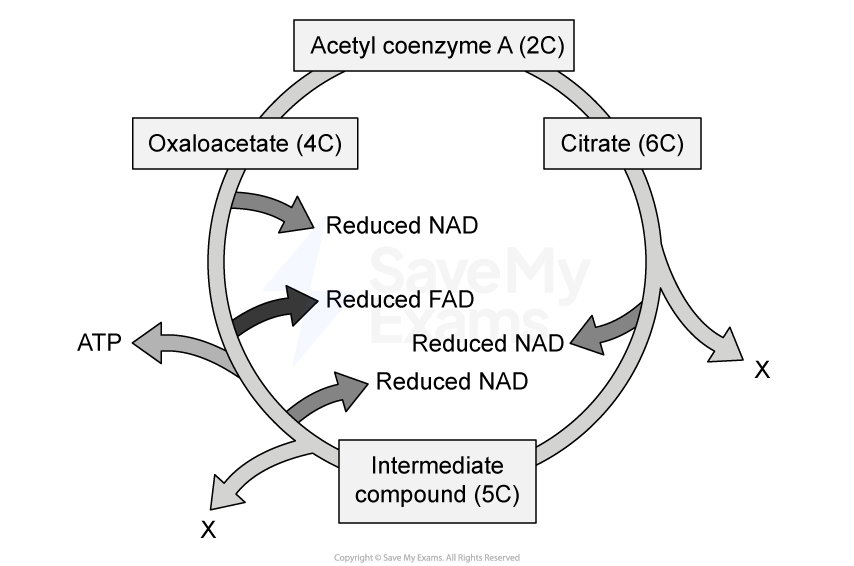

# Exam Questions — Respiration
**7. Respiration, Muscles & the Internal Environment** · Edexcel International A Level (IAL) Biology (YBI11)
> Source: [https://www.savemyexams.com/international-a-level/biology/edexcel/18/topic-questions/7-respiration-muscles-and-the-internal-environment/respiration/exam-questions/](https://www.savemyexams.com/international-a-level/biology/edexcel/18/topic-questions/7-respiration-muscles-and-the-internal-environment/respiration/exam-questions/) · 7 questions · total 65 marks

## Q1 — medium — 10 marks · exam-questions

### 1() — 2 marks — command: multiple — structured — from paper Oct/Nov 2020 · WBI15/01
In cells, energy can be released from substrates by anaerobic and aerobic respiration.

Most eukaryotic cells can respire anaerobically.

(i)  Which of the following describes a step in the process of anaerobic respiration?

**(1)**

☐ **A** decarboxylation of lactate

☐ **B** phosphorylation of hexoses

☐ **C** oxidation of pyruvate

☐ **D** removal of phosphate groups from glucose

(ii)  What happens to the lactate concentration during a period of anaerobic respiration?

**(1)**

☐ **A** decreases, causing a decrease in blood pH

☐ **B** decreases, causing an increase in blood pH

☐ **C** increases, causing a decrease in blood pH

☐ **D** increases, causing an increase in blood pH

### 1() — 8 marks — command: multiple — structured — from paper Oct/Nov 2020 · WBI15/01
Most eukaryotic cells are also able to respire aerobically.

(i)  How do respiratory substrates enter the Krebs cycle?

**(1)**

☐ **A** as molecules containing 2 carbon atoms produced by the link reaction

☐ **B** as molecules containing 3 carbon atoms produced by the link reaction

☐ **C** as molecules containing 2 carbon atoms produced by RUBISCO

☐ **D** as molecules containing 3 carbon atoms produced by RUBISCO

(ii)  Draw a diagram of a mitochondrion.

Label only the part of the mitochondrion where the Krebs cycle occurs.

**(2)**

(iii)  Describe the role of chemiosmosis in the synthesis of ATP.

**(5)**

## Q2 — medium — 6 marks · exam-questions

### 4((b)) — 6 marks — command: comment — structured — from paper Jan 2021 · WBI15/01
Inherited mitochondrial diseases affect muscle function.

The diagram shows the electron transport chain in a mitochondrion.

In an investigation, samples of muscle tissue from healthy individuals and from four individuals with mitochondrial disease were collected.

The function of mitochondria, when these samples were treated with different substrates, was investigated.

Treating muscle tissue from healthy individuals with:

- Pyruvate and malate increases the production of reduced NAD
- Succinate increases the production of reduced FAD
- Reduced TMPD increases the reduction of cytochrome c.

The oxygen consumption of the muscle tissue samples from healthy individuals and from four individuals with mitochondrial disease were recorded.

The results are shown in the table.

| **  Sample taken from** | **Oxygen consumption in the presence of each treatment / pmol O****2 ****min****-1**** mg****-1**** of muscle tissue** |   |   |
|---|---|---|---|
| **pyruvate and malate** | **succinate** | **reduced TMPD** |   |
| Individual 1 | 3.0 | 3.5 | 13.0 |
| Individual 2 | 18.0 | 10.0 | 60.0 |
| Individual 3 | 6.5 | 14.0 | 51.0 |
| Individual 4 | 7.5 | 6.0 | 40.0 |
| Healthy individuals | 21.0 ± 5.0 | 13.5 ± 4.5 | 63.0 ± 20.0 |

The results of this investigation can be used to identify the defects in the electron transport chain of individuals with mitochondrial disease.

Comment on the defects in the electron transport chain in the individuals with mitochondrial disease.

## Q3 — medium — 12 marks · exam-questions

### 1((a)) — 3 marks — command: complete — structured — from paper June 2021 · WBI15/01
Aerobic respiration involves four main stages:

glycolysis, link reaction, Krebs cycle and oxidative phosphorylation.

One product of all three stages shown in the table is ATP (adenosine triphosphate).

Complete the table to show one other product of each stage.

| **Stage** | **One other product** |
|---|---|
| glycolysis |   |
| Krebs cycle |   |
| oxidative phosphorylation |   |

### 1((b)) — 2 marks — command: complete — structured — from paper June 2021 · WBI15/01
An incomplete equation for the aerobic respiration of a substrate is shown below.

Complete the equation by inserting the numbers on the dotted lines to balance it.

C57H104O6 + ...................... O2 → ...................... CO2 + 52 H2O

### 1((c)) — 5 marks — command: multiple — structured — from paper June 2021 · WBI15/01
One molecule of glucose contains 2867.48 kJ of energy.

One molecule of glucose generates a maximum of 38 molecules of ATP in aerobic respiration.

A molecule of ATP contains 30.51 kJ of usable energy. Usable energy is available for chemical reactions in the cell.

(i)  Which reaction releases energy from ATP?

**(1)**

| ☐ | **A** | the conversion of ADP to ATP |
|---|---|---|
| ☐ | **B** | the phosphorylation of ADP |
| ☐ | **C** | the hydrolysis of ATP |
| ☐ | **D** | the removal of adenosine molecules from ATP |

(ii)  Calculate the maximum percentage of energy in a glucose molecule that can be converted to usable energy in ATP.

**(2)**

(iii)  Describe what happens to the energy that is not converted to usable energy in a muscle cell.

**(2)**

### 1((d)) — 2 marks — command: describe — structured — from paper June 2021 · WBI15/01
Describe how oxygen is involved in the production of ATP on the cristae in the mitochondria.

## Q4 — medium — 11 marks · exam-questions

### 5((a)) — 3 marks — command: multiple — structured — from paper Oct/Nov 2021 · WBI15/01
Animals use aerobic and anaerobic respiration to produce ATP.

Aerobic respiration has three stages where reactions occur between enzymes and substrates.

(i)  Which row of the table shows the location of each stage?

**(1)**

|   | **Glycolysis** | **Link reaction** | **Krebs cycle** |
|---|---|---|---|
| ☐  **A** | cytoplasm | cytoplasm | cytoplasm |
| ☐  **B** | cytoplasm | mitochondrial matrix | mitochondrial matrix |
| ☐  **C** | mitochondrial matrix | cytoplasm | cytoplasm |
| ☐  **D** | mitochondrial matrix | mitochondrial matrix | mitochondrial matrix |

(ii) A student calculated the volume of oxygen used by a cockroach as 1.7cm3 hour-1 . The same cockroach produced 1.3cm3 hour-1 of carbon dioxide in the same time.

What is the respiratory quotient (RQ) of this cockroach?

**(1)**

| ☐ | **A** | 0.7 |
|---|---|---|
| ☐ | **B** | 0.8 |
| ☐ | **C** | 1.3 |
| ☐ | **D** | 2.2 |

(iii)  Hydramethylnon is an insecticide that is used to treat termite infestations.

Hydramethylnon inhibits the electron transport chain.

Which row of the table shows the expected changes caused by hydramethylnon?

**(1)**

|   | **Oxygen consumption** | **Lactate production** |
|---|---|---|
| ☐  **A** | decreases | decreases |
| ☐  **B** | decreases | increases |
| ☐  **C** | increases | decreases |
| ☐  **D** | increases | increases |

### 5((b)) — 2 marks — command: calculate — structured — from paper Oct/Nov 2021 · WBI15/01
The table shows the oxygen consumption and body mass of two animals.

| **Animal** | **Oxygen consumption** **/ cm****3****h****-1** | **Body mass** **/g** |
|---|---|---|
| Southern elephant seal | 1.82 × 104 | 5.00 × 106 |
| Field mouse | 20.00 | 10.00 |

These figures can be used to calculate the metabolic rate of each animal in cm3 g-1h-1 .

Calculate how many times greater the metabolic rate of the field mouse is compared with that of the southern elephant seal.

Answer .............................................

### 5((c)) — 6 marks — command: discuss — structured — from paper Oct/Nov 2021 · WBI15/01
The photograph shows a crocodile* *(*Crocodylus porosus*) that lives in saltwater habitats.

Obtained from Molly Ebersold of the St. Augustine Alligator Farm, Public domain, via Wikimedia Commons

An investigation measured the lactate production rate of these crocodiles when they were active.

The graph shows the results of this investigation.

Each plotted point on the graph represents a single crocodile.

Discuss the roles of the different types of respiration in these active crocodiles.

Use the information in the graph and your own knowledge to support your answer.

## Q5 — medium — 7 marks · exam-questions

### 1((a)) — 2 marks — command: calculate — structured — from paper Jan 2022 · WBI15/01
The photograph shows a transmission electron micrograph of a mitochondrion and surrounding cytoplasm.

A ruler that measures in cm has been included for scale.

The mitochondrion shown in the diagram is 2000nm in length. The length of the image of the mitochondrion is 75mm.

Calculate the width of this mitochondrion between X and Y.

### 1((b)) — 3 marks — command: describe — structured — from paper Jan 2022 · WBI15/01
Describe how ATP is synthesised by oxidative phosphorylation in the mitochondrion.

### 1((c)) — 2 marks — command: describe — structured — from paper Jan 2022 · WBI15/01
Describe how ATP is used to supply energy for biological processes.

## Q6 — medium — 10 marks · exam-questions

### 1() — 2 marks — command: describe — structured
A student investigated the effect of temperature on the rate of respiration in yeast using the redox indicator methylene blue.

Method:

1. Place 5 cm³ of yeast suspension and a sample of glucose solution in a test tube
2. Place the test tube in a water bath at 30°C and leave for 5 minutes
3. Add 1 cm³ of methylene blue, shake gently and immediately start a stopwatch
4. Record the time taken for the blue colour to disappear
5. Repeat at 10°C, 20°C, 40°C, 50°C and 65°C

The student controlled the volume of yeast suspension by using 5 cm³ throughout the investigation.

State one other variable that must be controlled in this investigation and describe how the student should control it.

### 2() — 2 marks — command: explain — structured
Explain why the student left the test tube in the water bath for 5 minutes before adding the methylene blue.

### 3() — 2 marks — command: suggest — structured
Suggest and explain what would happen to the results if the student did not wait 5 minutes before adding the methylene blue at 10°C.

### 4() — 2 marks — command: calculate — structured
The student repeated the experiment three times at 40 °C. The times taken for the change from blue to turn colourless were:

- Trial 1: 84 seconds
- Trial 2: 79 seconds
- Trial 3: 86 seconds

Calculate the rate of respiration at 40 °C. Give your answer in standard form. Show your working.

### 5() — 2 marks — command: explain — structured
A student suggested that the investigation could be improved by repeating each temperature three times and calculating a mean. The table below shows their results at 20 °C.

| Trial | Time for methylene blue to decolourise (s) |
|---|---|
| 1 | 142 |
| 2 | 189 |
| 3 | 145 |

The student calculated the mean time as 158.7 s.

Explain why this mean is likely to be incorrect.

## Q7 — medium — 9 marks · exam-questions

### 1() — 1 mark — multiple_choice
The diagram shows a representation of the Krebs cycle.

Which molecule is produced at the points labelled X in the diagram?
- **A.** NAD
- **B.** carbon dioxide
- **C.** acetate
- **D.** water

### 2() — 3 marks — command: multiple — structured
The link reaction and Krebs cycle are stages in aerobic respiration that follow glycolysis.

(i) State the precise location where the link reaction and Krebs cycle take place.

[1]

(ii) Describe the role of the link reaction and Krebs cycle in the complete oxidation of glucose.

[2]

### 3() — 1 mark — multiple_choice
The equation below shows the aerobic respiration of a lipid, myristic acid.

C14H28O2 + 20O2 → 14CO2 + 14H2O

Which of the following shows the respiratory quotient (RQ) when myristic acid is used in aerobic respiration?
- **A.** 0.5
- **B.** 0.7
- **C.** 1
- **D.** 1.43

### 4() — 2 marks — command: calculate — structured
The following information is available about myristic acid and ATP.

- The complete oxidation of one molecule of myristic acid yields 106 molecules of ATP
- The complete oxidation of one molecule of myristic acid releases 9430 kJ of energy
- One molecule of ATP yields 30.6 kJ of energy

Calculate the percentage of energy in this lipid molecule that can be converted to energy in the form of ATP.

Give your answer to three significant figures.

### 5() — 2 marks — command: suggest — structured
Suggest why the percentage of energy transferred from myristic acid to ATP is less than 100%.
