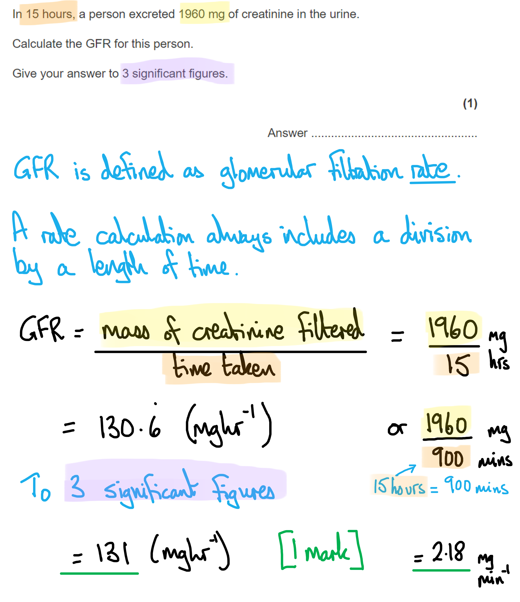
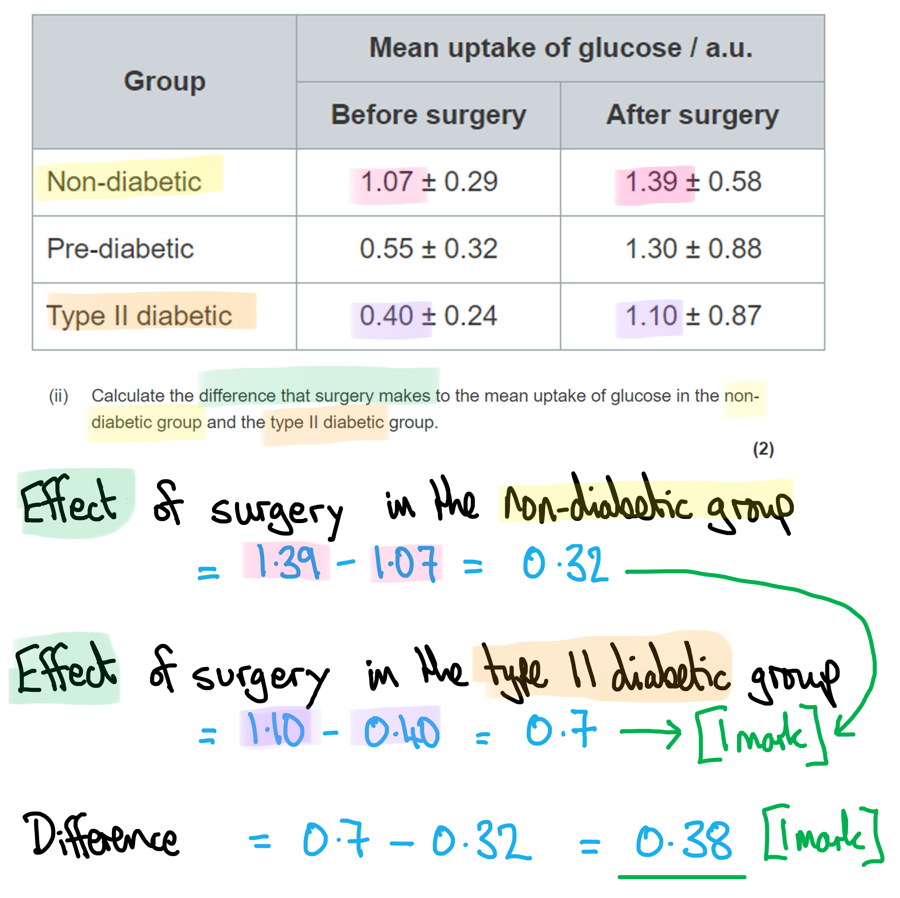
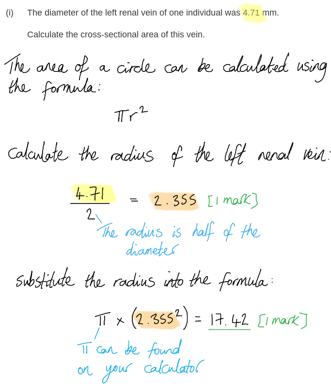
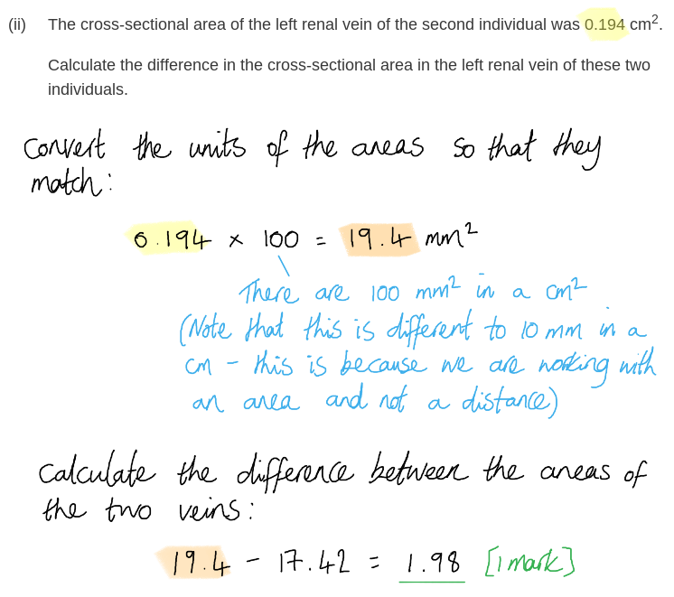
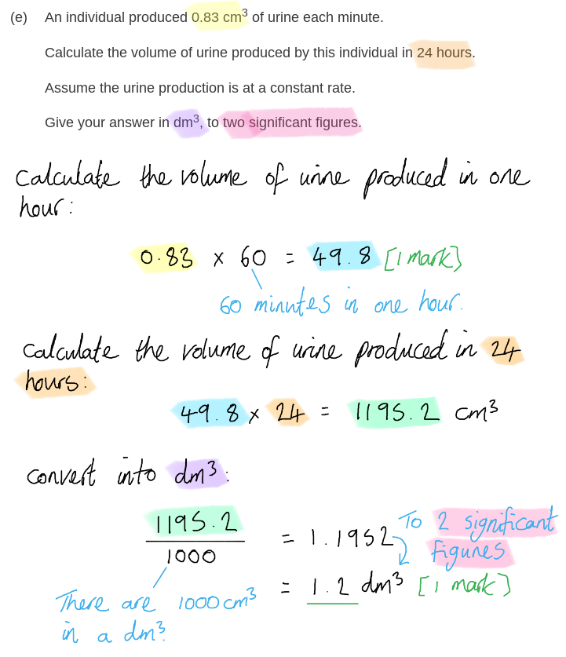
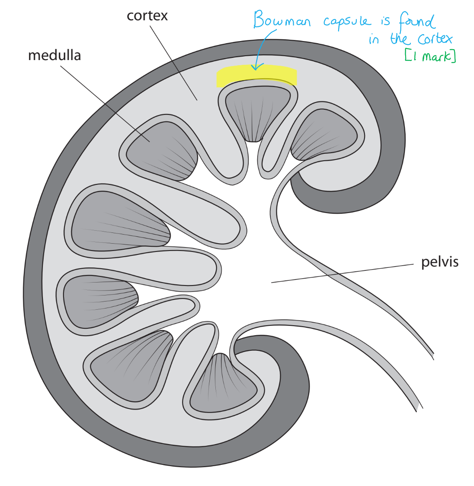
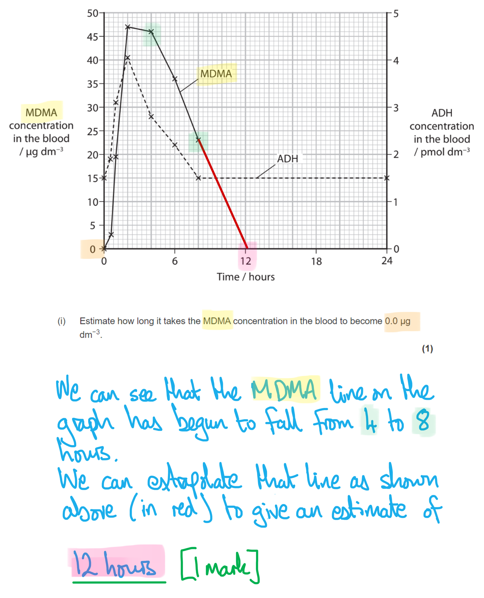
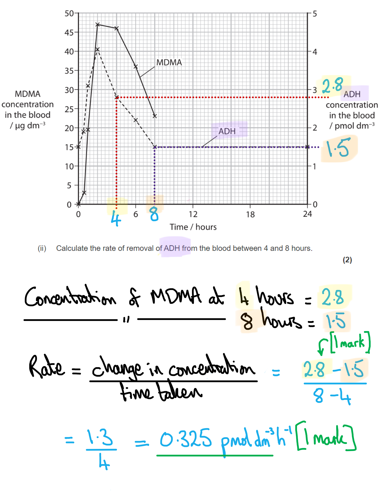

# Mark Schemes — The Internal Environment
**7. Respiration, Muscles & the Internal Environment** · Edexcel International A Level (IAL) Biology (YBI11)

## Q1 — medium — 8 marks · exam-questions

### 2() — 3 marks
(i) W and X are located in **A** because...

**The glomerulus (W) and the proximal convoluted tubule (X) are located in the cortex, which is the outer part of the kidney.**

(ii) Ultrafiltration takes place in **A** because...

**The glomerulus (W) is a knot of narrow capillaries. High blood pressure in the glomerulus forces small molecules into the Bowman's capsule; this is ultrafiltration.**

(iii) The part that is found in the loop of Henle is **C** because...

**Y is the descending limb of the loop of Henle.**

> *W is the glomerulus.*

> *X is the proximal convoluted tubule.*

> *Z is the collecting duct.*

**[Total: 3 marks]**

### 2((b)) — 2 marks
Ultrafiltration removes urea from the blood as follows...

Any **two** of the following:

- (Urea is) forced out of the blood by high pressure; **[1 mark]**
- (High pressure is caused by the afferent blood vessel/arteriole having a greater diameter than the efferent blood vessel/arteriole in the glomerulus; **[1 mark]**
- (Filtrate is forced) through pores/glomerular fenestrations in the capillary lining / gaps in the mesh-like basement membrane / gaps between the podocytes; **[1 mark]**

***Reject**** artery for vessel/arteriole in marking point 2.*

**[Total: 2 marks]**

### 2((c)) — 3 marks
(c) The kangaroo rat is more successful than the brown rat at living in desert habitats because...

Any **three** of the following:

- There is less water available in deserts / less water is available to kangaroo rats; **[1 mark]**
- (The kangaroo rat conserves water) by producing more concentrated urine **OR** more water is reabsorbed, producing more concentrated urine; **[1 mark]**
- (The kangaroo rat) needs to actively transport more sodium <u>ions</u> into (the extracellular fluid of) the medulla; **[1 mark]**
- More mitochondria enable production of more ATP; **[1 mark]**

***Reject**** production of 'energy' for marking point 4.*

**[Total: 3 marks]**

> *The table shows that the kangaroo rat produces more concentrated urine; this is an advantage in a dry habitat as it allows the kangaroo rat to retain water.*

> *You will be denied a mark if you state 'sodium' instead of 'sodium **ions**'.*

> *You should also have spotted that there are more mitochondria in the Kangaroo rat loop of Henle, so make sure to go on and say that this enables production of more ATP. Remember; it is incorrect to say that respiration **produces** energy; you should say that 'energy is released' or that 'ATP is produced'.*

## Q2 — medium — 12 marks · exam-questions

### 4((a)) — 2 marks
The difference between a negative feedback mechanism and a positive feedback mechanism is:

- Positive feedback results in an increase in the change (of the variable); **[1 mark]**
- Negative feedback results in a decrease in the change (of the variable); **[1 mark]**

*The answer can be phrased in many ways eg. change from normal, move to/away from a set point etc*

**[Total: 2 marks]**

> *Because you are being asked to **describe**, just quoting examples of positive and negative feedback will not earn you the marks here.*

### 4((b)) — 1 marks
The correct answer is **D** because...

**...'****dynamic equilibrium****' means that heat is being generated and lost all the time, but in a balanced way so that the overall effect is that temperature is kept constant at 37°C.**

> *A** is incorrect because thermoregulation is required all the time.*

> *B** is incorrect because the body generates heat continually.*

> *C** is incorrect because more heat being gained than lost means that the body is not in equilibrium.*

**[Total: 1 mark]**

### 4((c)) — 4 marks
(i) Small molecules like creatinine are filtered from the blood in the glomerulus by:

- Ultrafiltration occurs (in the glomerulus) **OR** creatinine is small enough to be ultrafiltered; **[1 mark]**
- Therefore can be forced through the pores / fenestrations / basement membrane; **[1 mark]**
- As a result of high pressure in the glomerulus; **[1 mark]**

> *The question stem already tells you that creatinine is a small molecule, so just simply re-stating that would not earn the first mark. You would have to go on to explain that its small size allows it to be filtered out, or that it is small enough to be able to pass into the glomerular filtrate. *

(ii) The calculation of the GFR (glomerular filtration rate) is as follows:

- 1960 ÷ 15 = 131 (3sf) **OR** 1960 ÷ (15 × 60) = 2.18 (3sf); **[1 mark]**

*Make sure to follow the instruction about how many significant figures to express your answer to. If you get the number of significant figures wrong you will score ***[0 marks] ***which would be unfortunate, given that you may have performed the correct calculation. *

**[Total: 4 marks]**

### 4((d)) — 5 marks
(i) Comments on the results of the trial can include:

Any** three** of the following:

- A general comment about all patients taking up more glucose after surgery; **[1 mark]**
- A comment on the difference between the two groups – you can quote figures eg. an observed over 2× improvement in the pre-diabetic group; **[1 mark]**
- A comment using SD **OR **reference to the error bars (overlapping); **[1 mark]**
- A comment on the largest or smallest change after surgery; **[1 mark]**

(ii) The difference that surgery makes to the mean uptake of glucose in the non‐diabetic group and the type II diabetic group is calculated as follows:

**A calculation showing the following steps:**

- A calculation of difference surgery makes for non-diabetic and type II diabetic / 0.32 and 0.7; **[1 mark]**
- A correct number calculated / 0.7 - 0.32 = 0.38 (a.u.); **[1 mark]**

**[Total: 5 marks]**

> *Because the question asks specifically about the **mean** uptake values, the SD values / ± values can be ignored for this part of the calculation. *

## Q3 — medium — 11 marks · exam-questions

### 4((a)) — 1 marks
The correct answer is **A** because...

The collecting duct is the only part of the kidney **from the list provided** that responds to ADH. ADH increases the permeability of the walls of the collecting duct and distal convoluted tubule to water by increasing the number of aquaporin channel proteins in the surface membranes of cells that line these parts of the nephron. This allows more water to pass out of the nephron and into the blood.

**[Total: 1 mark]**

### 4((b)) — 2 marks
(i) The process by which the fluid moves from the plasma into the renal tubule is…

- (Glomerular) ultrafiltration; **[1 mark]**

(b) (ii) The structures labelled S are...

- Microvilli; **[1 mark]**

**[Total: 2 marks]**

### 4((c)) — 3 marks
(i) The cross-sectional area of this vein is…

- 2.355; **[1 mark]**
- 17.42; **[1 mark]**

*Award full marks for the correct answer in the absence of other calculations.*

*Accept 2.36 for marking point 1 and then the resulting calculated area of 17.4 for marking point 2.*

(ii) The difference in the cross-sectional area in the left renal vein of these two individuals is...

- 1.98 (mm2) / 0.0198 (cm2); **[1 mark]**

***Accept ****error carried forward from part (i) provided that unit conversions are carried out correctly, e.g. if the answer from part (i) were 17.43 then the answer here would be 1.97 mm**2**.*

**[Total: 3 marks]**

### 4((d)) — 3 marks
The concentration of glucose and urea in the urine can be explained as follows...

- The proximal convoluted tubule has a role in <u>selective reabsorption</u>; **[1 mark]**
- The glucose concentration decreases from 1.50 g dm-3 in the filtrate to 0.00 g dm-3 in the urine / glucose concentration decreases by 100 % (due to glucose being reabsorbed) **OR** the urea concentration increases from 0.30 g dm-3 to 21.00 g dm-3 / urea concentration increases by 70× (due to water being reabsorbed); **[1 mark]**
- Reabsorption occurs via protein channels (in the surface membranes of the cells that line the nephron); **[1 mark]**

**[Total: 3 marks]**

> *The composition of the fluid inside the kidney nephron changes between the filtrate and the urine due to the process of selective reabsorption. Protein channels in the cell surface membranes of the cells lining the nephron allow the reabsorption of useful substances such as glucose and water. The reabsorption of water increases the relative concentration of other solutes that are not actively reabsorbed, so the concentration of urea increases despite there being no addition of urea to the filtrate during the process of urine production.*

### 4((e)) — 2 marks
(e) The volume of urine produced by this individual in 24 hours is...

- (0.83 x 60 =) 49.8; **[1 mark]**
- 1.2 (dm3); **[1 mark]**

*Award full marks for the correct answer in the absence of other calculations.*

**[Total: 2 marks]**

## Q4 — medium — 11 marks · exam-questions

### 4((a)) — 3 marks
(i) The location of the Bowman's capsule is...

*Allow an arrow ending clearly anywhere in the cortex.*

(ii) The correct answer is **D **because...

**Most amino acids are reabsorbed from the nephron in the proximal tubule**

> *A** is incorrect because collecting duct collects urine from the nephrons*

> *B** is incorrect because the distal tubule is responsible for salt and water reabsorption*

> *C** is incorrect because the loop of Henle is responsible for salt and water reabsorption*

(a) (iii) The correct answer is **B **because...

**The correct route through the nephron is the glomerulus → proximal tubule → distal tubule → collecting duct**

**[Total: 3 marks]**

> *Search the question text thoroughly for command words. A surprisingly high number of students fail to spot question parts like (a) (i) and miss out on (usually easy) marks unnecessarily. The fact that there are no blank lines to write on does not mean that there are no marks available. *

### 4((b)) — 4 marks
The loop of Henle acts as a countercurrent multiplier to produce concentrated urine by...

- The flow of filtrate in the tubules occurs in the opposite direction; **[1 mark]**
- Because sodium ions are actively transported out of the ascending limb; **[1 mark]**
- Therefore water moves out from descending limb (and solutes from the ascending limb); **[1 mark]**
- Due to an increase in the concentration gradient between the tubular fluid and interstitial space; **[1 mark]**

**[Total: 4 marks]**

### 4((c)) — 4 marks
ADH is involved in the control of the water potential of the blood by...

Any **four **of the following:

- The water potential of the blood is monitored by osmoreceptors in the hypothalamus; **[1 mark]**
- The release of ADH occurs from the pituitary gland; **[1 mark]**
- (ADH travels in the blood to the kidneys) where ADH acts on the collecting ducts/distal convoluted tubule **OR **(ADH causes)** **the insertion of aquaporins into cell membranes (of CT and DCT); **[1 mark]**
- This causes an increase in the cell membrane's permeability to water; **[1 mark]**
- More water is reabsorbed so the water potential of the blood goes back to the normal range; **[1 mark]**

**[Total: 4 marks]**

## Q5 — medium — 9 marks · exam-questions

### 3() — 3 marks
(i) An estimate of the time it would take for the MDMA concentration in the blood to become 0.0 μg dm−3 is...

- (An answer in the range of) 8 - 18 hours; **[1 mark]**

(ii) The rate of removal of ADH from the blood between 4 and 8 hours can be calculated as follows...

- 2.8 - 1.3 / 1.3; **[1 mark]**
- 0.325/0.33 pmol dm-3 hr-1; **[1 mark]**

**[Total: 3 marks]**

> *Take care to identify not only the right line on the graph, but the fact that the axis for ADH units is the secondary axis on the **right hand side** of the graph.*

> *Whenever a question asks you to calculate the rate of something, you should always measure a **change per unit of time**, so in this case the **fall in the ADH concentration divided by the time elapsed**, which was 4 hours. *

### 3((b)) — 6 marks
> *This is a **level-marked question**, meaning that it is marked **according to the levels table**. The indicative content points below the table are **not **to be used in the usual **'one point per mark'** way, but should be used together with the level descriptors to determine the number of marks which should be awarded. *

> *The indicative content below is not prescriptive and candidates are not required to include all the material indicated as relevant. Additional content included in the response must be scientific and relevant.*

| **Level 1** | A limited number of relevant scientific factors from the data/information provided are given, e.g....  **[1 mark] **= one relevant point is made from the indicative content.  **[2 marks] **= two relevant points are made from the indicative content. |
|---|---|
| **Level 2** | Some relevant scientific factors from the data/information provided are given, e.g....  **[3 marks] **= two pieces of data description are given **AND **one relevant point is given from existing knowledge **or** deduction  **[4 marks] **= two pieces of data description are given **AND **two relevant points are made from existing knowledge **or** deduction |
| **Level 3** | Most of the relevant scientific factors from the data/information provided are given, e.g....  **[5 marks] **= three pieces of data description are given **AND **three relevant points are made from existing knowledge **or** deduction  **[6 marks] **= three pieces of data description are given **AND **four relevant points are made from existing knowledge **and** deduction |

The role of ADH in MDMA-induced brain swelling can be discussed as follows...

*Indicative content relating to describing the graph*

- As MDMA concentration in blood increases ADH concentration also increases

*Indicative content relating to describing the table*

- After 9 hours of taking MDMA ADH levels are still high / 3x that at 96 hours
- At higher ADH concentrations sodium ion concentration in the blood decreases
- Brain swelling is associated with lower sodium ion concentration in the blood

*Indicative content relating to existing knowledge*

- ADH increases the permeability of the collecting duct to water / water reabsorption by the kidney

*Indicative content relating to deduction on the role of ADH in brain swelling*

- Increased water retention dilutes the blood / raises blood water potential
- The blood has a higher water potential than the (brain) cells
- Water moves from the blood into the brain by osmosis / down a water potential gradient
- The brain swells due to increased water content of cells

**[Total: 6 marks]**

## Q6 — medium — 11 marks · exam-questions

### 1() — 3 marks
> **[mark-scheme]**
> - A = Bowman's capsule **[1 mark]**
> - B = loop of Henle **[1 mark]**
> - C = collecting duct **[1 mark]**
> 
> Accept "glomerular capsule" for Bowman's capsule.

### 2() — 2 marks
> **[mark-scheme]**
> Any **two** from:
> 
> - High pressure in the glomerulus forces substances out of the blood / filtration occurs under pressure
> - Filtrate is forced through pores in the basement membrane / fenestrations in the capillary wall / between podocytes
> - Small molecules / water / glucose / urea pass into the filtrate **WHILE** large molecules / proteins / blood cells are too large to pass through / remain in the blood
> 
> **[2 marks]**
> 
> Do not accept "nutrients" for small molecules.

> **[exam-tip]**
> "Describe" questions require you to state what happens, not why. In this question, you do not need to explain why pressure is high in the glomerulus — simply state that high pressure forces substances out of the blood.

### 3() — 1 marks
To calculate the ratio of urine concentration:

- Use the equation:

ratio = $\frac{\text{first quantity}}{\text{second quantity}}$

- List the known quantities:

  - First quantity = mean urine concentration in sand cat = 3250 mOsm/L
  - Second quantity = mean urine concentration in domestic cat = 1680 mOsm/L

- Substitute the known values and calculate:

ratio = $\frac{3250}{1680}$

= 1.93

- Express as a ratio to 1:

**= ****1.93 : 1** **[1 mark]**

> **[mark-scheme]**
> Must be to 2 d.p. — do not accept 1.9 or 1.934
> 
> Award full marks for the correct answer in the absence of working

> **[exam-tip]**
> When asked to calculate a ratio, make sure you express your answer in the correct format. A ratio must always be expressed in relation to 1 — so your answer should be written as X : 1, not as a single decimal value.
> 
> Here, the question asks for your answer to two decimal places, so make sure you round appropriately.

### 4() — 3 marks
> **[mark-scheme]**
> Any **three** from:
> 
> - The sand cat has a longer loop of Henle / a loop of Henle that has a relative length of 4.8 compared to 2.1 in the domestic cat
> - More sodium ions can be pumped out of the ascending limb **SO **a higher concentration of ions / higher solute concentration / lower water potential is established in the medulla
> - This creates a steeper / increased concentration gradient between the tubular fluid/filtrate/nephron contents and the surrounding tissue
> - More water is reabsorbed from the descending limb / collecting duct by osmosis **SO** more water is conserved / less water is lost in urine
> 
> **[3 marks]**
> 
> Reject "sodium" for "sodium ions" or "Na+"

> **[exam-tip]**
> When explaining how a longer loop of Henle enables water conservation, make sure you describe the full sequence of events rather than jumping straight to the conclusion. Begin with the active transport of sodium ions out of the ascending limb — note that you must write "sodium ions" rather than just "sodium" to be credited. Then explain the consequence of this for the concentration gradient in the medulla, before linking this to water reabsorption by osmosis.

### 5() — 2 marks
> **[mark-scheme]**
> - More ADH is released **[1 mark]**
> 
> **AND**
> 
> Any **one** from:
> 
> - Collecting duct / distal convoluted tubule becomes more permeable to water
> - More water is reabsorbed **SO** a smaller volume of more concentrated urine is produced
> 
> **[1 mark]**

> **[exam-tip]**
> This question asks you to describe the effects on ADH release and urine production — make sure all of your marking points directly address these effects.
> 
> Work through the sequence logically: start with the change in ADH release, then explain how this affects the permeability of the collecting duct and distal convoluted tubule, and finally state the effect on the volume and concentration of urine produced.

## Q7 — medium — 10 marks · exam-questions

### 1() — 2 marks
> **[mark-scheme]**
> Any **two** from:
> 
> - Receptors detect a deviation from the set point / a change in blood glucose concentration
> - A corrective response / effector is triggered that counteracts the change / returns blood glucose to the set point
> - Once the set point is restored, secretion of insulin / glucagon is reduced / the corrective response is switched off
> 
> **[2 marks]**
> 
> Do not accept a description of the insulin/glucagon mechanism alone without reference to negative feedback principles.

> **[exam-tip]**
> This question is about the principle of negative feedback, not the detail of insulin and glucagon. Make sure you explain: (1) there is a set point, (2) a deviation triggers a corrective response, and (3) the response is switched off once the set point is restored.

### 2() — 2 marks
To calculate the percentage decrease in INSR expression:

percentage decrease = (change ÷ original value) x 100

- Identify the values:

  - INSR expression in control individuals = 6.7
  - INSR expression in diabetic individuals = 5.9
- Calculate the change in expression:

6.7 − 5.9 = 0.8

- Divide by the original value and multiply by 100:

percentage decrease = (0.8 ÷ 6.7) × 100 **[1 mark]**

= **11.94** % **[1 mark]**

> **[mark-scheme]**
> Award full marks for the correct answer in the absence of working.

### 3() — 3 marks
> **[mark-scheme]**
> - GLUT4 **[1 mark]**
> 
> **AND**
> 
> Any **two ** from:
> 
> - It shows the largest difference in expression between control and diabetic individuals (8.4 vs 2.1)
> - GLUT4 is the only gene for which the SDs do not overlap **SO** this difference is likely to be statistically significant
> - GLUT4 codes for a glucose transporter protein **SO** reduced expression means that less glucose is taken up by muscle cells
> 
> **[2 marks]**

> **[exam-tip]**
> "Justify" questions require you to support your answer with evidence — simply identifying GLUT4 without explanation will not gain full marks. In this question, you can draw on two types of evidence from the table to build your justification: data, such as the difference in expression values and the standard deviations, and biological information, such as the function of the GLUT4 protein and what a reduction in its expression means for glucose uptake.

### 4() — 3 marks
> **[mark-scheme]**
> - Insulin binds to complementary receptors on the cell surface membrane **[1 mark]**
> - A signalling cascade / secondary messenger system is activated inside the cell **[1 mark]**
> - Transcription factors are activated / produced **SO** they bind to the promoter region of the target / GLUT4 / GYS1 gene **[1 mark]**
> 
> Reject "insulin enters the cell" or "insulin enters the nucleus".
> 
> Do not accept INSR as a target gene

> **[exam-tip]**
> Insulin is a peptide hormone, which means it cannot pass through the cell membrane — it must bind to receptors on the cell surface to exert its effect. Make sure you do not state that insulin enters the cell or nucleus, as this would only apply to lipid-soluble steroid hormones.
> 
> Note also that while INSR (insulin receptor) is one of the genes shown in the table, it would not be credited as a target gene here — if insulin signalling led to increased expression of its own receptor gene, this would create a positive feedback loop, which is not consistent with how hormonal regulation normally works.
