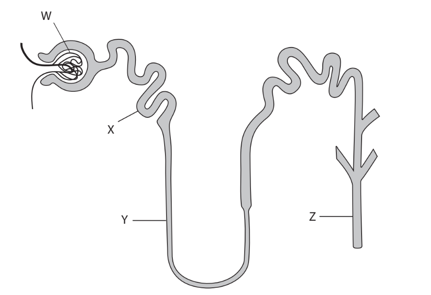
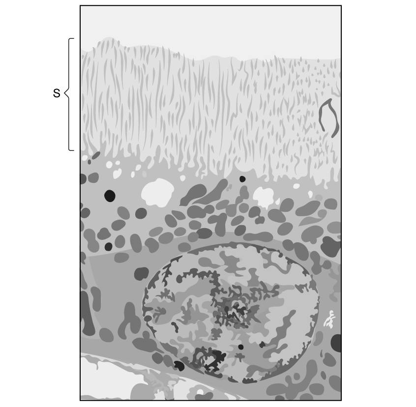
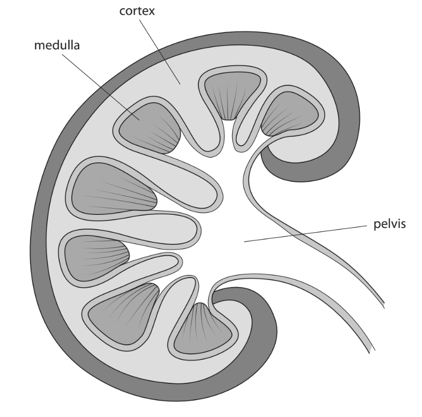
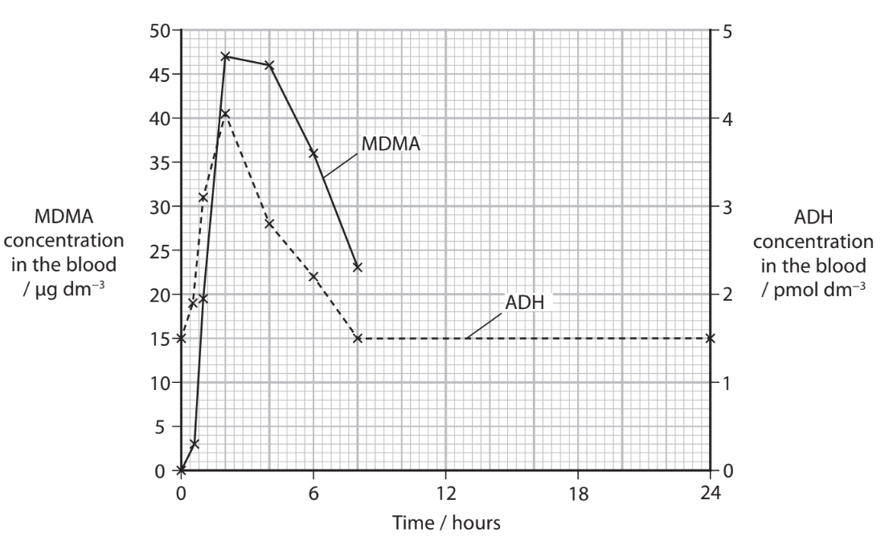
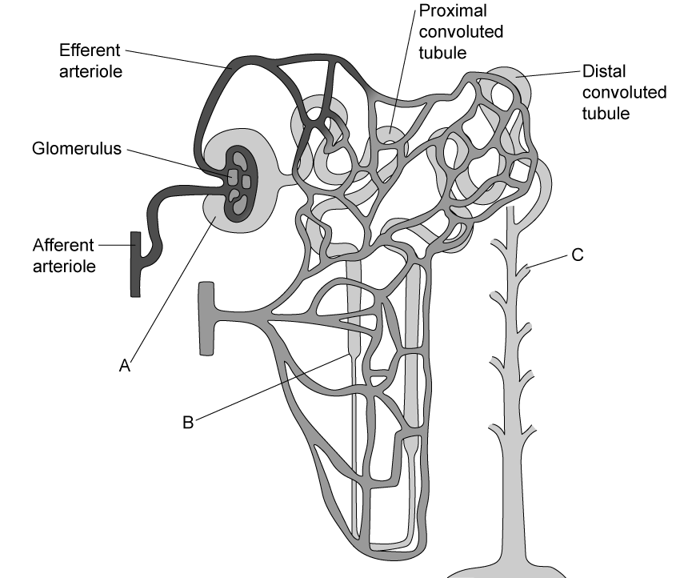

# Exam Questions — The Internal Environment
**7. Respiration, Muscles & the Internal Environment** · Edexcel International A Level (IAL) Biology (YBI11)
> Source: [https://www.savemyexams.com/international-a-level/biology/edexcel/18/topic-questions/7-respiration-muscles-and-the-internal-environment/the-internal-environment/exam-questions/](https://www.savemyexams.com/international-a-level/biology/edexcel/18/topic-questions/7-respiration-muscles-and-the-internal-environment/the-internal-environment/exam-questions/) · 7 questions · total 72 marks

## Q1 — medium — 8 marks · exam-questions

### 2() — 3 marks — command: multiple — structured — from paper Oct/Nov 2020 · WBI15/01
The kidney is an organ involved in the excretion of waste materials and in the regulation of blood volume and plasma concentration.

The functional unit of the kidney is the nephron.

The diagram shows a single nephron.

(i)  In which part of the kidney are structures W and X located?

**(1)**

☐ **A** cortex

☐ **B** inner medulla

☐ **C** outer medulla

☐ **D** renal pelvis

(ii)  In which structure does ultrafiltration take place?

**(1)**

☐  **A ** W

☐  **B**   X

☐   **C**   Y

☐   **D**   Z

(iii)  Which structures form part of the loop of Henle?

**(1)**

☐ **A** X only

☐ **B** X and Y

☐ **C** Y only

☐ **D** Y and Z

### 2((b)) — 2 marks — command: explain — structured — from paper Oct/Nov 2020 · WBI15/01
Urea is a toxic substance that is excreted from the body.

Explain how ultrafiltration removes urea from the blood.

### 2((c)) — 3 marks — command: deduce — structured — from paper Oct/Nov 2020 · WBI15/01
The kidney controls blood volume and plasma concentration by regulating the loss of water in urine.

Some mammals have adaptations to their kidneys that enable them to live in different habitats.

The table shows information about two small mammals.

| **Mammal** | **Urine** **concentration** **/ mOsmol dm****−3** | **Relative number of mitochondria in the thick ascending loop** **of Henle** | **Sodium ion concentration of extracellular fluid in the medulla** **/ mmol dm****−3** |
|---|---|---|---|
| brown rat | 2900 | 3.6 | 45 |
| kangaroo rat | 5500 | 5.5 | 95 |

Deduce why the kangaroo rat is more successful than the brown rat at living in desert habitats.

## Q2 — medium — 12 marks · exam-questions

### 4((a)) — 2 marks — command: describe — structured — from paper Oct/Nov 2021 · WBI15/01
Homeostasis is the state maintained by living systems.

Feedback mechanisms are involved in maintaining homeostasis.

Describe the difference between a negative feedback mechanism and a positive feedback mechanism.

### 4((b)) — 1 mark — command: which — structured — from paper Oct/Nov 2021 · WBI15/01
Which statement about the homeostasis of thermoregulation when the human body temperature is 37°C is correct?

| ☐ | **A** | thermoregulation is no longer required |
|---|---|---|
| ☐ | **B** | the body no longer generates any heat |
| ☐ | **C** | the body will be generating more heat than it can lose |
| ☐ | **D** | the body temperature is maintained in a dynamic equilibrium |

### 4((c)) — 4 marks — command: multiple — structured — from paper Oct/Nov 2021 · WBI15/01
The health of a kidney can be determined by measuring the glomerular filtration rate (GFR).

This method measures the rate at which a small molecule called creatinine is filtered from the blood.

(i)  Explain how small molecules like creatinine are filtered from the blood in the glomerulus.

**(3)**

(ii)  In 15 hours, a person excreted 1960 mg of creatinine in the urine.

Calculate the GFR for this person.

Give your answer to 3 significant figures.

**(1)**

Answer ..................................................

### 4((d)) — 5 marks — command: multiple — structured — from paper Oct/Nov 2021 · WBI15/01
In type II diabetes, body cells take up less glucose in response to insulin.

Many people with type II diabetes are overweight or obese.

Some of these individuals have been given surgery to help weight loss.

A clinical trial investigated the effect of surgery on the uptake of glucose by body cells in the presence of insulin.

This trial used groups of people who were non‐diabetic, people in the early stage of diabetes (pre‐diabetic) and people who were type II diabetics.

| **Group** | **Mean uptake of glucose / a.u.** |   |
|---|---|---|
| **Before surgery** | **After surgery** |   |
| Non‐diabetic | 1.07 ± 0.29 | 1.39 ± 0.58 |
| Pre‐diabetic | 0.55 ± 0.32 | 1.30 ± 0.88 |
| Type II diabetic | 0.40 ± 0.24 | 1.10 ± 0.87 |

(i)  Comment on the results of this trial.

**(3)**

(ii)  Calculate the difference that surgery makes to the mean uptake of glucose in the non‐diabetic group and the type II diabetic group.

**(2)**

Answer ....................................................

## Q3 — medium — 11 marks · exam-questions

### 4((a)) — 1 mark — command: how — structured — from paper June 2021 · WBI15/01
The kidney is involved in the process of homeostasis in a mammal.

Antidiuretic hormone (ADH) is required for homeostasis.

How many of these parts of the kidney respond to ADH?

- Bowman’s capsule
- collecting duct
- loop of Henle
- proximal tubule

| ☐ | **A** | 1 |
|---|---|---|
| ☐ | **B** | 2 |
| ☐ | **C** | 3 |
| ☐ | **D** | 4 |

### 4((b)) — 2 marks — command: name — structured — from paper June 2021 · WBI15/01
The electron micrograph illustration shows a transverse section of part of a proximal tubule.

(i)  Name the process by which the fluid moves from the plasma into the renal tubule (nephron).

**(1)**

(ii)  Name the structures labelled S.

**(1)**

### 4((c)) — 3 marks — command: calculate — structured — from paper June 2021 · WBI15/01
A student compared the left renal veins of two individuals.

(i)  The diameter of the left renal vein of one individual was 4.71 mm.

Calculate the cross-sectional area of this vein.

**(2)**

(ii)  The cross-sectional area of the left renal vein of the second individual was 0.194 cm2.

Calculate the difference in the cross-sectional area in the left renal vein of these two individuals.

**(1)**

### 4((d)) — 3 marks — command: explain — structured — from paper June 2021 · WBI15/01
The table shows the concentration of glucose and urea in the blood plasma, glomerular filtrate and urine of an individual.

| **Substance** | **Concentration in blood plasma** **/ g dm****-3** | **Concentration in** **glomerular filtrate** **/ g dm****-3** | **Concentration in urine leaving collecting duct** **/ g dm****-3** |
|---|---|---|---|
| glucose | 1.50 | 1.50 | 0.00 |
| urea | 0.30 | 0.30 | 21.00 |

Explain the concentration of glucose and urea in the urine.

Use the information in the table to support your answer.

### 4((e)) — 2 marks — command: calculate — structured — from paper June 2021 · WBI15/01
An individual produced 0.83 cm3 of urine each minute.

Calculate the volume of urine produced by this individual in 24 hours.

Assume the urine production is at a constant rate.

Give your answer in dm3, to two significant figures.

## Q4 — medium — 11 marks · exam-questions

### 4((a)) — 3 marks — command: multiple — structured — from paper Jan 2022 · WBI15/01
The kidneys perform important roles in filtering the blood and maintaining fluid levels in the body.

Each kidney contains up to a million functioning units called nephrons.

Each nephron consists of a filtering unit of tiny blood vessels called a glomerulus that is attached to a tubule.

The diagram shows part of a human kidney.

(i)  Draw an arrow on the diagram to show the location of a single Bowman’s capsule (renal capsule).

**(1)**

(ii)  Where in the kidney are most amino acids reabsorbed from the nephron?

**(1)**

| ☐ | **A** | Collecting duct |
|---|---|---|
| ☐ | **B** | Distal tubule |
| ☐ | **C** | Loop of Henle |
| ☐ | **D** | Proximal tubule |

(iii)  Which row shows the correct pathway taken by a water molecule through the kidney nephron?

**(1)**

|   | **Route through nephron **$-----\rightarrow$ |   |   |   |
|---|---|---|---|---|
| ☐  **A** | collecting duct | proximal tubule | distal tubule | glomerulus |
| ☐  **B** | glomerulus | proximal tubule | distal tubule | collecting duct |
| ☐  **C** | glomerulus | distal tubule | collecting duct | proximal tubule |
| ☐  **D** | proximal tubule | glomerulus | distal tubule | collecting duct |

### 4((b)) — 4 marks — command: explain — structured — from paper Jan 2022 · WBI15/01
Explain how the loop of Henle acts as a countercurrent multiplier to produce concentrated urine.

### 4((c)) — 4 marks — command: describe — structured — from paper Jan 2022 · WBI15/01
Describe how ADH is involved in the control of the water potential of the blood.

## Q5 — medium — 9 marks · exam-questions

### 3() — 3 marks — command: multiple — structured — from paper Oct/Nov 2020 · WBI15/01
Ecstasy (MDMA) is a recreational drug that can have serious toxic effects.

The effect of MDMA on ADH concentration in blood has been studied.

In one study, each person in a group of volunteers was given MDMA. The MDMA and ADH concentrations in the blood were measured.

The graph shows the results of this study.

(i)

Estimate how long it takes the MDMA concentration in the blood to become 0.0 μg dm−3.

**(1)**

(ii)

Calculate the rate of removal of ADH from the blood between 4 and 8 hours.

**(2)**

### 3((b)) — 6 marks — command: comment — structured — from paper Oct/Nov 2020 · WBI15/01
Taking MDMA causes a person to be very thirsty. This can lead to swelling of the brain, which can be fatal.

The table shows some laboratory results for one case in which a person suffered swelling of the brain.

| **Time since** **taking MDMA** **/ hours** | **ADH concentration** **/ pmol dm****−3** | **Sodium ion concentration** **in the blood** **/ mmol dm****−3** | **Appearance of the** **brain in computed** **tomography (CT)** |
|---|---|---|---|
| 9 | 4.5 | 112 | Swollen |
| 96 | 1.2 | 131 | Normal |

Comment on the role of ADH in MDMA-induced brain swelling.

Use the information in the graph and table as well as your own knowledge to support your answer.

## Q6 — medium — 11 marks · exam-questions

### 1() — 3 marks — command: name — structured
The diagram shows a nephron from a mammalian kidney.

Name the structures labelled **A**, **B** and **C**.

### 2() — 2 marks — command: describe — structured
Describe how ultrafiltration produces filtrate in the nephron.

### 3() — 1 mark — command: calculate — structured
The sand cat (*Felis margarita*) is a small wild cat found in desert habitats. A study compared kidney function in the sand cat with the domestic cat (*Felis catus*).

The table shows the results of the study.

| Feature | Sand cat | Domestic cat |
|---|---|---|
| Mean urine concentration (mOsm / L) | 3250 | 1680 |
| Relative length of structure B (as represented in part a) | 4.8 | 2.1 |
| Mean water reabsorption rate (cm³ / hour) | 1.42 | 0.86 |

Calculate the ratio of urine concentration in the sand cat to the domestic cat.

Give your answer to two decimal places.

### 4() — 3 marks — command: explain — structured
Using the data in the table and your own knowledge, explain how the sand cat's kidney adaptations enable it to survive in a desert environment.

### 5() — 2 marks — command: explain — structured
Explain the effect of not drinking water for a prolonged period on urine production in sand cats.

## Q7 — medium — 10 marks · exam-questions

### 1() — 2 marks — command: explain — structured
Explain how the regulation of blood glucose concentration is an example of negative feedback.

### 2() — 2 marks — command: calculate — structured
Type 2 diabetes is a condition in which blood glucose regulation is impaired.

Scientists investigated gene expression in muscle cells from individuals without type 2 diabetes (the control group) and individuals with type 2 diabetes.

Table 1 shows the relative expression levels of four genes in the two groups of participants.

| Gene | Protein function | Relative expression in control individuals (arbitrary units) ± SD | Relative expression in diabetic individuals (arbitrary units) ± SD |
|---|---|---|---|
| GLUT4 | Glucose transporter protein | 8.4 ± 1.2 | 2.1 ± 0.8 |
| INSR | Insulin receptor | 6.7 ± 1.5 | 5.9 ± 1.4 |
| GYS1 | Glycogen synthase | 5.2 ± 0.9 | 4.8 ± 1.1 |
| GAPDH | Housekeeping enzyme (control) | 7.1 ± 0.7 | 7.0 ± 0.6 |

Calculate the percentage decrease in INSR expression between control individuals and diabetic individuals.

Give your answer to two decimal places.

### 3() — 3 marks — command: justify — structured
Suggest which gene's expression change is most likely to be responsible for the reduced glucose uptake observed in the muscle cells of diabetic individuals.

Use information from the table to justify your answer.

### 4() — 3 marks — command: suggest — structured
Insulin is a peptide hormone.

Suggest how insulin could lead to changes in gene expression within muscle cells.
