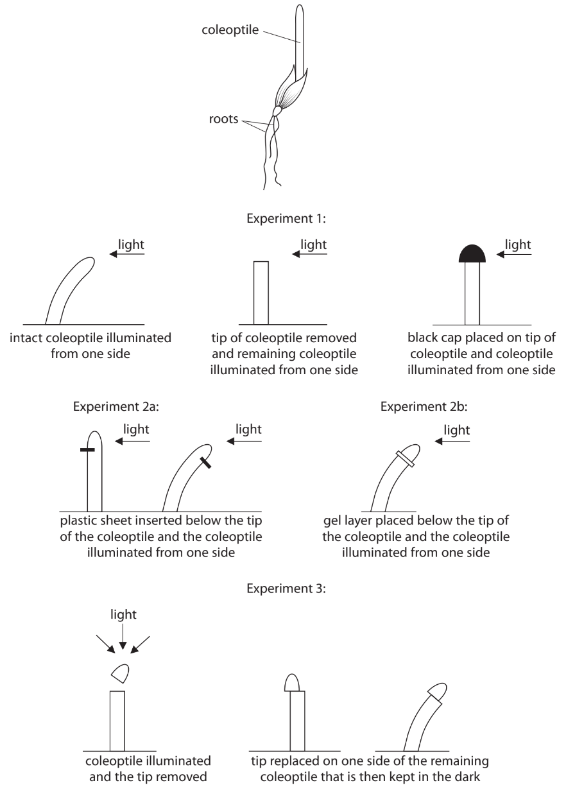
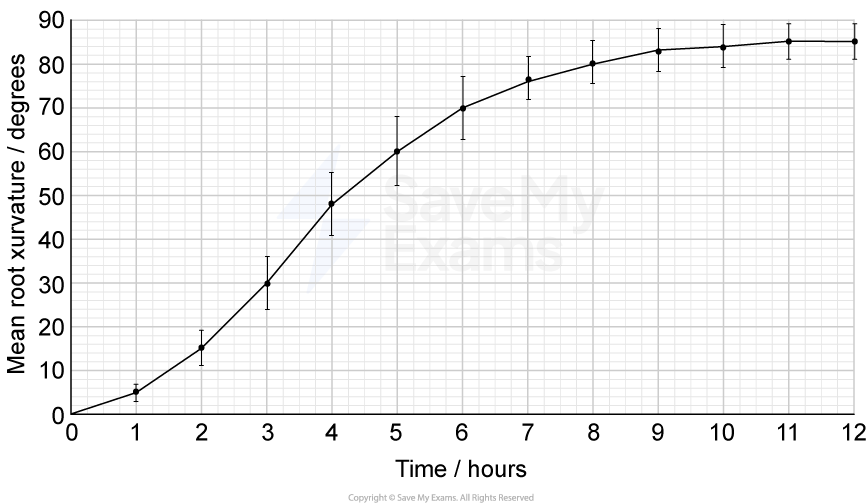

# Exam Questions — Plant Hormones
**8. Coordination, Response & Gene Technology** · Edexcel International A Level (IAL) Biology (YBI11)
> Source: [https://www.savemyexams.com/international-a-level/biology/edexcel/18/topic-questions/8-coordination-response-and-gene-technology/plant-hormones/exam-questions/](https://www.savemyexams.com/international-a-level/biology/edexcel/18/topic-questions/8-coordination-response-and-gene-technology/plant-hormones/exam-questions/) · 3 questions · total 20 marks

## Q1 — medium — 6 marks · exam-questions

### 7((b)) — 6 marks — command: comment — structured — from paper June 2021 · WBI15/01
Exposure to light controls the germination of seeds and the direction of growth of plants.

In an investigation the seeds of plantains (a type of banana) were exposed to light.

The seeds were first exposed to red light and then to far-red light.

The percentage of seeds that germinated when exposed to different periods of red and far-red light was recorded.

The results are shown in the table.

| **Exposure to red light / min** | **Percentage germination (%)** |   |   |   |   |   |   |
|---|---|---|---|---|---|---|---|
| **Exposure to far-red light / seconds** |   |   |   |   |   |   |   |
| **1** | **5** | **10** | **15** | **30** | **60** | **960** |   |
| 32 | 100 | 20 | 14 | 6 | 4 | 6 | 10 |
| 16 | 92 | 30 | 40 | 28 | 30 | 33 | 20 |
| 8 | 100 | 62 | 50 | 57 | 44 | 47 | 56 |
| 4 | 100 | 67 | 60 | 57 | 40 | 37 | 92 |

Comment on the effect of red and far-red light on the germination of these seeds and the processes that occur in their cells.

Use the information in the table to support your answer.

## Q2 — medium — 6 marks · exam-questions

### 5((b)) — 6 marks — command: discuss — structured — from paper Jan 2022 · WBI15/01
The drawing shows the results of some experiments investigating phototropisms.

The diagram shows a coleoptile of a seedling.

Scientists concluded that these results suggest a plant growth substance is involved in regulating the phototropic response.

Discuss how the results of these experiments support the role of a plant growth substance in the phototropic response of plants.

Use the information for these experiments and your own knowledge to support your answer.

## Q3 — medium — 8 marks · exam-questions

### 1() — 2 marks — command: describe — structured
Describe how auxin brings about the phototropic response in a shoot tip exposed to unilateral light.

### 2() — 2 marks — command: describe — structured
Scientists investigated the gravitropic response of *Arabidopsis thaliana* roots. Seedlings were grown on agar plates and placed horizontally. The curvature of the roots was measured over 12 hours.

The graph shows the results.

Describe the changes in root curvature shown in the graph.

### 3() — 2 marks — command: calculate — structured
Calculate the mean rate of root curvature between 2 and 6 hours.

Give your answer in degrees per hour.

### 4() — 2 marks — command: explain — structured
Before the investigation, the Arabidopsis seeds were treated with gibberellin to stimulate germination.

Explain how gibberellins bring about germination in these seeds.
