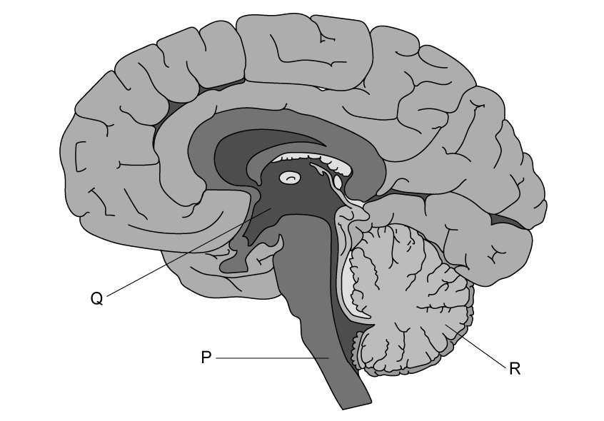

# Exam Questions — The Brain
**8. Coordination, Response & Gene Technology** · Edexcel International A Level (IAL) Biology (YBI11)
> Source: [https://www.savemyexams.com/international-a-level/biology/edexcel/18/topic-questions/8-coordination-response-and-gene-technology/the-brain/exam-questions/](https://www.savemyexams.com/international-a-level/biology/edexcel/18/topic-questions/8-coordination-response-and-gene-technology/the-brain/exam-questions/) · 2 questions · total 29 marks

## Q1 — medium — 9 marks · exam-questions

### 3((a)) — 2 marks — command: complete — structured — from paper Jan 2021 · WBI15/01
The brain is responsible for processing information and coordinating responses.

The diagram shows a human brain.

Three regions of the brain have been labelled.

Complete the table with the name and function of each region.

| **Label** | **Name of the region** | **Function of the region** |
|---|---|---|
| **P** | medulla oblongata |   |
| **Q** |   |   |
| **R** |   | balance and coordinating movement |

### 3((b)) — 4 marks — command: multiple — structured — from paper Jan 2021 · WBI15/01
Seizures in the brain can be investigated using different imaging techniques.

(i)  Which one of the following statements is correct?

**(1)**

☐ **A** CT scans are produced by the absorbance of magnetic fields 
☐ **B** CT scans are produced by the absorbance of radio waves by deoxyhaemoglobin 
☐ **C** CT scans produce a cross-sectional image of a thin slice through the body 
☐ **D** CT scans can be used to study brain activity while a person is undertaking tasks

(ii) During a seizure, part of the brain will be overactive.

Describe how positron emission tomography (PET) could be used to identify the part of the brain involved.

**(3)**

### 3((c)) — 3 marks — command: suggest — structured — from paper Jan 2021 · WBI15/01
Some seizures can result in an increase in body temperature.

Suggest how a seizure in part of the brain could lead to an increase in body temperature.

## Q2 — medium — 20 marks · exam-questions

### 8((a)) — 2 marks — command: complete — structured — from paper Oct/Nov 2021 · WBI15/01
The [scientific article](https://cdn.savemyexams.com/uploads/2022/11/wbi15-01-que-20211021-scientific-extract.pdf) you have studied is adapted from *Rethinking Alzheimer’s* in *New Scientist *(February 2019).

Use the information from the scientific article and your own knowledge to answer the following questions.

Memory and cognitive function are two processes that occur in the brain (paragraphs 2 and 13).

Different parts of the brain are responsible for specific functions.

Complete the table showing which parts of the brain are responsible for different functions.

| **Part of brain** | **Function** |
|---|---|
| cerebellum |   |
|   | interpretation of information from the retina |
| medulla oblongata |   |
|   | secretion of ADH |

### 8((b)) — 4 marks — command: contrast — structured — from paper Oct/Nov 2021 · WBI15/01
Some forms of dementia can be diagnosed using brain scans.

Compare and contrast the use of functional magnetic resonance imaging (fMRI) and computed tomography (CT) scans to identify structures like plaques in the brain (paragraph 6).

### 8((c)) — 4 marks — command: suggest — structured — from paper Oct/Nov 2021 · WBI15/01
Suggest how the amyloid protein may prevent bacterial infection in the brain (paragraphs 7 and 22).

### 8((d)) — 4 marks — command: explain — structured — from paper Oct/Nov 2021 · WBI15/01
Explain how the bacterium *Porphyromonas gingivalis* that causes gum disease may invade the brain and cause inflammation in brain regions affected by Alzheimer’s disease (paragraphs 10, 20 and 21).

### 8((e)) — 3 marks — command: suggest — structured — from paper Oct/Nov 2021 · WBI15/01
Suggest how gingipains may have a degrading effect on the memory of a person suffering from Alzheimer’s disease (paragraph 12).

### 8((f)) — 3 marks — command: describe — structured — from paper Oct/Nov 2021 · WBI15/01
The team found genetic material from *P. gingivalis* in the cerebral cortex (paragraph 13).

Describe how the team could show that this genetic material is active.
