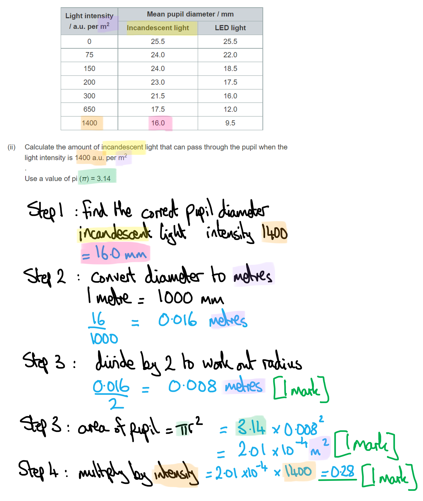
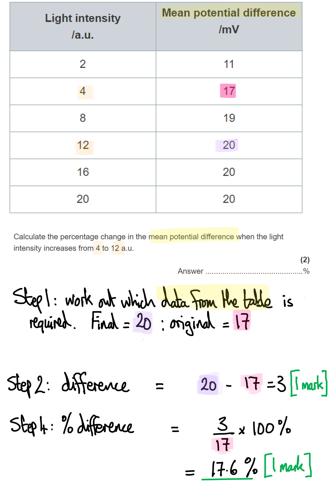
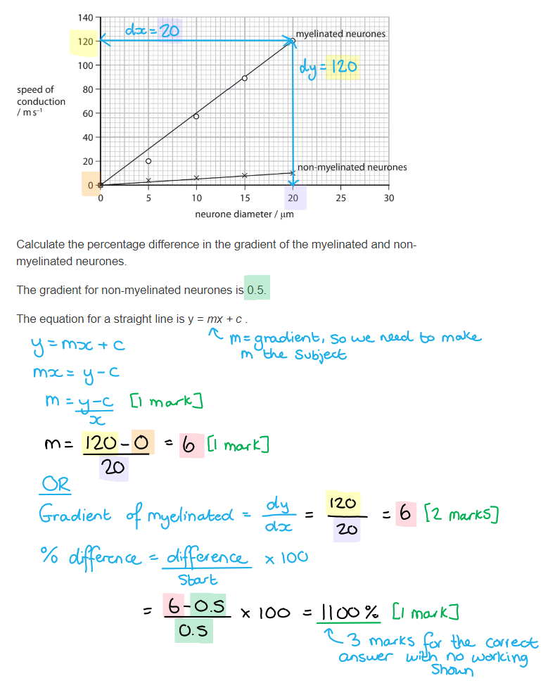
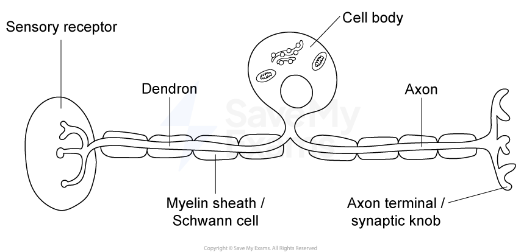

# Mark Schemes — The Nervous System
**8. Coordination, Response & Gene Technology** · Edexcel International A Level (IAL) Biology (YBI11)

## Q1 — medium — 7 marks · exam-questions

### 1((a)) — 4 marks
(i) The correct answer is **A **because...

**-70 mV is the resting potential of the axon. This occurs when the axon is not transmitting an impulse. The inside of the axon has an electrical potential about 70 mV lower than the outside.**

> *B** is incorrect because -78 mV is the potential when the axon is hyperpolarised.*

> *C** is incorrect because 38 mV is the action potential.*

> *D** is incorrect because 108 mV is the change in potential from resting to action potential.*

(ii) The correct answer is **C **because...

**Only the voltage-gated potassium ion channels are open during repolarisation, to allow the potassium ions to diffuse out of the axon, down their concentration gradient. **

> *A** is incorrect because there is never a moment during the action potential that none of the channels are open. *

> *B** is incorrect because the voltage-gated sodium channels close after depolarisation, and are therefore not open during repolarisation. *

> *D** is incorrect because the two types of channel open at different times during depolarisation and repolarisation. *

(iii) The correct answer is **B **because...

**The axon is hyperpolarised during the refractory period when the membrane potential is more negative than the resting potential. **

> *A** is incorrect because the axon is depolarised at the beginning when the action potential is first generated. *

> *C** and **D** are incorrect because these terms are not used to describe the axon at any point during the action potential. *

(iv) The correct answer is **B **because...

> *The magnitude of the action potential is always the same, no matter what the strength of the stimulus is (The 'all-or-nothing principle'). *

> *The action potential can only travel in one direction along the axon, not both. *

**It is correct that there is a refractory period after an action potential, during which it is not possible to generate a new action potential. **

**[Total: 4 marks]**

### 1((b)) — 3 marks
Maintaining a resting potential requires ATP because...

- ATP is used by the sodium-potassium pump; **[1 mark]**
- To move sodium ions and potassium ions across the cell membrane; **[1 mark]**
- To establish concentration gradients for sodium ions and potassium ions; **[1 mark]**

**[Total: 3 marks]**

> *It is important to include as much detail as possible in your answer to a three mark question. If you ever feel your explanation is lacking detail then try going back and for each point you've made in your answer ask yourself "why does that happen". It's a good way to prompt yourself to include more detail. Never assume that the examiner can fill in the gaps! *

## Q2 — medium — 4 marks · exam-questions

### 5((a)) — 4 marks
(i) The correct answer is **C **(retina) because...

**Rod cells are located in the retina of the eye. This is the part of the eye that absorbs light. **

(ii) The role of rhodopsin in rod cells is...

Any **three **of the following:

- Rhodopsin is the photoreceptor/photosensitive pigment; **[1 mark]**
- When light is absorbed the cis retinal (+ opsin) is converted to trans retinal (+ opsin); **[1 mark]**
- This causes sodium channels to close / Na+ gated channels are blocked; **[1 mark]**
- The membrane becomes hyperpolarised; **[1 mark]**

**[Total: 4 marks]**

> *It is important to remember that opsin does not block the sodium channels. *

## Q3 — medium — 10 marks · exam-questions

### 5((a)) — 3 marks
Mutations in the RPE65 gene can result in blindness.

Any **three **of the following:

- The active site is no longer complementary to trans-retinal; **[1 mark]**
- Cis-retinal cannot be regenerated; **[1 mark]**
- Therefore, rhodopsin cannot be formed; **[1 mark]**
- And rod cells will not have any photoreceptor; **[1 mark]**

**[Total: 3 marks]**

> *Make sure to always make your answer refer to the example in the question. Any generic response about mutations resulting in non-functional proteins, such as a different enzyme structure, then you cannot gain many marks on this question. *

### 5((b)) — 4 marks
The conclusions that can be made from this investigation are...

Any **four **of the following:

- Increasing the dose of gene therapy increased cis-retinal in the eye **OR **does not alter trans-retinal very much in the eye; **[1 mark]**
- The RPE65 gene enables the conversion of trans-retinal to cis-retinal; **[1 mark]**
- Increasing the dose of gene therapy increased the ability to follow a path; **[1 mark]**
- The production of cis-retinal restores vision; **[1 mark]**
- Reference to error bars used to support conclusions; **[1 mark]**

**[Total: 4 marks]**

> *To to avoid referring to individual doses and the effects of these individual doses, rather than overall conclusions.*

### 5((c)) — 3 marks
These genes could be identified by...

- Use microarray techniques to identify genes that are actively transcribed in the eye; **[1 mark]**
- Sequencing the genome of individuals with inherited forms of blindness; **[1 mark]**
- Compare the sequences for active genes from a large number of individuals with and without blindness to identify mutations; **[1 mark]**

**[Total: 3 marks]**

*Avoid the temptation to write all you know about the technique of microarrays; this question only requires a mention and very brief description of the technique to gain a maximum of ***[1 mark]***, with the other ***[2 marks]*** available for other techniques. *

## Q4 — medium — 13 marks · exam-questions

### 5() — 9 marks
(i) The relationship between light intensity and pupil diameter can be described as follows...

- As light intensity increases pupil diameter decreases **OR** there is a negative correlation; **[1 mark]**
- LED lights cause a greater reduction in pupil diameter than incandescent light; **[1 mark]**

***Allow**** data from the table to support either marking point for a second mark.*

(ii) The amount of incandescent light that can pass through the pupil when the light intensity is 1400 a.u. per m2 is calculated as follows...

- (Area of the pupil =) 201 (mm2); **[1 mark]**
- (Converted to m2 =) 0.000201 (m2); **[1 mark]**
- (0.000201 x 1400 =) 0.2814/0.28/0.281; **[1 mark]**

**OR**

- (Radius of pupil converted to m =) 0.008 (m); **[1 mark]**
- (Area of the pupil in m2 =) 0.000201 (m2);  **[1 mark]**
- (0.000201 x 1400 =) 0.2814/0.28/0.281; **[1 mark]**

*Award full marks for the correct answer in the absence of other calculations.*

*Award 2 marks for the correct answer at the wrong order of magnitude, e.g. 28 / 281 / 2814*

**[1 mark]**

> *The second approach (as shown in the model answer) is recommended because it is easier to convert a linear value (e.g. from mm to m) than an area value such as mm**2** to m**2**. The latter would involve a conversion factor or 1 million (1 000 000 or 10**6**) so you would run more risk of your final answer being out by a factor of tens, hundreds or thousands. *

(iii) Light entering the eye causes the pupil to respond as follows...

- Light is detected by photoreceptors / rods / cones in the retina **OR **rhodopsin breaks apart into retinal and opsin (when light hits the photoreceptors); **[1 mark]**
- A nerve impulse travels along / a reflex arc consists of sensory neurones **AND **relay neurones **AND** motor neurones; **[1 mark]**
- Impulses are transmitted to muscles in the iris; **[1 mark]**
- Radial muscles relax **and** circular muscles contract **SO** constricting the pupil; **[1 mark]**

> *It is vital to recognise, from the question wording, that this question is asking about how the **pupil** is affected by light. Because the pupil is not an actual structure (it's merely a hole in the iris) your answer should describe the events that lead to a response in the muscle of the **iris**.*

**[Total: 9 marks]**

### 5() — 4 marks
(i) Pluripotent stem cells are...

- Continuously dividing cells / cells that can under go mitosis; **[1 mark]**
- Cells that give rise to many/most of the different cell types / all cell types apart from extra-embryonic tissue/the placenta; **[1 mark]**

***Ignore**** 'cells that can give rise to all cell types' for marking point 2*

> *Remember that 'pluripotent' and 'totipotent' are not the same thing, so don't get them confused with each other. *

(ii) The epithelial layer is checked to ensure that there are no stem cells present before it is placed in the eye of the patient because...

- Stem cells could continue to divide / could form a tumour/cancer; **[1 mark]**
- Stem cells could differentiate into other cell types (that are not the cell types required); **[1 mark]**

**[Total: 4 marks]**

## Q5 — medium — 9 marks · exam-questions

### 6() — 2 marks
(i) The type of cell that produces myelin is **C** (Schwann cell) because...

**The myelin sheath is made up of specialised cells known as Schwann cells that wrap themselves around the axon.**

(ii) The row of the table that correctly compares the conduction of an impulse along a myelinated neurone with conduction along a non-myelinated neurone is **A** (faster / at nodes of Ranvier) because...

**Myelination allows saltatory ('jumping') conduction from node to node, which speeds up the rate of overall transmission of an impulse. **

**In myelinated neurones the regions of the axon that are surrounded by myelin are insulated; the membrane cannot be depolarised where myelin is present. The nodes of Ranvier are gaps in the neurone; only at these nodes can ions move across the membrane, causing depolarisation.**

**[Total: 2 marks]**

### 6((b)) — 4 marks
The role of ion transport in maintaining the resting potential of a neurone is...

Any **four **of the following:

- Sodium potassium (ion) pumps carry out active transport; **[1 mark]**
- Sodium ions are transported out of the axon **AND** potassium ions into the axon; **[1 mark]**
- (Passive) diffusion of potassium ions out of the axon; **[1 mark]**
- The inside of the axon/membrane is negatively charged (compared with the outside) **OR **the outside of the axon/membrane is positively charged (compared with the inside); **[1 mark]**
- The membrane voltage stays at the same value **OR** the potential difference across the membrane is maintained; **[1 mark]**

**[Total: 4 marks]**

> *Resist the temptation just to state, 'xyz is pumped...' rather than specifying that xyz is pumped **by active transport**. This kind of question requires a very high level of detail and precision in order to earn the marks. *

### 6((c)) — 3 marks
TTX inhibits nerve impulses in an axon as follows...

Any **three** of the following:

- (TTX) binds to/blocks/inhibits (voltage dependent) sodium ion channels; **[1 mark]**
- Sodium ions cannot diffuse into the axon; **[1 mark]**
- There is reduced depolarisation (of the membrane); **[1 mark]**
- The threshold is not reached **SO** there is no action potential; **[1 mark]**

***Ignore ****references to 'no depolarisation' for marking point 3.*

**[Total: 3 marks]**

> *Because the graph is the principal source of information from which to deduce your answer, it is worth paying close attention to the detail of the graph. For example, it can be seen that a TTX-treated axon still experiences a small amount of depolarisation, so be careful to make it clear that the level of depolarisation is **reduced**, and not to say 'no depolarisation' which is not factually correct. *

## Q6 — medium — 10 marks · exam-questions

### 7() — 4 marks
(i) The statement that explains why L-DOPA can be used to treat Parkinson’s disease is** ****B** (L-DOPA crosses the blood brain barrier and is then converted to dopamine in the brain) because...

**L-DOPA has a similar structure to dopamine. It can cross from the blood into the brain where it is converted into dopamine by the enzyme dopa-decarbozylase.**

> *Dopamine is unable to cross the blood-brain barrier.*

(ii) The release of reduced quantities of dopamine by presynaptic neurones could result in motor symptoms because...

Any **three** of the following:

- There are fewer dopamine molecules to bind to the ligand-gated sodium channels/receptors; **[1 mark]**
- (The receptors are located) on the <u>post</u>-synaptic membrane; **[1 mark]**
- Fewer action potentials are initiated (in the post-synaptic neurone); **[1 mark]**
- Fewer impulses will be sent to parts of brain controlling motor function / muscles **OR** fewer impulses are sent to muscles/effectors; **[1 mark]**

> *Because we are dealing with a **reduced** level of dopamine rather than **no** dopamine, it is more correct to state that 'fewer action potentials are generated' than to say that 'no action potentials are generated'. *

**[Total: 4 marks]**

### 7((b)) — 2 marks
The release of dopamine from presynaptic neurones could be inhibited as follows...

- There is no / a reduced influx of calcium ions into the pre-synaptic neurone; **[1 mark]**
- There is no / a reduced fusion of (secretory) vesicles with the pre-synaptic membrane; **[1 mark]**

***Accept**** references to altered pre-synaptic / vesicle membrane proteins for marking point 1.*

**[Total: 2 marks]**

> *If you are writing about the transport of anything across a membrane, make sure your answer is clear about **which direction** it is travelling in. In this case the first mark scheme point is only going to be awarded if you state clearly that the Ca**2+** ions are prevented from moving **into** the pre-synaptic neurone. *

### 7((c)) — 4 marks
Microarrays and bioinformatics could be used to investigate the genetic basis of Parkinson’s disease as follows...

Any **four** of the following:

- Microarrays allow identification of active genes / genes that are undergoing transcription/being expressed; **[1 mark]**
- The activity of many genes can be analysed in a single sample; **[1 mark]**
- Information about genetic differences can be collected from many individuals (with or without Parkinson’s); **[1 mark]**
- Bioinformatics/computers/databases/algorithms can be used to analyse the data **OR **algorithms can be developed to identify genomes / gene sequences; **[1 mark]**
- Differences between (the gene expression of) healthy and Parkinson’s disease individuals can be identified; **[1 mark]**

**[Total: 4 marks]**

> *The role of a microarray is to identify **genes that are being expressed** in a cell. This is important information for those studying the genetic basis of disease; by using **computer databases** to analyse microarray data from** individuals with and without a disease** it is possible to spot **differences between these two groups**. Researchers can then study these differences more closely to see whether they might be the cause of a disease.*

## Q7 — medium — 12 marks · exam-questions

### 7((a)) — 7 marks
(i) A neurotransmitter transmits a nerve impulse across a synapse by...

Any **four **of the following:

- An impulse (arriving) at the pre-synaptic knob opens (voltage-gated) calcium ion channels; **[1 mark]**
- Calcium ions diffuse in and cause vesicles containing the neurotransmitter to fuse with the presynaptic membrane; **[1 mark]**
- The neurotransmitter is released into the synaptic cleft and binds to receptors on the postsynaptic membrane; **[1 mark]**
- Causing the opening of (ligand-gated) sodium channels; **[1 mark]**
- Depolarising the membrane and initiating an action potential; **[1 mark]**

> *There are some terms in this topic that can be easy to mix up, such as axon, cell membrane, neurone, synapse and synaptic cleft. If you use these terms incorrectly then it can lead to a loss of marks. If you struggle with this you can produce flashcards with each of these words and definitions to help with your revision. *

(ii) L-DOPA reduces some of the symptoms of Parkinson’s disease by...

Any **three **of the following:

- (In Parkinson’s disease) dopamine producing cells in the motor cortex die; **[1 mark]**
- L-DOPA crosses the blood brain barrier; **[1 mark]**
- In the brain L-DOPA is converted to dopamine; **[1 mark]**
- Restoring control of muscle movement; **[1 mark]**

> *Saying that it reduces the symptoms of Parkinson’s disease cannot get marks because this was stated in the stem of the question.*

**[Total: 7 marks]**

### 7((b)) — 5 marks
(i) Transcription factors are involved in the synthesis of dopamine by...

Any **two **of the following:

- (Transcription factors) bind to DNA/genes involved in the synthesis of dopamine / promotor region of DNA for dopamine; **[1 mark]**
- Allowing mRNA synthesis / RNA polymerase binding / forming a transcription initiation complex; **[1 mark]**
- That is translated to produce the enzymes that synthesise dopamine; **[1 mark]**

(ii) Comments on the results of the study are...

Any **three **of the following:

- Both the mean number and length of dendrites decreased in LRRK2 and Parkinson’s Disease neurones compared with the control neurones; **[1 mark]**
- The error bars do not overlap between people without Parkinson’s disease and those with Parkinson’s disease / the difference is statistically significant; **[1 mark]**
- The error bars overlap between Parkinson’s disease and LRRK2 neurones / the differences are not statistically different between different causes of Parkinson’s / could have occurred by chance; **[1 mark]**
- The number of dendrites are the same for both Parkinson’s groups but the length is longer in the LRRK2 group; **[1 mark]**

**[Total: 5 marks]**

## Q8 — medium — 11 marks · exam-questions

### 2((a)) — 2 marks
(i) The component of the nervous system that continues a reflex arc immediately after the receptor has been stimulated by the stimulus is **D** because...

**Sensory neurones carry nerve impulses from the sensory receptors to the central nervous system.**

> *Motor neurones (A) carry nerve impulses from the CNS to the effector.*

> *Relay neurones (B) connect sensory and motor neurones.*

> *Schwann cells (C) wrap around axons to form the myelin sheath.*

(ii) The pathway that shows a reflex arc is **C** because...

**A stimulus is detected by the receptor, before an impulse is sent along a sensory neurone to the spinal cord. An impulse is then sent along a motor neurone to an effector, such as a muscle, that responds.**

**[Total: 2 marks]**

### 2((b)) — 9 marks
(i) The resting potential of −70 mV is maintained in the axon when no pressure is applied as follows…

Any **three** of the following:

- A sodium potassium pump transports 3 sodium ions out of the axon for every 2 potassium ions pumped into the axon; **[1 mark]**
- Sodium ion channels are closed / the axon membrane is impermeable to sodium ions (so sodium ions cannot leave the axon); **[1 mark]**
- Some potassium ion channels are open / the membrane is relatively permeable to potassium ions (so potassium ions can diffuse out of the axon down their concentration gradient); **[1 mark]**
- Levels of potassium ions are high inside the axon **AND** levels of sodium ions are high outside the axon; **[1 mark]**

(ii) A change in pressure at the Pacinian corpuscle causes an action potential in the axon as follows...

- Pressure deforms/stretches the (layers of) membranes of the Pacinian corpuscle; **[1 mark]**
- Sodium ion channels open (in response to the stretching membranes) / there is an influx of sodium ions into the axon; **[1 mark]**
- The membrane is depolarised / the inside of the axon becomes more positive / the inside of the axon becomes less negative / the potential difference across the membrane is reduced; **[1 mark]**

> *You may not be familiar with the specifics of Pacinian corpuscles but the information in the diagram, together with your existing knowledge of action potentials should allow you to answer this question. You have been told that Pacinian corpuscles are pressure receptors, and the diagram shows a sensory nerve ending surrounded by layers of membrane; it is therefore reasonable to assume that this receptor is stimulated by applying pressure to, and therefore deforming, these layers of membrane. From this point on your answer will follow the familiar process that occurs at an axon membrane when an action potential is generated.*

(iii) The membrane potential at electrode Y was the same when medium or high pressure was applied to the fingertip because...

- The threshold (potential) has been reached; **[1 mark]**
- An action potential always results (when the threshold is reached); **[1 mark]**
- Action potentials are <u>all-or-nothing</u> **AS** they occur fully or not at all; **[1 mark]**

**[Total: 9 marks]**

## Q9 — medium — 7 marks · exam-questions

### 3((a)) — 3 marks
A myelinated axon conducts impulses faster than a non-myelinated axon of the same diameter because...

- The myelin sheath insulates the axon / prevents the passage of ions across the axon surface membrane; **[1 mark]**
- Action potentials only occur at nodes of Ranvier; **[1 mark]**
- The nerve impulse appears to jump from one node to the next **and** this is known as saltatory conduction **OR** the influx of sodium ions at one node depolarises the membrane enough for the threshold to be reached at the next (causing sodium ion channels to open at the next node and leading to an action potential); **[1 mark]**

**[Total: 3 marks]**

### 3((b)) — 2 marks
Damage to the myelin sheaths of neurones can lead to muscle weakness because...

Any **two** of the following:

- Transmission of nerve impulses is impaired / slowed down; **[1 mark]**
- Fewer nerve impulses reach the muscle (per unit time); **[1 mark]**
- Fewer muscle fibres are stimulated to contract (at any one time, leading to muscle weakness); **[1 mark]**

**[Total: 2 marks]**

> *Note that this is a 'suggest' question. You are not expected to know about the effects of myelin damage on muscle contraction, but your knowledge of the effects of myelination should allow you to answer the question.*

### 3((c)) — 2 marks
Comments on the validity of this conclusion could include...

Any **two** of the following:

*Comments relating to the conclusion being valid*

- All types of dementia have a lower level of myelin than the control group; **[1 mark]**
- There is no overlap between the standard deviations for any type of dementia; **[1 mark]**

*Comments relating to the conclusion not being valid*

- There is no relationship between the amount of myelin in the brain and the type of dementia (as the standard deviations between the types of dementia overlap); **[1 mark]**

**[Total: 2 marks]**

> *The validity of a conclusion relates to how reasonable a conclusion is when drawn from a given set of results. A conclusion is valid when it fits with the observed results and when it is statistically significant.*

## Q10 — medium — 9 marks · exam-questions

### 3((a)) — 2 marks
(i) The correct answer is **D** because...

**...trans-retinal is the chemical formed by the photopigment rhodopsin when light is absorbed within a rod cell. **

> *A** is incorrect because cis-retinal is changed by light*

> *B** is incorrect because phytochrome is a photoreceptor in plants*

> *C** is incorrect because rhodopsin is a photoreceptor found in rod cells*

(ii) The correct answer is **B** because...

**the rod cell is hyperpolarised whereas the bipolar neurone is depolarised during light absorption**

**[Total: 2 marks]**

### 3((b)) — 6 marks
(i) The effect of light intensity on the mean potential difference of bipolar neurones is:

- As light intensity increases up to 12 a.u., the mean potential difference increases; **[1 mark]**
- The mean potential difference stays constant at 12 a.u. and above **OR** the maximum potential difference is reached at 12 a.u.; **[1 mark]**

*Both marking points may be in one sentence.*

(ii) The percentage change in the mean potential difference when the light intensity increases from 4 to 12 a.u. is calculated as follows:

- Calculation of change in mean potential difference / 20 - 17 = 3; **[1 mark]**
- Calculation of percentage change / (3÷17) × 100 = 17.6 /17.65 %; **[1 mark]**

*For a correct answer with no working; ***[2 marks]**

(iii) Reasons why some people might have objections to the use of mammalian retinas in this investigation are as follows:

**Two** from the following:

- Removing the retinas from mammals causes blindness/harm; **[1 mark]**
- Using anaesthetic causes harm to mammals; **[1 mark]**
- It is not ethical/ unethical; **[1 mark]**

*Do not accept killing.* *Accept benefits do not outweigh harm caused/animals cannot give consent.*

**[Total: 6 marks]**

### 3((c)) — 1 marks
The correct answer is **C** because...

**...in increasing light intensity, the pupil has to be made narrower to let less light in. Circular muscles (think: doughnut-shaped) contract and constrict, narrowing the pupil. Radial muscles (think: spokes on a wheel) relax antagonistically, and only contract to pull the wider pupil in low light intensity. **

**[Total: 1 mark]**

## Q11 — medium — 6 marks · exam-questions

### 5((a)) — 2 marks
(i) The name of this effect is **C** because...

Habituation leads to a **reduced response to a stimulus** as an animal learns that the stimulus does not lead to a negative outcome. In this example the leech has become habituated to touch; the touch stimulus has not resulted in a harmful outcome so the leech can save energy by reducing its response to this stimulus.

(ii) It is an advantage for the leech to respond in this way because of **A**. This is because...

**Learning to reduce a response to a non-harmful stimulus allows the animal to filter out stimuli that do not require a response. This allows the animal to save energy for responding to more important stimuli.**

**[Total: 2 marks]**

### 5((b)) — 4 marks
(i) Comments on the results of this experiment are…

- Male and female crabs respond differently to predators **OR** fewer male crabs run for home than female crabs; **[1 mark]**
- Female crabs show greater habituation than male crabs; **[1 mark]**
- After (roughly) 10 exposures there is variability in the data / the increasing habituation trend is no longer present (for both males and females); **[1 mark]**

> *When commenting on data you should aim to cover as many different aspects of the data as possible. Here marks are available for **general observations** about the responses shown by males and females (they are different), observations relating to **overall trends **(females habituate more than males), and observations relating to the **specifics of patterns** within the data (the habituation trend ends after around 10 exposures).*

(ii) The statistical test that would be used to analyse the effect of the increase in the number of predator encounters on the percentage of crabs running home is **A** because...

A correlation coefficient is a statistical measure of the strength of the relationship between two variables. Here the researchers are assessing the strength of the relationship between **the number of predator encounters** and **the percentage of crabs running home**.

> *The Hardy-Weinberg principle is used to calculate allele and genotype frequencies within a population when certain assumptions are met; it is not relevant in this scenario.*

> *The index of diversity is a calculated value of biodiversity for a particular area that takes into account species richness and the number of individuals of each species present; it is not relevant in this scenario.*

> *A student's t-test is used to compare the means of two sets of data and assess for statistically significant difference. This might be useful here if the researchers were interested in assessing the difference between the reactions of male and female crabs.*

**[Total: 4 marks]**

## Q12 — medium — 7 marks · exam-questions

### 7((a)) — 7 marks
(i) The size of the pupil changes when moving from dim to very bright light as follows…

Any **three** of the following:

- The pupil becomes smaller **SO** that less light enters the eye; **[1 mark]**
- Circular muscles relax **AND** radial muscles relax; **[1 mark]**
- Circular muscles form rings around the pupil **AND** radial muscles radiate/reach out from the pupil; **[1 mark]**
- This is the pupil reflex **AND** it involves the antagonistic muscles of the iris; **[1 mark]**

(ii) The role of rhodopsin in causing changes in the polarisation of rod cells is as follows...

- Rhodopsin absorbs light (energy); **[1 mark]**
- Rhodopsin splits into opsin and retinal; **[1 mark]**
- (Sodium ion channels close and) sodium ions no longer enter / diffuse into the rod cell; **[1 mark]**
- The rod cell (membrane) becomes hyperpolarised; **[1 mark]**

**[Total: 7 marks]**

> *Remember in part (ii) that the initiation of a nerve signal from photoreceptors is different to the initiation of a nerve signal in other cell types that you will have learned about. In most cells, stimulation results in an influx of sodium followed by an action potential, but in rod cells stimulation leads to **closure of sodium channels** (and therefore an overall outward movement of sodium ions) and **hyperpolarisation**. This stops the release of an **inhibitory** neurotransmitter by the rod cell and allows an action potential to be generated in a neighbouring bipolar neurone.*

## Q13 — medium — 8 marks · exam-questions

### 3((a)) — 2 marks
(i) The correct answer is **B **(one) because...

**Habituation only occurs after repeated exposure to the same stimulus.**

> *Habituation is not an example of an anatomical adaptation, and habituation can occur in organisms that are not mammals. *

(ii) The correct answer is **B **because...

**Grey matter of the spinal cord is the location of the relay neurone and the middle of the axon is the location of the cell body on the sensory neurone. **

> *Motor neurones have their cell bodies at the end of the axon. The white matter of the spinal cord is the outer section that contains bundles of myelinated axons, but not relay neurones. *

**[Total: 2 marks]**

### 3((b)) — 6 marks
(i) The changes in heart rate of the whale when it is diving can be described as...

- Heart rate decreases when diving; **[1 mark]**
- The longer the whale is diving the lower the heart rate; **[1 mark]**
- The difference between maximum heart rate at the surface and minimum heart rate in dive increases as dive duration increases; **[1 mark]**

> *For this question you do not need to comment on the heart rate when the whale is at the surface. This question is about when the whale is **diving**.*

(ii) The changes in heart rate are controlled when the whale returns to the surface immediately after the dive by...

Any **three **of the following:

- Describe a relevant physiological change during a dive eg. blood oxygen decreases / CO2/lactate increases /pH decreases / oxygen debt develops; **[1 mark]**
- pH/oxygen/carbon dioxide concentrations in the blood is monitored by chemoreceptors/sensors; **[1 mark]**
- There is an increase in impulses from the medulla to the SAN; **[1 mark]**
- There is an increase in impulses/depolarisations from the SAN, leading to an increased heart rate; **[1 mark]**

**[Total: 6 marks]**

## Q14 — medium — 13 marks · exam-questions

### 6((a)) — 1 marks
The correct answer is **A **(acetylcholine) because...

**Acetylcholine is a neurotransmitter, which transmits a nerve impulse from one neurone to the next by diffusing across the synapse.**

> *B**, **C** and **D** are not correct because they are not neurotransmitters. *

**[Total: 1 mark]**

### 6((b)) — 2 marks
The membrane potential changes between 1 and 2 because...

Any **two **of the following:

- A stimulus initiates a change in the voltage/membrane potential; **[1 mark]**
- Sodium ion channels open / sodium ions rush in, causing the membrane potential to become less negative; **[1 mark]**
- If it is above the threshold potential, then depolarisation is initiated; **[1 mark]**

**[Total: 2 marks]**

> *Remember that when the command word of the question is explain it means you have to state the science behind the data. *

### 6((c)) — 6 marks
(i) The percentage difference in the gradient of the myelinated and non-myelinated neurones is...

- Manipulation of the equation to get m as subject: m=(y-c) ÷ x; **[1 mark]**
- Calculation of the gradient for myelinated fibres using the equation: (120-0/20) = 6; **[1 mark]**
- Calculation of the percentage difference between gradients: (6 - 0.5) ÷ 0.5 x 100 = 1100%; **[1 mark]**

*Full marks awarded for the correct answer only*

(ii) The speed of conduction differs in myelinated and non-myelinated neurones because...

- Myelin (covers the axon) and acts as an insulator; **[1 mark]**
- Myelinated fibres have regular gaps/nodes of Ranvier along the axon where the action potential occurs; **[1 mark]**
- Nerve impulse jumps from node to node/in saltatory conduction; **[1 mark]**

**[Total: 6 marks]**

> *Referring to myelin as an insulator is a key word here. When completing practice questions such as this it is always important to pay close attention to these key words because it is possible for similar questions to come up again and the future and the same key words would be required. *

### 6((d)) — 4 marks
Positron emission tomography (PET) can be used to identify the change in activity in the brain after taking this drug by...

Any **four **of the following:

- Radioactive tracer added with glucose/water (and injected into blood stream); **[1 mark]**
- (Carried to brain and) taken up by active (respiring) cells; **[1 mark]**
- (Sensors in) the PET scanner detect radioactivity (in the different regions of the brain); **[1 mark]**
- Build up (2D or 3D) images to show where the cells stimulated (by the cocaine) are found; **[1 mark]**
- The PET shows more regions taking up radio activity in the (cocaine) brain; **[1 mark]**

**[Total: 4 marks]**

> *Make sure to pay close attention to the command words used in this question. It is asking you to explain (use your scientific knowledge) not to compare the images. *

## Q15 — medium — 13 marks · exam-questions

### 1() — 1 marks
**Correct answer: B** — 

> **[mark-scheme]**
> **Final answer:** **The correct answer is B.**
> 
> - Voltage-gated sodium channels are closed — they closed at the end of depolarisation and remain closed until the next action potential
> - Voltage-gated potassium channels remain open, allowing more potassium ions to leave the cell and driving the membrane potential below the resting potential
> 
> **A** is incorrect because potassium channels must remain open to drive the membrane potential below resting potential. The potassium ion channels close after this to allow resting potential to be restored.
> 
> **C** is incorrect because sodium channels remain closed after depolarisation, and potassium channels must be open rather than closed to drive the membrane potential below resting potential.
> 
> **D** is incorrect because sodium channels remain closed throughout repolarisation and hyperpolarisation.

> **[exam-tip]**
> It is important to distinguish between voltage-gated ion channels and ion channels that are not voltage-gated. Channels that are not voltage-gated do not respond to changes in membrane potential. Voltage-gated channels, by contrast, open and close in response to changes in membrane potential — voltage-gated sodium channels open briefly during depolarisation before closing, while voltage-gated potassium channels open during repolarisation and remain open into hyperpolarisation before closing. In this question, you are asked specifically about voltage-gated channels, so make sure your answer reflects how these channels respond to changes in membrane potential rather than assuming all ion channels behave in the same way.

### 2() — 3 marks

> **[mark-scheme]**
> Award marks for labels clearly indicating the following features:
> 
> - The cell body branching from the middle of the neurone **[1 mark]**
> - A myelin sheath / Schwann cells with nodes of Ranvier **[1 mark]**
> - Dendron leading to a receptor at one end **AND** axon leading to a synaptic knob / axon terminal at the other end **[1 mark]**
> 
> Award a maximum of 2 marks if any of the key structures are missing

> **[exam-tip]**
> When drawing a labelled diagram, make sure your label lines actually touch the structure you are identifying — if a line falls short, that label will not be credited.
> 
> A line with a bracket to indicate a larger structure is acceptable for larger structures such as the myelin sheath.
> 
> Missing key structures such as the synaptic knob will limit you to a maximum of 2 marks regardless of the accuracy of the rest of your diagram.

### 3() — 3 marks
> **[mark-scheme]**
> Any **three** from:
> 
> - At A = membrane has a low permeability to sodium ions and a high permeability to potassium ions
> - At B = membrane has a high / increased permeability to sodium ions and a low permeability to potassium ions
> - At C = membrane has a low permeability to sodium ions and a high / increased permeability to potassium ions
> - At D = membrane has a low / decreased permeability to potassium ions and a low permeability to sodium ions
> 
> **[3 marks]**
> 
> Accept Na⁺ for sodium ions throughout
> 
> Accept K+ for potassium ions throughout
> 
> Reject "sodium" for sodium ions/Na+ and "potassium" for potassium ions/K+

> **[exam-tip]**
> This question asks you to describe the membrane permeability to both sodium and potassium ions at each stage of the action potential.
> 
> You should also make sure you refer to "sodium ions" and "potassium ions" in full, or use the correct ion symbols Na⁺ and K⁺ — the terms "sodium" and "potassium" alone will not be credited.

### 4() — 2 marks
To calculate the speed of nerve impulse conduction:

- Calculate the distance between the electrodes and convert to metres

285 − 45 = 240 mm

= 0.24 m

- Convert the time delay to seconds:

8.00 ms = 0.008 s

- Calculate speed:

speed = $\frac{0.24}{0.008}$ **[1 mark]**

= **30 **m s-1** ****[1 mark]**

> **[mark-scheme]**
> Award full marks for the correct answer with correct units in the absence of working

> **[exam-tip]**
> This calculation requires you to convert both millimetres to metres and milliseconds to seconds before dividing. A common error is to convert only one unit.

### 5() — 4 marks
> **[mark-scheme]**
> Any **four** from:
> 
> - Damage to the myelin sheath means it no longer acts as an electrical insulator / ions can cross the axon membrane in damaged regions
> - Action potentials / depolarisation can no longer occur only at the nodes of Ranvier / occur along the entire length of the axon
> - The nerve impulse can no longer jump between nodes of Ranvier / saltatory conduction is disrupted
> - This reduces the speed of nerve impulse conduction (explaining the slower conduction speed recorded in the patient)
> - Fewer action potentials reach the brain / sensory information is not transmitted effectively (explaining the reduced sensation in the hands)
> 
> **[4 marks]**

> **[exam-tip]**
> A common mistake is to simply state that "the neurone is insulated" without specifying that it is the myelin sheath that insulates the neurone.
> 
> To access full marks, work through the consequence of losing this insulation — explaining that action potentials can no longer be restricted to the nodes of Ranvier and that saltatory conduction is therefore disrupted — before linking this back to the specific symptoms described in the question.

## Q16 — medium — 10 marks · exam-questions

### 1() — 1 marks
**Correct answer: B** — calcium ions cause synaptic vesicles to move towards the presynaptic membrane

**The correct answer is B**.

- Calcium ions enter the presynaptic knob when voltage-gated calcium ion channels open, causing synaptic vesicles to move towards and fuse with the presynaptic membrane

**A** is incorrect because active transport can only occur across a membrane — the synaptic cleft is an extracellular space, so active transport could not take place here. Neurotransmitters *diffuse* across the synaptic cleft.

**C** is incorrect because it is *neurotransmitter molecules*, not sodium ions, that move across the synaptic cleft.

**D** is incorrect because neurotransmitters bind to complementary receptors on the *postsynaptic* membrane, not the presynaptic membrane.

### 2() — 3 marks
> **[mark-scheme]**
> Any **three** from:
> 
> - Light is detected by receptor cells / rods / cones in the retina
> - Impulse transmitted along sensory neurone **AND** relay neurone **AND** motor neurone to the muscles in the iris
> - Circular muscles contract **AND** radial muscles relax
> - The iris muscles act antagonistically
> 
> **[3 marks]**

> **[exam-tip]**
> Make sure you describe the full sequence of events from light detection through to the muscular response. A common mistake is to describe only the muscular changes without explaining how the signal reaches the iris — you must reference the nervous pathway from the retina to the iris muscles. Remember also that the circular and radial muscles act antagonistically.

### 3() — 6 marks
> **[mark-scheme]**
> This question assesses the quality of your written communication (indicated by *) and should be assessed using levelled criteria.
> 
> | Level | Marks | Descriptor |
> |---|---|---|
> | Level 3 | 5–6 | A sustained evaluation supported by evidence from both data sources, with a well-developed line of scientific reasoning and a justified conclusion about which concentration is most suitable |
> | Level 2 | 3–4 | An evaluation is given that uses both data sources with correct interpretation. Some scientific reasoning is present, but the links between the data and the evaluation are incomplete or partially developed. Arguments are made but may not form a coherent overall case. |
> | Level 1 | 1–2 | An evaluation is attempted using at least one data source, with some correct interpretation. Points are made but they are largely descriptive, with limited scientific reasoning. Any conclusion is unsupported or incomplete. |
> | Level 0 | 0 | No awardable content |
> 
> **Indicative content:**
> 
> Effect of tropicamide (from the bar chart):
> 
> - Tropicamide is effective for dilating the pupil (7.8 mm compared with 3.2 mm in the control) so it would make it easier to examine the back of the eye
> - Error bars on the bar chart do not overlap **SO** the difference between the tropicamide eye and the control is likely to be statistically significant / tropicamide has a real effect
> - Tropicamide was administered to the left and right eyes of the same individual **SO** individual physiology is unlikely to have influenced the results
> 
> Arguments for 1.0% tropicamide (from the table):
> 
> - Greater maximum dilation (8.4 mm vs 7.8 mm), giving a better view of the back of the eye
> - Reaches maximum dilation faster (18 min vs 22 min), making examinations more efficient
> 
> Arguments for 0.5% tropicamide (from the table):
> 
> - Much shorter recovery time (180 min vs 360 min), reducing disruption to patients
> - Patient comfort is higher (7.2 vs 4.1) / fewer patients report prolonged light sensitivity (12% vs 58%)
> - Large SD for 1.0% recovery time (±90 min) suggests high variability between patients
> - 0.5% may be more suitable for routine use as faster recovery and better comfort outweigh the slightly smaller dilation
> 
> **[6 marks]**

> **[exam-tip]**
> This is a level-marked question, which means you will be rewarded for the overall quality of your evaluation rather than for hitting specific marking points. To access Level 3, you must use evidence from both data sources — the bar chart and the table — and come to a justified conclusion about which concentration is most suitable for routine use. Make sure you don't just describe the data; you need to explain what it means in the context of eye examinations. A strong answer will weigh up the advantages and disadvantages of each concentration before reaching a supported conclusion, rather than simply listing points in favour of one option.
