# Exam Questions — The Nervous System
**8. Coordination, Response & Gene Technology** · Edexcel International A Level (IAL) Biology (YBI11)
> Source: [https://www.savemyexams.com/international-a-level/biology/edexcel/18/topic-questions/8-coordination-response-and-gene-technology/the-nervous-system/exam-questions/](https://www.savemyexams.com/international-a-level/biology/edexcel/18/topic-questions/8-coordination-response-and-gene-technology/the-nervous-system/exam-questions/) · 16 questions · total 149 marks

## Q1 — medium — 7 marks · exam-questions

### 1((a)) — 4 marks — command: multiple — structured — from paper Jan 2021 · WBI15/01
Nerve impulses travel along axons as action potentials.

The graph shows an oscilloscope trace for an action potential in an axon.

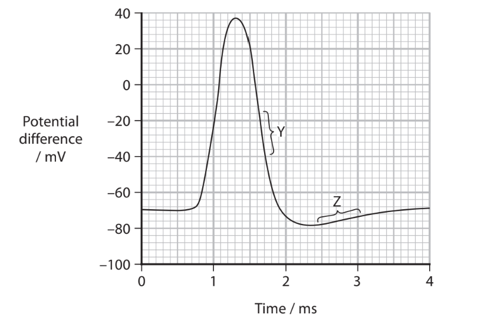

(i) Which is the resting potential for this axon?

**(1)**

| ☐ | **A** | –70mV |
|---|---|---|
| ☐ | **B** | –78mV |
| ☐ | **C** | 38mV |
| ☐ | **D** | 108mV |

(ii) Both voltage-gated sodium and voltage-gated potassium ion channels are involved in generating an action potential.

Which of these voltage-gated channels are open at Y?

**(1)**

☐ **A** No voltage-gated ion channels are open 
☐ **B** Voltage-gated sodium ion channels only
☐ **C** Voltage-gated potassium ion channels only 
☐ **D** Both sodium and potassium voltage-gated ion channels

(iii) Which is the state of polarisation of the membrane at Z?

**(1)**

| ☐ | **A** | Depolarised |
|---|---|---|
| ☐ | **B** | Hyperpolarised |
| ☐ | **C** | Hypopolarised |
| ☐ | **D** | Unpolarised |

(iv) How many of the following statements are correct?

- The magnitude of the action potential is proportional to the strength of stimulus that generates the action potential
- Action potentials spread out in both directions along the axon
- Following an action potential, there is a refractory period during which it is not possible to generate a new action potential

**(1)**

| ☐ | **A** | None |
|---|---|---|
| ☐ | **B** | One |
| ☐ | **C** | Two |
| ☐ | **D** | Three |

### 1((b)) — 3 marks — command: explain — structured — from paper Jan 2021 · WBI15/01
Explain why maintaining a resting potential requires ATP.

## Q2 — medium — 4 marks · exam-questions

### 5((a)) — 4 marks — command: multiple — structured — from paper Jan 2022 · WBI15/01
Animals and plants can detect and respond to light.

Rod cells respond to light by producing action potentials in the optic nerve.

(i) In which structure are rod cells located?

**(1)**

| ☐ | **A** | Iris |
|---|---|---|
| ☐ | **B** | Pupil |
| ☐ | **C** | Retina |
| ☐ | **D** | Spinal cord |

(ii) Describe the role of rhodopsin in rod cells.

**(3)**

## Q3 — medium — 10 marks · exam-questions

### 5((a)) — 3 marks — command: explain — structured — from paper Jan 2021 · WBI15/01
One cause of blindness is a mutation in the DNA coding for the enzyme RPE65.

The enzyme RPE65 converts trans-retinal to cis-retinal.

Explain why mutations in the RPE65 gene can result in blindness.

### 5((b)) — 4 marks — command: describe — structured — from paper Jan 2021 · WBI15/01
Scientists are investigating the use of gene therapy to treat blindness caused by mutations in the RPE65 gene.

In one investigation, different gene therapy doses containing functioning RPE65 genes were compared.

Two months after treatment, the trans-retinal and cis-retinal in each eye and the ability to follow a path were measured.

The graphs show the results of this investigation.

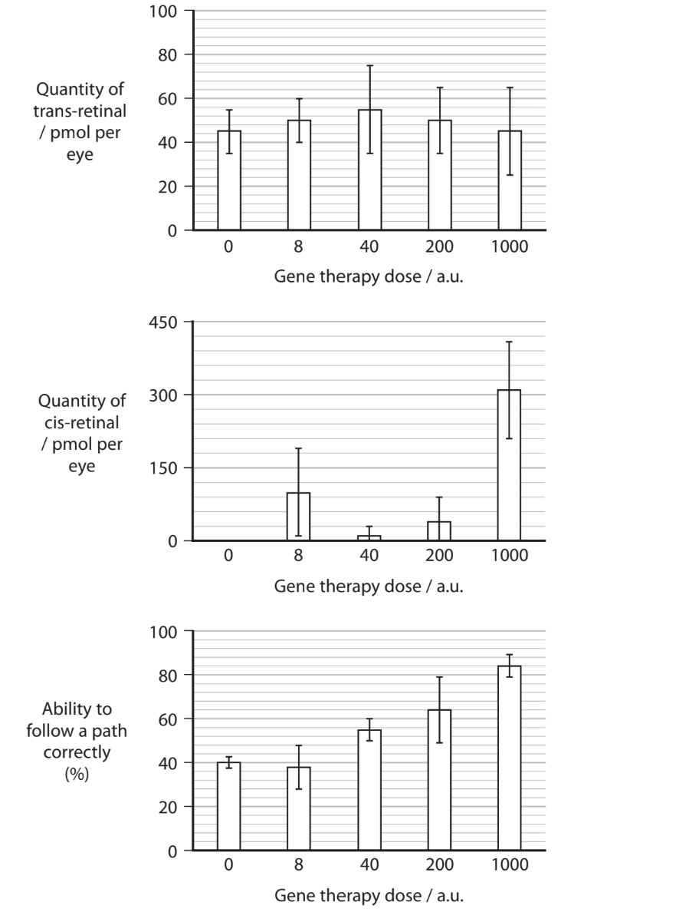

Describe the conclusions that can be made from this investigation.

Use the information in the graphs to support your answer.

### 5((c)) — 3 marks — command: describe — structured — from paper Jan 2021 · WBI15/01
Mutations in other genes can result in blindness.

Describe how these genes could be identified.

## Q4 — medium — 13 marks · exam-questions

### 5() — 9 marks — command: multiple — structured — from paper Oct/Nov 2020 · WBI15/01
The eye is a sense organ specialised for detecting light stimuli.

Pupils of the eye react to light.

The effects of different light intensities from two light sources have been investigated.

The table shows the results of this investigation.

| **Light intensity** **/ a.u. per m****2** | **Mean pupil diameter / mm** |   |
|---|---|---|
| **Incandescent light** | **LED light** |   |
| 0 | 25.5 | 25.5 |
| 75 | 24.0 | 22.0 |
| 150 | 24.0 | 18.5 |
| 200 | 23.0 | 17.5 |
| 300 | 21.5 | 16.0 |
| 650 | 17.5 | 12.0 |
| 1400 | 16.0 | 9.5 |

(i) Describe the relationship between light intensity and pupil diameter.

**(2)**

(ii) Calculate the amount of incandescent light that can pass through the pupil when the light intensity is 1400 a.u. per m2.

Use a value of pi (*π*) = 3.14

**(3)**

(iii) Describe how light entering the eye causes the pupil to respond.

**(4)**

### 5() — 4 marks — command: multiple — structured — from paper Oct/Nov 2020 · WBI15/01
Age-related macular degeneration (AMD) is a common cause of blindness in older people.

In AMD the epithelial layer behind the retina is damaged.

A new treatment for AMD uses induced pluripotent stem cells. These cells are grown in a culture to produce a retinal epithelial layer.

This retinal epithelial layer can then be used to replace the damaged layer of cells.

The procedure is outlined in the flow chart.

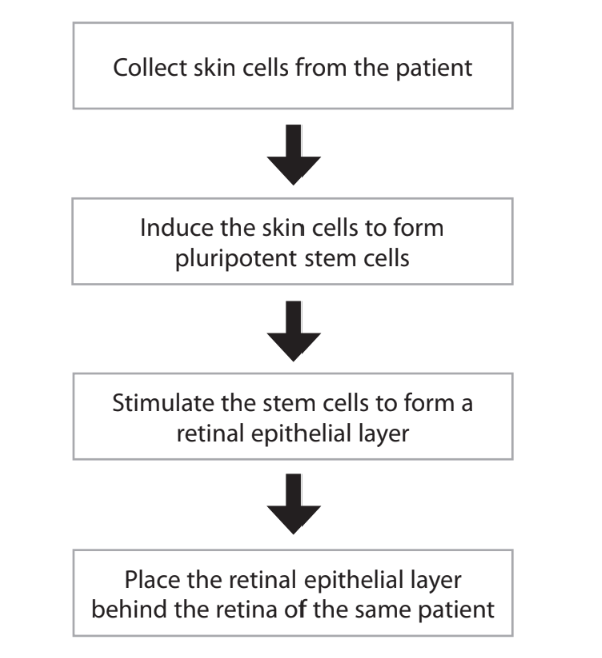

(i) State what is meant by the term **pluripotent stem cell**.

**(2)**

(ii) The epithelial layer is checked to ensure that there are no stem cells present before it is placed in the eye of the patient.

Suggest why this check is carried out.

**(2)**

## Q5 — medium — 9 marks · exam-questions

### 6() — 2 marks — command: which — structured — from paper Oct/Nov 2020 · WBI15/01
Many predatory animals produce toxins to disable their prey. Some of these toxins inhibit nervous communication.

Nerve impulses are transmitted along axons. Some axons are myelinated.

(i) Which type of cell produces myelin?

**(1)**

☐ **A** neurone

☐ **B** rod cell

☐ **C** Schwann cell

☐ **D** lymphocyte

(ii) Which row correctly compares the conduction of an impulse along a myelinated neurone with conduction along a non-myelinated neurone?

**(1)**

|   | **Compared with a non-myelinated** **neurone the speed of conduction in** **a myelinated neurone is** | **Because membrane depolarisation** **only takes place in the axon** **membrane** |
|---|---|---|
| ☐ **A** | faster | at nodes of Ranvier |
| ☐ **B** | faster | in between nodes of Ranvier |
| ☐ **C** | slower | at nodes of Ranvier |
| ☐ **D** | slower | in between nodes of Ranvier |

### 6((b)) — 4 marks — command: describe — structured — from paper Oct/Nov 2020 · WBI15/01
Describe the role of ion transport in maintaining the resting potential of a neurone.

### 6((c)) — 3 marks — command: deduce — structured — from paper Oct/Nov 2020 · WBI15/01
The pufferfish produces a neurotoxin called tetrodotoxin (TTX).

The graph shows the effect of TTX on the nerve impulse in an axon.

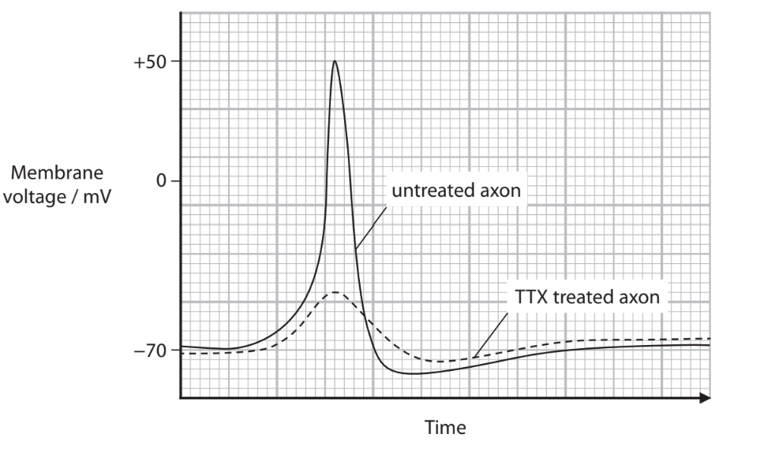

Deduce how TTX inhibits nerve impulses in an axon.

## Q6 — medium — 10 marks · exam-questions

### 7() — 4 marks — command: multiple — structured — from paper Oct/Nov 2020 · WBI15/01
Parkinson’s disease occurs when dopamine-producing neurones die.

The most obvious motor symptoms of Parkinson’s disease include muscle tremors and muscle rigidity.

These motor symptoms are linked to the loss of dopamine-producing neurones in the brain.

(i) One drug used to treat Parkinson’s disease is L-DOPA.

Which of the following statements explains why L-DOPA can be used to treat Parkinson’s disease?

**(1)**

☐ **A** L-DOPA acts on a different post-synaptic receptor to dopamine

☐ **B** L-DOPA crosses the blood-brain barrier and is then converted to dopamine in the brain

☐ **C** L-DOPA is converted to dopamine in the blood and then crosses the blood-brain barrier

☐ **D** L-DOPA is identical to dopamine

(ii) Explain why the release of reduced quantities of dopamine by presynaptic neurones could result in motor symptoms.

**(3)**

### 7((b)) — 2 marks — command: suggest — structured — from paper Oct/Nov 2020 · WBI15/01
It has been suggested that in Parkinson’s disease dopamine-producing neurones die because of a failure to release dopamine.

Suggest how the release of dopamine from presynaptic neurones could be inhibited.

### 7((c)) — 4 marks — command: describe — structured — from paper Oct/Nov 2020 · WBI15/01
Describe how microarrays and bioinformatics could be used to investigate the genetic basis of Parkinson’s disease.

## Q7 — medium — 12 marks · exam-questions

### 7((a)) — 7 marks — command: describe — structured — from paper Jan 2021 · WBI15/01
Parkinson’s disease is a nervous system disorder that affects movement.

In people with Parkinson’s disease, some neurones in the brain die.

Many of the symptoms of Parkinson’s disease are due to a loss of neurones that produce a neurotransmitter called dopamine.

(i) Describe how a neurotransmitter transmits a nerve impulse across a synapse.

**(4)**

(ii) One treatment for Parkinson’s disease is a drug called L-DOPA.

Describe how L-DOPA reduces some of the symptoms of Parkinson’s disease.

**(3)**

### 7((b)) — 5 marks — command: multiple — structured — from paper Jan 2021 · WBI15/01
Scientists can induce pluripotent stem cells to produce transcription factors involved in the synthesis of dopamine.

(i) Explain how transcription factors are involved in the synthesis of dopamine.

**(2)**

(ii) Some people with Parkinson’s disease have a DNA mutation called LRRK2.

Scientists studied the effect of this mutation on the dendrites of dopamine neurones produced from the stem cells of three groups of people.

The graphs show some of the results of their study.

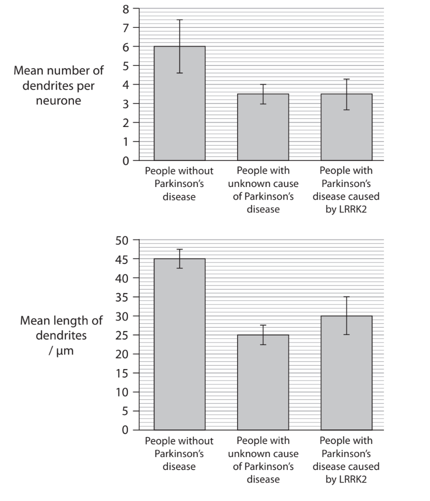

Comment on these results.

**(3)**

## Q8 — medium — 11 marks · exam-questions

### 2((a)) — 2 marks — command: which — structured — from paper June 2021 · WBI15/01
The nervous system of an organism enables it to respond to a stimulus.

A reflex action is a rapid involuntary movement in response to a stimulus.

The response to a pinprick in a finger is an example of a reflex action.

(i) Which component of the nervous system continues a reflex arc immediately after the receptor has been stimulated by the stimulus?

**(1)**

| ☐ | **A** | motor neurone |
|---|---|---|
| ☐ | **B** | relay neurone |
| ☐ | **C** | Schwann cell |
| ☐ | **D** | sensory neurone |

(ii) Which pathway shows a reflex arc?

**(1)**

| ☐ | **A** | muscle              ⟶           receptor              ⟶              brain |
|---|---|---|
| ☐ | **B** | muscle              ⟶           spinal cord         ⟶              brain |
| ☐ | **C** | receptor            ⟶          spinal cord          ⟶              muscle |
| ☐ | **D** | spinal cord       ⟶           brain                   ⟶              muscle |

### 2((b)) — 9 marks — command: multiple — structured — from paper June 2021 · WBI15/01
Pacinian corpuscles are pressure receptors found in the skin of the fingertip.

The effect of different pressures applied to the finger tip, on electrode potentials across the axon membrane of the neurone of a Pacinian corpuscle was investigated.

The diagram shows the structure of a Pacinian corpuscle and the location of electrodes, X and Y, used to measure axon membrane potentials.

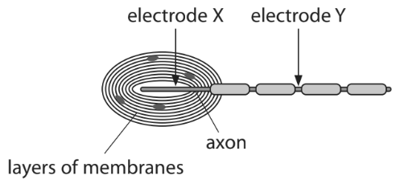

The table shows the results of the investigation.

| **Pressure applied to** **the fingertip** | **Membrane potential at** **electrode X / mV** | **Membrane potential at** **electrode Y / mV** |
|---|---|---|
| None | −70 | −70 |
| Low | −60 | −70 |
| Medium | +20 | +40 |
| High | +40 | +40 |

(i) Describe how the resting potential of −70 mV is maintained in the axon when no pressure is applied.

**(3)**

(ii) Suggest how a change in pressure at the Pacinian corpuscle causes an action potential in the axon.

**(3)**

(iii) Explain why the membrane potential at electrode Y was the same when medium or high pressure was applied to the fingertip.

**(3)**

## Q9 — medium — 7 marks · exam-questions

### 3((a)) — 3 marks — command: explain — structured — from paper June 2021 · WBI15/01
Many neurones in the human nervous system are myelinated.

A myelinated axon conducts impulses faster than a non-myelinated axon of the same diameter.

Explain this difference.

### 3((b)) — 2 marks — command: suggest — structured — from paper June 2021 · WBI15/01
Polyneuropathy is a disorder that damages the myelin sheath of neurones throughout the body.

One symptom is muscle weakness. Muscle weakness is the reduced strength in one or more muscles.

Suggest how damage to the myelin sheaths of neurones can lead to muscle weakness.

### 3((c)) — 2 marks — command: comment — structured — from paper June 2021 · WBI15/01
Dementia is a condition associated with the ongoing decline of brain functioning.

There are many types of dementia.

The relationship between myelin in brain tissue and types of dementia has been investigated.

The mean quantity of myelin in samples of brain tissue from groups of people with types of dementia and from a control group was measured.

The table shows the results of this investigation.

| **Group** | **Mean quantity of myelin in a brain tissue sample / a.u.** | **Standard deviation** |
|---|---|---|
| Control (no dementia) | 52 | ± 3.2 |
| Patients with vascular dementia | 25 | ± 5.9 |
| Patients with Alzheimer’s dementia | 32 | ± 4.1 |
| Patients with Lewy Body dementia | 42 | ± 5.0 |

A student concluded that there was a relationship between the quantity of myelin in the brain of a person and whether or not they had dementia.

Comment on the validity of this conclusion.

## Q10 — medium — 9 marks · exam-questions

### 3((a)) — 2 marks — command: multiple — structured — from paper Oct/Nov 2021 · WBI15/01
The mammalian retina is a tissue that detects light.

Rod cells and bipolar neurones are cell types found in the retina.

(i) What is the name of the chemical formed when light is absorbed by the photopigment found in rod cells?

**(1)**

| ☐ | **A** | cis‐retinal |
|---|---|---|
| ☐ | **B** | phytochrome |
| ☐ | **C** | rhodopsin |
| ☐ | **D** | trans‐retinal |

(ii) Which row in the table shows the effects of light absorption on cells in the retina?

**(1)**

|   | **Rod cell** | **Bipolar neurone** |
|---|---|---|
| ☐ **A** | hyperpolarised | hyperpolarised |
| ☐ **B** | hyperpolarised | depolarised |
| ☐ **C** | depolarised | hyperpolarised |
| ☐ **D** | depolarised | depolarised |

### 3((b)) — 6 marks — command: multiple — structured — from paper Oct/Nov 2021 · WBI15/01
An investigation studied the effects of light intensity on the mammalian retina.

Samples of retina were exposed to different light intensities and the mean potential difference of the bipolar neurones was recorded.

The results are shown in the table.

| **Light intensity /a.u.** | **Mean potential difference /mV** |
|---|---|
| 2 | 11 |
| 4 | 17 |
| 8 | 19 |
| 12 | 20 |
| 16 | 20 |
| 20 | 20 |

(i) Describe the effect of light intensity on the mean potential difference of bipolar neurones.

**(2)**

(ii) Calculate the percentage change in the mean potential difference when the light intensity increases from 4 to 12 a.u.

**(2)**

Answer ..............................................%

(iii) Give **two** reasons why some people might have objections to the use of mammalian retinas in this investigation.

**(2)**

### 3((c)) — 1 mark — command: which — structured — from paper Oct/Nov 2021 · WBI15/01
Which statement describes the response of the muscles in the iris to increasing light intensity?

| ☐ | **A** | circular and radial muscles contract |
|---|---|---|
| ☐ | **B** | circular and radial muscles relax |
| ☐ | **C** | circular muscles contract and radial muscles relax |
| ☐ | **D** | circular muscles relax and radial muscles contract |

## Q11 — medium — 6 marks · exam-questions

### 5((a)) — 2 marks — command: multiple — structured — from paper June 2021 · WBI15/01
The body length of the medicinal leech decreases when touched.

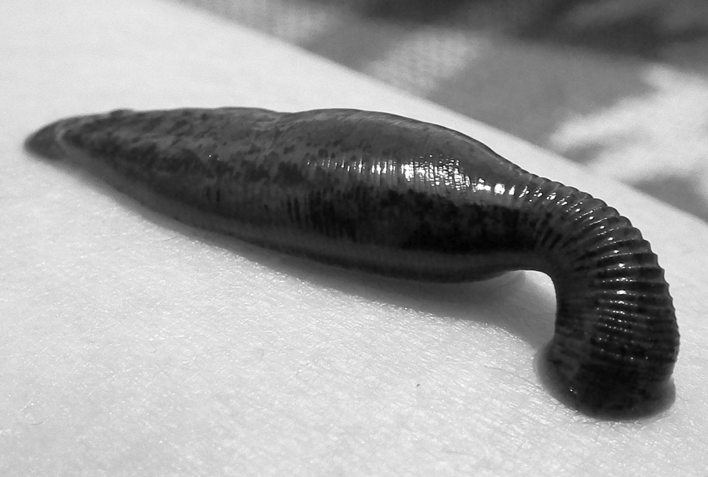

GlebK, CC BY-SA 3.0 <https://creativecommons.org/licenses/by-sa/3.0>, via Wikimedia Commons

The body length of the leech decreases less each time the leech is touched.

(i) What is the name of this effect?

**(1)**

| ☐ | **A** | absorption |
|---|---|---|
| ☐ | **B** | adaptation |
| ☐ | **C** | habituation |
| ☐ | **D** | sensitivity |

(ii) Why is it an advantage for the leech to respond in this way?

**(1)**

| ☐ | **A** | it filters out what is important and what is not important to react to |
|---|---|---|
| ☐ | **B** | it enables the animal to react more quickly to the stimulus |
| ☐ | **C** | it keeps the habitat of the animal protected |
| ☐ | **D** | it helps the animal find food more easily |

### 5((b)) — 4 marks — command: multiple — structured — from paper June 2021 · WBI15/01
The photograph shows a fiddler crab.

Wilfredor, CC0, via Wikimedia Commons

In an experiment, the fiddler crab was used to investigate responses to a predator. The responses by females and males were compared.

A predator approached a group of female crabs from one direction.

The percentage of crabs running home was recorded. This was repeated 20 times.

This experiment was repeated with a group of male crabs.

The graphs show the percentage of crabs running home for both groups of crabs against the total number of times each group of crabs encountered a predator.

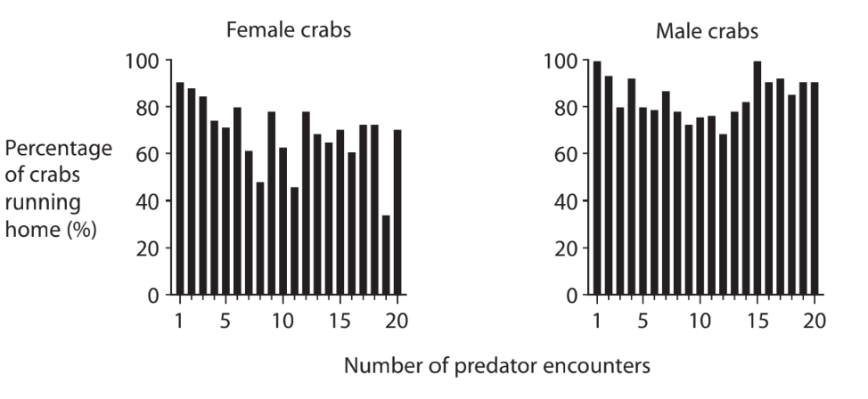

(i) Comment on the results of this experiment.

**(3)**

(ii) Which statistical test would be used to analyse the effect of the increase in the number of predator encounters on the percentage of crabs running home?

**(1)**

| ☐ | **A** | correlation coefficient |
|---|---|---|
| ☐ | **B** | Hardy-Weinberg |
| ☐ | **C** | index of diversity |
| ☐ | **D** | Student’s t-test |

## Q12 — medium — 7 marks · exam-questions

### 7((a)) — 7 marks — command: multiple — structured — from paper June 2021 · WBI15/01
Animals and plants can respond to light.

The photograph shows the front of a human eye.

ROTFLOLEB, CC BY-SA 3.0 <https://creativecommons.org/licenses/by-sa/3.0>, via Wikimedia Commons

(i) The size of the pupil changes when moving from dim to very bright light.

Explain how this change occurs.

**(3)**

(ii) Describe the role of rhodopsin in causing changes in the polarisation of rod cells.

**(4)**

## Q13 — medium — 8 marks · exam-questions

### 3((a)) — 2 marks — command: multiple — structured — from paper Jan 2022 · WBI15/01
Whales are large mammals.

The photograph shows a humpback whale and a human diver.

NOAA's National Ocean Service, CC BY 2.0 <https://creativecommons.org/licenses/by/2.0>, via Wikimedia Commons

(i) A humpback whale can become habituated to human divers.

How many of the following statements about habituation are correct?

**(1)**

- Habituation is an example of anatomical adaptation
- Habituation is only observed in mammals
- Habituation only occurs after repeated exposure to the same stimulus

| ☐ | **A** | 0 |
|---|---|---|
| ☐ | **B** | 1 |
| ☐ | **C** | 2 |
| ☐ | **D** | 3 |

(ii) A humpback whale can respond to a stimulus using a spinal reflex arc.

Which row is correct?

**(1)**

|   | **Location of relay neurone** | **Location of cell body on the sensory neurone** |
|---|---|---|
| ☐ **A** | grey matter of spinal cord | at the end of the axon |
| ☐ **B** | grey matter of spinal cord | in the middle of the axon |
| ☐ **C** | white matter of spinal cord | at the end of the axon |
| ☐ **D** | white matter of spinal cord | in the middle of the axon |

### 3((b)) — 6 marks — command: multiple — structured — from paper Jan 2022 · WBI15/01
The heart rate of a whale changes when it is diving.

The graph shows the changes in heart rate that occur during dives of different durations.

The maximum heart rate at the surface is when the whale returns to the surface after a dive.

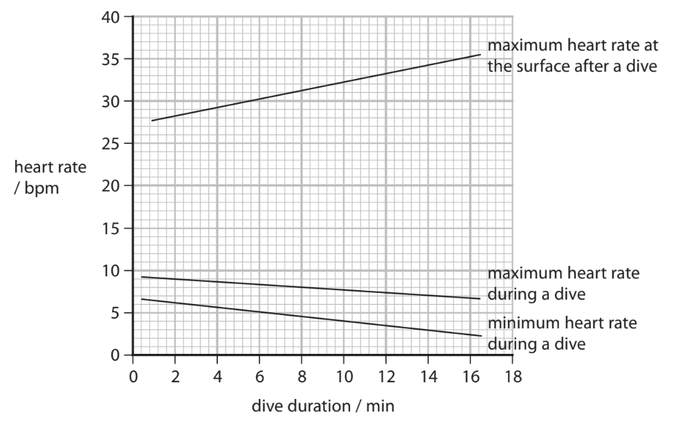

(i) Comment on the changes in heart rate of the whale when it is diving.

**(3)**

(ii) Explain how the changes in heart rate are controlled when the whale returns to the surface immediately after the dive.

**(3)**

## Q14 — medium — 13 marks · exam-questions

### 6((a)) — 1 mark — command: which — structured — from paper Jan 2022 · WBI15/01
The nervous system is a complex collection of neurones and specialised cells that transmit impulses between different parts of the body.

Which substance can transmit a nerve impulse from one neurone to the next one?

| ☐ | **A** | Acetylcholine |
|---|---|---|
| ☐ | **B** | ADP |
| ☐ | **C** | Cholesterol |
| ☐ | **D** | NADP |

### 6((b)) — 2 marks — command: explain — structured — from paper Jan 2022 · WBI15/01
The diagram shows the change in membrane potential as an action potential is transmitted in a motor neurone.

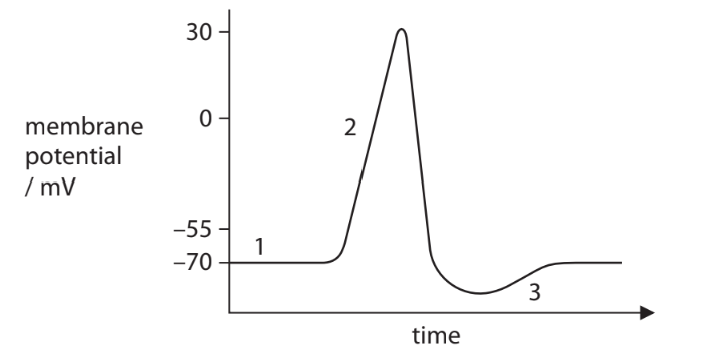

Explain why the membrane potential changes between 1 and 2.

### 6((c)) — 6 marks — command: multiple — structured — from paper Jan 2022 · WBI15/01
Myelinated neurones are surrounded by a fatty sheath.

The graph shows the speed of conduction in myelinated neurones and non‐myelinated neurones.

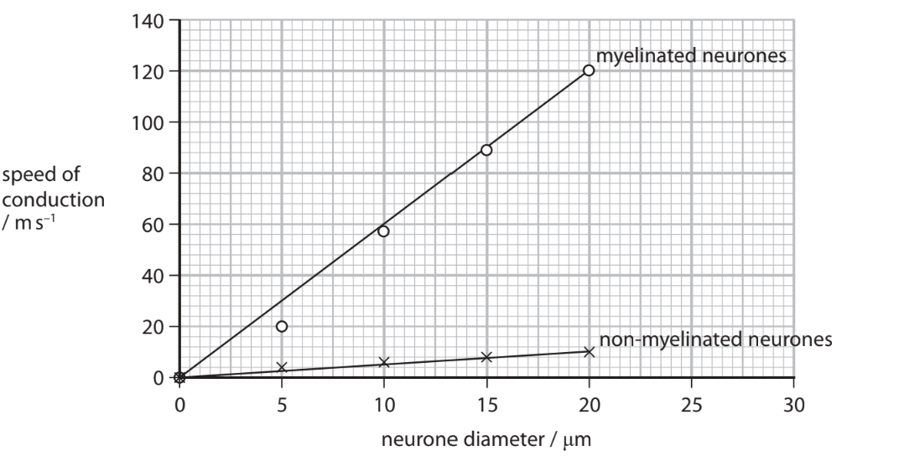

(i) Calculate the percentage difference in the gradient of the myelinated and non‐myelinated neurones.

The gradient for non‐myelinated neurones is 0.5.

The equation for a straight line is y = *mx + c* .

**(3)**

(ii) Explain why the speed of conduction differs in myelinated and non‐myelinated neurones.

**(3)**

### 6((d)) — 4 marks — command: explain — structured — from paper Jan 2022 · WBI15/01
The positron emission tomography (PET) images show the brain of an individual before (control) and after taking the drug cocaine.

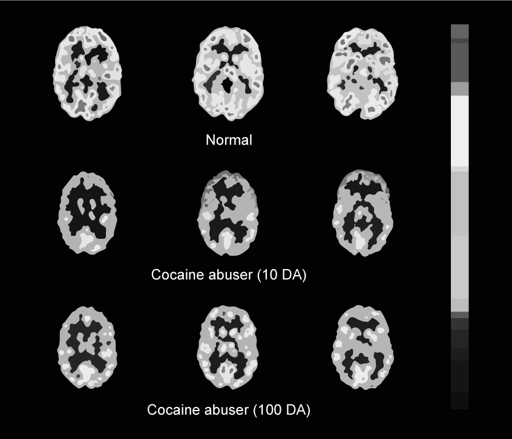

Explain how positron emission tomography (PET) can be used to identify the change in activity in the brain after taking this drug.

## Q15 — medium — 13 marks · exam-questions

### 1() — 1 mark — multiple_choice
An action potential can be split into four main stages: depolarisation, repolarisation, hyperpolarisation and resting state.

Which row shows the events that occur in order for a neurone to become hyperpolarised?

|   | **Voltage-gated sodium channels** | **Voltage-gated potassium channels** |
|---|---|---|
| **A** | closed | closed |
| **B** | closed | open |
| **C** | open | closed |
| **D** | open | open |
- **A.** 
- **B.** 
- **C.** 
- **D.** 

### 2() — 3 marks — command: draw — structured
Draw a labelled diagram of a myelinated sensory neurone.

### 3() — 3 marks — command: describe — structured
A patient visited a neurologist because they had reduced sensation in their hands. The neurologist carried out a nerve conduction test on the patient.

The graph shows the action potential recorded from a healthy nerve.

Describe the membrane permeability to sodium and potassium ions throughout the action potential shown in the graph.

### 4() — 2 marks — command: calculate — structured
The neurologist compared the speed of nerve impulse conduction in the patient's affected nerve and in the healthy control nerve.

They placed one electrode 45 mm from one end of each nerve and a second electrode 285 mm from the same end. The table shows the time delay recorded between the two electrodes for each nerve.

|   | Time delay / ms |
|---|---|
| Healthy control nerve | 3.75 |
| Patient's affected nerve | 8.00 |

Calculate the speed of nerve impulse conduction in the patient's affected nerve.

Give your answer in m s⁻¹.

### 5() — 4 marks — command: suggest — structured
The patient's action potential is normal, but their nerve conduction speed is significantly slower than the healthy control.

The neurologist diagnoses the patient with a condition that causes progressive damage to the myelin sheath.

Suggest how damage to the myelin sheath leads to the patient's reduced sensation in their hands.

## Q16 — medium — 10 marks · exam-questions

### 1() — 1 mark — multiple_choice
Which statement about synaptic transmission is correct?
- **A.** neurotransmitter molecules are actively transported across the synaptic cleft to the postsynaptic membrane
- **B.** calcium ions cause synaptic vesicles to move towards the presynaptic membrane
- **C.** sodium ions move across the synaptic cleft to the postsynaptic membrane
- **D.** neurotransmitters bind to complementary receptors on the presynaptic membrane

### 2() — 3 marks — command: describe — structured
Tropicamide is a drug used during eye examinations to allow better visualisation of the back of the eye. Tropicamide affects the action of muscles in the iris.

Describe how an increase in light intensity results in changes to the muscles of the iris in the absence of tropicamide.

### 3() — 6 marks — command: evaluate — structured
In a clinical study, 0.5% tropicamide was administered as eye drops to one eye of 30 patients, while the other eye received saline drops as a control.

The bar chart shows the mean pupil diameter in each eye at 20 minutes after administration.

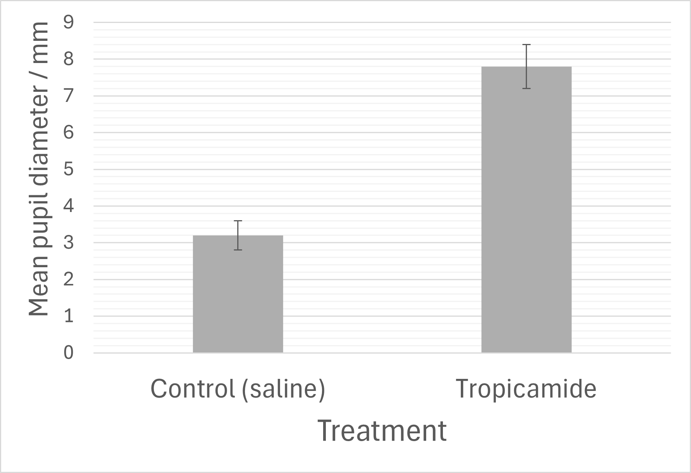

The scientists then investigated two different concentrations of tropicamide to determine which is more suitable for routine use in eye examinations.

The table shows the results.

| Measurement | 0.5% tropicamide (n = 30) | 1.0% tropicamide (n = 30) |
|---|---|---|
| Mean maximum pupil diameter (mm) ± SD | 7.8 ± 0.6 | 8.4 ± 0.4 |
| Mean time to maximum dilation (min) ± SD | 22 ± 5 | 18 ± 3 |
| Mean recovery time to normal pupil diameter (min) ± SD | 180 ± 45 | 360 ± 90 |
| Patients reporting blurred vision (%) | 73 | 97 |
| Patients reporting light sensitivity lasting > 4 hours (%) | 12 | 58 |
| Mean patient comfort score (1–10, 10 = most comfortable) ± SD | 7.2 ± 1.8 | 4.1 ± 2.3 |

*Evaluate the use of tropicamide in eye examinations. Include a consideration of which concentration is most suitable for routine use.
