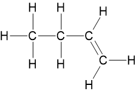
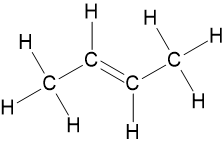
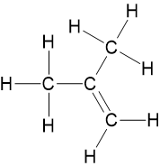

# Mark Schemes — Formulae & Equations
**1. Structure, Bonding & Introduction to Organic Chemistry** · Edexcel International A Level (IAL) Chemistry (YCH11)

## Q1 — medium — 7 marks · structured-questions

### 19((a)) — 5 marks
i) The completed table is:

| **Measurement** | **Mass / g** |
|---|---|
| Mass of empty crucible | 21.21 |
| Mass of crucible and hydrated magnesium sulfate before heating | 26.71 |
| Mass of crucible and magnesium sulfate after heating for two minutes | 24.12 |
| Mass of magnesium sulfate after heating for two minutes | **Final answer:** **2.91** |
| Mass of water lost | **Final answer:** **2.59** |

- Both masses required; **[1 mark]**

ii) The value of **x** in MgSO4 ·**x**H2O is:

- *M*r of MgSO4: (24.3 + 32.1 + (4 × 16)) = 120.4; **[1 mark]**
- Moles of MgSO4: (2.91 ÷ 120.4) = 0.024169 / 2.4169 × 10-2 (mol); **[1 mark]**
- Moles of H2O: (2.59 ÷ 18) = 0.14389 / 1.4389 × 10-1 (mol); **[1 mark]**
- Ratio of moles of water to moles of magnesium sulfate to the nearest whole number: (0.1438889 ÷ 0.0241694) = 5.9533:1 x = 6; **[1 mark]**

**[Total: 5 marks]**

- *To calculate the mass of the magnesium sulfate after heating: *

  - *mass of crucible and magnesium sulfate after heating for two minutes - mass of empty crucible*
- *To calculate the mass of water lost:*

  - *mass of crucible and magnesium sulfate after heating for two minutes - Mass of crucible and hydrated magnesium sulfate before heating*
- *The value of x is found the same way you complete an empirical formula calculation *

  - *Find the mass of both the magnesium sulfate and water *
  - *Find the moles of both the magnesium sulfate and water *
  - *Find the ratio by dividing both answers by the smaller value (in this case the moles of magnesium sulfate)*

### 19((b)) — 2 marks
A way of improving the method to obtain a more accurate result, using the same apparatus is:

- Heat to constant mass / until mass does not change; **[1 mark]**
- To ensure all the water is lost / driven off; **[1 mark]**

**[Total: 2 marks]**

- *Heating to constant mass might result in a higher mass of water being lost*
- *This would give a higher number of moles of water, affecting the value of **x*

## Q2 — medium — 11 marks · structured-questions

### 1() — 3 marks
To calculate the empirical formula of **X**:

- All carbon in CO2 originates from X (carbon is conserved during combustion), so the mass of C in the sample equals the mass of C in 1.760 g of CO2:

m(C) = (12/44) × 1.760 = **0.480 g**

- All hydrogen in H2O originates from X, by the same reasoning:

m(H) = (2/18) × 0.720 = **0.080 g**

- Mass balance check: m(C) + m(H) = 0.480 + 0.080 = 0.560 g, which equals the mass of X — confirming X contains no oxygen and is a pure hydrocarbon. **[1 mark]**

- The empirical formula represents the simplest mole ratio of atoms, so convert each mass into moles by dividing by the relative atomic mass:

| Element | Mass (g) | ÷ Ar | Moles |
|---|---|---|---|
| C | 0.480 | ÷ 12 | 0.0400 |
| H | 0.080 | ÷ 1 | 0.0800 |

**[1 mark]**

- Divide each by the smallest mole value (0.0400) to scale the ratio to whole numbers:

C : H = 0.0400/0.0400 : 0.0800/0.0400 = 1 : 2

- The empirical formula of **X** is:

**CH~2~** **[1 mark]**

> **[mark-scheme]**
> 1 mark for **m(C) = 0.480 g AND m(H) = 0.080 g** (both required)
> 
> Method mark only: correct substitutions (12/44) × 1.760 AND (2/18) × 0.720 if a numerical slip leads to incorrect masses
> 
> 1 mark for **moles of C = 0.0400 AND moles of H = 0.0800** (both required; ecf from incorrect masses)
> 
> 1 mark for **empirical formula CH~2~** (ecf from mole values, provided the simplest whole-number ratio is taken)
> 
> Reject any answer containing oxygen — the mass balance shows X is a pure hydrocarbon
> 
> Reject use of atomic numbers (C = 6, H = 1) instead of relative atomic masses
> 
> No working scores 0 (per Edexcel convention)

> **[exam-tip]**
> The mass balance (m(C) + m(H) = m(X)) is the step that tells you X contains no oxygen. If the sum had been less than 0.560 g, the difference would be the mass of oxygen, found by **subtraction**, never directly from the CO2 or H2O (the oxygen in those products comes from the excess O2 supplied, not from X).
> 
> Set out your moles conversion as a table and divide every value by the smallest. Using atomic numbers instead of Ar values is the most common error in empirical formula questions.

### 2() — 2 marks
To deduce the molecular formula of **X**:

- The molecular formula is a whole-number multiple of the empirical formula, so first find the empirical formula mass of CH2:

12 + 2(1) = 14

- Find n by dividing the molecular mass by the empirical formula mass:

n = Mr(molecule) ÷ Mr(empirical formula) = 56 ÷ 14 = 4 **[1 mark]**

- Multiply every subscript in the empirical formula by n = 4:

**C****4****H****8** **[1 mark]**

> **[mark-scheme]**
> 1 mark for **n = 56 ÷ 14 = 4**
> 
> Accept calculation only, even if empirical formula mass is not separately stated
> 
> 1 mark for **molecular formula C****4****H****8**
> 
> ecf from incorrect empirical formula in part (a), provided the method is correct

> **[exam-tip]**
> Always SHOW the step that links empirical and molecular formulas:
> 
> n = Mr ÷ (empirical formula mass)
> 
> Writing the molecular formula with no working risks losing the method mark even if the final answer is correct. Once you have n, multiply EVERY subscript in the empirical formula by it.

### 3() — 2 marks
**i)**

- The functional group responsible is the **carbon–carbon double bond (C=C / alkene group)**. **[1 mark]**

**ii)**

- The straight-chain alkene with molecular formula C4H8 and the C=C at the end of the carbon chain is **but-1-ene**, CH2=CHCH2CH3:

**[1 mark]**

> **[mark-scheme]**
> i) 1 mark for **C=C / carbon–carbon double bond / alkene group / alkene functional group**
> 
> Accept "double bond" only if context makes clear it refers to the C=C
> 
> Reject "covalent bond" alone
> 
> Reject "hydroxyl" or any non-alkene group
> 
> ii) 1 mark for correct displayed formula of **but-1-ene** (CH2=CHCH2CH3)
> 
> All 8 hydrogens must be shown with bonds (displayed formula required)
> 
> The C=C must be shown as a double bond between C1 and C2 (terminal position)
> 
> Reject but-2-ene (C=C in middle of chain — does not match "at the end of the chain")
> 
> Reject 2-methylpropene (branched, not straight-chain)
> 
> Reject skeletal or condensed formulae

> **[exam-tip]**
> The standard observation when an alkene reacts with bromine water is **orange (or red-brown) → colourless** — never write "clear" (a clear solution can still be coloured). For displayed formulae every bond and every hydrogen must be drawn explicitly; a skeletal formula scores zero. The C=C at the end of a chain produces a terminal alkene (but-1-ene); a C=C in the middle gives but-2-ene, which would additionally need E/Z labelling.

### 4() — 4 marks
The displayed formulae and systematic names of two structural isomers of C4H8 (other than but-1-ene):

- Name: **but-2-ene** — CH3CH=CHCH3

- Name: **2-methylpropene** — (CH3)2C=CH2

**[4 marks]**

> **[mark-scheme]**
> 1 mark each (max 2) for any TWO correctly drawn displayed formulae of:
> 
> - **but-2-ene** — CH3CH=CHCH3 (positional isomer, internal C=C)
> - **2-methylpropene** — (CH3)2C=CH2 (chain isomer, branched alkene)
> - **methylcyclopropane** — cyclic isomer (3-carbon ring with –CH3 branch)
> - **cyclobutane** — cyclic isomer (4-carbon ring)
> 
> All bonds AND all hydrogens must be shown explicitly (displayed formula required)
> 
> For but-2-ene, accept either *E*- or *Z*- isomer drawn correctly; "but-2-ene" alone is also acceptable
> 
> 1 mark each (max 2) for the correct **systematic name** matching each drawn structure
> 
> Accept "(E)-but-2-ene" or "(Z)-but-2-ene" if the geometry is correctly drawn
> 
> Reject:
> 
> - but-1-ene (this is X itself)
> - Any structure with a different molecular formula
> - Condensed or skeletal formulae without all bonds shown
> - A name that does not match the drawn structure

> **[exam-tip]**
> C4H8 has several structural isomers: three alkenes (but-1-ene, but-2-ene, 2-methylpropene) and two cycloalkanes (cyclobutane, methylcyclopropane).
> 
> Recognising that cycloalkanes share the same general formula as alkenes (CnH2n) is a common discriminator in Edexcel isomer questions.
> 
> Every bond, including every C–H bond, must be drawn explicitly for a displayed formula. Match each drawn structure to its systematic name carefully; a name that doesn't match the structure scores zero for the name mark.

## Q3 — hard — 13 marks · structured-questions

### 24((a)) — 1 marks
The numbers of subatomic particles in 56Fe2+ are:

- Protons = 26 
**AND**
Neutrons = 30 
**AND **
Electrons = 24; **[1 mark]**

**[Total: 1 mark]**

- *Iron has an atomic number of 26*
- *This means that it normally has 26 protons and 26 electrons*

  - *Since this is a 2+ ion, it has lost 2 electrons *
  - *Therefore, the ion in this question has 24 electrons*
- *The number of neutrons = mass number – atomic number = 56 - 26 = 30*

### 24((b)) — 2 marks
The relative atomic mass of this sample of iron to** three** significant figures is:

- `fraction numerator open parentheses 54 cross times 5.84 close parentheses plus open parentheses 56 cross times 91.68 close parentheses plus open parentheses 57 cross times 2.17 close parentheses plus open parentheses 58 cross times 0.31 close parentheses over denominator 100 end fraction`; **[1 mark]**
- 55.9; **[1 mark]**

**[Total: 2 marks]**

- *Remember: **A**r** = *$\frac{(\mathrm{relative} \mathrm{abundance}_{\mathrm{isotope}1}\times\mathrm{mass}_{\mathrm{isotope}1})+(\mathrm{relative} \mathrm{abundance}_{\mathrm{isotope}2}\times\mathrm{mass}_{\mathrm{isotope}2})\mathrm{etc}}{100}$
- *Careful:** The question asks for the answer to 3 significant figures*

### 24((c)) — 2 marks
The ionic equation, including state symbols, for the reaction of magnesium with aqueous iron(II) sulfate in a displacement reaction is:

Mg (s) + Fe2+ (aq) → Fe (s) + Mg2+ (aq)

- Correct ionic equation; **[1 mark]**
- All state symbols correct; **[1 mark]**

**[Total: 2 marks]**

- *The full equation, including state symbols, for the reaction is: Mg (s) + FeSO**4** (aq) → Fe (s) + MgSO**4** (aq) *
- *The question asks for the ionic equation*
- *So, you need to remove the sulfate ion which is a spectator ion resulting in: Mg (s) + Fe**2+** (aq) → Fe (s) + Mg**2+** (aq)*

### 24((d)) — 3 marks
To calculate the **empirical** formula of this compound:

- Mass of oxygen = 11.99 (g)
**AND**
Evidence of workings to calculate moles for Fe, S and O; **[1 mark]**
- Moles of Fe = 0.12509
**AND**
Moles of S = 0.18785
**AND**
Moles of O = 0.74938; **[1 mark]**
- Simplest whole number ratio = 2Fe : 3S : 12O
**AND**
Empirical formula = Fe2S3O12 **OR **Fe2(SO4)3; **[1 mark]**

**[Total: 3 marks]**

- *To calculate the empirical formula of the compound, you need to know the mass of oxygen 25.00 - 6.98 - 6.03 = 11.99 g*
- *You can then complete a standard empirical formula calculation:* | > *Elements * | > *Fe* | > *S* | > *O* |
|---|---|---|---|
| > *Mass* | > *6.98* | > *6.03* | > *11.99* |
| > *A**r** * | > *55.8* | > *32.1* | > *16.0* |
| > *Moles = *$\frac{\mathrm{mass}}{A_{r}}$ | > $\frac{6.98}{55.8}$* = 0.12509* | > $\frac{6.03}{32.1}$* = 0.18785* | > $\frac{11.99}{16.0}$* = 0.74398* |
| > *Ratio* | > $\frac{0.12509}{0.12509}$* = 1* | > $\frac{0.18785}{0.12509}$* = 1.5* | > $\frac{0.74938}{0.12509}$* = 6* |
| > *Whole number ratio * | > *2* | > *3* | > *12* |
- *This gives a final empirical formula of Fe**2**S**3**O**12** *

### 24((e)) — 5 marks
To deduce the overall equation for the reaction:

- Moles of Fe2O3 = 0.012531 **OR **1.2531 x 10-2; **[1 mark]**
- Moles of SO2 = 0.0124805 **OR **1.24805 x 10−2 
**AND**
Moles of SO3 = 0.012484 **OR** 1.2484 x 10−2; **[1 mark]**
- Mass of H2O = 3.15 (g)
**AND**
Moles of H2O = 0.175; **[1 mark]**
- Therefore, **x** = 7; **[1 mark]**
- 2FeSO4•7H2O → Fe2O3 + SO2 + SO3 + 14H2O; **[1 mark]**

**[Total: 5 marks]**

- *The first line of the question gives you an initial unbalanced chemical equation  FeSO**4**•**x**H**2**O → Fe**2**O**3** + SO**2** + SO**3** + H**2**O*
- *You have the information to calculate the moles of Fe**2**O**3**, SO**2**, SO**3** and H**2**O *
*Fe*2*O*3* = *$\frac{2.00}{159.6}$* = 0.012531 *
*SO*2* = *$\frac{0.80}{64.1}$* = 0.0124805 *
*SO*3* = *$\frac{1.00}{80.1}$* = 0.012484 *
*H*2*O = *$\frac{3.15}{18}$* = 0.175*
- *This gives a ratio of 1SO**2** : 1SO**3** : 14H**2**O for the products*

  - *But the iron-based reactant has one iron atom, while the iron product is Fe**2**O**3** with two iron atoms*
  - *This means that 2FeSO**4**•**x**H**2**O make 14 water molecules*
  - *Therefore, **x** must be 7, i.e. FeSO**4**•**7**H**2**O*
- *This information can now be used to build the complete equation **2**FeSO**4**•**7**H**2**O → Fe**2**O**3** + SO**2** + SO**3** + **14**H**2**O*

## Q4 — easy — 1 marks · multiple-choice-questions

### 1() — 1 marks
**Correct answer: B** — C3H8

**Final answer:** **The correct answer is ****B**** because:**

- The empirical formula is the **s**implest whole number ratio of the elements present in one molecule
- The ratio of C:H of 3:8 is the simplest ratio, so a molecule of C3H8 has the same molecular and empirical formulae

**A** is incorrect as the empirical formula is CH2

**C** is incorrect as  the empirical formula is C2H5

**D** is incorrect as the empirical formula is CH2

## Q5 — easy — 1 marks · multiple-choice-questions

### 5() — 1 marks
**Correct answer: B** — `Sn presubscript 50 presuperscript 124`

**Final answer:** **The correct answer is ****B**** because:**

- The number of neutrons is calculated by mass number - atomic number

  - **A: **In has 115 - 49 = 66 neutrons
  - **B: **Sn has 124 - 50 = 74 neutrons
  - **C: **Sb has 123 - 51 = 72 neutrons
  - **D: **Te has 124 - 52 = 72 neutrons
- Therefore **B **has the most neutrons

**A** is incorrect as In has 66 neutrons

**C** is incorrect as  Sb has 72 neutrons

**D** is incorrect as Te has 72 neutrons

## Q6 — easy — 1 marks · multiple-choice-questions

### 7() — 1 marks
**Correct answer: D** — 286

**Final answer:** **The correct answer is ****D**** because:**

- The relative formula mass of hydrated sodium carbonate, Na2CO3.10H2O is calculated by adding up the atomic masses of all the individual elements including the water or crystallisation

  - Na2CO3 = (2 x Na) + C + (3 x O) = (2 x 23.0) + 12.0 + (3 x 16.0) = 106
  - 10H2O = 10 x ((2 x H) + O) = 10 x ((2 x 1.0) + 16.0) = 180
  - So, Na2CO3.10H2O = 106 + 180 = 286

**A** is incorrect as this is the relative formula mass of anhydrous sodium carbonate, Na2CO3

**B** is incorrect as this involves an incorrect calculation for the relative formula mass, i.e. Na2CO3 + (20 x 1) + 16

**C** is incorrect as this is the relative formula mass of NaCO3.10H2O which has the incorrect formula for sodium carbonate

## Q7 — medium — 1 marks · multiple-choice-questions

### 2() — 1 marks
**Correct answer: C** — BH3

**Final answer:** **The correct answer is ****C**** because:**

- As there are 6.02 x 1023 of atoms in 0.25 mol, there will be 4 times this number of atoms in 1 mole
- 1 mole will contain 6.02 x 1023 molecules, so there must be 4 atoms per molecule
- BH3 is the only molecule which has 4 atoms in a molecule

**A** is incorrect as there are 1.51 x 1023 atoms

**B** is incorrect as  there are 4.52 x 1023 atoms

**D** is incorrect as  there are 7.53 x 1023 atoms

## Q8 — medium — 3 marks · multiple-choice-questions

### 7((a)) — 1 marks
**Correct answer: C** — 392.0

**Final answer:** **The correct answer is ****C**** because:**

- The relative formula mass of (NH4)2Fe(SO4)2·6H2O is calculated by:

  - 2 x (14.0 + (4 x 1.0)) + 55.8 + 2 x (32.1 + (4 x 16.0)) + 6 x ((2 x 1.0) + 16.0)
  - = 392

**A** is incorrect as  the brackets have been ignored

**B** is incorrect as  the mass of water has been omitted

**D** is incorrect as  the iron has been doubled

### 7((b)) — 1 marks
**Correct answer: D** — ionic, covalent and dative covalent

**Final answer:** **The correct answer is ****D**** because:**

- Ammonium sulfate is an ionic compound comprising of the ammonium ion, NH4+, and the sulfate ion, SO42-
- The ions are held together by strong electrostatic forces of attraction between the oppositely charged ions; these are known as **ionic **bonds
- Within the ions, the non-metal atoms are held together by **covalent **bonds, which are a shared pair of electrons
- You should also know that the ammonium ion also contains a **dative covalent** bond

  - The ammonium ion forms when the nitrogen atom in an ammonia molecule donates its lone pair of electrons to an electron-deficient hydrogen ion
  - When both electrons in a covalent bond are donated by one atom, it is known as a dative covalent bond

**A** is incorrect as  there are both dative covalent and covalent bonds within the ions

**B** is incorrect as  there are dative covalent bonds within the ions

**C** is incorrect as   there are covalent bonds within the ions

### 7((c)) — 1 marks
**Correct answer: C** — 3.01 × 1023

**Final answer:** **The correct answer is ****C**** because:**

- Number of (NH4)2Fe(SO4)2·6H2O in 0.1 mol = 6.02 x 1023 = 6.02 x 1022
- The number of ions in each (NH4)2Fe(SO4)2·6H2O is 5:

  - 2 x NH4+; 1 x Fe2+; 2 x SO42-
- Therefore the number of ions = 6.02 x 1022 x 5 = 3.01 x 1023

**A** is incorrect as  only one ammonium, one iron and one sulfate ion have been included

**B** is incorrect as  the iron ions have not been included

**D** is incorrect as  the water molecules have been included

## Q9 — medium — 1 marks · multiple-choice-questions

### 14() — 1 marks
**Correct answer: B** — 7.22 × 1021

**Final answer:** **The correct answer is ****B**** because:**

- The ratio of moles of C6H14 to CO2 is 1: 6
- 2 × 10−3 mol of hexane will therefore produce 2 x 10-3 x 6 = 0.0120 mol of carbon dioxide
- The number of molecules is the number of moles x Avogadro's constant so

  - 0.0120  x 6.02 × 1023 = 7.22 × 1021

**A** is incorrect as  a 1:1 ratio has been used instead of 1:6

**C** is incorrect as a 1:7 ratio has been used instead of 1:6

**D** is incorrect as  this is the number of atomic mass units in the product

## Q10 — medium — 1 marks · multiple-choice-questions

### 16() — 1 marks
**Correct answer: A** — Ba2+ (aq) + 2OH− (aq) + 2H+ (aq) + S$O_{4}^{2-}$ (aq) → BaSO4 (s) + 2H2O (l)

**Final answer:** **The correct answer is ****A**** because:**

- To write the ionic equation, rewrite the full equation, but break down any species into their respective ions:

  - Ba2+ (aq) + 2OH- (aq) + 2H+ (aq) + SO42- (aq) → BaSO4 (s) + 2H2O (l)
- The next step is to cancel out any spectator ions, in this case, there are no ions that are the same on both sides of the equation, i.e. there are no spectator ions, and the equation cannot be simplified any further

**B** is incorrect as  it only shows the precipitation reaction

**C** is incorrect as  it only shows the neutralisation reaction

**D** is incorrect as  it shows the barium sulfate ions as separated

## Q11 — medium — 1 marks · multiple-choice-questions

### 17() — 1 marks
**Correct answer: D** — Pb3O4

**Final answer:** **The correct answer is ****D**** because:**

- `percent sign space mass space of space an space element space equals space fraction numerator A subscript straight r cross times space number space of space atoms space of space the space element over denominator M subscript straight r space of space the space compound end fraction space cross times space 100`
- Option **A** / PbO

  - % Pb = `begin mathsize 14px style fraction numerator 207.2 over denominator open parentheses 207.2 plus 16.0 close parentheses end fraction cross times 100 end style` = 92.8%
- Option **B** / PbO2

  - % Pb = `fraction numerator 207.2 over denominator stretchy left parenthesis 207.2 plus open parentheses 2 cross times 16.0 close parentheses stretchy right parenthesis end fraction cross times 100` = 86.6%
- Option **C** / Pb2O3

  - % Pb = `fraction numerator open parentheses 2 cross times 207.2 close parentheses over denominator stretchy left parenthesis open parentheses 2 cross times 207.2 close parentheses plus open parentheses 3 cross times 16.0 close parentheses stretchy right parenthesis end fraction cross times 100` = 89.6%
- Option **D** / Pb3O4

  - % Pb = $\frac{(3\times207.2)}{((3\times207.2)+(4\times16.0))}\times100$ = 90.7%

**A**, **B** and **C** are incorrect as  they do not have the correct percentage by mass of lead

## Q12 — medium — 1 marks · multiple-choice-questions

### 20() — 1 marks
**Correct answer: A** — 2 × 1010

**Final answer:** **The correct answer is ****A**** because:**

- 1000 g of seawater contains 6 x 10-9 g of gold
- So, 1 g of seawater contains $\frac{6\times10^{-9}}{1000}$ = 6 x 10-12 g of gold
- The number of moles of gold is:

  - $\frac{6\times10^{-12}}{197}$ = 3.0457 x 10-14 moles of gold
- The number of atoms of gold is:

  - 3.0457 x 10-14  x 6 x 1023 = 1.827 x 1010 `begin mathsize 14px style asymptotically equal to end style`2 x 1010 atoms

**B** is incorrect as the mass of gold has not been converted into moles

**C** is incorrect as kg has not been converted into g

**D** is incorrect as  the mass of gold has not been converted into moles **AND **kg has not been converted into g

## Q13 — medium — 1 marks · multiple-choice-questions

### 1() — 1 marks
**Correct answer: A** — 1.20 × 1023

**Final answer:** **The correct answer is A**

- Moles of CO2: *n* = mass / *M*r = 8.8 / 44.0 = 0.20 mol
- Number of molecules = *n* × *L* = 0.20 × (6.02 × 1023) = **1.20 × 10^23^**

**B** is incorrect as 3.61 × 1023 is the number of **atoms** (0.20 mol CO2 contains 0.60 mol of atoms); the question asks for molecules

**C** is incorrect as 6.02 × 1023 is the number of molecules in 1 mol of CO2 (44.0 g), not in the 8.8 g given

**D** is incorrect as it multiplies the mass 8.8 g directly by *L*, forgetting to divide by *M*r to find moles first

> **[exam-tip]**
> For number-of-particles questions: always convert mass → moles (÷ *M*r) FIRST, then multiply by *L*. Read the question carefully — molecules, atoms, or ions? CO2 has 3 atoms per molecule, so the atom count is 3 times the molecule count.
