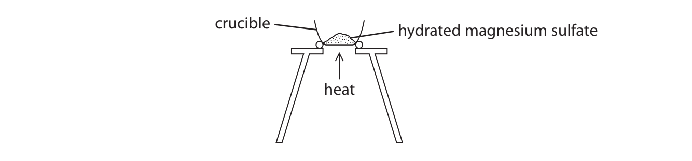

# Exam Questions — Formulae & Equations
**1. Structure, Bonding & Introduction to Organic Chemistry** · Edexcel International A Level (IAL) Chemistry (YCH11)
> Source: [https://www.savemyexams.com/international-a-level/chemistry/edexcel/17/topic-questions/1-structure-bonding-and-introduction-to-organic-chemistry/1-1-formulae-and-equations/structured-questions/](https://www.savemyexams.com/international-a-level/chemistry/edexcel/17/topic-questions/1-structure-bonding-and-introduction-to-organic-chemistry/1-1-formulae-and-equations/structured-questions/) · 13 questions · total 43 marks

## Q1 — medium — 7 marks · structured-questions

### 19((a)) — 5 marks — command: multiple — structured — from paper Jan 2022 · WCH11/01
This question is about the amount of water of crystallisation in hydrated magnesium sulfate, MgSO4 **·x**H2O.

The value of **x** in the formula was determined in an experiment.

**Procedure**

| Step **1** | A crucible was weighed, a spatula measure of hydrated magnesium sulfate was added and the crucible was reweighed. |
|---|---|
| Step** 2** | The crucible containing the hydrated magnesium sulfate was heated using the apparatus shown.   |
| Step **3** | After heating for two minutes, the crucible containing the magnesium sulfate was allowed to cool and was reweighed. |

i) Complete the table of results.

| **Measurement** | **Mass / g** |
|---|---|
| Mass of empty crucible | 21.21 |
| Mass of crucible and hydrated magnesium sulfate before heating | 26.71 |
| Mass of crucible and magnesium sulfate after heating for two minutes | 24.12 |
| Mass of magnesium sulfate after heating for two minutes |   |
| Mass of water lost |   |

**(1)**

ii) Use these results to calculate the value of **x** in MgSO4 ·**x**H2O.

Give your answer to the nearest whole number. [Ar values: H = 1.0 O = 16.0 Mg = 24.3 S = 32.1]

**(4)**

### 19((b)) — 2 marks — command: justify — structured — from paper Jan 2022 · WCH11/01
The correct value of **x** is greater than the value calculated in (a)(ii).

Suggest a way of improving the method to obtain a more accurate result, using the same apparatus. Justify your answer.

## Q2 — medium — 11 marks · structured-questions

### 1() — 3 marks — command: calculate — structured
An organic compound, **X**, contains only the elements carbon and hydrogen.

When 0.560 g of **X** is completely combusted in excess oxygen, 1.760 g of carbon dioxide and 0.720 g of water are produced.

Calculate the empirical formula of **X**. You must show all your working.

### 2() — 2 marks — command: deduce — structured
The relative molecular mass, *M*r, of **X** is 56.

Deduce the molecular formula of **X**.

### 3() — 2 marks — command: multiple — structured
When **X** is added to bromine water, the orange colour decolourises.

i) Name the functional group in **X** responsible for this reaction.

[1]

ii) Given that **X** has the C=C double bond at the end of the carbon chain, draw the displayed formula of **X**.

[1]

### 4() — 4 marks — command: draw — structured
Compound **X** has other structural isomers with molecular formula C4H8.

Draw the displayed formulae of **two** other structural isomers of C4H8 (other than **X**), and give the systematic name of each.

[4]

## Q3 — hard — 13 marks · structured-questions

### 24((a)) — 1 mark — command: complete — structured — from paper June 2021 · WCH11/01
This question is about iron and some of its compounds.

Complete the table to show the numbers of subatomic particles in 56Fe2+.

| **Number of protons** | **Number of neutrons** | **Number of electrons** |
|---|---|---|
|   |   |   |

### 24((b)) — 2 marks — command: calculate — structured — from paper June 2021 · WCH11/01
A sample of iron contains the following isotopes.

| **Isotope** | **Percentage abundance** |
|---|---|
| 54Fe | 5.84 |
| 56Fe | 91.68 |
| 57Fe | 2.17 |
| 58Fe | 0.31 |

Calculate the relative atomic mass of this sample of iron. Give your answer to** three** significant figures.

### 24((c)) — 2 marks — command: write — structured — from paper June 2021 · WCH11/01
Magnesium reacts with aqueous iron(II) sulfate in a displacement reaction.

Write the** ionic **equation for this reaction. Include state symbols.

### 24((d)) — 3 marks — command: calculate — structured — from paper June 2021 · WCH11/01
25.00 g of a compound contains 6.98 g of iron and 6.03 g of sulfur.

The remaining mass is oxygen.

Calculate the **empirical** formula of this compound.

[Ar values: O = 16.0 S = 32.1 Fe = 55.8]

### 24((e)) — 5 marks — command: deduce — structured — from paper June 2021 · WCH11/01
When 6.95 g of FeSO4•**x**H2O is heated, 2.00 g of iron(III) oxide, 0.80 g of sulfur dioxide and 1.00 g of sulfur trioxide are produced. 
The only other product is water.

Deduce the overall equation for the reaction using these data. State symbols are not required.

You **must **show your working.

[*A*r values: H = 1.0   O = 16.0    S = 32.1    Fe = 55.8]

## Q4 — easy — 1 marks · multiple-choice-questions

### 1() — 1 mark — multiple_choice — from paper Jan 2021 · WCH11/01
Which of these compounds has the same empirical and molecular formulae?
- **A.** C2H4
- **B.** C3H8
- **C.** C4H10
- **D.** C5H10

## Q5 — easy — 1 marks · multiple-choice-questions

### 5() — 1 mark — multiple_choice — from paper Jan 2021 · WCH11/01
Which of these atoms has the most neutrons?
- **A.** `begin mathsize 16px style In presubscript 49 presuperscript 115 end style`
- **B.** `Sn presubscript 50 presuperscript 124`
- **C.** `Sb presubscript 51 presuperscript 123`
- **D.** `begin mathsize 16px style Te presubscript 52 presuperscript 124 end style`

## Q6 — easy — 1 marks · multiple-choice-questions

### 7() — 1 mark — multiple_choice — from paper June 2021 · WCH11/01
What is the relative formula mass of hydrated sodium carbonate, Na2CO3.10H2O?

[Ar values: H = 1.0 C = 12.0 O = 16.0 Na = 23.0]
- **A.** 106
- **B.** 142
- **C.** 263
- **D.** 286

## Q7 — medium — 1 marks · multiple-choice-questions

### 2() — 1 mark — multiple_choice — from paper Jan 2021 · WCH11/01
There are 6.02 × 1023 atoms in 0.25 mol of
- **A.** He
- **B.** H2O
- **C.** BH3
- **D.** CH4

## Q8 — medium — 3 marks · multiple-choice-questions

### 7((a)) — 1 mark — multiple_choice — from paper Oct 2021 · WCH11/01
Ammonium iron(II) sulfate, (NH4)2Fe(SO4)2·6H2O, is a double salt that is used as a source of iron(II) ions.

What is the relative formula mass of the double salt?

[Ar values:  H = 1.0  N = 14.0  O = 16.0  S = 32.1  Fe = 55.8]
- **A.** 277.9
- **B.** 284.0
- **C.** 392.0
- **D.** 447.8

### 7((b)) — 1 mark — multiple_choice — from paper Oct 2021 · WCH11/01
Ammonium sulfate is used in the preparation of the double salt.

What types of bond are present in ammonium sulfate?
- **A.** ionic only
- **B.** covalent and ionic only
- **C.** dative covalent and ionic only
- **D.** ionic, covalent and dative covalent

### 7((c)) — 1 mark — multiple_choice — from paper Oct 2021 · WCH11/01
What is the **total** number of ions present in 0.1 mol of the double salt? [Avogadro constant (L) = 6.02 × 1023mol−1]
- **A.** 1.80 × 1023
- **B.** 2.41 × 1023
- **C.** 3.01 × 1023
- **D.** 6.62 × 1023

## Q9 — medium — 1 marks · multiple-choice-questions

### 14() — 1 mark — multiple_choice — from paper Jan 2022 · WCH11/01
The equation for the complete combustion of hexane is shown.

C6H14 + 9 1⁄2O2 → 6CO2 + 7H2O

How many molecules of carbon dioxide are formed when 2 × 10−3 mol of hexane undergoes complete combustion? [Avogadro constant *L* = 6.02 × 1023 mol−1]
- **A.** 1.20 × 1021
- **B.** 7.22 × 1021
- **C.** 8.43 × 1021
- **D.** 3.18 × 1023

## Q10 — medium — 1 marks · multiple-choice-questions

### 16() — 1 mark — multiple_choice — from paper Jan 2022 · WCH12/01
Barium hydroxide reacts with sulfuric acid as shown.

Ba(OH)2 (aq) + H2SO4 (aq) → BaSO4 (s) + 2H2O (l)

Which is the ionic equation for this reaction?
- **A.** Ba2+ (aq) + 2OH− (aq) + 2H+ (aq) + S$O_{4}^{2-}$ (aq) → BaSO4 (s) + 2H2O (l)
- **B.** Ba2+ (aq) + S$O_{4}^{2-}$ (aq) → BaSO4 (s)
- **C.** OH− (aq) + H+ (aq) → H2O (l)
- **D.** Ba2+ (aq) + 2OH− (aq) + 2H+ (aq) + S$O_{4}^{2-}$ (aq) → Ba2+ (s) + S$O_{4}^{2-}$ (s) + 2H2O (l)

## Q11 — medium — 1 marks · multiple-choice-questions

### 17() — 1 mark — multiple_choice — from paper June 2021 · WCH11/01
An oxide of lead contains 90.7% by mass of lead.

What is the formula of this oxide?

[Ar values: O = 16.0 Pb = 207.2]
- **A.** PbO
- **B.** PbO2
- **C.** Pb2O3
- **D.** Pb3O4

## Q12 — medium — 1 marks · multiple-choice-questions

### 20() — 1 mark — multiple_choice — from paper June 2021 · WCH11/01
A sample of seawater with a mass of 1 kg contains 6 × 10−9 g of gold.

How many atoms of gold, to one significant figure, are there in 1 g of this seawater?

[Ar value: Au = 197 Avogadro constant = 6 × 1023 mol−1]
- **A.** 2 × 1010
- **B.** 4 × 1012
- **C.** 2 × 1013
- **D.** 4 × 1015

## Q13 — medium — 1 marks · multiple-choice-questions

### 1() — 1 mark — multiple_choice
How many molecules are there in 8.8 g of carbon dioxide, CO2?

[Avogadro constant, *L* = 6.02 × 1023 mol-1; *M*r(CO2) = 44.0]
- **A.** 1.20 × 1023
- **B.** 3.61 × 1023
- **C.** 6.02 × 1023
- **D.** 5.30 × 1024
