# Mark Schemes — Alkenes
**1. Structure, Bonding & Introduction to Organic Chemistry** · Edexcel International A Level (IAL) Chemistry (YCH11)

## Q1 — medium — 18 marks · structured-questions

### 15((a)) — 2 marks
A sample of octadecane can be obtained from a mixture of alkanes by:

- The mixture is boiled / vapourised / (fractionally) distilled; **[1 mark]**
- The distillate condensing at a suitable temperature (range) is collected; **[1 mark]**

**[Total: 2 marks]**

- *To gain the second mark, you would be allowed the following:*

  - *A correct reference to collecting fractions at different heights / temperatures (in the fractionating column)*
  - *A simple description of fractional distillation e.g. separated by boiling point / temperature*
- *You would not be given credit for any references to molecular mass or to melting temperature*
- *It is important that you know the process of fractional distillation and how the fractions separate*
- *Careful**: Do not get confused with cracking or reforming, which are both processes that occur following fractional distillation to further refine the products*

  - *Cracking produces smaller chain alkanes and alkenes from longer chain alkanes*
  - *Reformation produces branched chain alkanes from straight chain alkanes*

### 15((b)) — 7 marks
i) The completed equation is:

- C18H38 → 2C4H8 + C10H22; **[1 mark]**

ii) The **skeletal** formulae for the other three **alkene **isomers of C4H8 are:

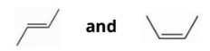

- Structure of cis **AND **trans skeletal formulae; **[1 mark]**

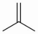

- Structure of 2-methylpropene; **[1 mark]**

iii) The name and **structural** formula of each of the products are:

| **Product** | **Name** | **Structural formula** |
|---|---|---|
| 1 | **Final answer:** **1,2-dichlorobutane** | **Final answer:** **CH****3****CH****2****CHClCH****2****Cl** |
| 2 | **Final answer:** **butane** | **Final answer:** **CH****3****CH****2****CH****2****CH****3** |
| 3 | **Final answer:** **butan(e)-1,2-diol** | **Final answer:** **CH****3****CH****2****CHOHCH****2****OH** |
| 4 | **Final answer:** **butan(e)-2-ol** | **Final answer:** **CH****3****CH****2****CHOHCH****3** |

- 8 correct points; **[4 marks]**
- 6 or 7 correct; **[3 marks]**
- 4 or 5 correct points; **[2 marks]**
- 2 or 3 correct points; **[1 marks]**

**[Total: 7 marks]**

- *Careful**: There are 2 moles of the product C**4**H**8**, which contain a total of 8 C atoms and 16 H atoms*
- *The remaining product must therefore contain 18 - 8 = 10 C atoms and 38 - 16 = 22 H atoms*
- *When drawing isomers of compounds with C=C double dons, you must think about geometric isomers*
- *Once you have drawn these, think about branched chain isomers*
- *Part (iii) requires you to know the different electrophilic addition reactions that alkenes undergo*

  - *When reacted with Cl**2**, the C=C double bond breaks and a single bond is formed from each of the two carbon atoms to a chlorine atom, producing a di-substituted halogenoalkane*
  - *When reacted with H**2**/Ni, a hydrogenation reaction occurs where the C=C double bond breaks and a single bond is formed from each of the two carbon atoms to a hydrogen atom, producing an alkane*
  - *When reacted with KMnO**4**/H**+** oxidation occurs producing a diol*
  - *When reacted with steam/H**+** an alcohol is produced*

### 15((c)) — 2 marks
The displayed formula of poly(but-1-ene) showing two repeat units is:

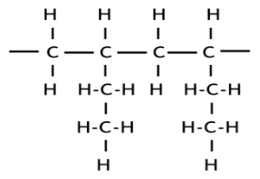

- Correct repeat unit; **[1 mark]**
- Two repeat units **AND** Continuation bonds; **[1 mark]**

**[Total: 2 marks]**

- *Instead of drawing the full displayed formula, you would be allowed to use C**2**H**5** or CH**2**CH**3 **as the pendant group*
- *You could draw ethyl groups on C2 and C3 **OR **C1 and C4*
- *To draw two repeating units:*

  - *Draw 2 molecules of the monomer*

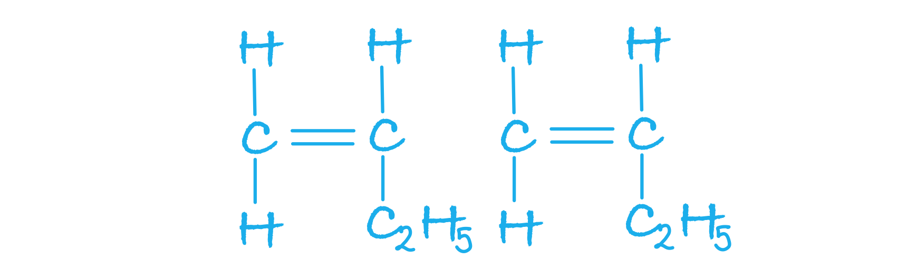

- *Remove the C=C double bond, leaving a C-C single bond:*

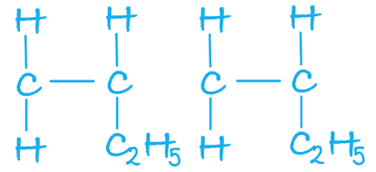

- *Add a bond to either end of the molecule, joining them in between the two monomers:*

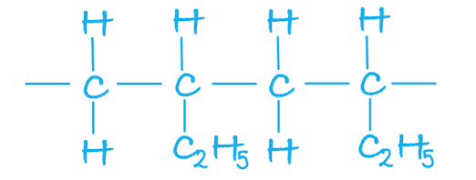

### 15((d)) — 2 marks
**One **advantage and **one** disadvantage of using incineration for the disposal of polymers, other than the effect on climate are:

- Advantage: Energy is produced / can be used to generate electricity or heat locally
**OR**
It prevents polymers going to landfill / storage / taking up space
**OR**
Produces hydrogen; **[1 mark]**
- Toxic / harmful / corrosive gases / substances may be produced
**OR**
Particulates / soot may be produced; **[1 mark]**

**[Total: 2 marks]**

- *You should be able to understand the problems of incinerating polymers and some ways in which these can be overcome*
- *You would not gain credit for any references to non-biodegradable, non-renewable, or reduction of polymer waste or pollution*
- *For the second mark, if you named a gas, e.g. sulfur dioxide, hydrogen cyanide, or dioxin without an explanation that this gas is toxic or harmful, you would not be awarded the mark*

### 15((e)) — 5 marks
i) The final total volume of gas in cm3 is:

- Volume of CO2 produced: 4 x 35 = 140 (cm3); **[1 mark]**
- Volume of oxygen used: 6.5 x 35 = 227.5 / 228 (cm3); **[1 mark]**
- Total volume of gas remaining: 300 - 227.5 + 140 (cm3) =212.5 / 213 (cm3); **[1 mark]**

Alternative method:

- Moles of CO2 produced: 35 / 24000 = 1.4583 x 10-3 / 1.458 x 10-3 / 1.46 x 10-3 1.4583 x 10-3 x 4 = 5.8333 x 10-3 / 5.83 x 10-3 **OR **5.84 x 10-3 if rounded previously; **[1 mark]**
- Moles of oxygen remaining: 300 / 24000 = 1.25 x 10-2 (1.46 x 10-3 ) x 6.5 = 9.49 x 10-3 moles (1.25 x 10-2 ) – (9.49 x 10-3) = 3.01 x 10-3 (mol); **[1 mark]**
- Total volume remaining: [(5.83 x 10-3 ) + (3.01 x 10-3 )] x 24000 = 212.16 / 212 (cm3); **[1 mark]**

ii) The main hazard when using butane as a fuel in a portable heater in an enclosed space is:

- **Carbon monoxide **may be produced (incomplete combustion may occur); **[1 mark]**
- Which is toxic / combines(irreversibly) with haemoglobin; **[1 mark]**

**[Total: 5 marks]**

- *Careful**: The answer needs to be given in cm**3**, so when calculating the volume, use 24 000 as the molar volume*
- *As this is complete combustion, there is an excess of oxygen so all of the butane will be used up*
- *The final volume of gas will contain the CO**2** produced and any oxygen remaining*
- *As molar gas volumes are the same under the same conditions you can use the volumes and molar ratios to work out the volumes of gases used up or produced*

  - *Carbon dioxide has 4 times the volume of butane = 4 x 35 = 140 cm**3*
  - *The volume of oxygen used up is 13/2 times greater than the volume of butane = 35 x 13/2 = 227.5 cm**3*
  - *Initially there was 300 cm**3** of oxygen so the oxygen remaining = 300 - 227.5 = 72.5 cm**3*
  
    - *So the total volume is 140 + 72.5 = 212.5 cm**3*
- *The alternative method uses moles:*

  - *The number of moles of CO**2** produced will be 4 times the number of moles of butane that combusted as it is a 2:8 or 1:4 molar ratio*
  - *The molar ratio of butane : oxygen is 2 : 13, so the number of moles of oxygen used = number of moles of butane x *$\frac{13}{2}$
  - *The number of moles of oxygen remaining = the number of moles of oxygen in 300 cm**3 **- moles of oxygen used up*
- *For part (ii), you must state that it is carbon monoxide that is the main hazard: whilst particulates are produced, they are not the main hazard, so you would not be awarded the mark*

  - *The second mark is only awarded if there is a clear link to the gas being produced*
  - *Any references to the flammability of butane, global warming or greenhouse gases would be ignored*
  - *If no other mark has been awarded you would gain 1 mark for stating that carbon dioxide causes suffocation*

## Q2 — medium — 12 marks · structured-questions

### 20((a)) — 2 marks
The equation for the incomplete combustion of **one mole **of propene to form carbon dioxide, carbon monoxide, carbon and water as the only products is:

C3H6 (g) + 3O2 (g) → CO2 (g) + CO (g) + C (s) + 3H2O (l)

- Balanced equation with **1 mol** C3H6 and correct products; **[1 mark]**
- State symbols; **[1 mark]**

**[Total: 1 mark]**

- *Propene must react with oxygen as it is a combustion reaction and you are given the products so you can construct the unbalanced symbol equation:*

  - *C**3**H**6 ** + O**2 ** → CO**2 ** + CO + C + H**2**O *
- *When balancing combustion reactions, balance the carbon atoms first:*

  - *The carbon atoms are already balanced*
- *Next, balance the hydrogen atoms:*

  - *C**3**H**6 ** + O**2 ** → CO**2 ** + CO + C + **3**H**2**O *
- *Finally, balance the oxygen atoms:*

  - *C**3**H**6 ** + **3**O**2 ** → CO**2 ** + CO + C + 3H**2**O *
- *You must remember to include state symbols, as instructed by the question, you should know that propene is a gas and carbon will be a solid:*

  - *C**3**H**6 **(g) + 3O**2 **(g) → CO**2 **(g) + CO (g) + C (s) + 3H**2**O (l)*

### 20((b)) — 2 marks
**One** similarity and **one** difference that would be **seen** when propene is mixed with separate samples of acidified potassium manganate(VII) solution and of bromine water are:

- Both solutions decolourise / turn colourless; **[1 mark]**
- From purple with (potassium) manganate((VII)) / KMnO4 / MnO4–
**AND** 
From orange with (aqueous) bromine / Br2; **[1 mark]**

**[Total: 2 marks]**

- *The question asks you about what would be seen, so any references to the type of reaction, or C=C bonds breaking will be ignored*
- *You can describe the colour of potassium manganate(VII) as pink or any combination of pink / purple*
- *The colour of bromine can be described as yellow or brown or any combination of orange / yellow / brown*
- *If neither mark is gained, you would score 1 mark if you said that (potassium) manganate((VII)) / KMnO**4 **/ MnO**4**–** decolourises from purple / pink **OR **bromine decolourises from orange / yellow / brown*
- *Bromine water is the standard test for saturation but potassium manganate(VII) can also be used to identify the presence of alkenes due to its distinctive colour change*

### 20((c)) — 1 marks
The structure of poly(propene), showing **two** repeat units is:

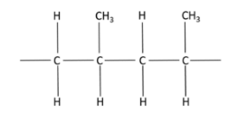

- Poly(propene) structure containing two repeat units with extension bonds; **[1 mark]**

**[Total: 1 mark]**

- *To draw the structure with two repeating units, first, draw two monomers:*

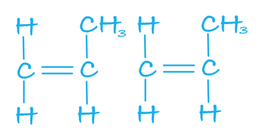

- *Remove the C=C double bond, leaving a C-C single bond:*

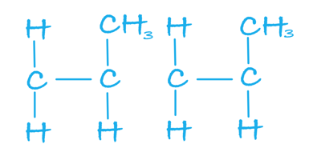

- *Add a bond between the two carbon atoms adjacent to each other and add continuation bonds:*

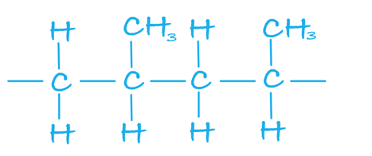

- *The CH**3** groups can be shown on the opposite side and you can draw a head-to-head or tail-to-tail configuration, e.g.* 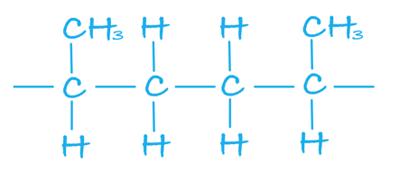

### 20((d)) — 4 marks
i) The completed diagram of bromine monochloride to show the dipole is:

| 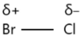 | **OR** | 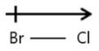 |
|---|---|---|

- Correct dipole;** [1 mark]**

ii) The mechanism for the formation of 1-bromo-2-chloropropane in this reaction is:

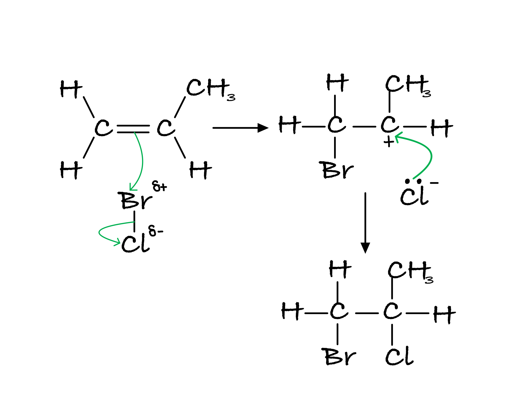

- Curly arrow from C=C bond to (δ+) halogen
**AND**
Curly arrow from Br–Cl bond to (δ-)halogen or just beyond; **[1 mark]**
- Secondary carbonation; **[1 mark]**
- Curly arrow from lone pair on halide ion to C(+)
**AND**
Correct product; **[1 mark]**

**[Total: 3 marks]**

- *This is the electrophilic addition mechanism that you need to know*
- *Do not be put off by the fact that you are adding Br–Cl across the C=C bond*
- *Careful:** The question asks for the major product, which is the product formed from the secondary carbonation*

  - *In the minor product the positions of Br and Cl would be swapped around*

### 20((e)) — 3 marks
The completed mechanism for the formation of propan-2-ol is:

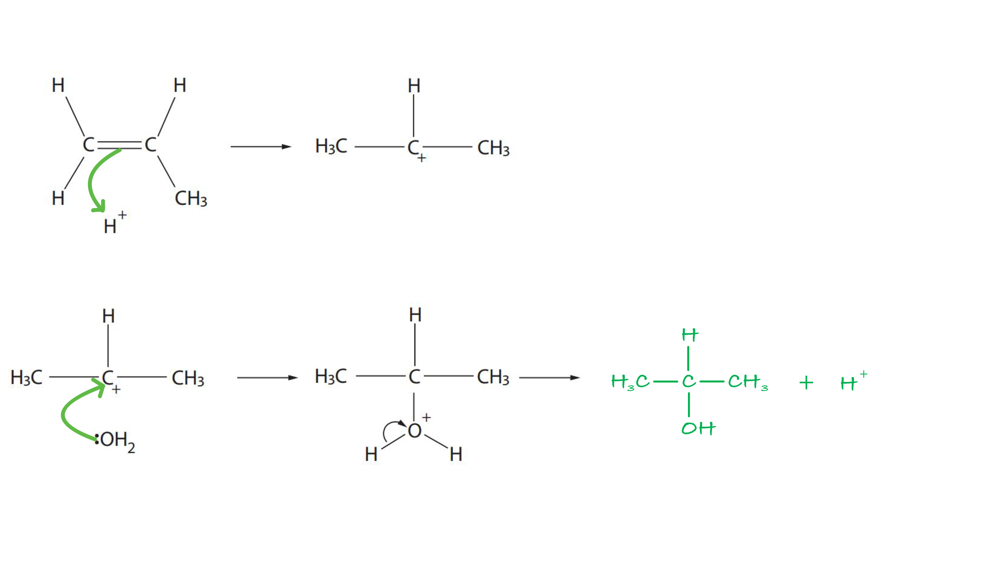

- Curly arrow from C=C bond to H+; **[1 mark]**
- Curly arrow from lone pair on water to C+; **[1 mark]**
- Correct structure for propan-2-ol 
**AND** 
H+ (catalyst regenerated); **[1 mark]**

**[Total: 3 marks]**

- *This is another electrophilic addition reaction mechanism*
- *Make sure that the curly arrows start at either a bond or a lone pair of electrons*
- *Careful**: Don't forget to include the H**+** as a product*

## Q3 — medium — 14 marks · structured-questions

### 21((a)) — 2 marks
The diagram to show the areas of electron density for each bond is:

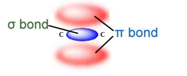

- σ bond; **[1 mark]**
- π bond; **[1 mark]**

**[Total: 2 marks]**

- *The π bond must be above and below the carbons but only one of the lobes of the π bond needs to be labelled*
- *Remember:** A sigma bond is formed from the end to end overlap of s and p orbitals and pi bonds are formed from the sideways overlap of adjacent p orbitals*
- *The two electron clouds shown above represent **one** π bond *
- *if you draw both bonds correctly but label them the wrong way around you will score 1 mark *

### 21((b)) — 6 marks
i) The organic product for each reaction is:

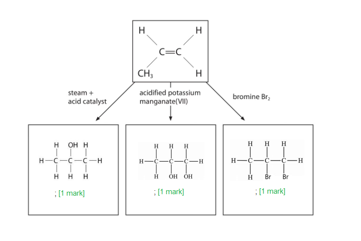

ii)  The mechanism for this reaction to form the **major** product is:

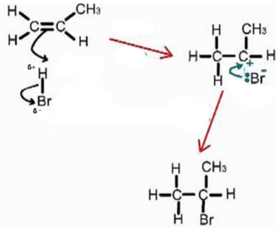

- Dipole on HBr and two correct curly arrows; **[1 mark]**
- Correct intermediate; **[1 mark]**
- Curly arrow from lone pair on Br- to C+ or the space between the Br- to C+; **[1 mark]**

**[Total: 6 marks]**

- *As you can see, you must know the reactions of alkenes in detail:*

  - *Alkene and steam react to form an alcohol*
  - *Alkene and hydrogen react to form an alkane*
  - *Alkene and halogens react to form halogenoalkanes *
  - *Alkenes are oxidised by acidified potassium manganate (VII) to form a diol *
- *The curly arrows in part ii) must start from the covalent bond*

  - *From the H—Br bond it must go to the Br or beyond*
  - *From the C=C bond it must go to the H or in the space*
- *If, by mistake, you have drawn the mechanism between propene and Br**2** you can still score marks 2 and 3 *
- *The major product is 2-bromopropane as the secondary carbocation is more stable than the primary carbocation*
- *If you have drawn a mechanism to show the formation of the minor product, 1-bromopropane then you cannot score marking point 2 for the intermediate*

### 21((c)) — 6 marks
i) The molecular formula of alpha-ocimene is:

- C10H16; **[1 mark]**

ii) The part of the molecule that gives rise to the geometric isomerism of alpha-ocimene is:

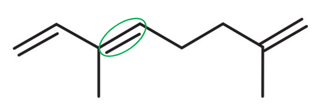

**OR**

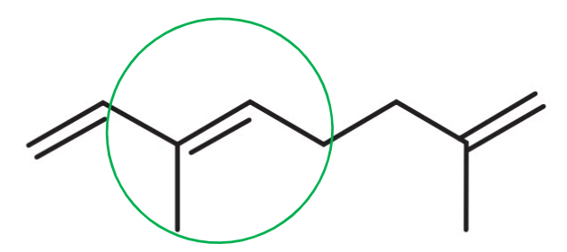

- Any circle that includes the correct double bond; **[1 mark]**

iii) The **skeletal** formula of the other geometric isomer of alpha-ocimene is:

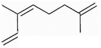

- Correct skeletal formula; **[1 mark]**

iv) The structure of the product of this reaction is:

- Moles of hydrogen / H2 3.6 ÷ 24 = 0.15 (mol) ; **[1 mark]**
- Ratio of moles hydrogen / H2 to alpha-ocimene = number of C=C that react 0.15 ÷ 0.05 = 3; **[1 mark]**
- Correct structure; **[1 mark]** 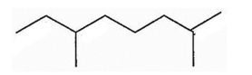

**[Total: 6 marks]**

- *It is useful to draw the displayed formula for alpha-ocimene and use it to count the number of carbon and hydrogen so that you don't miss any *
- *Geometric isomerism occurs when you have restricted rotation around a double bond *

  - *When all of the groups attached to the carbon atoms in the double bond are different, E / Z isomerism occurs *
  - *E-alpha-ocimene has the higher priority groups on the opposite side of the C=C bond*
  - *Z- alpha-ocimene has the higher priority groups on the same side of the C=C bond *
- *When deducing the structure in part iv), if all three double bonds react, H**2** will add across each one *

  - *You will also be awarded the mark for the structural or displayed formula *

## Q4 — medium — 16 marks · structured-questions

### 23((a)) — 1 marks
The molecular formula of the alkene with a molar mass of 112 g mol−1 is:

- C8H16; **[1 mark]**

**[Total: 1 mark]**

- *The general formula of an alkene is C**n**H**2n** *
- *There are twice as many hydrogen atoms as there are carbon atoms, giving the empirical formula of an alkene as CH**2*
- *The molecular formula can be found by dividing the relative formula mass of the molecular formula by the relative formula mass of the empirical formula*
- *The** M**r** of the empirical formula = 12.0 + (2 x 1.0) = 14.0 g mol**-1*

  - *You can use this piece of information to determine the molecular formula *$\frac{112}{14}$*= 8*
  - *So, there are 8 CH**2** units in the alkene with a molar mass of 112 g mol**−1** *
  - *This means that it contains 8 carbon atoms and 16 hydrogen atoms, i.e. C**8**H**16** *

### 23((b)) — 3 marks
i) The structure of the **branched-chain** alkene with the molecular formula C4H8 is:

- 

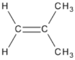

; **[1 mark]**

ii) The structures and names of the two geometric isomers with the molecular formula C4H8 are:

Geometric isomer 1:

- Structure: 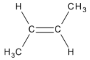 **AND **Name: *E*-but-2-ene **OR** *trans*-but-2-ene; **[1 mark]**

Geometric isomer 2:

- Structure: 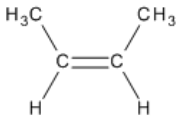 **AND **Name: *Z*-but-2-ene **OR** *cis*-but-2-ene; **[1 mark]**

**[Total: 3 marks]**

- *The only possible branched chain isomer of a but-2-ene based molecule is methylpropene*

  - *This is because when you remove a carbon from one end of the carbon chain, it can:*
  
    - *Attach at the other end of the molecule resulting in but-1-ene, which is a position isomer*
    - *Attach on carbon 2 of the chain resulting in methylpropene, which is a branched chain isomer*
- *Geometric isomers of alkenes have the carbon=carbon double bond in the centre of the molecule with functional groups attached*

  - *If the highest priority functional groups are on the same side (above **OR **below) of the C=C bond, then it is the **Z**-isomer *
  
    - *The **Z**-isomer has the functional groups "on **z**e **z**ame **z**ide" ("on the same side") *
  - *If the highest priority functional groups are on opposite sides (one above **AND **one below) of the C=C bond, then it is the **E**-isomer *

### 23((c)) — 3 marks
i) The **skeletal** formula of compound **X** formed in Reaction **1** is:

- 

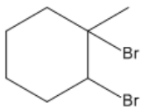

; **[1 mark]**

ii) The reagent and condition needed for Reaction **2** are:

Any **one **of the following:

Option 1:

- Reagent = Steam / H2O (g); **[1 mark]**
- Condition = Acid catalyst / phosphoric(V) acid (catalyst) / H3PO4; **[1 mark]**

Option 2:

- Reagent = (concentrated) sulfuric acid / H2SO4; **[1 mark]**
- Condition = <u>**followed by**</u> water / H2O; **[1 mark]**

**[Total: 3 marks]**

- *For part (i), you should know that bromine will add across the double bond resulting in the dibromo-compound shown in the mark scheme*
- *For part (ii), you should be able to determine that water has been added across the double bond*

  - *You need to know that this requires a phosphoric(V) acid catalyst*

### 23((d)) — 4 marks
The mechanism for the reaction of iodine monochloride with propene to form the **major **product is:

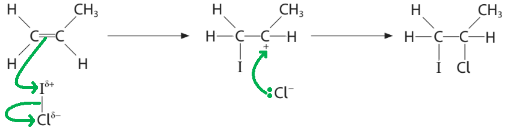

- A curly arrow from the (middle of the) C=C bond to / towards δ+ I
**AND**
A curly arrow from the I-Cl bond to, or just beyond δ– Cl; **[1 mark]**
- Correct displayed structure of the carbocation intermediate / CH2IC+HCH3; **[1 mark]**
- Lone pair on the Cl− ion
**AND**
A curly arrow from the lone pair to the positively charged carbon; **[1 mark]**
- Correct structure of the major product / 2-chloro-1-iodopropane; **[1 mark]**

**[Total: 4 marks]**

- *This is the electrophilic addition mechanism that you need to know*
- *Do not be put off by the fact that you are adding I–Cl across the C=C bond*
- *Careful:** The question asks for the major product, which is the product formed from the secondary carbocation *

### 22((e)) — 1 marks
The **name **of the monomer that forms this polymer is:

- Pent-2-ene / 2-pentene; **[1 mark]**

**[Total: 1 mark]**

- *This polymer is formed by addition polymerisation, which means that the monomer contains **two **carbons with a carbon=carbon double bond / C=C and side groups attached*
- *Look for when the polymer starts to repeat and you will find the monomer* 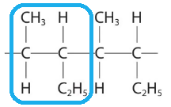
- *Removing the extension / continuation bonds and replacing the central carbon-carbon single bond will give the monomer pent-2-ene* 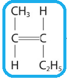

### 23((f)) — 4 marks
The number of double bonds in **one** molecule of the alkene is:

- Volume of H2 = 6 x 10-4 **OR **0.0006 m3; **[1 mark]**
- *n *= $\frac{PV}{RT}$ 
**OR **
*n* = `fraction numerator open parentheses 1.24 cross times 10 to the power of 5 close parentheses cross times open parentheses 6 cross times 10 to the power of negative 4 end exponent close parentheses over denominator 8.31 cross times 298 end fraction`; **[1 mark]**
- *n* = 0.03004; **[1 mark]**
- Ratio of alkene : H2 = 0.01 : 0.03 **OR **1 : 3 
**AND **
There are 3 double bonds; **[1 mark]**

**[Total: 4 marks]**

- *Remember: **The values that you add to the ideal gas equation have to be in the correct units*

  - *This means that you have to convert the volume to m**3**  *$\frac{600}{1\times10^{6}}$* = 6 x 10**-4** m**3** *
- *You use the ideal gas equation to calculate the number of moles of hydrogen that react with 0.01 moles of the alkene*

  - *0.03 moles of hydrogen are required to react with 0.01 moles of alkene, which means that there are 3 carbon-carbon double bonds / C=C in the alkene*

## Q5 — hard — 24 marks · structured-questions

### 21((a)) — 2 marks
**Two** properties that make squalane useful in cosmetics are:

Any **two** from:

- Chemically stable / inert / does not (easily) oxidise; **[1 mark]**
- Colourless; **[1 mark]**
- Odourless; **[1 mark]**
- Non-toxic / non-irritant; **[1 mark]**
- Hydrophobic / immiscible with water / insoluble; **[1 mark]**
- Hypoallergenic; **[1 mark]**

**[Total: 2 marks]**

- *The command word 'suggest' tells you that this is not something that you will have learnt specifically but you need to apply your knowledge to*
- *The properties that you give must relate to its usefulness as a cosmetic, so, for example, any reference to melting or boiling temperatures or flammability or volatility are not relevant*
- *Other responses that are insufficient are:*

  - *liquid / moisturising / softening / lubricating / hydrating*
  - *spreads easily / absorbed easily*
  - *natural / in human skin*
  - *cheap*

### 21((b)) — 1 marks
The **molecular** formula of squalane is:

- C30H62; **[1 mark]**

**[Total: 1 mark]**

- *Squalane is an aliphatic alkane so has the general formula C**n**H**2n+2** *
- *When deducing the number of carbons, count the number in the main chain first (24 C atoms), then add the carbon atoms from the methyl groups (6 C atoms) to give 30 C atoms together*
- *The number of H atoms will therefore be 2 x 30 + 2 = 62*

### 21((c)) — 7 marks
i) The name of a suitable catalyst for the hydrogenation of squalene is:

- Nickel; **[1 mark]**

ii) The maximum permitted mass of catalyst in a product containing 50 g of squalane is:

- 0.00001 / (1 ×) 10-5 (g); **[1 mark]**

iii) The number of C=C bonds in one molecule of squalene is:

- Conversion of temperature to K: *T* = 200 + 273 = 473 (K); **[1 mark]**
- Rearrangement of ideal gas equation:
*n* = $\frac{pV}{RT}$
**OR**
*n* = $\frac{4.0\times10^{5}\times500}{8.31\times473}$; **[1 mark]**
- Moles of hydrogen = 50882.429; **[1 mark]**
- Mole ratio *n*(H2): *n*(squalene):
50882 : 8500
6 : 1
**AND**
6 C=C bonds per molecule; **[1 mark]**

iv) The equation for the complete hydrogenation of squalene to squalane is:

- C30H50 + 6H2 → C30H62; **[1 mark]**

**[Total: 7 marks]**

- *Other suitable catalysts for hydrogenation are palladium or platinum*
- *To calculate the maximum permitted mass of catalyst in a product containing 50 g squalene, use the following equation:*

  - *concentration in ppm = *$\frac{\mathrm{mass} \mathrm{of} \mathrm{catalyst}\times10^{6}}{\mathrm{mass} \mathrm{of} \mathrm{squalene}}$
- *Rearrange to give the mass of catalyst:*

  - $\mathrm{mass} \mathrm{of} \mathrm{catalyst}=\frac{\mathrm{concentration} \mathrm{in} \mathrm{ppm}\times\mathrm{mass} \mathrm{of} \mathrm{squalene}}{10^{6}}=\frac{0.2\times50}{10^{6}}=1\times10^{-5}g$
- *You would be given the mark if you had expressed this as 10μg or 0.01 mg*
- *To find the number of C=C bonds, remember that 1 hydrogen molecule is added across every C=C double bond so the ratio of the number of moles of hydrogen to squalene will tell you how many C=C double bonds each molecule of squalene has*
- *Careful**: Make sure you check and convert the units as necessary when using the ideal gas equation*
- *If you used 24 dm**3** as the molar gas volume instead of using the ideal gas equation, you would have scored 2 marks if you found 2 C=C bonds per molecule*
- *In part (iv), if you had not stated  the number of C=C bonds, you could gain 1 mark if the equation given was in the form:*

  - *C**n**H**2n-2y+2** + yH**2** → C**n**H**2n+2*
  - *Where 24 ≤ n ≤ 30 and 1 ≤ y ≤ 14*

### 21((d)) — 6 marks
i) The name of a suitable technique to obtain squalene from shark liver oil is:

- (Fractional) distillation; **[1 mark]**

ii) The minimum number of sharks that would be needed to produce 2.8 million dm3 of squalene is:

Method 1

- Mass of squalene in 2.8 million dm3 = 2.8 x 109 x 0.86 = 2.408 x 109 (g); **[1 mark]**
- Number of sharks required: $\frac{2.408\times10^{9}}{300}$ = 8.0 x 106; **[1 mark]**

Method 2

- Volume of squalene per shark = $\frac{300}{0.86}$ = 348.8372 (cm3); **[1 mark]**
- Number of sharks required = $\frac{2.8\times10^{9}}{348.8372}$ = 8.0 x 106; **[1 mark]**

iii) The area of land, **in km****2**, required to produce 2500 tonnes of squalane from corn starch is:

Method 1

- Mass of corn starch required = $\frac{2500}{23}$ x 100 = 10869.57 (tonnes); **[1 mark]**
- Required land area in hectares = 10869.57 x 0.093 = 1010.87 (hectares); **[1 mark]**
- Land area in km2 = 1010.87 x 0.01 = 10.1087 = 10 (km2); **[1 mark]**

Method 2

- Conversion of land area from hectares to km2 = 0.093 x 0.01 = 0.00093 / 9.3 x 10−4 (km2); **[1 mark]**
- Required land area in km2 to produce 2500 tonnes of corn starch = 0.00093 x 2500 = 2.325 km2; **[1 mark]**
- Required land area in km2 to produce 2500 tonnes of squalene = $\frac{2.325}{23}$ x 100 = 10.1087 = 10 (km2); **[1 mark]**

Method 3

- Required land area in hectares to produce 2500 tonnes of corn starch = 2500 x 0.093 = 232.5 (hectares); **[1 mark]**
- Required land area in hectares to produce 2500 tonnes of squalene = $\frac{232.5}{23}$ x 100 = 1010.87 (hectares); **[1 mark]**
- Land area in km2 = 1010.87 x 0.01 = 10.1087 = 10 (km2); **[1 mark]**

**[Total: 6 marks]**

- *Don't be put off by the unusual nature of this question - you need to be able to apply your knowledge of density, percentage yield and converting between units to answer this*
- *There are different ways in which you can go about each calculation, if you didn't get the answer correct, look through each of the methods and see which one makes the most sense to you*
- *Remember**: density = *$\frac{\mathrm{mass}}{\mathrm{volume}}$
- *You can use this to find the mass of squalene in 2.8 million dm**3** or the volume of squalene per shark*
- *Careful**: Convert the mass of squalene to cm**3** as the density is given in cm**3*

  - *2.8 million dm**3** = 2.8 x 10**6** dm**3** = 2.8 x 10**9** cm**3*
- *In part (iii), make sure you take into account the 23% yield, whichever method you choose*

### 21((e)) — 4 marks
i) Beta-farnesene exhibits geometric isomerism and has only two geometric isomers because:

- There is restricted / no rotation about / around C=C / pi bond / double bond; **[1 mark]**
- (Only) central C=C has two different groups attached to each carbon of the C=C; **[1 mark]**

ii) The **skeletal **formula of the geometric isomer of E-beta-farnesene, and a reason why this is named the Z-isomer is:

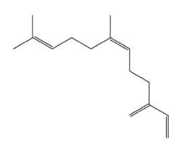

- Skeletal formula of Z-isomer; **[1 mark]**
- **Reason**: (Z isomer has highest) priority groups on same side (of C=C); **[1 mark]**

**[Total: 4 marks]**

- *You must be specific about which C=C bond gives rise to geometric isomers*
- *The central C=C bond is the only one that has four different groups attached to the carbon atoms so the only geometric isomer that can be formed is by swapping the groups on one of the carbons of this C=C bond*
- *The C=C now have a hydrogen and methyl group attached on one side of the C=C bond, with 2 longer carbon chain groups on the other side which have higher priority, therefore it is the Z-isomer*

### 21((f)) — 4 marks
i) The term **structural** isomers means:

- (Compounds with the) same molecular formula;** [1 mark]**
- Different structural formula; **[1 mark]**

ii) The number of **geometric** isomers of alpha-farnesene is:

- Four / 4; **[1 mark]**

iii) The completed diagram to show another structural isomer of C15H24 is:

- Valid structure containing one C=C bond **OR** 
Valid structure containing one bridging carbon-carbon bond; **[1 mark]**

**[Total: 4 marks]**

- *Alpha-farnesene contains 3 C=C double bonds*
- *The C=C on the left hand side will not give rise to geometric isomers as one of the carbon atoms in the C=C bond is attached to two methyl groups:*

  - *(CH**3**)**2**C=**CHCH**2**CH**2**C(CH**3**)=CHCH**2**CH=C(CH**3**)CH=CH**2*
- *The remaining two C=C bonds have 4 different groups attached to the carbon atoms of the double bond*
- *Each will give rise to two geometric isomers, therefore there are four geometric isomers altogether*
- *When completing the diagram to show another structural isomer, make sure that you deduce what atoms are present already*

  - *There are 15 carbon atoms and 26 hydrogen atoms*
- *The molecular formula has 24 H atoms, so to obtain 24 atoms in the structural isomer, another bond between 2 carbon atoms is required*
- *The most obvious way to do this is by making one of the bonds a C=C double bond*
- *An alternative way is by adding a single bond between two carbon atoms that are not already bonded*
- *Examples of a valid structure are:*

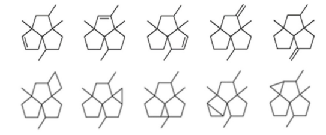

## Q6 — hard — 21 marks · structured-questions

### 1() — 1 marks
The systematic name of **P** is

- 2-methylbutane **[1 mark]**

> **[mark-scheme]**
> 1 mark for **2-methylbutane**
> 
> Reject "3-methylbutane" (numbering from wrong end; gives higher locant)
> 
> Reject "methylbutane" without the locant
> 
> Reject "2,2-dimethylpropane" (different structural isomer of C5H12)

> **[exam-tip]**
> Always number from the end of the longest chain that gives the branch the lowest locant. In this structure, numbering from the left gives 2-methyl; numbering from the right would give 3-methyl, so the correct systematic name uses "2-methyl".

### 2() — 6 marks
i) The three structural isomers of C5H12 are pentane, 2-methylbutane, and 2,2-dimethylpropane. Excluding 2-methylbutane:

**[2 marks]**

ii) Pent-2-ene exhibits *E*/*Z* isomerism because:

- There is restricted rotation about the C=C double bond. **[1 mark]**
- Each carbon of the C=C has two different groups attached: C2 has –H and –CH3; C3 has –H and –CH2CH3. **[1 mark]**

iii) The displayed formulae of *E-pent-2-ene and *Z*-pent-2-ene* are:

**[2 marks]**

> **[mark-scheme]**
> i) 1 mark for pentane drawn as a 5-carbon straight chain with all H atoms and bonds shown
> 
> 1 mark for 2,2-dimethylpropane drawn correctly (central C with 4 × CH3 groups)
> 
> Accept condensed displayed formulae if clear (e.g. CH3CH2CH2CH2CH3)
> 
> Reject any isomer of different molecular formula
> 
> ii) 1 mark for restricted rotation about the C=C double bond
> 
> Accept "no free rotation about C=C due to the π-bond"
> 
> 1 mark for two different groups attached to each carbon of the C=C
> 
> Accept equivalent: "C2 has H and CH3; C3 has H and CH2CH3"
> 
> Both points required for full marks; one point alone scores 1
> 
> Reject "C=C is rigid" alone without linking to the π-bond / restricted rotation
> 
> iii) 1 mark for *E*-pent-2-ene: CH3 and CH2CH3 on opposite sides of C=C, labelled E (or trans)
> 
> 1 mark for Z-pent-2-ene: CH3 and CH2CH3 on same side of C=C, labelled Z (or cis)
> 
> Accept skeletal formulae if clear and labelled
> 
> Both structures must be labelled E/Z correctly — swapping the labels scores zero for labelling

> **[exam-tip]**
> Structural isomers have the same molecular formula but different carbon skeletons (or different positions of functional groups). E/Z isomers have the same structural formula but different arrangements around a C=C double bond. E/Z isomerism requires two conditions: (1) restricted rotation around the C=C, and (2) each carbon of the C=C must have two different groups attached, both must be stated for full marks (1 mark each). Missing either condition means no E/Z isomerism.

### 3() — 5 marks
The mechanism is:

- Initiation:

`\text{Cl}_{2} \overset{\text{UV}}{\rightarrow} 2 \text{Cl}^{\cdot}` **[1 mark]**

- Propagation step 1 (Cl• abstracts the tertiary H at C2):

`(\text{CH}_{3} )_{2} \text{CHCH}_{2} \text{CH}_{3} + \text{Cl}^{\cdot} \rightarrow (\text{CH}_{3} )_{2} \overset{\cdot}{\text{C}} \text{CH}_{2} \text{CH}_{3} + \text{HCl}` **[1 mark]**

- Propagation step 2 (alkyl radical reacts with Cl2):

`(\text{CH}_{3} )_{2} \overset{\cdot}{\text{C}} \text{CH}_{2} \text{CH}_{3} + \text{Cl}_{2} \rightarrow (\text{CH}_{3} )_{2} \text{C}(\text{Cl})\text{CH}_{2} \text{CH}_{3} + \text{Cl}^{\cdot}` **[1 mark]**

- Termination (regenerating Cl2):

`\text{Cl}^{\cdot} + \text{Cl}^{\cdot} \rightarrow \text{Cl}_{2}` **[1 mark]**

**One** reason why this reaction has limited use for synthesising pure 2-chloro-2-methylbutane in a laboratory is:

- Further substitution occurs — the product 2-chloro-2-methylbutane still contains C–H bonds that can be attacked by Cl• radicals, giving di-, tri- and poly-chlorinated by-products. A **mixture of products** is therefore obtained, making this reaction unsuitable for preparing pure 2-chloro-2-methylbutane. **[1 mark]**

> **[mark-scheme]**
> 1 mark for initiation: Cl2 → 2Cl• with **UV** shown above the arrow
> 
> Both Cl• radicals must carry the dot
> 
> Accept "hν" or "UV light" notation
> 
> 1 mark for propagation step 1: alkane + Cl• → tertiary alkyl radical + HCl
> 
> - Radical dot mandatory on both Cl• and the alkyl radical
> - HCl must appear as a product (not H• alone)
> - Accept the alkyl radical drawn in any reasonable notation (structural, displayed, or skeletal with • on C2)
> 
> 1 mark for propagation step 2: alkyl radical + Cl2 → 2-chloro-2-methylbutane + Cl•
> 
> Must react alkyl• with Cl2 (molecule), NOT Cl• (that would be termination)
> 
> Cl• regenerated
> 
> 1 mark for ONE correct termination step: Cl• + Cl• → Cl2
> 
> Only the one asked for (regenerating Cl2) is required
> 
> 1 mark for limitation: further substitution / mixture of (di-/tri-)chlorinated products formed
> 
> Accept "mixture of isomers" (positional isomers at different carbons are also formed)
> 
> Reject "slow" or "reversible" — these are incorrect limitations

> **[exam-tip]**
> Key radical mechanism checks:
> 
> 1. Radical dot on every radical species;
> 2. Propagation step 2 reacts with Cl2 (molecule), not Cl• (which would be termination);
> 3. HCl is produced in propagation 1, not 2;
> 4. Curly arrows are not required for radical equations — just write the species with dots clearly indicated. For the limitation question, the correct answer is "further substitution" giving a mixture — not "slow" or "reversible".

### 4() — 4 marks
The full mechanism is:

**[4 marks]**

> **[mark-scheme]**
> 4 marks total, 1 mark for each of the following elements:
> 
> 1 mark for δ+ on H and δ- on Br of HBr correctly labelled
> 
> Both partial charges must be shown; missing either loses the mark
> 
> 1 mark for curly arrow from the C=C bond to the δ+ H atom of HBr (NOT from a C atom or from the middle of the carbon)
> 
> Arrow must originate from the bond, not from an atom symbol
> 
> 1 mark for carbocation intermediate drawn with ⁺ charge on the correct (central/secondary) carbon, AND a second curly arrow from the H–Br bond to the Br atom (forming Br⁻)
> 
> ⁺ must be explicitly shown on the correct C
> 
> The positive carbon should have only 3 bonds (trigonal planar)
> 
> Do not accept a partial charge (δ+) on the carbocation — must be a full + charge
> 
> 1 mark for the final step: curly arrow from a lone pair on Br⁻ to the carbocation carbon, giving 2-bromopropane (CH3CHBrCH3) as the final product
> 
> Arrow must originate from a lone pair on Br⁻ (explicitly drawn or implied)
> 
> Product must be clearly 2-bromopropane, not 1-bromopropane

> **[exam-tip]**
> The four marks in the mechanism come from:
> 
> 1. δ+/δ- labels on the electrophile
> 2. Curly arrow from the C=C bond (not atom)
> 3. Carbocation with a full + charge (not δ+)
> 4. Curly arrow from a Br⁻ lone pair
> 
> All four elements are independently examined, missing any one costs a mark. The Edexcel command for this style of question is concise: "Include curly arrows, and relevant lone pairs and dipoles", you are expected to know that the carbocation intermediate and the final product must also be drawn.

### 5() — 2 marks
2-bromopropane is the major product because:

- If H adds to C1 of propene, the carbocation intermediate is secondary (CH3–⁺CH–CH3); if H adds to C2, the carbocation would be primary (⁺CH2–CH2–CH3). **[1 mark]**
- The secondary carbocation is more stable than the primary because alkyl groups donate electron density to the positively charged carbon, stabilising the charge. The more stable secondary carbocation forms preferentially, and so 2-bromopropane is the major product. **[1 mark]**

> **[mark-scheme]**
> 1 mark for identifying the secondary carbocation as the intermediate leading to 2-bromopropane (vs primary carbocation leading to 1-bromopropane)
> 
> Accept structures or written reasoning showing both possible carbocations
> 
> 1 mark for secondary carbocation more stable than primary AND alkyl groups donate electron density / stabilise the positive charge
> 
> Both elements required: stability comparison AND the reason
> 
> Stating "secondary is more stable" without the reason scores only 1 mark for identifying the carbocation type
> 
> Ignore any reference to Markovnikov's rule (Markovnikov's rule is not on the specification)

> **[exam-tip]**
> The specification expects you to explain the major product purely in terms of **carbocation stability**, Edexcel mark schemes explicitly state "ignore any reference to Markovnikov's rule" because Markovnikov's rule is not on the specification.
> 
> The reasoning chain is: identify the two possible carbocations (secondary vs primary) → secondary is more stable because alkyl groups donate electron density → secondary forms preferentially → 2-bromopropane is the major product.

### 6() — 3 marks
i) The structure of poly(propene) showing two repeat units is:

**[1 mark]**

ii) Environmental problem AND method to reduce it:

- Problem: Poly(propene) is non-biodegradable — it cannot be broken down by natural processes (enzymes, bacteria), so it persists in landfill sites for hundreds of years, causing long-term waste accumulation and pollution (including microplastic pollution of oceans). **[1 mark]**

- Method: Recycle used poly(propene) by collecting, sorting, cleaning, melting and re-moulding it into new plastic items. (Alternatively: incinerate for energy recovery — combustion releases energy that can generate electricity.) **[1 mark]**

> **[mark-scheme]**
> i) 1 mark for correct structure showing two repeat units:
> 
> - 4-carbon backbone (2 × 2-carbon repeat units)
> - CH3 as a side chain on every alternate carbon (NOT in the main chain)
> - All hydrogens shown explicitly
> 
> Brackets and the subscript n are NOT required (per Edexcel MS convention, ignore brackets/n requirement)
> 
> Accept condensed notation if clear (e.g. –CH(CH3)–CH2–CH(CH3)–CH2–)
> 
> ii) 1 mark for ONE valid environmental problem:
> 
> Non-biodegradable / persists in landfill / microplastic pollution
> 
> Produces toxic gases (e.g. CO, dioxins) if incinerated without controls
> 
> Takes up landfill space
> 
> 1 mark for one valid reduction method that matches the problem cited:
> 
> For landfill/non-biodegradability: recycle / reuse / incinerate for energy
> 
> For toxic combustion gases: use controlled incineration with scrubbers
> 
> Reject generic statements (e.g. "don't throw it away") without a named method.

> **[exam-tip]**
> Common errors on poly(propene) repeat units:
> 
> 1. Drawing a 3-carbon backbone with CH3 in the main chain, the repeat unit is always 2 carbons for vinyl polymers;
> 2. Showing only one repeat unit when two are asked for. Edexcel mark schemes for repeat unit questions ignore brackets and the subscript n, so focus on getting the structure correct rather than the bracket notation.
> 
> For the environmental question, the reduction method must directly address the problem cited, a generic "recycle" doesn't score if the problem is about toxic fumes from incineration.

## Q7 — easy — 1 marks · multiple-choice-questions

### 17() — 1 marks
**Correct answer: B** — exporting polymer waste

**Final answer:** **The correct answer is ****B**** because:**

- Polymers are disposed of in landfill sites but this takes up valuable land, as polymers are non-biodegradable so micro-organisms such as decomposers cannot break them down
- This causes sites to quickly fill up
- Exporting polymers simply changes the location of where the polymers are disposed of, not how they are disposed, and it remains a **global **problem

**A** is incorrect as  biodegradable polymers are broken down by microorganisms

**C** is incorrect as  this removes harmful pollution

**D** is incorrect as  this saves energy and conserves non-renewable resources

## Q8 — medium — 2 marks · multiple-choice-questions

### 11((a)) — 1 marks
**Correct answer: A** — 

**Final answer:** **The correct answer is ****A**** because:**

- The chlorine is on carbon 2, and the double bond is between carbon 2 and 3, therefore it is 2-chlorobut-2-ene
- One carbon of the C=C double bond is attached to an H atom and a C atom

  - C has a higher priority than H as it has a higher atomic number
- The other carbon of the C=C double bond is attached to a C atom and a Cl atom

  - Cl has a higher priority than C as it has a higher atomic number
- Therefore, the highest priority groups are on the opposite side, so this is the E-isomer: E-2-chlorobut-2-ene

**B** is incorrect as it is Z-1-chlorobut-2-ene

**C** is incorrect as  it is Z-2-chlorobut-2-ene

**D** is incorrect as it is E-1-chlorobut-2-ene

### 11((b)) — 1 marks
**Correct answer: D** — 11

**Final answer:** **The correct answer is ****D**** because:**

- The C-H, and C-Cl and C-C bonds are sigma bonds
- The C=C double bond is one sigma bond and one pi bond
- It can be easy to forget the bonds when referring to the skeletal formula so it is better to draw the displayed formula and then count the bonds using that
- There are:

  - 3 x C-C (including the sigma bond of the C=C double bond)
  - 7 x C-H bonds
  - 1 x C-Cl bond

**A** is incorrect as the C-H bonds and the sigma C-C have not been counted

**B** is incorrect as  some of the C-H bonds have not been counted

**C** is incorrect as  the C-C bond on the alkene bond has not been counted

## Q9 — hard — 1 marks · multiple-choice-questions

### 1() — 1 marks
**Correct answer: A** — CF2=CF2

**Final answer:** **The correct answer is A**

- An addition polymer is made by breaking the C=C double bond of an alkene monomer and joining the resulting units together
- The repeat unit shown has a two-carbon backbone with TWO F atoms on EACH carbon (4 F total per repeat unit)
- Re-introducing the C=C between the two backbone carbons and removing the brackets gives CF2=CF2 (tetrafluoroethene)
- The polymer formed is poly(tetrafluoroethene), commonly known as PTFE or Teflon

**B** is incorrect as this is hexafluoroethane, a saturated compound with no C=C, so it cannot undergo addition polymerisation

**C** is incorrect as this is 1,1-difluoroethene; polymerising it would give a repeat unit with 2 F on one carbon but 2 H on the other — not 2 F on each carbon as shown

**D** is incorrect as this is 1,2-difluoroethene; polymerising it would give a repeat unit with only ONE F on each carbon (total 2 F per unit), not 2 F on each carbon

> **[exam-tip]**
> For any addition polymer, the repeat unit has a 2-carbon backbone. To deduce the monomer, insert a C=C double bond between the two backbone carbons of the repeat unit — the substituents stay in the same positions.
