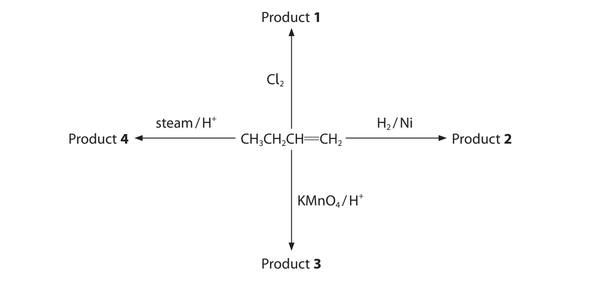
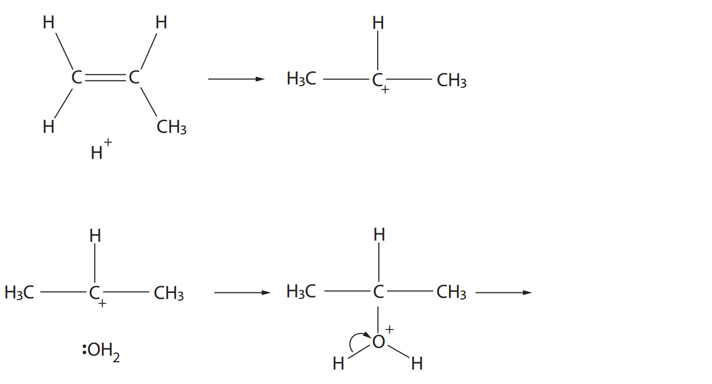
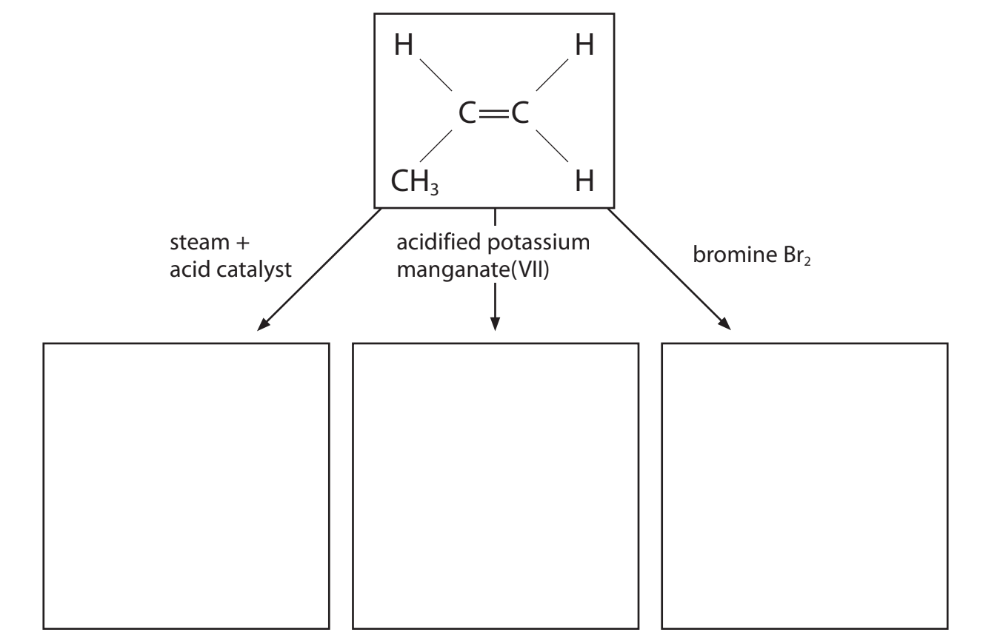
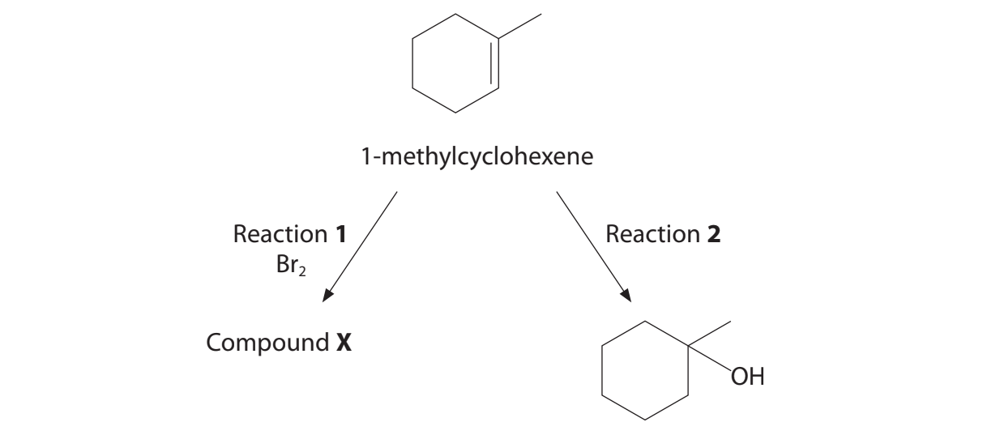
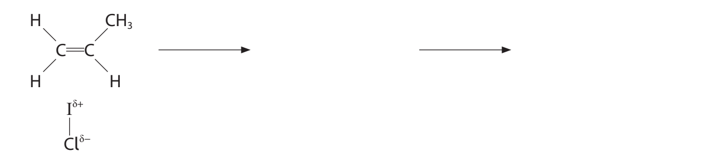
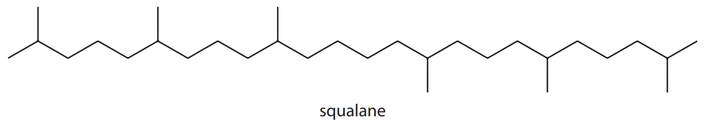
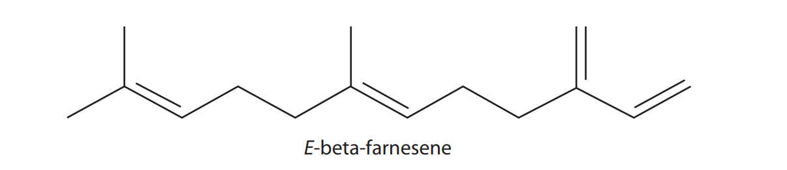
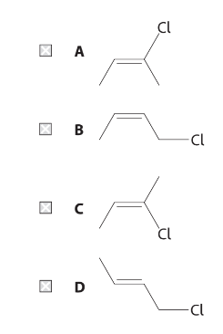

# Exam Questions — Alkenes
**1. Structure, Bonding & Introduction to Organic Chemistry** · Edexcel International A Level (IAL) Chemistry (YCH11)
> Source: [https://www.savemyexams.com/international-a-level/chemistry/edexcel/17/topic-questions/1-structure-bonding-and-introduction-to-organic-chemistry/1-10-alkenes/structured-questions/](https://www.savemyexams.com/international-a-level/chemistry/edexcel/17/topic-questions/1-structure-bonding-and-introduction-to-organic-chemistry/1-10-alkenes/structured-questions/) · 9 questions · total 109 marks

## Q1 — medium — 18 marks · structured-questions

### 15((a)) — 2 marks — command: describe — structured — from paper Oct 2021 · WCH11/01
Alkanes and alkenes are obtained from crude oil.

Describe how a sample of octadecane can be obtained from a mixture of alkanes.

### 15((b)) — 7 marks — command: multiple — structured — from paper Oct 2021 · WCH11/01
i) Octadecane can be cracked to produce butene and **one** other product. Complete the equation. State symbols are not required.

C18H38 → 2C4H8 +

**(1)**

ii) One of the products of this cracking reaction is but-1-ene.

Give the **skeletal** formulae for the other three **alkene **isomers of C4H8

**(2)**

|   |   |   |
|---|---|---|

iii) Some reactions of but-1-ene are shown.

Give the name and **structural** formula of each of the products.

**(4)**

| **Product** | **Name** | **Structural formula** |
|---|---|---|
| 1 |   |   |
| 2 |   |   |
| 3 |   |   |
| 4 |   |   |

### 15((c)) — 2 marks — command: draw — structured — from paper Oct 2021 · WCH11/01
Draw the displayed formula of poly(but-1-ene) showing two repeat units.

### 15((d)) — 2 marks — command: state — structured — from paper Oct 2021 · WCH11/01
State **one **advantage and **one** disadvantage of using incineration for the disposal of polymers, other than the effect on climate.

### 15((e)) — 5 marks — command: multiple — structured — from paper Oct 2021 · WCH11/01
i) Butane is used as a fuel.

The equation for the complete combustion of butane is shown.

2C4H10(g) + 13O2(g) → 8CO2(g) + 10H2O(l)

35.0 cm3 butane is completely burned in 300 cm3 oxygen.

Calculate the final total volume of gas in cm3.

All volumes are measured at the same temperature and pressure.

**(3)**

ii) Explain the main hazard when using butane as a fuel in a portable heater in an enclosed space.

**(2)**

## Q2 — medium — 12 marks · structured-questions

### 20((a)) — 2 marks — command: write — structured — from paper Jan 2021 · WCH11/01
This question is about the reactions of propene.

Write an equation for the incomplete combustion of **one mole **of propene to form carbon dioxide, carbon monoxide, carbon and water as the only products. Include state symbols.

### 20((b)) — 2 marks — command: state — structured — from paper Jan 2021 · WCH11/01
State **one** similarity and **one** difference that would be **seen** when propene is mixed with separate samples of acidified potassium manganate(VII) solution and of bromine water.

### 20((c)) — 1 mark — command: draw — structured — from paper Jan 2021 · WCH11/01
Propene reacts by addition polymerisation to form poly(propene).

Draw the structure of poly(propene), showing **two** repeat units.

### 20((d)) — 4 marks — command: multiple — structured — from paper Jan 2021 · WCH11/01
Propene reacts with bromine monochloride, BrCl, to form 1-bromo-2-chloropropane as the major product.

i) Complete the diagram of bromine monochloride to show the dipole.

**(1)**

Br — Cl

ii) Draw the mechanism for the formation of 1-bromo-2-chloropropane in this reaction.

Include curly arrows, and relevant lone pairs.

**(3)**

### 20((e)) — 3 marks — command: complete — structured — from paper Jan 2021 · WCH11/01
Propene reacts with steam in the presence of an acid catalyst to form a mixture of the alcohols propan-1-ol and propan-2-ol.

Complete the mechanism for the formation of propan-2-ol, by adding curly arrows. Include the species formed in the final step.

## Q3 — medium — 14 marks · structured-questions

### 21((a)) — 2 marks — command: complete — structured — from paper Jan 2022 · WCH11/01
This question is about alkenes. Alkenes contain a carbon to carbon double bond that consists of a σ bond and a π bond.

Complete the diagram to show the areas of electron density for each bond. Label the σ bond and the π bond.

### 21((b)) — 6 marks — command: multiple — structured — from paper Jan 2022 · WCH11/01
Propene, C3H6 , is an alkene. The reagents needed for three reactions of propene are shown.

i) In each box, draw the structure of the organic product of the reaction.

**(3)**

ii) Propene also reacts with hydrogen bromide, HBr. Give the mechanism for this reaction to form the **major** product. Include curly arrows, and relevant lone pairs and dipoles.

**(3)**

### 21((c)) — 6 marks — command: multiple — structured — from paper Jan 2022 · WCH11/01
Alpha-ocimene contains three carbon to carbon double bonds. It is found in plants and has a sweet smell. The skeletal formula of alpha-ocimene is shown.

i) Give the molecular formula of alpha-ocimene.

**(1)**

ii) On the skeletal formula, draw a circle around the part of the molecule that gives rise to the geometric isomerism of alpha-ocimene.

**(1)**

iii) Draw the **skeletal** formula of the other geometric isomer of alpha-ocimene.

**(1)**

iv) In an experiment, 0.050 mol of alpha-ocimene reacted with 3.6 dm3 of hydrogen, H2, in the presence of a catalyst. 
Deduce the structure of the product of this reaction. 

You **must **show your working.
[Molar volume of H2 = 24 dm3 mol−1 ]

**(3)**

Calculation

Structure

## Q4 — medium — 16 marks · structured-questions

### 23((a)) — 1 mark — command: deduce — structured — from paper June 2021 · WCH11/01
This question is about alkenes.

An alkene has a molar mass of 112 g mol−1.

Deduce the molecular formula of this alkene.

### 23((b)) — 3 marks — command: multiple — structured — from paper June 2021 · WCH11/01
There are a number of different alkenes with the molecular formula C4H8.

i) Draw the structure of the **branched-chain** alkene with the molecular formula C4H8.

**(1)**

ii) Give the structures and names of the two geometric isomers with the molecular formula C4H8.

**(2)**

| Structure of geometric isomer 1 | Structure of geometric isomer 2 |
|---|---|
| Name of isomer 1 | Name of isomer 2 |

### 23((c)) — 3 marks — command: multiple — structured — from paper June 2021 · WCH11/01
Two reactions of 1-methylcyclohexene are shown.

i) Draw the **skeletal** formula of compound **X** formed in Reaction **1**.

**(1)**

ii) Give the reagent and condition needed for Reaction **2**.

**(2)**

Reagent ....................................................................................

Condition ..................................................................................

### 23((d)) — 4 marks — command: complete — structured — from paper June 2021 · WCH11/01
Iodine monochloride, ICl, reacts with alkenes in a similar way to hydrogen bromide.

Complete the mechanism for the reaction of iodine monochloride with propene to form the **major **product. Include curly arrows, the relevant lone pair and the structures of the intermediate and product.

### 22((e)) — 1 mark — command: give — structured — from paper June 2021 · WCH11/01
A section of a polymer showing two repeat units is given.

Give the **name **of the monomer that forms this polymer.

### 23((f)) — 4 marks — command: deduce — structured — from paper June 2021 · WCH11/01
0.0100 mol of an alkene reacts completely with exactly 600 cm3 of hydrogen gas, measured at 298 K and 1.24 × 105 Pa pressure, to form an alkane.

Use the ideal gas equation to deduce the number of double bonds in **one** molecule of the alkene. You **must **show your working.

[*pV = nRT      R* = 8.31 J mol−1 K−1]

## Q5 — hard — 24 marks · structured-questions

### 21((a)) — 2 marks — command: suggest — structured — from paper Jan 2021 · WCH11/01
This question is about the production of squalane, a liquid alkane which occurs naturally in human skin and is used in cosmetics.

Suggest **two** properties that make squalane useful in cosmetics.

### 21((b)) — 1 mark — command: give — structured — from paper Jan 2021 · WCH11/01
Give the **molecular** formula of squalane.

### 21((c)) — 7 marks — command: multiple — structured — from paper Jan 2021 · WCH11/01
Squalane can be produced from squalene, an alkene present in shark liver oil, by reaction with hydrogen gas in the presence of a suitable catalyst.

i) Give the name of a suitable catalyst for the hydrogenation of squalene.

**(1)**

ii) Squalane used in cosmetic products must contain no more than 0.2 ppm by mass of catalyst.

Calculate the maximum permitted mass of catalyst in a product containing 50 g of squalane.

**(1)**

iii) A reactor at 200 °C contains 8500 mol of liquid squalene, and hydrogen gas at a pressure of 4.0 × 105 Pa.

Under these conditions, the complete hydrogenation of squalene requires 500 m3 of hydrogen gas.

Calculate the number of C=C bonds in one molecule of squalene. You **must** show your working. [*pV = nRT*          R = 8.31 J mol-1 K-1]

**(4)**

iv) Write the equation, using molecular formulae, for the complete hydrogenation of squalene to squalane. State symbols are **not** required.

**(1)**

### 21((d)) — 6 marks — command: multiple — structured — from paper Jan 2021 · WCH11/01
Globally, 2.8 million dm3 of squalene is used each year.

Traditionally squalene was obtained exclusively from shark liver oil, which is a mixture of liquids. The liver of a shark yields 300 g of squalene.

i) Suggest the name of a suitable technique to obtain squalene from shark liver oil.

**(1)**

ii) Calculate the minimum number of sharks that would be needed to produce 2.8 million dm3 of squalene. [Density of squalene = 0.86 g cm-3]

**(2)**

iii) Many large corporations now use squalane obtained entirely from plants. Squalane can be obtained sustainably from corn starch with a yield of 23% by mass.

The production of 1 tonne of corn starch requires 0.093 hectares of land. Calculate the area of land, **in km****2**, required to produce 2500 tonnes of squalane from corn starch.

[1 tonne = 1000 kg   1 hectare = 0.01 km2]

**(3)**

### 21((e)) — 4 marks — command: multiple — structured — from paper Jan 2021 · WCH11/01
The *E*-isomer of beta-farnesene can also be obtained from corn starch.

i) Explain why beta-farnesene exhibits geometric isomerism and has only two geometric isomers.

You may label the structure and use this in your answer.

**(2)**

ii) Draw the **skeletal **formula of the geometric isomer of E-beta-farnesene, giving a reason why this is named the Z-isomer.

**(2)**

### 21((f)) — 4 marks — command: multiple — structured — from paper Jan 2021 · WCH11/01
The compound alpha-farnesene, C15H24, is a structural isomer of beta-farnesene.

The structural formula of alpha-farnesene is

(CH3)2C=CHCH2CH2C(CH3)=CHCH2CH=C(CH3)CH=CH2

i) State what is meant by the term **structural** isomers.

**(2)**

ii) State the number of **geometric** isomers of alpha-farnesene.

**(1)**

iii) Complete the diagram to show another structural isomer of C15H24.

**(1)**

## Q6 — hard — 21 marks · structured-questions

### 1() — 1 mark — command: give — structured
This question is about the chemistry of alkanes and alkenes.

The compound **P** has the skeletal formula shown.

Give the systematic name of **P**.

### 2() — 6 marks — command: multiple — structured
i) Draw the displayed formula of **two** structural isomers of 2-methylbutane (C5H12), **other than** 2-methylbutane itself.

[2]

ii) Pent-2-ene, CH3CH=CHCH2CH3, exhibits *E*/*Z* isomerism.

Explain why pent-2-ene exhibits *E*/*Z* isomerism.

[2]

iii) Draw the displayed formulae of *E*-pent-2-ene and *Z*-pent-2-ene, clearly labelling each.

[2]

### 3() — 5 marks — command: state — structured
When 2-methylbutane reacts with chlorine in the presence of ultraviolet (UV) light, the major product is 2-chloro-2-methylbutane, formed by free radical substitution at the tertiary carbon.

Write equations to show the mechanism for this free radical substitution. Curly arrows are not required.

Your answer must include:

- the initiation step
- both propagation steps
- one termination step that regenerates the starting chlorine molecule.

[4]

State **one** reason why this reaction has limited use for synthesising pure 2-chloro-2-methylbutane in a laboratory.

[1]

### 4() — 4 marks — command: give — structured
Propene reacts with hydrogen bromide, HBr, via an electrophilic addition mechanism.

Give the mechanism for this reaction. Include curly arrows, and relevant lone pairs and dipoles.

Assume the major product is formed.

[4]

### 5() — 2 marks — command: explain — structured
The major product of the reaction between propene and HBr is 2-bromopropane (not 1-bromopropane).

Explain why 2-bromopropane is the major organic product.

### 6() — 3 marks — command: multiple — structured
Propene can be polymerised to form poly(propene).

i) Draw the structure of poly(propene) showing **two** repeat units.

[1]

ii) State **one** environmental problem caused by the disposal of poly(propene), and **one** method used to reduce this problem.

[2]

## Q7 — easy — 1 marks · multiple-choice-questions

### 17() — 1 mark — multiple_choice — from paper Jan 2021 · WCH11/01
Which of these is **not** a way of limiting global problems caused by polymer disposal?
- **A.** developing biodegradable polymers
- **B.** exporting polymer waste
- **C.** removing toxic waste gases produced by the incineration of polymers
- **D.** reusing products made from polymers

## Q8 — medium — 2 marks · multiple-choice-questions

### 11((a)) — 1 mark — multiple_choice — from paper Oct 2021 · WCH11/01
Geometric isomerism is shown by 2-chlorobut-2-ene.

What is the skeletal formula of E-2-chlorobut-2-ene?

**(1)**

- **A.** 
- **B.** 
- **C.** 
- **D.** 

### 11((b)) — 1 mark — multiple_choice — from paper Oct 2021 · WCH11/01
What is the **tota**l number of sigma bonds in Z-2-chlorobut-2-ene?
- **A.** 3
- **B.** 4
- **C.** 10
- **D.** 11

## Q9 — hard — 1 marks · multiple-choice-questions

### 1() — 1 mark — multiple_choice
The repeat unit of an addition polymer is shown.

What is the monomer used to make this polymer?
- **A.** CF2=CF2
- **B.** CF3–CF3
- **C.** CH2=CF2
- **D.** CHF=CHF
