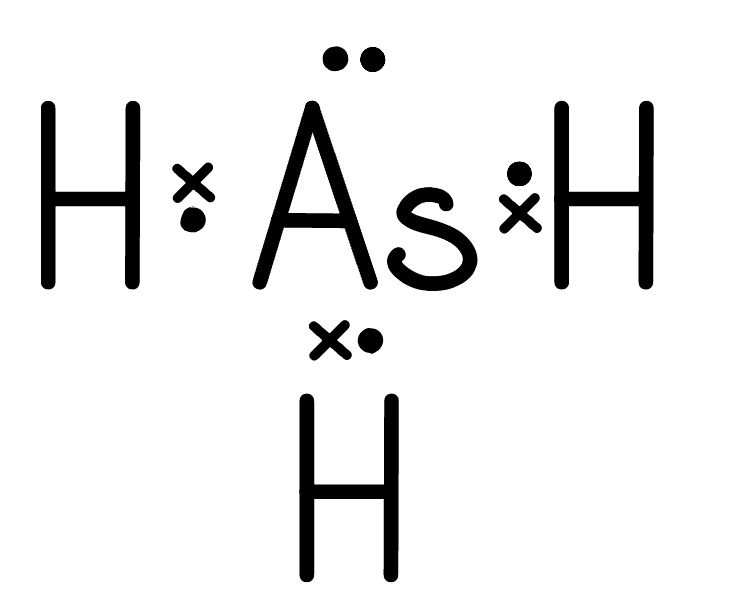

# Mark Schemes — Amount of Substance
**1. Structure, Bonding & Introduction to Organic Chemistry** · Edexcel International A Level (IAL) Chemistry (YCH11)

## Q1 — medium — 14 marks · structured-questions

### 13((a)) — 4 marks
i) The relative atomic mass of silicon to **two** decimal places is:

- *A*r = `fraction numerator open parentheses 28 space cross times space 92.17 close parentheses space plus space open parentheses 29 space cross times space 4.71 close parentheses space plus space open parentheses 30 space cross times space 3.12 close parentheses over denominator 100 end fraction` = 28.1095; **[1 mark]**
- To two decimal places: = 28.11; **[1 mark]**

ii) A reason why there is a small peak in the mass spectrum of silicon at *m / z *= 14 is:

- Some silicon atoms (of mass 28) lose two electrons / have a charge of 2+; **[1 mark]**

iii) The completed table is:

| **Isotope** | **Number of protons** | **Number of neutrons** |
|---|---|---|
| 28Si | **Final answer:** **14** | **Final answer:** **14** |
| 29Si | **Final answer:** **14** | **Final answer:** **15** |
| 30Si | **Final answer:** **14** | **Final answer:** **16** |

- All values correct; **[1 mark]**

**[Total: 4 marks]**

- *Ensure you give calculated values to the required number of decimal places - this is an easy mark to lose!*
- *A correct value for **A**r** scores 2 marks without working*
- *The only acceptable units for **A**r** are g mol**-1** or a.m.u. *
- *If you obtain a value between 28 and 30 but the expression used is incorrect, you would score 1 mark*
- *Remember**: The peaks on a mass spectrum occur at **m** / **z** values, which is the mass to charge ratio*
- *In most cases, the charge is +1, so the **m** / **z** value is just the mass of the ion*
- *In this case, the **m** / z value for the Si**2+** ion is 28 / 2 = 14*

**(1)**

### 13((b)) — 3 marks
The structure and bonding of silicon dioxide make it useful for a heat-resistant, electrically insulating layers because:

- **All **atoms are joined together by covalent bonds / giant covalent (structure);** [1 mark]**
- These are strong / take a lot of energy to break (so melting temperature is very high); **[1 mark]**
- No electrons are free (to move) / mobile / delocalised / (so charge cannot be carried); **[1 mark]**

**[Total: 3 marks]**

- *There are two properties that make silicon dioxide useful in this application:*

  - *High melting temperature so it can withstand heat*
  - *Non-conductor of electricity so it can act as an electrical insulator*
- *Whenever referring to the properties of substances, you must explain how the bonds / forces within the structure give rise to these properties*
- *You are told that silicon dioxide has a similar structure to diamond, so the same explanations from the properties of diamond can be applied to silicon dioxide*

  - *There are no intermolecular forces, just strong covalent bonds between all of the atoms which require a large amount of energy to overcome, giving it a high melting temperature*
  
    - *You would not be given credit if you refer to a high boiling temperature as this is not relevant in this application*
  - *All of the outer electrons of silicon and oxygen are involved in bonding so there are no free electrons to carry charge*

### 13((c)) — 3 marks
The empirical formula of calcium silicate is:

- Calculation of number of moles: $\mathrm{Ca}:\frac{12}{40.1}\mathrm{Si}:\frac{8.43}{28.1}O:\frac{14.47}{16}$ 
**OR**
Ca : Si : O = 0.299 : 0.30 : 0.904; **[1 mark]**
- Calculation of whole number mole ratio: 1 : 1 : 3; **[1 mark]**
- Empirical formula: CaSiO3; **[1 mark]**

**[Total: 3 marks]**

- *To find the whole number ratio, divide the number of moles of each element by the smallest number of moles*
- *It is a common mistake for students to forget to give the empirical formula once they have calculated the whole number ratio - a frustrating mark to lose when the hard work has been done!*

### 13((d)) — 4 marks
The volume, in cm3, occupied by 3.00 g of carbon dioxide gas at 5.0 °C and 1.3 × 105 Pa is:

- Calculation of moles carbon dioxide: 3 ÷ 44 = 0.06818;** [1 mark]**
- Conversion of temperature to K: 273 + 5 = 278; **[1 mark]**
- Rearrangement of expression: *V *= $\frac{nRT}{p}=\frac{0.06818\times8.31\times278}{1.3\times10^{5}}$ (= 1.2116 x 10-3 m3); **[1 mark]**
- Evaluation of answer in cm3: = 1211.6 / 1212 / 1210 /1200 (cm3); **[1 mark]**

**[Total: 4 marks]**

- *The most common mistakes made with these types of calculations are not converting / incorrectly converting to the correct units and not rearranging the expression correctly*
- *To convert from m**3** to cm**3**, multiply by 10**6*
- *If you are not confident in rearranging, it can be best to substitute values into the equation **pV** = **nRT **first:*

  - *1.3 x 10**5** x **V** = 0.06818 x 8.31 x 278*
- *Then simplify:*

  - *1.3 x 10**5** x **V** = 157.508*
- *Then rearrange:*

  - *V** = *$\frac{157.508}{1.3\times10^{5}}$* = 1.2116 x 10**-3 **m**3*

## Q2 — medium — 5 marks · structured-questions

### 24((a)) — 4 marks
The molar mass of **C **is:

- Conversion of volume to m3 72.5 × 10-6 = 7.25 × 10-5 / 0.0000725 (m3); **[1 mark]**
- Rearrangement of Ideal Gas Equation *n =* $\frac{pV}{RT}$; **[1 mark]**
- Conversion of pressure and evaluation to give number of moles $\frac{100000\times7.25x10^{-5}}{8.31\times358}$= 2.4370 × 10− 3 / 0.002437(mol); **[1 mark]**
- Calculation of molar mass $\frac{0.210}{2.4370\times10^{-3}}=$86.172 = 86 (g mol-1); **[1 mark]**

**[Total: 4 marks]**

- *You must know the ideal gas equation, **pV **= **nRT **and be able to rearrange it*
- *Don't forget that units for volume and pressure should be m**3** and Pa respectively *

  - *To convert from cm**3** to m**3** divide 72.5 by 1 000 000*
  - *To convert from kPa to Pa, multiply 100 by 1000*
- *Once the number of moles have been calculated, use *$\frac{\mathrm{mass}}{\mathrm{number} \mathrm{of} \mathrm{moles}}$* to find the molar mass of **C*

### 24((b)) — 1 marks
A possible name or formula for **C**, using your answer in (a) is:

- Hexane or any alkane with the molecular formula of C6H14; **[1 mark]**

**[Total: 1 mark]**

- *Being told the compound is a hydrocarbon narrows it down to an alkane or an alkene*
- *Have a play around with the numbers until you find a combination that equals 86*

  - *(6 x 12) + (14 x 1) = 86 g mol**-1*

## Q3 — hard — 8 marks · structured-questions

### 13((a)) — 1 marks
The dot‐and‐cross diagram for arsine, AsH3 is:

- 

; **[1 mark] **

**Final answer:** **[Total: 1 mark] **

- *You can score the mark if you:*

  - *Use all dots, all crosses or have the dots and crosses swapped around*
  - *Have overlapping circles*
  - *Have the lone pair shown as separate electrons*

### 13((b)) — 7 marks
i) The completed half equation is:

- AsH3 → As + 3H+ + 3e(−); **[1 mark] **

ii) To calculate the final oxidation state of the cerium ion formed in the reaction:

- Moles of Ce4+ $\frac{488}{1000}\times0.102$ = 0.049776 (mol);** [1 mark] **
- Calculation of *T* in *K *and *V* in m3 *T* = 293 K 
**AND **
*V* =** **350 × 10−6 m3;** [1 mark] **
- Rearrangement of* pV = nRT* *n* = $\frac{PV}{RT}$; **[1 mark] **
- Calculation of *n *for arsine *n* = $\frac{115000\times350\times10^{-6}}{8.31\times293}$ = 0.016531; **[1 mark] **
- Deduction of whole number ratio of AsH3 : Ce4+ $\frac{0.049776}{0.016531}$ = 1 : 3;** [1 mark] **
- The oxidation state of cerium in the product = Ce3+ / (+)3; **[1 mark] **

**Final answer:** **[Total: 7 marks] **

- *The first step is to calculate the number of moles of Ce**4+** by using moles = volume (dm**3**) x concentration *

  - *If you use volume in cm**3** then you must divide by 1000*
- *Conversion of units for the **PV** = **nRT** equation is essential*

  - *To convert the temperature from °C to K, you add 273*
  - *To convert the volume from cm**3** to m**3**, you divide by 10**6*
  - *Pressure is given to you in Pa, so there is no need to change this*
- *You will score a mark for rearranging the equation to find **n*
- *The ratio between the number of moles of arsine and Ce**4+** will give the oxidation state of Ce**3+** in the product *
- *This is because we need to multiply the half equation for the reduction of Ce4+ by 3 to form a full equation *

  - *Ce**4+** + e**-** → Ce**3+** (x3)*
  - *AsH**3** → As + 3H**+** + 3e**−*
  - *AsH**3 **+ 3Ce**4+** → As + 3Ce**3+** *

## Q4 — easy — 1 marks · multiple-choice-questions

### 12() — 1 marks
**Correct answer: C** — 

**Final answer:** **The correct answer is ****C ****because:**

- The question says there is a molecular ion peak at molecular ion peak at *m / z* = 44.0632
- You must work out the molar mass to four decimal places
- For compound C, the molar mass is (12.0000 x 3) + (8 x 1.0079) = 44.0632

**A** is incorrect as the molar mass to 4 decimal places is 44.0265

**B** is incorrect as the molar mass to 4 decimal places is 44.0265

**D** is incorrect as the molar mass to 4 decimal places is 44.0265

## Q5 — easy — 1 marks · multiple-choice-questions

### 1() — 1 marks
**Correct answer: A** — 6.0 dm3

**Final answer:** **The correct answer is A**

$V = n \times V_{m} = 0 . 25 \times 24 . 0 = 6 . 0  \text{dm}^{3}$

**B** is incorrect as it uses 0.5 mol instead of 0.25 mol

**C** is incorrect as it gives the molar volume itself (volume of 1 mol)

**D** is incorrect as it divides 24.0 by 0.25 instead of multiplying

> **[exam-tip]**
> At r.t.p., 1 mole of any gas occupies 24.0 dm3. Always check whether the question asks for an answer in dm3 or cm3 (multiply by 1000 to convert dm3 to cm3).

## Q6 — medium — 2 marks · multiple-choice-questions

### 1() — 1 marks
**Correct answer: C** — 10

**Final answer:** **The correct answer is ****C**** because:**

- To calculate the concentration in ppm:

  - $\frac{\mathrm{mass} \mathrm{of} \mathrm{sulfur}}{\mathrm{mass} \mathrm{of} \mathrm{diesel} \mathrm{fuel}}\times1000000$
- The mass of the sulfur and diesel must be in the same units:

  - Mass of sulfur in grams = 10 x 10-3 g
  - Mass of diesel in grams = 1000 g
- Therefore, concentration = $\frac{10\times10^{-3}}{1000}\times1000000=10\mathrm{ppm}$

**A** is incorrect as  this is the ratio by mass

**B** is incorrect as  in the mass ratio the unit of kg has been ignored and this is based on 10 mg of sulfur in 1 g of fuel

**D** is incorrect as  this is based on 10 g of sulfur in 1 kg of fuel

### 1((b)) — 1 marks
**Correct answer: A** — 0.024

**Final answer:** **The correct answer is ****A**** because:**

- 3.2 kg of diesel fuel contains 3.2 x 10 = 32 mg = 32 x 10-3 g of sulfur
- Moles of sulfur = $\frac{\mathrm{mass}}{M_{r}}=\frac{32\times10^{-3}}{32.1}=9.9688...\times10^{-4}$ moles
- The equation when sulfur combusts is

  - S + O2 → SO2
- Therefore 9.9688... x 10-4 moles of sulfur dioxide is produced
- Volume of sulfur dioxide = moles x 24 = 9.9688... x 10-4 x 24 = 0.024 dm3

**B** is incorrect as the molar mass of sulfur has not been taken into account

**C** is incorrect as  the mass ratio has been ignored

**D** is incorrect as the units of mg have been ignored

## Q7 — medium — 1 marks · multiple-choice-questions

### 4() — 1 marks
**Correct answer: D** — 0.15

**Final answer:** **The answer is**** D ****because:**

- To calculate the concentration of sulfate ions, SO42-, in the solution, in mol dm−3:

  - Moles of Fe2(SO4)3·H2O in 200 cm3 = $\frac{4.179}{417.9}$= 0.01 moles
  - There are three sulfate ions in every molecule of Fe2(SO4)3·H2O
  - Therefore the moles of sulfate ions in 200 cm3 is 0.03 moles
  - The concentration of sulfate ions = $\frac{0.03}{200}$ x 1000 = **0.15** mol dm3

**A **is incorrect as  the volume of the solution has not been scaled up to 1 dm3 and uses only 1 mol of SO42− ions per mole of Fe2(SO4)3

**B** is incorrect as  this uses only 1 mol of SO42− ions per mole of Fe2(SO4)3

**C** is incorrect as  this is the concentration of Fe3+ (aq)

## Q8 — medium — 4 marks · multiple-choice-questions

### 4((a)) — 1 marks
**Correct answer: B** — 0.029

**Final answer:** **The correct answer is ****B**** because:**

- The number of moles of sodium in 0.23 g = $\frac{\mathrm{mass}}{M_{r}}=\frac{0.23}{23.0}$ = 0.010 mol
- Concentration = `fraction numerator moles over denominator volume space open parentheses dm cubed close parentheses end fraction space equals space fraction numerator 0.010 over denominator 0.350 end fraction` = 0.029 mol dm-3

**A** is incorrect as  this is just the number of moles of sodium

**C** is incorrect as  this assumes the number of moles of sodium is 0.1

**D** is incorrect as  this is the concentration in g dm-3

### 4((b)) — 1 marks
**Correct answer: A** — 120

**Final answer:** **The correct answer is ****A**** because:**

- The mole ratio of Na : H2 is 2:1
- So the number of moles of H2 = ½ x number of moles of sodium = ½ x 0.010 = 0.005 moles
- Volume of H2 = 0.005 x 24000 = 120 cm3

**B** is incorrect as  the mole ratio of 1:1 has been used

**C** is incorrect as  the mole ratio of Na : H2 has been taken as 1:2

**D** is incorrect as the mass of sodium has been taken as the number of moles

### 4((c)) — 1 marks
**Correct answer: A** — H+ (aq) + OH− (aq) → H2O (l)

**Final answer:** **The correct answer is ****A**** because:**

- The full equation for the neutralisation of sodium hydroxide with sulfuric acid is:

  - 2H2SO4 (aq) + 2NaOH (aq) → Na2SO4 (aq) + 2H2O (l)
- Breaking the reactants and products down into their respective ions:

  - 2H+ (aq) + SO42- (aq) + 2Na+ (aq) + 2OH− (aq) → 2Na+ (aq) + SO42- (aq) + 2H2O (l)
- Cancel out the spectator ions:

  - 2H+ (aq) + **SO****4****2-**** (aq)** + **2Na****+ ****(aq)** + 2OH− (aq) → **2Na****+ ****(aq)** + **SO****4****2-**** (aq)** + 2H2O (l)
  - 2H+ (aq) + 2OH− (aq) →  2H2O (l)
- Simplify:

  - H+ (aq) + OH− (aq) →  H2O (l)

**B** is incorrect as the water has been ignored

**C** is incorrect as  the sulfuric acid has not been shown as ions

**D** is incorrect as all the ions are shown but none are cancelled

### 4((d)) — 1 marks
**Correct answer: A** — 29.1%

**Final answer:** **The correct answer is ****A**** because:**

- The atom economy is calculated by:

  - $\mathrm{Atom} \mathrm{economy}=\frac{M_{r}\mathrm{of} \mathrm{desired} \mathrm{produ}c\mathrm{ts}}{\mathrm{Sum} \mathrm{of}M_{r}\mathrm{of} \mathrm{ALL} \mathrm{reactants}}\times100$
- *M*r(Mg(OH)2 = 24.3 + 2 x (16 + 1) = 58.3
- *M*r(NaOH) = 23 + 16 + 1 = 40
- *M*r(MgSO4) = 24.3 + 32.1 + (4 x 16) = 120.4
- Therefore:

  - `Atom space economy space equals space fraction numerator 58.3 over denominator open parentheses 2 space cross times space 40 close parentheses space plus space 120.4 end fraction space cross times space 100 space equals space 29.1 percent sign`

**B** is incorrect as  this is the percentage ratio of magnesium hydroxide to sodium sulfate

**C** is incorrect as  this is the percentage ratio of magnesium hydroxide to magnesium sulfate

**D** is incorrect as this is the percentage mole ratio of the product

## Q9 — medium — 1 marks · multiple-choice-questions

### 4() — 1 marks
**Correct answer: D** — CaCO3 + 2NaCl → CaCl2 + Na2CO3

**Final answer:** **The correct answer is ****D**** because:**

- The reaction which produces the waste products with the greatest *M*r will have the lowest atom economy
- In this case, reaction **D** has the greatest *M*r of waste products so has the lowest atom economy
- Alternatively, you could calculate the atom economy for each, but this would use valuable time in an exam:
- Atom economy = $\frac{M_{r}\mathrm{of} \mathrm{desired} \mathrm{product}}{\mathrm{sum} \mathrm{of}M_{r}\mathrm{of} \mathrm{ALL} \mathrm{reactants}}\times100$

  - For **A**: Atom economy = `fraction numerator 40 space plus space stretchy left parenthesis 2 space cross times space 35.5 stretchy right parenthesis over denominator 40 space plus space open parentheses 2 space cross times space 35.5 close parentheses end fraction space cross times space 100` = 100%

- For **B**: Atom economy = `fraction numerator 40 space plus space open parentheses 2 space cross times space 35.5 close parentheses over denominator 40 space plus space stretchy left parenthesis 2 space cross times space 35.5 stretchy right parenthesis space plus space open parentheses 2 space cross times space 1 close parentheses end fraction space cross times space 100` = 98%

  - For **C**: Atom economy = `fraction numerator 40 space plus space stretchy left parenthesis 2 space cross times space 35.5 stretchy right parenthesis over denominator 40 space plus space stretchy left parenthesis 2 space cross times space 35.5 stretchy right parenthesis space plus space open parentheses 2 space cross times space 1 close parentheses space plus space 16 space plus space 12 space plus space open parentheses 2 space cross times space 12 close parentheses end fraction space cross times space 100` = 67%
  - For **D**: Atom economy = `fraction numerator 40 space plus space stretchy left parenthesis 2 space cross times space 35.5 stretchy right parenthesis over denominator 40 space plus space stretchy left parenthesis 2 space cross times space 35.5 stretchy right parenthesis space plus space open parentheses 2 space cross times space 23 close parentheses space plus space 12 space plus space open parentheses 3 space cross times space 16 close parentheses end fraction space cross times space 100` = 51%

**A** is incorrect as  there are no waste products so will have an atom economy of 100%

**B** is incorrect as  H2 has a lower *M*r than Na2CO3

**C** is incorrect as  the combined *M*r of H2O and CO2 is lower than Na2CO3

## Q10 — medium — 1 marks · multiple-choice-questions

### 9() — 1 marks
**Correct answer: C** — 0.00005%

**Final answer:** **The correct answer is ****C**** because:**

- To calculate the concentration in ppm of nitrogen dioxide:

  - Concentration in ppm = $\frac{\mathrm{volume} \mathrm{of} \mathrm{nitrogen} \mathrm{dioxide}}{\mathrm{volume} \mathrm{of} \mathrm{air}}$ x 1 000 000
- This can be rearranged so:

  - $\frac{\mathrm{volume} \mathrm{of} \mathrm{nitrogen} \mathrm{dioxide}}{\mathrm{volume} \mathrm{of} \mathrm{air}}$ = $\frac{\mathrm{concentration} \mathrm{in} \mathrm{ppm}}{1000000}$
- To calculate the percentage of nitrogen dioxide molecules in air we would use:

  - $\frac{\mathrm{volume} \mathrm{of} \mathrm{nitrogen} \mathrm{dioxide}}{\mathrm{volume} \mathrm{of} \mathrm{air}}\times100$
- So multiplying both sides of the rearranged expression involving concentration in ppm:

  - $\frac{\mathrm{volume} \mathrm{of} \mathrm{nitrogen} \mathrm{dioxide}}{\mathrm{volume} \mathrm{of} \mathrm{air}}\times100=\frac{\mathrm{concentration} \mathrm{in} \mathrm{ppm}}{1000000}\times100$
- Percentage of nitrogen dioxide = $\frac{\mathrm{concentration} \mathrm{in} \mathrm{ppm}}{1000000}\times100$
- Percentage of nitrogen dioxide = $\frac{0.5}{1000000}$ x 100 = 0.00005%

**A** is not correct as  the answer shows the percentage equal to ppm

**B **is not correct as  the answer shows the ppm divided by 100

**D** is not correct  as  the correct answer has been divided by 100

## Q11 — medium — 1 marks · multiple-choice-questions

### 9() — 1 marks
**Correct answer: D** — 0.264g

**Final answer:** **The correct answer is ****D ****because:**

- The ratio of propanol to carbon dioxide is 1:3 so the number of moles of carbon dioxide formed is:

  - 3 x 2.00 × 10−3 = 6 x 10-3 mol
- To find the mass of carbon dioxide produced:

  - 6 x 10-3 x 44 = 0.264 g

**A** is incorrect as the ratio used is 3:1 not 1:3

**B **is incorrect as the ratio used is 1:1 not 1:3

** C** is incorrect as the atomic numbers have been used to calculate the molar mass of carbon dioxide

## Q12 — medium — 1 marks · multiple-choice-questions

### 13() — 1 marks
**Correct answer: C** — 475 cm3

**Final answer:** **The correct answer is ****C**** because:**

- The number of moles of HCl is 1 x (25 / 1000) = 0.025 mol
- To determine the total volume of the solution: $\frac{0.025}{0.0500}$ = 0.5 dm3 = 500 cm3
- You already have 25.0 cm3 of the HCl so the amount of distilled water that needs adding is 500 - 25 = 475 cm3

**A** is incorrect as this would only halve the concentration to 0.5 mol dm-3

**B** is incorrect as this would be the total volume to produce a concentration of 0.5 mol dm-3

**D** is incorrect as this is the total volume

## Q13 — medium — 1 marks · multiple-choice-questions

### 15() — 1 marks
**Correct answer: A** — 5.25 g

**Final answer:** **The correct answer is ****A**** because:**

- The number of moles in 12.5 g of cyclohexanol is:

  - $\frac{12.5}{100}$ = 0.125 moles
- One mole of cyclohexanol makes one mole of cyclohexane

  - So, 0.125 moles of cyclohexanol will make 0.125 moles of cyclohexene
- The mass of 0.125 moles of cyclohexane is:

  - 0.125 x 82 = 10.25 g
- The mass of cyclohexane produced with a 51.2% yield is:

  - $\frac{10.25}{100}\times51.2$ = 5.248 g
  - This rounds to a final answer of 5.25 g

**B** is incorrect as this is 51.2% of 12.5 g

**C** is incorrect as this calculation has used an Mr for cyclohexanol of 82 and an Mr for cyclohexane of 100

**D** is incorrect as this is the mass produced if the yield was 100%

## Q14 — medium — 1 marks · multiple-choice-questions

### 16() — 1 marks
**Correct answer: C** — 27.90 tonnes

**Final answer:** **The correct answer is ****C**** because:**

- The number of moles of Fe2O3= $\frac{39.9\times1\times10^{6}}{159.6}$= 250 000 mol
- The ratio of Fe2O3 to Fe3O4 is 3:2 so the moles of Fe3O4 is  $250000\times\frac{2}{3}$= 166 667  mol
- 166 667 moles of Fe3O4 are therefore used in Step 2
- The ratio of Fe3O4 to Fe is 1:3 so the moles of Fe are 166 667 x 3 = 500 000 mol
- The mass of Fe made is 500 000 x 55.8 = 27 900 000 g = 27.9 tonnes
- Overall, the molar ratio of Fe2O3: Fe is 1:2
- **Remember**: To calculate the number of moles using mass and *M*r, the mass needs to be in grams (there are 1 x 106 g in 1 tonne)

**A** is incorrect as the wrong ratio (2:1) has been used instead of 1:2

**B** is incorrect as the wrong ratio (1:1) has been used instead of 1:2

**D** is incorrect as the wrong ratio (1:3) has been used instead of 1:2

## Q15 — medium — 1 marks · multiple-choice-questions

### 11() — 1 marks
**Correct answer: C** — 11.0 g of carbon dioxide

**Final answer:** **The correct answer is ****C**** because:**

- One mole of gas at room temperature and pressure occupies 24.0 dm3
- So, 6.0 dm3 represents 0.25 moles
- This means that you are looking for the option that has 0.25 moles of the given gas

  - Moles of carbon dioxide = `fraction numerator 11.0 over denominator open parentheses 12.0 plus open parentheses 2 cross times 16.0 close parentheses close parentheses end fraction` = 0.25 moles

**A** is incorrect as 2.0 g is 0.5 mol of helium

**B** is incorrect as 4.0 g is 0.125 mol of oxygen gas, O2

**D** is incorrect as 14.0 g is 0.5 mol of nitrogen gas, N2

## Q16 — medium — 1 marks · multiple-choice-questions

### 16() — 1 marks
**Correct answer: A** — (0.80 × 15.1) ÷ 60

**Final answer:** **The correct answer is ****A**** because:**

- Density = $\frac{\mathrm{mass}}{\mathrm{volume}}$
- Rearranging gives mass = density x volume
- Moles = $\frac{\mathrm{mass}}{M_{r}}$
- Substituting in mass = density x volume:

  - Moles = $\frac{\mathrm{density}\times\mathrm{volume}}{M_{r}}$
- Using the values given in the question gives:

  - Moles = $\frac{0.80\times15.1}{60}$

**B** is incorrect as mass does not equal density ÷ volume

**C** is incorrect as moles does not equal Mr ÷ mass

**D** is incorrect as mass does not equal volume ÷ density

## Q17 — medium — 1 marks · multiple-choice-questions

### 17() — 1 marks
**Correct answer: B** — 0.40 dm3 of 0.03 mol dm−3 KCl

**Final answer:** **The correct answer is ****B**** because:**

- The number of moles of KCl: 0.40 dm3 x 0.03 mol dm−3 = 0.012 mol
- KCl consists of two ions so the number of ions = 0.012 x 2 = 0.024 mol of ions

**A** is incorrect as   $\frac{20}{1000}\times0.5=0.01\mathrm{mol}$. There are two ions so 0.01 x 2 = 0.02 mol of ions

**C** is incorrect as  $\frac{10}{1000}\times0.6$ = 0.006. There are three ions so 0.06 x 3 = 0.018 mol of ions

** D** is incorrect as 0.15 x 0.04 = 0.006. There are three ions so 0.006 x 3 = 0.018 mol of ions

## Q18 — medium — 1 marks · multiple-choice-questions

### 17() — 1 marks
**Correct answer: C** — 5.22

**Final answer:** **The correct answer is ****C**** because:**

- The number of moles of lithium is$\frac{3.00}{6.9}$ = 0.435 mol
- So the number of moles of hydrogen produced is $\frac{0.435}{2}$ = 0.2175 mol (as the molar ratio in the equation is 2:1)
- The volume of hydrogen produced is therefore 0.2175 x 24 = 5.22 dm3

**A** is incorrect as  this is the number of moles of hydrogen

**B** is incorrect as  this is the number of moles of lithium

**D** is incorrect as  this is the number of moles of lithium multiplied by the molar volume

## Q19 — medium — 1 marks · multiple-choice-questions

### 18() — 1 marks
**Correct answer: C** — 39.2%

**Final answer:** **The correct answer is ****C**** because:**

- Atom economy shows how many of the atoms used in the reaction become the desired product
- To calculate it the equation used is: $\frac{\mathrm{molecular} \mathrm{mass} \mathrm{of} \mathrm{desired} \mathrm{product}}{\mathrm{sum} \mathrm{of} \mathrm{molecular} \mathrm{masses} \mathrm{of} \mathrm{all} \mathrm{reactants}}\times100$
- So *M*r of reactant KClO3 = 39.1 + 35.5 + (16 x 3) = 122.6
- *M*r of the desired product, oxygen = 2 x 16 = 32
- Atom economy: `fraction numerator open parentheses 3 space straight x space 32 close parentheses over denominator open parentheses 2 space straight x space 122.6 close parentheses end fraction cross times space 100` = 39.2%

**A **is incorrect as the O on the right-hand side has been multiplied by 2, not 6

**B** is incorrect as  the O on the right-hand side has been multiplied by 4, not 6

**D** is incorrect as  the mass of oxygen has been divided by the mass of KCl

## Q20 — medium — 1 marks · multiple-choice-questions

### 18() — 1 marks
**Correct answer: B** — 4.89 g

**Final answer:** **The correct answer is**** B**** because:**

- The reaction which occurs when the hydrated magnesium sulfate is heated is:

  - MgSO4•7H2O $\rightleftharpoons$ MgSO4 + 7H2O
- The number of moles of MgSO4•7H2O is $\frac{10}{236.4}$= 0.0406 mol
- The molar ratio of MgSO4•7H2O to MgSO4 is 1:1 so there are also 0.0406 mol of MgSO4
- The mass of MgSO4 formed is 0.0406 x 120.4 = 4.89 mol dm-3

**A** is incorrect as  this is the mass of water lost using the atomic numbers of water

**B** is incorrect as  this is the mass of water lost

**D** is incorrect as  they have used the atomic numbers to calculate the molar mass of water

## Q21 — medium — 1 marks · multiple-choice-questions

### 18() — 1 marks
**Correct answer: B** — 400

**Final answer:** **The correct answer is ****B**** because:**

- One mole of gas at room temperature and pressure occupies 24.0 dm3
- The initial gas mixture contains

  - 100 cm3 propane = $\frac{100}{24000}$ = 0.00417 moles
  - 600 cm3 oxygen = $\frac{600}{24000}$ = 0.025 moles
- The final gas mixture contains

  - No propane as this is the limiting reagent and will be completely used up in the reaction
  - No water as it is not in the gaseous state
  - The propane will form 3 x 0.00417 = 0.0125 moles of carbon dioxide
  
    - This occupies a volume of 0.0125 x 24000 = 300 cm3 
  - There will be 0.025 - (5 x 0.00417) = 0.00415 moles of unused oxygen
  
    - This occupies a volume of 0.00415 x 24000 = 100 cm3
  - This means that the total volume of the final gas mixture is 300 + 100 = 400 cm3

**A** is incorrect as this is the volume of carbon dioxide produced and does not account for the 100 cm3 of unused oxygen

**C** is incorrect as  this is the volume of carbon dioxide and water produced if water was a gas

**D** is incorrect as  this is the volume of carbon dioxide and water produced if water was a gas plus 100 cm3 of oxygen that remains

## Q22 — medium — 1 marks · multiple-choice-questions

### 18() — 1 marks
**Correct answer: C** — 300 cm3

**Final answer:** **The correct answer is ****C**** because:**

- The balanced symbol equation for the reaction is:

3BaCl2 + Ga2(SO4)3 → 3BaSO4 + 2GaCl3

- Moles of gallium sulfate:

moles Ga2(SO4)3 = conc x volume (dm3)

moles Ga2(SO4)3 = 0.05 x $\frac{200}{1000}$ = 0.01 mol

- One mole of galium sulfate reacts with 3 moles of barium chloride

moles BaCl2 = 3 x 0.01 = 0.03 mol

- Volume of barium chloride

volume BaCl2 = $\frac{\mathrm{moles}}{\mathrm{concentration}}$

volume BaCl2 = $\frac{0.03}{0.100}$ = 0.3 dm3

- Convert dm3 to cm3

0.3 x 1000 = 300 cm3

**A** is incorrect as  the stoichiometry has not been considered

**B** is incorrect as the stoichiometry and the differences in concentration have not been considered

**D** is incorrect as the stoichiometry has not been considered and the ratio of concentrations has been used the wrong way round

## Q23 — medium — 1 marks · multiple-choice-questions

### 19() — 1 marks
**Correct answer: C** — 500 cm3 of 1.0 mol dm−3 NaCl

**Final answer:** **The correct answer is ****C**** because:**

- Moles = concentration x volume
- Moles of ions = (concentration x volume) x number of ions
- **A** / MgCl2 contains one Mg2+ ion and two Cl– ions

  - `open parentheses 200 over 1000 cross times 1.5 close parentheses cross times 3` = 0.9 moles
- **B** / MgSO4 contains one Mg2+ ion and one SO42– ion

  - $(\frac{400}{1000}\times0.8)\times2$ = 0.64 moles
- **C** / NaCl contains one Na+ ion and one Cl– ion

  - $(\frac{500}{1000}\times1.0)\times2$ = 1.0 moles
- **D** / Na2SO4 contains two Na+ ion and one SO42– ion

  - $(\frac{1000}{1000}\times0.25)\times3$ = 0.75 moles
- Therefore **C** / NaCl contains the greatest number of ions

**A**, **B** and **D** are incorrect as  they do not contain the greatest number of ions

## Q24 — medium — 1 marks · multiple-choice-questions

### 1() — 1 marks
**Correct answer: B** — 58.0%

**Final answer:** **The correct answer is B**

- Calculate the *M*r of each reactant and the desired product:

*M*r(CH4) = 12.0 + (4 × 1.0) = 16.0

*M*r(Cl2) = 2 × 35.5 = 71.0

*M*r(CH3Cl) = 12.0 + (3 × 1.0) + 35.5 = 50.5

- Calculate the percentage atom economy:

percentage atom economy = $\frac{M_{r}ofdesiredproduct}{M_{r}ofallreactants}$ × 100

percentage atom economy = `\frac{50 . 5}{\left(16 . 0 + 71 . 0\right)}` x 100

percentage atom economy = `\frac{50 . 5}{\left(87 . 0\right)}` x 100

percentage atom economy = 58.0%

**A** is incorrect as this is the atom economy for the formation of the by-product HCl (36.5/87.0 × 100), not the desired product CH3Cl

**C** is incorrect as 71.1% results from dividing by only *M*r(Cl2) = 71.0, forgetting to include CH4 in the denominator

**D** is incorrect as 100% would imply no by-product is formed, but HCl is produced alongside CH3Cl

> **[exam-tip]**
> 1. Identify which product is 'wanted' before starting
> 2. Always sum ALL reactants in the denominator

## Q25 — medium — 1 marks · multiple-choice-questions

### 1() — 1 marks
**Correct answer: D** — 0.400

**Final answer:** **The correct answer is D**

- Calculate the moles of NaCl:

moles = $\frac{\mathrm{mass}}{M_{r}}$

moles NaCl = $\frac{5.85}{58.5}$

moles NaCl = 0.100 mol

- Convert the volume from cm3 to dm3:

volume = $\frac{250}{1000}$

volume = 0.250 dm3

- Calculate the concentration of the solution:

concentration = `fraction numerator moles over denominator volume space open parentheses dm cubed close parentheses end fraction`

concentration = $\frac{0.100}{0.250}$

concentration = 0.400 mol dm-3

**A** is incorrect as it results from dividing 250 by 100 instead of 1000 when converting cm3 to dm3, giving 2.5 dm3 and 0.100 / 2.5 = 0.040

**B** is incorrect as it gives the number of moles, not the concentration

**C** is incorrect as it gives the volume in dm3, not the concentration

> **[exam-tip]**
> Always convert volumes to dm3 before substituting into $c = n / V$. Divide by 1000 (not 100) when converting cm3 to dm3.

## Q26 — hard — 1 marks · multiple-choice-questions

### 3() — 1 marks
**Correct answer: A** — 0.1 g dm-3 HCl

**Final answer:** **The correct answer is ****A**** because:**

- To calculate the concentration in mol dm-3 from g dm-3, divide by the* M*r:
- 0.1 g dm-3 HCl = $\frac{0.1}{1+35.5}$ = 0.00274 mol dm-3

  - 1 mol of HCl releases 1 mol Cl- therefore the concentration of Cl- = **0.00274** mol dm-3
- 0.1 g dm-3 NaCl = $\frac{0.1}{23+35.5}$ = 0.00171 mol dm-3

  - 1 mol of NaCl releases 1 mol Cl- therefore the concentration of Cl- = ** 0.00171** mol dm-3
- 0.1 g dm-3 KCl = $\frac{0.1}{39.1+35.5}$ = 0.00134 mol dm-3

  - 1 mol of HCl releases 1 mol Cl- therefore the concentration of Cl- = **0.00134** mol dm-3
- 0.1 g dm-3 BaCl2 = `fraction numerator 0.1 over denominator 137.3 space plus space open parentheses 2 space cross times space 35.5 close parentheses end fraction` = 0.00048 mol dm-3

  - 1 mol of HCl releases 2 mol Cl- therefore the concentration of Cl- = **0.00096** mol dm-3
- The highest concentration of Cl- is in HCl, option **A**

**B**, **C** and **D** are incorrect as  HCl has a higher concentration of chloride ions

## Q27 — hard — 1 marks · multiple-choice-questions

### 14() — 1 marks
**Correct answer: D** — 136.9 cm3

**Final answer:** **The correct answer is ****D**** because:**

- The number of moles of acid in 150 cm3 of 0.35 mol dm−3 solution is $\frac{150}{1000}\times0.35$ = 0.0525 mol
- So the volume of acid required is $\frac{0.0525}{4}$ = 0.0131 dm3 or 13.1 cm3
- If the total solution is 150 cm3 and 13.1 cm3 is acid the volume of water required is:

  - 150 - 13.1 = 136.9 cm3

**A** is incorrect as  this is the volume of acid required

**B** is incorrect as  this is the number of moles of acid multiplied by 1000

**C** is incorrect as  this is 150 ‒ (the number of moles of acid multiplied by 1000)
