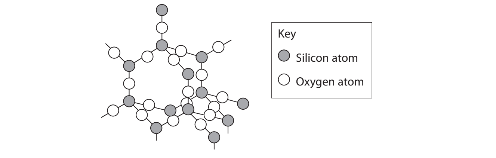
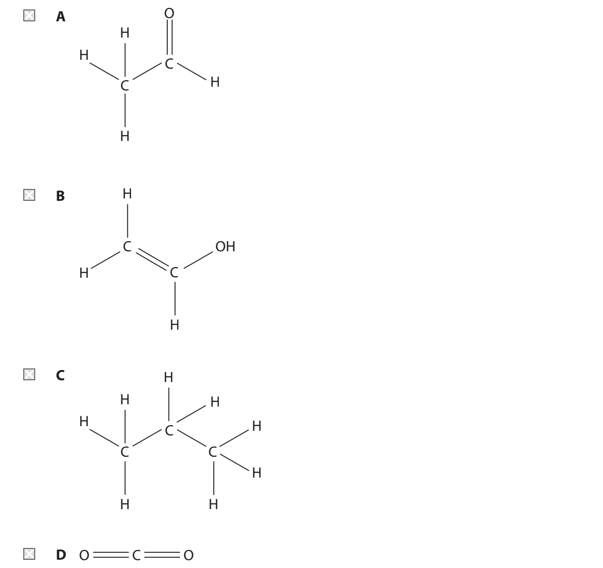
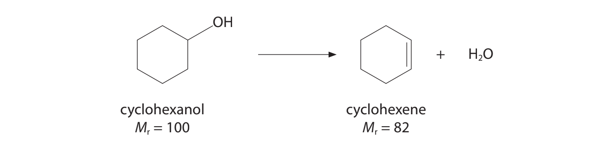

# Exam Questions — Amount of Substance
**1. Structure, Bonding & Introduction to Organic Chemistry** · Edexcel International A Level (IAL) Chemistry (YCH11)
> Source: [https://www.savemyexams.com/international-a-level/chemistry/edexcel/17/topic-questions/1-structure-bonding-and-introduction-to-organic-chemistry/1-2-amount-of-substance/structured-questions/](https://www.savemyexams.com/international-a-level/chemistry/edexcel/17/topic-questions/1-structure-bonding-and-introduction-to-organic-chemistry/1-2-amount-of-substance/structured-questions/) · 27 questions · total 55 marks

## Q1 — medium — 14 marks · structured-questions

### 13((a)) — 4 marks — command: multiple — structured — from paper Oct 2021 · WCH11/01
This question is about silicon and carbon.

Silicon is a semiconductor.

i) Data obtained using the mass spectrum of silicon are shown.

| **Isotope mass number** | **Relative abundance** |
|---|---|
| 28 | 92.17 |
| 29 | 4.71 |
| 30 | 3.12 |

Calculate the relative atomic mass of silicon to **two** decimal places.

**(2)**

ii) Suggest a reason why there is a small peak in the mass spectrum of silicon at *m / z *= 14

**(1)**

iii) Complete the table to show the number of protons and neutrons in each isotope of silicon.

| **Isotope** | **Number of protons** | **Number of neutrons** |
|---|---|---|
| 28Si |   |   |
| 29Si |   |   |
| 30Si |   |   |

**(1)**

### 13((b)) — 3 marks — command: explain — structured — from paper Oct 2021 · WCH11/01
Silicon dioxide, SiO2 , is the main constituent of sand and has a giant lattice structure similar to that of diamond.

Crystalline silicon dioxide is used on the surface of semiconductor devices to provide a heat-resistant, electrically insulating layer.

Explain how the structure and bonding of silicon dioxide make it useful for this application.

### 13((c)) — 3 marks — command: determine — structured — from paper Oct 2021 · WCH11/01
Calcium silicate is formed in the removal of silicon dioxide impurities in the extraction of iron from its ores. A sample of calcium silicate composed of calcium, silicon and oxygen was found to contain 12.0 g of calcium, 8.43 g of silicon and 14.47 g of oxygen.

Determine the empirical formula of calcium silicate. You **must** show your working.

### 13((d)) — 4 marks — command: calculate — structured — from paper Oct 2021 · WCH11/01
Carbon dioxide is a gas at room temperature. A fizzy drink is canned at 5.0°C and 1.3 × 105 Pa and contains approximately 3 g of carbon dioxide.

Calculate the volume, in cm3, occupied by 3.00 g of carbon dioxide gas at 5.0°C and 1.3 × 105 Pa.

[*pV = nRT*     R = 8.31 Jmol−1K−1]

## Q2 — medium — 5 marks · structured-questions

### 24((a)) — 4 marks — command: calculate — structured — from paper Jan 2022 · WCH11/01
A 0.210 g sample of a volatile organic liquid **C** is injected into a gas syringe and heated in an oven. At 100 kPa and 358 K, the syringe contains 72.5 cm3 of gas.

Calculate the molar mass of **C**. 
[*pV = nRT        R* = 8.31 J mol−1 K−1 ]

### 24((b)) — 1 mark — command: give — structured — from paper Jan 2022 · WCH11/01
The organic liquid **C** is a hydrocarbon. Give a possible name or formula for **C**, using your answer in (a).

## Q3 — hard — 8 marks · structured-questions

### 13((a)) — 1 mark — command: draw — structured — from paper Jan 2022 · WCH15/01
The hydride of arsenic, arsine, is a toxic gas used in the production of semiconductors.

Draw a dot‐and‐cross diagram for arsine, AsH3.

### 13((b)) — 7 marks — command: multiple — structured — from paper Jan 2022 · WCH15/01
Arsine is a reducing agent and reacts with cerium(IV) sulfate solution, forming arsenic.

The data from an experiment are shown.

Volume of arsine gas = 350 cm3 at 115000 Pa and 20 °C

Volume of cerium(IV) sulfate solution = 488 cm3 

Concentration of cerium(IV) sulfate solution = 0.102 mol dm−3

i) Complete the half‐equation.

**(1)**

AsH3 → As

ii) Calculate the final oxidation state of the cerium ion formed in the reaction.

**(6)**

## Q4 — easy — 1 marks · multiple-choice-questions

### 12() — 1 mark — multiple_choice — from paper June 2021 · WCH14/01
The high resolution mass spectrum of a compound X has a molecular ion peak at *m / z* = 44.0632. Accurate relative atomic masses are given in the table.

| **Element** | **Relative atomic mass** |
|---|---|
| Hydrogen | 1.0079 |
| Carbon | 12.0000 |
| Oxygen | 15.9949 |

Which of these compounds, with a relative molecular mass of 44, gives rise to this peak?

- **A.** 
- **B.** 
- **C.** 
- **D.** 

## Q5 — easy — 1 marks · multiple-choice-questions

### 1() — 1 mark — multiple_choice
What volume is occupied by 0.25 mol of an ideal gas at room temperature and pressure (r.t.p.)?

*[Molar volume at r.t.p. = 24.0 dm^3^ mol^-1^]*
- **A.** 6.0 dm3
- **B.** 12.0 dm3
- **C.** 24.0 dm3
- **D.** 96.0 dm3

## Q6 — medium — 2 marks · multiple-choice-questions

### 1() — 1 mark — multiple_choice — from paper Oct 2021 · WCH11/01
The maximum permitted concentration of sulfur in diesel fuel is 10 mg of sulfur in 1 kg of diesel fuel.

What is this concentration of sulfur in ppm?
- **A.** 0.00001
- **B.** 0.01
- **C.** 10
- **D.** 10000

### 1((b)) — 1 mark — multiple_choice — from paper Oct 2021 · WCH11/01
3.2 kg of this diesel fuel is burned in air.

What is the maximum volume, in dm3, of sulfur dioxide which can be produced, measured at room temperature and pressure (r.t.p.)?

[Molar volume of a gas at r.t.p. = 24 dm3 mol−1]
- **A.** 0.024
- **B.** 0.77
- **C.** 2.4
- **D.** 24

## Q7 — medium — 1 marks · multiple-choice-questions

### 4() — 1 mark — multiple_choice — from paper Jan 2022 · WCH15/01
A mass of 4.179 g of hydrated iron(III) sulfate, Fe2(SO4)3·H2O, was dissolved in deionised water and the solution made up to 200 cm3 .

What is the concentration of sulfate ions, SO42-, in the solution, in mol dm−3?

[Molar mass of Fe2(SO4)3·H2O = 417.9 g mol−1]
- **A.** 0.01
- **B.** 0.05
- **C.** 0.10
- **D.** 0.15

## Q8 — medium — 4 marks · multiple-choice-questions

### 4((a)) — 1 mark — multiple_choice — from paper Oct 2021 · WCH11/01
A mass of 0.23 g of sodium was added to 350 cm3 water to form hydrogen and a solution of sodium hydroxide.

Na (s) + H2O (l) → NaOH (aq) + 1⁄2H2 (g)

What is the concentration, in mol dm−3, of sodium hydroxide in the solution formed?
- **A.** 0.010
- **B.** 0.029
- **C.** 0.29
- **D.** 0.66

### 4((b)) — 1 mark — multiple_choice — from paper Oct 2021 · WCH11/01
What is the maximum volume, in cm3, of hydrogen which could be formed, measured at r.t.p.?

[Molar volume of a gas at r.t.p. = 24 dm3 mol−1]
- **A.** 120
- **B.** 240
- **C.** 480
- **D.** 2800

### 4((c)) — 1 mark — multiple_choice — from paper Oct 2021 · WCH11/01
c) The sodium hydroxide solution was neutralised with sulfuric acid.

Which is the ionic equation for this reaction?
- **A.** H+ (aq) + OH− (aq) → H2O (l)
- **B.** S$O_{4}^{2-}$ (aq) + 2Na+ (aq) → Na2SO4 (aq)
- **C.** H2SO4 (aq) + 2Na+ (aq) + 2OH− (aq) → Na2SO4 aq) + 2H2O (l)
- **D.** 2H+ (aq) + S$O_{4}^{2-}$ (aq) + 2Na+ (aq) + 2OH− (aq) → 2Na+ (aq) + S$O_{4}^{2-}$ (aq) + 2H2O (l)

### 4((d)) — 1 mark — multiple_choice — from paper Oct 2021 · WCH11/01
Sodium hydroxide solution was added to magnesium sulfate solution. The equation for the reaction is shown.

2NaOH(aq) + MgSO4(aq) → Mg(OH)2(s) + Na2SO4(aq)

What is the atom economy (by mass) for the production of magnesium hydroxide?

[Ar values: H = 1.0 O = 16.0 Na = 23.0 Mg = 24.3 S = 32.1]
- **A.** 29.1%
- **B.** 41.0%
- **C.** 48.4%
- **D.** 50.0%

## Q9 — medium — 1 marks · multiple-choice-questions

### 4() — 1 mark — multiple_choice — from paper Jan 2021 · WCH11/01
Which conversion has the **lowest **percentage atom economy (by mass) for the formation of CaCl2?
- **A.** Ca + Cl2 → CaCl2
- **B.** Ca + 2HCl → CaCl2 + H2
- **C.** CaCO3 + 2HCl → CaCl2 + H2O + CO2
- **D.** CaCO3 + 2NaCl → CaCl2 + Na2CO3

## Q10 — medium — 1 marks · multiple-choice-questions

### 9() — 1 mark — multiple_choice — from paper Jan 2022 · WCH11/01
The concentration of nitrogen dioxide in a sample of air is 0.5 ppm.

What is the percentage of nitrogen dioxide molecules in this sample of air?
- **A.** 0.5%
- **B.** 0.005%
- **C.** 0.00005%
- **D.** 0.0000005%

## Q11 — medium — 1 marks · multiple-choice-questions

### 9() — 1 mark — multiple_choice — from paper Oct 2021 · WCH12/01
The equation for the complete combustion of propan-1-ol is shown.

C3H7OH(l) + 4 1⁄2O2(g) → 3CO2(g) + 4H2O(l)

2.00 × 10−3 mol of propan-1-ol undergoes complete combustion.

What mass of carbon dioxide is formed?
- **A.** 0.0293g
- **B.** 0.0880g
- **C.** 0.132g
- **D.** 0.264g

## Q12 — medium — 1 marks · multiple-choice-questions

### 13() — 1 mark — multiple_choice — from paper Oct 2021 · WCH12/01
A student is provided with 25.0 cm3 of 1.00 mol dm–3 hydrochloric acid.

What volume of distilled water should the student add to this solution to make a 0.0500 mol dm–3 solution?
- **A.** 25.0 cm3
- **B.** 50.0 cm3
- **C.** 475 cm3
- **D.** 500 cm3

## Q13 — medium — 1 marks · multiple-choice-questions

### 15() — 1 mark — multiple_choice — from paper June 2021 · WCH11/01
Cyclohexene may be prepared by the dehydration of cyclohexanol.

What mass of cyclohexene can be made from 12.5 g of cyclohexanol if the yield is 51.2%?
- **A.** 5.25 g
- **B.** 6.40 g
- **C.** 7.80 g
- **D.** 10.25 g

## Q14 — medium — 1 marks · multiple-choice-questions

### 16() — 1 mark — multiple_choice — from paper Jan 2022 · WCH11/01
Iron(III) oxide is reduced by hydrogen in a two-step process.

| Step 1: | 3Fe2O3 + H2 → 2Fe3O4 + H2O |
|---|---|
| Step 2: | Fe3O4 + 4H2 → 3Fe + 4H2O |

What is the maximum mass of iron that could be produced from 39.9 tonnes of Fe2O3 ?

[Ar values: H = 1.0 O = 16.0 Fe = 55.8]**   **
- **A.** 6.98 tonnes
- **B.** 13.95 tonnes
- **C.** 27.90 tonnes
- **D.** 41.85 tonnes

## Q15 — medium — 1 marks · multiple-choice-questions

### 11() — 1 mark — multiple_choice — from paper June 2021 · WCH11/01
Which of these gases occupies 6.0 dm3 at room temperature and pressure (r.t.p.)?

[molar volume of gas at r.t.p. = 24.0 dm3 mol−1 

*A*r values: He = 4.0 C = 12.0 N = 14.0 O = 16.0]
- **A.** 2.0 g of helium
- **B.** 4.0 g of oxygen
- **C.** 11.0 g of carbon dioxide
- **D.** 14.0 g of nitrogen

## Q16 — medium — 1 marks · multiple-choice-questions

### 16() — 1 mark — multiple_choice — from paper Jan 2021 · WCH12/01
How many moles are there in 15.1 cm3 of liquid propan-1-ol?

[Density of propan-1-ol = 0.80 g cm−3      *M*r of propan-1-ol = 60]
- **A.** (0.80 × 15.1) ÷ 60
- **B.** 0.80 ÷ (60 × 15.1)
- **C.** 60 ÷ (0.80 × 15.1)
- **D.** (60 × 15.1) ÷ 0.80

## Q17 — medium — 1 marks · multiple-choice-questions

### 17() — 1 mark — multiple_choice — from paper Jan 2022 · WCH11/01
Which of these solutions contains the greatest number of ions?
- **A.** 20.0 cm3 of 0.5 mol dm−3 KCl
- **B.** 0.40 dm3 of 0.03 mol dm−3 KCl
- **C.** 10.0 cm3 of 0.6 mol dm−3 CaCl2
- **D.** 0.15 dm3 of 0.04 mol dm−3 CaCl2

## Q18 — medium — 1 marks · multiple-choice-questions

### 17() — 1 mark — multiple_choice — from paper June 2021 · WCH12/01
What volume, in dm3, of hydrogen gas will be produced when 3.00 g of lithium is reacted with water at room temperature and pressure (r.t.p.)?

2Li + 2H2O → 2LiOH + H2

[Molar volume of gas at r.t.p. = 24.0 dm3 mol–1]
- **A.** 0.217
- **B.** 0.435
- **C.** 5.22
- **D.** 10.4

## Q19 — medium — 1 marks · multiple-choice-questions

### 18() — 1 mark — multiple_choice — from paper Jan 2022 · WCH11/01
Potassium chlorate(V) decomposes on heating to form oxygen.

2KClO3 → 2KCl + 3O2

What is the atom economy (by mass) for the formation of oxygen?

[Ar values: O = 16.0 Cl = 35.5 K = 39.1]
- **A.** 13.1%
- **B.** 26.1%
- **C.** 39.2%
- **D.** 64.3%

## Q20 — medium — 1 marks · multiple-choice-questions

### 18() — 1 mark — multiple_choice — from paper Oct 2021 · WCH12/01
10.00 g of hydrated magnesium sulfate, MgSO4•7H2O, is heated to remove the water of crystallisation.

What mass of anhydrous magnesium sulfate, MgSO4, is formed?

[Molar mass of MgSO4•7H2O = 246.4 g mol−1 ]
- **A.** 2.84 g
- **B.** 4.89 g
- **C.** 5.11 g
- **D.** 7.16 g

## Q21 — medium — 1 marks · multiple-choice-questions

### 18() — 1 mark — multiple_choice — from paper June 2021 · WCH11/01
Propane burns completely in oxygen as shown.

C3H8 (g) + 5O2 (g) → 3CO2 (g) + 4H2O (l)

100 cm3 of propane was mixed with 600 cm3 of oxygen and the mixture was ignited.

What is the **total **volume, in cm3, of the gas mixture at the end of the reaction?

All gas volumes were measured at room temperature and pressure.
- **A.** 300
- **B.** 400
- **C.** 700
- **D.** 800

## Q22 — medium — 1 marks · multiple-choice-questions

### 18() — 1 mark — multiple_choice — from paper Jan 2021 · WCH12/01
Barium chloride solution, BaCl2 (aq), reacts with gallium sulfate solution, Ga2(SO4)3 (aq) to form a precipitate of barium sulfate, BaSO4 (s).

What is the minimum volume of 0.100 mol dm−3 barium chloride needed to precipitate **all** the sulfate ions in 200 cm3 of 0.05 mol dm−3 gallium sulfate?
- **A.** 100 cm3
- **B.** 200 cm3
- **C.** 300 cm3
- **D.** 400 cm3

## Q23 — medium — 1 marks · multiple-choice-questions

### 19() — 1 mark — multiple_choice — from paper June 2021 · WCH11/01
Which aqueous solution contains the greatest number of **ions**?
- **A.** 200 cm3 of 1.5 mol dm−3 MgCl2
- **B.** 400 cm3 of 0.8 mol dm−3 MgSO4
- **C.** 500 cm3 of 1.0 mol dm−3 NaCl
- **D.** 1000 cm3 of 0.25 mol dm−3 Na2SO4

## Q24 — medium — 1 marks · multiple-choice-questions

### 1() — 1 mark — multiple_choice
Chloromethane is produced by the reaction of methane with chlorine in the presence of ultraviolet radiation.

CH4 + Cl2 → CH3Cl + HCl

What is the percentage atom economy by mass for the production of chloromethane?

[*A*r values: H = 1.0; C = 12.0; Cl = 35.5]
- **A.** 42.0%
- **B.** 58.0%
- **C.** 71.1%
- **D.** 100%

## Q25 — medium — 1 marks · multiple-choice-questions

### 1() — 1 mark — multiple_choice
5.85 g of sodium chloride, NaCl, is dissolved in water and the solution is made up to 250 cm3.

What is the concentration of the solution, in mol dm-3? [*M*r (NaCl) = 58.5]
- **A.** 0.040
- **B.** 0.100
- **C.** 0.250
- **D.** 0.400

## Q26 — hard — 1 marks · multiple-choice-questions

### 3() — 1 mark — multiple_choice — from paper Jan 2021 · WCH11/01
Which aqueous solution has the **highest** concentration, in mol dm-3, of chloride ions?
- **A.** 0.1 g dm-3 HCl
- **B.** 0.1 g dm-3 NaCl
- **C.** 0.1 g dm-3 KCl
- **D.** 0.1 g dm-3 BaCl2

## Q27 — hard — 1 marks · multiple-choice-questions

### 14() — 1 mark — multiple_choice — from paper June 2021 · WCH12/01
A 4.00 mol dm−3 solution of an acid is used to prepare dilute solutions of the acid.

What volume of water is required to make up 150 cm3 of 0.35 mol dm−3 solution of the acid?
- **A.** 13.1 cm3
- **B.** 52.5 cm3
- **C.** 97.5 cm3
- **D.** 136.9 cm3
