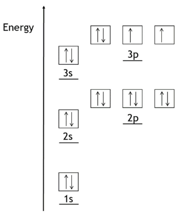

# Mark Schemes — Atomic Structure
**1. Structure, Bonding & Introduction to Organic Chemistry** · Edexcel International A Level (IAL) Chemistry (YCH11)

## Q1 — medium — 14 marks · structured-questions

### 18((a)) — 2 marks
The diagram to show the electronic configuration for a sulfur atom in the ground state is:

- Correctly labelled subshells; **[1 mark]**
- Correctly filled boxes / orbitals; **[1 mark]**

**[Total: 2 marks]**

- *A sulfur atom has 16 electrons so will have the electronic configuration 1s**2**2s**2**2p**6**3s**2**3p**4*
- *The 1s subshell is the lowest in energy which corresponds to the lowest box, followed by 2s, 2p, 3s and 3p *
- *All orbitals in 1s, 2s,2p and 3s are filled with 2 electrons, these electrons must be represented by 2 arrows pointing in the opposite direction to represent the opposite spin of the electrons*
- *When filling the 3p subshell, each orbital fills with 1 electron first, all with their spins in the same direction, so all arrows pointing in the same direction, the fourth electron will pair with one of these electrons but will have an opposite spin*

  - *So, one 3p orbital contains 2 electrons with opposite spin and two orbitals contain one electron only*
- *It does not matter which 3p orbital you pair and you can show the unpaired 3p electron as spin down*
- *You can represent the electrons using half arrows but not using vertical lines, as this does not show the direction of spin*
- *You would not gain the second mark if you showed the paired electrons with parallel spins*

### 18((b)) — 2 marks
The **first** ionisation energy of sulfur is:

S (g) → S+ (g) + e(–)    
**OR**    
S (g) - e(–) → S+ (g)

- Species and balancing; **[1 mark]**
- Correct state symbols; **[1 mark]**

**[Total: 2 marks]**

- *The first ionisation energy of an element is the amount of energy required to remove one mole of electrons from one mole of gaseous atoms of an element to form one mole of gaseous 1+ ions*

  - *On the LHS of the equation, you need to show one mole of gaseous atoms*
  - *On the RHS, you need to show one mole of gaseous 1+ ions and one mole of electrons*
- *You must show state symbols when giving the equation for ionisation energies, even if not prompted to do so in the question*

### 18((c)) — 3 marks
The first ionisation energy of sulfur is less than the first ionisation energies of** both** phosphorus and chlorine because:

- The outermost electrons are in the same subshell / (quantum) shell; **[1 mark]**
- Cl contains the greatest number of protons / more protons than S; **[1 mark]**
- There is (spin-spin) repulsion between (paired) electrons in (3)**p** orbital / subshell in S; **[1 mark]**

**[Total: 3 marks]**

- *You need to be able to explain the overall trend across Periods 2 and 3 and the dips in the trend between the 2nd and 3rd elements and the 5th and 6th element*
- *There are a number of ways of wording this explanation that are creditworthy*
- *Choose an explanation that you understand the most and learn it*
- *For the first mark, you would gain a mark for:*

  - *The outermost electrons have similar / the same (electron) shielding*
  - *There are the same number of shells*
  - *A correct reference to full or partial electronic configurations for two or three elements*
  - *You would **not **gain the mark for any incorrect electronic configurations*
- *For the second mark:*

  - *Cl has the greatest **nuclear **charge*
  - *Cl has the smallest **atomic **radius / smaller atomic radius than S*
- *For the third mark:*

  - *A correct reference to a stable half-full p subshell: e.g. there is a stable half-full p subshell in P **OR **removing an electron from S gives a stable half-full p subshell*

### 18((d)) — 4 marks
i) The term **isotopes**, in terms of subatomic particles, means:

- (Atoms with the) same number of protons; **[1 mark]**
- (And) different number of neutrons; **[1 mark]**

ii) The relative atomic mass of sulfur in this sample is:

- *A*r = `fraction numerator open parentheses 32 space cross times space 94.88 close parentheses space plus space open parentheses 33 space cross times space 0.83 close parentheses space plus space open parentheses 34 space cross times space 4.27 close parentheses space plus space open parentheses 36 space cross times space 0.02 close parentheses over denominator 100 end fraction`; **[1 mark]**
- *A*r = 32.09; **[1 mark]**

**[Total: 4 marks]**

- *The question tells you to define isotopes in terms of subatomic particles, so any reference to mass number or atomic number is not accepted*
- *Make sure you use the term atom, not species, particles or molecules - any of these will be penalised once *
- *When calculating the relative atomic mass, make sure that you take into account all of the isotopes*
- *It is very easy to make mistakes when entering numbers into your calculator - think about what value you would expect*

  - *The mass of the isotopes ranges from 32 to 36, so your answer has to be between 32 and 36*
  - *32**S is the most abundant, so you should expect that the number will be much closer to 32*
- *If you do not show any working, you will score 1 mark for a correct answer*

### 18((e)) — 3 marks
i) The number of sulfur atoms in the molecular ion is:

- $\frac{256}{32}$ = 8 (atoms); **[1 mark]**

ii) The **formula **of the **most stable ion **shown by this spectrum is:

- A species containing 2 sulfur atoms, e.g. S2 / S-S / SS / S,S; **[1 mark]**
- An ion with a 1+ charge; S2+ / [S-S]+ / SS+ / S,S+; **[1 mark]**

**[Total: 3 marks]**

- *The molecular ion peak is the peak with the highest **m** / **z ** value = 256*

  - *This value is equal to the **M**r** of a sulfur molecule*
- *One atom of sulfur has a mass of 32, therefore a molecule must have 256 ÷ 32 = 8 atoms*
- *The most stable ion has the highest peak, so its **m **/ **z **value is 64*
- *The most stable ion will have a 1+ charge, therefore its mass is 64 so will contain 64 ÷ 32 = 2 sulfur atoms: S**2**+*
- *S**4**2+** also has an **m** / **z** value of 64: (4 x 32) ÷ 2 = 64*

  - *However, the 2+ ion is not as stable as the 1+ ion, but you would score 1 mark for this ion*

## Q2 — medium — 1 marks · multiple-choice-questions

### 1() — 1 marks
**Correct answer: D** — **Y** and **Z**

**Final answer:** **The correct answer is ****D**** because:**

- In this question, you are required to find the pair of species that could be isotopes of one another
- The pair needs to have the same number of protons but a different number of neutrons

  - Having the same number of protons means that you are looking at the same element
  - Y and Z have 20 protons, but Z has two more neutrons than Z

**A** is incorrect as  **W** and **X** both have the same number of neutrons

**B** is incorrect as  **W** and **Y** have different numbers of protons so are different elements

**C** is incorrect as **X** and **Y** have different numbers of protons so are different elements

## Q3 — medium — 1 marks · multiple-choice-questions

### 2() — 1 marks
**Correct answer: C** — 4

**Final answer:** **The correct answer is ****C**** because:**

- The ICl3+ ion has three chlorines, which can be in the following combinations:

  - 3 x 35Cl
  - 2 x 35Cl + 1 x 37Cl
  - 1 x 35Cl + 2 x 37Cl
  - 3 x 37Cl

**A**, **B** and **D** are incorrect as these do not account for the possible combinations correctly

## Q4 — medium — 2 marks · multiple-choice-questions

### 3((a)) — 1 marks
**Correct answer: B** — electrons are removed from molecules or atoms and positive ions are formed

**Final answer:** **The correct answer is ****B**** because:**

- The basic steps in the operation of a mass spectrometer are:

  - The sample is vapourised
  - The sample is ionised
  - The ions are accelerated
  - The ions are deflected
  - The ions are detected
- In this case, **R** shows the vapourised sample being ionised

**A** is incorrect as the sample has been vapourised previously

**C** is incorrect as electrons are not added to atoms (in this mass spectrometer)

**D** is incorrect as acceleration occurs in region S

### 3((b)) — 1 marks
**Correct answer: A** — ions with a greater mass have a smaller deflection

**Final answer:** **The correct answer is ****A**** because:**

- Deflection is dependent on:

  - The mass of the ion:
  
    - The lighter the ion, the greater the deflection
  - The charge on the ion:
  
    - The greater the charge, the greater the deflection
- Statement **A** is correct as the greater the mass, the smaller the deflection

**B** is incorrect as ions with a greater mass have a smaller deflection

**C** is incorrect as  ions with a greater charge have a greater deflection

**D** is incorrect as  ions are not speeded up in a magnetic field

## Q5 — medium — 1 marks · multiple-choice-questions

### 3() — 1 marks
**Correct answer: C** — 192.5

**Final answer:** **The correct answer is ****C**** because:**

- *A*r = $\frac{(relativeabundance_{isotope1}\timesmass_{isotope1})+(relativeabundance_{isotope2}\timesmass_{isotope2})}{100}$
- *A*r = `fraction numerator stretchy left parenthesis 25 cross times 191 stretchy right parenthesis plus open parentheses 75 cross times 193 close parentheses over denominator 100 end fraction` = 192.5

**A** is incorrect as  the calculation for this answer has the relative abundances and masses the wrong way around

**B** is incorrect as  the calculation for this answer uses 50% for both relative abundances

**D** is incorrect as this is the relative atomic mass of the most abundant isotope

## Q6 — medium — 1 marks · multiple-choice-questions

### 1() — 1 marks
**Correct answer: D** — 9 : 6 : 1

**Final answer:** **The correct answer is D**

- *m* / *z* = 70 corresponds to 35Cl–35Cl, with probability $0 . 75 \times 0 . 75 = 0 . 5625$
- *m* / *z* = 72 corresponds to 35Cl–37Cl OR 37Cl–35Cl, with probability $2 \times 0 . 75 \times 0 . 25 = 0 . 375$
- *m* / *z* = 74 corresponds to 37Cl–37Cl, with probability $0 . 25 \times 0 . 25 = 0 . 0625$
- Dividing all three by 0.0625 gives 9 : 6 : 1

- **A** is incorrect — assumes the two isotopes are equally abundant
- **B** is incorrect — uses a 3 : 1 atomic ratio without accounting for combinations of two atoms
- **C** is incorrect — forgets that the mixed peak 35Cl–37Cl can form in two ways

> **[exam-tip]**
> For a diatomic molecule of an element with two isotopes, always remember that the "mixed" peak forms in two ways (AB or BA) so its probability doubles.

## Q7 — medium — 1 marks · multiple-choice-questions

### 1() — 1 marks
**Correct answer: B** — 

**Final answer:** **The correct answer is B**

- The atomic number of bromine is 35

  - So, the ion has 35 protons
- The mass number is 81

  - So, the number of neutrons is 81 - 35 = 46
- The 1– charge means the ion has gained one electron

  - So, it has 35 + 1 = 36 electrons

**A** is incorrect as the mass number (81) has been used as the neutron count instead of subtracting the protons

**C** is incorrect as proton and electron numbers have been swapped (a 1– ion gains, not loses, an electron)

**D** is incorrect as the 1– charge has been ignored, so electron count is wrong

> **[exam-tip]**
> For any ion:
> 
> - protons = atomic number
> - neutrons = mass number minus atomic number
> - electrons = protons minus charge (with sign).
> 
>   - A negative charge ADDS electrons.
