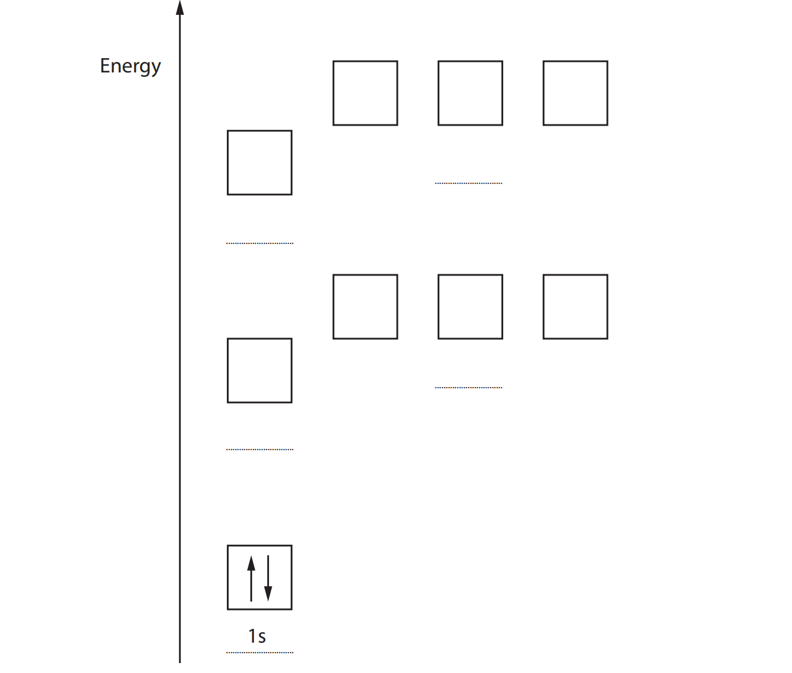
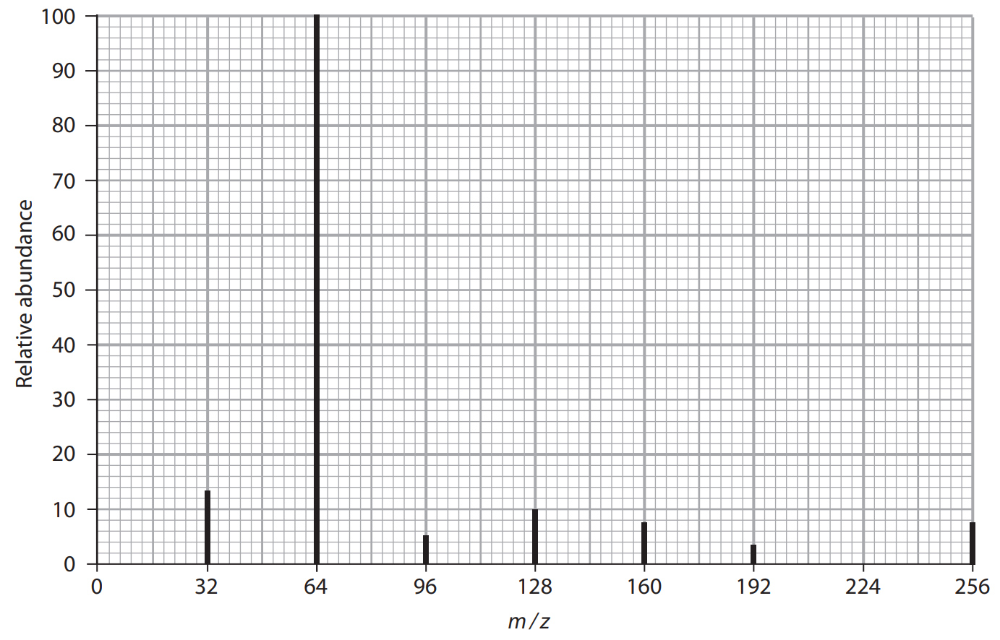
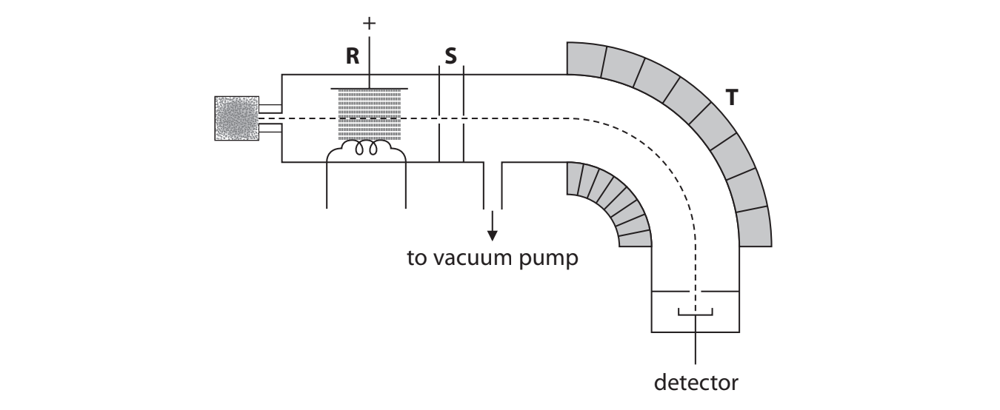
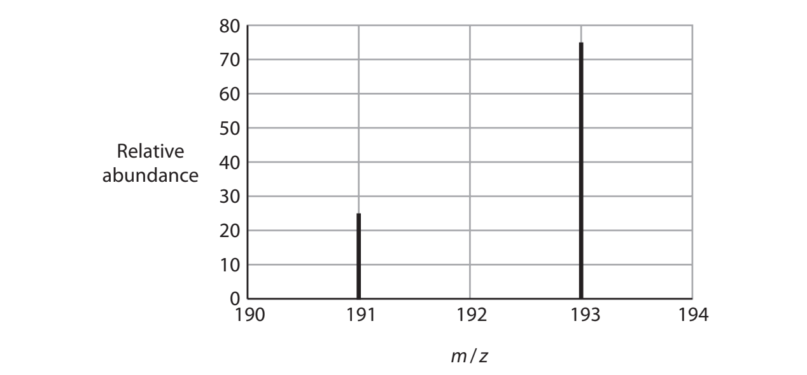

# Exam Questions — Atomic Structure
**1. Structure, Bonding & Introduction to Organic Chemistry** · Edexcel International A Level (IAL) Chemistry (YCH11)
> Source: [https://www.savemyexams.com/international-a-level/chemistry/edexcel/17/topic-questions/1-structure-bonding-and-introduction-to-organic-chemistry/1-3-atomic-structure/structured-questions/](https://www.savemyexams.com/international-a-level/chemistry/edexcel/17/topic-questions/1-structure-bonding-and-introduction-to-organic-chemistry/1-3-atomic-structure/structured-questions/) · 7 questions · total 21 marks

## Q1 — medium — 14 marks · structured-questions

### 18((a)) — 2 marks — command: complete — structured — from paper Jan 2021 · WCH11/01
This question is about the element sulfur.

Complete the diagram to show the electronic configuration for a sulfur atom in the ground state. Include labels for each subshell.

### 18((b)) — 2 marks — command: write — structured — from paper Jan 2021 · WCH11/01
Write an equation for the **first** ionisation energy of sulfur. Include state symbols.

### 18((c)) — 3 marks — command: explain — structured — from paper Jan 2021 · WCH11/01
Explain why the first ionisation energy of sulfur is less than the first ionisation energies of** both** phosphorus and chlorine.

### 18((d)) — 4 marks — command: multiple — structured — from paper Jan 2021 · WCH11/01
A sample of sulfur contains four isotopes.

| **Isotope** | 32S | 33S | 34S | 36S |
|---|---|---|---|---|
| **Percentage abundance** | 94.88 | 0.83 | 4.27 | 0.02 |

i) State what is meant by the term **isotopes**, in terms of subatomic particles.

**(2)**

ii) Calculate the relative atomic mass of sulfur in this sample. 
Give your answer to **two **decimal places.

**(2)**

### 18((e)) — 3 marks — command: multiple — structured — from paper Jan 2021 · WCH11/01
The mass spectrum of a sample of sulfur with 32S as the only isotope is shown.

i) Calculate the number of sulfur atoms in the molecular ion.
You **must **show your working.

**(1)**

ii) Suggest the **formula **of the **most stable ion **shown by this spectrum.

**(2)**

## Q2 — medium — 1 marks · multiple-choice-questions

### 1() — 1 mark — multiple_choice — from paper June 2021 · WCH11/01
The numbers of subatomic particles present in four species **W, X, Y** and **Z** are given in the table.

| **Species** | **Number of protons** | **Number of neutrons** | **Number of electrons** |
|---|---|---|---|
| **W** | 19 | 20 | 18 |
| **X** | 19 | 20 | 19 |
| **Y** | 20 | 20 | 18 |
| **Z** | 20 | 22 | 20 |

Which of these species are isotopic?
- **A.** **W** and **X**
- **B.** **W **and **Y**
- **C.** **X** and** Z**
- **D.** **Y** and **Z**

## Q3 — medium — 1 marks · multiple-choice-questions

### 2() — 1 mark — multiple_choice — from paper June 2021 · WCH11/01
Iodine exists as one isotope with mass number 127.

Chlorine exists as two isotopes with mass numbers 35 and 37.

How many molecular ion (ICl3+) peaks are there in the mass spectrum of ICl3?
- **A.** 2
- **B.** 3
- **C.** 4
- **D.** 5

## Q4 — medium — 2 marks · multiple-choice-questions

### 3((a)) — 1 mark — multiple_choice — from paper Oct 2021 · WCH11/01
The diagram shows a mass spectrometer.

Which process occurs in region **R**?
- **A.** the sample is vaporised using a heater
- **B.** electrons are removed from molecules or atoms and positive ions are formed
- **C.** electrons are added to the molecules or atoms and negative ions are formed
- **D.** ions are accelerated by an electric field

### 3((b)) — 1 mark — multiple_choice — from paper Oct 2021 · WCH11/01
Which statement is correct for region **T**?
- **A.** ions with a greater mass have a smaller deflection
- **B.** ions with a greater mass have a greater deflection
- **C.** ions with a greater charge have a smaller deflection
- **D.** ions are speeded up by a magnetic field

## Q5 — medium — 1 marks · multiple-choice-questions

### 3() — 1 mark — multiple_choice — from paper June 2021 · WCH11/01
The mass spectrum of a sample of an element has only two peaks.

What is the approximate relative atomic mass of the element in this sample?
- **A.** 191.5
- **B.** 192.0
- **C.** 192.5
- **D.** 193.0

## Q6 — medium — 1 marks · multiple-choice-questions

### 1() — 1 mark — multiple_choice
The mass spectrum of a sample of chlorine gas, Cl2, shows three molecular ion peaks at *m* / *z* = 70, 72 and 74. Chlorine consists of 75% 35Cl and 25% 37Cl.

What is the ratio of the heights of the peaks at *m* / *z* = 70 : 72 : 74?
- **A.** 1 : 1 : 1
- **B.** 3 : 1 : 0
- **C.** 9 : 1 : 0
- **D.** 9 : 6 : 1

## Q7 — medium — 1 marks · multiple-choice-questions

### 1() — 1 mark — multiple_choice
How many protons, neutrons and electrons are present in a 81Br- ion?

|   | Protons | Neutrons | Electrons |
|---|---|---|---|
| **A** | 35 | 81 | 36 |
| **B** | 35 | 46 | 36 |
| **C** | 36 | 45 | 35 |
| **D** | 35 | 46 | 35 |
- **A.** 
- **B.** 
- **C.** 
- **D.** 
