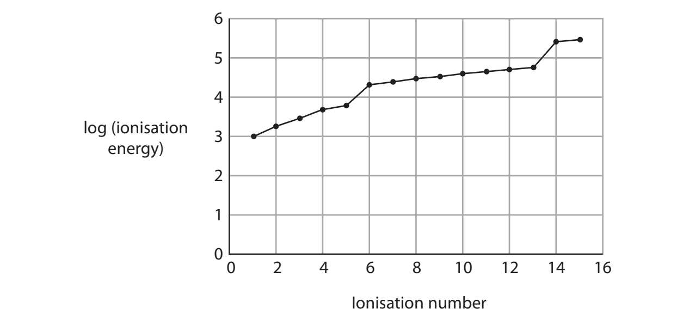

# Exam Questions — Electrons & Ions
**1. Structure, Bonding & Introduction to Organic Chemistry** · Edexcel International A Level (IAL) Chemistry (YCH11)
> Source: [https://www.savemyexams.com/international-a-level/chemistry/edexcel/17/topic-questions/1-structure-bonding-and-introduction-to-organic-chemistry/1-4-electrons-and-ions/structured-questions/](https://www.savemyexams.com/international-a-level/chemistry/edexcel/17/topic-questions/1-structure-bonding-and-introduction-to-organic-chemistry/1-4-electrons-and-ions/structured-questions/) · 8 questions · total 21 marks

## Q1 — hard — 14 marks · structured-questions

### 20((a)) — 2 marks — command: complete — structured — from paper Jan 2022 · WCH11/01
This question is about copper and its compounds.

Complete the electronic configurations of Cu and Cu2+.

Cu [Ar].....................................................................................................

Cu2+ [Ar].....................................................................................................

### 20((b)) — 7 marks — command: multiple — structured — from paper Jan 2022 · WCH11/01
A sample of copper contains the isotopes 63Cu and 65Cu.

i) Complete the table to show the numbers of subatomic particles in the atoms of these two isotopes of copper.

**(2)**

| **Isotope** | **Protons** | **Neutrons** | **Electrons** |
|---|---|---|---|
| 63Cu |   |   |   |
| 65Cu |   |   |   |

ii) Explain the term isotopes, using the information in the table.

**(2)**

iii) State why the two isotopes of copper have the same chemical reactions.

**(1)**

iv) The relative atomic mass of copper in this sample is 63.4. Calculate the percentage abundances of the isotopes 63Cu and 65Cu in this sample. 
You** must** show your working.

**(2)**

### 20((c)) — 5 marks — command: multiple — structured — from paper Jan 2022 · WCH11/01
Copper(II) sulfate, CuSO4, can be made by reacting solid copper(II) carbonate with dilute sulfuric acid.

i) Write an equation for the reaction that occurs. State symbols are not required.

**(1)**

ii) An experiment was carried out to produce pure, dry crystals of hydrated copper(II) sulfate, CuSO4 •5H2O. 
Copper(II) carbonate was mixed with 50.0 cm3 of 1.00 mol dm–3 sulfuric acid until no more reacted. The mass of CuSO4 •5H2O obtained was 10.87g.

Calculate the percentage yield for this reaction, giving your answer to an appropriate number of significant figures.
[Molar mass of CuSO4 •5H2O = 249.6 g mol−1 ]

**(4)**

## Q2 — easy — 1 marks · multiple-choice-questions

### 2() — 1 mark — multiple_choice — from paper Oct 2021 · WCH11/01
Which equation represents the **second** ionisation energy of chlorine?
- **A.** Cl− (g) + e−→ Cl2− (g)
- **B.** Cl (g) + 2e− → Cl2− (g)
- **C.** 2Cl (g) → 2Cl+ (g) + 2e−
- **D.** Cl+ (g) → Cl2+ (g) + e−

## Q3 — easy — 1 marks · multiple-choice-questions

### 4() — 1 mark — multiple_choice — from paper June 2021 · WCH11/01
Which equation represents the **second** ionisation energy of magnesium?
- **A.** Mg (g) → Mg2+ (g) + 2e−
- **B.** Mg+ (g) → Mg2+ (g) + e−
- **C.** Mg (s) → Mg2+ (s) + 2e−
- **D.** Mg+ (s) → Mg2+ (s) + e−

## Q4 — easy — 1 marks · multiple-choice-questions

### 8() — 1 mark — multiple_choice — from paper June 2021 · WCH12/01
Several factors may affect ionisation energies:

I) the number of protons increases

II) the outer electron is further from the nucleus

III) the amount of shielding increases

IV) the number of unpaired outer electrons increases

Which factors explain the **decrease** in ionisation energy as Group 1 is descended?
- **A.** I and II
- **B.** II and III
- **C.** III and IV
- **D.** I, II, III and IV

## Q5 — medium — 1 marks · multiple-choice-questions

### 5() — 1 mark — multiple_choice — from paper June 2021 · WCH11/01
The graph shows log (ionisation energy) against ionisation number for the successive ionisations of an element.

In this element, how many quantum shells contain electrons, and how many electrons are in the outer quantum shell?

|   | ** ** | **Number of quantum shells** **containing electrons** | **Number of electrons in the** **outer quantum shell** |
|---|---|---|---|
| ☐ | **A** | 3 | 2 |
| ☐ | **B** | 3 | 5 |
| ☐ | **C** | 5 | 2 |
| ☐ | **D** | 5 | 5 |
- **A.** 
- **B.** 
- **C.** 
- **D.** 

## Q6 — medium — 1 marks · multiple-choice-questions

### 6() — 1 mark — multiple_choice — from paper Oct 2021 · WCH11/01
A stable ion, **M****3+**, contains 18 electrons.

In which block of the Periodic Table is element **M** found?
- **A.** s
- **B.** p
- **C.** d
- **D.** f

## Q7 — medium — 1 marks · multiple-choice-questions

### 6() — 1 mark — multiple_choice — from paper June 2021 · WCH11/01
Which ion has the electronic configuration 1s22s22p63s23p6 in its ground state?
- **A.** Al3+
- **B.** Cl−
- **C.** N3−
- **D.** Na+

## Q8 — medium — 1 marks · multiple-choice-questions

### 6() — 1 mark — multiple_choice — from paper Jan 2021 · WCH11/01
A p-block element in **Period 3 **of the Periodic Table reacts to form an ionic compound.

What could be the electronic configuration of the **ion **formed by this element?
- **A.** 1s22s22p63s2
- **B.** 1s22s22p63s23p6
- **C.** 1s22s22p63s23p63d10
- **D.** 1s22s22p63s23p63d104s24p6
