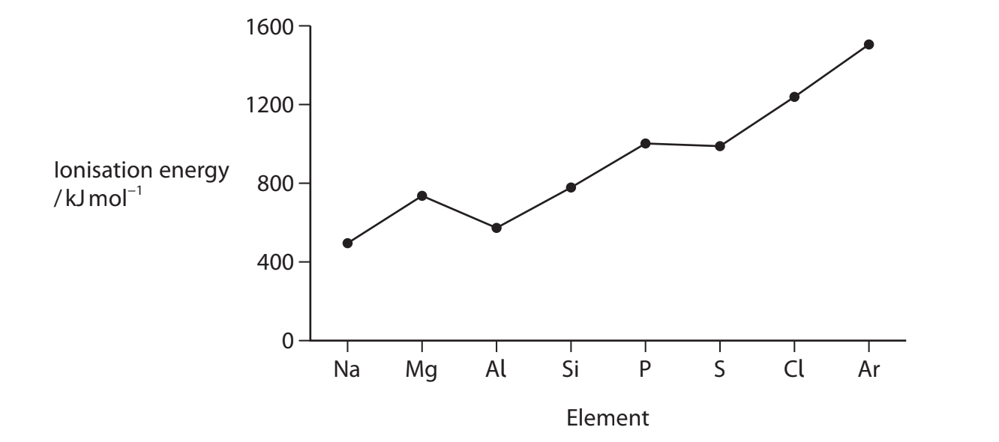
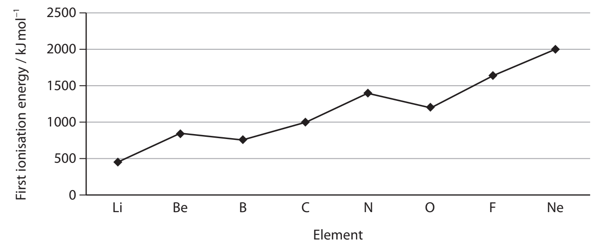
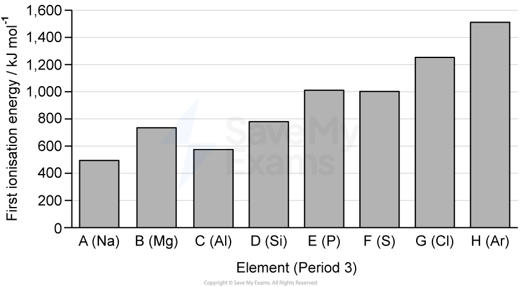

# Exam Questions — The Periodic Table
**1. Structure, Bonding & Introduction to Organic Chemistry** · Edexcel International A Level (IAL) Chemistry (YCH11)
> Source: [https://www.savemyexams.com/international-a-level/chemistry/edexcel/17/topic-questions/1-structure-bonding-and-introduction-to-organic-chemistry/1-5-the-periodic-table/structured-questions/](https://www.savemyexams.com/international-a-level/chemistry/edexcel/17/topic-questions/1-structure-bonding-and-introduction-to-organic-chemistry/1-5-the-periodic-table/structured-questions/) · 6 questions · total 39 marks

## Q1 — medium — 13 marks · structured-questions

### 14((a)) — 2 marks — command: explain — structured — from paper Oct 2021 · WCH11/01
Aluminium is an abundant metal with many uses.

The first four ionisation energies of aluminium are shown.

| **Ionisation number** | **Energy / kJ mol****−1** |
|---|---|
| 1 | 578 |
| 2 | 1820 |
| 3 | 2750 |
| 4 | 11600 |

Explain how this information shows that aluminium is in Group 3 of the Periodic Table.

### 14((b)) — 4 marks — command: explain — structured — from paper Oct 2021 · WCH11/01
The graph shows the first ionisation energies for the elements in Period 3.

i) Explain the general increase in the first ionisation energy from sodium to argon.

**(2)**

ii) Explain why the first ionisation energy of aluminium is less than the first ionisation energy of magnesium.

**(2)**

### 14((c)) — 4 marks — command: multiple — structured — from paper Oct 2021 · WCH11/01
i) Describe the bonding in aluminium metal.

**(2)**

ii) Give two possible reasons why aluminium is used for overhead power cables.

**(2)**

### 14((d)) — 3 marks — command: multiple — structured — from paper Oct 2021 · WCH11/01
New uses for waste aluminium cans are being investigated. One possible use is to make nanoparticle alloys to produce hydrogen for fuel.

i) Aluminium nanoparticles react with water to produce aluminium oxide and hydrogen.

Complete the following equation. State symbols are not required.

**(1)**

.................... Al + ............... H2O → .................. + ..................

ii) Give **two** possible reasons for producing hydrogen from aluminium rather than from fossil fuels.

**(2)**

## Q2 — medium — 7 marks · structured-questions

### 23((a)) — 5 marks — command: multiple — structured — from paper Jan 2022 · WCH11/01
This question is about the ionisation energies of the elements in Period 2 of the Periodic Table.

The first ionisation energies of the Period 2 elements are shown.

i) Give an equation that represents the first ionisation energy of lithium. 
Include state symbols. **(1)**

ii) Explain why there is a general increase in the first ionisation energy across the period.

**(2)**

iii) Explain why the first ionisation energy of oxygen is lower than that of nitrogen.

**(2)**

### 23((b)) — 2 marks — command: explain — structured — from paper Jan 2022 · WCH11/01
All the successive ionisation energies of nitrogen are shown in the table.

| **Ionisation number** | **1** | **2** | **3** | **4** | **5** | **6** | **7** |
|---|---|---|---|---|---|---|---|
| **Ionisation energy** **/ kJ mol****–1** | 1402 | 2856 | 4578 | 7475 | 9445 | 53267 | 64360 |

Explain the trend in the successive ionisation energies of nitrogen.

## Q3 — medium — 14 marks · structured-questions

### 1() — 3 marks — command: multiple — structured
This question is about atomic structure, mass spectrometry and ionisation energies.

i) State what is meant by the term **first ionisation energy**.

[2]

ii) Write an equation, including state symbols, to represent the first ionisation energy of sodium.

[1]

### 2() — 2 marks — command: calculate — structured
The mass spectrum of a sample of magnesium shows three peaks with the following relative abundances.

| Isotope | ²⁴Mg | ²⁵Mg | ²⁶Mg |
|---|---|---|---|
| Relative abundance / % | 79.0 | 10.0 | 11.0 |

Calculate the relative atomic mass, *A*r, of magnesium in this sample. Give your answer to two decimal places.

### 3() — 3 marks — command: multiple — structured
i) Give the electronic configuration of an aluminium atom, using the s, p, d notation.

[1]

ii) Explain why the first ionisation energy of aluminium is **lower** than that of magnesium.

[2]

### 4() — 2 marks — command: explain — structured
Explain the **general increase** in first ionisation energy across Period 3 from sodium to argon.

### 5() — 2 marks — command: justify — structured
The first four successive ionisation energies of an unknown element **Z** are shown in the table.

| Ionisation energy | 1st | 2nd | 3rd | 4th |
|---|---|---|---|---|
| Value / kJ mol-1 | 577 | 1820 | 2740 | 11 580 |

Deduce which group of the Periodic Table **Z** belongs to. Justify your answer.

### 6() — 2 marks — command: multiple — structured
i) Write an equation, including state symbols, to represent the **second ionisation energy** of magnesium.

[1]

ii) Suggest why the relative abundance of ²⁴Mg is much greater than that of 25Mg or 26Mg.

[1]

## Q4 — easy — 1 marks · multiple-choice-questions

### 7() — 1 mark — multiple_choice — from paper Jan 2021 · WCH11/01
The **Period 2** element with the **highest **melting temperature is
- **A.** aluminium
- **B.** boron
- **C.** carbon
- **D.** silicon

## Q5 — medium — 1 marks · multiple-choice-questions

### 8() — 1 mark — multiple_choice — from paper Oct 2021 · WCH11/01
In which series are the elements in order of **increasing** melting temperature?
- **A.** I2  <  Br2  <  Cl2  <  F2
- **B.** Li  <  Be  <  B  <  C
- **C.** Li  <  Na  <  K  <  Rb
- **D.** Si  <  P  <  S  <  Cl

## Q6 — medium — 3 marks · multiple-choice-questions

### 1() — 1 mark — multiple_choice
The graph shows the first ionisation energies of the elements in Period 3, labelled **A** to **H** in order of increasing atomic number.

Element **X** has the electronic configuration [Ne] 3s2 3p2.

Which letter on the graph labels element **X**?
- **A.** C
- **B.** D
- **C.** E
- **D.** F

### 2() — 1 mark — multiple_choice
The first ionisation energy of element **C** is lower than that of element **B**. What is the reason for this?
- **A.** Element C's outermost electron is paired
- **B.** Element C has fewer protons than element B
- **C.** Element C has more outer-shell electrons than element B, increasing electron–electron repulsion
- **D.** Element C's outermost electron occupies a 3p sub-shell, which is at a higher energy and more shielded than the 3s sub-shell holding element B's outermost electron

### 3() — 1 mark — multiple_choice
The first ionisation energy of element **F** is lower than that of element **E**. What is the reason for this?
- **A.** Element F has more shielding than element E
- **B.** Element F has a larger atomic radius than element E
- **C.** Element F's outermost electron is in a higher-energy sub-shell than element E's
- **D.** Element F has 3p4 with one paired orbital — the spin-pair repulsion makes one of the paired electrons easier to remove than an electron from element E's 3p3
