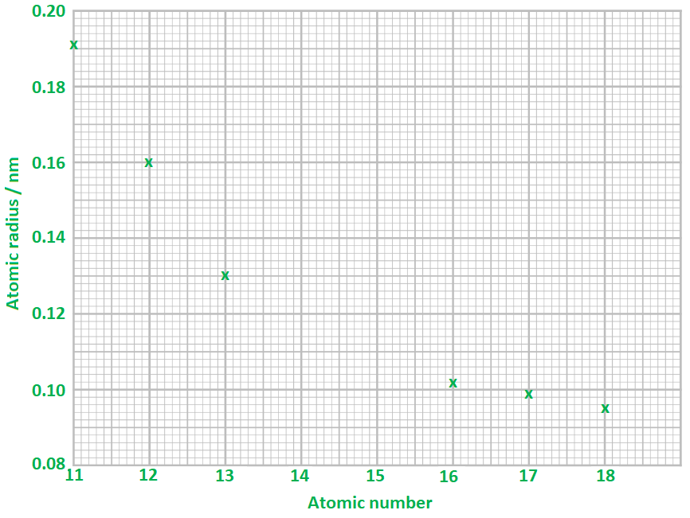
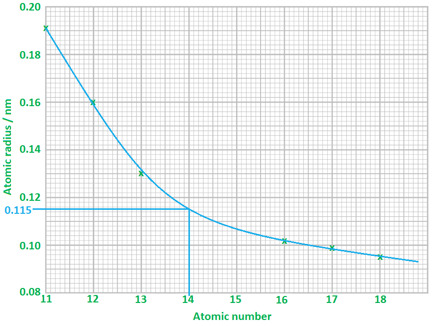
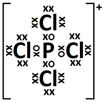

# Mark Schemes — Ionic & Metallic Bonding & Structure
**1. Structure, Bonding & Introduction to Organic Chemistry** · Edexcel International A Level (IAL) Chemistry (YCH11)

## Q1 — medium — 16 marks · structured-questions

### 22((a)) — 6 marks
i) The graph of atomic radius against atomic number is:

- Both axes labelled correctly with units where appropriate **AND **
Suitable scales on both axes; **[1 mark]**
- All points plotted correctly; **[1 mark]**

ii) The atomic radius of silicon, Si, is:

- A value between 0.112 to 0.118 (nm); **[1 mark]**

iii) An explanation for the decrease in atomic radius as atomic number increases across a period is:

- As the atomic number increases the (effective) nuclear charge increases / the number of protons (in the nucleus) increases; **[1 mark]**

Plus, any **two** of the following:

- This is only partially offset by the increased electron (-electron) repulsion as the number of electrons in the (outer) shell increases; **[1 mark]**
- The electrons are all in the same (quantum) shell 
**OR **
The electrons experience similar shielding / the same amount of shielding; **[1 mark]**
- So, there is an increase in attractive force between the nucleus and (outer) electrons; **[1 mark]**

**[Total: 6 marks]**

- *Take your time plotting the graph as there is no ±½ square tolerance for this question*
- *To determine the atomic radius for silicon:*

  - *Draw a curve of best fit*
  - *Draw a vertical line up from 14 to the curve of best fit*
  - *Draw a horizontal line across to the y-axis and read the value off* 
- *When explaining periodic trends / periodicity, your answer should tend to focus on:*

  - *Shielding / number of shells*
  - *Nuclear charge*
  - *Overall force of attraction between the outermost electrons and the nucleus*
- *In terms of atomic radius, it is considered that:*

  - *All the elements experience the same / similar shielding*
  - *The nuclear charge increases as you move across the period*
  - *This results in a greater force of attraction between the outermost (valence) electrons and the nucleus*
  - *The increased force of attraction causes the atomic radius to decrease*

### 22((b)) — 6 marks
The missing information is:

Type of structure:

- Sodium chloride = giant; **[1 mark]**

Type of bond or force broken on melting:

- Sodium = metallic; **[1 mark]**
- Sodium chloride = ionic; **[1 mark]**
- Chlorine = intermolecular forces 
**OR **
London / dispersion forces; **[1 mark]**

Particles involved:

- Sodium = Na+ / cations / positive ions 
**AND**
Electrons; **[1 mark]**
- Sodium chloride = Na+ and Cl− / cations and anions; **[1 mark]**

**[Total: 6 marks]**

- *It is expected that you can explain the differences in melting temperature between ionic, covalent and metallic materials*

  - *For covalent materials, this will include simple molecular and giant molecular / macromolecular as well as allotropes of carbon *
- *Careful:** Make sure you know the bond or force that has to be broken / overcome for melting to occur as examiners are typically strict on this point*

### 22((c)) — 4 marks
i) The dot-and-cross diagram of a PCl4+ ion is:

- 

; **[1 mark]**

ii) The shape of a PCl4+ ion is:

- Tetrahedral; **[1 mark]**

Justification:

- There are four bonding pairs / pairs of electrons (around the phosphorus); **[1 mark]**
- Which arrange to minimise the repulsion 
**OR **
Which arrange to be as far apart as possible / to have maximum separation; **[1 mark]**

**[Total: 4 marks]**

- *The shape of a molecule is determined by the number of bonding and non-bonding pairs of electrons*
- *For the PCl**4**+** ion, there are 4 bonding pairs which spread as far apart as possible (due to repulsion)*

  - *This results in the tetrahedral shape*

## Q2 — medium — 14 marks · structured-questions

### 1() — 2 marks
The dot-and-cross diagram for MgCl2 is:

> **[mark-scheme]**
> 1 mark for **Mg²⁺ shown correctly in square brackets with 2+ charge**, outer shell shown is the 2nd shell with 8 electrons (since the two 3s electrons have been donated to the chlorines)
> 
> 1 mark for **both Cl⁻ ions shown with 8 outer electrons** (7 of one symbol + 1 of the other, clearly distinguishing the donated electron) each in square brackets with 1− charge
> 
> Accept any combination of dots and crosses, provided the donated electron is clearly distinguished from the 7 original Cl electrons
> 
> Accept arrangement in any spatial position
> 
> Both ions must have correct charges to award the marks

> **[exam-tip]**
> Use different symbols (dots vs crosses) to distinguish which electrons came from which atom, this clearly shows the transfer. The electrons are indistinguishable in reality, but the diagram convention makes the transfer visible. Don't forget to bracket each ion with its charge, un-bracketed "Mg" and "Cl" labels score zero.

### 2() — 4 marks
To explain the shape of PCl5 and its bond angles:

- The central P atom has **5 bonding pairs and 0 lone pairs** of electrons **[1 mark]**
- These 5 electron pairs arrange themselves at **maximum separation / minimum repulsion** (VSEPR theory) **[1 mark]**
- The shape is therefore **trigonal bipyramidal** **[1 mark]**
- The bond angles are **120°** (between the three Cl atoms in the central plane) and **90°** (between those Cl atoms and the two Cl atoms above/below the plane) **[1 mark]**

> **[mark-scheme]**
> 1 mark for identifying **5 bonding pairs AND 0 lone pairs** on the central P atom
> 
> Accept "5 bonding pairs, no lone pairs" or "5 electron pairs" if context makes clear these are bonding
> 
> 1 mark for **maximum separation / minimum repulsion** of electron pairs
> 
> Accept "repel equally", "as far apart as possible", "minimum electron-pair repulsion"
> 
> Accept reference to VSEPR theory
> 
> 1 mark for **trigonal bipyramidal**
> 
> Must include "bi" (or "bi-pyramidal" / "bipyramid")
> 
> Reject "trigonal pyramidal" (this is a different shape — NH3 geometry)
> 
> 1 mark for **both bond angles 90° AND 120°** (both required for the mark)
> 
> Reject if only one angle is given

> **[exam-tip]**
> The most common error on PCl5 is writing "trigonal **pyramidal**" (dropping the "bi") these are completely different shapes. PCl5 has two distinct bond angles: **120°** between the three Cl atoms in the central plane, and **90°** between those and the two Cl atoms above/below. State both for full marks. The full chain of reasoning is: count electron pairs → apply VSEPR (max separation) → name the shape → state the angles.

### 3() — 5 marks
**i)** MgCl2 has more covalent character than BaCl2 because:

- Mg²⁺ is a smaller ion than Ba²⁺ (smaller ionic radius), so Mg²⁺ has a higher charge density / polarising power than Ba²⁺ **[1 mark]**
- The greater polarising power of Mg²⁺ distorts the electron cloud of the Cl⁻ anion more than Ba²⁺ does, resulting in more shared electron density between the ions, this is covalent character **[1 mark]**

**ii)** A dative covalent bond is:

- A covalent bond in which both shared electrons are donated by the same atom (one atom provides the entire electron pair). **[1 mark]**

The structure of Al2Cl6:

- Each Al is bonded to 4 Cl atoms; two Cl atoms bridge the two Al atoms via dative bonds (each bridging Cl donates a lone pair to the electron-deficient Al on the other side). **[1 mark]**
- The two dative bonds are clearly indicated by arrows pointing from bridging Cl to Al. **[1 mark]**

> **[mark-scheme]**
> i) 1 mark for Mg²⁺ is smaller / has a smaller ionic radius than Ba²⁺ → higher charge density / polarising power
> 
> Accept either phrasing of cation comparison
> 
> 1 mark for greater polarisation / distortion of Cl⁻ electron cloud → more shared electron density → more covalent character
> 
> Must include both the distortion step AND the covalent-character consequence
> 
> ii) 1 mark for dative covalent bond definition: both shared electrons come from the same atom / one atom donates the entire electron pair
> 
> Accept "coordinate covalent bond" as an alternative name
> 
> 1 mark for correct overall structure of Al2Cl6: 2 Al atoms each bonded to 4 Cl atoms, with 2 bridging Cl atoms (4 terminal Cl + 2 bridging Cl)
> 
> 1 mark for the two dative bonds clearly indicated by arrows pointing from bridging Cl to Al (or explicitly labelled as dative)
> 
> Accept any clear notation showing the dative direction (Cl → Al)
> 
> Reject Al → Cl arrows (wrong direction, Al is electron-deficient)

> **[exam-tip]**
> For polarisation comparisons: identify which ion differs (cation or anion), then apply the correct rule. If the cation changes, polarising power matters (small + highly charged → more polarising). If the anion changes, polarisability matters (large + more negative → more polarisable).
> 
> For Al2Cl6: AlCl3 has only 6 outer electrons on Al, so Al is electron-deficient and accepts a lone pair from a chlorine on a neighbouring AlCl3 to form a dative covalent bond.
> 
> The dative arrow always points from the donor (Cl) TO the acceptor (Al). The Al2Cl6 structure is a specified content point and features regularly in Edexcel exams.

### 4() — 3 marks
To explain the conductivity of MgCl2 in different states:

- In **solid** MgCl2, the Mg²⁺ and Cl⁻ ions are held in fixed positions in an ionic lattice, they cannot move, so there are no mobile charge carriers and the solid does not conduct. **[1 mark]**
- In **molten** MgCl2, heating breaks down the ionic lattice; the Mg²⁺ and Cl⁻ ions become free to move and so can carry charge through the liquid. **[1 mark]**
- In **aqueous** MgCl2, the ionic lattice dissociates in water, giving mobile hydrated Mg²⁺ and Cl⁻ ions that are free to move through the solution and carry charge. **[1 mark]**

> **[mark-scheme]**
> 1 mark for solid does not conduct linked to ions held in fixed positions / cannot move / no mobile charge carriers
> 
> 1 mark for molten conducts linked to ions free to move (lattice broken by heating)
> 
> 1 mark for aqueous conducts linked to ions dissociate / become hydrated / free to move in solution
> 
> Accept "ions carry charge" as equivalent to "conducting"
> 
> Reject "electrons move", that is the metallic conduction mechanism, not ionic
> 
> All three states must be addressed for full marks

> **[exam-tip]**
> Ionic conduction depends entirely on whether the **ions** can move. Electron conduction (as in metals) is a different mechanism, stating that MgCl2 "conducts because electrons move" scores zero.
> 
> Always link: state of matter → arrangement of ions → can they move → can they conduct. Solid: ions fixed; molten: lattice broken, ions free; aqueous: lattice dissociated, ions hydrated and free.

## Q3 — easy — 2 marks · multiple-choice-questions

### 1() — 1 marks
**Correct answer: C** — **XY**2

**Final answer:** **The correct answer is ****C ****because:**

- Group 2 elements form ions with a 2+ charge
- Group 7 elements form ions with a 1- charge
- When **X** and **Y** react to form an ionic compound, the charges need to cancel each other out so that the overall charge of the compound is 0
- To do this, two ions of **Y** will be needed for every one **X** ion
- Therefore the formula is **XY**2

**A**, **B **and **D** are incorrect as Group 2 elements combine with Group 7 elements in the ratio 1:2

### 1((b)) — 1 marks
**Correct answer: D** — in the liquid state and in aqueous solution only

**Final answer:** **The correct answer is ****D**** because:**

- The compound formed from **X** and **Y** is an ionic compound as it is formed from a positive metal ion and a negative non-metal ion
- For an ionic compound to conduct electricity the ions need to be able to move and carry a charge
- When molten and aqueous, the ions are able to do this

**A**, **B** and **C** are incorrect as  the ions do not move in the solid state

## Q4 — easy — 1 marks · multiple-choice-questions

### 2() — 1 marks
**Correct answer: B** — NaF

**Final answer:** **The correct answer is ****B**** because:**

- The strength of an ionic bond depends on the charges and sizes of the two ions

  - The ionic bond is stronger in smaller ions as there is a greater attraction between the positive nucleus and the outer electrons
  - Ions with greater nuclear charge can also attract the outer electrons more strongly
  - The ions in sodium fluoride have the same charge as the other options but they are smaller ions

**A** is incorrect as the Cl- ion is larger than F- so ionic bonding is weaker in NaCl

**C** is incorrect as the K+ ion is larger than Na+ and the Cl- ion is bigger than F-

**D** is incorrect as the K+ ion is larger than Na+

## Q5 — easy — 1 marks · multiple-choice-questions

### 3() — 1 marks
**Correct answer: C** — a yellow colour has moved to the positive end and a blue colour to the negative end

**Final answer:** **The correct answer is**** C**** because:**

- Copper(II) chromate(VI) consists of Cu2+ ions and CrO42− ions
- Copper(II) ions give a blue colour and chromate(VI) ions a yellow colour
- When the power supply is switched on, the positive copper(II) ions will migrate to the negative end, and the negative chromate(VI) ions to the positive end as opposites attract

**A** is incorrect as the green colour is formed from yellow and blue ions

**B** is incorrect as the green colour is formed from yellow and blue ions

**D** is incorrect as the blue Cu2+ ions will move to the negative end and the yellow CrO42− ions will move to the positive end

## Q6 — easy — 1 marks · multiple-choice-questions

### 4() — 1 marks
**Correct answer: D** — Al3+

**Final answer:** **The correct answer is ****D**** because:**

- These are all isoelectric ions as they all have the same electronic configuration, however, they have a different number of protons
- As the number of protons in the nucleus of the ion increases, the electrons get pulled in more closely to the nucleus, decreasing the ionic radius
- Al3+ has the greatest number of protons (13 protons)
- Therefore, Al3+ will have the smallest ionic radius

**A **is incorrect as  N3− ion has fewer protons so is larger

**B** is incorrect as  F− ion has fewer protons so is larger

**C **is incorrect as  Na+ ion has fewer protons so is larger

## Q7 — easy — 1 marks · multiple-choice-questions

### 8() — 1 marks
**Correct answer: C** — Hg(l)

**Final answer:** **The correct answer is ****C**** because:**

- Hg (l) is a metallic compound so will have delocalised electrons that are free to move and carry charge, therefore they are able to conduct electricity
- None of the other substances are able to conduct electricity

**A** is incorrect as simple molecules do not conduct electricity

**B** is incorrect as simple molecules do not conduct electricity

**D** is incorrect as ionic compounds do not conduct electricity as solids

## Q8 — easy — 1 marks · multiple-choice-questions

### 11() — 1 marks
**Correct answer: A** — C60 fullerene

**Final answer:** **The correct answer is ****A**** because:**

- C60 is a simple molecule formed from 60 carbon atoms
- It has strong covalent forces between each carbon atom but weak intermolecular forces between each molecule

**B** is incorrect as  the structure of diamond is formed by a giant lattice of carbon atoms

**C** is incorrect as  the structure of graphene is formed by a giant lattice of carbon atoms

**D** is incorrect as  the structure of graphite is formed by a giant lattice of carbon atoms

## Q9 — medium — 1 marks · multiple-choice-questions

### 5() — 1 marks
**Correct answer: D** — small radius and large charge

**Final answer:** **The correct answer is ****D ****because:**

- Polarising ability refers to the cation being able to attract electrons from the anion distorting its electron density
- Cations are better at doing this if they have a small radius and large charge

** A** is incorrect as the radius should be small

**B** is incorrect as the radius should be small and the charge should be large

**C** is incorrect as the charge should be large

## Q10 — medium — 1 marks · multiple-choice-questions

### 5() — 1 marks
**Correct answer: C** — N3−  > O2−  > F−

**Final answer:** **The correct answer is ****C**** because:**

- N3−, O2−  and F− are all isoelectronic ions as they all have the electronic configuration of 1s22s22p6 but they have a different number of protons:

  - N3− has 7 protons
  - O2− has 8 protons
  - F− has 9 protons
- As the number of protons in the nucleus of the ion increases, the electrons get pulled in more closely to the nucleus
- The radii of the isoelectronic ions therefore fall across this series of ions

**A** is incorrect as  the size of positive ions decreases across Period 3

**B** is incorrect as the size of positive ions increases down Group 1

**D** is incorrect as the size of negative ions increases down Group 6

## Q11 — medium — 1 marks · multiple-choice-questions

### 6() — 1 marks
**Correct answer: A** — large radius and large charge

**Final answer:** **The correct answer is ****A**** because:**

- Anions are polarised when their electron density becomes distorted due to the cation
- The larger the ionic radius and ionic charge, the more polarisable the anion is

**B** is incorrect as the charge should be large

**C** is incorrect as  the charge and radius should be large

**D** is incorrect as the radius should be large

## Q12 — medium — 1 marks · multiple-choice-questions

### 8() — 1 marks
**Correct answer: C** — O2−

**Final answer:** **The correct answer is ****C**** because:**

- The ionic radius is dependent on the:

  - Number of protons / nuclear charge
  - Number of electrons
  - Distance of the outer electrons from the nucleus
- Focussing <u>**only**</u> on the number of protons, you would expect:

  - Magnesium to have the largest atomic radius because it has the most protons
  - Oxygen to have the smallest atomic radius because it has the least protons
- However, all four options are ions

  - The ionic radii of the sodium and magnesium ions will decrease as they are losing electrons
  
    - The sodium ion now has 11 protons acting on 10 electrons
    - The magnesium ion now has 12 protons acting on 10 electrons
  - The ionic radii of the oxide and fluoride ions will increase as they are gaining electrons
  
    - The oxide ion now has 8 protons acting on 10 electrons
    - The fluoride ion now has 9 protons acting on 10 electrons
  - These factors lead to the following ionic radii:
  
    - O2– = 126 pm
    - F2 = 119 pm
    - Na+ = 116 pm
    - Mg2+ = 86 pm

**A** is incorrect as Na+ has more protons than oxygen and nitrogen but a lower charge than magnesium

**B** is incorrect as  Mg2+ is the smallest as it has the most protons **AND **a higher charge than sodium

**D** is incorrect as F− has one more proton than oxygen **AND **one less electron added to the atom

## Q13 — medium — 1 marks · multiple-choice-questions

### 9() — 1 marks
**Correct answer: D** — I−

**Final answer:** **The correct answer is ****D**** because:**

- Anions are polarised

  - This removes Mg2+ and Ca2+ as possible options
- The polarisability of the anion depends on its ionic radius

  - A larger ionic radius will be more easily distorted
  - So, the I– will be more polarisable than Cl- as the ionic radius of I– is larger

**A** and **B** are incorrect as  cations cause polarisation of anions and are not polarised themselves

**C** is incorrect as a chloride ion is smaller than an iodide ion and large anions are more easily polarised than small anions

## Q14 — medium — 1 marks · multiple-choice-questions

### 9() — 1 marks
**Correct answer: A** — N3-

**Final answer:** **The correct answer is ****A**** because:**

- These are all isoelectric ions, i.e. they all have the same electronic configuration
- The ion which will have the greatest ionic charge will be the ion with the smallest number of protons as there will not be as much attraction between the outer electrons and the nucleus and the electrons are not pulled in as closely
- N3- has the least number of protons so will have the greatest ionic radius

**B** is incorrect as  F- has more protons than N3- so greater nuclear attraction on the outer electrons

**C** is incorrect as Na+ has more protons than N3- so greater nuclear attraction on the outer electrons

**D** is incorrect as  Al3+ has more protons than N3- so greater nuclear attraction on the outer electrons

## Q15 — medium — 1 marks · multiple-choice-questions

### 10() — 1 marks
**Correct answer: D** — Al3+

**Final answer:** **The correct answer is ****D**** because:**

- Cations are able to polarise anions, but anions do not polarise cations, so it must be either Na+ or Al3+
- The polarising power depends on the charge density of the cation, which is calculated by the charge of the cation divided by the ionic radius
- Al3+ has a greater charge and a smaller ionic radius so will have a greater polarising power than Na+

**A** is incorrect as anions do not polarise cations

**B** is incorrect as  anions do not polarise cations

**C** is incorrect as Na+ has a smaller charge and a greater ionic radius than Al3+

## Q16 — medium — 1 marks · multiple-choice-questions

### 1() — 1 marks
**Correct answer: D** — Mg3N2

**Final answer:** **The correct answer is D**

- Magnesium forms Mg2+ ions (Group 2)
- Nitrogen forms N3- ions (Group 5)
- To balance the charges:

3 × (+2) + 2 × (–3) = 0

- Therefore, the formula is Mg3N2

**A** is incorrect as it assumes both ions have the same magnitude of charge (e.g. Mg2+ with N2-), giving a 1 : 1 ratio

**B** is incorrect as it uses Mg2+ paired with N- (instead of N3-), giving a 1 : 2 ratio of Mg to N

**C** is incorrect as it has the subscripts the wrong way round — this would arise from using Mg3+ and N2- (incorrect charges)

> **[exam-tip]**
> The "criss-cross" rule: write the metal charge as the subscript of the non-metal, and vice versa, then simplify. Mg2+ + N3- → Mg3N2.
> 
> 

## Q17 — medium — 1 marks · multiple-choice-questions

### 1() — 1 marks
**Correct answer: A** — Electrical conductivity

**Final answer:** **The correct answer is A**

- Metals contain a "sea" of delocalised electrons that can move freely throughout the metallic lattice
- When a potential difference is applied, these delocalised electrons drift through the structure, carrying charge
- This direct movement of mobile electrons is what makes metals good electrical conductors

**B** is incorrect as high density is explained by the close-packed arrangement of cations, not by delocalised electrons

**C** is incorrect as high melting temperature is explained by the strong electrostatic **attraction** between cations and the delocalised electrons (lattice strength), not by the mobility of the electrons

**D** is incorrect as malleability is explained by layers of cations being able to slide over each other without disrupting the overall bonding

> **[exam-tip]**
> The key distinction: electron **mobility** → electrical conductivity; electron **attraction** to cations → high melting temperature and lattice strength. Both rely on delocalised electrons, but the question asks about mobility specifically.

## Q18 — hard — 1 marks · multiple-choice-questions

### 1() — 1 marks
**Correct answer: A** — AlCl3

**Final answer:** **The correct answer is A**

- Covalent character in an ionic compound increases with the polarising power of the cation
- Polarising power increases with **higher charge** and **smaller ionic radius**
- Of the four cations, Al3+ has the highest charge AND smallest radius, so it polarises the chloride anion the most
- AlCl3 therefore has the most covalent character

**B** is incorrect as K+ has a +1 charge and the largest ionic radius of the four cations (least polarising)

**C** is incorrect as Mg2+ has a smaller charge and larger radius than Al3+

**D** is incorrect as Na+ has a +1 charge and a larger ionic radius than Al3+

> **[exam-tip]**
> For polarising power, think "small and highly charged". Within the same period, charge usually wins; down a group, ionic radius dominates.
