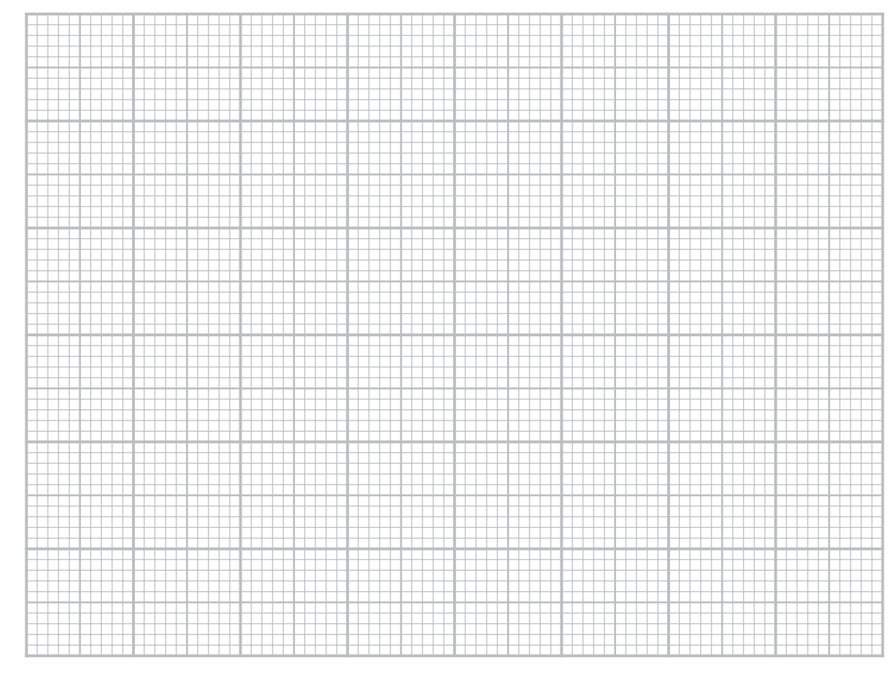

# Exam Questions — Ionic & Metallic Bonding & Structure
**1. Structure, Bonding & Introduction to Organic Chemistry** · Edexcel International A Level (IAL) Chemistry (YCH11)
> Source: [https://www.savemyexams.com/international-a-level/chemistry/edexcel/17/topic-questions/1-structure-bonding-and-introduction-to-organic-chemistry/1-6-ionic-and-metallic-bonding-and-structure/structured-questions/](https://www.savemyexams.com/international-a-level/chemistry/edexcel/17/topic-questions/1-structure-bonding-and-introduction-to-organic-chemistry/1-6-ionic-and-metallic-bonding-and-structure/structured-questions/) · 18 questions · total 47 marks

## Q1 — medium — 16 marks · structured-questions

### 22((a)) — 6 marks — command: multiple — structured — from paper June 2021 · WCH11/01
This question is about the elements in Period 3 of the Periodic Table, and some of their compounds.

The atomic radii of six of the elements are given.

| **Symbol** | Na | Mg | Al | Si | P | S | Cl | Ar |
|---|---|---|---|---|---|---|---|---|
| **Atomic** **number** | 11 | 12 | 13 | 14 | 15 | 16 | 17 | 18 |
| **Atomic radius** **/ nm** | 0.191 | 0.160 | 0.130 |   |   | 0.102 | 0.099 | 0.095 |

i) Plot a graph of atomic radius against atomic number.

**(2)**

ii) Use the graph to estimate the atomic radius of silicon, Si.

**(1)**

iii) Suggest an explanation for the decrease in atomic radius as atomic number increases across a period.

**(3)**

### 22((b)) — 6 marks — command: complete — structured — from paper June 2021 · WCH11/01
The melting temperatures of sodium, sodium chloride and chlorine are given in the table.

Complete the table to show the type of structure, the type of bond or force broken on melting and the particles involved.

| **Substance** | Sodium | Sodium chloride | Chlorine |
|---|---|---|---|
| **Melting temperature / °C** | 98 | 801 | −101 |
| **Type of structure** | giant |   | simple molecular |
| **Type of bond or force broken on melting** |   |   |   |
| **Particles involved** |   |   | chlorine molecules |

### 22((c)) — 4 marks — command: multiple — structured — from paper June 2021 · WCH11/01
Solid phosphorus(V) chloride contains PCl4+ ions.

i) Draw a dot-and-cross diagram of a PCl4+ ion.

Show only outer shell electrons.

**(1)**

ii) Predict the shape of a PCl4+ ion.

Justify your answer.

**(3)**

Shape

............................................................................................

Justification

## Q2 — medium — 14 marks · structured-questions

### 1() — 2 marks — command: draw — structured
This question is about bonding and structure in a range of chlorides.

Draw a dot-and-cross diagram for magnesium chloride, MgCl2. Show outer shell electrons only.

### 2() — 4 marks — command: explain — structured
Phosphorus pentachloride, PCl5, has the shape shown.

Explain the shape of a PCl5 molecule and state its bond angles.

[4]

### 3() — 5 marks — command: multiple — structured
i) Explain why magnesium chloride, MgCl2, has more covalent character than barium chloride, BaCl2.

[2]

ii) Aluminium chloride can exist as the dimer Al2Cl6 in the gas phase. The dimer contains two dative (coordinate) covalent bonds.

State what is meant by a dative covalent bond, and draw the structure of Al2Cl6, clearly showing all bonds (including the dative covalent bonds).

[3]

### 4() — 3 marks — command: explain — structured
Magnesium chloride conducts electricity in some physical states but not others.

Explain why MgCl2 does not conduct electricity when solid, but does conduct electricity when molten or in aqueous solution.

[3]

## Q3 — easy — 2 marks · multiple-choice-questions

### 1() — 1 mark — multiple_choice — from paper Jan 2022 · WCH11/01
Element **X** is in Group 2 of the Periodic Table and element **Y** is in Group 7. **X** and **Y **are not the symbols of the elements.

What is the formula of the compound formed from **X** and **Y**?
- **A.** **XY**
- **B.** ** X**2**Y**
- **C.** **XY**2
- **D.** ** X**2**Y**2

### 1((b)) — 1 mark — multiple_choice — from paper Jan 2022 · WCH11/01
Under what conditions does the compound formed from **X** and **Y** conduct electricity?
- **A.** in the solid state and in the liquid state and in aqueous solution
- **B.** in the solid state and in aqueous solution only
- **C.** in the solid state and in the liquid state only
- **D.** in the liquid state and in aqueous solution only

## Q4 — easy — 1 marks · multiple-choice-questions

### 2() — 1 mark — multiple_choice — from paper Jan 2022 · WCH11/01
Which of these compounds would you expect to have the highest melting temperature?
- **A.** NaCl
- **B.** NaF
- **C.** KCl
- **D.** KF

## Q5 — easy — 1 marks · multiple-choice-questions

### 3() — 1 mark — multiple_choice — from paper Jan 2022 · WCH11/01
A drop of an aqueous solution of green copper(II) chromate(VI) is placed in the centre of a strip of damp filter paper.

The ends of the filter paper are connected to a DC power supply.

What is observed after a few minutes?
- **A.** a green colour has moved to the negative end
- **B.** a green colour has moved to the positive end
- **C.** a yellow colour has moved to the positive end and a blue colour to the negative end
- **D.** a blue colour has moved to the positive end and a yellow colour to the negative end

## Q6 — easy — 1 marks · multiple-choice-questions

### 4() — 1 mark — multiple_choice — from paper Jan 2022 · WCH11/01
Which of these isoelectronic ions has the smallest ionic radius?
- **A.** N3−
- **B.** F−
- **C.** Na+
- **D.** Al3+

## Q7 — easy — 1 marks · multiple-choice-questions

### 8() — 1 mark — multiple_choice — from paper Jan 2021 · WCH11/01
Which of these has the **greatest** electrical conductivity?
- **A.** SF6(g)
- **B.** H2O(l)
- **C.** Hg(l)
- **D.** Na2O(s)

## Q8 — easy — 1 marks · multiple-choice-questions

### 11() — 1 mark — multiple_choice — from paper Jan 2021 · WCH11/01
Which of these does **not **have a structure formed by a giant lattice of carbon atoms?
- **A.** C60 fullerene
- **B.** diamond
- **C.** graphene
- **D.** graphite

## Q9 — medium — 1 marks · multiple-choice-questions

### 5() — 1 mark — multiple_choice — from paper Jan 2022 · WCH11/01
Which properties of a** cation** result in the greatest polarising power?
- **A.** large radius and large charge
- **B.** large radius and small charge
- **C.** small radius and small charge
- **D.** small radius and large charge

## Q10 — medium — 1 marks · multiple-choice-questions

### 5() — 1 mark — multiple_choice — from paper Oct 2021 · WCH11/01
In which series are the ions in order of **decreasing** ionic radius?
- **A.** Al3+  > Mg2+  > Na+
- **B.** Li+  > Na+  > K+
- **C.** N3−  > O2−  > F−
- **D.** O2−  > S2−  > Se2−

## Q11 — medium — 1 marks · multiple-choice-questions

### 6() — 1 mark — multiple_choice — from paper Jan 2022 · WCH11/01
Which properties of an **anion** result in it being most easily polarised?
- **A.** large radius and large charge
- **B.** large radius and small charge
- **C.** small radius and small charge
- **D.** small radius and large charge

## Q12 — medium — 1 marks · multiple-choice-questions

### 8() — 1 mark — multiple_choice — from paper June 2021 · WCH11/01
Which of these isoelectronic ions has the **largest** radius?
- **A.** Na+
- **B.** Mg2+
- **C.** O2−
- **D.** F−   

## Q13 — medium — 1 marks · multiple-choice-questions

### 9() — 1 mark — multiple_choice — from paper June 2021 · WCH11/01
Which ion is the most polarisable?
- **A.** Mg2+
- **B.** Ca2+
- **C.** Cl−
- **D.** I−

## Q14 — medium — 1 marks · multiple-choice-questions

### 9() — 1 mark — multiple_choice — from paper Jan 2021 · WCH11/01
Which of these ions has the **greatest **ionic radius?
- **A.** N3-
- **B.** F-
- **C.** Na+
- **D.** Al3+

## Q15 — medium — 1 marks · multiple-choice-questions

### 10() — 1 mark — multiple_choice — from paper Jan 2021 · WCH11/01
Which of these ions has the **greatest** polarising power?
- **A.** S2-
- **B.** Cl-
- **C.** Na+
- **D.** Al3+

## Q16 — medium — 1 marks · multiple-choice-questions

### 1() — 1 mark — multiple_choice
What is the formula of magnesium nitride?
- **A.** MgN
- **B.** MgN2
- **C.** Mg2N3
- **D.** Mg3N2

## Q17 — medium — 1 marks · multiple-choice-questions

### 1() — 1 mark — multiple_choice
Which property of metals is best explained by the mobility of delocalised electrons?
- **A.** Electrical conductivity
- **B.** High density
- **C.** High melting temperature
- **D.** Malleability

## Q18 — hard — 1 marks · multiple-choice-questions

### 1() — 1 mark — multiple_choice
Which of these chlorides has the most covalent character?
- **A.** AlCl3
- **B.** KCl
- **C.** MgCl2
- **D.** NaCl
