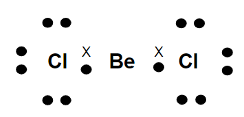
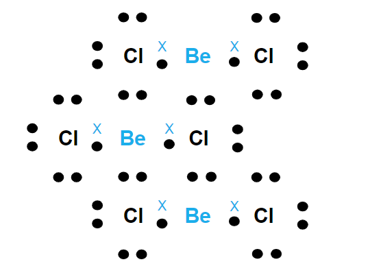
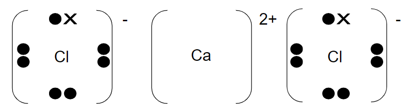
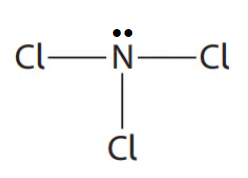
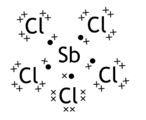
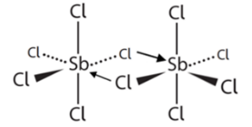
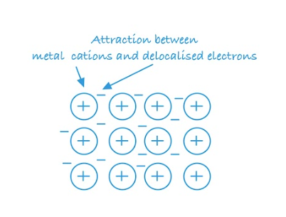
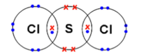
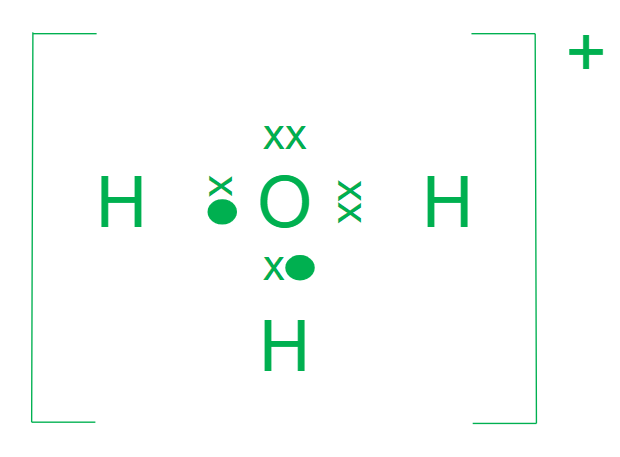

# Mark Schemes — Covalent Bonding & Structure
**1. Structure, Bonding & Introduction to Organic Chemistry** · Edexcel International A Level (IAL) Chemistry (YCH11)

## Q1 — medium — 15 marks · structured-questions

### 12((a)) — 2 marks
The electronic configurations of the atoms of beryllium and calcium using the s, p, d notation are:

- Be: (1s2) 2s2; **[1 mark]**
- Ca: (1s2) 2s22p63s23p64s2; **[1 mark]**

**[Total: 2 marks]**

- *Use the Periodic Table to find the atomic number of each atom, which will give you the number of electrons*

  - *Be has 4 electrons*
  - *Ca has 20 electrons*
- *Fill up the electrons in subshells in order until you have the required number of electrons*
- *Remember**: The 4s subshell fills before the 3d subshell*
- *If you wrote 1s**2** again, this would be ignored*
- *You could also write p**x**2**p**y**2**p**z**2** for p**6*

### 12((b)) — 2 marks
A dot-and-cross diagram to show the bonding in a molecule of beryllium chloride, BeCl2 is:

- 2 single covalent bonds; **[1 mark]**
- 6 non-bonding electrons shown on chlorine; **[1 mark]**

**[Total: 2 marks]**

- *The electrons do not need to be shown in pairs*
- *You could use all dots or all crosses*
- *A common mistake is to put Ca instead of Cl as the previous question was about Be and Ca - you would score a maximum of 1 mark if you did this*
- *You would not gain the second mark if you showed the incorrect total number of electrons*
- *BeCl**2** is one of the compounds that you need to know the dot and cross diagram of and be able to explain its shape and bond angles*

### 12((c)) — 2 marks
Each type of bond is formed by:

- A line / covalent bond is when electron(s) come from both / each atom(s); **[1 mark]**
- An arrow / dative covalent / co-ordinate bond which is (a lone pair of) electrons donated from chlorine/ (only) one atom; **[1 mark]**

**[Total: 2 marks]**

- *Beryllium chloride is not a typical Group 2 compound*
- *In BeCl**2**, beryllium has two empty orbitals making it electron-deficient*
- *In solid form, chlorine atoms donate a lone pair of electrons to beryllium, forming a dative covalent bond*
- *Each beryllium atom will form 2 dative covalent bonds with 2 chlorine atoms, forming a polymeric structure*
- *The diagram shows part of this structure:*

### 12((d)) — 4 marks
Predicting the two bond angles, and a justification:

- The bond angle in BeCl2 (g) / linear is 180°; **[1 mark]**
- The bond angle in BeCl2 (s) / polymeric is 109.5°; **[1 mark]**
- Electron pairs / bonds repel each other to minimise repulsion; **[1 mark]**
- 4 electron pairs / bonds in solid 
**OR** 
2 bonding pairs / 2 bonds (no lone pairs) in gas; **[1 mark]**

**[Total: 4 marks]**

- *You should know the bond angle for BeCl**2** (g)*
- *According to electron-pair repulsion theory, as a solid, each atom has 4 bonded pairs of electrons which will repel equally which should give the bond angle 109.5°*
- *For the bond angle in BeCl**2** (s), you would be awarded a mark for any bond angle between 95° and 110° - the actual value is 98°!*
- *Make sure that you refer to repulsion being between bonded pairs of electrons, not between atoms, elements or between lone pairs*

### 12((e)) — 2 marks
A dot-and-cross diagram for calcium chloride:

- Correct charges shown and two chloride ions; **[1 mark]**
- Electronic configuration of all ions; **[1 mark]**

**[Total: 2 marks]**

- *This should be a straightforward dot-and-cross diagram to draw*
- *You can also show calcium with 8 electrons and you can show the electron shells*
- *Make sure you draw the dot-and-cross diagram for an ionic compound, including square brackets and charges*

### 12((f)) — 3 marks
Gaseous beryllium chloride and solid calcium chloride have different types of bonding because:

- Beryllium is smaller / has fewer electron shells / has a higher charge density (than calcium)
**OR**
Beryllium is more electronegative (than calcium); **[1 mark]**
- Beryllium ion / Be2+ is more polarising (than calcium ion / Ca2+)
**OR**
Calcium loses (outer) electrons more easily (than beryllium)
**OR**
The difference in electronegativity between calcium and chlorine is greater (than between beryllium and chlorine); **[1 mark]**
- The beryllium-chlorine bond has a higher degree of covalency (than the calcium-chlorine bond); **[1 mark]**

**[Total: 3 marks]**

- *Whilst it is ions that cause polarisation, you would not be penalised for saying that beryllium is more polarising than calcium as opposed to beryllium ions / calcium ions*
- *For the final mark, you could state that the bonding in beryllium is (more) covalent or the bonding in calcium chloride is (more) ionic*
- *The final mark is only awarded if one of the other two marks is scored*
- *As a rule of thumb, if the difference in electronegativity between two atoms is greater than 2 on the Pauling scale, an ionic bond will form and less than two will lead to a covalent bond forming*

## Q2 — medium — 10 marks · structured-questions

### 19((a)) — 3 marks
The completed table for this molecule is:

| **Number of bond pairs around N atom** | **Final answer:** **3** |
|---|---|
| **Number of lone pairs around N atom** | **Final answer:** **1** |
| **Cl-N-Cl bond angle** | **Final answer:** **107(°)** |
| **Name of shape of molecule** | **Final answer:** **(Trigonal) pyramidal** |

- Correct number of bond pairs **AND** lone pairs; **[1 mark]**
- Correct Cl–N–Cl bond angle; **[1 mark]**
- Correct name of shape; **[1 mark]**

**[Total: 3 marks]**

- *Nitrogen has 5 electrons, 3 are involved in bonding to chlorine leaving one lone pair of electrons*

- *The lone pair of electrons have a more concentrated electron charge cloud than the bonding pairs of electrons, pushing the bonded pairs of electrons closer together*
- *This reduces the bond angle from 109.5° to 107°, although any value between the range of 106° - 108° is accepted*
- *The resulting shape is trigonal planar:*

- *You would score the mark for stating 'pyramid' but not for bipyramidal*

### 19((b)) — 4 marks
i) PCl5 has a higher melting temperature than SbCl5 because:

- Strong(er) (electrostatic) attraction between ions (in PCl5; **[1 mark]**
- (Than) weak intermolecular forces (in SbCl5); **[1 mark]**

ii) A dot-and-cross diagram to show the bonding in a molecule of SbCl5:

- Central Sb with five bond pairs and no lone pairs; **[1 mark]**
- Five Cl atoms each with one bond pair and three lone pairs; **[1 mark]**

**[Total: 4 marks]**

- *Phosphorous(V) chloride is an ionic compound whereas antimony(V) chloride is a simple molecule*
- *The differences in their bonding / forces of attraction explains the differences in their melting temperatures*
- *This is a standard explanation that you need to be familiar with*
- *You can explain the electrostatic attraction in a number of ways that are creditworthy:*

  - *PCl**5** has strong ionic bonds or a strong ionic lattice*
  - *There is a strong attraction between positive and negative charges / cations and anions / PCl**4**+** and PCl**6**–*
- *You can refer to the intermolecular forces as London, van der Waals, dispersion, temporary-induced  dipole or instantaneous-induced dipole forces*
- *Stating that ionic bonding is stronger than intermolecular forces will score 2 marks*
- *Antimony, Sb, is in Group 5 so will have 5 electrons in its outer shell*

  - *Each of these electrons pairs with an electron from a chlorine atom forming a covalent bond*
- *You would gain the marks for any combination of dots and crosses*
- *You can draw circles to indicate the outer shells but you do not need to draw the inner shells*

### 19((c)) — 2 marks
i) The term dative covalent bond means:

- Shared electrons in which both electrons come from the same atom 
**OR**
A lone pair / full orbital from one atom overlaps with an empty orbital of another; **[1 mark]**

ii) The completed diagram to show the dative covalent bonds in Sb2Cl10 is:

- Two correct dative covalent bonds shown as arrows; **[1 mark]**

**[Total: 2 marks]**

- *In part (i), for credit to be awarded, it must be clear that:*

  - *a pair of / two electrons are involved*
  - *these electrons are shared / bonding*
  - *these electrons come from the same atom*
- *Other, weaker, responses are:*

  - *Both electrons in the bond come from the same element*
  - *One element donates / gives / shares both electrons to the bond*
  - *One atom shares both electrons*

### 19((d)) — 1 marks
**One** possible reason why nitrogen is the only Group 5 element that does **not** form a pentachloride is:

Any **one** from:

- (Nitrogen has) no 2d orbitals; **[1 mark]**
- (Nitrogen) cannot expand its octet / cannot have more than 8 electrons in its outer shell; **[1 mark]**
- (Nitrogen is) too small (to bond to 5 atoms); **[1 mark]**
- Repulsion between electron pairs would be too great; **[1 mark]**

**[Total: 1 mark]**

- *Expansion of the octet can occur if the outer shell has enough orbitals to accommodate more electrons*
- *This can happen in elements that have access to d orbitals*
- *Nitrogen has the electronic configuration of 1s**2**2s**2**2p**3** so can only accommodate 3 more electrons to fill the n = 2 shell; there is no 2d subshell available so no more electrons can be accomodated*
- *The elements below nitrogen in Group 5 have access to a d orbital which will accommodate extra electrons so can form pentachloride compounds*

## Q3 — medium — 13 marks · structured-questions

### 22((a)) — 4 marks
i) Metallic bonding is:

- The attraction between positive ions / cations and delocalised electrons; **[1 mark]**

ii) The metallic bonding in magnesium is much stronger than that in sodium because:

- Mg has more delocalised electrons; **[1 mark]**
- Mg2+ is smaller (than Na+); **[1 mark]**
- Mg2+ has a higher charge (than Na+); **[1 mark]**
- Greater attraction between the delocalised electrons and the Mg2+ ions / Mg2+ nuclei; **[1 mark]**

**[Total: 5 marks]**

- *You can achieve marking point 1 with a labelled diagram providing the word attraction appears on it *

- *Electrostatic force can be used as an alternative to attraction*
- *In your explanation in part ii) you can refer to Mg**2+** as 'Mg ions'  throughout however be careful you don't make the mistake of referring to them as atoms *

### 22((b)) — 4 marks
i) The attraction between the atoms in a covalent bond is:

- (The electrostatic attraction between) the shared (pair of ) electrons and the (two) nuclei (of the bonded atoms); **[1 mark]**

ii) The melting temperature of silicon is much higher than that of phosphorus, because:

- Phosphorus (P) simple molecular; **[1 mark]**
- Silicon (Si) giant (covalent / molecular) structure; **[1 mark]**
- When phosphorus melts weak London forces are broken **AND**
when silicon melts strong covalent bonds are broken; **[1 mark**

**[Total: 4 marks]**

- *Going across Period 3:*

  - *Na-Al are giant metallic structures*
  - *Si is a giant covalent structure*
  - *P-Ar are simple molecular structures*
- *Make sure you can describe the differences in bonding, structure and properties for each substance across Period 3*
- *Referring to the London forces as van der Waals forces will be accepted in marking point 3 but Edexcel prefer them described as London forces *

### 22((c)) — 5 marks
i) The dot and cross diagram is:

- Two shared pairs of electrons between S and Cl; **[1 mark]**
- Rest of diagram correct; **[1 mark]**

ii) A value for the Cl–S–Cl bond angle is:

- 104.5°; **[1 mark]**
- (Because) there are four pairs of electrons / 2 bonding pairs and 2 lone pairs which occupy a position of minimum repulsion; **[1 mark]**
- 2 lone pairs repel more than bonding pairs (so the angle is reduced from 109.5°); **[1 mark]**

**[Total: 2 marks]**

- *You can use either all dots or all crosses as long as the number is correct *
- *The non-bonding pairs of electrons can appear anywhere on the S atom *
- *You are not required to draw inner electron shells for these diagrams *
- *Count around each atom once you have drawn it to ensure they have a full outer shell*
- *SCl**2** will exhibit a non-linear shape as the lone pairs around the S atom repel each other more than the bonding pairs *

## Q4 — easy — 1 marks · multiple-choice-questions

### 10() — 1 marks
**Correct answer: A** — diamond

**Final answer:** **The correct answer is ****A**** because:**

- Diamond is made from only carbon atoms and has a giant covalent / macromolecular lattice

**B** is incorrect as ice consists of H2O molecules

**C** is incorrect as poly(ethene) consists of long chain molecules

**D** is incorrect as sodium chloride consists of a giant lattice of ions

## Q5 — easy — 1 marks · multiple-choice-questions

### 12() — 1 marks
**Correct answer: B** — C2F4

**Final answer:** **The correct answer is ****B**** because:**

- The main planar shapes are:

  - Linear
  - Square planar
  - Trigonal planar
- Linear is ruled out as this shape typically requires 3 atoms e.g. CO2
- Square planar is ruled out as this shape typically applies to cyclic ring structures and transition metal complexes (A level)
- Trigonal planar typically applies to:

  - Electron-deficient compounds with 4 atoms, e.g. BF3
  - Certain aldehydes as the carbonyl / C=O bond is planar resulting in smaller aldehydes such as methanal having a trigonal planar shape
  - Smaller alkenes as the carbon-carbon double / C=C bond is planar resulting in both carbons having a trigonal planar shape
  
    - C2F4 has the planar carbon-carbon double / C=C bond with single atoms of fluorine bonded to each carbon resulting in a molecule that is planar overall

**A** is incorrect as CF4 is tetrahedral

**C** is incorrect as PF5 is trigonal bipyramidal

**D** is incorrect as SF6 is octahedral

## Q6 — medium — 1 marks · multiple-choice-questions

### 4() — 1 marks
**Correct answer: C** — trigonal pyramidal 107°

**Final answer:** **The correct answer is ****C**** because:**

- The H3O+ ion has three bonded pairs of electrons and 1 lone pair of electrons:

- This gives rise to a trigonal pyramid shape with H-O-H bond angle of 107°
- The lone pair-bond pair repulsion is greater than bond pair-bond pair repulsion pushing the bonding pairs of electrons closer together

**A, B **and **D** are incorrect as  the hydroxonium ion has 3 bond pairs and one lone pair of electrons

## Q7 — medium — 1 marks · multiple-choice-questions

### 8() — 1 marks
**Correct answer: A** — CO2

**Final answer:** **The correct answer is ****A**** because:**

- Carbon dioxide contains polar bonds because the oxygen is more electronegative than the carbon so will have a greater pull on the shared pairs of electrons
- The molecule, however, is linear and therefore symmetrical which means that the dipoles can cancel each other out making it non polar overall

**B**, **C **and **D** are incorrect as these molecules are all polar

## Q8 — medium — 1 marks · multiple-choice-questions

### 9() — 1 marks
**Correct answer: B** — 

**Final answer:** **The correct answer is ****B**** because:**

- There is a difference in electronegativity between S and F
- F is more electronegative so will have a partial charge of δ- as the electrons in the S-F bond are attracted towards the fluorine and sulfur, being less electronegative, has a partial charge of δ+
- This means that the S-F bond is polar
- The SF6 molecule is octahedral in shape which is symmetrical
- The individual dipole moments cancel each other out and the molecule is non-polar

**A** is incorrect as  the SF6 molecule is non-polar

**C** is incorrect as the S-F bond is polar and the SF6 molecule is non-polar

**D** is incorrect as  the S-F bond is polar

## Q9 — medium — 1 marks · multiple-choice-questions

### 11() — 1 marks
**Correct answer: A** — H2O

**Final answer:** **The correct answer is ****A**** because:**

- The most polar bond will be formed by the atoms that have the greatest difference in electronegativity
- From the Pauling scale, the electronegativity value of the relevant atoms are:

  - H = 2.1
  - O = 3.5
  - S = 2.5
  - N = 3.0
  - P = 2.1
- Since the bond in H2O has a difference of 1.4, it is the most polar bond

**B** is incorrect as  the bonds in H2S have a difference of 0.4

**C** is incorrect as  the bonds in NH3 have a difference of 0.9

**D** is incorrect as  the bonds in PH3 have no difference in electronegativity

## Q10 — medium — 1 marks · multiple-choice-questions

### 12() — 1 marks
**Correct answer: A** — HF

**Final answer:** **The correct answer is ****A**** because:**

- Polar bonds occur due to a difference in electronegativity between the two atoms
- Molecules that have polar bonds but are symmetrical will be non-polar molecules as the dipole moments will cancel each other out
- HF and OF2 have a difference in electronegativity between the atoms and are non-symmetrical, therefore they will both be polar molecules
- The difference in electronegativity between hydrogen and fluorine is greater than the difference between oxygen and fluorine, therefore, HF is the most polar molecule

**B** is incorrect as  there is a relatively small difference in electronegativity between oxygen and fluorine

**C** is incorrect as  BF3 is a non-polar molecule

**D** is incorrect as  CF4 is a non-polar molecule

## Q11 — medium — 1 marks · multiple-choice-questions

### 1() — 1 marks
**Correct answer: C** — 

**Final answer:** **The correct answer is C**

- The central N atom in NH3 has 3 bonding pairs and 1 lone pair (4 electron pairs total)
- Four electron pairs adopt a tetrahedral electron-pair geometry
- However, the molecular shape is described by the positions of the atoms only, so NH3 is pyramidal (trigonal pyramidal)
- The lone pair–bonding pair repulsion is greater than bonding pair–bonding pair repulsion, so the H–N–H angle is compressed from 109.5° to 107°

**A** is incorrect as trigonal planar at 120° applies to species with 3 bonding pairs and NO lone pairs (e.g. BF3)

**B** is incorrect as has the correct shape but uses the unmodified tetrahedral angle, ignoring lone-pair repulsion

**D** is incorrect as gives the electron-pair geometry, not the molecular shape

> **[exam-tip]**
> For each lone pair on the central atom, the bond angle is reduced by approximately 2.5° from the ideal. Tetrahedral 109.5° → 107° (1 LP, e.g. NH3) → 104.5° (2 LP, e.g. H2O).
