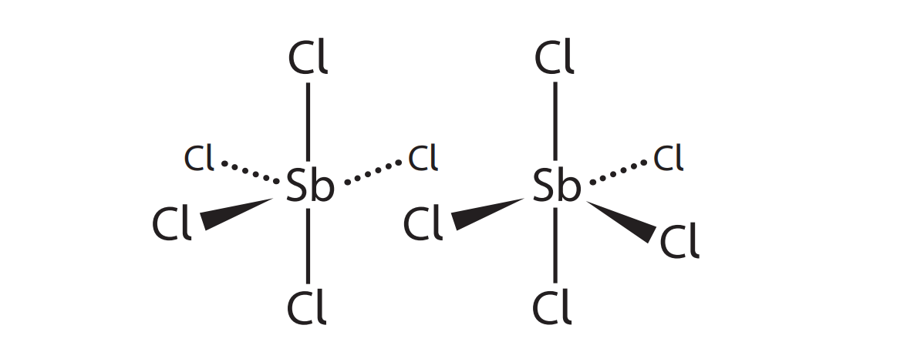
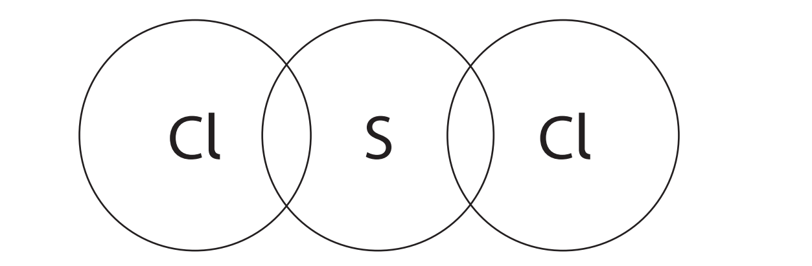

# Exam Questions — Covalent Bonding & Structure
**1. Structure, Bonding & Introduction to Organic Chemistry** · Edexcel International A Level (IAL) Chemistry (YCH11)
> Source: [https://www.savemyexams.com/international-a-level/chemistry/edexcel/17/topic-questions/1-structure-bonding-and-introduction-to-organic-chemistry/1-7-covalent-bonding-and-structure/structured-questions/](https://www.savemyexams.com/international-a-level/chemistry/edexcel/17/topic-questions/1-structure-bonding-and-introduction-to-organic-chemistry/1-7-covalent-bonding-and-structure/structured-questions/) · 11 questions · total 46 marks

## Q1 — medium — 15 marks · structured-questions

### 12((a)) — 2 marks — command: complete — structured — from paper Oct 2021 · WCH11/01
This question is about the chlorides of beryllium and calcium.

Complete the electronic configurations of the atoms of beryllium and calcium using the s, p, d notation.

Be 1s2

Ca 1s2

### 12((b)) — 2 marks — command: draw — structured — from paper Oct 2021 · WCH11/01
In the gaseous state, beryllium chloride is molecular.

Draw a dot-and-cross diagram to show the bonding in a molecule of beryllium chloride, BeCl2.

### 12((c)) — 2 marks — command: describe — structured — from paper Oct 2021 · WCH11/01
In the solid state, beryllium chloride forms a polymeric structure.

The diagram shows part of this structure.

The diagram uses lines and arrows to represent the two different types of covalent bond.

Describe how each type of bond is formed.

### 12((d)) — 4 marks — command: justify — structured — from paper Oct 2021 · WCH11/01
The Cl—Be—Cl bond angle is different in the two forms of beryllium chloride.

Predict the two bond angles, justifying your answers by referring to electron-pair repulsion theory.

### 12((e)) — 2 marks — command: show — structured — from paper Oct 2021 · WCH11/01
Anhydrous calcium chloride is a crystalline, ionic solid which melts at 772°C.

Draw a dot-and-cross diagram for calcium chloride.

Show the outer electrons only.

### 12((f)) — 3 marks — command: explain — structured — from paper Oct 2021 · WCH11/01
Explain why gaseous beryllium chloride and solid calcium chloride have different types of bonding.

## Q2 — medium — 10 marks · structured-questions

### 19((a)) — 3 marks — command: complete — structured — from paper Jan 2021 · WCH11/01
This question is about the structure and bonding of Group 5 chlorides.

Nitrogen trichloride, NCl3, has a molecular structure.

The displayed formula of a molecule of NCl3 is shown.

Complete the table for this molecule.

| **Number of bond pairs around N atom** |   |
|---|---|
| **Number of lone pairs around N atom** |   |
| **Cl-N-Cl bond angle** |   |
| **Name of shape of molecule** |   |

### 19((b)) — 4 marks — command: multiple — structured — from paper Jan 2021 · WCH11/01
Under standard conditions, phosphorus(V) chloride (PCl5) is a solid made up of PC$l_{4}^{+}$ cations and PC$l_{6}^{-}$ anions.

Antimony(V) chloride (SbCl5) is a liquid made up of SbCl5 molecules.

i) Explain why PCl5 has a higher melting temperature than SbCl5.

**(2)**

ii) Draw a dot-and-cross diagram to show the bonding in a molecule of SbCl5. 
Use dots (•) to represent the Sb electrons, and crosses (**x**) to represent the Cl electrons. 
Show outer electrons only.

**(2)**

### 19((c)) — 2 marks — command: multiple — structured — from paper Jan 2021 · WCH11/01
At low temperatures, SbCl5 converts to Sb2Cl10 which contains dative covalent bonds.

i) State what is meant by the term dative covalent bond.

**(1)**

ii) Complete the diagram to show the dative covalent bonds in Sb2Cl10 .

**(1)**

### 19((d)) — 1 mark — command: give — structured — from paper Jan 2021 · WCH11/01
Arsenic also forms a pentachloride with the formula AsCl5.

Give **one** possible reason why nitrogen is the only Group 5 element that does **not** form a pentachloride.

## Q3 — medium — 13 marks · structured-questions

### 22((a)) — 4 marks — command: multiple — structured — from paper Jan 2022 · WCH11/01
This question is about the bonding in the elements of Period 3 in the Periodic Table. 
The melting temperatures of the Period 3 elements are shown in the table.

| **Element** | **Na** | **Mg** | **Al** | **Si** | **P** | **S** | **Cl** | **Ar** |
|---|---|---|---|---|---|---|---|---|
| **Melting** **temperature / °C** | 98 | 650 | 660 | 1423 | 44 | 120 | −101 | −189 |

Sodium, magnesium and aluminium are metals.

i) State what is meant by metallic bonding.

**(1)**

ii) Melting temperature depends on the strength of metallic bonding.

Explain why the metallic bonding in magnesium is much stronger than that in sodium.

**(3)**

### 22((b)) — 4 marks — command: multiple — structured — from paper Jan 2022 · WCH11/01
i) In the elements silicon, phosphorus, sulfur and chlorine, the atoms are joined by covalent bonds.

Describe the attraction between the atoms in a covalent bond.

**(1)**

ii) Explain why the melting temperature of silicon is much higher than that of phosphorus, by referring to their structures.

**(3)**

### 22((c)) — 5 marks — command: multiple — structured — from paper Jan 2022 · WCH11/01
Sulfur reacts with chlorine to form sulfur dichloride, SCl2.

i) Complete the dot-and-cross diagram of a molecule of sulfur dichloride. 
Use dots (•) for the chlorine electrons and crosses (×) for the sulfur electrons. 
 Show the outer shell electrons only.

**(2)**

ii) Suggest a value for the Cl–S–Cl bond angle. Justify your answer.

**(3)**

## Q4 — easy — 1 marks · multiple-choice-questions

### 10() — 1 mark — multiple_choice — from paper June 2021 · WCH11/01
Which substance has a giant lattice of atoms?
- **A.** diamond
- **B.** ice
- **C.** poly(ethene)
- **D.** sodium chloride

## Q5 — easy — 1 marks · multiple-choice-questions

### 12() — 1 mark — multiple_choice — from paper June 2021 · WCH11/01
Which molecule is planar?
- **A.** CF4
- **B.** C2F4
- **C.** PF5
- **D.** SF6

## Q6 — medium — 1 marks · multiple-choice-questions

### 4() — 1 mark — multiple_choice — from paper Jan 2021 · WCH12/01
The hydrogen ion, H+, bonds to a water molecule forming an H3O+ ion.

For H3O+, what shape and H-O-H bond angle are predicted by the electron-pair repulsion theory?
- **A.** trigonal planar 120°
- **B.** trigonal planar 117.5°
- **C.** trigonal pyramidal 107°
- **D.** trigonal pyramidal 104.5°

## Q7 — medium — 1 marks · multiple-choice-questions

### 8() — 1 mark — multiple_choice — from paper Jan 2022 · WCH11/01
Which of these molecules is **not** polar?
- **A.** CO2
- **B.** HCl
- **C.** H2O
- **D.** NH3

## Q8 — medium — 1 marks · multiple-choice-questions

### 9() — 1 mark — multiple_choice — from paper Oct 2021 · WCH11/01
Which row gives the correct polarities of the S—F bond and the SF6 molecule?

**(1)**

|   | ** ** | **Polarity of S—F bond** | **Polarity of SF****6**** molecule** |
|---|---|---|---|
| ☐ | **A** | polar | polar |
| ☐ | **B** | polar | non-polar |
| ☐ | **C** | non-polar | polar |
| ☐ | **D** | non-polar | non-polar |
- **A.** 
- **B.** 
- **C.** 
- **D.** 

## Q9 — medium — 1 marks · multiple-choice-questions

### 11() — 1 mark — multiple_choice — from paper June 2021 · WCH11/01
Which compound has bonds that are the most polar?
- **A.** H2O
- **B.** H2S
- **C.** NH3
- **D.** PH3

## Q10 — medium — 1 marks · multiple-choice-questions

### 12() — 1 mark — multiple_choice — from paper Jan 2021 · WCH11/01
Which of these molecules is the **most** polar?
- **A.** HF
- **B.** OF2
- **C.** BF3
- **D.** CF4

## Q11 — medium — 1 marks · multiple-choice-questions

### 1() — 1 mark — multiple_choice
What is the shape and bond angle of an ammonia (NH3) molecule?

| {align=center} | Shape | Bond angle |
|---|---|---|
| **A** | Trigonal planar | 120° |
| **B** | Pyramidal | 109.5° |
| **C** | Pyramidal | 107° |
| **D** | Tetrahedral | 109.5° |
- **A.** 
- **B.** 
- **C.** 
- **D.** 
