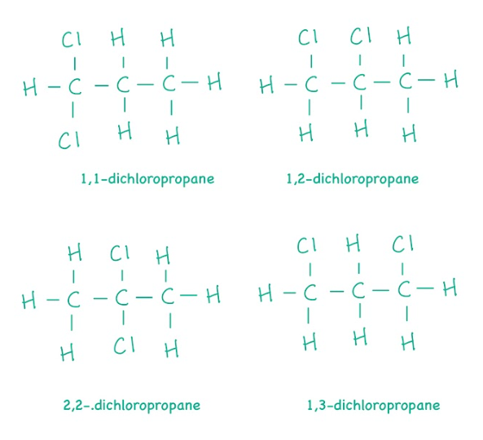
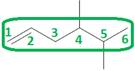
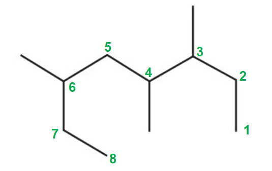

# Mark Schemes — Introductory Organic Chemistry
**1. Structure, Bonding & Introduction to Organic Chemistry** · Edexcel International A Level (IAL) Chemistry (YCH11)

## Q1 — easy — 1 marks · multiple-choice-questions

### 7() — 1 marks
**Correct answer: C** — C16H14O3

**Final answer:** **The correct answer is ****C**** because:**

- You need to count the 'hidden' hydrogens on the benzene rings as well as on the carbon chain and branches
- Carbons on the benzene ring without a side group have a hydrogen attached

**A** is incorrect as there are 16 carbon atoms in ketoprofen

**B** is incorrect  as  this answer has one hydrogen too few

**D **is incorrect as  this answer assumes there is 1 hydrogen on each carbon in the benzene rings

## Q2 — easy — 1 marks · multiple-choice-questions

### 13() — 1 marks
**Correct answer: B** — 

**Final answer:** **The correct answer is ****B**** because:**

- The name 2-chloro-4,4-dimethylhexane tells you that the longest carbon chain has 6 carbon atoms, which is a straight chain
- It has a chlorine atom on carbon 2 and 2 methyl groups on carbon 4

**A** is incorrect as  it is 2-chloro-5,5-dimethylhexane

**C** is incorrect as  it is 2-chloro-3,3-dimethylhexane

**D** is incorrect as  it is 1-chloro-3,3-dimethylcyclohexane

## Q3 — easy — 1 marks · multiple-choice-questions

### 1() — 1 marks
**Correct answer: C** — Irritant

**Final answer:** **The correct answer is C**

- The exclamation mark pictogram is the GHS symbol for substances that are irritants or skin/eye sensitisers
- It is the lowest tier of acute toxicity / irritation hazard

**A** is incorrect as the corrosive image shows liquid attacking a hand and a surface

**B** is incorrect as the health hazard image shows a person with a starburst on the chest, used for carcinogens, mutagens, and serious long-term health effects

**D** is incorrect as the toxic image is a skull and crossbones

> **[exam-tip]**
> Learn the nine GHS pictograms by sight before the exam.
> 
> Edexcel credits the label **Irritant** for the exclamation mark symbol, vague words like *harmful* or *dangerous* are often not credited.

## Q4 — easy — 1 marks · multiple-choice-questions

### 1() — 1 marks
**Correct answer: D** — CH3CH=CHCH3

**Final answer:** **The correct answer is D**

- Geometric isomerism requires **both** conditions: restricted rotation around a C=C (always true for alkenes due to the π bond) and two different groups on each carbon of the C=C
- In but-2-ene (CH3CH=CHCH3), each double-bond carbon has one H and one CH3 — two different groups on each side, so E and Z isomers exist

**A** is incorrect as both carbons of ethene carry two identical H atoms

**B** is incorrect as the =CH2 carbon of propene has two identical H atoms; geometric isomerism requires two *different* groups on *each* double-bond carbon

**C** is incorrect as the (CH3)2C= carbon of 2-methylpropene has two identical CH3 groups

> **[exam-tip]**
> Always identify the specific carbon that fails the test. If either C=C carbon carries two identical groups (two H atoms, two CH3 groups, etc.), geometric isomerism is impossible, regardless of what the other carbon carries.

## Q5 — easy — 1 marks · multiple-choice-questions

### 1() — 1 marks
**Correct answer: C** — Elimination

**Final answer:** **The correct answer is C**

- In an elimination reaction, a small molecule (here H2O) is removed from a single larger molecule, leaving a C=C double bond behind
- Propan-1-ol loses an H from C2 and –OH from C1 (adjacent carbons), forming propene and water
- This is dehydration of an alcohol, a classic paper 2 elimination example, the exact reverse of electrophilic addition of water to an alkene

**A** is incorrect as addition requires a C=C to gain atoms; here a C=C is formed, not consumed

**B** is incorrect as condensation also loses a small molecule, but between **two separate molecules joining** (e.g. alcohol + carboxylic acid → ester + H2O), here only one reactant

**D** is incorrect as substitution replaces one group with another (e.g. haloalkane + OH– → alcohol + halide); here no atom is added in place of –OH

> **[exam-tip]**
> Look at what happens to the bonds: elimination forms a C=C and removes a small molecule from a single reactant. The dehydration of alcohols and the hydration of alkenes (electrophilic addition) are exact opposites. Make sure you can spot which is which.
> 
> Two common slips to watch out for:
> 
> - Classifying a reaction by type only (e.g. "substitution" or "addition") without naming the mechanism ("nucleophilic substitution", "electrophilic addition"), in structured questions you need both
> - Confusing **homolytic** (free-radical bond fission) with **homologous** (a series of compounds), these sound similar but mean completely different things. The January 2021 examiner report specifically flagged this swap as one of the most common mistakes.

## Q6 — medium — 1 marks · multiple-choice-questions

### 10() — 1 marks
**Correct answer: A** — 

**Final answer:** **The correct answer is ****A ****because:**

- Check the number of carbon atoms in the longest chain, in this case they all have four
- Number the carbon atoms so that the bromine and chlorine are on the second and third carbon atom respectively
- Check to see where there is is a methyl group attached to the same carbon atom as the bromine atom
- **A** fits this criteria
- Some people find it easier to draw the displayed formula from the skeletal formula so that it is more obvious which atoms are attached where

**B** is incorrect as  the bromine and chlorine are on the wrong carbon atoms

**C** is incorrect as  there is an additional methyl group on the third carbon atom

**D** is incorrect as  the chlorine and the bromine are on the same carbon atom

## Q7 — medium — 1 marks · multiple-choice-questions

### 13() — 1 marks
**Correct answer: C** — 4

**Final answer:** **The correct answer is ****C**** because:**

- Structural isomers are compounds that have the same molecular formula but their atoms are arranged differently in space
- The four structural isomers of C3H6Cl2 are:

## Q8 — medium — 1 marks · multiple-choice-questions

### 14() — 1 marks
**Correct answer: C** — 4,5-dimethylhex-1-ene

**Final answer:** **The correct answer is ****C**** because:**

**   **

- The longest carbon chain is 6 carbons

  - The name will be hex- based
- There is a carbon-carbon double / C=C bond on carbon-1

  - The name will include -1-ene
- There are two methyl groups, one on carbon-4 and one on carbon-5

  - The name will include 4,5-dimethyl-
- Combining these pieces gives the overall compound name of 4,5-dimethylhex-1-ene

**A** is incorrect as  the longest chain has 6 carbon atoms

**B** is incorrect as the double bond starts at the first carbon atom

**D** is incorrect as  the longest chain has 6 carbon atoms

## Q9 — medium — 1 marks · multiple-choice-questions

### 14() — 1 marks
**Correct answer: C** — 3,4,6-trimethyloctane

**Final answer:** **The correct answer is ****C**** because:**

- The longest carbon chain has 8 carbon atoms

  - The name will be oct- based
- There are no C=C double bonds

  - The name will include -ane
- There are 3 methyl groups, one on carbon-3, one on carbon-4 and one on carbon-6

  - The name will include 3,4,6-trimethyl-
- Combining these pieces gives the overall compound name of 3,4,6-trimethyloctane

**A** is incorrect as  the longest chain of carbon atoms is not seven

**B** is incorrect as the longest chain of carbon atoms is not seven

**D** is incorrect as  the sum of the locant numbers is not the lowest

## Q10 — medium — 1 marks · multiple-choice-questions

### 1() — 1 marks
**Correct answer: B** — 3-methylbutan-1-ol

**Final answer:** **The correct answer is B**

- The longest carbon chain containing the –OH group has 4 carbons → stem is **butan-**
- Number the chain to give the principal functional group (–OH) the lowest locant: –OH is on C1
- The methyl side group is on C3
- The IUPAC name is therefore **3-methylbutan-1-ol**

**A** is incorrect as the chain has been numbered from the wrong end; the principal functional group (–OH) must get the lowest locant, not the methyl substituent

**C** is incorrect as the –OH group is drawn on C1 of the structure (terminal carbon), not C2

**D** is incorrect as the main chain is 4 carbons (butan-), not 5 (pentan-); the branching CH3 is a substituent and is not part of the main chain

> **[exam-tip]**
> For IUPAC naming of alcohols: (1) find the longest chain containing the –OH, (2) number from the end giving –OH the lowest locant, (3) add locants for any substituents. The principal functional group (–OH, here) takes priority over alkyl substituents for numbering.

## Q11 — medium — 1 marks · multiple-choice-questions

### 1() — 1 marks
**Correct answer: A** — Aldehyde

**Final answer:** **The correct answer is A**

- The structure shows a –C(=O)–H group on the end carbon
- This is the aldehyde functional group, –CHO

**B** is incorrect as a ketone would have C=O between two carbons, not on an end carbon

**C** is incorrect as a carboxylic acid would have –C(=O)–O–H, with an O–H attached

**D** is incorrect as an ester would have –C(=O)–O–C–, with an oxygen linking to another carbon

> **[exam-tip]**
> Aldehydes and ketones both contain C=O, but the key difference is position: aldehydes have the C=O on an **end** carbon (with a hydrogen directly attached), while ketones have the C=O sandwiched between two carbons.

## Q12 — medium — 1 marks · multiple-choice-questions

### 1() — 1 marks
**Correct answer: C** — C6H12

**Final answer:** **The correct answer is C**

- A skeletal hexagon (with no double bonds shown) represents cyclohexane
- Each vertex of the hexagon represents a carbon atom, giving 6 carbons
- Each carbon is bonded to two other carbons, leaving 2 hydrogens per carbon → 12 hydrogens total
- The molecular formula is C6H12

**A** is incorrect as it uses 5 carbons (one vertex missed) — only valid for a pentagon

**B** is incorrect as it corresponds to cyclohexene (one C=C present), not cyclohexane

**D** is incorrect as it corresponds to hexane (open-chain alkane CnH2n+2), not the cyclic structure shown

> **[exam-tip]**
> Remember the general formulae: alkanes CnH2n+2; cycloalkanes and alkenes CnH2n. Always count the vertices carefully.

## Q13 — medium — 1 marks · multiple-choice-questions

### 1() — 1 marks
**Correct answer: B** — 

**Final answer:** **The correct answer is B**

- Three pieces of evidence identify X:
- Effervescence with Na2CO3

  - This means that CO2 is released
  - Therefore, X is a carboxylic acid as alcohols, aldehydes and ketones do not react
- Sharp absorption at 1710 cm-1

  - This is a characteristic peak for a C=O group, found in aldehydes, ketones, carboxylic acids or esters
- Very broad absorption 3300–2500 cm-1

  - This is a characteristic peak of a carboxylic acid O–H as it is much broader and lower than the alcohol O–H at 3750–3200 cm–¹

- All three pieces of evidence point to the carboxylic acid, propanoic acid / CH3CH2COOH.

**A** is incorrect as propanal is an aldehyde. It has a sharp C=O at ~1720 cm–¹ but **no** broad O–H absorption below 3200 cm–¹. It also does not react with Na2CO3.

**C** is incorrect as propan-1-ol is an alcohol. It has a broad O–H at 3750–3200 cm–¹ (alcohol range, not carboxylic acid range) and no C=O peak. It also does not react with Na2CO3.

**D** is incorrect as propanone is a ketone. It has a sharp C=O at ~1715 cm–¹ but no O–H, and it does not react with Na2CO3.

> **[exam-tip]**
> To identify a carboxylic acid on paper 2, combine three diagnostic signals:
> 
> - Reaction with Na2CO3 or NaHCO3
> 
> - Effervescence shows that CO2 is released, which is unique to carboxylic acids.
> - IR: very broad O–H at 3300–2500 cm-1
> 
> - This is much broader and extends lower than the alcohol O–H at 3750–3200 cm–¹.
> - Mixing these two up is a common IR mistake flagged in examiner reports.
> - IR: sharp C=O at ~1710 cm-1
> 
> - This is also present in aldehydes, ketones and esters, so it's not diagnostic on its own.
> 
> When writing the functional group name in structured questions, always write "carboxylic acid" in full. Mark schemes explicitly reject just "acid", you need the full term.
> 
> When quoting an IR peak, always give both the bond **AND **the wavenumber range. Examiner reports flagged candidates who gave only one of the two as a recurring mark-loss. Full-mark phrasing looks like: "O–H in a carboxylic acid at 3300–2500 cm-1".
