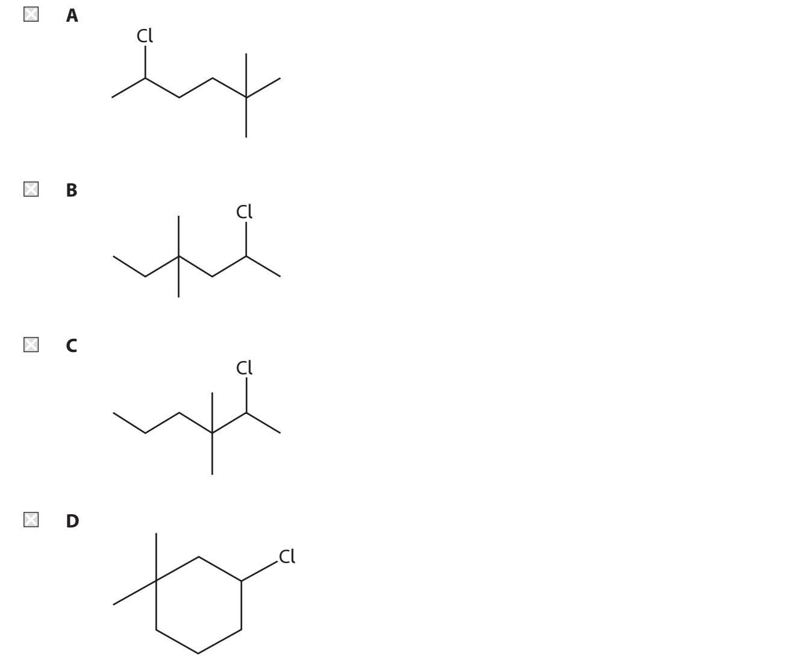
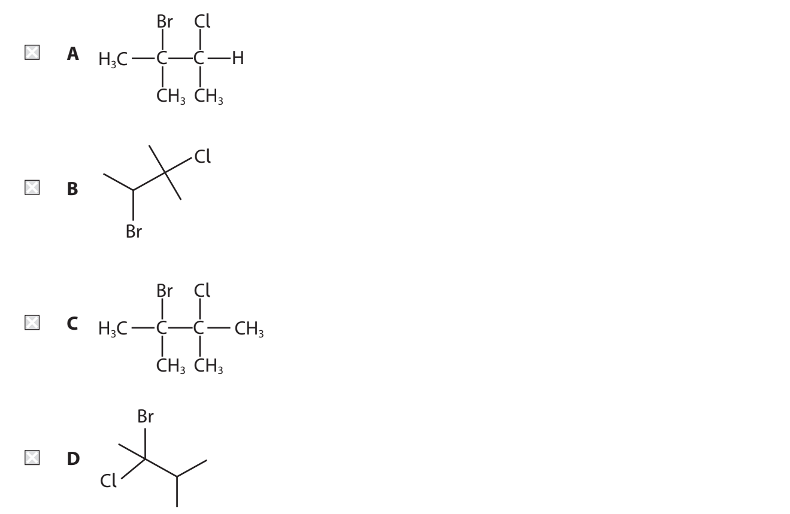
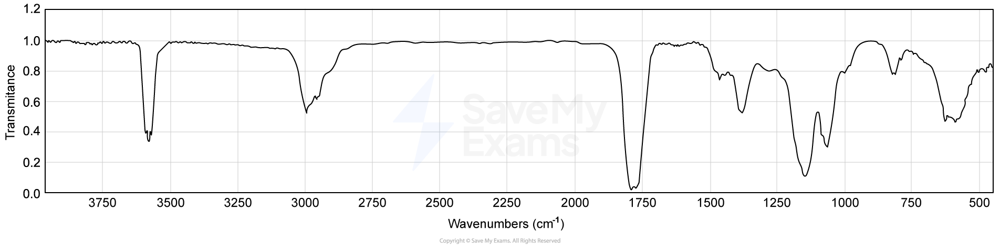

# Exam Questions — Introductory Organic Chemistry
**1. Structure, Bonding & Introduction to Organic Chemistry** · Edexcel International A Level (IAL) Chemistry (YCH11)
> Source: [https://www.savemyexams.com/international-a-level/chemistry/edexcel/17/topic-questions/1-structure-bonding-and-introduction-to-organic-chemistry/1-8-introductory-organic-chemistry/multiple-choice-questions/](https://www.savemyexams.com/international-a-level/chemistry/edexcel/17/topic-questions/1-structure-bonding-and-introduction-to-organic-chemistry/1-8-introductory-organic-chemistry/multiple-choice-questions/) · 13 questions · total 13 marks

## Q1 — easy — 1 marks · multiple-choice-questions

### 7() — 1 mark — multiple_choice — from paper Jan 2022 · WCH14/01
The anti-inflammatory drug ketoprofen has the structure shown.

What is the molecular formula of ketoprofen?
- **A.** C15H12O3
- **B.** C16H13O3
- **C.** C16H14O3
- **D.** C16H17O3

## Q2 — easy — 1 marks · multiple-choice-questions

### 13() — 1 mark — multiple_choice — from paper Jan 2021 · WCH12/01
What is the skeletal formula of 2-chloro-4,4-dimethylhexane?

- **A.** 
- **B.** 
- **C.** 
- **D.** 

## Q3 — easy — 1 marks · multiple-choice-questions

### 1() — 1 mark — multiple_choice
A substance is labelled with the hazard symbol shown.

What is the meaning of this symbol?
- **A.** Corrosive
- **B.** Health hazard
- **C.** Irritant
- **D.** Toxic

## Q4 — easy — 1 marks · multiple-choice-questions

### 1() — 1 mark — multiple_choice
Which of these molecules can show geometric isomerism?
- **A.** CH2=CH2
- **B.** CH2=CHCH3
- **C.** (CH3)2C=CH2
- **D.** CH3CH=CHCH3

## Q5 — easy — 1 marks · multiple-choice-questions

### 1() — 1 mark — multiple_choice
Consider the reaction:

What type of reaction is this?
- **A.** Addition
- **B.** Condensation
- **C.** Elimination
- **D.** Substitution

## Q6 — medium — 1 marks · multiple-choice-questions

### 10() — 1 mark — multiple_choice — from paper June 2021 · WCH12/01
What is the structure of 2-bromo-3-chloro-2-methylbutane?

- **A.** 
- **B.** 
- **C.** 
- **D.** 

## Q7 — medium — 1 marks · multiple-choice-questions

### 13() — 1 mark — multiple_choice — from paper Jan 2022 · WCH11/01
How many structural isomers have the formula C3H6Cl2?
- **A.** 2
- **B.** 3
- **C.** 4
- **D.** 5

## Q8 — medium — 1 marks · multiple-choice-questions

### 14() — 1 mark — multiple_choice — from paper June 2021 · WCH11/01
What is the systematic name of this compound?

- **A.** 1,1,2-trimethylpent-4-ene
- **B.** 2,3-dimethylhex-5-ene
- **C.** 4,5-dimethylhex-1-ene
- **D.** 4,5,5-trimethylpent-1-ene

## Q9 — medium — 1 marks · multiple-choice-questions

### 14() — 1 mark — multiple_choice — from paper Jan 2021 · WCH11/01
What is the IUPAC name of this alkane?

- **A.** 2-ethyl-4,5-dimethylheptane
- **B.** 6-ethyl-3,4-dimethylheptane
- **C.** 3,4,6-trimethyloctane
- **D.** 3,5,6-trimethyloctane

## Q10 — medium — 1 marks · multiple-choice-questions

### 1() — 1 mark — multiple_choice
What is the name of the alcohol shown?

- **A.** 2-methylbutan-4-ol
- **B.** 3-methylbutan-1-ol
- **C.** 3-methylbutan-2-ol
- **D.** 2-methylpentan-1-ol

## Q11 — medium — 1 marks · multiple-choice-questions

### 1() — 1 mark — multiple_choice
The displayed formula of a compound is shown.

Which functional group is present in the compound shown?
- **A.** Aldehyde
- **B.** Ketone
- **C.** Carboxylic acid
- **D.** Ester

## Q12 — medium — 1 marks · multiple-choice-questions

### 1() — 1 mark — multiple_choice
The skeletal formula of a hydrocarbon is shown.

What is its molecular formula?
- **A.** C5H10
- **B.** C6H10
- **C.** C6H12
- **D.** C6H14

## Q13 — medium — 1 marks · multiple-choice-questions

### 1() — 1 mark — multiple_choice
An organic compound **X** reacts with aqueous sodium carbonate to produce effervescence. The infrared spectrum of **X** is shown.

Which is compound **X**?
- **A.** 
- **B.** 
- **C.** 
- **D.** 
