# Mark Schemes — Alkanes
**1. Structure, Bonding & Introduction to Organic Chemistry** · Edexcel International A Level (IAL) Chemistry (YCH11)

## Q1 — medium — 15 marks · structured-questions

### 21((a)) — 2 marks
i) Incomplete combustion sometimes occurs because:

- There is a limited supply / lack of oxygen / air; **[1 mark]**

i) The equation for the incomplete combustion of heptane, forming carbon monoxide and water as the **only** products is:

- 2C7H16 + 15O2 → 14CO + 16H2O 
**OR **
C7H16 + 7½O2 → 7CO + 8H2O; **[1 mark]**

**[Total: 2 marks]**

- *Remember:** Complete combustion has a plentiful supply of oxygen / air while incomplete combustion has a limited supply *

  - *For incomplete combustion, you will normally be told the products as carbon monoxide / carbon can be formed alongside water*
- *To write the equation:*

  - *You are told that it is a combustion reaction, so oxygen is one of the reactants*
  - *The question tells you that the products are carbon monoxide and water C**7**H**16** + O**2** → CO + H**2**O*
  - *The seven carbons in heptane will make 7 carbon dioxides The sixteen hydrogens in heptane will make 8 waters C**7**H**16** + O**2** → **7**CO + **8**H**2**O*
  - *This means that fifteen atoms of oxygen are needed, which come from 7½ oxygen molecules C**7**H**16** + **7½**O**2** → **7**CO + **8**H**2**O*

### 21((b)) — 4 marks
i) The **skeletal** formulae of a branched-chain alkane and a cycloalkane, each containing **seven** carbon atoms, are:

- Branched-chain alkane: | 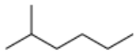  2-methylhexane | 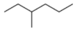  3-methylhexane | 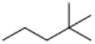  2,2-dimethylpentane | 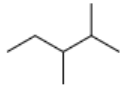  2,3-dimethylpentane |
|---|---|---|---|
| 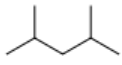  2,4-dimethylpentane | 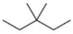  3,3-dimethylpentane | 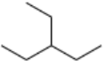  3-ethylpentane | 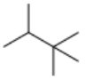  2,2,3-trimethylbutane |

One correct branched-chain isomer; **[1 mark]**

- Cycloalkane: | 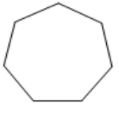  Cycloheptane | 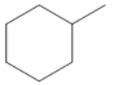  Methylcyclohexane | 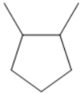  Any dimethylcyclopentane |
|---|---|---|
| 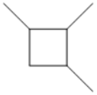  Any trimethylcyclobutane | 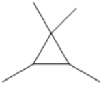  Any tetramethylcyclopropane | Any other ring structure with three or more carbon atoms **AND **additional carbons to give a total of 7 carbon atoms | One correct cyclic isomer; **[1 mark]**

ii) The equation for the reforming of heptane into a cycloalkane is:

- C7H16 → C7H14 + H2; **[1 mark]**

iii) A reason for adding cycloalkanes to petrol is:

- To burn more efficiently / smoothly
**OR**
To prevent pre-ignition / knocking / pinking
**OR**
To increase the (research) octane number / RON; **[1 mark]**

**[Total: 4 marks]**

- *For part (i)*

  - *To draw branched-chain isomers of straight chain alkanes, take the methyl group off the end of the chain and place it elsewhere on the chain*
  
    - *This is why 2-methylhexane and 3-methylhexane were the most common correct answers *
  - *To draw cyclic isomers of heptane, draw a skeletal ring containing 7 or fewer carbons*
  - *Then add methyl groups to ensure that you have 7 carbons in total*
  
    - *The most common correct answers were cycloheptane and methylcyclohexane*
- *For part (ii)*

  - *(Most) cyclic isomers of heptane will have the molecular formula C**7**H**14**  C**7**H**16** → C**7**H**14** *
  - *To balance the equation, a hydrogen molecule is needed as a product C**7**H**16** → C**7**H**14** + H**2*
- *For part (iii)*

  - *The main reason for petrol additives are to improve efficiency / reduce knocking*

### 21((c)) — 9 marks
i) The type and mechanism of this reaction are:

- Type: (Free) radical; **[1 mark]**
- Mechanism: Substitution; **[1 mark]**

ii) The mechanism for the reaction to produce C7H15Cl, C14H30 and HCl as the **only **products is:

- Initiation (step); **[1 mark]**
- Example initiation equation Cl2 → 2Cl• **OR **1⁄2Cl2 → Cl•; **[1 mark]**
- Propagation / propagating (step); **[1 mark]**
- Propagation step 1: C7H16 + Cl• → C7H15• + HCl; **[1 mark]**
- Propagation step 2: C7H15• + Cl2 → C7H15Cl + Cl•; **[1 mark]**
- Termination / terminating (step); **[1 mark]**
- 2C7H15• → C14H30; **[1 mark]**

**[Total: 7 marks]**

- *"The presence of ultraviolet radiation" is a good indicator for a free radical substitution reaction*
- *Initiation step:*

  - *Since the reaction is with chlorine, the initiation step will be the homolytic fission of the chlorine molecule to form two chlorine radicals, Cl**2** → 2Cl•*
- *Propagation steps:*

  - *Write the overall reaction equation twice (in pencil) 1) C**7**H**16** + Cl**2** → C**7**H**15**Cl + HCl 2) C**7**H**16** + Cl**2** → C**7**H**15**Cl + HCl*
  - *Remove a chlorine atom from both sides of equation 1 and replace it with a radical symbol Do not form hydrogen radicals 1) C**7**H**16** + Cl• → C**7**H**15**• + HCl*
  - *Remove a hydrogen atom from both sides of equation 2 and replace it with a radical symbol 2) C**7**H**15**• + Cl**2** → C**7**H**15**Cl + Cl•*
  - *You can double-check that your equations are correct - when the two equations are combined, you should get the overall equation again*
- *Termination step:*

  - *There are three possible termination steps (but not all of them will score any marks)*
  - *2Cl• → Cl**2** *
  
    - *This equation will rarely score any marks for a termination step as it is essentially undoing the initiation step *
  - *C**7**H**15**• + Cl• → C**7**H**15**Cl*
  
    - *This would normally be the desired termination step forming the halogenoalkane*
    - *For this question, this equation does not score the mark*
    
      - *This is because the halogenoalkane C**7**H**15**Cl is covered in the propagation steps but the C**14**H**30** has not been included*
  - *2C**7**H**15**• → C**14**H**30*
  
    - *This would normally be an unwanted termination step as it is forming a longer alkane rather than a more reactive halogenoalkane*
    - *For this question, this equation does score the mark*
    
      - *This is because it shows how the C**14**H**30** mentioned in the question is formed*
  - *Tip:** It can be beneficial to write all three termination equations*
  
    - *As long as they are correctly written, any unnecessary equations will be ignored*
    - *The exception to this would be when the question gives a clear indication of what product the examiner is asking for*

## Q2 — hard — 5 marks · structured-questions

### 22((a)) — 3 marks
To determine the molecular formula of CxHy:

- Identification of correct algebraic equation for x 
**AND **
Solves equation to obtain x From equation 1 mol of CxHy gives x mol of CO2 so 25 mol will give 25x mol CO2 and 25 cm3 will give 25x cm3 CO2 25x = 100 and x = 4; **[1 mark] **
- Identification of correct algebraic equation for x and y Change in volume is (25 + 25(x + $\frac{y}{4}$) − 25x = 75; **[1 mark] **
- Solves equation to obtain y and gives the formula of the hydrocarbon $\frac{25y}{4}$ = 50 therefore y = 8 and C4H8;** [1 mark] **

**Final answer:** **[Total: 3 marks] **

- *In order to work out the formula of the cyclic hydrocarbon, you need to work out x and y*
- *CO**2** reacts with KOH to give potassium carbonate K**2**CO**3** and water in a neutralisation reaction*

  - *CO**2 **+ 2KOH → K**2**CO**3 **+ H**2**O*
  - *Therefore, the volume of CO**2** is 100 cm**3*
  - *As the volume of the hydrocarbon gas is 25 cm**3** we know x to be *$\frac{100}{25}$* or 4*
- *To work out y*

  - *You know the total volume of CO**2** is 100 cm**3** and the hydrocarbon has a volume of 25 cm**3** so we can use this in our equation *
  - *You also need to include the fact that the overall volume decreased by 75 cm**3*
  - *As you know x you can include this in 4 + (*$\frac{y}{4}$*)*
  - *Finally, we must include in the volume of oxygen the 25 cm**3** of the hydrocarbon*
  
    - *Imagine the 25 cm**3** represents 1 mole of the hydrocarbon *
    - *(25 + 25(4 + (*$\frac{y}{4}$*) − (25 x 4) = 75) so y = 8*

### 22((b)) — 2 marks
**Two** possible structures for CxHy

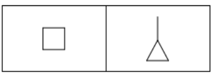

- Structure of cyclobutane;** [1 mark] **
- Structure of methylcyclopropane; **[1 mark] **

**Final answer:** **[Total: 2 marks] **

- *If the bromine water turned colourless you would expect C**x**H**y** to be an alkene*

  - *However, as the bromine water turns yellow C**x**H**y**, or C**4**H**8** as you now know, must be saturated*
- *A saturated hydrocarbon with this formula must be cyclic*

  - *Therefore it could be cyclobutane or the branched cyclic hydrocarbon, methylcyclopropane*

## Q3 — easy — 1 marks · multiple-choice-questions

### 11() — 1 marks
**Correct answer: B** — general formula

**Final answer:** **The correct answer is ****B ****because:**

- Alkanes are saturated hydrocarbons which follow the general formula CnH2n+2 whereby the number of carbon atoms is doubled with two more added to identify the number of hydrogen atoms

**A** is incorrect as empirical formula refers to the simplest ratio of atoms of each element in a compound which can differ for different alkanes

**C **is incorrect as  the molecular formula is the actual number of atoms of each element in a compound which is different for each alkane

**D** is incorrect as  the structural formula shows how the atoms are arranged in space which will be different for each alkane

## Q4 — easy — 1 marks · multiple-choice-questions

### 12() — 1 marks
**Correct answer: D** — hexene and propane

**Final answer:** **The correct answer is ****D**** because:**

- Cracking is used to break down long chain alkanes into shorter, more useful alkanes

  - Alkenes are also formed
- The number of carbon and hydrogen atoms in the original alkane, must be the same as that in the products
- Hexene has the formula C6H12 and propane, C3H8
- The cracking equation would be: C10H22 →  C6H12 + C3H8

  - There are only 9 carbon atoms on the right hand side
  - There are only 20 hydrogen atoms on the right hand side
  - Doubling the number of propane molecules would result in too many carbon and hydrogen atoms on the right hand side

**A** is incorrect as  C10H22 → C5H10 + C5H12

**B** is incorrect as C10H22 → C2H4 + C4H8 + C4H10

**C** is incorrect as C10H22 → C3H6 + C3H8 + C4H8 

## Q5 — easy — 1 marks · multiple-choice-questions

### 15() — 1 marks
**Correct answer: A** — hydrogen chloride

**Final answer:** **The correct answer is ****A ****because:**

- Alkanes are saturated hydrocarbons, consisting of carbon and hydrogen atoms
- During complete combustion, carbon dioxide and water are produced
- During incomplete combustion, there is insufficient oxygen for the fuel to burn in so carbon monoxide and carbon particulates are produced
- Sulfur impurities can be found within alkane fuels which will also undergo combustion forming sulfur dioxide
- Hydrogen and chlorine will not react during combustion so HCl will not be formed

## Q6 — medium — 2 marks · multiple-choice-questions

### 10((a)) — 1 marks
**Correct answer: B** — C2H6 + Br2 → C2H5Br + HBr

**Final answer:** **The correct answer is ****B**** because:**

- When ethane and bromine the following reactions occur:

  - Initiation:
  
    - Br- Br →  2Br•
  - Propagation:
  
    - C2H6 + Br•  →   •CH2CH3 + **HBR**
    - •CH2CH3  + Br2    →   CH3CH2Br + Br •
  - Termination:
  
    - •CH2CH3 +   Br •   →  **CH****3****CH****2****Br**
    - •CH2CH3   +  •CH2CH3
    - Br •  +  Br •  → Br2
  - As shown above, C2H5Br and HBr are formed during these reactions

**A** is incorrect as  hydrogen is not produced

**C** is incorrect as CH3Br is not a product

**D** is incorrect as CH4 nor CH2Br2 are products

### 10((b)) — 1 marks
**Correct answer: A** — homolytic breaking of a Br–Br bond

**Final answer:** **The correct answer is ****A**** because:**

- Homolytic fission involves breaking a covalent bond so that each atom takes an electron from the bond to form two free radicals
- Heterolytic fission involves the breaking of a covalent bond so that the more electronegative element takes both the electrons in the covalent bond
- UV light is needed for the initiation step:

  - Br-Br   →   2Br•
  - Both bromine atoms have the same electronegativity so each atom will take one electron from the bond

** B** is incorrect as the Br-Br bond does not break heterolytically

**C** and **D **are incorrect as   the C-H bond is not broken by UV light

## Q7 — medium — 2 marks · multiple-choice-questions

### 10((a)) — 1 marks
**Correct answer: B** — 

**Final answer:** **The correct answer is ****B**** because:**

- The Cl-Cl bond is broken by the energy from the UV light
- The bond breaks by homolytic fission reaction in which both Cl atoms receive one electron from the covalent bond, forming two chlorine free radicals
- In homolytic fission, single-headed (or fishhook) arrows are used to show the movement of a **single electron**
- The direction of the arrowhead shows the direction of movement of electrons

**A** is incorrect as the curly arrow indicates heterolytic fission

**C** is incorrect as both arrows are full arrows rather than half arrows

**D** is incorrect as the arrows are in the wrong direction

### 10((b)) — 1 marks
**Correct answer: D** — HCl

**Final answer:** **The correct answer is ****D**** because:**

- In the termination step, two radicals react to form a single, unreactive molecule
- The formation of HCl in the termination step would require the two free radicals **·**H and **·**Cl, however the hydrogen free radical is not produced at any stage during the reaction

**A** is incorrect as ethane could be formed by the combination of two methyl radicals

**B** is incorrect as chloromethane could be formed by the combination of a methyl radical and a chlorine radical

**C** is incorrect as dichloromethane could be formed from the combination of CH2Cl radical and a chlorine radical

## Q8 — medium — 1 marks · multiple-choice-questions

### 13() — 1 marks
**Correct answer: B** — C7H14

**Final answer:** **The correct answer is ****B**** because:**

- Using the information from the question, you can build the unbalanced cracking equation

  - C20H42 → C2H4 + C4H10 + 2**E**
- From this, you can deduce that 2**E** = C20H42 – C2H4 – C4H10 = C14H28
- Therefore, **E** is C7H14

**A** is incorrect as this would be correct if ethane was formed instead of ethene

**C** is incorrect as this would be correct if only one molecule of E was produced AND ethane was formed instead of ethene

**D** is incorrect as this would be correct if only one molecule of E was produced

## Q9 — medium — 1 marks · multiple-choice-questions

### 15() — 1 marks
**Correct answer: A** — burn to produce greenhouse gases

**Final answer:** **The correct answer is ****A**** because:**

- Carbon dioxide is a product of combustion when petrol and bioethanol are burned
- Water vapour is produced when hydrogen is burned
- Carbon dioxide and water vapour are greenhouse gases

**B** is incorrect as they are not all carbon neutral

**C **is incorrect as they are not all sustainable

**D** is incorrect as they do not all biodegrade rapidly

## Q10 — medium — 4 marks · multiple-choice-questions

### 16((a)) — 1 marks
**Correct answer: D** — C5H10 + Br2 → C5H9Br + HBr

**Final answer:** **The correct answer is ****D**** because:**

- In the initiation step, UV light causes the homolytic fission of the bromine molecule to form two bromine radicals:

  - Br2 → 2Br•
- The propagation step involves a bromine free radical attacking cyclopentane:

  - C5H10 + Br• → C5H9• + HBr
- In the termination step, two free radicals react:

  - C5H9• + Br• → C5H9Br
- This gives the overall reaction:

  - C5H10 + Br2 → C5H9Br + HBr

**A** is incorrect as C5H8 is the formula of cyclopentene and the reaction is not addition

**B** is incorrect as the reaction is not addition and this product is not formed

**C** is incorrect as these products are not formed

### 16((b)) — 1 marks
**Correct answer: A** — only the initiation step involves homolytic bond fission

**Final answer:** **The correct answer is ****A**** because:**

- The propagation step involves homolytic fission:

  - C5H10 + Br• → C5H9• + HBr
  
    - A C-H bond breaks homolytically as each atom gets an electron from the covalent bond

**B** is incorrect as not all of the bromine is converted to radicals in the initiation step

**C** is incorrect as many more propagation than termination reactions occur

**D** is incorrect as additional substitution products are likely to form

### 16((c)) — 1 marks
**Correct answer: D** — $H^{\bullet}$

**Final answer:** **The correct answer is ****D**** because:**

- Bromine radicals are formed in the initial step:

  - Br2 → 2Br•
- C5H9• radicals are formed in the propagation step involving a bromine free radical attacking cyclopentane:

  - C5H10 + Br• → C5H9• + HBr
- C5H8Br• are formed in secondary propagation reactions:

  - C5H9• + Br2 → C5H9Br + Br•
  - C5H9Br + Br• → C5H8Br• + HBr
- Hydrogen radicals are not usually formed in a propagation step in this reaction system

**A** is incorrect as  C5H9● radicals form in propagation reactions

**B** is incorrect as  Br● radicals form in propagation reactions

**C** is incorrect as C5H8Br● radicals may form in secondary propagation reactions

### 16((d)) — 1 marks
**Correct answer: C** — 

**Final answer:** **The correct answer is ****C**** because:**

- One reaction that can occur in the termination step is:

  - C5H9• + C5H9• → C10H18
- Structure **C** contains 10 C atoms and 18 H atoms

**A** is incorrect as the molecule does not contain 10 carbon atoms

**B** is incorrect as  the molecule does not contain 10 carbon atoms

**D** is incorrect as  the molecule does not contain 18 hydrogen atoms

## Q11 — medium — 1 marks · multiple-choice-questions

### 1() — 1 marks
**Correct answer: B** — CH3• + Cl2 → CH3Cl + Cl•

**Final answer:** **The correct answer is B**

- A propagation step uses one radical AND produces one radical, allowing the chain to continue
- In option B, a methyl radical reacts with a chlorine molecule to produce chloromethane and a chlorine radical
- The Cl• produced can then react with another CH4 molecule, propagating the chain

**A** is incorrect as this is the initiation step (uses UV light to produce radicals from a non-radical)

**C** is incorrect as this is the overall equation, not a single propagation step (no radicals shown)

**D** is incorrect as this is a termination step (two radicals combine to form a non-radical product)

> **[exam-tip]**
> Quick check for propagation: count radicals on each side. Propagation = 1 radical in, 1 radical out. Initiation = 0 radicals in, 2 out. Termination = 2 radicals in, 0 out.
