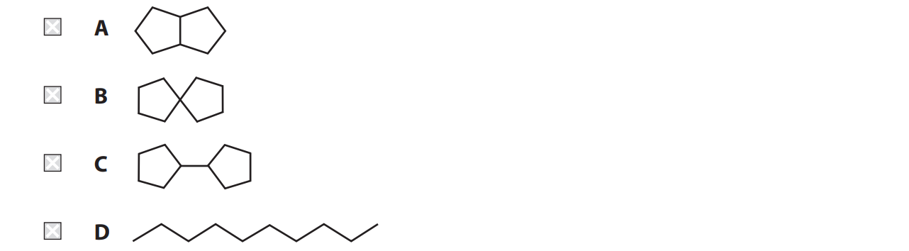

# Exam Questions — Alkanes
**1. Structure, Bonding & Introduction to Organic Chemistry** · Edexcel International A Level (IAL) Chemistry (YCH11)
> Source: [https://www.savemyexams.com/international-a-level/chemistry/edexcel/17/topic-questions/1-structure-bonding-and-introduction-to-organic-chemistry/1-9-alkanes/structured-questions/](https://www.savemyexams.com/international-a-level/chemistry/edexcel/17/topic-questions/1-structure-bonding-and-introduction-to-organic-chemistry/1-9-alkanes/structured-questions/) · 11 questions · total 34 marks

## Q1 — medium — 15 marks · structured-questions

### 21((a)) — 2 marks — command: give — structured — from paper June 2021 · WCH11/01
Heptane, C7H16 , is an alkane found in crude oil.

Heptane can undergo incomplete combustion.

i) Give a reason why incomplete combustion sometimes occurs.

**(1)**

i) Write the equation for the incomplete combustion of heptane, forming carbon monoxide and water as the **only** products. State symbols are not required.

**(1)**

### 21((b)) — 4 marks — command: multiple — structured — from paper June 2021 · WCH11/01
Heptane is reformed into branched-chain and cyclic hydrocarbons that are used in petrol.

i) Draw the **skeletal** formulae of a branched-chain alkane and a cycloalkane, each containing **seven** carbon atoms.

**(2)**

| Branched-chain alkane |
|---|
| Cycloalkane |

ii) Write the equation for the reforming of heptane into a cycloalkane.

Use molecular formulae.

**(1)**

iii) Give a reason for adding cycloalkanes to petrol.

**(1)**

### 21((c)) — 9 marks — command: multiple — structured — from paper June 2021 · WCH11/01
Heptane, C7H16 , reacts with chlorine in the presence of ultraviolet radiation.

i) State the type and mechanism of this reaction.

**(2)**

ii) Give the mechanism for the reaction to produce C7H15Cl, C14H30 and HCl as the **only **products.

Include the name of each of the steps in your mechanism. 
Curly half-arrows are **not **required.

**(7)**

## Q2 — hard — 5 marks · structured-questions

### 22((a)) — 3 marks — command: determine — structured — from paper Jan 2021 · WCH15/01
Using excess oxygen, 25 cm3 of a gaseous hydrocarbon CxHy was burned completely.

After cooling to room temperature the total gas volume was measured and found to be 75 cm3 less than the total gas volume before the mixture was ignited.

When the product gases were shaken with potassium hydroxide solution, the total gas volume decreased by a further 100 cm3.

All gas volumes were measured at room temperature and pressure.

A general equation for the combustion of a hydrocarbon is

`straight C subscript straight x straight H subscript straight y space plus space open parentheses straight x plus y over 4 close parentheses space straight O subscript 2 space rightwards arrow space xCO subscript 2 plus space open parentheses y over 2 close parentheses space straight H subscript 2 straight O`

Determine the molecular formula of CxHy. You **must** show your working.

### 22((b)) — 2 marks — command: suggest — structured — from paper Jan 2021 · WCH15/01
When CxHy was added to a little bromine water and the mixture shaken, the bromine water remained yellow.

Suggest **two** possible structures for CxHy.

## Q3 — easy — 1 marks · multiple-choice-questions

### 11() — 1 mark — multiple_choice — from paper Jan 2022 · WCH11/01
All alkanes have the same
- **A.** empirical formula
- **B.** general formula
- **C.** molecular formula
- **D.** structural formula

## Q4 — easy — 1 marks · multiple-choice-questions

### 12() — 1 mark — multiple_choice — from paper Jan 2022 · WCH11/01
A single molecule of decane, C10H22 , is cracked.

Which of these mixtures could **not **be formed?
- **A.** pentene and pentane
- **B.** ethene, butene and butane
- **C.** propene, propane and butene
- **D.** hexene and propane

## Q5 — easy — 1 marks · multiple-choice-questions

### 15() — 1 mark — multiple_choice — from paper Jan 2022 · WCH11/01
Which pollutant **cannot** form when alkane fuels are burned in car engines?
- **A.** hydrogen chloride
- **B.** sulfur dioxide
- **C.** carbon particulates
- **D.** carbon monoxide

## Q6 — medium — 2 marks · multiple-choice-questions

### 10((a)) — 1 mark — multiple_choice — from paper Jan 2022 · WCH11/01
Ethane reacts with bromine in the presence of ultraviolet radiation.

What is the equation for the reaction?
- **A.** C2H6 + Br2 → C2H4Br2 + H2
- **B.** C2H6 + Br2 → C2H5Br + HBr
- **C.** C2H6 + Br2 → 2CH3Br
- **D.** C2H6 + Br2 → CH4 + CH2Br2

### 10((b)) — 1 mark — multiple_choice — from paper Jan 2022 · WCH11/01
The ultraviolet radiation is needed for
- **A.** homolytic breaking of a Br–Br bond
- **B.** heterolytic breaking of a Br–Br bond
- **C.** homolytic breaking of a C–H bond
- **D.** heterolytic breaking of a C–H bond

## Q7 — medium — 2 marks · multiple-choice-questions

### 10((a)) — 1 mark — multiple_choice — from paper Oct 2021 · WCH11/01
Methane reacts with excess chlorine in UV light.

Which process occurs in the initiation step?

- **A.** 
- **B.** 
- **C.** 
- **D.** 

### 10((b)) — 1 mark — multiple_choice — from paper Oct 2021 · WCH11/01
Which of these molecules could **not** be formed in a termination step?
- **A.** C2H6
- **B.** CH3Cl
- **C.** CH2Cl2
- **D.** HCl

## Q8 — medium — 1 marks · multiple-choice-questions

### 13() — 1 mark — multiple_choice — from paper June 2021 · WCH11/01
When C20H42 is cracked, each molecule produces one molecule of ethene, one molecule of butane and two molecules of hydrocarbon **E**.

What is the molecular formula of **E**?
- **A.** C7H13   
- **B.** C7H14
- **C.** C14H26
- **D.** C14H28

## Q9 — medium — 1 marks · multiple-choice-questions

### 15() — 1 mark — multiple_choice — from paper Jan 2021 · WCH11/01
Petrol, bioethanol and hydrogen are fuels.

All three of these fuels
- **A.** burn to produce greenhouse gases
- **B.** are overall carbon neutral
- **C.** are overall sustainable
- **D.** biodegrade rapidly

## Q10 — medium — 4 marks · multiple-choice-questions

### 16((a)) — 1 mark — multiple_choice — from paper Jan 2021 · WCH11/01
Cyclopentane undergoes free radical substitution with bromine.

Which of these is an overall equation for this reaction?
- **A.** C5H8 + Br2 → C5H8Br2
- **B.** C5H10 + Br2 → C5H10Br2
- **C.** C5H10 + Br2 → C5H8Br2 + H2
- **D.** C5H10 + Br2 → C5H9Br + HBr

### 16((b)) — 1 mark — multiple_choice — from paper Jan 2021 · WCH11/01
Which statement is **not** correct about this reaction system?
- **A.** only the initiation step involves homolytic bond fission
- **B.** only some bromine is converted to free radicals in the initiation step
- **C.** propagation forms more product than termination
- **D.** further substitution reactions are likely to occur

### 16((c)) — 1 mark — multiple_choice — from paper Jan 2021 · WCH11/01
Which free radical is **least **likely to form in a propagation step in this reaction system?
- **A.** C5$H_{9}^{\bullet}$
- **B.** B$r^{\bullet}$
- **C.** C5H8B$r^{\bullet}$
- **D.** $H^{\bullet}$

### 16((d)) — 1 mark — multiple_choice — from paper Jan 2021 · WCH11/01
Which alkane could be formed in a termination step in this reaction system?

- **A.** 
- **B.** 
- **C.** 
- **D.** 

## Q11 — medium — 1 marks · multiple-choice-questions

### 1() — 1 mark — multiple_choice
Which of these is a correct propagation step in the free radical substitution of methane by chlorine?
- **A.** Cl2 → 2Cl•
- **B.** CH3• + Cl2 → CH3Cl + Cl•
- **C.** CH4 + Cl2 → CH3Cl + HCl
- **D.** 2Cl• → Cl2
